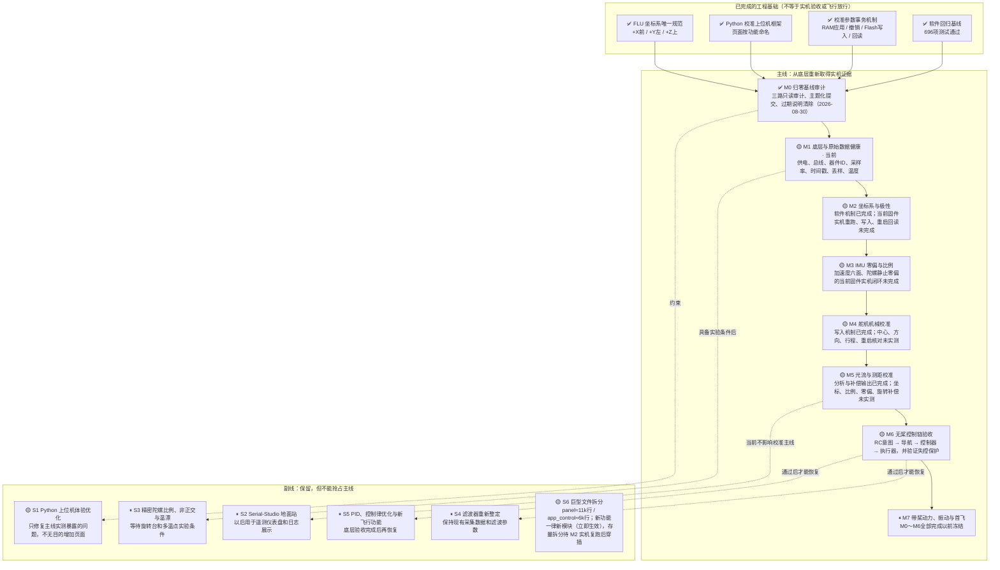

# drone-H743 归零检查 Pipeline

> 最后更新：2026-08-30  
> 当前主线位置：**M1 · 底层与原始数据健康**（作业单：`doc/m1-baseline-runbook.md`）  
> 本文件是工程推进状态的唯一入口。代码已经实现、测试通过、固件已经烧录和实机验收通过是不同状态，不得互相替代。

## 状态定义

- `✅ 完成`：该节点规定的实现、验证和证据全部满足，允许作为下一节点的前置条件。
- `🟡 未完成`：实现或验证证据至少有一项缺失；即使软件测试通过，也不能越级宣告完成。
- `⏸ 冻结`：当前不投入实现；只有作者明确决定解冻并更新本图后才能恢复。

## 主线、副线与当前状态

## 主线验收门

| 节点 | 完成条件 | 当前缺口 |
|---|---|---|
| M0 归零基线审计 | 当前混合改动完成只读审计；按主题形成可解释的提交/变更单元；过期说明和状态矛盾清除 | 无（2026-08-30 完成：三路审计报告、7 个主题提交、references 过期条目修订、被污染证据还原并加写保护） |
| M1 底层与原始数据健康 | 当前固件实测确认供电、器件 ID、总线、采样率、时间戳、丢样和温度合理，并保存证据 | 待实机（USB 尚未连接飞控）；作业单已备好：`doc/m1-baseline-runbook.md` |
| M2 坐标系与极性 | 当前固件完成 V0 正基向量与正滚转/俯仰/偏航验证；RAM 预览、Flash 提交、重启回读一致 | 有历史 V0 证据，但当前改动固件尚未重新闭环 |
| M3 IMU 零偏与比例 | 当前固件完成六面加速度计、静止陀螺零偏和静止漂移验证；无夹具项目明确标为未验证 | 软件流程已具备，缺当前固件实机证据 |
| M4 舵机机械校准 | 拆桨固定条件下确认两路中心、物理方向和安全行程；写入后重启回读一致 | 目标端机制已实现，缺实机动作与持久化证据 |
| M5 光流与测距校准 | 完成坐标、比例、零偏和旋转补偿验收，证据带 FLU 契约与姿态来源 | 目标端补偿量已可导出，缺实机采样与判定 |
| M6 无桨控制链验收 | RC、导航、控制器、执行器和失控保护端到端方向一致，执行器动作受固件端超时/互锁约束 | 尚未完成当前固件端到端实机验收 |
| M7 带桨动力、振动与首飞 | M0～M6 全部完成；运行时坐标迁移完成；另行批准带桨测试方案 | 冻结 |

## 最近验证证据

每次完成任何软件、构建、烧录或实机验证，都必须在同一任务中更新本表；即使节点状态不变，也要更新证据与结论。只有满足对应验收门时才能修改图中的状态。

| 日期 | 范围 | 证据 | 结果 | 对状态的影响 |
|---|---|---|---|---|
| 2026-08-30 | M0 归零基线审计收口 | 三个并行只读审计报告（固件C/上位机/测试文档数据）；工作区 58 个文件拆成 7 个主题提交；全量 `696 passed`；Debug 构建零警告 | 通过 | **M0 置 ✅，当前位置移至 M1**；M1 作业单 `doc/m1-baseline-runbook.md` |
| 2026-08-30 | 审计发现的缺陷修复 | ①历史验收证据被面板 autosave 覆盖（`target_state_at_save`→`{}`）：已还原并加只读守卫+回归测试；②500Hz 控制环内 4 处同步 USB 阻塞写（最坏~30ms）：改事件通告由通信任务补发+契约测试；③协议 ID 0x1022/0x1023 补登记；④反向通道阈值边界改严格镜像；⑤RC 配置发布前读取回退出厂默认；⑥App/Driver 舵机判据副本加锁步契约测试 | 通过 | 不改变节点状态；提高 M1 一次跑通概率 |
| 2026-08-30 | 治理约束新增 | 作者要求限制单文件规模：新功能一律新模块，panel/app_control 拆分立为副线 S6（SKILL.md 已写入守则） | 生效 | 新增 S6 🟡；对巨文件的追加自即日起被守则禁止 |
| 2026-08-29 | 治理文档实证复核 | 全量回归复跑 `682 passed`；证据表原引用的 `quick_validate.py` 证实全仓不存在，已移除该虚假引用；迁移掩码引用与 `drv_frame_contract.h:54` 核对一致；契约测试并入并刷新索引后全量 `688 passed` | 通过 | 新增 `tests/test_pipeline_contract.py` 机械校验本文件（节点/验收门/当前指针/证据日期/M7 冻结联动）；M0 保持当前节点 |
| 2026-08-29 | Pipeline 治理入口 | SKILL.md「Pipeline Governance」+ `tests/test_pipeline_contract.py` 一致性契约 | 通过 | 建立每次任务先核对主线、验证后回写状态的强制流程；M0 保持当前节点 |
| 2026-08-29 | 全量软件回归 | `python -m pytest tests -q` | `682 passed` | 仅确认软件回归基线；不提升 M1～M7 |
| 2026-08-29 | Debug 固件构建 | `cmake --build --preset Debug` | 构建通过 | 仅确认可构建；不代表已烧录或实机通过 |
| 2026-08-28 | 历史 V0 坐标证据 | `R_FLU<-legacy_intermediate_v1 = diag(-1,-1,+1)` | 历史证据有效 | 当前固件改动后仍须重跑，M2 保持未完成 |
| 2026-08-29 | 运行时 FLU 迁移 | `DRV_FRAME_RUNTIME_MIGRATION_DONE_MASK = 0U` | 未完成 | 禁止宣称运行时 FLU 完成或自由飞行放行 |

## 推进与更新规则

1. 每个工程任务开始前先读取本文件，指出它属于哪个主线节点或副线节点。
2. 默认只推进“当前主线位置”或修复其直接暴露的阻塞问题，不得无理由跨越前置节点。
3. 请求与主线不一致、试图提前推进后续节点或触碰冻结副线时，必须先提醒作者并说明代价；只有作者明确决定后才能作为例外执行。
4. Python 上位机是当前校准与实机验收工作台；Serial-Studio 暂不扩张校准功能。
5. 一次任务只处理一个可验证边界。没有实机证据时，只能写“实现完成”或“待实机”，不能写“校准完成”“验收完成”或“可以飞”。
6. 完成验证后必须更新本文件：更新 Mermaid 节点说明或状态、主线验收门缺口、最近验证证据和“最后更新”日期。
7. 若验证失败，节点保持未完成，并记录失败证据和下一阻塞；不得通过降低判据、翻转符号或隐藏异常来推进状态。
8. 只有当前主线节点完成后，才能把“当前主线位置”移动到下一节点。解冻副线也必须在本图中显式记录。
