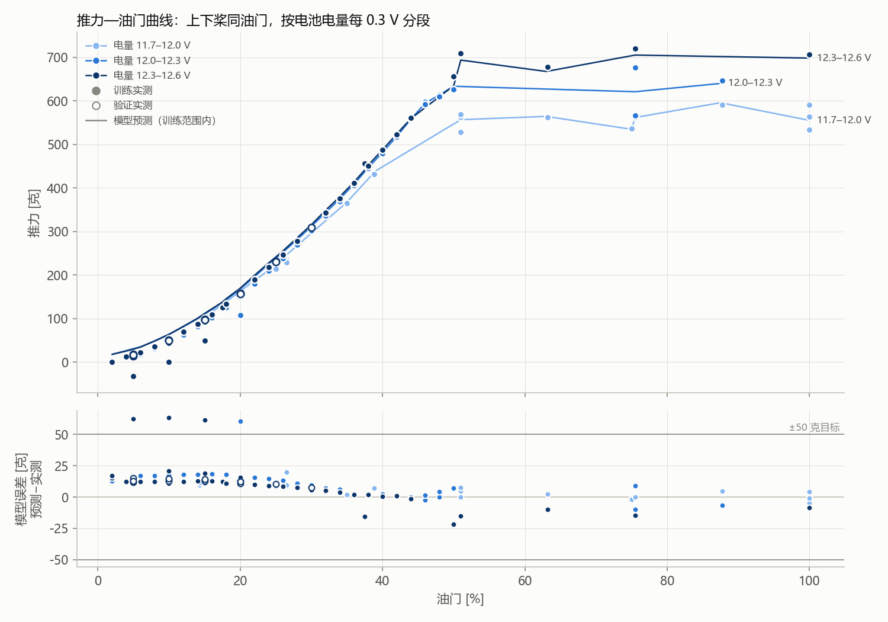

# 推力实验库整轮建模报告

## 首页四个问题

1. **用了几轮？** 训练 17 轮，选择验证 3 轮；run_id 无重叠。
2. **误差多少克？** 平均相差 16.93 克力；95%的点误差不超过 33.50 克力；最大相差 35.21 克力（目标：每点不超过 50 克力）；RMSE 18.81 克力（详细指标）；覆盖 91%
3. **适用范围？** 仅 eRPM 候选；上路 eRPM 3424～47809，下路 eRPM 3443～45612，实际带载电压 11.34～12.44 V。支持域：训练 eRPM/V 三维联合支持域；域外拒绝，不外推。
4. **具体缺口与下一步？** 验证点部分落在训练联合支持域外；在被拒绝的 eRPM/V 区域补训练工况。

## 候选比较

| 候选 | 可用性 | 不可用原因 | 选择验证平均误差 [克力] | 覆盖 |
|---|---|---|---:|---:|
| 仅 eRPM | 可用 | -- | 16.93 | 91% |
| 连续实测电压 | 可用 | -- | 17.29 | 91% |

- 选择：`{'selected_candidate': 'erpm_only', 'basis': 'training_only_default_simpler_candidate', 'minimum_validation_coverage': 1.0, 'validation_is_final_test': False, 'coefficients_refit_after_selection': False}`

## 推力—油门曲线（按电池电量分段）

只取上下桨油门相差不超过 0.6% 的稳态点：109 / 465 个，其中 108 个在模型训练范围内。电量段按“带载电压 + 负载压降估计”（k=0.0035，与自动补数同一口径）每 0.3 V 一段，所以同一块电池、同一时刻的高低油门点落在同一段；模型本身不分段，直接用每个点的实测电压。实心点为训练轮、空心点为验证轮；线为模型在这些实测工况上的预测，训练范围外不画、不外推。

| 电量段 | 油门 [%] | 点数 | 实测平均 [克] | 模型 [克] | 误差 [克] |
|---|---:|---:|---:|---:|---:|
| 11.7–12.0 V | 14.5 | 2 | 85.7 | 96.2 | 10.5 |
| 11.7–12.0 V | 25 | 1 | 214.4 | 223.2 | 8.8 |
| 11.7–12.0 V | 26.5 | 2 | 231.5 | 246.1 | 14.6 |
| 11.7–12.0 V | 35 | 1 | 365.5 | 367.3 | 1.9 |
| 11.7–12.0 V | 39 | 1 | 431.8 | 438.8 | 7.0 |
| 11.7–12.0 V | 51 | 3 | 552.8 | 556.9 | 4.1 |
| 11.7–12.0 V | 63 | 1 | 561.9 | 564.4 | 2.5 |
| 11.7–12.0 V | 75 | 2 | 536.2 | 534.7 | -1.5 |
| 11.7–12.0 V | 75.5 | 1 | 562.0 | 562.0 | 0.0 |
| 11.7–12.0 V | 87.5 | 1 | 591.0 | 595.8 | 4.8 |
| 11.7–12.0 V | 100 | 4 | 555.5 | 555.2 | -0.3 |
| 12.0–12.3 V | 2 | 2 | 2.5 | 17.4 | 14.9 |
| 12.0–12.3 V | 6 | 1 | 18.0 | 35.1 | 17.1 |
| 12.0–12.3 V | 8 | 1 | 30.9 | 48.1 | 17.2 |
| 12.0–12.3 V | 10 | 2 | 47.7 | 63.2 | 15.5 |
| 12.0–12.3 V | 12 | 1 | 62.7 | 80.9 | 18.2 |
| 12.0–12.3 V | 14 | 1 | 81.3 | 99.4 | 18.0 |
| 12.0–12.3 V | 15 | 1 | 96.6 | 110.3 | 13.7 |
| 12.0–12.3 V | 16 | 1 | 101.9 | 120.1 | 18.3 |
| 12.0–12.3 V | 18 | 1 | 125.1 | 142.9 | 17.8 |
| 12.0–12.3 V | 20 | 3 | 137.8 | 167.7 | 29.9 |
| 12.0–12.3 V | 22 | 2 | 180.3 | 195.8 | 15.4 |
| 12.0–12.3 V | 24 | 1 | 210.4 | 225.1 | 14.7 |
| 12.0–12.3 V | 26 | 1 | 239.0 | 252.3 | 13.3 |
| 12.0–12.3 V | 28 | 1 | 270.0 | 281.0 | 11.0 |
| 12.0–12.3 V | 30 | 1 | 302.4 | 311.8 | 9.5 |
| 12.0–12.3 V | 32 | 1 | 335.8 | 343.1 | 7.3 |
| 12.0–12.3 V | 34 | 1 | 369.2 | 375.1 | 5.9 |
| 12.0–12.3 V | 36 | 1 | 405.9 | 408.6 | 2.7 |
| 12.0–12.3 V | 38 | 1 | 445.4 | 446.7 | 1.3 |
| 12.0–12.3 V | 40 | 1 | 479.2 | 481.6 | 2.4 |
| 12.0–12.3 V | 42 | 1 | 516.8 | 518.3 | 1.5 |
| 12.0–12.3 V | 44 | 1 | 558.2 | 558.2 | 0.0 |
| 12.0–12.3 V | 46 | 2 | 595.3 | 594.7 | -0.6 |
| 12.0–12.3 V | 48 | 2 | 611.6 | 613.9 | 2.3 |
| 12.0–12.3 V | 50 | 1 | 626.5 | 633.6 | 7.1 |
| 12.0–12.3 V | 75.5 | 2 | 621.7 | 621.1 | -0.6 |
| 12.0–12.3 V | 87.5 | 1 | 646.8 | 640.1 | -6.7 |
| 12.3–12.6 V | 2 | 2 | 1.5 | 17.7 | 16.3 |
| 12.3–12.6 V | 4 | 1 | 12.9 | 25.3 | 12.3 |
| 12.3–12.6 V | 5 | 6 | 8.5 | 29.6 | 21.1 |
| 12.3–12.6 V | 6 | 1 | 22.1 | 34.4 | 12.3 |
| 12.3–12.6 V | 8 | 1 | 36.3 | 48.7 | 12.4 |
| 12.3–12.6 V | 10 | 7 | 42.8 | 63.8 | 21.0 |
| 12.3–12.6 V | 12 | 1 | 69.7 | 81.8 | 12.2 |
| 12.3–12.6 V | 14 | 1 | 87.7 | 100.4 | 12.7 |
| 12.3–12.6 V | 15 | 6 | 89.6 | 111.6 | 22.0 |
| 12.3–12.6 V | 16 | 1 | 109.2 | 122.1 | 12.9 |
| 12.3–12.6 V | 17.5 | 1 | 125.5 | 137.6 | 12.1 |
| 12.3–12.6 V | 18 | 1 | 134.2 | 145.0 | 10.8 |
| 12.3–12.6 V | 20 | 5 | 157.1 | 169.5 | 12.4 |
| 12.3–12.6 V | 22 | 1 | 189.2 | 199.0 | 9.8 |
| 12.3–12.6 V | 24 | 1 | 218.5 | 227.6 | 9.1 |
| 12.3–12.6 V | 25 | 2 | 231.0 | 241.2 | 10.6 |
| 12.3–12.6 V | 26 | 1 | 246.9 | 255.3 | 8.4 |
| 12.3–12.6 V | 28 | 1 | 277.7 | 285.3 | 7.6 |
| 12.3–12.6 V | 30 | 2 | 308.8 | 315.5 | 6.6 |
| 12.3–12.6 V | 32 | 1 | 343.4 | 348.7 | 5.2 |
| 12.3–12.6 V | 34 | 1 | 376.0 | 379.8 | 3.8 |
| 12.3–12.6 V | 36 | 1 | 411.6 | 413.7 | 2.1 |
| 12.3–12.6 V | 37.5 | 1 | 456.7 | 441.1 | -15.5 |
| 12.3–12.6 V | 38 | 1 | 450.8 | 452.5 | 1.8 |
| 12.3–12.6 V | 40 | 1 | 486.9 | 487.6 | 0.7 |
| 12.3–12.6 V | 42 | 1 | 523.1 | 524.0 | 1.0 |
| 12.3–12.6 V | 44 | 1 | 560.9 | 559.5 | -1.4 |
| 12.3–12.6 V | 50 | 1 | 656.7 | 634.9 | -21.9 |
| 12.3–12.6 V | 51 | 1 | 708.8 | 693.7 | -15.1 |
| 12.3–12.6 V | 63 | 1 | 677.8 | 667.7 | -10.1 |
| 12.3–12.6 V | 75.5 | 1 | 720.0 | 705.3 | -14.7 |
| 12.3–12.6 V | 100 | 1 | 707.1 | 698.4 | -8.7 |

## 选择验证

验证集用于候选选择，因此不是未触碰的最终测试集；系数、缩放和支持域均未使用验证数据，选择后也未重训。

`{'erpm_only': {'status': 'available', 'role': 'candidate_selection_validation_not_final_test', 'points': 41, 'input_points': 45, 'coverage_fraction': 0.9111111111111111, 'rejected': {'outside_training_support_domain': 4}, 'metrics': {'points': 41, 'newton': {'mae': 0.1660068739737443, 'rmse': 0.18448483786132036, 'p95_abs_error': 0.3285443553856062, 'max_abs_error': 0.34528953398179585}, 'gram_force': {'mae': 16.927990085681078, 'rmse': 18.812218021579273, 'p95_abs_error': 33.5022005869085, 'max_abs_error': 35.209733597283055}}, 'predictions': [{'run_id': '2026-09-22/033056-db2f746c::072b10edce6c', 'segment_id': 'dual-001', 'upper_erpm': 7471.777777777777, 'lower_erpm': 7335.0, 'voltage_v': 12.41777777777778, 'actual_thrust_n': 0.17397571548117152, 'predicted_thrust_n': 0.2906972742655264, 'residual_n': 0.11672155878435486}, {'run_id': '2026-09-22/033056-db2f746c::072b10edce6c', 'segment_id': 'dual-002', 'upper_erpm': 12499.666666666666, 'lower_erpm': 12272.333333333334, 'voltage_v': 12.399111111111111, 'actual_thrust_n': 0.5022317824267781, 'predicted_thrust_n': 0.6263518484399443, 'residual_n': 0.12412006601316616}, {'run_id': '2026-09-22/033056-db2f746c::072b10edce6c', 'segment_id': 'dual-003', 'upper_erpm': 17227.88888888889, 'lower_erpm': 16904.666666666668, 'voltage_v': 12.358333333333333, 'actual_thrust_n': 0.9694495843793585, 'predicted_thrust_n': 1.095540540865938, 'residual_n': 0.12609095648657953}, {'run_id': '2026-09-22/033056-db2f746c::072b10edce6c', 'segment_id': 'dual-004', 'upper_erpm': 21495.88888888889, 'lower_erpm': 21272.666666666668, 'voltage_v': 12.324222222222224, 'actual_thrust_n': 1.5559337573221756, 'predicted_thrust_n': 1.6618044868088493, 'residual_n': 0.10587072948667364}, {'run_id': '2026-09-22/033056-db2f746c::072b10edce6c', 'segment_id': 'dual-006', 'upper_erpm': 29820.666666666668, 'lower_erpm': 29481.88888888889, 'voltage_v': 12.19811111111111, 'actual_thrust_n': 3.0265209372384936, 'predicted_thrust_n': 3.0987287444857095, 'residual_n': 0.07220780724721587}, {'run_id': '2026-09-22/033056-db2f746c::072b10edce6c', 'segment_id': 'dual-007', 'upper_erpm': 25961.333333333332, 'lower_erpm': 25577.666666666668, 'voltage_v': 12.231222222222222, 'actual_thrust_n': 2.2616843012552303, 'predicted_thrust_n': 2.3653123616649716, 'residual_n': 0.10362806040974126}, {'run_id': '2026-09-22/033056-db2f746c::072b10edce6c', 'segment_id': 'dual-008', 'upper_erpm': 21443.25, 'lower_erpm': 21268.5, 'voltage_v': 12.292125, 'actual_thrust_n': 1.536238393305439, 'predicted_thrust_n': 1.657975458117178, 'residual_n': 0.12173706481173885}, {'run_id': '2026-09-22/033056-db2f746c::072b10edce6c', 'segment_id': 'dual-009', 'upper_erpm': 17149.0, 'lower_erpm': 16908.444444444445, 'voltage_v': 12.343333333333334, 'actual_thrust_n': 0.9519425941422592, 'predicted_thrust_n': 1.0915756478517231, 'residual_n': 0.13963305370946388}, {'run_id': '2026-09-22/033056-db2f746c::072b10edce6c', 'segment_id': 'dual-010', 'upper_erpm': 12442.875, 'lower_erpm': 12264.375, 'voltage_v': 12.371749999999999, 'actual_thrust_n': 0.4788435376569038, 'predicted_thrust_n': 0.6237936331923235, 'residual_n': 0.1449500955354197}, {'run_id': '2026-09-22/033056-db2f746c::072b10edce6c', 'segment_id': 'dual-011', 'upper_erpm': 7455.111111111111, 'lower_erpm': 7333.222222222223, 'voltage_v': 12.387555555555556, 'actual_thrust_n': 0.1400559218967922, 'predicted_thrust_n': 0.2902632158713015, 'residual_n': 0.1502072939745093}, {'run_id': '2026-09-22/034557-4aee4dd3::a7e82e01217c', 'segment_id': 'grid-006', 'upper_erpm': 7436.75, 'lower_erpm': 7284.875, 'voltage_v': 12.30325, 'actual_thrust_n': 0.16371771338912133, 'predicted_thrust_n': 0.2885252359444417, 'residual_n': 0.12480752255532035}, {'run_id': '2026-09-22/034557-4aee4dd3::a7e82e01217c', 'segment_id': 'grid-007', 'upper_erpm': 7420.777777777777, 'lower_erpm': 12183.555555555555, 'voltage_v': 12.285777777777778, 'actual_thrust_n': 0.3402921227336122, 'predicted_thrust_n': 0.4707372979809076, 'residual_n': 0.13044517524729538}, {'run_id': '2026-09-22/034557-4aee4dd3::a7e82e01217c', 'segment_id': 'grid-008', 'upper_erpm': 7443.777777777777, 'lower_erpm': 16836.555555555555, 'voltage_v': 12.272444444444444, 'actual_thrust_n': 0.6061795369595537, 'predicted_thrust_n': 0.7369500876812036, 'residual_n': 0.1307705507216499}, {'run_id': '2026-09-22/034557-4aee4dd3::a7e82e01217c', 'segment_id': 'grid-009', 'upper_erpm': 7488.75, 'lower_erpm': 21208.5, 'voltage_v': 12.269, 'actual_thrust_n': 0.9306059497907948, 'predicted_thrust_n': 1.0693934298602938, 'residual_n': 0.13878748006949904}, {'run_id': '2026-09-22/034557-4aee4dd3::a7e82e01217c', 'segment_id': 'grid-011', 'upper_erpm': 12391.375, 'lower_erpm': 7341.625, 'voltage_v': 12.286, 'actual_thrust_n': 0.3151258242677824, 'predicted_thrust_n': 0.44742686700063744, 'residual_n': 0.13230104273285503}, {'run_id': '2026-09-22/034557-4aee4dd3::a7e82e01217c', 'segment_id': 'grid-012', 'upper_erpm': 12381.125, 'lower_erpm': 12219.375, 'voltage_v': 12.286875, 'actual_thrust_n': 0.4862292991631799, 'predicted_thrust_n': 0.6193693300288372, 'residual_n': 0.1331400308656573}, {'run_id': '2026-09-22/034557-4aee4dd3::a7e82e01217c', 'segment_id': 'grid-013', 'upper_erpm': 12417.0, 'lower_erpm': 16790.777777777777, 'voltage_v': 12.269222222222222, 'actual_thrust_n': 0.7309168423988842, 'predicted_thrust_n': 0.8719698906201224, 'residual_n': 0.1410530482212382}, {'run_id': '2026-09-22/034557-4aee4dd3::a7e82e01217c', 'segment_id': 'grid-014', 'upper_erpm': 12403.333333333334, 'lower_erpm': 21159.333333333332, 'voltage_v': 12.178888888888888, 'actual_thrust_n': 1.0591729093444908, 'predicted_thrust_n': 1.1927266433794523, 'residual_n': 0.1335537340349615}, {'run_id': '2026-09-22/034557-4aee4dd3::a7e82e01217c', 'segment_id': 'grid-016', 'upper_erpm': 17084.0, 'lower_erpm': 7376.888888888889, 'voltage_v': 12.241555555555557, 'actual_thrust_n': 0.5624120613668061, 'predicted_thrust_n': 0.6769883677546242, 'residual_n': 0.11457630638781813}, {'run_id': '2026-09-22/034557-4aee4dd3::a7e82e01217c', 'segment_id': 'grid-017', 'upper_erpm': 17069.375, 'lower_erpm': 12294.75, 'voltage_v': 12.209, 'actual_thrust_n': 0.7053402238493723, 'predicted_thrust_n': 0.8411683282071896, 'residual_n': 0.13582810435781723}, {'run_id': '2026-09-22/034557-4aee4dd3::a7e82e01217c', 'segment_id': 'grid-018', 'upper_erpm': 17066.666666666668, 'lower_erpm': 16824.11111111111, 'voltage_v': 12.199777777777777, 'actual_thrust_n': 0.9475658465829847, 'predicted_thrust_n': 1.0819192380951739, 'residual_n': 0.13435339151218917}, {'run_id': '2026-09-22/034557-4aee4dd3::a7e82e01217c', 'segment_id': 'grid-019', 'upper_erpm': 17062.333333333332, 'lower_erpm': 21146.0, 'voltage_v': 12.194222222222223, 'actual_thrust_n': 1.2605032970711296, 'predicted_thrust_n': 1.3910543789384442, 'residual_n': 0.13055108186731457}, {'run_id': '2026-09-22/034557-4aee4dd3::a7e82e01217c', 'segment_id': 'grid-021', 'upper_erpm': 21387.333333333332, 'lower_erpm': 7425.444444444444, 'voltage_v': 12.254222222222221, 'actual_thrust_n': 0.8556541478382146, 'predicted_thrust_n': 0.9558946598472424, 'residual_n': 0.10024051200902784}, {'run_id': '2026-09-22/034557-4aee4dd3::a7e82e01217c', 'segment_id': 'grid-022', 'upper_erpm': 21380.777777777777, 'lower_erpm': 12317.222222222223, 'voltage_v': 12.256555555555556, 'actual_thrust_n': 0.9705437712691771, 'predicted_thrust_n': 1.1112330756044393, 'residual_n': 0.14068930433526217}, {'run_id': '2026-09-22/034557-4aee4dd3::a7e82e01217c', 'segment_id': 'grid-023', 'upper_erpm': 21346.666666666668, 'lower_erpm': 16887.11111111111, 'voltage_v': 12.247, 'actual_thrust_n': 1.2014172050209204, 'predicted_thrust_n': 1.3443221073142628, 'residual_n': 0.1429049022933424}, {'run_id': '2026-09-22/034557-4aee4dd3::a7e82e01217c', 'segment_id': 'grid-024', 'upper_erpm': 21360.222222222223, 'lower_erpm': 21192.666666666668, 'voltage_v': 12.212333333333333, 'actual_thrust_n': 1.5154488423988843, 'predicted_thrust_n': 1.646480014152392, 'residual_n': 0.13103117175350776}, {'run_id': '2026-09-22/223229-7e48012e::4aad7d4e44a8', 'segment_id': 'auto-00e6cc', 'upper_erpm': 40636.75, 'lower_erpm': 40760.375, 'voltage_v': 11.838875, 'actual_thrust_n': 6.046476753138076, 'predicted_thrust_n': 5.753226500766937, 'residual_n': -0.29325025237113866}, {'run_id': '2026-09-22/223229-7e48012e::4aad7d4e44a8', 'segment_id': 'auto-06180e', 'upper_erpm': 40771.7, 'lower_erpm': 6703.2, 'voltage_v': 12.0559, 'actual_thrust_n': 3.2172377121338913, 'predicted_thrust_n': 3.0069565737224626, 'residual_n': -0.2102811384114287}, {'run_id': '2026-09-22/223229-7e48012e::4aad7d4e44a8', 'segment_id': 'auto-06bfc1', 'upper_erpm': 40507.7, 'lower_erpm': 23069.4, 'voltage_v': 12.0099, 'actual_thrust_n': 3.779540354811716, 'predicted_thrust_n': 3.6980263298373695, 'residual_n': -0.08151402497434646}, {'run_id': '2026-09-22/223229-7e48012e::4aad7d4e44a8', 'segment_id': 'auto-0beab3', 'upper_erpm': 23584.222222222223, 'lower_erpm': 41410.88888888889, 'voltage_v': 12.015, 'actual_thrust_n': 4.528839536959554, 'predicted_thrust_n': 4.227833587767384, 'residual_n': -0.30100594919217016}, {'run_id': '2026-09-22/223229-7e48012e::4aad7d4e44a8', 'segment_id': 'auto-1b0657', 'upper_erpm': 41166.90909090909, 'lower_erpm': 40690.181818181816, 'voltage_v': 11.777999999999999, 'actual_thrust_n': 6.115410527196653, 'predicted_thrust_n': 5.809670437888268, 'residual_n': -0.3057400893083848}, {'run_id': '2026-09-22/223229-7e48012e::4aad7d4e44a8', 'segment_id': 'auto-5892cd', 'upper_erpm': 40589.333333333336, 'lower_erpm': 40407.22222222222, 'voltage_v': 11.764444444444443, 'actual_thrust_n': 6.022404641562064, 'predicted_thrust_n': 5.693860286176458, 'residual_n': -0.3285443553856062}, {'run_id': '2026-09-22/223229-7e48012e::4aad7d4e44a8', 'segment_id': 'auto-589def', 'upper_erpm': 40000.0, 'lower_erpm': 40705.125, 'voltage_v': 11.839625, 'actual_thrust_n': 5.966464336820083, 'predicted_thrust_n': 5.665557717566385, 'residual_n': -0.30090661925369844}, {'run_id': '2026-09-22/223229-7e48012e::4aad7d4e44a8', 'segment_id': 'auto-6c87c9', 'upper_erpm': 41666.4, 'lower_erpm': 24687.2, 'voltage_v': 11.9388, 'actual_thrust_n': 4.1015595564853555, 'predicted_thrust_n': 3.985820224035281, 'residual_n': -0.11573933245007462}, {'run_id': '2026-09-22/223229-7e48012e::4aad7d4e44a8', 'segment_id': 'auto-72031a', 'upper_erpm': 41132.88888888889, 'lower_erpm': 25452.11111111111, 'voltage_v': 11.966666666666667, 'actual_thrust_n': 4.07256360390516, 'predicted_thrust_n': 3.9798932166923073, 'residual_n': -0.09267038721285292}, {'run_id': '2026-09-22/223229-7e48012e::4aad7d4e44a8', 'segment_id': 'auto-7aa6c2', 'upper_erpm': 40066.25, 'lower_erpm': 40431.125, 'voltage_v': 11.76675, 'actual_thrust_n': 5.977542979079497, 'predicted_thrust_n': 5.632253445097701, 'residual_n': -0.34528953398179585}, {'run_id': '2026-09-22/223229-7e48012e::4aad7d4e44a8', 'segment_id': 'auto-88ef61', 'upper_erpm': 40554.0, 'lower_erpm': 40445.125, 'voltage_v': 11.782875, 'actual_thrust_n': 6.025550428870292, 'predicted_thrust_n': 5.695133602325045, 'residual_n': -0.33041682654524696}, {'run_id': '2026-09-22/223229-7e48012e::4aad7d4e44a8', 'segment_id': 'auto-a184d7', 'upper_erpm': 40358.444444444445, 'lower_erpm': 22094.333333333332, 'voltage_v': 11.987666666666666, 'actual_thrust_n': 3.7147644909344493, 'predicted_thrust_n': 3.603627803054372, 'residual_n': -0.11113668788007747}, {'run_id': '2026-09-22/223229-7e48012e::4aad7d4e44a8', 'segment_id': 'auto-acd1a7', 'upper_erpm': 39799.11111111111, 'lower_erpm': 5649.0, 'voltage_v': 12.008333333333333, 'actual_thrust_n': 3.1293745048814507, 'predicted_thrust_n': 2.8627302087450195, 'residual_n': -0.26664429613643126}, {'run_id': '2026-09-22/223229-7e48012e::4aad7d4e44a8', 'segment_id': 'auto-ad03cb', 'upper_erpm': 41146.36363636364, 'lower_erpm': 40322.545454545456, 'voltage_v': 11.790636363636365, 'actual_thrust_n': 6.078705530620008, 'predicted_thrust_n': 5.75165267236801, 'residual_n': -0.3270528582519976}, {'run_id': '2026-09-22/223229-7e48012e::4aad7d4e44a8', 'segment_id': 'auto-bb38af', 'upper_erpm': 41070.22222222222, 'lower_erpm': 24716.0, 'voltage_v': 11.958111111111112, 'actual_thrust_n': 4.003629829846583, 'predicted_thrust_n': 3.907740393701934, 'residual_n': -0.09588943614464851}]}, 'continuous_loaded_voltage': {'status': 'available', 'role': 'candidate_selection_validation_not_final_test', 'points': 41, 'input_points': 45, 'coverage_fraction': 0.9111111111111111, 'rejected': {'outside_training_support_domain': 4}, 'metrics': {'points': 41, 'newton': {'mae': 0.16958500307771332, 'rmse': 0.183447090312814, 'p95_abs_error': 0.3114560750382287, 'max_abs_error': 0.3293353052851842}, 'gram_force': {'mae': 17.292857711625615, 'rmse': 18.70639722156027, 'p95_abs_error': 31.759680934695204, 'max_abs_error': 33.58285503053379}}, 'predictions': [{'run_id': '2026-09-22/033056-db2f746c::072b10edce6c', 'segment_id': 'dual-001', 'upper_erpm': 7471.777777777777, 'lower_erpm': 7335.0, 'voltage_v': 12.41777777777778, 'actual_thrust_n': 0.17397571548117152, 'predicted_thrust_n': 0.3142767809080376, 'residual_n': 0.1403010654268661}, {'run_id': '2026-09-22/033056-db2f746c::072b10edce6c', 'segment_id': 'dual-002', 'upper_erpm': 12499.666666666666, 'lower_erpm': 12272.333333333334, 'voltage_v': 12.399111111111111, 'actual_thrust_n': 0.5022317824267781, 'predicted_thrust_n': 0.6523076184260213, 'residual_n': 0.15007583599924312}, {'run_id': '2026-09-22/033056-db2f746c::072b10edce6c', 'segment_id': 'dual-003', 'upper_erpm': 17227.88888888889, 'lower_erpm': 16904.666666666668, 'voltage_v': 12.358333333333333, 'actual_thrust_n': 0.9694495843793585, 'predicted_thrust_n': 1.122938046613121, 'residual_n': 0.15348846223376245}, {'run_id': '2026-09-22/033056-db2f746c::072b10edce6c', 'segment_id': 'dual-004', 'upper_erpm': 21495.88888888889, 'lower_erpm': 21272.666666666668, 'voltage_v': 12.324222222222224, 'actual_thrust_n': 1.5559337573221756, 'predicted_thrust_n': 1.6928654556791514, 'residual_n': 0.13693169835697572}, {'run_id': '2026-09-22/033056-db2f746c::072b10edce6c', 'segment_id': 'dual-006', 'upper_erpm': 29820.666666666668, 'lower_erpm': 29481.88888888889, 'voltage_v': 12.19811111111111, 'actual_thrust_n': 3.0265209372384936, 'predicted_thrust_n': 3.134040219254163, 'residual_n': 0.1075192820156694}, {'run_id': '2026-09-22/033056-db2f746c::072b10edce6c', 'segment_id': 'dual-007', 'upper_erpm': 25961.333333333332, 'lower_erpm': 25577.666666666668, 'voltage_v': 12.231222222222222, 'actual_thrust_n': 2.2616843012552303, 'predicted_thrust_n': 2.3944586621065596, 'residual_n': 0.1327743608513292}, {'run_id': '2026-09-22/033056-db2f746c::072b10edce6c', 'segment_id': 'dual-008', 'upper_erpm': 21443.25, 'lower_erpm': 21268.5, 'voltage_v': 12.292125, 'actual_thrust_n': 1.536238393305439, 'predicted_thrust_n': 1.6848694281935708, 'residual_n': 0.14863103488813167}, {'run_id': '2026-09-22/033056-db2f746c::072b10edce6c', 'segment_id': 'dual-009', 'upper_erpm': 17149.0, 'lower_erpm': 16908.444444444445, 'voltage_v': 12.343333333333334, 'actual_thrust_n': 0.9519425941422592, 'predicted_thrust_n': 1.1169924627834946, 'residual_n': 0.1650498686412354}, {'run_id': '2026-09-22/033056-db2f746c::072b10edce6c', 'segment_id': 'dual-010', 'upper_erpm': 12442.875, 'lower_erpm': 12264.375, 'voltage_v': 12.371749999999999, 'actual_thrust_n': 0.4788435376569038, 'predicted_thrust_n': 0.6462080002176347, 'residual_n': 0.1673644625607309}, {'run_id': '2026-09-22/033056-db2f746c::072b10edce6c', 'segment_id': 'dual-011', 'upper_erpm': 7455.111111111111, 'lower_erpm': 7333.222222222223, 'voltage_v': 12.387555555555556, 'actual_thrust_n': 0.1400559218967922, 'predicted_thrust_n': 0.3099664130132333, 'residual_n': 0.1699104911164411}, {'run_id': '2026-09-22/034557-4aee4dd3::a7e82e01217c', 'segment_id': 'grid-006', 'upper_erpm': 7436.75, 'lower_erpm': 7284.875, 'voltage_v': 12.30325, 'actual_thrust_n': 0.16371771338912133, 'predicted_thrust_n': 0.29740929439578223, 'residual_n': 0.1336915810066609}, {'run_id': '2026-09-22/034557-4aee4dd3::a7e82e01217c', 'segment_id': 'grid-007', 'upper_erpm': 7420.777777777777, 'lower_erpm': 12183.555555555555, 'voltage_v': 12.285777777777778, 'actual_thrust_n': 0.3402921227336122, 'predicted_thrust_n': 0.4798623173337061, 'residual_n': 0.1395701946000939}, {'run_id': '2026-09-22/034557-4aee4dd3::a7e82e01217c', 'segment_id': 'grid-008', 'upper_erpm': 7443.777777777777, 'lower_erpm': 16836.555555555555, 'voltage_v': 12.272444444444444, 'actual_thrust_n': 0.6061795369595537, 'predicted_thrust_n': 0.7480207975156847, 'residual_n': 0.141841260556131}, {'run_id': '2026-09-22/034557-4aee4dd3::a7e82e01217c', 'segment_id': 'grid-009', 'upper_erpm': 7488.75, 'lower_erpm': 21208.5, 'voltage_v': 12.269, 'actual_thrust_n': 0.9306059497907948, 'predicted_thrust_n': 1.0846026304230345, 'residual_n': 0.1539966806322397}, {'run_id': '2026-09-22/034557-4aee4dd3::a7e82e01217c', 'segment_id': 'grid-011', 'upper_erpm': 12391.375, 'lower_erpm': 7341.625, 'voltage_v': 12.286, 'actual_thrust_n': 0.3151258242677824, 'predicted_thrust_n': 0.456503683262253, 'residual_n': 0.14137785899447058}, {'run_id': '2026-09-22/034557-4aee4dd3::a7e82e01217c', 'segment_id': 'grid-012', 'upper_erpm': 12381.125, 'lower_erpm': 12219.375, 'voltage_v': 12.286875, 'actual_thrust_n': 0.4862292991631799, 'predicted_thrust_n': 0.6308523947916349, 'residual_n': 0.144623095628455}, {'run_id': '2026-09-22/034557-4aee4dd3::a7e82e01217c', 'segment_id': 'grid-013', 'upper_erpm': 12417.0, 'lower_erpm': 16790.777777777777, 'voltage_v': 12.269222222222222, 'actual_thrust_n': 0.7309168423988842, 'predicted_thrust_n': 0.8846194114502408, 'residual_n': 0.1537025690513566}, {'run_id': '2026-09-22/034557-4aee4dd3::a7e82e01217c', 'segment_id': 'grid-014', 'upper_erpm': 12403.333333333334, 'lower_erpm': 21159.333333333332, 'voltage_v': 12.178888888888888, 'actual_thrust_n': 1.0591729093444908, 'predicted_thrust_n': 1.1981886668028507, 'residual_n': 0.13901575745835992}, {'run_id': '2026-09-22/034557-4aee4dd3::a7e82e01217c', 'segment_id': 'grid-016', 'upper_erpm': 17084.0, 'lower_erpm': 7376.888888888889, 'voltage_v': 12.241555555555557, 'actual_thrust_n': 0.5624120613668061, 'predicted_thrust_n': 0.6838652442807251, 'residual_n': 0.12145318291391904}, {'run_id': '2026-09-22/034557-4aee4dd3::a7e82e01217c', 'segment_id': 'grid-017', 'upper_erpm': 17069.375, 'lower_erpm': 12294.75, 'voltage_v': 12.209, 'actual_thrust_n': 0.7053402238493723, 'predicted_thrust_n': 0.8460220857012425, 'residual_n': 0.14068186185187015}, {'run_id': '2026-09-22/034557-4aee4dd3::a7e82e01217c', 'segment_id': 'grid-018', 'upper_erpm': 17066.666666666668, 'lower_erpm': 16824.11111111111, 'voltage_v': 12.199777777777777, 'actual_thrust_n': 0.9475658465829847, 'predicted_thrust_n': 1.0888172736101198, 'residual_n': 0.1412514270271351}, {'run_id': '2026-09-22/034557-4aee4dd3::a7e82e01217c', 'segment_id': 'grid-019', 'upper_erpm': 17062.333333333332, 'lower_erpm': 21146.0, 'voltage_v': 12.194222222222223, 'actual_thrust_n': 1.2605032970711296, 'predicted_thrust_n': 1.4014255019439934, 'residual_n': 0.14092220487286378}, {'run_id': '2026-09-22/034557-4aee4dd3::a7e82e01217c', 'segment_id': 'grid-021', 'upper_erpm': 21387.333333333332, 'lower_erpm': 7425.444444444444, 'voltage_v': 12.254222222222221, 'actual_thrust_n': 0.8556541478382146, 'predicted_thrust_n': 0.9686451983010762, 'residual_n': 0.11299105046286162}, {'run_id': '2026-09-22/034557-4aee4dd3::a7e82e01217c', 'segment_id': 'grid-022', 'upper_erpm': 21380.777777777777, 'lower_erpm': 12317.222222222223, 'voltage_v': 12.256555555555556, 'actual_thrust_n': 0.9705437712691771, 'predicted_thrust_n': 1.1262701166435405, 'residual_n': 0.15572634537436336}, {'run_id': '2026-09-22/034557-4aee4dd3::a7e82e01217c', 'segment_id': 'grid-023', 'upper_erpm': 21346.666666666668, 'lower_erpm': 16887.11111111111, 'voltage_v': 12.247, 'actual_thrust_n': 1.2014172050209204, 'predicted_thrust_n': 1.361216816058283, 'residual_n': 0.1597996110373625}, {'run_id': '2026-09-22/034557-4aee4dd3::a7e82e01217c', 'segment_id': 'grid-024', 'upper_erpm': 21360.222222222223, 'lower_erpm': 21192.666666666668, 'voltage_v': 12.212333333333333, 'actual_thrust_n': 1.5154488423988843, 'predicted_thrust_n': 1.6629934015778496, 'residual_n': 0.14754455917896525}, {'run_id': '2026-09-22/223229-7e48012e::4aad7d4e44a8', 'segment_id': 'auto-00e6cc', 'upper_erpm': 40636.75, 'lower_erpm': 40760.375, 'voltage_v': 11.838875, 'actual_thrust_n': 6.046476753138076, 'predicted_thrust_n': 5.780157373879673, 'residual_n': -0.26631937925840266}, {'run_id': '2026-09-22/223229-7e48012e::4aad7d4e44a8', 'segment_id': 'auto-06180e', 'upper_erpm': 40771.7, 'lower_erpm': 6703.2, 'voltage_v': 12.0559, 'actual_thrust_n': 3.2172377121338913, 'predicted_thrust_n': 3.0257623318628672, 'residual_n': -0.19147538027102406}, {'run_id': '2026-09-22/223229-7e48012e::4aad7d4e44a8', 'segment_id': 'auto-06bfc1', 'upper_erpm': 40507.7, 'lower_erpm': 23069.4, 'voltage_v': 12.0099, 'actual_thrust_n': 3.779540354811716, 'predicted_thrust_n': 3.719401493125726, 'residual_n': -0.06013886168598992}, {'run_id': '2026-09-22/223229-7e48012e::4aad7d4e44a8', 'segment_id': 'auto-0beab3', 'upper_erpm': 23584.222222222223, 'lower_erpm': 41410.88888888889, 'voltage_v': 12.015, 'actual_thrust_n': 4.528839536959554, 'predicted_thrust_n': 4.2544309676022065, 'residual_n': -0.27440856935734725}, {'run_id': '2026-09-22/223229-7e48012e::4aad7d4e44a8', 'segment_id': 'auto-1b0657', 'upper_erpm': 41166.90909090909, 'lower_erpm': 40690.181818181816, 'voltage_v': 11.777999999999999, 'actual_thrust_n': 6.115410527196653, 'predicted_thrust_n': 5.829671403794887, 'residual_n': -0.28573912340176655}, {'run_id': '2026-09-22/223229-7e48012e::4aad7d4e44a8', 'segment_id': 'auto-5892cd', 'upper_erpm': 40589.333333333336, 'lower_erpm': 40407.22222222222, 'voltage_v': 11.764444444444443, 'actual_thrust_n': 6.022404641562064, 'predicted_thrust_n': 5.7104507554587425, 'residual_n': -0.3119538861033213}, {'run_id': '2026-09-22/223229-7e48012e::4aad7d4e44a8', 'segment_id': 'auto-589def', 'upper_erpm': 40000.0, 'lower_erpm': 40705.125, 'voltage_v': 11.839625, 'actual_thrust_n': 5.966464336820083, 'predicted_thrust_n': 5.6912801921245615, 'residual_n': -0.27518414469552166}, {'run_id': '2026-09-22/223229-7e48012e::4aad7d4e44a8', 'segment_id': 'auto-6c87c9', 'upper_erpm': 41666.4, 'lower_erpm': 24687.2, 'voltage_v': 11.9388, 'actual_thrust_n': 4.1015595564853555, 'predicted_thrust_n': 4.002184895390008, 'residual_n': -0.09937466109534743}, {'run_id': '2026-09-22/223229-7e48012e::4aad7d4e44a8', 'segment_id': 'auto-72031a', 'upper_erpm': 41132.88888888889, 'lower_erpm': 25452.11111111111, 'voltage_v': 11.966666666666667, 'actual_thrust_n': 4.07256360390516, 'predicted_thrust_n': 3.999600688743179, 'residual_n': -0.07296291516198128}, {'run_id': '2026-09-22/223229-7e48012e::4aad7d4e44a8', 'segment_id': 'auto-7aa6c2', 'upper_erpm': 40066.25, 'lower_erpm': 40431.125, 'voltage_v': 11.76675, 'actual_thrust_n': 5.977542979079497, 'predicted_thrust_n': 5.648207673794313, 'residual_n': -0.3293353052851842}, {'run_id': '2026-09-22/223229-7e48012e::4aad7d4e44a8', 'segment_id': 'auto-88ef61', 'upper_erpm': 40554.0, 'lower_erpm': 40445.125, 'voltage_v': 11.782875, 'actual_thrust_n': 6.025550428870292, 'predicted_thrust_n': 5.714094353832063, 'residual_n': -0.3114560750382287}, {'run_id': '2026-09-22/223229-7e48012e::4aad7d4e44a8', 'segment_id': 'auto-a184d7', 'upper_erpm': 40358.444444444445, 'lower_erpm': 22094.333333333332, 'voltage_v': 11.987666666666666, 'actual_thrust_n': 3.7147644909344493, 'predicted_thrust_n': 3.6208820117524017, 'residual_n': -0.09388247918204762}, {'run_id': '2026-09-22/223229-7e48012e::4aad7d4e44a8', 'segment_id': 'auto-acd1a7', 'upper_erpm': 39799.11111111111, 'lower_erpm': 5649.0, 'voltage_v': 12.008333333333333, 'actual_thrust_n': 3.1293745048814507, 'predicted_thrust_n': 2.8733183370398905, 'residual_n': -0.25605616784156027}, {'run_id': '2026-09-22/223229-7e48012e::4aad7d4e44a8', 'segment_id': 'auto-ad03cb', 'upper_erpm': 41146.36363636364, 'lower_erpm': 40322.545454545456, 'voltage_v': 11.790636363636365, 'actual_thrust_n': 6.078705530620008, 'predicted_thrust_n': 5.772485624555147, 'residual_n': -0.30621990606486094}, {'run_id': '2026-09-22/223229-7e48012e::4aad7d4e44a8', 'segment_id': 'auto-bb38af', 'upper_erpm': 41070.22222222222, 'lower_erpm': 24716.0, 'voltage_v': 11.958111111111112, 'actual_thrust_n': 4.003629829846583, 'predicted_thrust_n': 3.9253873608404133, 'residual_n': -0.07824246900616938}]}}`

## 数据与排除

`{'train_raw_samples': 11550, 'validation_raw_samples': 1391, 'train_steady_points': 420, 'validation_steady_points': 45, 'train_mode_points': {'dual': 420}, 'validation_mode_points': {'dual': 45}, 'train_unsupported_nondual_points': 0, 'validation_unsupported_nondual_points': 0, 'train_excluded_by_reason': {'dual_undriven_zero_erpm_boundary': 148, 'scale_not_synchronised': 2, 'unsteady_thrust': 76}, 'validation_excluded_by_reason': {'dual_undriven_zero_erpm_boundary': 171, 'scale_not_synchronised': 2, 'unsteady_thrust': 9}, 'train_operating_points': [{'run_id': '2026-09-22/032647-0e4a3404::3342c037f96f', 'segment_id': 'dual-002', 'direction': 'up', 'mode': 'dual', 'sample_count': 10, 'upper_erpm': 12525.625, 'lower_erpm': 12314.875, 'thrust_n': 0.42591224686192464, 'thrust_std_n': 0.006228220963900968, 'voltage_v': 12.387875, 'voltage_range_v': [12.359, 12.455], 'response_points': {'upper_esc_current_a': None, 'lower_esc_current_a': None, 'input_power_w': None}, 'esc_current_calibrated': False, 'board_current_a_diagnostic': 0.004375, 'board_current_calibrated': False, 'voltage_layer_v': 12.3, 'upper_command_pct': 10.0, 'lower_command_pct': 10.0}, {'run_id': '2026-09-22/032647-0e4a3404::3342c037f96f', 'segment_id': 'dual-003', 'direction': 'up', 'mode': 'dual', 'sample_count': 10, 'upper_erpm': 17251.0, 'lower_erpm': 16929.875, 'thrust_n': 0.9133725062761506, 'thrust_std_n': 0.004756882335331204, 'voltage_v': 12.38075, 'voltage_range_v': [12.326, 12.436], 'response_points': {'upper_esc_current_a': None, 'lower_esc_current_a': None, 'input_power_w': None}, 'esc_current_calibrated': False, 'board_current_a_diagnostic': 0.004750000000000001, 'board_current_calibrated': False, 'voltage_layer_v': 12.3, 'upper_command_pct': 15.0, 'lower_command_pct': 15.0}, {'run_id': '2026-09-22/032647-0e4a3404::3342c037f96f', 'segment_id': 'dual-004', 'direction': 'up', 'mode': 'dual', 'sample_count': 11, 'upper_erpm': 21557.88888888889, 'lower_erpm': 21232.666666666668, 'thrust_n': 1.5077895341701533, 'thrust_std_n': 0.003983583513374226, 'voltage_v': 12.332888888888888, 'voltage_range_v': [12.283, 12.375], 'response_points': {'upper_esc_current_a': None, 'lower_esc_current_a': None, 'input_power_w': None}, 'esc_current_calibrated': False, 'board_current_a_diagnostic': 0.025444444444444447, 'board_current_calibrated': False, 'voltage_layer_v': 12.3, 'upper_command_pct': 20.0, 'lower_command_pct': 20.0}, {'run_id': '2026-09-22/032647-0e4a3404::68b94131a888', 'segment_id': 'dual-001', 'direction': 'up', 'mode': 'dual', 'sample_count': 11, 'upper_erpm': 4576.555555555556, 'lower_erpm': 4461.555555555556, 'thrust_n': 0.022977924686192468, 'thrust_std_n': 0.011030043290706915, 'voltage_v': 12.434333333333333, 'voltage_range_v': [12.371, 12.471], 'response_points': {'upper_esc_current_a': None, 'lower_esc_current_a': None, 'input_power_w': None}, 'esc_current_calibrated': False, 'board_current_a_diagnostic': 0.15377777777777776, 'board_current_calibrated': False, 'voltage_layer_v': 12.3, 'upper_command_pct': 2.0238095238095237, 'lower_command_pct': 2.0238095238095237}, {'run_id': '2026-09-22/032647-0e4a3404::8c6a3d523f2a', 'segment_id': 'dual-001', 'direction': 'up', 'mode': 'dual', 'sample_count': 11, 'upper_erpm': 4572.888888888889, 'lower_erpm': 4463.777777777777, 'thrust_n': 0.005470934449093444, 'thrust_std_n': 0.005142784201841505, 'voltage_v': 12.441333333333333, 'voltage_range_v': [12.382, 12.524], 'response_points': {'upper_esc_current_a': None, 'lower_esc_current_a': None, 'input_power_w': None}, 'esc_current_calibrated': False, 'board_current_a_diagnostic': 0.012555555555555554, 'board_current_calibrated': False, 'voltage_layer_v': 12.3, 'upper_command_pct': 2.0238095238095237, 'lower_command_pct': 2.0238095238095237}, {'run_id': '2026-09-22/033056-db2f746c::14309671afe4', 'segment_id': 'dual-001', 'direction': 'up', 'mode': 'dual', 'sample_count': 11, 'upper_erpm': 7493.333333333333, 'lower_erpm': 7330.333333333333, 'thrust_n': 0.1674105941422594, 'thrust_std_n': 2.911029329172731e-17, 'voltage_v': 12.428, 'voltage_range_v': [12.362, 12.462], 'response_points': {'upper_esc_current_a': None, 'lower_esc_current_a': None, 'input_power_w': None}, 'esc_current_calibrated': False, 'board_current_a_diagnostic': 0.9332222222222223, 'board_current_calibrated': False, 'voltage_layer_v': 12.3, 'upper_command_pct': 5.0, 'lower_command_pct': 5.0}, {'run_id': '2026-09-22/033056-db2f746c::14309671afe4', 'segment_id': 'dual-002', 'direction': 'up', 'mode': 'dual', 'sample_count': 11, 'upper_erpm': 12504.333333333334, 'lower_erpm': 12290.222222222223, 'thrust_n': 0.5120794644351464, 'thrust_std_n': 0.002969187843317337, 'voltage_v': 12.399000000000001, 'voltage_range_v': [12.338, 12.441], 'response_points': {'upper_esc_current_a': None, 'lower_esc_current_a': None, 'input_power_w': None}, 'esc_current_calibrated': False, 'board_current_a_diagnostic': 0.47688888888888886, 'board_current_calibrated': False, 'voltage_layer_v': 12.3, 'upper_command_pct': 10.0, 'lower_command_pct': 10.0}, {'run_id': '2026-09-22/033056-db2f746c::14309671afe4', 'segment_id': 'dual-003', 'direction': 'up', 'mode': 'dual', 'sample_count': 11, 'upper_erpm': 17219.0, 'lower_erpm': 16955.333333333332, 'thrust_n': 0.9727321450488144, 'thrust_std_n': 0.00593837568663465, 'voltage_v': 12.377333333333333, 'voltage_range_v': [12.335, 12.412], 'response_points': {'upper_esc_current_a': None, 'lower_esc_current_a': None, 'input_power_w': None}, 'esc_current_calibrated': False, 'board_current_a_diagnostic': 0.3764444444444444, 'board_current_calibrated': False, 'voltage_layer_v': 12.3, 'upper_command_pct': 15.0, 'lower_command_pct': 15.0}, {'run_id': '2026-09-22/033056-db2f746c::14309671afe4', 'segment_id': 'dual-004', 'direction': 'up', 'mode': 'dual', 'sample_count': 10, 'upper_erpm': 21535.5, 'lower_erpm': 21313.875, 'thrust_n': 1.5559337573221756, 'thrust_std_n': 0.0, 'voltage_v': 12.323375, 'voltage_range_v': [12.282, 12.427], 'response_points': {'upper_esc_current_a': None, 'lower_esc_current_a': None, 'input_power_w': None}, 'esc_current_calibrated': False, 'board_current_a_diagnostic': 0.19724999999999998, 'board_current_calibrated': False, 'voltage_layer_v': 12.3, 'upper_command_pct': 20.0, 'lower_command_pct': 20.0}, {'run_id': '2026-09-22/033056-db2f746c::14309671afe4', 'segment_id': 'dual-005', 'direction': 'down', 'mode': 'dual', 'sample_count': 10, 'upper_erpm': 17241.0, 'lower_erpm': 16924.75, 'thrust_n': 0.98476820083682, 'thrust_std_n': 0.0031141104819505075, 'voltage_v': 12.3615, 'voltage_range_v': [12.324, 12.409], 'response_points': {'upper_esc_current_a': None, 'lower_esc_current_a': None, 'input_power_w': None}, 'esc_current_calibrated': False, 'board_current_a_diagnostic': 0.988375, 'board_current_calibrated': False, 'voltage_layer_v': 12.3, 'upper_command_pct': 15.0, 'lower_command_pct': 15.0}, {'run_id': '2026-09-22/033056-db2f746c::14309671afe4', 'segment_id': 'dual-006', 'direction': 'down', 'mode': 'dual', 'sample_count': 11, 'upper_erpm': 12471.888888888889, 'lower_erpm': 12295.0, 'thrust_n': 0.5186445857740586, 'thrust_std_n': 0.004968401559549131, 'voltage_v': 12.401222222222223, 'voltage_range_v': [12.354, 12.433], 'response_points': {'upper_esc_current_a': None, 'lower_esc_current_a': None, 'input_power_w': None}, 'esc_current_calibrated': False, 'board_current_a_diagnostic': 0.05255555555555555, 'board_current_calibrated': False, 'voltage_layer_v': 12.3, 'upper_command_pct': 10.0, 'lower_command_pct': 10.0}, {'run_id': '2026-09-22/033056-db2f746c::14309671afe4', 'segment_id': 'dual-007', 'direction': 'down', 'mode': 'dual', 'sample_count': 11, 'upper_erpm': 7463.333333333333, 'lower_erpm': 7316.0, 'thrust_n': 0.179446649930265, 'thrust_std_n': 0.0045998460275718375, 'voltage_v': 12.408444444444445, 'voltage_range_v': [12.375, 12.452], 'response_points': {'upper_esc_current_a': None, 'lower_esc_current_a': None, 'input_power_w': None}, 'esc_current_calibrated': False, 'board_current_a_diagnostic': 1.0761111111111112, 'board_current_calibrated': False, 'voltage_layer_v': 12.3, 'upper_command_pct': 5.0, 'lower_command_pct': 5.0}, {'run_id': '2026-09-22/033056-db2f746c::3728e71beb6a', 'segment_id': 'grid-006', 'direction': 'steady', 'mode': 'dual', 'sample_count': 11, 'upper_erpm': 7430.555555555556, 'lower_erpm': 7304.666666666667, 'thrust_n': -0.3238793193863319, 'thrust_std_n': 0.006899769041357758, 'voltage_v': 12.302222222222222, 'voltage_range_v': [12.251, 12.344], 'response_points': {'upper_esc_current_a': None, 'lower_esc_current_a': None, 'input_power_w': None}, 'esc_current_calibrated': False, 'board_current_a_diagnostic': 1.3244444444444445, 'board_current_calibrated': False, 'voltage_layer_v': 12.3, 'upper_command_pct': 5.0, 'lower_command_pct': 5.0}, {'run_id': '2026-09-22/033056-db2f746c::3728e71beb6a', 'segment_id': 'grid-007', 'direction': 'steady', 'mode': 'dual', 'sample_count': 11, 'upper_erpm': 7425.555555555556, 'lower_erpm': 12245.333333333334, 'thrust_n': -0.147715230125523, 'thrust_std_n': 0.002969187843317345, 'voltage_v': 12.264111111111111, 'voltage_range_v': [12.238, 12.312], 'response_points': {'upper_esc_current_a': None, 'lower_esc_current_a': None, 'input_power_w': None}, 'esc_current_calibrated': False, 'board_current_a_diagnostic': 0.49744444444444436, 'board_current_calibrated': False, 'voltage_layer_v': 12.3, 'upper_command_pct': 5.0, 'lower_command_pct': 10.0}, {'run_id': '2026-09-22/033056-db2f746c::3728e71beb6a', 'segment_id': 'grid-008', 'direction': 'steady', 'mode': 'dual', 'sample_count': 11, 'upper_erpm': 7451.888888888889, 'lower_erpm': 16794.88888888889, 'thrust_n': 0.10613612831241283, 'thrust_std_n': 0.004599846027571844, 'voltage_v': 12.262888888888888, 'voltage_range_v': [12.18, 12.32], 'response_points': {'upper_esc_current_a': None, 'lower_esc_current_a': None, 'input_power_w': None}, 'esc_current_calibrated': False, 'board_current_a_diagnostic': 0.0, 'board_current_calibrated': False, 'voltage_layer_v': 12.3, 'upper_command_pct': 5.0, 'lower_command_pct': 15.0}, {'run_id': '2026-09-22/033056-db2f746c::3728e71beb6a', 'segment_id': 'grid-009', 'direction': 'steady', 'mode': 'dual', 'sample_count': 11, 'upper_erpm': 7500.0, 'lower_erpm': 21239.333333333332, 'thrust_n': 0.42782707391910735, 'thrust_std_n': 0.005142784201841515, 'voltage_v': 12.211444444444446, 'voltage_range_v': [12.173, 12.247], 'response_points': {'upper_esc_current_a': None, 'lower_esc_current_a': None, 'input_power_w': None}, 'esc_current_calibrated': False, 'board_current_a_diagnostic': 0.19677777777777777, 'board_current_calibrated': False, 'voltage_layer_v': 12.3, 'upper_command_pct': 5.0, 'lower_command_pct': 20.0}, {'run_id': '2026-09-22/033056-db2f746c::3728e71beb6a', 'segment_id': 'grid-011', 'direction': 'steady', 'mode': 'dual', 'sample_count': 11, 'upper_erpm': 12389.666666666666, 'lower_erpm': 7338.222222222223, 'thrust_n': -0.1706931548117155, 'thrust_std_n': 0.004968401559549104, 'voltage_v': 12.297777777777778, 'voltage_range_v': [12.263, 12.325], 'response_points': {'upper_esc_current_a': None, 'lower_esc_current_a': None, 'input_power_w': None}, 'esc_current_calibrated': False, 'board_current_a_diagnostic': 0.36666666666666664, 'board_current_calibrated': False, 'voltage_layer_v': 12.3, 'upper_command_pct': 10.0, 'lower_command_pct': 5.0}, {'run_id': '2026-09-22/033056-db2f746c::3728e71beb6a', 'segment_id': 'grid-012', 'direction': 'steady', 'mode': 'dual', 'sample_count': 11, 'upper_erpm': 12398.777777777777, 'lower_erpm': 12236.222222222223, 'thrust_n': -0.0021883737796373776, 'thrust_std_n': 0.005938375686634695, 'voltage_v': 12.296666666666667, 'voltage_range_v': [12.25, 12.337], 'response_points': {'upper_esc_current_a': None, 'lower_esc_current_a': None, 'input_power_w': None}, 'esc_current_calibrated': False, 'board_current_a_diagnostic': 0.5368888888888889, 'board_current_calibrated': False, 'voltage_layer_v': 12.3, 'upper_command_pct': 10.0, 'lower_command_pct': 10.0}, {'run_id': '2026-09-22/033056-db2f746c::3728e71beb6a', 'segment_id': 'grid-013', 'direction': 'steady', 'mode': 'dual', 'sample_count': 11, 'upper_erpm': 12412.444444444445, 'lower_erpm': 16819.88888888889, 'thrust_n': 0.25275717154811717, 'thrust_std_n': 0.008077064177155332, 'voltage_v': 12.28, 'voltage_range_v': [12.226, 12.323], 'response_points': {'upper_esc_current_a': None, 'lower_esc_current_a': None, 'input_power_w': None}, 'esc_current_calibrated': False, 'board_current_a_diagnostic': 0.0, 'board_current_calibrated': False, 'voltage_layer_v': 12.3, 'upper_command_pct': 10.0, 'lower_command_pct': 15.0}, {'run_id': '2026-09-22/033056-db2f746c::3728e71beb6a', 'segment_id': 'grid-014', 'direction': 'steady', 'mode': 'dual', 'sample_count': 10, 'upper_erpm': 12422.125, 'lower_erpm': 21156.0, 'thrust_n': 0.5810132384937238, 'thrust_std_n': 0.0031141104819504724, 'voltage_v': 12.261875, 'voltage_range_v': [12.207, 12.339], 'response_points': {'upper_esc_current_a': None, 'lower_esc_current_a': None, 'input_power_w': None}, 'esc_current_calibrated': False, 'board_current_a_diagnostic': 0.14575, 'board_current_calibrated': False, 'voltage_layer_v': 12.3, 'upper_command_pct': 10.0, 'lower_command_pct': 20.0}, {'run_id': '2026-09-22/033056-db2f746c::3728e71beb6a', 'segment_id': 'grid-017', 'direction': 'steady', 'mode': 'dual', 'sample_count': 10, 'upper_erpm': 17113.25, 'lower_erpm': 12274.5, 'thrust_n': 0.23388244769874478, 'thrust_std_n': 0.004756882335331177, 'voltage_v': 12.27275, 'voltage_range_v': [12.214, 12.3], 'response_points': {'upper_esc_current_a': None, 'lower_esc_current_a': None, 'input_power_w': None}, 'esc_current_calibrated': False, 'board_current_a_diagnostic': 0.12237500000000001, 'board_current_calibrated': False, 'voltage_layer_v': 12.3, 'upper_command_pct': 15.0, 'lower_command_pct': 10.0}, {'run_id': '2026-09-22/033056-db2f746c::3728e71beb6a', 'segment_id': 'grid-018', 'direction': 'steady', 'mode': 'dual', 'sample_count': 11, 'upper_erpm': 17088.333333333332, 'lower_erpm': 16819.777777777777, 'thrust_n': 0.4781596708507671, 'thrust_std_n': 0.005142784201841516, 'voltage_v': 12.270000000000001, 'voltage_range_v': [12.227, 12.313], 'response_points': {'upper_esc_current_a': None, 'lower_esc_current_a': None, 'input_power_w': None}, 'esc_current_calibrated': False, 'board_current_a_diagnostic': 0.0074444444444444445, 'board_current_calibrated': False, 'voltage_layer_v': 12.3, 'upper_command_pct': 15.0, 'lower_command_pct': 15.0}, {'run_id': '2026-09-22/033056-db2f746c::3728e71beb6a', 'segment_id': 'grid-019', 'direction': 'steady', 'mode': 'dual', 'sample_count': 11, 'upper_erpm': 17066.666666666668, 'lower_erpm': 21179.333333333332, 'thrust_n': 0.7910971213389121, 'thrust_std_n': 0.004968401559549131, 'voltage_v': 12.241555555555557, 'voltage_range_v': [12.206, 12.277], 'response_points': {'upper_esc_current_a': None, 'lower_esc_current_a': None, 'input_power_w': None}, 'esc_current_calibrated': False, 'board_current_a_diagnostic': 0.02622222222222222, 'board_current_calibrated': False, 'voltage_layer_v': 12.3, 'upper_command_pct': 15.0, 'lower_command_pct': 20.0}, {'run_id': '2026-09-22/033056-db2f746c::3728e71beb6a', 'segment_id': 'grid-021', 'direction': 'steady', 'mode': 'dual', 'sample_count': 11, 'upper_erpm': 21428.0, 'lower_erpm': 7448.444444444444, 'thrust_n': 0.3742119163179916, 'thrust_std_n': 0.0, 'voltage_v': 12.252888888888888, 'voltage_range_v': [12.21, 12.327], 'response_points': {'upper_esc_current_a': None, 'lower_esc_current_a': None, 'input_power_w': None}, 'esc_current_calibrated': False, 'board_current_a_diagnostic': 0.14500000000000002, 'board_current_calibrated': False, 'voltage_layer_v': 12.3, 'upper_command_pct': 20.0, 'lower_command_pct': 5.0}, {'run_id': '2026-09-22/033056-db2f746c::3728e71beb6a', 'segment_id': 'grid-022', 'direction': 'steady', 'mode': 'dual', 'sample_count': 11, 'upper_erpm': 21441.555555555555, 'lower_erpm': 12362.333333333334, 'thrust_n': 0.5022317824267782, 'thrust_std_n': 0.002969187843317337, 'voltage_v': 12.263444444444444, 'voltage_range_v': [12.2, 12.304], 'response_points': {'upper_esc_current_a': None, 'lower_esc_current_a': None, 'input_power_w': None}, 'esc_current_calibrated': False, 'board_current_a_diagnostic': 0.0, 'board_current_calibrated': False, 'voltage_layer_v': 12.3, 'upper_command_pct': 20.0, 'lower_command_pct': 10.0}, {'run_id': '2026-09-22/033056-db2f746c::3728e71beb6a', 'segment_id': 'grid-023', 'direction': 'steady', 'mode': 'dual', 'sample_count': 11, 'upper_erpm': 21428.0, 'lower_erpm': 16874.555555555555, 'thrust_n': 0.7407645244072524, 'thrust_std_n': 0.0045998460275718765, 'voltage_v': 12.244666666666667, 'voltage_range_v': [12.2, 12.292], 'response_points': {'upper_esc_current_a': None, 'lower_esc_current_a': None, 'input_power_w': None}, 'esc_current_calibrated': False, 'board_current_a_diagnostic': 0.03188888888888889, 'board_current_calibrated': False, 'voltage_layer_v': 12.3, 'upper_command_pct': 20.0, 'lower_command_pct': 15.0}, {'run_id': '2026-09-22/033056-db2f746c::3728e71beb6a', 'segment_id': 'grid-024', 'direction': 'steady', 'mode': 'dual', 'sample_count': 11, 'upper_erpm': 21434.777777777777, 'lower_erpm': 21166.0, 'thrust_n': 1.0526077880055789, 'thrust_std_n': 0.0039835835133741355, 'voltage_v': 12.226444444444445, 'voltage_range_v': [12.177, 12.274], 'response_points': {'upper_esc_current_a': None, 'lower_esc_current_a': None, 'input_power_w': None}, 'esc_current_calibrated': False, 'board_current_a_diagnostic': 0.106, 'board_current_calibrated': False, 'voltage_layer_v': 12.3, 'upper_command_pct': 20.0, 'lower_command_pct': 20.0}, {'run_id': '2026-09-22/033056-db2f746c::b79239e1dcd7', 'segment_id': 'dual-002', 'direction': 'up', 'mode': 'dual', 'sample_count': 11, 'upper_erpm': 6550.444444444444, 'lower_erpm': 6440.555555555556, 'thrust_n': 0.1269256792189679, 'thrust_std_n': 0.003983583513374147, 'voltage_v': 12.40988888888889, 'voltage_range_v': [12.354, 12.436], 'response_points': {'upper_esc_current_a': None, 'lower_esc_current_a': None, 'input_power_w': None}, 'esc_current_calibrated': False, 'board_current_a_diagnostic': 0.2807777777777778, 'board_current_calibrated': False, 'voltage_layer_v': 10.8, 'upper_command_pct': 4.0476190476190474, 'lower_command_pct': 4.0476190476190474}, {'run_id': '2026-09-22/033056-db2f746c::b79239e1dcd7', 'segment_id': 'dual-003', 'direction': 'up', 'mode': 'dual', 'sample_count': 11, 'upper_erpm': 8339.0, 'lower_erpm': 8207.444444444445, 'thrust_n': 0.2166490041841004, 'thrust_std_n': 0.0044040172783025855, 'voltage_v': 12.407444444444444, 'voltage_range_v': [12.364, 12.471], 'response_points': {'upper_esc_current_a': None, 'lower_esc_current_a': None, 'input_power_w': None}, 'esc_current_calibrated': False, 'board_current_a_diagnostic': 1.1288888888888888, 'board_current_calibrated': False, 'voltage_layer_v': 10.8, 'upper_command_pct': 5.9523809523809526, 'lower_command_pct': 5.9523809523809526}, {'run_id': '2026-09-22/033056-db2f746c::b79239e1dcd7', 'segment_id': 'dual-004', 'direction': 'up', 'mode': 'dual', 'sample_count': 11, 'upper_erpm': 10543.222222222223, 'lower_erpm': 10390.666666666666, 'thrust_n': 0.3556107391910739, 'thrust_std_n': 0.003983583513374158, 'voltage_v': 12.386777777777777, 'voltage_range_v': [12.355, 12.425], 'response_points': {'upper_esc_current_a': None, 'lower_esc_current_a': None, 'input_power_w': None}, 'esc_current_calibrated': False, 'board_current_a_diagnostic': 0.36233333333333334, 'board_current_calibrated': False, 'voltage_layer_v': 10.8, 'upper_command_pct': 7.976190476190477, 'lower_command_pct': 7.976190476190477}, {'run_id': '2026-09-22/033056-db2f746c::b79239e1dcd7', 'segment_id': 'dual-005', 'direction': 'up', 'mode': 'dual', 'sample_count': 11, 'upper_erpm': 12435.333333333334, 'lower_erpm': 12276.777777777777, 'thrust_n': 0.5000434086471408, 'thrust_std_n': 0.007393218107373932, 'voltage_v': 12.384444444444444, 'voltage_range_v': [12.333, 12.417], 'response_points': {'upper_esc_current_a': None, 'lower_esc_current_a': None, 'input_power_w': None}, 'esc_current_calibrated': False, 'board_current_a_diagnostic': 0.2891111111111111, 'board_current_calibrated': False, 'voltage_layer_v': 10.8, 'upper_command_pct': 10.0, 'lower_command_pct': 10.0}, {'run_id': '2026-09-22/033056-db2f746c::b79239e1dcd7', 'segment_id': 'dual-006', 'direction': 'up', 'mode': 'dual', 'sample_count': 10, 'upper_erpm': 14429.875, 'lower_erpm': 14210.75, 'thrust_n': 0.6831829393305439, 'thrust_std_n': 0.008107326794130437, 'voltage_v': 12.357375, 'voltage_range_v': [12.31, 12.387], 'response_points': {'upper_esc_current_a': None, 'lower_esc_current_a': None, 'input_power_w': None}, 'esc_current_calibrated': False, 'board_current_a_diagnostic': 0.0, 'board_current_calibrated': False, 'voltage_layer_v': 10.8, 'upper_command_pct': 12.023809523809524, 'lower_command_pct': 12.023809523809524}, {'run_id': '2026-09-22/033056-db2f746c::b79239e1dcd7', 'segment_id': 'dual-007', 'direction': 'up', 'mode': 'dual', 'sample_count': 11, 'upper_erpm': 16182.444444444445, 'lower_erpm': 15979.666666666666, 'thrust_n': 0.8600308953974894, 'thrust_std_n': 0.004968401559549131, 'voltage_v': 12.371777777777778, 'voltage_range_v': [12.314, 12.394], 'response_points': {'upper_esc_current_a': None, 'lower_esc_current_a': None, 'input_power_w': None}, 'esc_current_calibrated': False, 'board_current_a_diagnostic': 0.5666666666666667, 'board_current_calibrated': False, 'voltage_layer_v': 10.8, 'upper_command_pct': 14.047619047619047, 'lower_command_pct': 14.047619047619047}, {'run_id': '2026-09-22/033056-db2f746c::b79239e1dcd7', 'segment_id': 'dual-008', 'direction': 'up', 'mode': 'dual', 'sample_count': 9, 'upper_erpm': 18042.88888888889, 'lower_erpm': 17790.666666666668, 'thrust_n': 1.0712089651324963, 'thrust_std_n': 0.008206401673640137, 'voltage_v': 12.306222222222223, 'voltage_range_v': [12.257, 12.352], 'response_points': {'upper_esc_current_a': None, 'lower_esc_current_a': None, 'input_power_w': None}, 'esc_current_calibrated': False, 'board_current_a_diagnostic': 0.5758888888888889, 'board_current_calibrated': False, 'voltage_layer_v': 10.8, 'upper_command_pct': 15.952380952380954, 'lower_command_pct': 15.952380952380954}, {'run_id': '2026-09-22/033056-db2f746c::b79239e1dcd7', 'segment_id': 'dual-009', 'direction': 'up', 'mode': 'dual', 'sample_count': 11, 'upper_erpm': 19794.11111111111, 'lower_erpm': 19553.666666666668, 'thrust_n': 1.3163068284518828, 'thrust_std_n': 0.008907563529952105, 'voltage_v': 12.311333333333332, 'voltage_range_v': [12.276, 12.34], 'response_points': {'upper_esc_current_a': None, 'lower_esc_current_a': None, 'input_power_w': None}, 'esc_current_calibrated': False, 'board_current_a_diagnostic': 1.8392222222222223, 'board_current_calibrated': False, 'voltage_layer_v': 10.8, 'upper_command_pct': 17.976190476190474, 'lower_command_pct': 17.976190476190474}, {'run_id': '2026-09-22/033056-db2f746c::b79239e1dcd7', 'segment_id': 'dual-010', 'direction': 'up', 'mode': 'dual', 'sample_count': 11, 'upper_erpm': 21468.777777777777, 'lower_erpm': 21279.444444444445, 'thrust_n': 1.5482744490934448, 'thrust_std_n': 0.004599846027571825, 'voltage_v': 12.30488888888889, 'voltage_range_v': [12.261, 12.354], 'response_points': {'upper_esc_current_a': None, 'lower_esc_current_a': None, 'input_power_w': None}, 'esc_current_calibrated': False, 'board_current_a_diagnostic': 0.44377777777777777, 'board_current_calibrated': False, 'voltage_layer_v': 10.8, 'upper_command_pct': 20.0, 'lower_command_pct': 20.0}, {'run_id': '2026-09-22/033056-db2f746c::b79239e1dcd7', 'segment_id': 'dual-011', 'direction': 'up', 'mode': 'dual', 'sample_count': 10, 'upper_erpm': 23482.625, 'lower_erpm': 23103.25, 'thrust_n': 1.8550570983263597, 'thrust_std_n': 0.006646678768340308, 'voltage_v': 12.257625, 'voltage_range_v': [12.241, 12.299], 'response_points': {'upper_esc_current_a': None, 'lower_esc_current_a': None, 'input_power_w': None}, 'esc_current_calibrated': False, 'board_current_a_diagnostic': 1.2962500000000001, 'board_current_calibrated': False, 'voltage_layer_v': 10.8, 'upper_command_pct': 22.023809523809526, 'lower_command_pct': 22.023809523809526}, {'run_id': '2026-09-22/033056-db2f746c::b79239e1dcd7', 'segment_id': 'dual-012', 'direction': 'up', 'mode': 'dual', 'sample_count': 9, 'upper_erpm': 25176.777777777777, 'lower_erpm': 24815.88888888889, 'thrust_n': 2.1424179302649926, 'thrust_std_n': 0.00519018413658412, 'voltage_v': 12.235333333333333, 'voltage_range_v': [12.189, 12.3], 'response_points': {'upper_esc_current_a': None, 'lower_esc_current_a': None, 'input_power_w': None}, 'esc_current_calibrated': False, 'board_current_a_diagnostic': 1.1995555555555555, 'board_current_calibrated': False, 'voltage_layer_v': 10.8, 'upper_command_pct': 24.047619047619047, 'lower_command_pct': 24.047619047619047}, {'run_id': '2026-09-22/033056-db2f746c::b79239e1dcd7', 'segment_id': 'dual-013', 'direction': 'up', 'mode': 'dual', 'sample_count': 11, 'upper_erpm': 26742.88888888889, 'lower_erpm': 26346.0, 'thrust_n': 2.4214355871687587, 'thrust_std_n': 0.008185485997280134, 'voltage_v': 12.22788888888889, 'voltage_range_v': [12.172, 12.266], 'response_points': {'upper_esc_current_a': None, 'lower_esc_current_a': None, 'input_power_w': None}, 'esc_current_calibrated': False, 'board_current_a_diagnostic': 1.1515555555555557, 'board_current_calibrated': False, 'voltage_layer_v': 10.8, 'upper_command_pct': 25.952380952380953, 'lower_command_pct': 25.952380952380953}, {'run_id': '2026-09-22/033056-db2f746c::b79239e1dcd7', 'segment_id': 'dual-014', 'direction': 'up', 'mode': 'dual', 'sample_count': 9, 'upper_erpm': 28313.222222222223, 'lower_erpm': 27938.777777777777, 'thrust_n': 2.723431168758717, 'thrust_std_n': 0.00519018413658412, 'voltage_v': 12.196666666666665, 'voltage_range_v': [12.153, 12.249], 'response_points': {'upper_esc_current_a': None, 'lower_esc_current_a': None, 'input_power_w': None}, 'esc_current_calibrated': False, 'board_current_a_diagnostic': 1.6733333333333333, 'board_current_calibrated': False, 'voltage_layer_v': 10.8, 'upper_command_pct': 27.976190476190474, 'lower_command_pct': 27.976190476190474}, {'run_id': '2026-09-22/033056-db2f746c::b79239e1dcd7', 'segment_id': 'dual-015', 'direction': 'up', 'mode': 'dual', 'sample_count': 10, 'upper_erpm': 29761.5, 'lower_erpm': 29440.0, 'thrust_n': 3.030624138075314, 'thrust_std_n': 0.00475688233533115, 'voltage_v': 12.161, 'voltage_range_v': [12.125, 12.194], 'response_points': {'upper_esc_current_a': None, 'lower_esc_current_a': None, 'input_power_w': None}, 'esc_current_calibrated': False, 'board_current_a_diagnostic': 2.125875, 'board_current_calibrated': False, 'voltage_layer_v': 10.8, 'upper_command_pct': 30.0, 'lower_command_pct': 30.0}, {'run_id': '2026-09-22/033056-db2f746c::b79239e1dcd7', 'segment_id': 'dual-016', 'direction': 'up', 'mode': 'dual', 'sample_count': 11, 'upper_erpm': 31358.444444444445, 'lower_erpm': 31033.88888888889, 'thrust_n': 3.3679072468619244, 'thrust_std_n': 4.657646926676369e-16, 'voltage_v': 12.10988888888889, 'voltage_range_v': [12.083, 12.177], 'response_points': {'upper_esc_current_a': None, 'lower_esc_current_a': None, 'input_power_w': None}, 'esc_current_calibrated': False, 'board_current_a_diagnostic': 1.425888888888889, 'board_current_calibrated': False, 'voltage_layer_v': 10.8, 'upper_command_pct': 32.023809523809526, 'lower_command_pct': 32.023809523809526}, {'run_id': '2026-09-22/033056-db2f746c::b79239e1dcd7', 'segment_id': 'dual-017', 'direction': 'up', 'mode': 'dual', 'sample_count': 11, 'upper_erpm': 32862.11111111111, 'lower_erpm': 32358.222222222223, 'thrust_n': 3.6874098186889817, 'thrust_std_n': 0.005142784201841486, 'voltage_v': 12.091555555555555, 'voltage_range_v': [12.039, 12.143], 'response_points': {'upper_esc_current_a': None, 'lower_esc_current_a': None, 'input_power_w': None}, 'esc_current_calibrated': False, 'board_current_a_diagnostic': 1.7614444444444444, 'board_current_calibrated': False, 'voltage_layer_v': 10.8, 'upper_command_pct': 34.04761904761905, 'lower_command_pct': 34.04761904761905}, {'run_id': '2026-09-22/033056-db2f746c::b79239e1dcd7', 'segment_id': 'dual-018', 'direction': 'up', 'mode': 'dual', 'sample_count': 11, 'upper_erpm': 34324.22222222222, 'lower_erpm': 33817.0, 'thrust_n': 4.036455436541143, 'thrust_std_n': 0.003983583513373956, 'voltage_v': 12.060666666666668, 'voltage_range_v': [12.027, 12.106], 'response_points': {'upper_esc_current_a': None, 'lower_esc_current_a': None, 'input_power_w': None}, 'esc_current_calibrated': False, 'board_current_a_diagnostic': 3.1742222222222223, 'board_current_calibrated': False, 'voltage_layer_v': 10.8, 'upper_command_pct': 35.95238095238095, 'lower_command_pct': 35.95238095238095}, {'run_id': '2026-09-22/033056-db2f746c::b79239e1dcd7', 'segment_id': 'dual-019', 'direction': 'up', 'mode': 'dual', 'sample_count': 11, 'upper_erpm': 35980.555555555555, 'lower_erpm': 35377.0, 'thrust_n': 4.420515034867503, 'thrust_std_n': 0.006899769041357427, 'voltage_v': 12.020000000000001, 'voltage_range_v': [11.949, 12.089], 'response_points': {'upper_esc_current_a': None, 'lower_esc_current_a': None, 'input_power_w': None}, 'esc_current_calibrated': False, 'board_current_a_diagnostic': 3.7536666666666667, 'board_current_calibrated': False, 'voltage_layer_v': 10.8, 'upper_command_pct': 37.976190476190474, 'lower_command_pct': 37.976190476190474}, {'run_id': '2026-09-22/033056-db2f746c::b79239e1dcd7', 'segment_id': 'dual-020', 'direction': 'up', 'mode': 'dual', 'sample_count': 10, 'upper_erpm': 37418.125, 'lower_erpm': 36719.5, 'thrust_n': 4.774894813807531, 'thrust_std_n': 0.004152147309267483, 'voltage_v': 11.970875, 'voltage_range_v': [11.925, 12.031], 'response_points': {'upper_esc_current_a': None, 'lower_esc_current_a': None, 'input_power_w': None}, 'esc_current_calibrated': False, 'board_current_a_diagnostic': 2.1426250000000002, 'board_current_calibrated': False, 'voltage_layer_v': 10.8, 'upper_command_pct': 40.0, 'lower_command_pct': 40.0}, {'run_id': '2026-09-22/033056-db2f746c::b79239e1dcd7', 'segment_id': 'dual-021', 'direction': 'up', 'mode': 'dual', 'sample_count': 11, 'upper_erpm': 38815.11111111111, 'lower_erpm': 38102.88888888889, 'thrust_n': 5.129548139470014, 'thrust_std_n': 0.003983583513373957, 'voltage_v': 11.927222222222222, 'voltage_range_v': [11.888, 11.974], 'response_points': {'upper_esc_current_a': None, 'lower_esc_current_a': None, 'input_power_w': None}, 'esc_current_calibrated': False, 'board_current_a_diagnostic': 2.7106666666666666, 'board_current_calibrated': False, 'voltage_layer_v': 10.8, 'upper_command_pct': 42.023809523809526, 'lower_command_pct': 42.023809523809526}, {'run_id': '2026-09-22/033056-db2f746c::b79239e1dcd7', 'segment_id': 'dual-022', 'direction': 'up', 'mode': 'dual', 'sample_count': 11, 'upper_erpm': 40070.666666666664, 'lower_erpm': 39450.666666666664, 'thrust_n': 5.500477495118549, 'thrust_std_n': 0.005142784201841718, 'voltage_v': 11.879666666666667, 'voltage_range_v': [11.793, 11.958], 'response_points': {'upper_esc_current_a': None, 'lower_esc_current_a': None, 'input_power_w': None}, 'esc_current_calibrated': False, 'board_current_a_diagnostic': 4.2459999999999996, 'board_current_calibrated': False, 'voltage_layer_v': 10.8, 'upper_command_pct': 44.04761904761905, 'lower_command_pct': 44.04761904761905}, {'run_id': '2026-09-22/033056-db2f746c::b79239e1dcd7', 'segment_id': 'dual-023', 'direction': 'up', 'mode': 'dual', 'sample_count': 11, 'upper_erpm': 41423.88888888889, 'lower_erpm': 40687.0, 'thrust_n': 5.865935916317992, 'thrust_std_n': 0.004968401559549299, 'voltage_v': 11.813333333333333, 'voltage_range_v': [11.758, 11.865], 'response_points': {'upper_esc_current_a': None, 'lower_esc_current_a': None, 'input_power_w': None}, 'esc_current_calibrated': False, 'board_current_a_diagnostic': 5.418222222222223, 'board_current_calibrated': False, 'voltage_layer_v': 10.8, 'upper_command_pct': 45.95238095238095, 'lower_command_pct': 45.95238095238095}, {'run_id': '2026-09-22/033056-db2f746c::b79239e1dcd7', 'segment_id': 'dual-024', 'direction': 'up', 'mode': 'dual', 'sample_count': 11, 'upper_erpm': 42802.77777777778, 'lower_erpm': 40674.444444444445, 'thrust_n': 6.0191220808926085, 'thrust_std_n': 0.004599846027571618, 'voltage_v': 11.783333333333333, 'voltage_range_v': [11.71, 11.835], 'response_points': {'upper_esc_current_a': None, 'lower_esc_current_a': None, 'input_power_w': None}, 'esc_current_calibrated': False, 'board_current_a_diagnostic': 6.853111111111111, 'board_current_calibrated': False, 'voltage_layer_v': 10.8, 'upper_command_pct': 47.976190476190474, 'lower_command_pct': 47.976190476190474}, {'run_id': '2026-09-22/033056-db2f746c::b79239e1dcd7', 'segment_id': 'dual-025', 'direction': 'up', 'mode': 'dual', 'sample_count': 11, 'upper_erpm': 44146.22222222222, 'lower_erpm': 40748.555555555555, 'thrust_n': 6.143859386331938, 'thrust_std_n': 0.005311444684498788, 'voltage_v': 11.728555555555555, 'voltage_range_v': [11.676, 11.776], 'response_points': {'upper_esc_current_a': None, 'lower_esc_current_a': None, 'input_power_w': None}, 'esc_current_calibrated': False, 'board_current_a_diagnostic': 5.0873333333333335, 'board_current_calibrated': False, 'voltage_layer_v': 10.8, 'upper_command_pct': 50.0, 'lower_command_pct': 50.0}, {'run_id': '2026-09-22/033056-db2f746c::b79239e1dcd7', 'segment_id': 'dual-026', 'direction': 'down', 'mode': 'dual', 'sample_count': 9, 'upper_erpm': 42680.88888888889, 'lower_erpm': 40773.0, 'thrust_n': 5.976448792189679, 'thrust_std_n': 0.003282560669455907, 'voltage_v': 11.719333333333333, 'voltage_range_v': [11.653, 11.818], 'response_points': {'upper_esc_current_a': None, 'lower_esc_current_a': None, 'input_power_w': None}, 'esc_current_calibrated': False, 'board_current_a_diagnostic': 8.856333333333332, 'board_current_calibrated': False, 'voltage_layer_v': 10.8, 'upper_command_pct': 47.976190476190474, 'lower_command_pct': 47.976190476190474}, {'run_id': '2026-09-22/033056-db2f746c::b79239e1dcd7', 'segment_id': 'dual-027', 'direction': 'down', 'mode': 'dual', 'sample_count': 10, 'upper_erpm': 41364.75, 'lower_erpm': 40608.875, 'thrust_n': 5.810132384937238, 'thrust_std_n': 0.003114110481950613, 'voltage_v': 11.750375, 'voltage_range_v': [11.68, 11.828], 'response_points': {'upper_esc_current_a': None, 'lower_esc_current_a': None, 'input_power_w': None}, 'esc_current_calibrated': False, 'board_current_a_diagnostic': 6.928375, 'board_current_calibrated': False, 'voltage_layer_v': 10.8, 'upper_command_pct': 45.95238095238095, 'lower_command_pct': 45.95238095238095}, {'run_id': '2026-09-22/033056-db2f746c::b79239e1dcd7', 'segment_id': 'dual-028', 'direction': 'down', 'mode': 'dual', 'sample_count': 11, 'upper_erpm': 40118.22222222222, 'lower_erpm': 39324.333333333336, 'thrust_n': 5.4742170097629, 'thrust_std_n': 0.003983583513373956, 'voltage_v': 11.740666666666666, 'voltage_range_v': [11.65, 11.793], 'response_points': {'upper_esc_current_a': None, 'lower_esc_current_a': None, 'input_power_w': None}, 'esc_current_calibrated': False, 'board_current_a_diagnostic': 3.7778888888888886, 'board_current_calibrated': False, 'voltage_layer_v': 10.8, 'upper_command_pct': 44.04761904761905, 'lower_command_pct': 44.04761904761905}, {'run_id': '2026-09-22/033056-db2f746c::b79239e1dcd7', 'segment_id': 'dual-029', 'direction': 'down', 'mode': 'dual', 'sample_count': 8, 'upper_erpm': 38622.375, 'lower_erpm': 37866.375, 'thrust_n': 5.067863353556485, 'thrust_std_n': 0.005096659644997891, 'voltage_v': 11.766875, 'voltage_range_v': [11.72, 11.802], 'response_points': {'upper_esc_current_a': None, 'lower_esc_current_a': None, 'input_power_w': None}, 'esc_current_calibrated': False, 'board_current_a_diagnostic': 4.19225, 'board_current_calibrated': False, 'voltage_layer_v': 10.8, 'upper_command_pct': 42.023809523809526, 'lower_command_pct': 42.023809523809526}, {'run_id': '2026-09-22/033056-db2f746c::b79239e1dcd7', 'segment_id': 'dual-030', 'direction': 'down', 'mode': 'dual', 'sample_count': 11, 'upper_erpm': 37220.22222222222, 'lower_erpm': 36456.444444444445, 'thrust_n': 4.699532691771269, 'thrust_std_n': 0.004599846027572033, 'voltage_v': 11.803, 'voltage_range_v': [11.754, 11.871], 'response_points': {'upper_esc_current_a': None, 'lower_esc_current_a': None, 'input_power_w': None}, 'esc_current_calibrated': False, 'board_current_a_diagnostic': 2.599555555555556, 'board_current_calibrated': False, 'voltage_layer_v': 10.8, 'upper_command_pct': 40.0, 'lower_command_pct': 40.0}, {'run_id': '2026-09-22/033056-db2f746c::b79239e1dcd7', 'segment_id': 'dual-031', 'direction': 'down', 'mode': 'dual', 'sample_count': 9, 'upper_erpm': 35837.666666666664, 'lower_erpm': 35064.444444444445, 'thrust_n': 4.367994064156206, 'thrust_std_n': 0.005190184136583886, 'voltage_v': 11.849, 'voltage_range_v': [11.804, 11.889], 'response_points': {'upper_esc_current_a': None, 'lower_esc_current_a': None, 'input_power_w': None}, 'esc_current_calibrated': False, 'board_current_a_diagnostic': 2.732222222222222, 'board_current_calibrated': False, 'voltage_layer_v': 10.8, 'upper_command_pct': 37.976190476190474, 'lower_command_pct': 37.976190476190474}, {'run_id': '2026-09-22/033056-db2f746c::b79239e1dcd7', 'segment_id': 'dual-032', 'direction': 'down', 'mode': 'dual', 'sample_count': 11, 'upper_erpm': 34211.333333333336, 'lower_erpm': 33515.333333333336, 'thrust_n': 3.9806519051603906, 'thrust_std_n': 0.0045998460275718245, 'voltage_v': 11.902111111111111, 'voltage_range_v': [11.839, 11.932], 'response_points': {'upper_esc_current_a': None, 'lower_esc_current_a': None, 'input_power_w': None}, 'esc_current_calibrated': False, 'board_current_a_diagnostic': 1.0453333333333332, 'board_current_calibrated': False, 'voltage_layer_v': 10.8, 'upper_command_pct': 35.95238095238095, 'lower_command_pct': 35.95238095238095}, {'run_id': '2026-09-22/033056-db2f746c::b79239e1dcd7', 'segment_id': 'dual-033', 'direction': 'down', 'mode': 'dual', 'sample_count': 11, 'upper_erpm': 32727.0, 'lower_erpm': 32088.777777777777, 'thrust_n': 3.620664418410042, 'thrust_std_n': 0.004968401559548852, 'voltage_v': 11.92988888888889, 'voltage_range_v': [11.886, 11.96], 'response_points': {'upper_esc_current_a': None, 'lower_esc_current_a': None, 'input_power_w': None}, 'esc_current_calibrated': False, 'board_current_a_diagnostic': 2.3824444444444444, 'board_current_calibrated': False, 'voltage_layer_v': 10.8, 'upper_command_pct': 34.04761904761905, 'lower_command_pct': 34.04761904761905}, {'run_id': '2026-09-22/033056-db2f746c::b79239e1dcd7', 'segment_id': 'dual-034', 'direction': 'down', 'mode': 'dual', 'sample_count': 8, 'upper_erpm': 31185.125, 'lower_erpm': 30705.625, 'thrust_n': 3.292818671548117, 'thrust_std_n': 0.005096659644997661, 'voltage_v': 11.9315, 'voltage_range_v': [11.881, 11.991], 'response_points': {'upper_esc_current_a': None, 'lower_esc_current_a': None, 'input_power_w': None}, 'esc_current_calibrated': False, 'board_current_a_diagnostic': 1.23475, 'board_current_calibrated': False, 'voltage_layer_v': 10.8, 'upper_command_pct': 32.023809523809526, 'lower_command_pct': 32.023809523809526}, {'run_id': '2026-09-22/033056-db2f746c::b79239e1dcd7', 'segment_id': 'dual-035', 'direction': 'down', 'mode': 'dual', 'sample_count': 10, 'upper_erpm': 29651.125, 'lower_erpm': 29253.25, 'thrust_n': 2.9653832447698742, 'thrust_std_n': 0.010380368273168334, 'voltage_v': 11.969999999999999, 'voltage_range_v': [11.921, 12.012], 'response_points': {'upper_esc_current_a': None, 'lower_esc_current_a': None, 'input_power_w': None}, 'esc_current_calibrated': False, 'board_current_a_diagnostic': 1.8335, 'board_current_calibrated': False, 'voltage_layer_v': 10.8, 'upper_command_pct': 30.0, 'lower_command_pct': 30.0}, {'run_id': '2026-09-22/033056-db2f746c::b79239e1dcd7', 'segment_id': 'dual-036', 'direction': 'down', 'mode': 'dual', 'sample_count': 11, 'upper_erpm': 28089.444444444445, 'lower_erpm': 27720.333333333332, 'thrust_n': 2.6479322733612274, 'thrust_std_n': 0.009295028197873189, 'voltage_v': 11.997444444444445, 'voltage_range_v': [11.945, 12.037], 'response_points': {'upper_esc_current_a': None, 'lower_esc_current_a': None, 'input_power_w': None}, 'esc_current_calibrated': False, 'board_current_a_diagnostic': 1.8880000000000001, 'board_current_calibrated': False, 'voltage_layer_v': 10.8, 'upper_command_pct': 27.976190476190474, 'lower_command_pct': 27.976190476190474}, {'run_id': '2026-09-22/033056-db2f746c::b79239e1dcd7', 'segment_id': 'dual-037', 'direction': 'down', 'mode': 'dual', 'sample_count': 11, 'upper_erpm': 26542.777777777777, 'lower_erpm': 26212.88888888889, 'thrust_n': 2.343748317991632, 'thrust_std_n': 0.010285568403682973, 'voltage_v': 12.011000000000001, 'voltage_range_v': [11.961, 12.07], 'response_points': {'upper_esc_current_a': None, 'lower_esc_current_a': None, 'input_power_w': None}, 'esc_current_calibrated': False, 'board_current_a_diagnostic': 0.48644444444444446, 'board_current_calibrated': False, 'voltage_layer_v': 10.8, 'upper_command_pct': 25.952380952380953, 'lower_command_pct': 25.952380952380953}, {'run_id': '2026-09-22/033056-db2f746c::b79239e1dcd7', 'segment_id': 'dual-038', 'direction': 'down', 'mode': 'dual', 'sample_count': 10, 'upper_erpm': 25020.75, 'lower_erpm': 24681.125, 'thrust_n': 2.063089380753138, 'thrust_std_n': 0.0051901841365843545, 'voltage_v': 12.060875, 'voltage_range_v': [12.019, 12.11], 'response_points': {'upper_esc_current_a': None, 'lower_esc_current_a': None, 'input_power_w': None}, 'esc_current_calibrated': False, 'board_current_a_diagnostic': 0.287, 'board_current_calibrated': False, 'voltage_layer_v': 10.8, 'upper_command_pct': 24.047619047619047, 'lower_command_pct': 24.047619047619047}, {'run_id': '2026-09-22/033056-db2f746c::b79239e1dcd7', 'segment_id': 'dual-039', 'direction': 'down', 'mode': 'dual', 'sample_count': 10, 'upper_erpm': 23273.0, 'lower_erpm': 22935.0, 'thrust_n': 1.7725827615062761, 'thrust_std_n': 0.0031141104819505426, 'voltage_v': 12.089625, 'voltage_range_v': [12.027, 12.11], 'response_points': {'upper_esc_current_a': None, 'lower_esc_current_a': None, 'input_power_w': None}, 'esc_current_calibrated': False, 'board_current_a_diagnostic': 0.0, 'board_current_calibrated': False, 'voltage_layer_v': 10.8, 'upper_command_pct': 22.023809523809526, 'lower_command_pct': 22.023809523809526}, {'run_id': '2026-09-22/033056-db2f746c::b79239e1dcd7', 'segment_id': 'dual-040', 'direction': 'down', 'mode': 'dual', 'sample_count': 11, 'upper_erpm': 21319.777777777777, 'lower_erpm': 21112.88888888889, 'thrust_n': 1.4859057963737794, 'thrust_std_n': 0.006899769041357824, 'voltage_v': 12.117111111111111, 'voltage_range_v': [12.052, 12.146], 'response_points': {'upper_esc_current_a': None, 'lower_esc_current_a': None, 'input_power_w': None}, 'esc_current_calibrated': False, 'board_current_a_diagnostic': 0.529, 'board_current_calibrated': False, 'voltage_layer_v': 10.8, 'upper_command_pct': 20.0, 'lower_command_pct': 20.0}, {'run_id': '2026-09-22/033056-db2f746c::b79239e1dcd7', 'segment_id': 'dual-041', 'direction': 'down', 'mode': 'dual', 'sample_count': 11, 'upper_erpm': 19627.666666666668, 'lower_erpm': 19407.333333333332, 'thrust_n': 1.2265835034867503, 'thrust_std_n': 0.005142784201841486, 'voltage_v': 12.125777777777778, 'voltage_range_v': [12.057, 12.158], 'response_points': {'upper_esc_current_a': None, 'lower_esc_current_a': None, 'input_power_w': None}, 'esc_current_calibrated': False, 'board_current_a_diagnostic': 0.8826666666666667, 'board_current_calibrated': False, 'voltage_layer_v': 10.8, 'upper_command_pct': 17.976190476190474, 'lower_command_pct': 17.976190476190474}, {'run_id': '2026-09-22/033056-db2f746c::b79239e1dcd7', 'segment_id': 'dual-042', 'direction': 'down', 'mode': 'dual', 'sample_count': 9, 'upper_erpm': 17880.555555555555, 'lower_erpm': 17637.555555555555, 'thrust_n': 0.9989926304044631, 'thrust_std_n': 0.008684839194862463, 'voltage_v': 12.141666666666667, 'voltage_range_v': [12.079, 12.211], 'response_points': {'upper_esc_current_a': None, 'lower_esc_current_a': None, 'input_power_w': None}, 'esc_current_calibrated': False, 'board_current_a_diagnostic': 0.6316666666666667, 'board_current_calibrated': False, 'voltage_layer_v': 10.8, 'upper_command_pct': 15.952380952380954, 'lower_command_pct': 15.952380952380954}, {'run_id': '2026-09-22/033056-db2f746c::b79239e1dcd7', 'segment_id': 'dual-043', 'direction': 'down', 'mode': 'dual', 'sample_count': 11, 'upper_erpm': 16063.333333333334, 'lower_erpm': 15908.111111111111, 'thrust_n': 0.7976622426778243, 'thrust_std_n': 0.00296918784331737, 'voltage_v': 12.158, 'voltage_range_v': [12.089, 12.19], 'response_points': {'upper_esc_current_a': None, 'lower_esc_current_a': None, 'input_power_w': None}, 'esc_current_calibrated': False, 'board_current_a_diagnostic': 0.17722222222222223, 'board_current_calibrated': False, 'voltage_layer_v': 10.8, 'upper_command_pct': 14.047619047619047, 'lower_command_pct': 14.047619047619047}, {'run_id': '2026-09-22/033056-db2f746c::b79239e1dcd7', 'segment_id': 'dual-044', 'direction': 'down', 'mode': 'dual', 'sample_count': 11, 'upper_erpm': 14300.0, 'lower_erpm': 14144.222222222223, 'thrust_n': 0.6149330320781032, 'thrust_std_n': 0.006770790022907074, 'voltage_v': 12.187333333333335, 'voltage_range_v': [12.138, 12.228], 'response_points': {'upper_esc_current_a': None, 'lower_esc_current_a': None, 'input_power_w': None}, 'esc_current_calibrated': False, 'board_current_a_diagnostic': 0.17499999999999996, 'board_current_calibrated': False, 'voltage_layer_v': 10.8, 'upper_command_pct': 12.023809523809524, 'lower_command_pct': 12.023809523809524}, {'run_id': '2026-09-22/033056-db2f746c::b79239e1dcd7', 'segment_id': 'dual-045', 'direction': 'down', 'mode': 'dual', 'sample_count': 11, 'upper_erpm': 12362.444444444445, 'lower_erpm': 12240.888888888889, 'thrust_n': 0.4497108117154811, 'thrust_std_n': 0.004968401559549075, 'voltage_v': 12.177333333333333, 'voltage_range_v': [12.145, 12.227], 'response_points': {'upper_esc_current_a': None, 'lower_esc_current_a': None, 'input_power_w': None}, 'esc_current_calibrated': False, 'board_current_a_diagnostic': 0.702, 'board_current_calibrated': False, 'voltage_layer_v': 10.8, 'upper_command_pct': 10.0, 'lower_command_pct': 10.0}, {'run_id': '2026-09-22/033056-db2f746c::b79239e1dcd7', 'segment_id': 'dual-046', 'direction': 'down', 'mode': 'dual', 'sample_count': 10, 'upper_erpm': 10441.375, 'lower_erpm': 10323.125, 'thrust_n': 0.3028162217573222, 'thrust_std_n': 0.004756882335331177, 'voltage_v': 12.184625, 'voltage_range_v': [12.158, 12.22], 'response_points': {'upper_esc_current_a': None, 'lower_esc_current_a': None, 'input_power_w': None}, 'esc_current_calibrated': False, 'board_current_a_diagnostic': 0.301375, 'board_current_calibrated': False, 'voltage_layer_v': 10.8, 'upper_command_pct': 7.976190476190476, 'lower_command_pct': 7.976190476190476}, {'run_id': '2026-09-22/033056-db2f746c::b79239e1dcd7', 'segment_id': 'dual-047', 'direction': 'down', 'mode': 'dual', 'sample_count': 11, 'upper_erpm': 8445.222222222223, 'lower_erpm': 8339.111111111111, 'thrust_n': 0.17616408926080893, 'thrust_std_n': 0.003983583513374158, 'voltage_v': 12.195555555555556, 'voltage_range_v': [12.142, 12.234], 'response_points': {'upper_esc_current_a': None, 'lower_esc_current_a': None, 'input_power_w': None}, 'esc_current_calibrated': False, 'board_current_a_diagnostic': 0.04822222222222222, 'board_current_calibrated': False, 'voltage_layer_v': 10.8, 'upper_command_pct': 5.9523809523809526, 'lower_command_pct': 5.9523809523809526}, {'run_id': '2026-09-22/033056-db2f746c::b79239e1dcd7', 'segment_id': 'dual-049', 'direction': 'down', 'mode': 'dual', 'sample_count': 11, 'upper_erpm': 4545.777777777777, 'lower_erpm': 4426.555555555556, 'thrust_n': 0.006565121338912134, 'thrust_std_n': 0.011030043290706915, 'voltage_v': 12.213888888888889, 'voltage_range_v': [12.163, 12.254], 'response_points': {'upper_esc_current_a': None, 'lower_esc_current_a': None, 'input_power_w': None}, 'esc_current_calibrated': False, 'board_current_a_diagnostic': 0.27011111111111114, 'board_current_calibrated': False, 'voltage_layer_v': 10.8, 'upper_command_pct': 2.0238095238095237, 'lower_command_pct': 2.0238095238095237}, {'run_id': '2026-09-22/223229-7e48012e::2cbf6f59f277', 'segment_id': 'smart-quick-00', 'direction': 'steady', 'mode': 'dual', 'sample_count': 24, 'upper_erpm': 19269.9, 'lower_erpm': 18979.8, 'thrust_n': 1.2309602510460251, 'thrust_std_n': 0.0, 'voltage_v': 12.25475, 'voltage_range_v': [12.184, 12.313], 'response_points': {'upper_esc_current_a': None, 'lower_esc_current_a': None, 'input_power_w': None}, 'esc_current_calibrated': False, 'board_current_a_diagnostic': 0.09485, 'board_current_calibrated': False, 'voltage_layer_v': None, 'upper_command_pct': 17.5, 'lower_command_pct': 17.5}, {'run_id': '2026-09-22/223229-7e48012e::2cbf6f59f277', 'segment_id': 'smart-quick-01', 'direction': 'steady', 'mode': 'dual', 'sample_count': 24, 'upper_erpm': 35616.65, 'lower_erpm': 34826.75, 'thrust_n': 4.478233393305439, 'thrust_std_n': 0.004572334115106806, 'voltage_v': 12.015, 'voltage_range_v': [11.958, 12.091], 'response_points': {'upper_esc_current_a': None, 'lower_esc_current_a': None, 'input_power_w': None}, 'esc_current_calibrated': False, 'board_current_a_diagnostic': 2.52225, 'board_current_calibrated': False, 'voltage_layer_v': None, 'upper_command_pct': 37.5, 'lower_command_pct': 37.5}, {'run_id': '2026-09-22/223229-7e48012e::2cbf6f59f277', 'segment_id': 'smart-quick-02', 'direction': 'steady', 'mode': 'dual', 'sample_count': 23, 'upper_erpm': 27870.052631578947, 'lower_erpm': 19012.263157894737, 'thrust_n': 2.0125552230786172, 'thrust_std_n': 0.004914100458533753, 'voltage_v': 12.191052631578946, 'voltage_range_v': [12.112, 12.251], 'response_points': {'upper_esc_current_a': None, 'lower_esc_current_a': None, 'input_power_w': None}, 'esc_current_calibrated': False, 'board_current_a_diagnostic': 0.20678947368421052, 'board_current_calibrated': False, 'voltage_layer_v': None, 'upper_command_pct': 27.5, 'lower_command_pct': 17.5}, {'run_id': '2026-09-22/223229-7e48012e::2cbf6f59f277', 'segment_id': 'smart-quick-03', 'direction': 'steady', 'mode': 'dual', 'sample_count': 24, 'upper_erpm': 19237.75, 'lower_erpm': 27287.05, 'thrust_n': 2.185693021757322, 'thrust_std_n': 0.003326861737447283, 'voltage_v': 12.192, 'voltage_range_v': [12.138, 12.248], 'response_points': {'upper_esc_current_a': None, 'lower_esc_current_a': None, 'input_power_w': None}, 'esc_current_calibrated': False, 'board_current_a_diagnostic': 0.6487499999999999, 'board_current_calibrated': False, 'voltage_layer_v': None, 'upper_command_pct': 17.5, 'lower_command_pct': 27.5}, {'run_id': '2026-09-22/223229-7e48012e::2cbf6f59f277', 'segment_id': 'smart-quick-04', 'direction': 'steady', 'mode': 'dual', 'sample_count': 24, 'upper_erpm': 44293.0, 'lower_erpm': 40694.4, 'thrust_n': 6.440384033472803, 'thrust_std_n': 0.0020101496724739313, 'voltage_v': 11.78655, 'voltage_range_v': [11.692, 11.875], 'response_points': {'upper_esc_current_a': None, 'lower_esc_current_a': None, 'input_power_w': None}, 'esc_current_calibrated': False, 'board_current_a_diagnostic': 4.30785, 'board_current_calibrated': False, 'voltage_layer_v': None, 'upper_command_pct': 50.0, 'lower_command_pct': 50.0}, {'run_id': '2026-09-22/230838-f2bc8ebe::3cf281dee5d4', 'segment_id': 'auto-064f04', 'direction': 'steady', 'mode': 'dual', 'sample_count': 9, 'upper_erpm': 21279.777777777777, 'lower_erpm': 11317.777777777777, 'thrust_n': 1.2605032970711296, 'thrust_std_n': 0.0, 'voltage_v': 12.191444444444445, 'voltage_range_v': [12.124, 12.259], 'response_points': {'upper_esc_current_a': None, 'lower_esc_current_a': None, 'input_power_w': None}, 'esc_current_calibrated': False, 'board_current_a_diagnostic': 0.11522222222222224, 'board_current_calibrated': False, 'voltage_layer_v': None, 'upper_command_pct': 20.0, 'lower_command_pct': 9.047619047619047}, {'run_id': '2026-09-22/230838-f2bc8ebe::3cf281dee5d4', 'segment_id': 'auto-079987', 'direction': 'steady', 'mode': 'dual', 'sample_count': 11, 'upper_erpm': 21313.0, 'lower_erpm': 11298.777777777777, 'thrust_n': 1.2605032970711296, 'thrust_std_n': 0.0029691878433173364, 'voltage_v': 12.177555555555555, 'voltage_range_v': [12.121, 12.22], 'response_points': {'upper_esc_current_a': None, 'lower_esc_current_a': None, 'input_power_w': None}, 'esc_current_calibrated': False, 'board_current_a_diagnostic': 0.0, 'board_current_calibrated': False, 'voltage_layer_v': None, 'upper_command_pct': 20.0, 'lower_command_pct': 9.047619047619047}, {'run_id': '2026-09-22/230838-f2bc8ebe::3cf281dee5d4', 'segment_id': 'auto-0b7bb9', 'direction': 'steady', 'mode': 'dual', 'sample_count': 10, 'upper_erpm': 21298.75, 'lower_erpm': 11324.75, 'thrust_n': 1.2678890585774059, 'thrust_std_n': 0.00475688233533115, 'voltage_v': 12.177624999999999, 'voltage_range_v': [12.115, 12.206], 'response_points': {'upper_esc_current_a': None, 'lower_esc_current_a': None, 'input_power_w': None}, 'esc_current_calibrated': False, 'board_current_a_diagnostic': 0.069, 'board_current_calibrated': False, 'voltage_layer_v': None, 'upper_command_pct': 20.0, 'lower_command_pct': 9.047619047619047}, {'run_id': '2026-09-22/230838-f2bc8ebe::3cf281dee5d4', 'segment_id': 'auto-109643', 'direction': 'steady', 'mode': 'dual', 'sample_count': 11, 'upper_erpm': 21299.333333333332, 'lower_erpm': 14049.888888888889, 'thrust_n': 1.378675481171548, 'thrust_std_n': 0.0029691878433173364, 'voltage_v': 12.186, 'voltage_range_v': [12.134, 12.22], 'response_points': {'upper_esc_current_a': None, 'lower_esc_current_a': None, 'input_power_w': None}, 'esc_current_calibrated': False, 'board_current_a_diagnostic': 0.07488888888888888, 'board_current_calibrated': False, 'voltage_layer_v': None, 'upper_command_pct': 20.0, 'lower_command_pct': 12.023809523809524}, {'run_id': '2026-09-22/230838-f2bc8ebe::3cf281dee5d4', 'segment_id': 'auto-12b757', 'direction': 'steady', 'mode': 'dual', 'sample_count': 13, 'upper_erpm': 21300.727272727272, 'lower_erpm': 11279.545454545454, 'thrust_n': 1.269455735260555, 'thrust_std_n': 0.0036981375255544964, 'voltage_v': 12.149727272727272, 'voltage_range_v': [12.107, 12.218], 'response_points': {'upper_esc_current_a': None, 'lower_esc_current_a': None, 'input_power_w': None}, 'esc_current_calibrated': False, 'board_current_a_diagnostic': 0.10181818181818182, 'board_current_calibrated': False, 'voltage_layer_v': None, 'upper_command_pct': 20.0, 'lower_command_pct': 9.047619047619047}, {'run_id': '2026-09-22/230838-f2bc8ebe::3cf281dee5d4', 'segment_id': 'auto-12d3ed', 'direction': 'steady', 'mode': 'dual', 'sample_count': 9, 'upper_erpm': 21266.0, 'lower_erpm': 11325.333333333334, 'thrust_n': 1.2605032970711296, 'thrust_std_n': 0.0, 'voltage_v': 12.199333333333334, 'voltage_range_v': [12.157, 12.226], 'response_points': {'upper_esc_current_a': None, 'lower_esc_current_a': None, 'input_power_w': None}, 'esc_current_calibrated': False, 'board_current_a_diagnostic': 0.401, 'board_current_calibrated': False, 'voltage_layer_v': None, 'upper_command_pct': 20.0, 'lower_command_pct': 9.047619047619047}, {'run_id': '2026-09-22/230838-f2bc8ebe::3cf281dee5d4', 'segment_id': 'auto-12d6a4', 'direction': 'steady', 'mode': 'dual', 'sample_count': 10, 'upper_erpm': 21298.625, 'lower_erpm': 14070.5, 'thrust_n': 1.3885231631799162, 'thrust_std_n': 2.340555645717801e-16, 'voltage_v': 12.157499999999999, 'voltage_range_v': [12.116, 12.222], 'response_points': {'upper_esc_current_a': None, 'lower_esc_current_a': None, 'input_power_w': None}, 'esc_current_calibrated': False, 'board_current_a_diagnostic': 0.0, 'board_current_calibrated': False, 'voltage_layer_v': None, 'upper_command_pct': 20.0, 'lower_command_pct': 12.023809523809524}, {'run_id': '2026-09-22/230838-f2bc8ebe::3cf281dee5d4', 'segment_id': 'auto-1349cd', 'direction': 'steady', 'mode': 'dual', 'sample_count': 11, 'upper_erpm': 21306.222222222223, 'lower_erpm': 11261.0, 'thrust_n': 1.2517498019525801, 'thrust_std_n': 0.0039835835133741355, 'voltage_v': 12.17711111111111, 'voltage_range_v': [12.126, 12.212], 'response_points': {'upper_esc_current_a': None, 'lower_esc_current_a': None, 'input_power_w': None}, 'esc_current_calibrated': False, 'board_current_a_diagnostic': 0.6332222222222222, 'board_current_calibrated': False, 'voltage_layer_v': None, 'upper_command_pct': 20.0, 'lower_command_pct': 9.047619047619047}, {'run_id': '2026-09-22/230838-f2bc8ebe::3cf281dee5d4', 'segment_id': 'auto-13de65', 'direction': 'steady', 'mode': 'dual', 'sample_count': 10, 'upper_erpm': 3424.375, 'lower_erpm': 21044.875, 'thrust_n': 1.2408079330543933, 'thrust_std_n': 0.0031141104819504724, 'voltage_v': 12.20875, 'voltage_range_v': [12.14, 12.242], 'response_points': {'upper_esc_current_a': None, 'lower_esc_current_a': None, 'input_power_w': None}, 'esc_current_calibrated': False, 'board_current_a_diagnostic': 0.200875, 'board_current_calibrated': False, 'voltage_layer_v': None, 'upper_command_pct': 0.9523809523809523, 'lower_command_pct': 20.0}, {'run_id': '2026-09-22/230838-f2bc8ebe::3cf281dee5d4', 'segment_id': 'auto-14ac8b', 'direction': 'steady', 'mode': 'dual', 'sample_count': 10, 'upper_erpm': 21283.625, 'lower_erpm': 11299.25, 'thrust_n': 1.2629652175732216, 'thrust_std_n': 0.0047568823353311505, 'voltage_v': 12.1965, 'voltage_range_v': [12.139, 12.243], 'response_points': {'upper_esc_current_a': None, 'lower_esc_current_a': None, 'input_power_w': None}, 'esc_current_calibrated': False, 'board_current_a_diagnostic': 0.34349999999999997, 'board_current_calibrated': False, 'voltage_layer_v': None, 'upper_command_pct': 20.0, 'lower_command_pct': 9.047619047619047}, {'run_id': '2026-09-22/230838-f2bc8ebe::3cf281dee5d4', 'segment_id': 'auto-158453', 'direction': 'steady', 'mode': 'dual', 'sample_count': 10, 'upper_erpm': 21298.625, 'lower_erpm': 14077.125, 'thrust_n': 1.3885231631799162, 'thrust_std_n': 0.0031141104819504724, 'voltage_v': 12.169375, 'voltage_range_v': [12.12, 12.216], 'response_points': {'upper_esc_current_a': None, 'lower_esc_current_a': None, 'input_power_w': None}, 'esc_current_calibrated': False, 'board_current_a_diagnostic': 0.161875, 'board_current_calibrated': False, 'voltage_layer_v': None, 'upper_command_pct': 20.0, 'lower_command_pct': 12.023809523809524}, {'run_id': '2026-09-22/230838-f2bc8ebe::3cf281dee5d4', 'segment_id': 'auto-203e68', 'direction': 'steady', 'mode': 'dual', 'sample_count': 13, 'upper_erpm': 21240.545454545456, 'lower_erpm': 12228.636363636364, 'thrust_n': 1.3097417071129707, 'thrust_std_n': 4.622227044373279e-16, 'voltage_v': 12.190727272727274, 'voltage_range_v': [12.138, 12.255], 'response_points': {'upper_esc_current_a': None, 'lower_esc_current_a': None, 'input_power_w': None}, 'esc_current_calibrated': False, 'board_current_a_diagnostic': 0.6650909090909091, 'board_current_calibrated': False, 'voltage_layer_v': None, 'upper_command_pct': 20.0, 'lower_command_pct': 10.0}, {'run_id': '2026-09-22/230838-f2bc8ebe::3cf281dee5d4', 'segment_id': 'auto-216ded', 'direction': 'steady', 'mode': 'dual', 'sample_count': 12, 'upper_erpm': 21276.0, 'lower_erpm': 14054.7, 'thrust_n': 1.3973860769874475, 'thrust_std_n': 0.003833205022976521, 'voltage_v': 12.1578, 'voltage_range_v': [12.121, 12.2], 'response_points': {'upper_esc_current_a': None, 'lower_esc_current_a': None, 'input_power_w': None}, 'esc_current_calibrated': False, 'board_current_a_diagnostic': 0.0, 'board_current_calibrated': False, 'voltage_layer_v': None, 'upper_command_pct': 20.0, 'lower_command_pct': 12.023809523809524}, {'run_id': '2026-09-22/230838-f2bc8ebe::3cf281dee5d4', 'segment_id': 'auto-21b2f6', 'direction': 'steady', 'mode': 'dual', 'sample_count': 12, 'upper_erpm': 21282.3, 'lower_erpm': 14107.6, 'thrust_n': 1.3885231631799162, 'thrust_std_n': 0.0, 'voltage_v': 12.1858, 'voltage_range_v': [12.126, 12.244], 'response_points': {'upper_esc_current_a': None, 'lower_esc_current_a': None, 'input_power_w': None}, 'esc_current_calibrated': False, 'board_current_a_diagnostic': 0.3411, 'board_current_calibrated': False, 'voltage_layer_v': None, 'upper_command_pct': 20.0, 'lower_command_pct': 12.023809523809524}, {'run_id': '2026-09-22/230838-f2bc8ebe::3cf281dee5d4', 'segment_id': 'auto-2263ea', 'direction': 'steady', 'mode': 'dual', 'sample_count': 10, 'upper_erpm': 21291.125, 'lower_erpm': 14097.0, 'thrust_n': 1.3860612426778243, 'thrust_std_n': 0.0047568823353311505, 'voltage_v': 12.160875, 'voltage_range_v': [12.124, 12.196], 'response_points': {'upper_esc_current_a': None, 'lower_esc_current_a': None, 'input_power_w': None}, 'esc_current_calibrated': False, 'board_current_a_diagnostic': 0.0, 'board_current_calibrated': False, 'voltage_layer_v': None, 'upper_command_pct': 20.0, 'lower_command_pct': 12.023809523809524}, {'run_id': '2026-09-22/230838-f2bc8ebe::3cf281dee5d4', 'segment_id': 'auto-2382f5', 'direction': 'steady', 'mode': 'dual', 'sample_count': 10, 'upper_erpm': 21298.5, 'lower_erpm': 11303.5, 'thrust_n': 1.2605032970711296, 'thrust_std_n': 2.340555645717801e-16, 'voltage_v': 12.156125, 'voltage_range_v': [12.122, 12.221], 'response_points': {'upper_esc_current_a': None, 'lower_esc_current_a': None, 'input_power_w': None}, 'esc_current_calibrated': False, 'board_current_a_diagnostic': 0.4955, 'board_current_calibrated': False, 'voltage_layer_v': None, 'upper_command_pct': 20.0, 'lower_command_pct': 9.047619047619047}, {'run_id': '2026-09-22/230838-f2bc8ebe::3cf281dee5d4', 'segment_id': 'auto-297864', 'direction': 'steady', 'mode': 'dual', 'sample_count': 11, 'upper_erpm': 21292.88888888889, 'lower_erpm': 14055.777777777777, 'thrust_n': 1.378675481171548, 'thrust_std_n': 0.0, 'voltage_v': 12.145555555555555, 'voltage_range_v': [12.121, 12.19], 'response_points': {'upper_esc_current_a': None, 'lower_esc_current_a': None, 'input_power_w': None}, 'esc_current_calibrated': False, 'board_current_a_diagnostic': 0.0, 'board_current_calibrated': False, 'voltage_layer_v': None, 'upper_command_pct': 20.0, 'lower_command_pct': 12.023809523809524}, {'run_id': '2026-09-22/230838-f2bc8ebe::3cf281dee5d4', 'segment_id': 'auto-2c801e', 'direction': 'steady', 'mode': 'dual', 'sample_count': 10, 'upper_erpm': 21291.125, 'lower_erpm': 11303.5, 'thrust_n': 1.2605032970711296, 'thrust_std_n': 2.340555645717801e-16, 'voltage_v': 12.172875, 'voltage_range_v': [12.116, 12.214], 'response_points': {'upper_esc_current_a': None, 'lower_esc_current_a': None, 'input_power_w': None}, 'esc_current_calibrated': False, 'board_current_a_diagnostic': 0.123125, 'board_current_calibrated': False, 'voltage_layer_v': None, 'upper_command_pct': 20.0, 'lower_command_pct': 9.047619047619047}, {'run_id': '2026-09-22/230838-f2bc8ebe::3cf281dee5d4', 'segment_id': 'auto-2e82d1', 'direction': 'steady', 'mode': 'dual', 'sample_count': 10, 'upper_erpm': 21291.125, 'lower_erpm': 11290.75, 'thrust_n': 1.2703509790794978, 'thrust_std_n': 2.340555645717801e-16, 'voltage_v': 12.189250000000001, 'voltage_range_v': [12.132, 12.242], 'response_points': {'upper_esc_current_a': None, 'lower_esc_current_a': None, 'input_power_w': None}, 'esc_current_calibrated': False, 'board_current_a_diagnostic': 0.0265, 'board_current_calibrated': False, 'voltage_layer_v': None, 'upper_command_pct': 20.0, 'lower_command_pct': 9.047619047619047}, {'run_id': '2026-09-22/230838-f2bc8ebe::3cf281dee5d4', 'segment_id': 'auto-313075', 'direction': 'steady', 'mode': 'dual', 'sample_count': 9, 'upper_erpm': 21239.444444444445, 'lower_erpm': 14990.0, 'thrust_n': 1.4476092552301254, 'thrust_std_n': 0.0, 'voltage_v': 12.173333333333334, 'voltage_range_v': [12.128, 12.232], 'response_points': {'upper_esc_current_a': None, 'lower_esc_current_a': None, 'input_power_w': None}, 'esc_current_calibrated': False, 'board_current_a_diagnostic': 1.0710000000000002, 'board_current_calibrated': False, 'voltage_layer_v': None, 'upper_command_pct': 20.0, 'lower_command_pct': 12.976190476190476}, {'run_id': '2026-09-22/230838-f2bc8ebe::3cf281dee5d4', 'segment_id': 'auto-396a3f', 'direction': 'steady', 'mode': 'dual', 'sample_count': 12, 'upper_erpm': 21240.0, 'lower_erpm': 14113.0, 'thrust_n': 1.3904926995815898, 'thrust_std_n': 0.004453781764976005, 'voltage_v': 12.1899, 'voltage_range_v': [12.136, 12.224], 'response_points': {'upper_esc_current_a': None, 'lower_esc_current_a': None, 'input_power_w': None}, 'esc_current_calibrated': False, 'board_current_a_diagnostic': 0.030699999999999998, 'board_current_calibrated': False, 'voltage_layer_v': None, 'upper_command_pct': 20.0, 'lower_command_pct': 12.023809523809524}, {'run_id': '2026-09-22/230838-f2bc8ebe::3cf281dee5d4', 'segment_id': 'auto-3a3faf', 'direction': 'steady', 'mode': 'dual', 'sample_count': 12, 'upper_erpm': 21312.5, 'lower_erpm': 11315.4, 'thrust_n': 1.2575489924686192, 'thrust_std_n': 0.004848663444401548, 'voltage_v': 12.1951, 'voltage_range_v': [12.146, 12.25], 'response_points': {'upper_esc_current_a': None, 'lower_esc_current_a': None, 'input_power_w': None}, 'esc_current_calibrated': False, 'board_current_a_diagnostic': 1.3334, 'board_current_calibrated': False, 'voltage_layer_v': None, 'upper_command_pct': 20.0, 'lower_command_pct': 9.047619047619047}, {'run_id': '2026-09-22/230838-f2bc8ebe::3cf281dee5d4', 'segment_id': 'auto-3b1c70', 'direction': 'steady', 'mode': 'dual', 'sample_count': 10, 'upper_erpm': 21283.5, 'lower_erpm': 11290.75, 'thrust_n': 1.2703509790794978, 'thrust_std_n': 2.340555645717801e-16, 'voltage_v': 12.160625, 'voltage_range_v': [12.129, 12.206], 'response_points': {'upper_esc_current_a': None, 'lower_esc_current_a': None, 'input_power_w': None}, 'esc_current_calibrated': False, 'board_current_a_diagnostic': 0.0, 'board_current_calibrated': False, 'voltage_layer_v': None, 'upper_command_pct': 20.0, 'lower_command_pct': 9.047619047619047}, {'run_id': '2026-09-22/230838-f2bc8ebe::3cf281dee5d4', 'segment_id': 'auto-3db0e9', 'direction': 'steady', 'mode': 'dual', 'sample_count': 9, 'upper_erpm': 21279.555555555555, 'lower_erpm': 11295.222222222223, 'thrust_n': 1.259409110181311, 'thrust_std_n': 0.0032825606694560543, 'voltage_v': 12.19111111111111, 'voltage_range_v': [12.148, 12.242], 'response_points': {'upper_esc_current_a': None, 'lower_esc_current_a': None, 'input_power_w': None}, 'esc_current_calibrated': False, 'board_current_a_diagnostic': 0.5194444444444444, 'board_current_calibrated': False, 'voltage_layer_v': None, 'upper_command_pct': 20.0, 'lower_command_pct': 9.047619047619047}, {'run_id': '2026-09-22/230838-f2bc8ebe::3cf281dee5d4', 'segment_id': 'auto-40fc72', 'direction': 'steady', 'mode': 'dual', 'sample_count': 12, 'upper_erpm': 21246.0, 'lower_erpm': 14134.4, 'thrust_n': 1.3885231631799162, 'thrust_std_n': 0.0, 'voltage_v': 12.1877, 'voltage_range_v': [12.094, 12.226], 'response_points': {'upper_esc_current_a': None, 'lower_esc_current_a': None, 'input_power_w': None}, 'esc_current_calibrated': False, 'board_current_a_diagnostic': 0.3907, 'board_current_calibrated': False, 'voltage_layer_v': None, 'upper_command_pct': 20.0, 'lower_command_pct': 12.023809523809524}, {'run_id': '2026-09-22/230838-f2bc8ebe::3cf281dee5d4', 'segment_id': 'auto-41d63c', 'direction': 'steady', 'mode': 'dual', 'sample_count': 9, 'upper_erpm': 21266.0, 'lower_erpm': 14079.333333333334, 'thrust_n': 1.3896173500697349, 'thrust_std_n': 0.0032825606694560543, 'voltage_v': 12.184777777777777, 'voltage_range_v': [12.13, 12.211], 'response_points': {'upper_esc_current_a': None, 'lower_esc_current_a': None, 'input_power_w': None}, 'esc_current_calibrated': False, 'board_current_a_diagnostic': 0.05211111111111111, 'board_current_calibrated': False, 'voltage_layer_v': None, 'upper_command_pct': 20.0, 'lower_command_pct': 12.023809523809524}, {'run_id': '2026-09-22/230838-f2bc8ebe::3cf281dee5d4', 'segment_id': 'auto-43e0e5', 'direction': 'steady', 'mode': 'dual', 'sample_count': 9, 'upper_erpm': 5450.222222222223, 'lower_erpm': 21001.444444444445, 'thrust_n': 1.2615974839609483, 'thrust_std_n': 0.0032825606694560543, 'voltage_v': 12.192666666666666, 'voltage_range_v': [12.148, 12.233], 'response_points': {'upper_esc_current_a': None, 'lower_esc_current_a': None, 'input_power_w': None}, 'esc_current_calibrated': False, 'board_current_a_diagnostic': 0.05966666666666667, 'board_current_calibrated': False, 'voltage_layer_v': None, 'upper_command_pct': 2.9761904761904763, 'lower_command_pct': 20.0}, {'run_id': '2026-09-22/230838-f2bc8ebe::3cf281dee5d4', 'segment_id': 'auto-4653b0', 'direction': 'steady', 'mode': 'dual', 'sample_count': 9, 'upper_erpm': 21272.777777777777, 'lower_erpm': 14055.888888888889, 'thrust_n': 1.38524060251046, 'thrust_std_n': 0.004923841004184082, 'voltage_v': 12.181333333333335, 'voltage_range_v': [12.099, 12.244], 'response_points': {'upper_esc_current_a': None, 'lower_esc_current_a': None, 'input_power_w': None}, 'esc_current_calibrated': False, 'board_current_a_diagnostic': 0.0, 'board_current_calibrated': False, 'voltage_layer_v': None, 'upper_command_pct': 20.0, 'lower_command_pct': 12.023809523809524}, {'run_id': '2026-09-22/230838-f2bc8ebe::3cf281dee5d4', 'segment_id': 'auto-47cc79', 'direction': 'steady', 'mode': 'dual', 'sample_count': 10, 'upper_erpm': 21283.5, 'lower_erpm': 14077.125, 'thrust_n': 1.38113740167364, 'thrust_std_n': 0.0047568823353311505, 'voltage_v': 12.179375, 'voltage_range_v': [12.136, 12.229], 'response_points': {'upper_esc_current_a': None, 'lower_esc_current_a': None, 'input_power_w': None}, 'esc_current_calibrated': False, 'board_current_a_diagnostic': 0.0, 'board_current_calibrated': False, 'voltage_layer_v': None, 'upper_command_pct': 20.0, 'lower_command_pct': 12.023809523809524}, {'run_id': '2026-09-22/230838-f2bc8ebe::3cf281dee5d4', 'segment_id': 'auto-49be14', 'direction': 'steady', 'mode': 'dual', 'sample_count': 10, 'upper_erpm': 21276.0, 'lower_erpm': 11320.5, 'thrust_n': 1.2605032970711296, 'thrust_std_n': 0.0031141104819504724, 'voltage_v': 12.16575, 'voltage_range_v': [12.133, 12.251], 'response_points': {'upper_esc_current_a': None, 'lower_esc_current_a': None, 'input_power_w': None}, 'esc_current_calibrated': False, 'board_current_a_diagnostic': 1.1795, 'board_current_calibrated': False, 'voltage_layer_v': None, 'upper_command_pct': 20.0, 'lower_command_pct': 9.047619047619047}, {'run_id': '2026-09-22/230838-f2bc8ebe::3cf281dee5d4', 'segment_id': 'auto-4bc230', 'direction': 'steady', 'mode': 'dual', 'sample_count': 9, 'upper_erpm': 21286.222222222223, 'lower_erpm': 11291.222222222223, 'thrust_n': 1.2605032970711296, 'thrust_std_n': 0.0, 'voltage_v': 12.168666666666667, 'voltage_range_v': [12.123, 12.211], 'response_points': {'upper_esc_current_a': None, 'lower_esc_current_a': None, 'input_power_w': None}, 'esc_current_calibrated': False, 'board_current_a_diagnostic': 0.04455555555555556, 'board_current_calibrated': False, 'voltage_layer_v': None, 'upper_command_pct': 20.0, 'lower_command_pct': 9.047619047619047}, {'run_id': '2026-09-22/230838-f2bc8ebe::3cf281dee5d4', 'segment_id': 'auto-501de0', 'direction': 'steady', 'mode': 'dual', 'sample_count': 12, 'upper_erpm': 21288.2, 'lower_erpm': 11274.6, 'thrust_n': 1.2605032970711296, 'thrust_std_n': 2.319180260577507e-16, 'voltage_v': 12.1722, 'voltage_range_v': [12.142, 12.222], 'response_points': {'upper_esc_current_a': None, 'lower_esc_current_a': None, 'input_power_w': None}, 'esc_current_calibrated': False, 'board_current_a_diagnostic': 0.15660000000000002, 'board_current_calibrated': False, 'voltage_layer_v': None, 'upper_command_pct': 20.0, 'lower_command_pct': 9.047619047619047}, {'run_id': '2026-09-22/230838-f2bc8ebe::3cf281dee5d4', 'segment_id': 'auto-58f00b', 'direction': 'steady', 'mode': 'dual', 'sample_count': 9, 'upper_erpm': 21293.0, 'lower_erpm': 11302.555555555555, 'thrust_n': 1.2692567921896791, 'thrust_std_n': 0.0032825606694560543, 'voltage_v': 12.184000000000001, 'voltage_range_v': [12.119, 12.217], 'response_points': {'upper_esc_current_a': None, 'lower_esc_current_a': None, 'input_power_w': None}, 'esc_current_calibrated': False, 'board_current_a_diagnostic': 0.16033333333333333, 'board_current_calibrated': False, 'voltage_layer_v': None, 'upper_command_pct': 20.0, 'lower_command_pct': 9.047619047619047}, {'run_id': '2026-09-22/230838-f2bc8ebe::3cf281dee5d4', 'segment_id': 'auto-58f884', 'direction': 'steady', 'mode': 'dual', 'sample_count': 8, 'upper_erpm': 21231.125, 'lower_erpm': 11278.0, 'thrust_n': 1.2592723368200835, 'thrust_std_n': 0.003481681363542944, 'voltage_v': 12.208875, 'voltage_range_v': [12.192, 12.231], 'response_points': {'upper_esc_current_a': None, 'lower_esc_current_a': None, 'input_power_w': None}, 'esc_current_calibrated': False, 'board_current_a_diagnostic': 0.6825, 'board_current_calibrated': False, 'voltage_layer_v': None, 'upper_command_pct': 20.0, 'lower_command_pct': 9.047619047619047}, {'run_id': '2026-09-22/230838-f2bc8ebe::3cf281dee5d4', 'segment_id': 'auto-5bbcf3', 'direction': 'steady', 'mode': 'dual', 'sample_count': 11, 'upper_erpm': 21219.333333333332, 'lower_erpm': 11329.111111111111, 'thrust_n': 1.2703509790794978, 'thrust_std_n': 2.3288234633381846e-16, 'voltage_v': 12.198666666666666, 'voltage_range_v': [12.131, 12.234], 'response_points': {'upper_esc_current_a': None, 'lower_esc_current_a': None, 'input_power_w': None}, 'esc_current_calibrated': False, 'board_current_a_diagnostic': 0.12533333333333335, 'board_current_calibrated': False, 'voltage_layer_v': None, 'upper_command_pct': 20.0, 'lower_command_pct': 9.047619047619047}, {'run_id': '2026-09-22/230838-f2bc8ebe::3cf281dee5d4', 'segment_id': 'auto-60cf2a', 'direction': 'steady', 'mode': 'dual', 'sample_count': 10, 'upper_erpm': 21298.875, 'lower_erpm': 11278.0, 'thrust_n': 1.2605032970711296, 'thrust_std_n': 2.340555645717801e-16, 'voltage_v': 12.193625, 'voltage_range_v': [12.158, 12.228], 'response_points': {'upper_esc_current_a': None, 'lower_esc_current_a': None, 'input_power_w': None}, 'esc_current_calibrated': False, 'board_current_a_diagnostic': 0.2905, 'board_current_calibrated': False, 'voltage_layer_v': None, 'upper_command_pct': 20.0, 'lower_command_pct': 9.047619047619047}, {'run_id': '2026-09-22/230838-f2bc8ebe::3cf281dee5d4', 'segment_id': 'auto-67d378', 'direction': 'steady', 'mode': 'dual', 'sample_count': 12, 'upper_erpm': 21306.5, 'lower_erpm': 11278.0, 'thrust_n': 1.2486860786610878, 'thrust_std_n': 0.004453781764976005, 'voltage_v': 12.162899999999999, 'voltage_range_v': [12.116, 12.196], 'response_points': {'upper_esc_current_a': None, 'lower_esc_current_a': None, 'input_power_w': None}, 'esc_current_calibrated': False, 'board_current_a_diagnostic': 0.1337, 'board_current_calibrated': False, 'voltage_layer_v': None, 'upper_command_pct': 20.0, 'lower_command_pct': 9.047619047619047}, {'run_id': '2026-09-22/230838-f2bc8ebe::3cf281dee5d4', 'segment_id': 'auto-696da9', 'direction': 'steady', 'mode': 'dual', 'sample_count': 13, 'upper_erpm': 21306.18181818182, 'lower_erpm': 3442.818181818182, 'thrust_n': 1.1468073320654242, 'thrust_std_n': 0.005109711291579221, 'voltage_v': 12.207363636363636, 'voltage_range_v': [12.171, 12.249], 'response_points': {'upper_esc_current_a': None, 'lower_esc_current_a': None, 'input_power_w': None}, 'esc_current_calibrated': False, 'board_current_a_diagnostic': 0.05454545454545454, 'board_current_calibrated': False, 'voltage_layer_v': None, 'upper_command_pct': 20.0, 'lower_command_pct': 0.9523809523809524}, {'run_id': '2026-09-22/230838-f2bc8ebe::3cf281dee5d4', 'segment_id': 'auto-718758', 'direction': 'steady', 'mode': 'dual', 'sample_count': 10, 'upper_erpm': 21313.875, 'lower_erpm': 11299.25, 'thrust_n': 1.2580413765690377, 'thrust_std_n': 0.0047568823353311505, 'voltage_v': 12.172625, 'voltage_range_v': [12.14, 12.206], 'response_points': {'upper_esc_current_a': None, 'lower_esc_current_a': None, 'input_power_w': None}, 'esc_current_calibrated': False, 'board_current_a_diagnostic': 0.303875, 'board_current_calibrated': False, 'voltage_layer_v': None, 'upper_command_pct': 20.0, 'lower_command_pct': 9.047619047619047}, {'run_id': '2026-09-22/230838-f2bc8ebe::3cf281dee5d4', 'segment_id': 'auto-753fe3', 'direction': 'steady', 'mode': 'dual', 'sample_count': 11, 'upper_erpm': 21279.555555555555, 'lower_erpm': 11329.0, 'thrust_n': 1.2780102873082286, 'thrust_std_n': 0.0045998460275719286, 'voltage_v': 12.165777777777778, 'voltage_range_v': [12.114, 12.201], 'response_points': {'upper_esc_current_a': None, 'lower_esc_current_a': None, 'input_power_w': None}, 'esc_current_calibrated': False, 'board_current_a_diagnostic': 0.1607777777777778, 'board_current_calibrated': False, 'voltage_layer_v': None, 'upper_command_pct': 20.0, 'lower_command_pct': 9.047619047619047}, {'run_id': '2026-09-22/230838-f2bc8ebe::3cf281dee5d4', 'segment_id': 'auto-757e90', 'direction': 'steady', 'mode': 'dual', 'sample_count': 9, 'upper_erpm': 21286.0, 'lower_erpm': 14055.888888888889, 'thrust_n': 1.378675481171548, 'thrust_std_n': 0.0, 'voltage_v': 12.164222222222222, 'voltage_range_v': [12.125, 12.199], 'response_points': {'upper_esc_current_a': None, 'lower_esc_current_a': None, 'input_power_w': None}, 'esc_current_calibrated': False, 'board_current_a_diagnostic': 0.2952222222222222, 'board_current_calibrated': False, 'voltage_layer_v': None, 'upper_command_pct': 20.0, 'lower_command_pct': 12.023809523809524}, {'run_id': '2026-09-22/230838-f2bc8ebe::3cf281dee5d4', 'segment_id': 'auto-75dd8e', 'direction': 'steady', 'mode': 'dual', 'sample_count': 11, 'upper_erpm': 21266.0, 'lower_erpm': 14049.888888888889, 'thrust_n': 1.3885231631799162, 'thrust_std_n': 2.3288234633381846e-16, 'voltage_v': 12.15488888888889, 'voltage_range_v': [12.113, 12.209], 'response_points': {'upper_esc_current_a': None, 'lower_esc_current_a': None, 'input_power_w': None}, 'esc_current_calibrated': False, 'board_current_a_diagnostic': 0.0, 'board_current_calibrated': False, 'voltage_layer_v': None, 'upper_command_pct': 20.0, 'lower_command_pct': 12.023809523809524}, {'run_id': '2026-09-22/230838-f2bc8ebe::3cf281dee5d4', 'segment_id': 'auto-77f3c2', 'direction': 'steady', 'mode': 'dual', 'sample_count': 9, 'upper_erpm': 21259.333333333332, 'lower_erpm': 14061.777777777777, 'thrust_n': 1.3896173500697349, 'thrust_std_n': 0.0032825606694560543, 'voltage_v': 12.172, 'voltage_range_v': [12.14, 12.242], 'response_points': {'upper_esc_current_a': None, 'lower_esc_current_a': None, 'input_power_w': None}, 'esc_current_calibrated': False, 'board_current_a_diagnostic': 0.0, 'board_current_calibrated': False, 'voltage_layer_v': None, 'upper_command_pct': 20.0, 'lower_command_pct': 12.023809523809524}, {'run_id': '2026-09-22/230838-f2bc8ebe::3cf281dee5d4', 'segment_id': 'auto-7929c9', 'direction': 'steady', 'mode': 'dual', 'sample_count': 10, 'upper_erpm': 21291.0, 'lower_erpm': 4592.25, 'thrust_n': 1.1620264769874475, 'thrust_std_n': 0.0, 'voltage_v': 12.205125, 'voltage_range_v': [12.166, 12.24], 'response_points': {'upper_esc_current_a': None, 'lower_esc_current_a': None, 'input_power_w': None}, 'esc_current_calibrated': False, 'board_current_a_diagnostic': 0.026625, 'board_current_calibrated': False, 'voltage_layer_v': None, 'upper_command_pct': 20.0, 'lower_command_pct': 2.0238095238095237}, {'run_id': '2026-09-22/230838-f2bc8ebe::3cf281dee5d4', 'segment_id': 'auto-7ad81b', 'direction': 'steady', 'mode': 'dual', 'sample_count': 11, 'upper_erpm': 21252.666666666668, 'lower_erpm': 14061.666666666666, 'thrust_n': 1.378675481171548, 'thrust_std_n': 0.0, 'voltage_v': 12.180222222222222, 'voltage_range_v': [12.134, 12.223], 'response_points': {'upper_esc_current_a': None, 'lower_esc_current_a': None, 'input_power_w': None}, 'esc_current_calibrated': False, 'board_current_a_diagnostic': 0.0, 'board_current_calibrated': False, 'voltage_layer_v': None, 'upper_command_pct': 20.0, 'lower_command_pct': 12.023809523809524}, {'run_id': '2026-09-22/230838-f2bc8ebe::3cf281dee5d4', 'segment_id': 'auto-7b5ab0', 'direction': 'steady', 'mode': 'dual', 'sample_count': 10, 'upper_erpm': 21253.5, 'lower_erpm': 14130.125, 'thrust_n': 1.3885231631799162, 'thrust_std_n': 0.0031141104819504724, 'voltage_v': 12.17, 'voltage_range_v': [12.126, 12.209], 'response_points': {'upper_esc_current_a': None, 'lower_esc_current_a': None, 'input_power_w': None}, 'esc_current_calibrated': False, 'board_current_a_diagnostic': 0.0, 'board_current_calibrated': False, 'voltage_layer_v': None, 'upper_command_pct': 20.0, 'lower_command_pct': 12.023809523809524}, {'run_id': '2026-09-22/230838-f2bc8ebe::3cf281dee5d4', 'segment_id': 'auto-7be686', 'direction': 'steady', 'mode': 'dual', 'sample_count': 12, 'upper_erpm': 21306.2, 'lower_erpm': 14102.4, 'thrust_n': 1.3885231631799162, 'thrust_std_n': 0.0, 'voltage_v': 12.1735, 'voltage_range_v': [12.116, 12.224], 'response_points': {'upper_esc_current_a': None, 'lower_esc_current_a': None, 'input_power_w': None}, 'esc_current_calibrated': False, 'board_current_a_diagnostic': 0.6152, 'board_current_calibrated': False, 'voltage_layer_v': None, 'upper_command_pct': 20.0, 'lower_command_pct': 12.023809523809524}, {'run_id': '2026-09-22/230838-f2bc8ebe::3cf281dee5d4', 'segment_id': 'auto-7d333d', 'direction': 'steady', 'mode': 'dual', 'sample_count': 13, 'upper_erpm': 21267.909090909092, 'lower_erpm': 11313.636363636364, 'thrust_n': 1.257817565614302, 'thrust_std_n': 0.0047306734177787, 'voltage_v': 12.17118181818182, 'voltage_range_v': [12.095, 12.228], 'response_points': {'upper_esc_current_a': None, 'lower_esc_current_a': None, 'input_power_w': None}, 'esc_current_calibrated': False, 'board_current_a_diagnostic': 0.09427272727272727, 'board_current_calibrated': False, 'voltage_layer_v': None, 'upper_command_pct': 20.0, 'lower_command_pct': 9.047619047619047}, {'run_id': '2026-09-22/230838-f2bc8ebe::3cf281dee5d4', 'segment_id': 'auto-7d33d4', 'direction': 'steady', 'mode': 'dual', 'sample_count': 10, 'upper_erpm': 21291.25, 'lower_erpm': 11295.0, 'thrust_n': 1.2629652175732216, 'thrust_std_n': 0.00475688233533115, 'voltage_v': 12.16975, 'voltage_range_v': [12.149, 12.203], 'response_points': {'upper_esc_current_a': None, 'lower_esc_current_a': None, 'input_power_w': None}, 'esc_current_calibrated': False, 'board_current_a_diagnostic': 0.415375, 'board_current_calibrated': False, 'voltage_layer_v': None, 'upper_command_pct': 20.0, 'lower_command_pct': 9.047619047619047}, {'run_id': '2026-09-22/230838-f2bc8ebe::3cf281dee5d4', 'segment_id': 'auto-80c171', 'direction': 'steady', 'mode': 'dual', 'sample_count': 11, 'upper_erpm': 21259.444444444445, 'lower_erpm': 14085.222222222223, 'thrust_n': 1.3983708451882844, 'thrust_std_n': 2.3288234633381846e-16, 'voltage_v': 12.191777777777778, 'voltage_range_v': [12.134, 12.228], 'response_points': {'upper_esc_current_a': None, 'lower_esc_current_a': None, 'input_power_w': None}, 'esc_current_calibrated': False, 'board_current_a_diagnostic': 0.12833333333333333, 'board_current_calibrated': False, 'voltage_layer_v': None, 'upper_command_pct': 20.0, 'lower_command_pct': 12.023809523809524}, {'run_id': '2026-09-22/230838-f2bc8ebe::3cf281dee5d4', 'segment_id': 'auto-81ab3b', 'direction': 'steady', 'mode': 'dual', 'sample_count': 13, 'upper_erpm': 4586.181818181818, 'lower_erpm': 21050.909090909092, 'thrust_n': 1.221112569037657, 'thrust_std_n': 2.3111135221866393e-16, 'voltage_v': 12.185636363636364, 'voltage_range_v': [12.14, 12.231], 'response_points': {'upper_esc_current_a': None, 'lower_esc_current_a': None, 'input_power_w': None}, 'esc_current_calibrated': False, 'board_current_a_diagnostic': 0.3717272727272727, 'board_current_calibrated': False, 'voltage_layer_v': None, 'upper_command_pct': 2.0238095238095237, 'lower_command_pct': 20.0}, {'run_id': '2026-09-22/230838-f2bc8ebe::3cf281dee5d4', 'segment_id': 'auto-82420c', 'direction': 'steady', 'mode': 'dual', 'sample_count': 10, 'upper_erpm': 21261.0, 'lower_erpm': 14116.875, 'thrust_n': 1.3946779644351464, 'thrust_std_n': 0.005085321122287508, 'voltage_v': 12.1855, 'voltage_range_v': [12.119, 12.25], 'response_points': {'upper_esc_current_a': None, 'lower_esc_current_a': None, 'input_power_w': None}, 'esc_current_calibrated': False, 'board_current_a_diagnostic': 0.103625, 'board_current_calibrated': False, 'voltage_layer_v': None, 'upper_command_pct': 20.0, 'lower_command_pct': 12.023809523809524}, {'run_id': '2026-09-22/230838-f2bc8ebe::3cf281dee5d4', 'segment_id': 'auto-82ff1e', 'direction': 'steady', 'mode': 'dual', 'sample_count': 10, 'upper_erpm': 21276.125, 'lower_erpm': 14070.5, 'thrust_n': 1.377444520920502, 'thrust_std_n': 0.0086225814803777, 'voltage_v': 12.163, 'voltage_range_v': [12.098, 12.215], 'response_points': {'upper_esc_current_a': None, 'lower_esc_current_a': None, 'input_power_w': None}, 'esc_current_calibrated': False, 'board_current_a_diagnostic': 0.0, 'board_current_calibrated': False, 'voltage_layer_v': None, 'upper_command_pct': 20.0, 'lower_command_pct': 12.023809523809524}, {'run_id': '2026-09-22/230838-f2bc8ebe::3cf281dee5d4', 'segment_id': 'auto-8a3204', 'direction': 'steady', 'mode': 'dual', 'sample_count': 11, 'upper_erpm': 21272.666666666668, 'lower_erpm': 11268.555555555555, 'thrust_n': 1.2703509790794978, 'thrust_std_n': 0.0029691878433173364, 'voltage_v': 12.192666666666666, 'voltage_range_v': [12.14, 12.216], 'response_points': {'upper_esc_current_a': None, 'lower_esc_current_a': None, 'input_power_w': None}, 'esc_current_calibrated': False, 'board_current_a_diagnostic': 0.20155555555555557, 'board_current_calibrated': False, 'voltage_layer_v': None, 'upper_command_pct': 20.0, 'lower_command_pct': 9.047619047619047}, {'run_id': '2026-09-22/230838-f2bc8ebe::3cf281dee5d4', 'segment_id': 'auto-99a37c', 'direction': 'steady', 'mode': 'dual', 'sample_count': 10, 'upper_erpm': 21321.5, 'lower_erpm': 11316.25, 'thrust_n': 1.2605032970711296, 'thrust_std_n': 2.340555645717801e-16, 'voltage_v': 12.166875, 'voltage_range_v': [12.12, 12.212], 'response_points': {'upper_esc_current_a': None, 'lower_esc_current_a': None, 'input_power_w': None}, 'esc_current_calibrated': False, 'board_current_a_diagnostic': 0.387625, 'board_current_calibrated': False, 'voltage_layer_v': None, 'upper_command_pct': 20.0, 'lower_command_pct': 9.047619047619047}, {'run_id': '2026-09-22/230838-f2bc8ebe::3cf281dee5d4', 'segment_id': 'auto-9bbe5a', 'direction': 'steady', 'mode': 'dual', 'sample_count': 9, 'upper_erpm': 21272.777777777777, 'lower_erpm': 14097.111111111111, 'thrust_n': 1.3983708451882844, 'thrust_std_n': 0.0, 'voltage_v': 12.142555555555555, 'voltage_range_v': [12.104, 12.198], 'response_points': {'upper_esc_current_a': None, 'lower_esc_current_a': None, 'input_power_w': None}, 'esc_current_calibrated': False, 'board_current_a_diagnostic': 0.21744444444444444, 'board_current_calibrated': False, 'voltage_layer_v': None, 'upper_command_pct': 20.0, 'lower_command_pct': 12.023809523809524}, {'run_id': '2026-09-22/230838-f2bc8ebe::3cf281dee5d4', 'segment_id': 'auto-a12a4f', 'direction': 'steady', 'mode': 'dual', 'sample_count': 10, 'upper_erpm': 21306.125, 'lower_erpm': 11303.5, 'thrust_n': 1.2605032970711296, 'thrust_std_n': 2.340555645717801e-16, 'voltage_v': 12.183375, 'voltage_range_v': [12.14, 12.224], 'response_points': {'upper_esc_current_a': None, 'lower_esc_current_a': None, 'input_power_w': None}, 'esc_current_calibrated': False, 'board_current_a_diagnostic': 0.07925, 'board_current_calibrated': False, 'voltage_layer_v': None, 'upper_command_pct': 20.0, 'lower_command_pct': 9.047619047619047}, {'run_id': '2026-09-22/230838-f2bc8ebe::3cf281dee5d4', 'segment_id': 'auto-a6fa94', 'direction': 'steady', 'mode': 'dual', 'sample_count': 10, 'upper_erpm': 21306.25, 'lower_erpm': 14057.375, 'thrust_n': 1.382368361924686, 'thrust_std_n': 0.005085321122287508, 'voltage_v': 12.190125, 'voltage_range_v': [12.151, 12.214], 'response_points': {'upper_esc_current_a': None, 'lower_esc_current_a': None, 'input_power_w': None}, 'esc_current_calibrated': False, 'board_current_a_diagnostic': 0.118375, 'board_current_calibrated': False, 'voltage_layer_v': None, 'upper_command_pct': 20.0, 'lower_command_pct': 12.023809523809524}, {'run_id': '2026-09-22/230838-f2bc8ebe::3cf281dee5d4', 'segment_id': 'auto-a9eb20', 'direction': 'steady', 'mode': 'dual', 'sample_count': 9, 'upper_erpm': 21306.555555555555, 'lower_erpm': 3447.777777777778, 'thrust_n': 1.1412369260808926, 'thrust_std_n': 0.0032825606694560543, 'voltage_v': 12.203666666666667, 'voltage_range_v': [12.157, 12.246], 'response_points': {'upper_esc_current_a': None, 'lower_esc_current_a': None, 'input_power_w': None}, 'esc_current_calibrated': False, 'board_current_a_diagnostic': 0.17277777777777778, 'board_current_calibrated': False, 'voltage_layer_v': None, 'upper_command_pct': 20.0, 'lower_command_pct': 0.9523809523809523}, {'run_id': '2026-09-22/230838-f2bc8ebe::3cf281dee5d4', 'segment_id': 'auto-acb97c', 'direction': 'steady', 'mode': 'dual', 'sample_count': 10, 'upper_erpm': 21283.625, 'lower_erpm': 14090.375, 'thrust_n': 1.382368361924686, 'thrust_std_n': 0.005085321122287508, 'voltage_v': 12.157375, 'voltage_range_v': [12.095, 12.201], 'response_points': {'upper_esc_current_a': None, 'lower_esc_current_a': None, 'input_power_w': None}, 'esc_current_calibrated': False, 'board_current_a_diagnostic': 0.0, 'board_current_calibrated': False, 'voltage_layer_v': None, 'upper_command_pct': 20.0, 'lower_command_pct': 12.023809523809524}, {'run_id': '2026-09-22/230838-f2bc8ebe::3cf281dee5d4', 'segment_id': 'auto-afe8e5', 'direction': 'steady', 'mode': 'dual', 'sample_count': 12, 'upper_erpm': 21276.1, 'lower_erpm': 14059.9, 'thrust_n': 1.3983708451882844, 'thrust_std_n': 0.002842780929212597, 'voltage_v': 12.1677, 'voltage_range_v': [12.117, 12.212], 'response_points': {'upper_esc_current_a': None, 'lower_esc_current_a': None, 'input_power_w': None}, 'esc_current_calibrated': False, 'board_current_a_diagnostic': 0.014599999999999998, 'board_current_calibrated': False, 'voltage_layer_v': None, 'upper_command_pct': 20.0, 'lower_command_pct': 12.023809523809524}, {'run_id': '2026-09-22/230838-f2bc8ebe::3cf281dee5d4', 'segment_id': 'auto-b0c6e1', 'direction': 'steady', 'mode': 'dual', 'sample_count': 11, 'upper_erpm': 21299.444444444445, 'lower_erpm': 14079.333333333334, 'thrust_n': 1.392899910739191, 'thrust_std_n': 0.005142784201841486, 'voltage_v': 12.173444444444446, 'voltage_range_v': [12.153, 12.246], 'response_points': {'upper_esc_current_a': None, 'lower_esc_current_a': None, 'input_power_w': None}, 'esc_current_calibrated': False, 'board_current_a_diagnostic': 0.217, 'board_current_calibrated': False, 'voltage_layer_v': None, 'upper_command_pct': 20.0, 'lower_command_pct': 12.023809523809524}, {'run_id': '2026-09-22/230838-f2bc8ebe::3cf281dee5d4', 'segment_id': 'auto-b13573', 'direction': 'steady', 'mode': 'dual', 'sample_count': 10, 'upper_erpm': 21283.625, 'lower_erpm': 11333.25, 'thrust_n': 1.2703509790794978, 'thrust_std_n': 2.340555645717801e-16, 'voltage_v': 12.196250000000001, 'voltage_range_v': [12.141, 12.229], 'response_points': {'upper_esc_current_a': None, 'lower_esc_current_a': None, 'input_power_w': None}, 'esc_current_calibrated': False, 'board_current_a_diagnostic': 0.383625, 'board_current_calibrated': False, 'voltage_layer_v': None, 'upper_command_pct': 20.0, 'lower_command_pct': 9.047619047619047}, {'run_id': '2026-09-22/230838-f2bc8ebe::3cf281dee5d4', 'segment_id': 'auto-b18325', 'direction': 'steady', 'mode': 'dual', 'sample_count': 11, 'upper_erpm': 21259.333333333332, 'lower_erpm': 11283.666666666666, 'thrust_n': 1.2703509790794978, 'thrust_std_n': 2.3288234633381846e-16, 'voltage_v': 12.18888888888889, 'voltage_range_v': [12.14, 12.226], 'response_points': {'upper_esc_current_a': None, 'lower_esc_current_a': None, 'input_power_w': None}, 'esc_current_calibrated': False, 'board_current_a_diagnostic': 0.511, 'board_current_calibrated': False, 'voltage_layer_v': None, 'upper_command_pct': 20.0, 'lower_command_pct': 9.047619047619047}, {'run_id': '2026-09-22/230838-f2bc8ebe::3cf281dee5d4', 'segment_id': 'auto-b5745f', 'direction': 'steady', 'mode': 'dual', 'sample_count': 11, 'upper_erpm': 21326.333333333332, 'lower_erpm': 11310.111111111111, 'thrust_n': 1.2605032970711296, 'thrust_std_n': 2.3288234633381846e-16, 'voltage_v': 12.172333333333334, 'voltage_range_v': [11.975, 12.207], 'response_points': {'upper_esc_current_a': None, 'lower_esc_current_a': None, 'input_power_w': None}, 'esc_current_calibrated': False, 'board_current_a_diagnostic': 0.0011111111111111111, 'board_current_calibrated': False, 'voltage_layer_v': None, 'upper_command_pct': 20.0, 'lower_command_pct': 9.047619047619047}, {'run_id': '2026-09-22/230838-f2bc8ebe::3cf281dee5d4', 'segment_id': 'auto-b8cd31', 'direction': 'steady', 'mode': 'dual', 'sample_count': 9, 'upper_erpm': 21266.11111111111, 'lower_erpm': 14102.888888888889, 'thrust_n': 1.3885231631799162, 'thrust_std_n': 0.0, 'voltage_v': 12.159777777777778, 'voltage_range_v': [12.133, 12.229], 'response_points': {'upper_esc_current_a': None, 'lower_esc_current_a': None, 'input_power_w': None}, 'esc_current_calibrated': False, 'board_current_a_diagnostic': 0.03144444444444445, 'board_current_calibrated': False, 'voltage_layer_v': None, 'upper_command_pct': 20.0, 'lower_command_pct': 12.023809523809524}, {'run_id': '2026-09-22/230838-f2bc8ebe::3cf281dee5d4', 'segment_id': 'auto-bc8d68', 'direction': 'steady', 'mode': 'dual', 'sample_count': 9, 'upper_erpm': 21272.777777777777, 'lower_erpm': 14067.555555555555, 'thrust_n': 1.3885231631799162, 'thrust_std_n': 0.0, 'voltage_v': 12.16788888888889, 'voltage_range_v': [12.122, 12.209], 'response_points': {'upper_esc_current_a': None, 'lower_esc_current_a': None, 'input_power_w': None}, 'esc_current_calibrated': False, 'board_current_a_diagnostic': 0.16322222222222224, 'board_current_calibrated': False, 'voltage_layer_v': None, 'upper_command_pct': 20.0, 'lower_command_pct': 12.023809523809524}, {'run_id': '2026-09-22/230838-f2bc8ebe::3cf281dee5d4', 'segment_id': 'auto-bf07a2', 'direction': 'steady', 'mode': 'dual', 'sample_count': 13, 'upper_erpm': 21289.909090909092, 'lower_erpm': 3450.818181818182, 'thrust_n': 1.171874158995816, 'thrust_std_n': 2.3111135221866393e-16, 'voltage_v': 12.207090909090908, 'voltage_range_v': [12.153, 12.251], 'response_points': {'upper_esc_current_a': None, 'lower_esc_current_a': None, 'input_power_w': None}, 'esc_current_calibrated': False, 'board_current_a_diagnostic': 0.12018181818181818, 'board_current_calibrated': False, 'voltage_layer_v': None, 'upper_command_pct': 20.0, 'lower_command_pct': 0.9523809523809524}, {'run_id': '2026-09-22/230838-f2bc8ebe::3cf281dee5d4', 'segment_id': 'auto-c1cc11', 'direction': 'steady', 'mode': 'dual', 'sample_count': 10, 'upper_erpm': 21313.875, 'lower_erpm': 14044.0, 'thrust_n': 1.378675481171548, 'thrust_std_n': 0.0, 'voltage_v': 12.17025, 'voltage_range_v': [12.127, 12.217], 'response_points': {'upper_esc_current_a': None, 'lower_esc_current_a': None, 'input_power_w': None}, 'esc_current_calibrated': False, 'board_current_a_diagnostic': 0.000875, 'board_current_calibrated': False, 'voltage_layer_v': None, 'upper_command_pct': 20.0, 'lower_command_pct': 12.023809523809524}, {'run_id': '2026-09-22/230838-f2bc8ebe::3cf281dee5d4', 'segment_id': 'auto-c37055', 'direction': 'steady', 'mode': 'dual', 'sample_count': 11, 'upper_erpm': 21266.11111111111, 'lower_erpm': 11329.0, 'thrust_n': 1.2670684184100418, 'thrust_std_n': 0.004968401559549075, 'voltage_v': 12.173, 'voltage_range_v': [12.126, 12.233], 'response_points': {'upper_esc_current_a': None, 'lower_esc_current_a': None, 'input_power_w': None}, 'esc_current_calibrated': False, 'board_current_a_diagnostic': 0.9896666666666667, 'board_current_calibrated': False, 'voltage_layer_v': None, 'upper_command_pct': 20.0, 'lower_command_pct': 9.047619047619047}, {'run_id': '2026-09-22/230838-f2bc8ebe::3cf281dee5d4', 'segment_id': 'auto-c439f0', 'direction': 'steady', 'mode': 'dual', 'sample_count': 11, 'upper_erpm': 21259.333333333332, 'lower_erpm': 14108.777777777777, 'thrust_n': 1.3885231631799162, 'thrust_std_n': 2.3288234633381846e-16, 'voltage_v': 12.187333333333333, 'voltage_range_v': [12.124, 12.216], 'response_points': {'upper_esc_current_a': None, 'lower_esc_current_a': None, 'input_power_w': None}, 'esc_current_calibrated': False, 'board_current_a_diagnostic': 0.01622222222222222, 'board_current_calibrated': False, 'voltage_layer_v': None, 'upper_command_pct': 20.0, 'lower_command_pct': 12.023809523809524}, {'run_id': '2026-09-22/230838-f2bc8ebe::3cf281dee5d4', 'segment_id': 'auto-c4a048', 'direction': 'steady', 'mode': 'dual', 'sample_count': 9, 'upper_erpm': 21299.555555555555, 'lower_erpm': 14038.222222222223, 'thrust_n': 1.3885231631799162, 'thrust_std_n': 0.0, 'voltage_v': 12.15011111111111, 'voltage_range_v': [12.097, 12.2], 'response_points': {'upper_esc_current_a': None, 'lower_esc_current_a': None, 'input_power_w': None}, 'esc_current_calibrated': False, 'board_current_a_diagnostic': 0.0034444444444444444, 'board_current_calibrated': False, 'voltage_layer_v': None, 'upper_command_pct': 20.0, 'lower_command_pct': 12.023809523809524}, {'run_id': '2026-09-22/230838-f2bc8ebe::3cf281dee5d4', 'segment_id': 'auto-c9767c', 'direction': 'steady', 'mode': 'dual', 'sample_count': 11, 'upper_erpm': 21272.777777777777, 'lower_erpm': 14085.222222222223, 'thrust_n': 1.3841464156206416, 'thrust_std_n': 0.005142784201841486, 'voltage_v': 12.163555555555556, 'voltage_range_v': [12.132, 12.224], 'response_points': {'upper_esc_current_a': None, 'lower_esc_current_a': None, 'input_power_w': None}, 'esc_current_calibrated': False, 'board_current_a_diagnostic': 0.09555555555555556, 'board_current_calibrated': False, 'voltage_layer_v': None, 'upper_command_pct': 20.0, 'lower_command_pct': 12.023809523809524}, {'run_id': '2026-09-22/230838-f2bc8ebe::3cf281dee5d4', 'segment_id': 'auto-d01716', 'direction': 'steady', 'mode': 'dual', 'sample_count': 9, 'upper_erpm': 21306.333333333332, 'lower_erpm': 11295.0, 'thrust_n': 1.265974231520223, 'thrust_std_n': 0.00519018413658412, 'voltage_v': 12.169333333333334, 'voltage_range_v': [12.116, 12.216], 'response_points': {'upper_esc_current_a': None, 'lower_esc_current_a': None, 'input_power_w': None}, 'esc_current_calibrated': False, 'board_current_a_diagnostic': 0.2723333333333333, 'board_current_calibrated': False, 'voltage_layer_v': None, 'upper_command_pct': 20.0, 'lower_command_pct': 9.047619047619047}, {'run_id': '2026-09-22/230838-f2bc8ebe::3cf281dee5d4', 'segment_id': 'auto-d23a16', 'direction': 'steady', 'mode': 'dual', 'sample_count': 10, 'upper_erpm': 21231.0, 'lower_erpm': 11363.25, 'thrust_n': 1.2703509790794978, 'thrust_std_n': 2.340555645717801e-16, 'voltage_v': 12.17925, 'voltage_range_v': [12.142, 12.213], 'response_points': {'upper_esc_current_a': None, 'lower_esc_current_a': None, 'input_power_w': None}, 'esc_current_calibrated': False, 'board_current_a_diagnostic': 1.192, 'board_current_calibrated': False, 'voltage_layer_v': None, 'upper_command_pct': 20.0, 'lower_command_pct': 9.047619047619047}, {'run_id': '2026-09-22/230838-f2bc8ebe::3cf281dee5d4', 'segment_id': 'auto-d23b49', 'direction': 'steady', 'mode': 'dual', 'sample_count': 9, 'upper_erpm': 21272.88888888889, 'lower_erpm': 11276.111111111111, 'thrust_n': 1.2605032970711296, 'thrust_std_n': 0.0, 'voltage_v': 12.168111111111111, 'voltage_range_v': [12.129, 12.224], 'response_points': {'upper_esc_current_a': None, 'lower_esc_current_a': None, 'input_power_w': None}, 'esc_current_calibrated': False, 'board_current_a_diagnostic': 0.05255555555555556, 'board_current_calibrated': False, 'voltage_layer_v': None, 'upper_command_pct': 20.0, 'lower_command_pct': 9.047619047619047}, {'run_id': '2026-09-22/230838-f2bc8ebe::3cf281dee5d4', 'segment_id': 'auto-d3e1a2', 'direction': 'steady', 'mode': 'dual', 'sample_count': 11, 'upper_erpm': 21292.777777777777, 'lower_erpm': 12258.777777777777, 'thrust_n': 1.3097417071129707, 'thrust_std_n': 2.3288234633381846e-16, 'voltage_v': 12.19, 'voltage_range_v': [12.16, 12.249], 'response_points': {'upper_esc_current_a': None, 'lower_esc_current_a': None, 'input_power_w': None}, 'esc_current_calibrated': False, 'board_current_a_diagnostic': 0.267, 'board_current_calibrated': False, 'voltage_layer_v': None, 'upper_command_pct': 20.0, 'lower_command_pct': 10.0}, {'run_id': '2026-09-22/230838-f2bc8ebe::3cf281dee5d4', 'segment_id': 'auto-d74bd2', 'direction': 'steady', 'mode': 'dual', 'sample_count': 9, 'upper_erpm': 21286.222222222223, 'lower_erpm': 14079.333333333334, 'thrust_n': 1.3972766582984657, 'thrust_std_n': 0.0032825606694560543, 'voltage_v': 12.177888888888889, 'voltage_range_v': [12.132, 12.211], 'response_points': {'upper_esc_current_a': None, 'lower_esc_current_a': None, 'input_power_w': None}, 'esc_current_calibrated': False, 'board_current_a_diagnostic': 0.0, 'board_current_calibrated': False, 'voltage_layer_v': None, 'upper_command_pct': 20.0, 'lower_command_pct': 12.023809523809524}, {'run_id': '2026-09-22/230838-f2bc8ebe::3cf281dee5d4', 'segment_id': 'auto-d991f3', 'direction': 'steady', 'mode': 'dual', 'sample_count': 11, 'upper_erpm': 21299.444444444445, 'lower_erpm': 14079.333333333334, 'thrust_n': 1.3841464156206416, 'thrust_std_n': 0.005142784201841486, 'voltage_v': 12.16, 'voltage_range_v': [12.115, 12.205], 'response_points': {'upper_esc_current_a': None, 'lower_esc_current_a': None, 'input_power_w': None}, 'esc_current_calibrated': False, 'board_current_a_diagnostic': 0.0, 'board_current_calibrated': False, 'voltage_layer_v': None, 'upper_command_pct': 20.0, 'lower_command_pct': 12.023809523809524}, {'run_id': '2026-09-22/230838-f2bc8ebe::3cf281dee5d4', 'segment_id': 'auto-db17a3', 'direction': 'steady', 'mode': 'dual', 'sample_count': 9, 'upper_erpm': 21279.333333333332, 'lower_erpm': 14091.111111111111, 'thrust_n': 1.3874289762900975, 'thrust_std_n': 0.0032825606694560543, 'voltage_v': 12.184888888888889, 'voltage_range_v': [12.143, 12.259], 'response_points': {'upper_esc_current_a': None, 'lower_esc_current_a': None, 'input_power_w': None}, 'esc_current_calibrated': False, 'board_current_a_diagnostic': 0.47688888888888886, 'board_current_calibrated': False, 'voltage_layer_v': None, 'upper_command_pct': 20.0, 'lower_command_pct': 12.023809523809524}, {'run_id': '2026-09-22/230838-f2bc8ebe::3cf281dee5d4', 'segment_id': 'auto-db3225', 'direction': 'steady', 'mode': 'dual', 'sample_count': 10, 'upper_erpm': 21306.125, 'lower_erpm': 14037.5, 'thrust_n': 1.3885231631799162, 'thrust_std_n': 0.0031141104819504724, 'voltage_v': 12.17225, 'voltage_range_v': [12.119, 12.225], 'response_points': {'upper_esc_current_a': None, 'lower_esc_current_a': None, 'input_power_w': None}, 'esc_current_calibrated': False, 'board_current_a_diagnostic': 0.0, 'board_current_calibrated': False, 'voltage_layer_v': None, 'upper_command_pct': 20.0, 'lower_command_pct': 12.023809523809524}, {'run_id': '2026-09-22/230838-f2bc8ebe::3cf281dee5d4', 'segment_id': 'auto-dc516b', 'direction': 'steady', 'mode': 'dual', 'sample_count': 11, 'upper_erpm': 21292.777777777777, 'lower_erpm': 14044.0, 'thrust_n': 1.3950882845188284, 'thrust_std_n': 0.004968401559549075, 'voltage_v': 12.152555555555557, 'voltage_range_v': [12.116, 12.21], 'response_points': {'upper_esc_current_a': None, 'lower_esc_current_a': None, 'input_power_w': None}, 'esc_current_calibrated': False, 'board_current_a_diagnostic': 0.0, 'board_current_calibrated': False, 'voltage_layer_v': None, 'upper_command_pct': 20.0, 'lower_command_pct': 12.023809523809524}, {'run_id': '2026-09-22/230838-f2bc8ebe::3cf281dee5d4', 'segment_id': 'auto-e1b651', 'direction': 'steady', 'mode': 'dual', 'sample_count': 9, 'upper_erpm': 21226.11111111111, 'lower_erpm': 14103.111111111111, 'thrust_n': 1.3885231631799162, 'thrust_std_n': 0.0, 'voltage_v': 12.162333333333333, 'voltage_range_v': [12.133, 12.25], 'response_points': {'upper_esc_current_a': None, 'lower_esc_current_a': None, 'input_power_w': None}, 'esc_current_calibrated': False, 'board_current_a_diagnostic': 0.08677777777777777, 'board_current_calibrated': False, 'voltage_layer_v': None, 'upper_command_pct': 20.0, 'lower_command_pct': 12.023809523809524}, {'run_id': '2026-09-22/230838-f2bc8ebe::3cf281dee5d4', 'segment_id': 'auto-e1d561', 'direction': 'steady', 'mode': 'dual', 'sample_count': 9, 'upper_erpm': 21253.11111111111, 'lower_erpm': 3459.0, 'thrust_n': 1.1707799721059973, 'thrust_std_n': 0.005917720404272684, 'voltage_v': 12.187555555555555, 'voltage_range_v': [12.151, 12.24], 'response_points': {'upper_esc_current_a': None, 'lower_esc_current_a': None, 'input_power_w': None}, 'esc_current_calibrated': False, 'board_current_a_diagnostic': 0.02311111111111111, 'board_current_calibrated': False, 'voltage_layer_v': None, 'upper_command_pct': 20.0, 'lower_command_pct': 0.9523809523809523}, {'run_id': '2026-09-22/230838-f2bc8ebe::3cf281dee5d4', 'segment_id': 'auto-e281e6', 'direction': 'steady', 'mode': 'dual', 'sample_count': 12, 'upper_erpm': 4578.4, 'lower_erpm': 21019.8, 'thrust_n': 1.2605032970711296, 'thrust_std_n': 2.319180260577507e-16, 'voltage_v': 12.2233, 'voltage_range_v': [12.165, 12.27], 'response_points': {'upper_esc_current_a': None, 'lower_esc_current_a': None, 'input_power_w': None}, 'esc_current_calibrated': False, 'board_current_a_diagnostic': 0.35059999999999997, 'board_current_calibrated': False, 'voltage_layer_v': None, 'upper_command_pct': 2.0238095238095237, 'lower_command_pct': 20.0}, {'run_id': '2026-09-22/230838-f2bc8ebe::3cf281dee5d4', 'segment_id': 'auto-e4ddf4', 'direction': 'steady', 'mode': 'dual', 'sample_count': 10, 'upper_erpm': 21276.125, 'lower_erpm': 11299.25, 'thrust_n': 1.2641961778242676, 'thrust_std_n': 0.005085321122287508, 'voltage_v': 12.1695, 'voltage_range_v': [12.124, 12.216], 'response_points': {'upper_esc_current_a': None, 'lower_esc_current_a': None, 'input_power_w': None}, 'esc_current_calibrated': False, 'board_current_a_diagnostic': 0.19874999999999998, 'board_current_calibrated': False, 'voltage_layer_v': None, 'upper_command_pct': 20.0, 'lower_command_pct': 9.047619047619047}, {'run_id': '2026-09-22/230838-f2bc8ebe::3cf281dee5d4', 'segment_id': 'auto-e6ca4e', 'direction': 'steady', 'mode': 'dual', 'sample_count': 10, 'upper_erpm': 21261.0, 'lower_erpm': 14057.375, 'thrust_n': 1.3872922029288701, 'thrust_std_n': 0.004152147309267296, 'voltage_v': 12.161125, 'voltage_range_v': [12.126, 12.208], 'response_points': {'upper_esc_current_a': None, 'lower_esc_current_a': None, 'input_power_w': None}, 'esc_current_calibrated': False, 'board_current_a_diagnostic': 0.007875, 'board_current_calibrated': False, 'voltage_layer_v': None, 'upper_command_pct': 20.0, 'lower_command_pct': 12.023809523809524}, {'run_id': '2026-09-22/230838-f2bc8ebe::3cf281dee5d4', 'segment_id': 'auto-ead496', 'direction': 'steady', 'mode': 'dual', 'sample_count': 10, 'upper_erpm': 21298.875, 'lower_erpm': 3457.375, 'thrust_n': 1.1423311129707112, 'thrust_std_n': 2.340555645717801e-16, 'voltage_v': 12.223125, 'voltage_range_v': [12.172, 12.278], 'response_points': {'upper_esc_current_a': None, 'lower_esc_current_a': None, 'input_power_w': None}, 'esc_current_calibrated': False, 'board_current_a_diagnostic': 0.421875, 'board_current_calibrated': False, 'voltage_layer_v': None, 'upper_command_pct': 20.0, 'lower_command_pct': 0.9523809523809523}, {'run_id': '2026-09-22/230838-f2bc8ebe::3cf281dee5d4', 'segment_id': 'auto-ec2110', 'direction': 'steady', 'mode': 'dual', 'sample_count': 9, 'upper_erpm': 3439.3333333333335, 'lower_erpm': 21034.222222222223, 'thrust_n': 1.2605032970711296, 'thrust_std_n': 0.0, 'voltage_v': 12.218555555555556, 'voltage_range_v': [12.175, 12.26], 'response_points': {'upper_esc_current_a': None, 'lower_esc_current_a': None, 'input_power_w': None}, 'esc_current_calibrated': False, 'board_current_a_diagnostic': 0.3943333333333333, 'board_current_calibrated': False, 'voltage_layer_v': None, 'upper_command_pct': 0.9523809523809523, 'lower_command_pct': 20.0}, {'run_id': '2026-09-22/230838-f2bc8ebe::3cf281dee5d4', 'segment_id': 'auto-f2c628', 'direction': 'steady', 'mode': 'dual', 'sample_count': 10, 'upper_erpm': 21291.375, 'lower_erpm': 14090.375, 'thrust_n': 1.38113740167364, 'thrust_std_n': 0.0047568823353311505, 'voltage_v': 12.19975, 'voltage_range_v': [12.168, 12.223], 'response_points': {'upper_esc_current_a': None, 'lower_esc_current_a': None, 'input_power_w': None}, 'esc_current_calibrated': False, 'board_current_a_diagnostic': 0.0, 'board_current_calibrated': False, 'voltage_layer_v': None, 'upper_command_pct': 20.0, 'lower_command_pct': 12.023809523809524}, {'run_id': '2026-09-22/230838-f2bc8ebe::3cf281dee5d4', 'segment_id': 'auto-f35433', 'direction': 'steady', 'mode': 'dual', 'sample_count': 12, 'upper_erpm': 21258.0, 'lower_erpm': 14107.6, 'thrust_n': 1.3973860769874475, 'thrust_std_n': 0.006583745834030163, 'voltage_v': 12.173399999999999, 'voltage_range_v': [12.133, 12.218], 'response_points': {'upper_esc_current_a': None, 'lower_esc_current_a': None, 'input_power_w': None}, 'esc_current_calibrated': False, 'board_current_a_diagnostic': 0.0722, 'board_current_calibrated': False, 'voltage_layer_v': None, 'upper_command_pct': 20.0, 'lower_command_pct': 12.023809523809524}, {'run_id': '2026-09-22/230838-f2bc8ebe::3cf281dee5d4', 'segment_id': 'auto-f83b1a', 'direction': 'steady', 'mode': 'dual', 'sample_count': 11, 'upper_erpm': 21279.333333333332, 'lower_erpm': 14055.777777777777, 'thrust_n': 1.3885231631799162, 'thrust_std_n': 2.3288234633381846e-16, 'voltage_v': 12.175222222222223, 'voltage_range_v': [12.112, 12.233], 'response_points': {'upper_esc_current_a': None, 'lower_esc_current_a': None, 'input_power_w': None}, 'esc_current_calibrated': False, 'board_current_a_diagnostic': 0.0, 'board_current_calibrated': False, 'voltage_layer_v': None, 'upper_command_pct': 20.0, 'lower_command_pct': 12.023809523809524}, {'run_id': '2026-09-22/230838-f2bc8ebe::3cf281dee5d4', 'segment_id': 'auto-f86ec3', 'direction': 'steady', 'mode': 'dual', 'sample_count': 13, 'upper_erpm': 21262.363636363636, 'lower_erpm': 14087.363636363636, 'thrust_n': 1.378675481171548, 'thrust_std_n': 0.0, 'voltage_v': 12.182363636363636, 'voltage_range_v': [12.129, 12.223], 'response_points': {'upper_esc_current_a': None, 'lower_esc_current_a': None, 'input_power_w': None}, 'esc_current_calibrated': False, 'board_current_a_diagnostic': 0.002818181818181818, 'board_current_calibrated': False, 'voltage_layer_v': None, 'upper_command_pct': 20.0, 'lower_command_pct': 12.023809523809524}, {'run_id': '2026-09-22/230838-f2bc8ebe::3cf281dee5d4', 'segment_id': 'auto-f89b17', 'direction': 'steady', 'mode': 'dual', 'sample_count': 10, 'upper_erpm': 21261.0, 'lower_erpm': 11346.0, 'thrust_n': 1.2703509790794978, 'thrust_std_n': 2.340555645717801e-16, 'voltage_v': 12.166125, 'voltage_range_v': [12.124, 12.204], 'response_points': {'upper_esc_current_a': None, 'lower_esc_current_a': None, 'input_power_w': None}, 'esc_current_calibrated': False, 'board_current_a_diagnostic': 1.059625, 'board_current_calibrated': False, 'voltage_layer_v': None, 'upper_command_pct': 20.0, 'lower_command_pct': 9.047619047619047}, {'run_id': '2026-09-22/230838-f2bc8ebe::3cf281dee5d4', 'segment_id': 'auto-f9bb2e', 'direction': 'steady', 'mode': 'dual', 'sample_count': 12, 'upper_erpm': 21258.0, 'lower_erpm': 3465.5, 'thrust_n': 1.171874158995816, 'thrust_std_n': 2.319180260577507e-16, 'voltage_v': 12.2092, 'voltage_range_v': [12.167, 12.25], 'response_points': {'upper_esc_current_a': None, 'lower_esc_current_a': None, 'input_power_w': None}, 'esc_current_calibrated': False, 'board_current_a_diagnostic': 0.2514, 'board_current_calibrated': False, 'voltage_layer_v': None, 'upper_command_pct': 20.0, 'lower_command_pct': 0.9523809523809523}, {'run_id': '2026-09-22/230838-f2bc8ebe::3cf281dee5d4', 'segment_id': 'auto-fb63e3', 'direction': 'steady', 'mode': 'dual', 'sample_count': 9, 'upper_erpm': 21266.11111111111, 'lower_erpm': 14085.222222222223, 'thrust_n': 1.3885231631799162, 'thrust_std_n': 0.0, 'voltage_v': 12.178222222222223, 'voltage_range_v': [12.141, 12.245], 'response_points': {'upper_esc_current_a': None, 'lower_esc_current_a': None, 'input_power_w': None}, 'esc_current_calibrated': False, 'board_current_a_diagnostic': 0.17366666666666666, 'board_current_calibrated': False, 'voltage_layer_v': None, 'upper_command_pct': 20.0, 'lower_command_pct': 12.023809523809524}, {'run_id': '2026-09-22/230838-f2bc8ebe::3cf281dee5d4', 'segment_id': 'auto-fe0015', 'direction': 'steady', 'mode': 'dual', 'sample_count': 9, 'upper_erpm': 21306.222222222223, 'lower_erpm': 14061.888888888889, 'thrust_n': 1.392899910739191, 'thrust_std_n': 0.005190184136584121, 'voltage_v': 12.155999999999999, 'voltage_range_v': [12.1, 12.2], 'response_points': {'upper_esc_current_a': None, 'lower_esc_current_a': None, 'input_power_w': None}, 'esc_current_calibrated': False, 'board_current_a_diagnostic': 0.3093333333333333, 'board_current_calibrated': False, 'voltage_layer_v': None, 'upper_command_pct': 20.0, 'lower_command_pct': 12.023809523809524}, {'run_id': '2026-09-22/230838-f2bc8ebe::3cf281dee5d4', 'segment_id': 'auto-fec2c4', 'direction': 'steady', 'mode': 'dual', 'sample_count': 9, 'upper_erpm': 21266.11111111111, 'lower_erpm': 11378.666666666666, 'thrust_n': 1.2703509790794978, 'thrust_std_n': 0.0, 'voltage_v': 12.188666666666666, 'voltage_range_v': [12.155, 12.237], 'response_points': {'upper_esc_current_a': None, 'lower_esc_current_a': None, 'input_power_w': None}, 'esc_current_calibrated': False, 'board_current_a_diagnostic': 1.1363333333333334, 'board_current_calibrated': False, 'voltage_layer_v': None, 'upper_command_pct': 20.0, 'lower_command_pct': 9.047619047619047}, {'run_id': '2026-09-23/014703-81c54c86::d6b9ff0af012', 'segment_id': 'auto-1e99f3', 'direction': 'steady', 'mode': 'dual', 'sample_count': 7, 'upper_erpm': 22697.428571428572, 'lower_erpm': 33375.42857142857, 'thrust_n': 2.8938116987447695, 'thrust_std_n': 0.0037220739406553212, 'voltage_v': 12.116857142857143, 'voltage_range_v': [12.06, 12.175], 'response_points': {'upper_esc_current_a': None, 'lower_esc_current_a': None, 'input_power_w': None}, 'esc_current_calibrated': False, 'board_current_a_diagnostic': 1.7420000000000002, 'board_current_calibrated': False, 'voltage_layer_v': None, 'upper_command_pct': 21.547619047619047, 'lower_command_pct': 35.476190476190474}, {'run_id': '2026-09-23/014703-81c54c86::d6b9ff0af012', 'segment_id': 'auto-53af33', 'direction': 'steady', 'mode': 'dual', 'sample_count': 7, 'upper_erpm': 42236.42857142857, 'lower_erpm': 32297.428571428572, 'thrust_n': 4.715632870292887, 'thrust_std_n': 0.0037220739406551534, 'voltage_v': 11.890285714285714, 'voltage_range_v': [11.852, 11.93], 'response_points': {'upper_esc_current_a': None, 'lower_esc_current_a': None, 'input_power_w': None}, 'esc_current_calibrated': False, 'board_current_a_diagnostic': 5.7815714285714295, 'board_current_calibrated': False, 'voltage_layer_v': None, 'upper_command_pct': 47.023809523809526, 'lower_command_pct': 34.04761904761905}, {'run_id': '2026-09-23/014703-81c54c86::d6b9ff0af012', 'segment_id': 'auto-91ae93', 'direction': 'steady', 'mode': 'dual', 'sample_count': 7, 'upper_erpm': 23250.285714285714, 'lower_erpm': 22905.0, 'thrust_n': 1.764141891213389, 'thrust_std_n': 0.0037220739406554054, 'voltage_v': 12.167, 'voltage_range_v': [12.115, 12.213], 'response_points': {'upper_esc_current_a': None, 'lower_esc_current_a': None, 'input_power_w': None}, 'esc_current_calibrated': False, 'board_current_a_diagnostic': 0.133, 'board_current_calibrated': False, 'voltage_layer_v': None, 'upper_command_pct': 22.023809523809526, 'lower_command_pct': 22.023809523809526}, {'run_id': '2026-09-23/014703-81c54c86::d6b9ff0af012', 'segment_id': 'auto-a66dd9', 'direction': 'steady', 'mode': 'dual', 'sample_count': 7, 'upper_erpm': 12905.285714285714, 'lower_erpm': 42287.142857142855, 'thrust_n': 3.742119163179916, 'thrust_std_n': 4.796711693331816e-16, 'voltage_v': 12.00357142857143, 'voltage_range_v': [11.975, 12.066], 'response_points': {'upper_esc_current_a': None, 'lower_esc_current_a': None, 'input_power_w': None}, 'esc_current_calibrated': False, 'board_current_a_diagnostic': 2.6294285714285714, 'board_current_calibrated': False, 'voltage_layer_v': None, 'upper_command_pct': 10.476190476190476, 'lower_command_pct': 47.5}, {'run_id': '2026-09-23/014703-81c54c86::d6b9ff0af012', 'segment_id': 'auto-e81eed', 'direction': 'steady', 'mode': 'dual', 'sample_count': 8, 'upper_erpm': 32197.0, 'lower_erpm': 42253.0, 'thrust_n': 5.048167989539749, 'thrust_std_n': 0.005096659644997891, 'voltage_v': 11.8825, 'voltage_range_v': [11.841, 11.91], 'response_points': {'upper_esc_current_a': None, 'lower_esc_current_a': None, 'input_power_w': None}, 'esc_current_calibrated': False, 'board_current_a_diagnostic': 3.439, 'board_current_calibrated': False, 'voltage_layer_v': None, 'upper_command_pct': 33.92857142857143, 'lower_command_pct': 47.976190476190474}, {'run_id': '2026-09-23/024554-fea681fc::2366cbd26ba0', 'segment_id': 'smart-supplement-00', 'direction': 'steady', 'mode': 'dual', 'sample_count': 17, 'upper_erpm': 24982.933333333334, 'lower_erpm': 24509.2, 'thrust_n': 2.102151852719665, 'thrust_std_n': 0.0050665905941054395, 'voltage_v': 11.642266666666668, 'voltage_range_v': [11.578, 11.702], 'response_points': {'upper_esc_current_a': None, 'lower_esc_current_a': None, 'input_power_w': None}, 'esc_current_calibrated': False, 'board_current_a_diagnostic': 0.5287333333333334, 'board_current_calibrated': False, 'voltage_layer_v': None, 'upper_command_pct': 25.0, 'lower_command_pct': 25.0}, {'run_id': '2026-09-23/024554-fea681fc::2366cbd26ba0', 'segment_id': 'smart-supplement-01', 'direction': 'steady', 'mode': 'dual', 'sample_count': 16, 'upper_erpm': 40083.28571428572, 'lower_erpm': 37715.142857142855, 'thrust_n': 5.250221322175732, 'thrust_std_n': 0.003969727528737502, 'voltage_v': 11.408714285714286, 'voltage_range_v': [11.325, 11.46], 'response_points': {'upper_esc_current_a': None, 'lower_esc_current_a': None, 'input_power_w': None}, 'esc_current_calibrated': False, 'board_current_a_diagnostic': 3.086642857142857, 'board_current_calibrated': False, 'voltage_layer_v': None, 'upper_command_pct': 75.0, 'lower_command_pct': 75.0}, {'run_id': '2026-09-23/024554-fea681fc::2366cbd26ba0', 'segment_id': 'smart-supplement-02', 'direction': 'steady', 'mode': 'dual', 'sample_count': 16, 'upper_erpm': 40083.28571428572, 'lower_erpm': 37681.21428571428, 'thrust_n': 5.229119146443514, 'thrust_std_n': 0.00246192050209193, 'voltage_v': 11.38942857142857, 'voltage_range_v': [11.317, 11.446], 'response_points': {'upper_esc_current_a': None, 'lower_esc_current_a': None, 'input_power_w': None}, 'esc_current_calibrated': False, 'board_current_a_diagnostic': 4.973571428571428, 'board_current_calibrated': False, 'voltage_layer_v': None, 'upper_command_pct': 100.0, 'lower_command_pct': 100.0}, {'run_id': '2026-09-23/024554-fea681fc::2366cbd26ba0', 'segment_id': 'smart-supplement-03', 'direction': 'steady', 'mode': 'dual', 'sample_count': 16, 'upper_erpm': 24717.35714285714, 'lower_erpm': 38695.07142857143, 'thrust_n': 3.8638083765690374, 'thrust_std_n': 0.004923841004184082, 'voltage_v': 11.483642857142858, 'voltage_range_v': [11.404, 11.542], 'response_points': {'upper_esc_current_a': None, 'lower_esc_current_a': None, 'input_power_w': None}, 'esc_current_calibrated': False, 'board_current_a_diagnostic': 1.9348571428571428, 'board_current_calibrated': False, 'voltage_layer_v': None, 'upper_command_pct': 25.0, 'lower_command_pct': 100.0}, {'run_id': '2026-09-23/024554-fea681fc::2366cbd26ba0', 'segment_id': 'smart-supplement-04', 'direction': 'steady', 'mode': 'dual', 'sample_count': 16, 'upper_erpm': 40314.642857142855, 'lower_erpm': 24613.14285714286, 'thrust_n': 3.6429389372384935, 'thrust_std_n': 0.004357900643315939, 'voltage_v': 11.483357142857143, 'voltage_range_v': [11.422, 11.519], 'response_points': {'upper_esc_current_a': None, 'lower_esc_current_a': None, 'input_power_w': None}, 'esc_current_calibrated': False, 'board_current_a_diagnostic': 2.5022857142857142, 'board_current_calibrated': False, 'voltage_layer_v': None, 'upper_command_pct': 100.0, 'lower_command_pct': 25.0}, {'run_id': '2026-09-23/024554-fea681fc::2366cbd26ba0', 'segment_id': 'smart-supplement-05', 'direction': 'steady', 'mode': 'dual', 'sample_count': 16, 'upper_erpm': 24711.5, 'lower_erpm': 37735.5, 'thrust_n': 3.72242379916318, 'thrust_std_n': 0.0071917301001612, 'voltage_v': 11.512928571428573, 'voltage_range_v': [11.444, 11.544], 'response_points': {'upper_esc_current_a': None, 'lower_esc_current_a': None, 'input_power_w': None}, 'esc_current_calibrated': False, 'board_current_a_diagnostic': 2.8199285714285716, 'board_current_calibrated': False, 'voltage_layer_v': None, 'upper_command_pct': 25.0, 'lower_command_pct': 75.0}, {'run_id': '2026-09-23/024554-fea681fc::2366cbd26ba0', 'segment_id': 'smart-supplement-06', 'direction': 'steady', 'mode': 'dual', 'sample_count': 17, 'upper_erpm': 40336.933333333334, 'lower_erpm': 24552.2, 'thrust_n': 3.637733733891213, 'thrust_std_n': 0.004995725697171644, 'voltage_v': 11.483666666666666, 'voltage_range_v': [11.422, 11.518], 'response_points': {'upper_esc_current_a': None, 'lower_esc_current_a': None, 'input_power_w': None}, 'esc_current_calibrated': False, 'board_current_a_diagnostic': 3.0242, 'board_current_calibrated': False, 'voltage_layer_v': None, 'upper_command_pct': 75.0, 'lower_command_pct': 25.0}, {'run_id': '2026-09-23/024554-fea681fc::2366cbd26ba0', 'segment_id': 'smart-supplement-07', 'direction': 'steady', 'mode': 'dual', 'sample_count': 17, 'upper_erpm': 40106.26666666667, 'lower_erpm': 37587.53333333333, 'thrust_n': 5.211393318828452, 'thrust_std_n': 0.006262473583123057, 'voltage_v': 11.351133333333333, 'voltage_range_v': [11.271, 11.435], 'response_points': {'upper_esc_current_a': None, 'lower_esc_current_a': None, 'input_power_w': None}, 'esc_current_calibrated': False, 'board_current_a_diagnostic': 2.7314000000000003, 'board_current_calibrated': False, 'voltage_layer_v': None, 'upper_command_pct': 50.0, 'lower_command_pct': 100.0}, {'run_id': '2026-09-23/024554-fea681fc::2366cbd26ba0', 'segment_id': 'smart-supplement-08', 'direction': 'steady', 'mode': 'dual', 'sample_count': 17, 'upper_erpm': 40063.6, 'lower_erpm': 37606.2, 'thrust_n': 5.198263076150627, 'thrust_std_n': 0.0038696724854734173, 'voltage_v': 11.340333333333332, 'voltage_range_v': [11.285, 11.394], 'response_points': {'upper_esc_current_a': None, 'lower_esc_current_a': None, 'input_power_w': None}, 'esc_current_calibrated': False, 'board_current_a_diagnostic': 2.2499333333333333, 'board_current_calibrated': False, 'voltage_layer_v': None, 'upper_command_pct': 100.0, 'lower_command_pct': 50.0}, {'run_id': '2026-09-23/024554-fea681fc::2366cbd26ba0', 'segment_id': 'smart-supplement-09', 'direction': 'steady', 'mode': 'dual', 'sample_count': 17, 'upper_erpm': 24633.2, 'lower_erpm': 38586.6, 'thrust_n': 3.836656910460251, 'thrust_std_n': 0.0049957256971716445, 'voltage_v': 11.448533333333334, 'voltage_range_v': [11.397, 11.49], 'response_points': {'upper_esc_current_a': None, 'lower_esc_current_a': None, 'input_power_w': None}, 'esc_current_calibrated': False, 'board_current_a_diagnostic': 1.6304666666666667, 'board_current_calibrated': False, 'voltage_layer_v': None, 'upper_command_pct': 25.0, 'lower_command_pct': 50.0}, {'run_id': '2026-09-23/024554-fea681fc::2366cbd26ba0', 'segment_id': 'smart-supplement-10', 'direction': 'steady', 'mode': 'dual', 'sample_count': 15, 'upper_erpm': 40280.769230769234, 'lower_erpm': 24515.30769230769, 'thrust_n': 3.6019790730608303, 'thrust_std_n': 0.007627981683431459, 'voltage_v': 11.469692307692307, 'voltage_range_v': [11.427, 11.518], 'response_points': {'upper_esc_current_a': None, 'lower_esc_current_a': None, 'input_power_w': None}, 'esc_current_calibrated': False, 'board_current_a_diagnostic': 2.1055384615384614, 'board_current_calibrated': False, 'voltage_layer_v': None, 'upper_command_pct': 50.0, 'lower_command_pct': 25.0}, {'run_id': '2026-09-23/024554-fea681fc::2366cbd26ba0', 'segment_id': 'smart-supplement-11', 'direction': 'steady', 'mode': 'dual', 'sample_count': 15, 'upper_erpm': 39975.307692307695, 'lower_erpm': 35799.230769230766, 'thrust_n': 4.9238410041841, 'thrust_std_n': 9.193520069792627e-16, 'voltage_v': 11.378769230769231, 'voltage_range_v': [11.31, 11.41], 'response_points': {'upper_esc_current_a': None, 'lower_esc_current_a': None, 'input_power_w': None}, 'esc_current_calibrated': False, 'board_current_a_diagnostic': 3.103615384615385, 'board_current_calibrated': False, 'voltage_layer_v': None, 'upper_command_pct': 50.0, 'lower_command_pct': 75.0}, {'run_id': '2026-09-23/024554-fea681fc::2366cbd26ba0', 'segment_id': 'smart-supplement-12', 'direction': 'steady', 'mode': 'dual', 'sample_count': 15, 'upper_erpm': 39909.692307692305, 'lower_erpm': 35838.692307692305, 'thrust_n': 4.914750836176376, 'thrust_std_n': 0.003465062264531349, 'voltage_v': 11.375307692307691, 'voltage_range_v': [11.296, 11.417], 'response_points': {'upper_esc_current_a': None, 'lower_esc_current_a': None, 'input_power_w': None}, 'esc_current_calibrated': False, 'board_current_a_diagnostic': 4.063769230769231, 'board_current_calibrated': False, 'voltage_layer_v': None, 'upper_command_pct': 75.0, 'lower_command_pct': 50.0}, {'run_id': '2026-09-23/024554-fea681fc::2366cbd26ba0', 'segment_id': 'smart-supplement-13', 'direction': 'steady', 'mode': 'dual', 'sample_count': 15, 'upper_erpm': 39999.92307692308, 'lower_erpm': 35760.153846153844, 'thrust_n': 4.91550835017702, 'thrust_std_n': 0.0063019302865465355, 'voltage_v': 11.337538461538461, 'voltage_range_v': [11.256, 11.389], 'response_points': {'upper_esc_current_a': None, 'lower_esc_current_a': None, 'input_power_w': None}, 'esc_current_calibrated': False, 'board_current_a_diagnostic': 4.163769230769231, 'board_current_calibrated': False, 'voltage_layer_v': None, 'upper_command_pct': 75.0, 'lower_command_pct': 100.0}, {'run_id': '2026-09-23/024554-fea681fc::2366cbd26ba0', 'segment_id': 'smart-supplement-14', 'direction': 'steady', 'mode': 'dual', 'sample_count': 17, 'upper_erpm': 39950.0, 'lower_erpm': 35714.066666666666, 'thrust_n': 4.901519591631798, 'thrust_std_n': 0.004625143263391542, 'voltage_v': 11.349066666666666, 'voltage_range_v': [11.289, 11.402], 'response_points': {'upper_esc_current_a': None, 'lower_esc_current_a': None, 'input_power_w': None}, 'esc_current_calibrated': False, 'board_current_a_diagnostic': 3.3036000000000003, 'board_current_calibrated': False, 'voltage_layer_v': None, 'upper_command_pct': 100.0, 'lower_command_pct': 75.0}, {'run_id': '2026-09-23/024554-fea681fc::605d28991b4a', 'segment_id': 'auto-0c63a0', 'direction': 'steady', 'mode': 'dual', 'sample_count': 5, 'upper_erpm': 42468.0, 'lower_erpm': 15875.8, 'thrust_n': 3.328516518828452, 'thrust_std_n': 4.965068306494546e-16, 'voltage_v': 11.5564, 'voltage_range_v': [11.503, 11.587], 'response_points': {'upper_esc_current_a': None, 'lower_esc_current_a': None, 'input_power_w': None}, 'esc_current_calibrated': False, 'board_current_a_diagnostic': 1.3028, 'board_current_calibrated': False, 'voltage_layer_v': None, 'upper_command_pct': 87.73809523809524, 'lower_command_pct': 14.285714285714286}, {'run_id': '2026-09-23/024554-fea681fc::605d28991b4a', 'segment_id': 'auto-212384', 'direction': 'steady', 'mode': 'dual', 'sample_count': 6, 'upper_erpm': 40449.333333333336, 'lower_erpm': 25773.0, 'thrust_n': 3.771662209205021, 'thrust_std_n': 0.008808034556605147, 'voltage_v': 11.519333333333334, 'voltage_range_v': [11.453, 11.582], 'response_points': {'upper_esc_current_a': None, 'lower_esc_current_a': None, 'input_power_w': None}, 'esc_current_calibrated': False, 'board_current_a_diagnostic': 2.968166666666667, 'board_current_calibrated': False, 'voltage_layer_v': None, 'upper_command_pct': 100.0, 'lower_command_pct': 26.547619047619047}, {'run_id': '2026-09-23/024554-fea681fc::605d28991b4a', 'segment_id': 'auto-275f9e', 'direction': 'steady', 'mode': 'dual', 'sample_count': 9, 'upper_erpm': 40214.333333333336, 'lower_erpm': 39776.444444444445, 'thrust_n': 5.568317082287307, 'thrust_std_n': 0.0051901841365843545, 'voltage_v': 11.404666666666666, 'voltage_range_v': [11.363, 11.45], 'response_points': {'upper_esc_current_a': None, 'lower_esc_current_a': None, 'input_power_w': None}, 'esc_current_calibrated': False, 'board_current_a_diagnostic': 2.82, 'board_current_calibrated': False, 'voltage_layer_v': None, 'upper_command_pct': 63.214285714285715, 'lower_command_pct': 100.0}, {'run_id': '2026-09-23/024554-fea681fc::605d28991b4a', 'segment_id': 'auto-27e6d2', 'direction': 'steady', 'mode': 'dual', 'sample_count': 7, 'upper_erpm': 35270.28571428572, 'lower_erpm': 25760.285714285714, 'thrust_n': 3.1948694058577405, 'thrust_std_n': 0.005263807447030226, 'voltage_v': 11.554571428571426, 'voltage_range_v': [11.495, 11.61], 'response_points': {'upper_esc_current_a': None, 'lower_esc_current_a': None, 'input_power_w': None}, 'esc_current_calibrated': False, 'board_current_a_diagnostic': 2.1472857142857142, 'board_current_calibrated': False, 'voltage_layer_v': None, 'upper_command_pct': 38.80952380952381, 'lower_command_pct': 26.547619047619047}, {'run_id': '2026-09-23/024554-fea681fc::605d28991b4a', 'segment_id': 'auto-30302e', 'direction': 'steady', 'mode': 'dual', 'sample_count': 8, 'upper_erpm': 40499.625, 'lower_erpm': 4671.125, 'thrust_n': 3.0195454958158994, 'thrust_std_n': 0.005096659644997891, 'voltage_v': 11.55875, 'voltage_range_v': [11.523, 11.607], 'response_points': {'upper_esc_current_a': None, 'lower_esc_current_a': None, 'input_power_w': None}, 'esc_current_calibrated': False, 'board_current_a_diagnostic': 2.549875, 'board_current_calibrated': False, 'voltage_layer_v': None, 'upper_command_pct': 50.95238095238095, 'lower_command_pct': 2.0238095238095237}, {'run_id': '2026-09-23/024554-fea681fc::605d28991b4a', 'segment_id': 'auto-30a970', 'direction': 'steady', 'mode': 'dual', 'sample_count': 9, 'upper_erpm': 40492.0, 'lower_erpm': 15885.777777777777, 'thrust_n': 3.161105924686192, 'thrust_std_n': 0.0, 'voltage_v': 11.548777777777778, 'voltage_range_v': [11.502, 11.59], 'response_points': {'upper_esc_current_a': None, 'lower_esc_current_a': None, 'input_power_w': None}, 'esc_current_calibrated': False, 'board_current_a_diagnostic': 5.369, 'board_current_calibrated': False, 'voltage_layer_v': None, 'upper_command_pct': 63.214285714285715, 'lower_command_pct': 14.285714285714286}, {'run_id': '2026-09-23/024554-fea681fc::605d28991b4a', 'segment_id': 'auto-30bb0e', 'direction': 'steady', 'mode': 'dual', 'sample_count': 7, 'upper_erpm': 40076.0, 'lower_erpm': 39444.142857142855, 'thrust_n': 5.534397288702929, 'thrust_std_n': 9.593423386663633e-16, 'voltage_v': 11.415000000000001, 'voltage_range_v': [11.363, 11.468], 'response_points': {'upper_esc_current_a': None, 'lower_esc_current_a': None, 'input_power_w': None}, 'esc_current_calibrated': False, 'board_current_a_diagnostic': 5.92, 'board_current_calibrated': False, 'voltage_layer_v': None, 'upper_command_pct': 100.0, 'lower_command_pct': 100.0}, {'run_id': '2026-09-23/024554-fea681fc::605d28991b4a', 'segment_id': 'auto-332b75', 'direction': 'steady', 'mode': 'dual', 'sample_count': 7, 'upper_erpm': 4398.142857142857, 'lower_erpm': 15477.0, 'thrust_n': 0.5120794644351464, 'thrust_std_n': 0.0, 'voltage_v': 11.724428571428572, 'voltage_range_v': [11.682, 11.762], 'response_points': {'upper_esc_current_a': None, 'lower_esc_current_a': None, 'input_power_w': None}, 'esc_current_calibrated': False, 'board_current_a_diagnostic': 1.1694285714285715, 'board_current_calibrated': False, 'voltage_layer_v': None, 'upper_command_pct': 2.0238095238095237, 'lower_command_pct': 14.285714285714286}, {'run_id': '2026-09-23/024554-fea681fc::605d28991b4a', 'segment_id': 'auto-4d1db1', 'direction': 'steady', 'mode': 'dual', 'sample_count': 7, 'upper_erpm': 42270.142857142855, 'lower_erpm': 25811.14285714286, 'thrust_n': 3.995345271966527, 'thrust_std_n': 0.004805176795170008, 'voltage_v': 11.495000000000001, 'voltage_range_v': [11.454, 11.562], 'response_points': {'upper_esc_current_a': None, 'lower_esc_current_a': None, 'input_power_w': None}, 'esc_current_calibrated': False, 'board_current_a_diagnostic': 7.289571428571429, 'board_current_calibrated': False, 'voltage_layer_v': None, 'upper_command_pct': 87.73809523809526, 'lower_command_pct': 26.547619047619047}, {'run_id': '2026-09-23/024554-fea681fc::605d28991b4a', 'segment_id': 'auto-53af1d', 'direction': 'steady', 'mode': 'dual', 'sample_count': 8, 'upper_erpm': 40227.5, 'lower_erpm': 39604.125, 'thrust_n': 5.573788016736401, 'thrust_std_n': 0.0, 'voltage_v': 11.440375, 'voltage_range_v': [11.388, 11.494], 'response_points': {'upper_esc_current_a': None, 'lower_esc_current_a': None, 'input_power_w': None}, 'esc_current_calibrated': False, 'board_current_a_diagnostic': 4.287, 'board_current_calibrated': False, 'voltage_layer_v': None, 'upper_command_pct': 63.214285714285715, 'lower_command_pct': 87.73809523809524}, {'run_id': '2026-09-23/024554-fea681fc::605d28991b4a', 'segment_id': 'auto-67f355', 'direction': 'steady', 'mode': 'dual', 'sample_count': 9, 'upper_erpm': 42319.22222222222, 'lower_erpm': 15870.666666666666, 'thrust_n': 3.327422331938633, 'thrust_std_n': 0.003282560669455907, 'voltage_v': 11.551666666666668, 'voltage_range_v': [11.501, 11.588], 'response_points': {'upper_esc_current_a': None, 'lower_esc_current_a': None, 'input_power_w': None}, 'esc_current_calibrated': False, 'board_current_a_diagnostic': 1.8171111111111111, 'board_current_calibrated': False, 'voltage_layer_v': None, 'upper_command_pct': 50.95238095238095, 'lower_command_pct': 14.285714285714286}, {'run_id': '2026-09-23/024554-fea681fc::605d28991b4a', 'segment_id': 'auto-6c3379', 'direction': 'steady', 'mode': 'dual', 'sample_count': 9, 'upper_erpm': 4512.888888888889, 'lower_erpm': 25733.444444444445, 'thrust_n': 1.3885231631799162, 'thrust_std_n': 0.0, 'voltage_v': 11.728111111111112, 'voltage_range_v': [11.69, 11.758], 'response_points': {'upper_esc_current_a': None, 'lower_esc_current_a': None, 'input_power_w': None}, 'esc_current_calibrated': False, 'board_current_a_diagnostic': 0.33111111111111113, 'board_current_calibrated': False, 'voltage_layer_v': None, 'upper_command_pct': 2.0238095238095237, 'lower_command_pct': 26.547619047619047}, {'run_id': '2026-09-23/024554-fea681fc::605d28991b4a', 'segment_id': 'auto-6c69d4', 'direction': 'steady', 'mode': 'dual', 'sample_count': 8, 'upper_erpm': 4609.75, 'lower_erpm': 39788.625, 'thrust_n': 3.337133240585774, 'thrust_std_n': 0.0034816813635432584, 'voltage_v': 11.5685, 'voltage_range_v': [11.483, 11.609], 'response_points': {'upper_esc_current_a': None, 'lower_esc_current_a': None, 'input_power_w': None}, 'esc_current_calibrated': False, 'board_current_a_diagnostic': 2.4086250000000002, 'board_current_calibrated': False, 'voltage_layer_v': None, 'upper_command_pct': 2.0238095238095237, 'lower_command_pct': 75.47619047619048}, {'run_id': '2026-09-23/024554-fea681fc::605d28991b4a', 'segment_id': 'auto-6c9a0b', 'direction': 'steady', 'mode': 'dual', 'sample_count': 8, 'upper_erpm': 26007.5, 'lower_erpm': 39669.5, 'thrust_n': 4.165569489539749, 'thrust_std_n': 0.0, 'voltage_v': 11.48725, 'voltage_range_v': [11.434, 11.544], 'response_points': {'upper_esc_current_a': None, 'lower_esc_current_a': None, 'input_power_w': None}, 'esc_current_calibrated': False, 'board_current_a_diagnostic': 2.9855, 'board_current_calibrated': False, 'voltage_layer_v': None, 'upper_command_pct': 26.547619047619047, 'lower_command_pct': 75.47619047619048}, {'run_id': '2026-09-23/024554-fea681fc::605d28991b4a', 'segment_id': 'auto-85a124', 'direction': 'steady', 'mode': 'dual', 'sample_count': 8, 'upper_erpm': 26234.5, 'lower_erpm': 15657.5, 'thrust_n': 1.520235910041841, 'thrust_std_n': 0.005096659644997546, 'voltage_v': 11.684625, 'voltage_range_v': [11.645, 11.72], 'response_points': {'upper_esc_current_a': None, 'lower_esc_current_a': None, 'input_power_w': None}, 'esc_current_calibrated': False, 'board_current_a_diagnostic': 0.930375, 'board_current_calibrated': False, 'voltage_layer_v': None, 'upper_command_pct': 26.547619047619047, 'lower_command_pct': 14.285714285714286}, {'run_id': '2026-09-23/024554-fea681fc::605d28991b4a', 'segment_id': 'auto-91f022', 'direction': 'steady', 'mode': 'dual', 'sample_count': 7, 'upper_erpm': 41983.142857142855, 'lower_erpm': 34482.42857142857, 'thrust_n': 5.002622460251046, 'thrust_std_n': 0.005685561858425194, 'voltage_v': 11.423714285714285, 'voltage_range_v': [11.401, 11.451], 'response_points': {'upper_esc_current_a': None, 'lower_esc_current_a': None, 'input_power_w': None}, 'esc_current_calibrated': False, 'board_current_a_diagnostic': 3.503428571428571, 'board_current_calibrated': False, 'voltage_layer_v': None, 'upper_command_pct': 100.0, 'lower_command_pct': 38.80952380952381}, {'run_id': '2026-09-23/024554-fea681fc::605d28991b4a', 'segment_id': 'auto-92c94b', 'direction': 'steady', 'mode': 'dual', 'sample_count': 7, 'upper_erpm': 40106.28571428572, 'lower_erpm': 39577.71428571428, 'thrust_n': 5.53580410041841, 'thrust_std_n': 0.0037220739406548177, 'voltage_v': 11.392285714285714, 'voltage_range_v': [11.324, 11.451], 'response_points': {'upper_esc_current_a': None, 'lower_esc_current_a': None, 'input_power_w': None}, 'esc_current_calibrated': False, 'board_current_a_diagnostic': 4.664714285714285, 'board_current_calibrated': False, 'voltage_layer_v': None, 'upper_command_pct': 100.0, 'lower_command_pct': 63.214285714285715}, {'run_id': '2026-09-23/024554-fea681fc::605d28991b4a', 'segment_id': 'auto-9415be', 'direction': 'steady', 'mode': 'dual', 'sample_count': 9, 'upper_erpm': 15712.111111111111, 'lower_erpm': 4332.444444444444, 'thrust_n': 0.41360264435146443, 'thrust_std_n': 0.0, 'voltage_v': 11.726444444444445, 'voltage_range_v': [11.67, 11.795], 'response_points': {'upper_esc_current_a': None, 'lower_esc_current_a': None, 'input_power_w': None}, 'esc_current_calibrated': False, 'board_current_a_diagnostic': 0.31577777777777777, 'board_current_calibrated': False, 'voltage_layer_v': None, 'upper_command_pct': 14.285714285714286, 'lower_command_pct': 2.0238095238095237}, {'run_id': '2026-09-23/024554-fea681fc::605d28991b4a', 'segment_id': 'auto-975070', 'direction': 'steady', 'mode': 'dual', 'sample_count': 7, 'upper_erpm': 40229.42857142857, 'lower_erpm': 39624.142857142855, 'thrust_n': 5.587856133891213, 'thrust_std_n': 0.005263807447029989, 'voltage_v': 11.448142857142857, 'voltage_range_v': [11.409, 11.486], 'response_points': {'upper_esc_current_a': None, 'lower_esc_current_a': None, 'input_power_w': None}, 'esc_current_calibrated': False, 'board_current_a_diagnostic': 4.752428571428572, 'board_current_calibrated': False, 'voltage_layer_v': None, 'upper_command_pct': 75.47619047619048, 'lower_command_pct': 100.0}, {'run_id': '2026-09-23/024554-fea681fc::605d28991b4a', 'segment_id': 'auto-a18744', 'direction': 'steady', 'mode': 'dual', 'sample_count': 7, 'upper_erpm': 15756.0, 'lower_erpm': 39742.28571428572, 'thrust_n': 3.559233640167364, 'thrust_std_n': 0.007748114769761106, 'voltage_v': 11.535, 'voltage_range_v': [11.469, 11.597], 'response_points': {'upper_esc_current_a': None, 'lower_esc_current_a': None, 'input_power_w': None}, 'esc_current_calibrated': False, 'board_current_a_diagnostic': 1.3171428571428572, 'board_current_calibrated': False, 'voltage_layer_v': None, 'upper_command_pct': 14.285714285714286, 'lower_command_pct': 87.73809523809526}, {'run_id': '2026-09-23/024554-fea681fc::605d28991b4a', 'segment_id': 'auto-b25184', 'direction': 'steady', 'mode': 'dual', 'sample_count': 6, 'upper_erpm': 42472.0, 'lower_erpm': 15923.0, 'thrust_n': 3.3580595648535563, 'thrust_std_n': 0.0, 'voltage_v': 11.558666666666667, 'voltage_range_v': [11.503, 11.598], 'response_points': {'upper_esc_current_a': None, 'lower_esc_current_a': None, 'input_power_w': None}, 'esc_current_calibrated': False, 'board_current_a_diagnostic': 1.4398333333333333, 'board_current_calibrated': False, 'voltage_layer_v': None, 'upper_command_pct': 100.0, 'lower_command_pct': 14.285714285714286}, {'run_id': '2026-09-23/024554-fea681fc::605d28991b4a', 'segment_id': 'auto-b3d44f', 'direction': 'steady', 'mode': 'dual', 'sample_count': 8, 'upper_erpm': 26132.0, 'lower_erpm': 39840.625, 'thrust_n': 4.195112535564854, 'thrust_std_n': 0.0, 'voltage_v': 11.564625, 'voltage_range_v': [11.513, 11.635], 'response_points': {'upper_esc_current_a': None, 'lower_esc_current_a': None, 'input_power_w': None}, 'esc_current_calibrated': False, 'board_current_a_diagnostic': 5.262125, 'board_current_calibrated': False, 'voltage_layer_v': None, 'upper_command_pct': 26.547619047619047, 'lower_command_pct': 100.0}, {'run_id': '2026-09-23/024554-fea681fc::605d28991b4a', 'segment_id': 'auto-b4015b', 'direction': 'steady', 'mode': 'dual', 'sample_count': 7, 'upper_erpm': 40091.142857142855, 'lower_erpm': 39414.57142857143, 'thrust_n': 5.531583665271967, 'thrust_std_n': 0.004805176795170441, 'voltage_v': 11.391571428571428, 'voltage_range_v': [11.343, 11.435], 'response_points': {'upper_esc_current_a': None, 'lower_esc_current_a': None, 'input_power_w': None}, 'esc_current_calibrated': False, 'board_current_a_diagnostic': 7.577857142857143, 'board_current_calibrated': False, 'voltage_layer_v': None, 'upper_command_pct': 100.0, 'lower_command_pct': 87.73809523809526}, {'run_id': '2026-09-23/024554-fea681fc::605d28991b4a', 'segment_id': 'auto-b47485', 'direction': 'steady', 'mode': 'dual', 'sample_count': 7, 'upper_erpm': 42474.857142857145, 'lower_erpm': 4697.428571428572, 'thrust_n': 3.2398873807531383, 'thrust_std_n': 0.0, 'voltage_v': 11.557714285714285, 'voltage_range_v': [11.52, 11.6], 'response_points': {'upper_esc_current_a': None, 'lower_esc_current_a': None, 'input_power_w': None}, 'esc_current_calibrated': False, 'board_current_a_diagnostic': 1.0478571428571428, 'board_current_calibrated': False, 'voltage_layer_v': None, 'upper_command_pct': 100.0, 'lower_command_pct': 2.0238095238095237}, {'run_id': '2026-09-23/024554-fea681fc::605d28991b4a', 'segment_id': 'auto-bb944f', 'direction': 'steady', 'mode': 'dual', 'sample_count': 7, 'upper_erpm': 15756.0, 'lower_erpm': 39638.0, 'thrust_n': 3.5775221924686194, 'thrust_std_n': 0.004805176795170225, 'voltage_v': 11.522142857142857, 'voltage_range_v': [11.463, 11.581], 'response_points': {'upper_esc_current_a': None, 'lower_esc_current_a': None, 'input_power_w': None}, 'esc_current_calibrated': False, 'board_current_a_diagnostic': 1.1507142857142856, 'board_current_calibrated': False, 'voltage_layer_v': None, 'upper_command_pct': 14.285714285714286, 'lower_command_pct': 100.0}, {'run_id': '2026-09-23/024554-fea681fc::605d28991b4a', 'segment_id': 'auto-bcd1f0', 'direction': 'steady', 'mode': 'dual', 'sample_count': 7, 'upper_erpm': 4641.0, 'lower_erpm': 39954.142857142855, 'thrust_n': 3.3130415899581593, 'thrust_std_n': 0.005263807447030226, 'voltage_v': 11.579714285714285, 'voltage_range_v': [11.545, 11.624], 'response_points': {'upper_esc_current_a': None, 'lower_esc_current_a': None, 'input_power_w': None}, 'esc_current_calibrated': False, 'board_current_a_diagnostic': 2.1184285714285713, 'board_current_calibrated': False, 'voltage_layer_v': None, 'upper_command_pct': 2.0238095238095237, 'lower_command_pct': 63.214285714285715}, {'run_id': '2026-09-23/024554-fea681fc::605d28991b4a', 'segment_id': 'auto-c19c39', 'direction': 'steady', 'mode': 'dual', 'sample_count': 7, 'upper_erpm': 4572.857142857143, 'lower_erpm': 34676.42857142857, 'thrust_n': 2.501311230125523, 'thrust_std_n': 0.005685561858425193, 'voltage_v': 11.628285714285713, 'voltage_range_v': [11.604, 11.644], 'response_points': {'upper_esc_current_a': None, 'lower_esc_current_a': None, 'input_power_w': None}, 'esc_current_calibrated': False, 'board_current_a_diagnostic': 2.754, 'board_current_calibrated': False, 'voltage_layer_v': None, 'upper_command_pct': 2.0238095238095237, 'lower_command_pct': 38.80952380952381}, {'run_id': '2026-09-23/024554-fea681fc::605d28991b4a', 'segment_id': 'auto-c73aaf', 'direction': 'steady', 'mode': 'dual', 'sample_count': 9, 'upper_erpm': 4629.222222222223, 'lower_erpm': 39917.11111111111, 'thrust_n': 3.3142920892608085, 'thrust_std_n': 0.00519018413658412, 'voltage_v': 11.54611111111111, 'voltage_range_v': [11.493, 11.594], 'response_points': {'upper_esc_current_a': None, 'lower_esc_current_a': None, 'input_power_w': None}, 'esc_current_calibrated': False, 'board_current_a_diagnostic': 2.7173333333333334, 'board_current_calibrated': False, 'voltage_layer_v': None, 'upper_command_pct': 2.0238095238095237, 'lower_command_pct': 100.0}, {'run_id': '2026-09-23/024554-fea681fc::605d28991b4a', 'segment_id': 'auto-c7bb4b', 'direction': 'steady', 'mode': 'dual', 'sample_count': 6, 'upper_erpm': 35433.0, 'lower_erpm': 15822.5, 'thrust_n': 2.447148979079498, 'thrust_std_n': 0.005393797575120778, 'voltage_v': 11.615833333333333, 'voltage_range_v': [11.591, 11.659], 'response_points': {'upper_esc_current_a': None, 'lower_esc_current_a': None, 'input_power_w': None}, 'esc_current_calibrated': False, 'board_current_a_diagnostic': 0.8381666666666666, 'board_current_calibrated': False, 'voltage_layer_v': None, 'upper_command_pct': 38.80952380952381, 'lower_command_pct': 14.285714285714286}, {'run_id': '2026-09-23/024554-fea681fc::605d28991b4a', 'segment_id': 'auto-c7d486', 'direction': 'steady', 'mode': 'dual', 'sample_count': 8, 'upper_erpm': 4638.125, 'lower_erpm': 39920.0, 'thrust_n': 3.3543666841004183, 'thrust_std_n': 0.005096659644997661, 'voltage_v': 11.560500000000001, 'voltage_range_v': [11.5, 11.643], 'response_points': {'upper_esc_current_a': None, 'lower_esc_current_a': None, 'input_power_w': None}, 'esc_current_calibrated': False, 'board_current_a_diagnostic': 2.01925, 'board_current_calibrated': False, 'voltage_layer_v': None, 'upper_command_pct': 2.0238095238095237, 'lower_command_pct': 50.95238095238095}, {'run_id': '2026-09-23/024554-fea681fc::605d28991b4a', 'segment_id': 'auto-cbff9b', 'direction': 'steady', 'mode': 'dual', 'sample_count': 8, 'upper_erpm': 35418.75, 'lower_erpm': 4629.5, 'thrust_n': 2.312974311715481, 'thrust_std_n': 0.003481681363542787, 'voltage_v': 11.662749999999999, 'voltage_range_v': [11.606, 11.699], 'response_points': {'upper_esc_current_a': None, 'lower_esc_current_a': None, 'input_power_w': None}, 'esc_current_calibrated': False, 'board_current_a_diagnostic': 1.421375, 'board_current_calibrated': False, 'voltage_layer_v': None, 'upper_command_pct': 38.80952380952381, 'lower_command_pct': 2.0238095238095237}, {'run_id': '2026-09-23/024554-fea681fc::605d28991b4a', 'segment_id': 'auto-cc2cce', 'direction': 'steady', 'mode': 'dual', 'sample_count': 9, 'upper_erpm': 15723.111111111111, 'lower_erpm': 25606.666666666668, 'thrust_n': 1.659881511854951, 'thrust_std_n': 0.005190184136584003, 'voltage_v': 11.674666666666667, 'voltage_range_v': [11.635, 11.715], 'response_points': {'upper_esc_current_a': None, 'lower_esc_current_a': None, 'input_power_w': None}, 'esc_current_calibrated': False, 'board_current_a_diagnostic': 0.9236666666666667, 'board_current_calibrated': False, 'voltage_layer_v': None, 'upper_command_pct': 14.285714285714286, 'lower_command_pct': 26.547619047619047}, {'run_id': '2026-09-23/024554-fea681fc::605d28991b4a', 'segment_id': 'auto-cef876', 'direction': 'steady', 'mode': 'dual', 'sample_count': 6, 'upper_erpm': 40124.333333333336, 'lower_erpm': 39387.333333333336, 'thrust_n': 5.529473447698745, 'thrust_std_n': 0.0053937975751212645, 'voltage_v': 11.421333333333331, 'voltage_range_v': [11.379, 11.445], 'response_points': {'upper_esc_current_a': None, 'lower_esc_current_a': None, 'input_power_w': None}, 'esc_current_calibrated': False, 'board_current_a_diagnostic': 3.0404999999999998, 'board_current_calibrated': False, 'voltage_layer_v': None, 'upper_command_pct': 87.73809523809524, 'lower_command_pct': 100.0}, {'run_id': '2026-09-23/024554-fea681fc::605d28991b4a', 'segment_id': 'auto-d65964', 'direction': 'steady', 'mode': 'dual', 'sample_count': 8, 'upper_erpm': 15706.5, 'lower_erpm': 15435.875, 'thrust_n': 0.835822010460251, 'thrust_std_n': 0.003481681363542944, 'voltage_v': 11.697, 'voltage_range_v': [11.672, 11.73], 'response_points': {'upper_esc_current_a': None, 'lower_esc_current_a': None, 'input_power_w': None}, 'esc_current_calibrated': False, 'board_current_a_diagnostic': 1.298625, 'board_current_calibrated': False, 'voltage_layer_v': None, 'upper_command_pct': 14.285714285714286, 'lower_command_pct': 14.285714285714286}, {'run_id': '2026-09-23/024554-fea681fc::605d28991b4a', 'segment_id': 'auto-d75ace', 'direction': 'steady', 'mode': 'dual', 'sample_count': 7, 'upper_erpm': 41882.71428571428, 'lower_erpm': 37674.71428571428, 'thrust_n': 5.465463514644351, 'thrust_std_n': 9.593423386663633e-16, 'voltage_v': 11.383, 'voltage_range_v': [11.355, 11.421], 'response_points': {'upper_esc_current_a': None, 'lower_esc_current_a': None, 'input_power_w': None}, 'esc_current_calibrated': False, 'board_current_a_diagnostic': 5.924285714285714, 'board_current_calibrated': False, 'voltage_layer_v': None, 'upper_command_pct': 87.73809523809526, 'lower_command_pct': 50.95238095238095}, {'run_id': '2026-09-23/024554-fea681fc::605d28991b4a', 'segment_id': 'auto-dc0f96', 'direction': 'steady', 'mode': 'dual', 'sample_count': 8, 'upper_erpm': 40146.5, 'lower_erpm': 39630.0, 'thrust_n': 5.5565545732217565, 'thrust_std_n': 0.006963362727085798, 'voltage_v': 11.412375, 'voltage_range_v': [11.377, 11.456], 'response_points': {'upper_esc_current_a': None, 'lower_esc_current_a': None, 'input_power_w': None}, 'esc_current_calibrated': False, 'board_current_a_diagnostic': 4.13375, 'board_current_calibrated': False, 'voltage_layer_v': None, 'upper_command_pct': 75.47619047619048, 'lower_command_pct': 87.73809523809524}, {'run_id': '2026-09-23/024554-fea681fc::605d28991b4a', 'segment_id': 'auto-dfcb39', 'direction': 'steady', 'mode': 'dual', 'sample_count': 8, 'upper_erpm': 15876.75, 'lower_erpm': 40079.75, 'thrust_n': 3.584556251046025, 'thrust_std_n': 0.0, 'voltage_v': 11.596, 'voltage_range_v': [11.547, 11.651], 'response_points': {'upper_esc_current_a': None, 'lower_esc_current_a': None, 'input_power_w': None}, 'esc_current_calibrated': False, 'board_current_a_diagnostic': 1.6785, 'board_current_calibrated': False, 'voltage_layer_v': None, 'upper_command_pct': 14.285714285714286, 'lower_command_pct': 75.47619047619048}, {'run_id': '2026-09-23/024554-fea681fc::605d28991b4a', 'segment_id': 'auto-e17dde', 'direction': 'steady', 'mode': 'dual', 'sample_count': 8, 'upper_erpm': 26030.0, 'lower_erpm': 37830.625, 'thrust_n': 3.866446148535565, 'thrust_std_n': 0.005096659644997661, 'voltage_v': 11.519625, 'voltage_range_v': [11.484, 11.556], 'response_points': {'upper_esc_current_a': None, 'lower_esc_current_a': None, 'input_power_w': None}, 'esc_current_calibrated': False, 'board_current_a_diagnostic': 1.544375, 'board_current_calibrated': False, 'voltage_layer_v': None, 'upper_command_pct': 26.547619047619047, 'lower_command_pct': 50.95238095238095}, {'run_id': '2026-09-23/024554-fea681fc::605d28991b4a', 'segment_id': 'auto-eb2bcf', 'direction': 'steady', 'mode': 'dual', 'sample_count': 8, 'upper_erpm': 26177.625, 'lower_erpm': 25640.75, 'thrust_n': 2.2945099079497906, 'thrust_std_n': 0.0, 'voltage_v': 11.632, 'voltage_range_v': [11.588, 11.659], 'response_points': {'upper_esc_current_a': None, 'lower_esc_current_a': None, 'input_power_w': None}, 'esc_current_calibrated': False, 'board_current_a_diagnostic': 0.477125, 'board_current_calibrated': False, 'voltage_layer_v': None, 'upper_command_pct': 26.547619047619047, 'lower_command_pct': 26.547619047619047}, {'run_id': '2026-09-23/024554-fea681fc::605d28991b4a', 'segment_id': 'auto-eb3136', 'direction': 'steady', 'mode': 'dual', 'sample_count': 8, 'upper_erpm': 40146.5, 'lower_erpm': 39603.875, 'thrust_n': 5.5491688117154805, 'thrust_std_n': 0.0052638074470304635, 'voltage_v': 11.41475, 'voltage_range_v': [11.35, 11.463], 'response_points': {'upper_esc_current_a': None, 'lower_esc_current_a': None, 'input_power_w': None}, 'esc_current_calibrated': False, 'board_current_a_diagnostic': 2.261625, 'board_current_calibrated': False, 'voltage_layer_v': None, 'upper_command_pct': 87.73809523809524, 'lower_command_pct': 75.47619047619048}, {'run_id': '2026-09-23/024554-fea681fc::605d28991b4a', 'segment_id': 'auto-efe7aa', 'direction': 'steady', 'mode': 'dual', 'sample_count': 8, 'upper_erpm': 42462.125, 'lower_erpm': 4698.875, 'thrust_n': 3.249735062761506, 'thrust_std_n': 0.0, 'voltage_v': 11.569749999999999, 'voltage_range_v': [11.498, 11.61], 'response_points': {'upper_esc_current_a': None, 'lower_esc_current_a': None, 'input_power_w': None}, 'esc_current_calibrated': False, 'board_current_a_diagnostic': 4.448625, 'board_current_calibrated': False, 'voltage_layer_v': None, 'upper_command_pct': 87.73809523809524, 'lower_command_pct': 2.0238095238095237}, {'run_id': '2026-09-23/024554-fea681fc::605d28991b4a', 'segment_id': 'auto-f6b619', 'direction': 'steady', 'mode': 'dual', 'sample_count': 6, 'upper_erpm': 15750.5, 'lower_erpm': 39840.5, 'thrust_n': 3.5615783263598324, 'thrust_std_n': 0.005085321122287508, 'voltage_v': 11.513666666666666, 'voltage_range_v': [11.477, 11.555], 'response_points': {'upper_esc_current_a': None, 'lower_esc_current_a': None, 'input_power_w': None}, 'esc_current_calibrated': False, 'board_current_a_diagnostic': 2.873666666666667, 'board_current_calibrated': False, 'voltage_layer_v': None, 'upper_command_pct': 14.285714285714286, 'lower_command_pct': 50.95238095238094}, {'run_id': '2026-09-23/024554-fea681fc::605d28991b4a', 'segment_id': 'auto-fc81a8', 'direction': 'steady', 'mode': 'dual', 'sample_count': 8, 'upper_erpm': 4604.0, 'lower_erpm': 39999.875, 'thrust_n': 3.270661387029288, 'thrust_std_n': 0.0063110834217789515, 'voltage_v': 11.566374999999999, 'voltage_range_v': [11.494, 11.605], 'response_points': {'upper_esc_current_a': None, 'lower_esc_current_a': None, 'input_power_w': None}, 'esc_current_calibrated': False, 'board_current_a_diagnostic': 1.86625, 'board_current_calibrated': False, 'voltage_layer_v': None, 'upper_command_pct': 2.0238095238095237, 'lower_command_pct': 87.73809523809524}, {'run_id': '2026-09-23/024554-fea681fc::605d28991b4a', 'segment_id': 'auto-fefb01', 'direction': 'steady', 'mode': 'dual', 'sample_count': 9, 'upper_erpm': 15737.666666666666, 'lower_erpm': 34535.555555555555, 'thrust_n': 2.771575391910739, 'thrust_std_n': 0.005190184136583886, 'voltage_v': 11.587, 'voltage_range_v': [11.561, 11.638], 'response_points': {'upper_esc_current_a': None, 'lower_esc_current_a': None, 'input_power_w': None}, 'esc_current_calibrated': False, 'board_current_a_diagnostic': 0.7096666666666667, 'board_current_calibrated': False, 'voltage_layer_v': None, 'upper_command_pct': 14.285714285714286, 'lower_command_pct': 38.80952380952381}, {'run_id': '2026-09-23/024554-fea681fc::70b32b352292', 'segment_id': 'auto-02e502', 'direction': 'steady', 'mode': 'dual', 'sample_count': 7, 'upper_erpm': 42016.857142857145, 'lower_erpm': 38860.142857142855, 'thrust_n': 5.62021280334728, 'thrust_std_n': 0.004805176795170441, 'voltage_v': 11.44057142857143, 'voltage_range_v': [11.391, 11.503], 'response_points': {'upper_esc_current_a': None, 'lower_esc_current_a': None, 'input_power_w': None}, 'esc_current_calibrated': False, 'board_current_a_diagnostic': 6.375, 'board_current_calibrated': False, 'voltage_layer_v': None, 'upper_command_pct': 63.214285714285715, 'lower_command_pct': 50.95238095238095}, {'run_id': '2026-09-23/024554-fea681fc::70b32b352292', 'segment_id': 'auto-046114', 'direction': 'steady', 'mode': 'dual', 'sample_count': 7, 'upper_erpm': 40276.0, 'lower_erpm': 39444.142857142855, 'thrust_n': 5.51188830125523, 'thrust_std_n': 0.004805176795170007, 'voltage_v': 11.416285714285715, 'voltage_range_v': [11.369, 11.492], 'response_points': {'upper_esc_current_a': None, 'lower_esc_current_a': None, 'input_power_w': None}, 'esc_current_calibrated': False, 'board_current_a_diagnostic': 4.985285714285714, 'board_current_calibrated': False, 'voltage_layer_v': None, 'upper_command_pct': 50.95238095238095, 'lower_command_pct': 50.95238095238095}, {'run_id': '2026-09-23/024554-fea681fc::70b32b352292', 'segment_id': 'auto-073f25', 'direction': 'steady', 'mode': 'dual', 'sample_count': 7, 'upper_erpm': 40353.28571428572, 'lower_erpm': 34504.857142857145, 'thrust_n': 4.766278092050209, 'thrust_std_n': 0.005685561858425193, 'voltage_v': 11.464, 'voltage_range_v': [11.414, 11.537], 'response_points': {'upper_esc_current_a': None, 'lower_esc_current_a': None, 'input_power_w': None}, 'esc_current_calibrated': False, 'board_current_a_diagnostic': 2.5555714285714286, 'board_current_calibrated': False, 'voltage_layer_v': None, 'upper_command_pct': 75.47619047619048, 'lower_command_pct': 38.80952380952381}, {'run_id': '2026-09-23/024554-fea681fc::70b32b352292', 'segment_id': 'auto-092a73', 'direction': 'steady', 'mode': 'dual', 'sample_count': 7, 'upper_erpm': 35046.57142857143, 'lower_erpm': 39623.142857142855, 'thrust_n': 4.933688686192468, 'thrust_std_n': 0.0, 'voltage_v': 11.488142857142858, 'voltage_range_v': [11.456, 11.52], 'response_points': {'upper_esc_current_a': None, 'lower_esc_current_a': None, 'input_power_w': None}, 'esc_current_calibrated': False, 'board_current_a_diagnostic': 5.1212857142857136, 'board_current_calibrated': False, 'voltage_layer_v': None, 'upper_command_pct': 38.80952380952381, 'lower_command_pct': 75.47619047619048}, {'run_id': '2026-09-23/024554-fea681fc::70b32b352292', 'segment_id': 'auto-0d863f', 'direction': 'steady', 'mode': 'dual', 'sample_count': 7, 'upper_erpm': 40276.142857142855, 'lower_erpm': 37647.57142857143, 'thrust_n': 5.227712334728033, 'thrust_std_n': 0.0037220739406551534, 'voltage_v': 11.431714285714287, 'voltage_range_v': [11.399, 11.49], 'response_points': {'upper_esc_current_a': None, 'lower_esc_current_a': None, 'input_power_w': None}, 'esc_current_calibrated': False, 'board_current_a_diagnostic': 4.707857142857143, 'board_current_calibrated': False, 'voltage_layer_v': None, 'upper_command_pct': 100.0, 'lower_command_pct': 75.47619047619048}, {'run_id': '2026-09-23/024554-fea681fc::70b32b352292', 'segment_id': 'auto-190753', 'direction': 'steady', 'mode': 'dual', 'sample_count': 9, 'upper_erpm': 4457.0, 'lower_erpm': 15697.333333333334, 'thrust_n': 0.5164562119944213, 'thrust_std_n': 0.005190184136584179, 'voltage_v': 11.938555555555556, 'voltage_range_v': [11.902, 11.98], 'response_points': {'upper_esc_current_a': None, 'lower_esc_current_a': None, 'input_power_w': None}, 'esc_current_calibrated': False, 'board_current_a_diagnostic': 1.3613333333333335, 'board_current_calibrated': False, 'voltage_layer_v': None, 'upper_command_pct': 2.0238095238095237, 'lower_command_pct': 14.285714285714286}, {'run_id': '2026-09-23/024554-fea681fc::70b32b352292', 'segment_id': 'auto-1d95e5', 'direction': 'steady', 'mode': 'dual', 'sample_count': 6, 'upper_erpm': 40467.666666666664, 'lower_erpm': 39822.833333333336, 'thrust_n': 5.567222895397489, 'thrust_std_n': 0.005085321122287737, 'voltage_v': 11.487833333333334, 'voltage_range_v': [11.442, 11.531], 'response_points': {'upper_esc_current_a': None, 'lower_esc_current_a': None, 'input_power_w': None}, 'esc_current_calibrated': False, 'board_current_a_diagnostic': 7.053666666666667, 'board_current_calibrated': False, 'voltage_layer_v': None, 'upper_command_pct': 50.95238095238094, 'lower_command_pct': 100.0}, {'run_id': '2026-09-23/024554-fea681fc::70b32b352292', 'segment_id': 'auto-1f4b00', 'direction': 'steady', 'mode': 'dual', 'sample_count': 6, 'upper_erpm': 35531.333333333336, 'lower_erpm': 34722.0, 'thrust_n': 4.234503263598326, 'thrust_std_n': 0.0, 'voltage_v': 11.611666666666666, 'voltage_range_v': [11.579, 11.643], 'response_points': {'upper_esc_current_a': None, 'lower_esc_current_a': None, 'input_power_w': None}, 'esc_current_calibrated': False, 'board_current_a_diagnostic': 5.147833333333334, 'board_current_calibrated': False, 'voltage_layer_v': None, 'upper_command_pct': 38.80952380952381, 'lower_command_pct': 38.80952380952381}, {'run_id': '2026-09-23/024554-fea681fc::70b32b352292', 'segment_id': 'auto-223c63', 'direction': 'steady', 'mode': 'dual', 'sample_count': 7, 'upper_erpm': 35983.28571428572, 'lower_erpm': 4650.571428571428, 'thrust_n': 2.2607464267782427, 'thrust_std_n': 0.005263807447030227, 'voltage_v': 11.762428571428572, 'voltage_range_v': [11.697, 11.805], 'response_points': {'upper_esc_current_a': None, 'lower_esc_current_a': None, 'input_power_w': None}, 'esc_current_calibrated': False, 'board_current_a_diagnostic': 0.3647142857142857, 'board_current_calibrated': False, 'voltage_layer_v': None, 'upper_command_pct': 38.80952380952381, 'lower_command_pct': 2.0238095238095237}, {'run_id': '2026-09-23/024554-fea681fc::70b32b352292', 'segment_id': 'auto-2b4a5b', 'direction': 'steady', 'mode': 'dual', 'sample_count': 8, 'upper_erpm': 40281.625, 'lower_erpm': 37735.5, 'thrust_n': 5.221733384937238, 'thrust_std_n': 0.004558590969757682, 'voltage_v': 11.407375, 'voltage_range_v': [11.355, 11.448], 'response_points': {'upper_esc_current_a': None, 'lower_esc_current_a': None, 'input_power_w': None}, 'esc_current_calibrated': False, 'board_current_a_diagnostic': 3.119625, 'board_current_calibrated': False, 'voltage_layer_v': None, 'upper_command_pct': 75.47619047619048, 'lower_command_pct': 63.214285714285715}, {'run_id': '2026-09-23/024554-fea681fc::70b32b352292', 'segment_id': 'auto-2c5433', 'direction': 'steady', 'mode': 'dual', 'sample_count': 9, 'upper_erpm': 15908.0, 'lower_erpm': 4442.0, 'thrust_n': 0.4420515034867504, 'thrust_std_n': 0.003282560669456073, 'voltage_v': 11.940222222222223, 'voltage_range_v': [11.89, 11.979], 'response_points': {'upper_esc_current_a': None, 'lower_esc_current_a': None, 'input_power_w': None}, 'esc_current_calibrated': False, 'board_current_a_diagnostic': 0.7487777777777778, 'board_current_calibrated': False, 'voltage_layer_v': None, 'upper_command_pct': 14.285714285714286, 'lower_command_pct': 2.0238095238095237}, {'run_id': '2026-09-23/024554-fea681fc::70b32b352292', 'segment_id': 'auto-306c20', 'direction': 'steady', 'mode': 'dual', 'sample_count': 8, 'upper_erpm': 40160.0, 'lower_erpm': 39539.375, 'thrust_n': 5.511009043933054, 'thrust_std_n': 0.005096659644997431, 'voltage_v': 11.450625, 'voltage_range_v': [11.408, 11.481], 'response_points': {'upper_esc_current_a': None, 'lower_esc_current_a': None, 'input_power_w': None}, 'esc_current_calibrated': False, 'board_current_a_diagnostic': 6.2095, 'board_current_calibrated': False, 'voltage_layer_v': None, 'upper_command_pct': 75.47619047619048, 'lower_command_pct': 75.47619047619048}, {'run_id': '2026-09-23/024554-fea681fc::70b32b352292', 'segment_id': 'auto-39308d', 'direction': 'steady', 'mode': 'dual', 'sample_count': 7, 'upper_erpm': 35069.857142857145, 'lower_erpm': 39803.0, 'thrust_n': 4.9463499916317994, 'thrust_std_n': 0.0048051767951700075, 'voltage_v': 11.491, 'voltage_range_v': [11.442, 11.538], 'response_points': {'upper_esc_current_a': None, 'lower_esc_current_a': None, 'input_power_w': None}, 'esc_current_calibrated': False, 'board_current_a_diagnostic': 2.9027142857142856, 'board_current_calibrated': False, 'voltage_layer_v': None, 'upper_command_pct': 38.80952380952381, 'lower_command_pct': 100.0}, {'run_id': '2026-09-23/024554-fea681fc::70b32b352292', 'segment_id': 'auto-3acf53', 'direction': 'steady', 'mode': 'dual', 'sample_count': 6, 'upper_erpm': 40196.0, 'lower_erpm': 39439.166666666664, 'thrust_n': 5.504854242677825, 'thrust_std_n': 9.729507111180987e-16, 'voltage_v': 11.417333333333334, 'voltage_range_v': [11.36, 11.479], 'response_points': {'upper_esc_current_a': None, 'lower_esc_current_a': None, 'input_power_w': None}, 'esc_current_calibrated': False, 'board_current_a_diagnostic': 4.174166666666667, 'board_current_calibrated': False, 'voltage_layer_v': None, 'upper_command_pct': 100.0, 'lower_command_pct': 50.95238095238094}, {'run_id': '2026-09-23/024554-fea681fc::70b32b352292', 'segment_id': 'auto-3d0957', 'direction': 'steady', 'mode': 'dual', 'sample_count': 7, 'upper_erpm': 26434.571428571428, 'lower_erpm': 15789.42857142857, 'thrust_n': 1.467304619246862, 'thrust_std_n': 0.0, 'voltage_v': 11.840428571428571, 'voltage_range_v': [11.798, 11.868], 'response_points': {'upper_esc_current_a': None, 'lower_esc_current_a': None, 'input_power_w': None}, 'esc_current_calibrated': False, 'board_current_a_diagnostic': 0.42899999999999994, 'board_current_calibrated': False, 'voltage_layer_v': None, 'upper_command_pct': 26.547619047619047, 'lower_command_pct': 14.285714285714286}, {'run_id': '2026-09-23/024554-fea681fc::70b32b352292', 'segment_id': 'auto-426e5c', 'direction': 'steady', 'mode': 'dual', 'sample_count': 8, 'upper_erpm': 26052.625, 'lower_erpm': 39721.875, 'thrust_n': 4.1163310794979076, 'thrust_std_n': 0.0, 'voltage_v': 11.5525, 'voltage_range_v': [11.517, 11.579], 'response_points': {'upper_esc_current_a': None, 'lower_esc_current_a': None, 'input_power_w': None}, 'esc_current_calibrated': False, 'board_current_a_diagnostic': 0.971625, 'board_current_calibrated': False, 'voltage_layer_v': None, 'upper_command_pct': 26.547619047619047, 'lower_command_pct': 87.73809523809524}, {'run_id': '2026-09-23/024554-fea681fc::70b32b352292', 'segment_id': 'auto-478084', 'direction': 'steady', 'mode': 'dual', 'sample_count': 6, 'upper_erpm': 35294.0, 'lower_erpm': 39805.333333333336, 'thrust_n': 4.984568376569038, 'thrust_std_n': 0.0040202993449478626, 'voltage_v': 11.499333333333333, 'voltage_range_v': [11.457, 11.58], 'response_points': {'upper_esc_current_a': None, 'lower_esc_current_a': None, 'input_power_w': None}, 'esc_current_calibrated': False, 'board_current_a_diagnostic': 2.8443333333333336, 'board_current_calibrated': False, 'voltage_layer_v': None, 'upper_command_pct': 38.80952380952381, 'lower_command_pct': 87.73809523809524}, {'run_id': '2026-09-23/024554-fea681fc::70b32b352292', 'segment_id': 'auto-49b895', 'direction': 'steady', 'mode': 'dual', 'sample_count': 6, 'upper_erpm': 26346.166666666668, 'lower_erpm': 40070.666666666664, 'thrust_n': 4.2640463096234305, 'thrust_std_n': 0.0, 'voltage_v': 11.6325, 'voltage_range_v': [11.597, 11.687], 'response_points': {'upper_esc_current_a': None, 'lower_esc_current_a': None, 'input_power_w': None}, 'esc_current_calibrated': False, 'board_current_a_diagnostic': 2.66, 'board_current_calibrated': False, 'voltage_layer_v': None, 'upper_command_pct': 26.547619047619047, 'lower_command_pct': 50.95238095238094}, {'run_id': '2026-09-23/024554-fea681fc::70b32b352292', 'segment_id': 'auto-54af01', 'direction': 'steady', 'mode': 'dual', 'sample_count': 8, 'upper_erpm': 35661.375, 'lower_erpm': 25929.0, 'thrust_n': 3.180801288702929, 'thrust_std_n': 0.0, 'voltage_v': 11.7355, 'voltage_range_v': [11.688, 11.83], 'response_points': {'upper_esc_current_a': None, 'lower_esc_current_a': None, 'input_power_w': None}, 'esc_current_calibrated': False, 'board_current_a_diagnostic': 1.7922500000000001, 'board_current_calibrated': False, 'voltage_layer_v': None, 'upper_command_pct': 38.80952380952381, 'lower_command_pct': 26.547619047619047}, {'run_id': '2026-09-23/024554-fea681fc::70b32b352292', 'segment_id': 'auto-5e341a', 'direction': 'steady', 'mode': 'dual', 'sample_count': 6, 'upper_erpm': 43752.333333333336, 'lower_erpm': 4742.166666666667, 'thrust_n': 3.4204282175732215, 'thrust_std_n': 0.00804059868989587, 'voltage_v': 11.695333333333332, 'voltage_range_v': [11.636, 11.718], 'response_points': {'upper_esc_current_a': None, 'lower_esc_current_a': None, 'input_power_w': None}, 'esc_current_calibrated': False, 'board_current_a_diagnostic': 4.078, 'board_current_calibrated': False, 'voltage_layer_v': None, 'upper_command_pct': 50.95238095238094, 'lower_command_pct': 2.0238095238095237}, {'run_id': '2026-09-23/024554-fea681fc::70b32b352292', 'segment_id': 'auto-66325c', 'direction': 'steady', 'mode': 'dual', 'sample_count': 9, 'upper_erpm': 43702.88888888889, 'lower_erpm': 15983.555555555555, 'thrust_n': 3.468572440725244, 'thrust_std_n': 0.004342419597431209, 'voltage_v': 11.643444444444444, 'voltage_range_v': [11.61, 11.706], 'response_points': {'upper_esc_current_a': None, 'lower_esc_current_a': None, 'input_power_w': None}, 'esc_current_calibrated': False, 'board_current_a_diagnostic': 2.1994444444444445, 'board_current_calibrated': False, 'voltage_layer_v': None, 'upper_command_pct': 63.214285714285715, 'lower_command_pct': 14.285714285714286}, {'run_id': '2026-09-23/024554-fea681fc::70b32b352292', 'segment_id': 'auto-682143', 'direction': 'steady', 'mode': 'dual', 'sample_count': 8, 'upper_erpm': 40254.75, 'lower_erpm': 37723.625, 'thrust_n': 5.219271464435146, 'thrust_std_n': 0.0, 'voltage_v': 11.419625, 'voltage_range_v': [11.364, 11.468], 'response_points': {'upper_esc_current_a': None, 'lower_esc_current_a': None, 'input_power_w': None}, 'esc_current_calibrated': False, 'board_current_a_diagnostic': 5.430625, 'board_current_calibrated': False, 'voltage_layer_v': None, 'upper_command_pct': 75.47619047619048, 'lower_command_pct': 50.95238095238095}, {'run_id': '2026-09-23/024554-fea681fc::70b32b352292', 'segment_id': 'auto-6e073c', 'direction': 'steady', 'mode': 'dual', 'sample_count': 7, 'upper_erpm': 40245.0, 'lower_erpm': 39592.142857142855, 'thrust_n': 5.517515548117155, 'thrust_std_n': 0.004805176795170441, 'voltage_v': 11.454285714285716, 'voltage_range_v': [11.389, 11.511], 'response_points': {'upper_esc_current_a': None, 'lower_esc_current_a': None, 'input_power_w': None}, 'esc_current_calibrated': False, 'board_current_a_diagnostic': 5.340428571428572, 'board_current_calibrated': False, 'voltage_layer_v': None, 'upper_command_pct': 50.95238095238095, 'lower_command_pct': 75.47619047619048}, {'run_id': '2026-09-23/024554-fea681fc::70b32b352292', 'segment_id': 'auto-734214', 'direction': 'steady', 'mode': 'dual', 'sample_count': 7, 'upper_erpm': 43712.857142857145, 'lower_erpm': 16020.142857142857, 'thrust_n': 3.480452184100418, 'thrust_std_n': 0.005263807447030226, 'voltage_v': 11.659714285714285, 'voltage_range_v': [11.596, 11.711], 'response_points': {'upper_esc_current_a': None, 'lower_esc_current_a': None, 'input_power_w': None}, 'esc_current_calibrated': False, 'board_current_a_diagnostic': 5.442857142857143, 'board_current_calibrated': False, 'voltage_layer_v': None, 'upper_command_pct': 50.95238095238095, 'lower_command_pct': 14.285714285714286}, {'run_id': '2026-09-23/024554-fea681fc::70b32b352292', 'segment_id': 'auto-7d34a6', 'direction': 'steady', 'mode': 'dual', 'sample_count': 9, 'upper_erpm': 26356.555555555555, 'lower_erpm': 34713.555555555555, 'thrust_n': 3.3876026108786608, 'thrust_std_n': 0.0, 'voltage_v': 11.676444444444444, 'voltage_range_v': [11.637, 11.744], 'response_points': {'upper_esc_current_a': None, 'lower_esc_current_a': None, 'input_power_w': None}, 'esc_current_calibrated': False, 'board_current_a_diagnostic': 2.231111111111111, 'board_current_calibrated': False, 'voltage_layer_v': None, 'upper_command_pct': 26.547619047619047, 'lower_command_pct': 38.80952380952381}, {'run_id': '2026-09-23/024554-fea681fc::70b32b352292', 'segment_id': 'auto-7fdb2e', 'direction': 'steady', 'mode': 'dual', 'sample_count': 7, 'upper_erpm': 26171.14285714286, 'lower_erpm': 40106.0, 'thrust_n': 4.2049602175732215, 'thrust_std_n': 9.593423386663633e-16, 'voltage_v': 11.616857142857143, 'voltage_range_v': [11.573, 11.637], 'response_points': {'upper_esc_current_a': None, 'lower_esc_current_a': None, 'input_power_w': None}, 'esc_current_calibrated': False, 'board_current_a_diagnostic': 3.2962857142857147, 'board_current_calibrated': False, 'voltage_layer_v': None, 'upper_command_pct': 26.547619047619047, 'lower_command_pct': 63.214285714285715}, {'run_id': '2026-09-23/024554-fea681fc::70b32b352292', 'segment_id': 'auto-8080ac', 'direction': 'steady', 'mode': 'dual', 'sample_count': 6, 'upper_erpm': 35335.833333333336, 'lower_erpm': 39752.833333333336, 'thrust_n': 5.002622460251046, 'thrust_std_n': 0.0, 'voltage_v': 11.5415, 'voltage_range_v': [11.498, 11.568], 'response_points': {'upper_esc_current_a': None, 'lower_esc_current_a': None, 'input_power_w': None}, 'esc_current_calibrated': False, 'board_current_a_diagnostic': 4.809166666666666, 'board_current_calibrated': False, 'voltage_layer_v': None, 'upper_command_pct': 38.80952380952381, 'lower_command_pct': 50.95238095238094}, {'run_id': '2026-09-23/024554-fea681fc::70b32b352292', 'segment_id': 'auto-83f389', 'direction': 'steady', 'mode': 'dual', 'sample_count': 6, 'upper_erpm': 42213.333333333336, 'lower_erpm': 34883.166666666664, 'thrust_n': 5.051860870292887, 'thrust_std_n': 0.0, 'voltage_v': 11.499, 'voltage_range_v': [11.427, 11.543], 'response_points': {'upper_esc_current_a': None, 'lower_esc_current_a': None, 'input_power_w': None}, 'esc_current_calibrated': False, 'board_current_a_diagnostic': 2.2228333333333334, 'board_current_calibrated': False, 'voltage_layer_v': None, 'upper_command_pct': 50.95238095238094, 'lower_command_pct': 38.80952380952381}, {'run_id': '2026-09-23/024554-fea681fc::70b32b352292', 'segment_id': 'auto-8873da', 'direction': 'steady', 'mode': 'dual', 'sample_count': 7, 'upper_erpm': 40136.857142857145, 'lower_erpm': 39622.42857142857, 'thrust_n': 5.514701924686192, 'thrust_std_n': 0.0, 'voltage_v': 11.429714285714285, 'voltage_range_v': [11.367, 11.48], 'response_points': {'upper_esc_current_a': None, 'lower_esc_current_a': None, 'input_power_w': None}, 'esc_current_calibrated': False, 'board_current_a_diagnostic': 4.329857142857143, 'board_current_calibrated': False, 'voltage_layer_v': None, 'upper_command_pct': 50.95238095238095, 'lower_command_pct': 87.73809523809526}, {'run_id': '2026-09-23/024554-fea681fc::70b32b352292', 'segment_id': 'auto-968598', 'direction': 'steady', 'mode': 'dual', 'sample_count': 7, 'upper_erpm': 40603.42857142857, 'lower_erpm': 25798.428571428572, 'thrust_n': 3.7294578577405852, 'thrust_std_n': 0.004805176795170225, 'voltage_v': 11.54257142857143, 'voltage_range_v': [11.491, 11.604], 'response_points': {'upper_esc_current_a': None, 'lower_esc_current_a': None, 'input_power_w': None}, 'esc_current_calibrated': False, 'board_current_a_diagnostic': 4.845, 'board_current_calibrated': False, 'voltage_layer_v': None, 'upper_command_pct': 75.47619047619048, 'lower_command_pct': 26.547619047619047}, {'run_id': '2026-09-23/024554-fea681fc::70b32b352292', 'segment_id': 'auto-9737ac', 'direction': 'steady', 'mode': 'dual', 'sample_count': 9, 'upper_erpm': 15926.777777777777, 'lower_erpm': 35110.77777777778, 'thrust_n': 2.8416033528591353, 'thrust_std_n': 0.00519018413658412, 'voltage_v': 11.791, 'voltage_range_v': [11.73, 11.844], 'response_points': {'upper_esc_current_a': None, 'lower_esc_current_a': None, 'input_power_w': None}, 'esc_current_calibrated': False, 'board_current_a_diagnostic': 0.38433333333333336, 'board_current_calibrated': False, 'voltage_layer_v': None, 'upper_command_pct': 14.285714285714286, 'lower_command_pct': 38.80952380952381}, {'run_id': '2026-09-23/024554-fea681fc::70b32b352292', 'segment_id': 'auto-980e1b', 'direction': 'steady', 'mode': 'dual', 'sample_count': 9, 'upper_erpm': 43534.0, 'lower_erpm': 26041.444444444445, 'thrust_n': 4.1393090041841, 'thrust_std_n': 0.01302725879229382, 'voltage_v': 11.62, 'voltage_range_v': [11.562, 11.675], 'response_points': {'upper_esc_current_a': None, 'lower_esc_current_a': None, 'input_power_w': None}, 'esc_current_calibrated': False, 'board_current_a_diagnostic': 3.0841111111111115, 'board_current_calibrated': False, 'voltage_layer_v': None, 'upper_command_pct': 75.47619047619048, 'lower_command_pct': 26.547619047619047}, {'run_id': '2026-09-23/024554-fea681fc::70b32b352292', 'segment_id': 'auto-9d7fd2', 'direction': 'steady', 'mode': 'dual', 'sample_count': 9, 'upper_erpm': 42586.22222222222, 'lower_erpm': 4709.444444444444, 'thrust_n': 3.2989734728033473, 'thrust_std_n': 0.0, 'voltage_v': 11.626777777777779, 'voltage_range_v': [11.596, 11.667], 'response_points': {'upper_esc_current_a': None, 'lower_esc_current_a': None, 'input_power_w': None}, 'esc_current_calibrated': False, 'board_current_a_diagnostic': 2.118333333333333, 'board_current_calibrated': False, 'voltage_layer_v': None, 'upper_command_pct': 75.47619047619048, 'lower_command_pct': 2.0238095238095237}, {'run_id': '2026-09-23/024554-fea681fc::70b32b352292', 'segment_id': 'auto-9da0b0', 'direction': 'steady', 'mode': 'dual', 'sample_count': 7, 'upper_erpm': 40306.857142857145, 'lower_erpm': 39577.57142857143, 'thrust_n': 5.510481489539749, 'thrust_std_n': 0.005263807447029989, 'voltage_v': 11.428571428571429, 'voltage_range_v': [11.371, 11.494], 'response_points': {'upper_esc_current_a': None, 'lower_esc_current_a': None, 'input_power_w': None}, 'esc_current_calibrated': False, 'board_current_a_diagnostic': 8.665142857142857, 'board_current_calibrated': False, 'voltage_layer_v': None, 'upper_command_pct': 63.214285714285715, 'lower_command_pct': 63.214285714285715}, {'run_id': '2026-09-23/024554-fea681fc::70b32b352292', 'segment_id': 'auto-a7a9b9', 'direction': 'steady', 'mode': 'dual', 'sample_count': 6, 'upper_erpm': 15884.0, 'lower_erpm': 40106.0, 'thrust_n': 3.5615783263598324, 'thrust_std_n': 0.005085321122287507, 'voltage_v': 11.647, 'voltage_range_v': [11.59, 11.709], 'response_points': {'upper_esc_current_a': None, 'lower_esc_current_a': None, 'input_power_w': None}, 'esc_current_calibrated': False, 'board_current_a_diagnostic': 2.6599999999999997, 'board_current_calibrated': False, 'voltage_layer_v': None, 'upper_command_pct': 14.285714285714286, 'lower_command_pct': 63.214285714285715}, {'run_id': '2026-09-23/024554-fea681fc::70b32b352292', 'segment_id': 'auto-abda0e', 'direction': 'steady', 'mode': 'dual', 'sample_count': 8, 'upper_erpm': 40241.25, 'lower_erpm': 39473.5, 'thrust_n': 5.511009043933054, 'thrust_std_n': 0.005096659644997431, 'voltage_v': 11.387125000000001, 'voltage_range_v': [11.325, 11.457], 'response_points': {'upper_esc_current_a': None, 'lower_esc_current_a': None, 'input_power_w': None}, 'esc_current_calibrated': False, 'board_current_a_diagnostic': 3.552125, 'board_current_calibrated': False, 'voltage_layer_v': None, 'upper_command_pct': 63.214285714285715, 'lower_command_pct': 75.47619047619048}, {'run_id': '2026-09-23/024554-fea681fc::70b32b352292', 'segment_id': 'auto-ae7dee', 'direction': 'steady', 'mode': 'dual', 'sample_count': 8, 'upper_erpm': 15957.0, 'lower_erpm': 40459.0, 'thrust_n': 3.6510281046025104, 'thrust_std_n': 0.004558590969758093, 'voltage_v': 11.710125, 'voltage_range_v': [11.667, 11.752], 'response_points': {'upper_esc_current_a': None, 'lower_esc_current_a': None, 'input_power_w': None}, 'esc_current_calibrated': False, 'board_current_a_diagnostic': 1.55975, 'board_current_calibrated': False, 'voltage_layer_v': None, 'upper_command_pct': 14.285714285714286, 'lower_command_pct': 50.95238095238095}, {'run_id': '2026-09-23/024554-fea681fc::70b32b352292', 'segment_id': 'auto-afc7f5', 'direction': 'steady', 'mode': 'dual', 'sample_count': 6, 'upper_erpm': 15945.666666666666, 'lower_erpm': 25966.0, 'thrust_n': 1.716779230125523, 'thrust_std_n': 0.005085321122287622, 'voltage_v': 11.900666666666666, 'voltage_range_v': [11.868, 11.92], 'response_points': {'upper_esc_current_a': None, 'lower_esc_current_a': None, 'input_power_w': None}, 'esc_current_calibrated': False, 'board_current_a_diagnostic': 0.39466666666666667, 'board_current_calibrated': False, 'voltage_layer_v': None, 'upper_command_pct': 14.285714285714286, 'lower_command_pct': 26.547619047619047}, {'run_id': '2026-09-23/024554-fea681fc::70b32b352292', 'segment_id': 'auto-be4883', 'direction': 'steady', 'mode': 'dual', 'sample_count': 9, 'upper_erpm': 40346.555555555555, 'lower_erpm': 34553.22222222222, 'thrust_n': 4.766278092050209, 'thrust_std_n': 0.0, 'voltage_v': 11.470333333333334, 'voltage_range_v': [11.409, 11.586], 'response_points': {'upper_esc_current_a': None, 'lower_esc_current_a': None, 'input_power_w': None}, 'esc_current_calibrated': False, 'board_current_a_diagnostic': 3.3946666666666667, 'board_current_calibrated': False, 'voltage_layer_v': None, 'upper_command_pct': 87.73809523809524, 'lower_command_pct': 38.80952380952381}, {'run_id': '2026-09-23/024554-fea681fc::70b32b352292', 'segment_id': 'auto-c2234f', 'direction': 'steady', 'mode': 'dual', 'sample_count': 7, 'upper_erpm': 26355.14285714286, 'lower_erpm': 40045.42857142857, 'thrust_n': 4.255605439330544, 'thrust_std_n': 0.0037220739406551534, 'voltage_v': 11.623714285714286, 'voltage_range_v': [11.602, 11.677], 'response_points': {'upper_esc_current_a': None, 'lower_esc_current_a': None, 'input_power_w': None}, 'esc_current_calibrated': False, 'board_current_a_diagnostic': 3.088, 'board_current_calibrated': False, 'voltage_layer_v': None, 'upper_command_pct': 26.547619047619047, 'lower_command_pct': 75.47619047619048}, {'run_id': '2026-09-23/024554-fea681fc::70b32b352292', 'segment_id': 'auto-c50875', 'direction': 'steady', 'mode': 'dual', 'sample_count': 9, 'upper_erpm': 42572.666666666664, 'lower_erpm': 15953.333333333334, 'thrust_n': 3.386508423988842, 'thrust_std_n': 0.0032825606694560543, 'voltage_v': 11.600444444444443, 'voltage_range_v': [11.527, 11.66], 'response_points': {'upper_esc_current_a': None, 'lower_esc_current_a': None, 'input_power_w': None}, 'esc_current_calibrated': False, 'board_current_a_diagnostic': 3.0427777777777774, 'board_current_calibrated': False, 'voltage_layer_v': None, 'upper_command_pct': 75.47619047619048, 'lower_command_pct': 14.285714285714286}, {'run_id': '2026-09-23/024554-fea681fc::70b32b352292', 'segment_id': 'auto-c9414b', 'direction': 'steady', 'mode': 'dual', 'sample_count': 8, 'upper_erpm': 41972.25, 'lower_erpm': 38809.625, 'thrust_n': 5.61440970502092, 'thrust_std_n': 0.0034816813635431014, 'voltage_v': 11.446125, 'voltage_range_v': [11.351, 11.495], 'response_points': {'upper_esc_current_a': None, 'lower_esc_current_a': None, 'input_power_w': None}, 'esc_current_calibrated': False, 'board_current_a_diagnostic': 4.36525, 'board_current_calibrated': False, 'voltage_layer_v': None, 'upper_command_pct': 50.95238095238095, 'lower_command_pct': 63.214285714285715}, {'run_id': '2026-09-23/024554-fea681fc::70b32b352292', 'segment_id': 'auto-ce2e4b', 'direction': 'steady', 'mode': 'dual', 'sample_count': 8, 'upper_erpm': 42402.0, 'lower_erpm': 25984.875, 'thrust_n': 4.028932901673641, 'thrust_std_n': 0.003481681363542787, 'voltage_v': 11.600249999999999, 'voltage_range_v': [11.554, 11.639], 'response_points': {'upper_esc_current_a': None, 'lower_esc_current_a': None, 'input_power_w': None}, 'esc_current_calibrated': False, 'board_current_a_diagnostic': 3.38925, 'board_current_calibrated': False, 'voltage_layer_v': None, 'upper_command_pct': 63.214285714285715, 'lower_command_pct': 26.547619047619047}, {'run_id': '2026-09-23/024554-fea681fc::70b32b352292', 'segment_id': 'auto-cff0b5', 'direction': 'steady', 'mode': 'dual', 'sample_count': 7, 'upper_erpm': 40276.142857142855, 'lower_erpm': 37620.71428571428, 'thrust_n': 5.224898711297071, 'thrust_std_n': 0.005263807447029989, 'voltage_v': 11.419714285714287, 'voltage_range_v': [11.374, 11.478], 'response_points': {'upper_esc_current_a': None, 'lower_esc_current_a': None, 'input_power_w': None}, 'esc_current_calibrated': False, 'board_current_a_diagnostic': 2.750571428571429, 'board_current_calibrated': False, 'voltage_layer_v': None, 'upper_command_pct': 87.73809523809526, 'lower_command_pct': 63.214285714285715}, {'run_id': '2026-09-23/024554-fea681fc::70b32b352292', 'segment_id': 'auto-d8cdf8', 'direction': 'steady', 'mode': 'dual', 'sample_count': 9, 'upper_erpm': 15945.777777777777, 'lower_erpm': 15704.888888888889, 'thrust_n': 0.8447122789400279, 'thrust_std_n': 0.004342419597431209, 'voltage_v': 11.915888888888889, 'voltage_range_v': [11.857, 11.97], 'response_points': {'upper_esc_current_a': None, 'lower_esc_current_a': None, 'input_power_w': None}, 'esc_current_calibrated': False, 'board_current_a_diagnostic': 0.7085555555555555, 'board_current_calibrated': False, 'voltage_layer_v': None, 'upper_command_pct': 14.285714285714286, 'lower_command_pct': 14.285714285714286}, {'run_id': '2026-09-23/024554-fea681fc::70b32b352292', 'segment_id': 'auto-dc856c', 'direction': 'steady', 'mode': 'dual', 'sample_count': 8, 'upper_erpm': 42613.375, 'lower_erpm': 4722.625, 'thrust_n': 3.2989734728033473, 'thrust_std_n': 0.0, 'voltage_v': 11.6105, 'voltage_range_v': [11.578, 11.647], 'response_points': {'upper_esc_current_a': None, 'lower_esc_current_a': None, 'input_power_w': None}, 'esc_current_calibrated': False, 'board_current_a_diagnostic': 0.94075, 'board_current_calibrated': False, 'voltage_layer_v': None, 'upper_command_pct': 63.214285714285715, 'lower_command_pct': 2.0238095238095237}, {'run_id': '2026-09-23/024554-fea681fc::70b32b352292', 'segment_id': 'auto-e9b815', 'direction': 'steady', 'mode': 'dual', 'sample_count': 7, 'upper_erpm': 40509.42857142857, 'lower_erpm': 25836.571428571428, 'thrust_n': 3.715389740585774, 'thrust_std_n': 0.004805176795170007, 'voltage_v': 11.527857142857142, 'voltage_range_v': [11.505, 11.556], 'response_points': {'upper_esc_current_a': None, 'lower_esc_current_a': None, 'input_power_w': None}, 'esc_current_calibrated': False, 'board_current_a_diagnostic': 3.766714285714286, 'board_current_calibrated': False, 'voltage_layer_v': None, 'upper_command_pct': 50.95238095238095, 'lower_command_pct': 26.547619047619047}, {'run_id': '2026-09-23/024554-fea681fc::70b32b352292', 'segment_id': 'auto-eecbf4', 'direction': 'steady', 'mode': 'dual', 'sample_count': 7, 'upper_erpm': 35116.857142857145, 'lower_erpm': 39788.28571428572, 'thrust_n': 4.939315933054393, 'thrust_std_n': 0.0052638074470304635, 'voltage_v': 11.511142857142858, 'voltage_range_v': [11.477, 11.551], 'response_points': {'upper_esc_current_a': None, 'lower_esc_current_a': None, 'input_power_w': None}, 'esc_current_calibrated': False, 'board_current_a_diagnostic': 4.348857142857143, 'board_current_calibrated': False, 'voltage_layer_v': None, 'upper_command_pct': 38.80952380952381, 'lower_command_pct': 63.214285714285715}, {'run_id': '2026-09-23/024554-fea681fc::70b32b352292', 'segment_id': 'auto-f2b3f4', 'direction': 'steady', 'mode': 'dual', 'sample_count': 8, 'upper_erpm': 4625.625, 'lower_erpm': 35242.125, 'thrust_n': 2.5899403682008364, 'thrust_std_n': 0.0, 'voltage_v': 11.84225, 'voltage_range_v': [11.804, 11.876], 'response_points': {'upper_esc_current_a': None, 'lower_esc_current_a': None, 'input_power_w': None}, 'esc_current_calibrated': False, 'board_current_a_diagnostic': 0.764875, 'board_current_calibrated': False, 'voltage_layer_v': None, 'upper_command_pct': 2.0238095238095237, 'lower_command_pct': 38.80952380952381}, {'run_id': '2026-09-23/024554-fea681fc::8a05b5490502', 'segment_id': 'auto-629cdd', 'direction': 'steady', 'mode': 'dual', 'sample_count': 8, 'upper_erpm': 26177.5, 'lower_erpm': 4489.75, 'thrust_n': 1.1521787949790796, 'thrust_std_n': 0.0, 'voltage_v': 11.671, 'voltage_range_v': [11.614, 11.718], 'response_points': {'upper_esc_current_a': None, 'lower_esc_current_a': None, 'input_power_w': None}, 'esc_current_calibrated': False, 'board_current_a_diagnostic': 1.172625, 'board_current_calibrated': False, 'voltage_layer_v': None, 'upper_command_pct': 26.547619047619047, 'lower_command_pct': 2.0238095238095237}, {'run_id': '2026-09-23/024554-fea681fc::8a05b5490502', 'segment_id': 'auto-b774e1', 'direction': 'steady', 'mode': 'dual', 'sample_count': 6, 'upper_erpm': 40088.833333333336, 'lower_erpm': 37593.666666666664, 'thrust_n': 5.176598175732217, 'thrust_std_n': 0.008040598689895725, 'voltage_v': 11.370333333333335, 'voltage_range_v': [11.32, 11.439], 'response_points': {'upper_esc_current_a': None, 'lower_esc_current_a': None, 'input_power_w': None}, 'esc_current_calibrated': False, 'board_current_a_diagnostic': 4.572166666666667, 'board_current_calibrated': False, 'voltage_layer_v': None, 'upper_command_pct': 50.95238095238094, 'lower_command_pct': 50.95238095238094}, {'run_id': '2026-09-23/024554-fea681fc::90be79d32915', 'segment_id': 'auto-014d14', 'direction': 'steady', 'mode': 'dual', 'sample_count': 6, 'upper_erpm': 44731.333333333336, 'lower_erpm': 40632.333333333336, 'thrust_n': 6.335342092050209, 'thrust_std_n': 0.005085321122287278, 'voltage_v': 11.740833333333333, 'voltage_range_v': [11.644, 11.814], 'response_points': {'upper_esc_current_a': None, 'lower_esc_current_a': None, 'input_power_w': None}, 'esc_current_calibrated': False, 'board_current_a_diagnostic': 4.503333333333333, 'board_current_calibrated': False, 'voltage_layer_v': None, 'upper_command_pct': 100.0, 'lower_command_pct': 87.73809523809524}, {'run_id': '2026-09-23/024554-fea681fc::90be79d32915', 'segment_id': 'auto-02e5c3', 'direction': 'steady', 'mode': 'dual', 'sample_count': 7, 'upper_erpm': 44987.28571428572, 'lower_erpm': 35738.28571428572, 'thrust_n': 5.617399179916317, 'thrust_std_n': 0.0052638074470304635, 'voltage_v': 11.803142857142857, 'voltage_range_v': [11.734, 11.843], 'response_points': {'upper_esc_current_a': None, 'lower_esc_current_a': None, 'input_power_w': None}, 'esc_current_calibrated': False, 'board_current_a_diagnostic': 4.698285714285714, 'board_current_calibrated': False, 'voltage_layer_v': None, 'upper_command_pct': 100.0, 'lower_command_pct': 38.80952380952381}, {'run_id': '2026-09-23/024554-fea681fc::90be79d32915', 'segment_id': 'auto-05a1fe', 'direction': 'steady', 'mode': 'dual', 'sample_count': 8, 'upper_erpm': 44859.875, 'lower_erpm': 40526.875, 'thrust_n': 6.332059531380753, 'thrust_std_n': 0.0, 'voltage_v': 11.71275, 'voltage_range_v': [11.657, 11.763], 'response_points': {'upper_esc_current_a': None, 'lower_esc_current_a': None, 'input_power_w': None}, 'esc_current_calibrated': False, 'board_current_a_diagnostic': 4.04675, 'board_current_calibrated': False, 'voltage_layer_v': None, 'upper_command_pct': 100.0, 'lower_command_pct': 75.47619047619048}, {'run_id': '2026-09-23/024554-fea681fc::90be79d32915', 'segment_id': 'auto-067844', 'direction': 'steady', 'mode': 'dual', 'sample_count': 9, 'upper_erpm': 26881.444444444445, 'lower_erpm': 44466.11111111111, 'thrust_n': 5.110946962343096, 'thrust_std_n': 0.0, 'voltage_v': 11.910555555555554, 'voltage_range_v': [11.866, 11.959], 'response_points': {'upper_esc_current_a': None, 'lower_esc_current_a': None, 'input_power_w': None}, 'esc_current_calibrated': False, 'board_current_a_diagnostic': 3.6471111111111107, 'board_current_calibrated': False, 'voltage_layer_v': None, 'upper_command_pct': 26.547619047619047, 'lower_command_pct': 63.214285714285715}, {'run_id': '2026-09-23/024554-fea681fc::90be79d32915', 'segment_id': 'auto-07dff8', 'direction': 'steady', 'mode': 'dual', 'sample_count': 7, 'upper_erpm': 45395.57142857143, 'lower_erpm': 16514.285714285714, 'thrust_n': 3.8616981589958157, 'thrust_std_n': 0.003722073940655321, 'voltage_v': 11.918714285714286, 'voltage_range_v': [11.857, 11.978], 'response_points': {'upper_esc_current_a': None, 'lower_esc_current_a': None, 'input_power_w': None}, 'esc_current_calibrated': False, 'board_current_a_diagnostic': 4.141857142857143, 'board_current_calibrated': False, 'voltage_layer_v': None, 'upper_command_pct': 100.0, 'lower_command_pct': 14.285714285714286}, {'run_id': '2026-09-23/024554-fea681fc::90be79d32915', 'segment_id': 'auto-0ad7d7', 'direction': 'steady', 'mode': 'dual', 'sample_count': 6, 'upper_erpm': 27140.333333333332, 'lower_erpm': 16303.833333333334, 'thrust_n': 1.6396390543933055, 'thrust_std_n': 0.005393797575121143, 'voltage_v': 12.236333333333334, 'voltage_range_v': [12.188, 12.276], 'response_points': {'upper_esc_current_a': None, 'lower_esc_current_a': None, 'input_power_w': None}, 'esc_current_calibrated': False, 'board_current_a_diagnostic': 0.9323333333333333, 'board_current_calibrated': False, 'voltage_layer_v': None, 'upper_command_pct': 26.547619047619047, 'lower_command_pct': 14.285714285714286}, {'run_id': '2026-09-23/024554-fea681fc::90be79d32915', 'segment_id': 'auto-0b1032', 'direction': 'steady', 'mode': 'dual', 'sample_count': 9, 'upper_erpm': 36202.333333333336, 'lower_erpm': 43366.333333333336, 'thrust_n': 5.818885880055788, 'thrust_std_n': 0.0032825606694562026, 'voltage_v': 11.840111111111112, 'voltage_range_v': [11.779, 11.894], 'response_points': {'upper_esc_current_a': None, 'lower_esc_current_a': None, 'input_power_w': None}, 'esc_current_calibrated': False, 'board_current_a_diagnostic': 5.247111111111112, 'board_current_calibrated': False, 'voltage_layer_v': None, 'upper_command_pct': 38.80952380952381, 'lower_command_pct': 63.214285714285715}, {'run_id': '2026-09-23/024554-fea681fc::90be79d32915', 'segment_id': 'auto-0ff6d6', 'direction': 'steady', 'mode': 'dual', 'sample_count': 7, 'upper_erpm': 45612.142857142855, 'lower_erpm': 16619.14285714286, 'thrust_n': 3.912343380753138, 'thrust_std_n': 0.004805176795170441, 'voltage_v': 12.013142857142856, 'voltage_range_v': [11.924, 12.065], 'response_points': {'upper_esc_current_a': None, 'lower_esc_current_a': None, 'input_power_w': None}, 'esc_current_calibrated': False, 'board_current_a_diagnostic': 1.7854285714285714, 'board_current_calibrated': False, 'voltage_layer_v': None, 'upper_command_pct': 50.95238095238095, 'lower_command_pct': 14.285714285714286}, {'run_id': '2026-09-23/024554-fea681fc::90be79d32915', 'segment_id': 'auto-10e599', 'direction': 'steady', 'mode': 'dual', 'sample_count': 7, 'upper_erpm': 47425.57142857143, 'lower_erpm': 4988.285714285715, 'thrust_n': 4.172603548117155, 'thrust_std_n': 0.004805176795170441, 'voltage_v': 12.013571428571428, 'voltage_range_v': [11.96, 12.071], 'response_points': {'upper_esc_current_a': None, 'lower_esc_current_a': None, 'input_power_w': None}, 'esc_current_calibrated': False, 'board_current_a_diagnostic': 4.059, 'board_current_calibrated': False, 'voltage_layer_v': None, 'upper_command_pct': 63.214285714285715, 'lower_command_pct': 2.0238095238095237}, {'run_id': '2026-09-23/024554-fea681fc::90be79d32915', 'segment_id': 'auto-144da7', 'direction': 'steady', 'mode': 'dual', 'sample_count': 8, 'upper_erpm': 26857.5, 'lower_erpm': 43572.625, 'thrust_n': 4.939843487447699, 'thrust_std_n': 0.007326909879093639, 'voltage_v': 11.928125, 'voltage_range_v': [11.895, 11.974], 'response_points': {'upper_esc_current_a': None, 'lower_esc_current_a': None, 'input_power_w': None}, 'esc_current_calibrated': False, 'board_current_a_diagnostic': 2.0088749999999997, 'board_current_calibrated': False, 'voltage_layer_v': None, 'upper_command_pct': 26.547619047619047, 'lower_command_pct': 100.0}, {'run_id': '2026-09-23/024554-fea681fc::90be79d32915', 'segment_id': 'auto-14cbf2', 'direction': 'steady', 'mode': 'dual', 'sample_count': 8, 'upper_erpm': 27198.0, 'lower_erpm': 4745.125, 'thrust_n': 1.3417466736401673, 'thrust_std_n': 0.004558590969757887, 'voltage_v': 12.21025, 'voltage_range_v': [12.159, 12.251], 'response_points': {'upper_esc_current_a': None, 'lower_esc_current_a': None, 'input_power_w': None}, 'esc_current_calibrated': False, 'board_current_a_diagnostic': 0.759375, 'board_current_calibrated': False, 'voltage_layer_v': None, 'upper_command_pct': 26.547619047619047, 'lower_command_pct': 2.0238095238095237}, {'run_id': '2026-09-23/024554-fea681fc::90be79d32915', 'segment_id': 'auto-157b71', 'direction': 'steady', 'mode': 'dual', 'sample_count': 7, 'upper_erpm': 45691.57142857143, 'lower_erpm': 16524.571428571428, 'thrust_n': 3.889834393305439, 'thrust_std_n': 0.009847682008367942, 'voltage_v': 12.011714285714286, 'voltage_range_v': [11.964, 12.059], 'response_points': {'upper_esc_current_a': None, 'lower_esc_current_a': None, 'input_power_w': None}, 'esc_current_calibrated': False, 'board_current_a_diagnostic': 3.474142857142857, 'board_current_calibrated': False, 'voltage_layer_v': None, 'upper_command_pct': 87.73809523809526, 'lower_command_pct': 14.285714285714286}, {'run_id': '2026-09-23/024554-fea681fc::90be79d32915', 'segment_id': 'auto-16e290', 'direction': 'steady', 'mode': 'dual', 'sample_count': 8, 'upper_erpm': 4917.875, 'lower_erpm': 45198.25, 'thrust_n': 4.240658064853556, 'thrust_std_n': 0.005096659644997431, 'voltage_v': 12.032, 'voltage_range_v': [11.992, 12.081], 'response_points': {'upper_esc_current_a': None, 'lower_esc_current_a': None, 'input_power_w': None}, 'esc_current_calibrated': False, 'board_current_a_diagnostic': 3.0140000000000002, 'board_current_calibrated': False, 'voltage_layer_v': None, 'upper_command_pct': 2.0238095238095237, 'lower_command_pct': 63.214285714285715}, {'run_id': '2026-09-23/024554-fea681fc::90be79d32915', 'segment_id': 'auto-184489', 'direction': 'steady', 'mode': 'dual', 'sample_count': 8, 'upper_erpm': 16388.5, 'lower_erpm': 44709.5, 'thrust_n': 4.453614188284519, 'thrust_std_n': 0.004558590969757682, 'voltage_v': 11.93275, 'voltage_range_v': [11.843, 12.004], 'response_points': {'upper_esc_current_a': None, 'lower_esc_current_a': None, 'input_power_w': None}, 'esc_current_calibrated': False, 'board_current_a_diagnostic': 2.55975, 'board_current_calibrated': False, 'voltage_layer_v': None, 'upper_command_pct': 14.285714285714286, 'lower_command_pct': 87.73809523809524}, {'run_id': '2026-09-23/024554-fea681fc::90be79d32915', 'segment_id': 'auto-19745f', 'direction': 'steady', 'mode': 'dual', 'sample_count': 8, 'upper_erpm': 44809.5, 'lower_erpm': 42327.375, 'thrust_n': 6.6385686338912135, 'thrust_std_n': 0.006311083421779013, 'voltage_v': 11.70775, 'voltage_range_v': [11.664, 11.764], 'response_points': {'upper_esc_current_a': None, 'lower_esc_current_a': None, 'input_power_w': None}, 'esc_current_calibrated': False, 'board_current_a_diagnostic': 6.58775, 'board_current_calibrated': False, 'voltage_layer_v': None, 'upper_command_pct': 75.47619047619048, 'lower_command_pct': 87.73809523809524}, {'run_id': '2026-09-23/024554-fea681fc::90be79d32915', 'segment_id': 'auto-1d0949', 'direction': 'steady', 'mode': 'dual', 'sample_count': 6, 'upper_erpm': 44731.666666666664, 'lower_erpm': 42312.5, 'thrust_n': 6.630772552301256, 'thrust_std_n': 0.005085321122287278, 'voltage_v': 11.725666666666667, 'voltage_range_v': [11.68, 11.757], 'response_points': {'upper_esc_current_a': None, 'lower_esc_current_a': None, 'input_power_w': None}, 'esc_current_calibrated': False, 'board_current_a_diagnostic': 6.059833333333334, 'board_current_calibrated': False, 'voltage_layer_v': None, 'upper_command_pct': 50.95238095238094, 'lower_command_pct': 87.73809523809524}, {'run_id': '2026-09-23/024554-fea681fc::90be79d32915', 'segment_id': 'auto-1dc0a3', 'direction': 'steady', 'mode': 'dual', 'sample_count': 9, 'upper_erpm': 4788.444444444444, 'lower_erpm': 36202.11111111111, 'thrust_n': 2.733278850767085, 'thrust_std_n': 0.00519018413658412, 'voltage_v': 12.167444444444445, 'voltage_range_v': [12.092, 12.254], 'response_points': {'upper_esc_current_a': None, 'lower_esc_current_a': None, 'input_power_w': None}, 'esc_current_calibrated': False, 'board_current_a_diagnostic': 0.41677777777777775, 'board_current_calibrated': False, 'voltage_layer_v': None, 'upper_command_pct': 2.0238095238095237, 'lower_command_pct': 38.80952380952381}, {'run_id': '2026-09-23/024554-fea681fc::90be79d32915', 'segment_id': 'auto-22c4e3', 'direction': 'steady', 'mode': 'dual', 'sample_count': 8, 'upper_erpm': 44826.25, 'lower_erpm': 42387.125, 'thrust_n': 6.644723435146444, 'thrust_std_n': 0.004558590969758093, 'voltage_v': 11.724375, 'voltage_range_v': [11.663, 11.811], 'response_points': {'upper_esc_current_a': None, 'lower_esc_current_a': None, 'input_power_w': None}, 'esc_current_calibrated': False, 'board_current_a_diagnostic': 6.513, 'board_current_calibrated': False, 'voltage_layer_v': None, 'upper_command_pct': 63.214285714285715, 'lower_command_pct': 87.73809523809524}, {'run_id': '2026-09-23/024554-fea681fc::90be79d32915', 'segment_id': 'auto-258ada', 'direction': 'steady', 'mode': 'dual', 'sample_count': 7, 'upper_erpm': 44795.857142857145, 'lower_erpm': 42304.0, 'thrust_n': 6.642964920502092, 'thrust_std_n': 0.0052638074470304635, 'voltage_v': 11.727285714285715, 'voltage_range_v': [11.704, 11.758], 'response_points': {'upper_esc_current_a': None, 'lower_esc_current_a': None, 'input_power_w': None}, 'esc_current_calibrated': False, 'board_current_a_diagnostic': 8.639571428571427, 'board_current_calibrated': False, 'voltage_layer_v': None, 'upper_command_pct': 63.214285714285715, 'lower_command_pct': 75.47619047619048}, {'run_id': '2026-09-23/024554-fea681fc::90be79d32915', 'segment_id': 'auto-2794eb', 'direction': 'steady', 'mode': 'dual', 'sample_count': 7, 'upper_erpm': 45045.142857142855, 'lower_erpm': 35897.28571428572, 'thrust_n': 5.658196719665272, 'thrust_std_n': 0.005263807447029989, 'voltage_v': 11.884857142857143, 'voltage_range_v': [11.857, 11.927], 'response_points': {'upper_esc_current_a': None, 'lower_esc_current_a': None, 'input_power_w': None}, 'esc_current_calibrated': False, 'board_current_a_diagnostic': 3.063142857142857, 'board_current_calibrated': False, 'voltage_layer_v': None, 'upper_command_pct': 50.95238095238095, 'lower_command_pct': 38.80952380952381}, {'run_id': '2026-09-23/024554-fea681fc::90be79d32915', 'segment_id': 'auto-27e983', 'direction': 'steady', 'mode': 'dual', 'sample_count': 8, 'upper_erpm': 47300.0, 'lower_erpm': 16624.875, 'thrust_n': 4.21480789958159, 'thrust_std_n': 0.0, 'voltage_v': 12.004625, 'voltage_range_v': [11.953, 12.05], 'response_points': {'upper_esc_current_a': None, 'lower_esc_current_a': None, 'input_power_w': None}, 'esc_current_calibrated': False, 'board_current_a_diagnostic': 3.759375, 'board_current_calibrated': False, 'voltage_layer_v': None, 'upper_command_pct': 75.47619047619048, 'lower_command_pct': 14.285714285714286}, {'run_id': '2026-09-23/024554-fea681fc::90be79d32915', 'segment_id': 'auto-2c3610', 'direction': 'steady', 'mode': 'dual', 'sample_count': 7, 'upper_erpm': 4966.285714285715, 'lower_erpm': 45612.28571428572, 'thrust_n': 4.451152267782427, 'thrust_std_n': 0.0, 'voltage_v': 12.194857142857144, 'voltage_range_v': [12.168, 12.227], 'response_points': {'upper_esc_current_a': None, 'lower_esc_current_a': None, 'input_power_w': None}, 'esc_current_calibrated': False, 'board_current_a_diagnostic': 3.5065714285714287, 'board_current_calibrated': False, 'voltage_layer_v': None, 'upper_command_pct': 2.0238095238095237, 'lower_command_pct': 75.47619047619048}, {'run_id': '2026-09-23/024554-fea681fc::90be79d32915', 'segment_id': 'auto-2c3d0e', 'direction': 'steady', 'mode': 'dual', 'sample_count': 8, 'upper_erpm': 27002.25, 'lower_erpm': 44943.875, 'thrust_n': 5.171264014644352, 'thrust_std_n': 0.003481681363542473, 'voltage_v': 12.020875, 'voltage_range_v': [11.975, 12.053], 'response_points': {'upper_esc_current_a': None, 'lower_esc_current_a': None, 'input_power_w': None}, 'esc_current_calibrated': False, 'board_current_a_diagnostic': 3.85175, 'board_current_calibrated': False, 'voltage_layer_v': None, 'upper_command_pct': 26.547619047619047, 'lower_command_pct': 100.0}, {'run_id': '2026-09-23/024554-fea681fc::90be79d32915', 'segment_id': 'auto-314123', 'direction': 'steady', 'mode': 'dual', 'sample_count': 9, 'upper_erpm': 36986.11111111111, 'lower_erpm': 4846.333333333333, 'thrust_n': 2.51225309902371, 'thrust_std_n': 0.0032825606694560547, 'voltage_v': 12.173777777777778, 'voltage_range_v': [12.132, 12.211], 'response_points': {'upper_esc_current_a': None, 'lower_esc_current_a': None, 'input_power_w': None}, 'esc_current_calibrated': False, 'board_current_a_diagnostic': 0.952, 'board_current_calibrated': False, 'voltage_layer_v': None, 'upper_command_pct': 38.80952380952381, 'lower_command_pct': 2.0238095238095237}, {'run_id': '2026-09-23/024554-fea681fc::90be79d32915', 'segment_id': 'auto-3190d4', 'direction': 'steady', 'mode': 'dual', 'sample_count': 6, 'upper_erpm': 44709.0, 'lower_erpm': 42472.166666666664, 'thrust_n': 6.6701632803347275, 'thrust_std_n': 0.00804059868989674, 'voltage_v': 11.750666666666667, 'voltage_range_v': [11.688, 11.794], 'response_points': {'upper_esc_current_a': None, 'lower_esc_current_a': None, 'input_power_w': None}, 'esc_current_calibrated': False, 'board_current_a_diagnostic': 2.965, 'board_current_calibrated': False, 'voltage_layer_v': None, 'upper_command_pct': 50.95238095238094, 'lower_command_pct': 63.214285714285715}, {'run_id': '2026-09-23/024554-fea681fc::90be79d32915', 'segment_id': 'auto-335ce3', 'direction': 'steady', 'mode': 'dual', 'sample_count': 9, 'upper_erpm': 36764.555555555555, 'lower_erpm': 26827.88888888889, 'thrust_n': 3.4663840669456065, 'thrust_std_n': 0.0, 'voltage_v': 12.057555555555556, 'voltage_range_v': [12.016, 12.107], 'response_points': {'upper_esc_current_a': None, 'lower_esc_current_a': None, 'input_power_w': None}, 'esc_current_calibrated': False, 'board_current_a_diagnostic': 1.1796666666666666, 'board_current_calibrated': False, 'voltage_layer_v': None, 'upper_command_pct': 38.80952380952381, 'lower_command_pct': 26.547619047619047}, {'run_id': '2026-09-23/024554-fea681fc::90be79d32915', 'segment_id': 'auto-3455db', 'direction': 'steady', 'mode': 'dual', 'sample_count': 8, 'upper_erpm': 46783.75, 'lower_erpm': 42643.625, 'thrust_n': 6.951232537656903, 'thrust_std_n': 0.003481681363542787, 'voltage_v': 11.773375, 'voltage_range_v': [11.737, 11.838], 'response_points': {'upper_esc_current_a': None, 'lower_esc_current_a': None, 'input_power_w': None}, 'esc_current_calibrated': False, 'board_current_a_diagnostic': 6.953875, 'board_current_calibrated': False, 'voltage_layer_v': None, 'upper_command_pct': 100.0, 'lower_command_pct': 50.95238095238095}, {'run_id': '2026-09-23/024554-fea681fc::90be79d32915', 'segment_id': 'auto-387706', 'direction': 'steady', 'mode': 'dual', 'sample_count': 7, 'upper_erpm': 16298.714285714286, 'lower_erpm': 35774.857142857145, 'thrust_n': 2.9739999665271966, 'thrust_std_n': 4.796711693331816e-16, 'voltage_v': 12.049142857142856, 'voltage_range_v': [11.988, 12.082], 'response_points': {'upper_esc_current_a': None, 'lower_esc_current_a': None, 'input_power_w': None}, 'esc_current_calibrated': False, 'board_current_a_diagnostic': 1.8538571428571429, 'board_current_calibrated': False, 'voltage_layer_v': None, 'upper_command_pct': 14.285714285714286, 'lower_command_pct': 38.80952380952381}, {'run_id': '2026-09-23/024554-fea681fc::90be79d32915', 'segment_id': 'auto-39a2e6', 'direction': 'steady', 'mode': 'dual', 'sample_count': 8, 'upper_erpm': 45575.125, 'lower_erpm': 26953.75, 'thrust_n': 4.622255742677824, 'thrust_std_n': 0.005096659644997431, 'voltage_v': 11.9985, 'voltage_range_v': [11.943, 12.06], 'response_points': {'upper_esc_current_a': None, 'lower_esc_current_a': None, 'input_power_w': None}, 'esc_current_calibrated': False, 'board_current_a_diagnostic': 4.776875, 'board_current_calibrated': False, 'voltage_layer_v': None, 'upper_command_pct': 100.0, 'lower_command_pct': 26.547619047619047}, {'run_id': '2026-09-23/024554-fea681fc::90be79d32915', 'segment_id': 'auto-3ec2e6', 'direction': 'steady', 'mode': 'dual', 'sample_count': 9, 'upper_erpm': 16276.0, 'lower_erpm': 26532.444444444445, 'thrust_n': 1.8141618633193863, 'thrust_std_n': 0.008206401673640056, 'voltage_v': 12.14011111111111, 'voltage_range_v': [12.086, 12.17], 'response_points': {'upper_esc_current_a': None, 'lower_esc_current_a': None, 'input_power_w': None}, 'esc_current_calibrated': False, 'board_current_a_diagnostic': 0.6333333333333333, 'board_current_calibrated': False, 'voltage_layer_v': None, 'upper_command_pct': 14.285714285714286, 'lower_command_pct': 26.547619047619047}, {'run_id': '2026-09-23/024554-fea681fc::90be79d32915', 'segment_id': 'auto-416b0f', 'direction': 'steady', 'mode': 'dual', 'sample_count': 8, 'upper_erpm': 44910.5, 'lower_erpm': 42357.25, 'thrust_n': 6.665649759414226, 'thrust_std_n': 0.003481681363543415, 'voltage_v': 11.725624999999999, 'voltage_range_v': [11.642, 11.808], 'response_points': {'upper_esc_current_a': None, 'lower_esc_current_a': None, 'input_power_w': None}, 'esc_current_calibrated': False, 'board_current_a_diagnostic': 6.269625, 'board_current_calibrated': False, 'voltage_layer_v': None, 'upper_command_pct': 75.47619047619048, 'lower_command_pct': 50.95238095238095}, {'run_id': '2026-09-23/024554-fea681fc::90be79d32915', 'segment_id': 'auto-45c86d', 'direction': 'steady', 'mode': 'dual', 'sample_count': 8, 'upper_erpm': 4901.75, 'lower_erpm': 45130.375, 'thrust_n': 4.236965184100418, 'thrust_std_n': 0.004558590969757682, 'voltage_v': 12.03925, 'voltage_range_v': [11.963, 12.104], 'response_points': {'upper_esc_current_a': None, 'lower_esc_current_a': None, 'input_power_w': None}, 'esc_current_calibrated': False, 'board_current_a_diagnostic': 3.673, 'board_current_calibrated': False, 'voltage_layer_v': None, 'upper_command_pct': 2.0238095238095237, 'lower_command_pct': 75.47619047619048}, {'run_id': '2026-09-23/024554-fea681fc::90be79d32915', 'segment_id': 'auto-4ad49c', 'direction': 'steady', 'mode': 'dual', 'sample_count': 9, 'upper_erpm': 45855.77777777778, 'lower_erpm': 27195.222222222223, 'thrust_n': 4.69843850488145, 'thrust_std_n': 0.0032825606694562026, 'voltage_v': 12.099666666666668, 'voltage_range_v': [12.06, 12.141], 'response_points': {'upper_esc_current_a': None, 'lower_esc_current_a': None, 'input_power_w': None}, 'esc_current_calibrated': False, 'board_current_a_diagnostic': 5.053, 'board_current_calibrated': False, 'voltage_layer_v': None, 'upper_command_pct': 50.95238095238095, 'lower_command_pct': 26.547619047619047}, {'run_id': '2026-09-23/024554-fea681fc::90be79d32915', 'segment_id': 'auto-4afc19', 'direction': 'steady', 'mode': 'dual', 'sample_count': 9, 'upper_erpm': 27505.777777777777, 'lower_erpm': 4770.777777777777, 'thrust_n': 1.4191603960948396, 'thrust_std_n': 0.0032825606694560543, 'voltage_v': 12.363222222222223, 'voltage_range_v': [12.321, 12.415], 'response_points': {'upper_esc_current_a': None, 'lower_esc_current_a': None, 'input_power_w': None}, 'esc_current_calibrated': False, 'board_current_a_diagnostic': 0.22899999999999998, 'board_current_calibrated': False, 'voltage_layer_v': None, 'upper_command_pct': 26.547619047619047, 'lower_command_pct': 2.0238095238095237}, {'run_id': '2026-09-23/024554-fea681fc::90be79d32915', 'segment_id': 'auto-4d022e', 'direction': 'steady', 'mode': 'dual', 'sample_count': 7, 'upper_erpm': 46687.142857142855, 'lower_erpm': 42665.42857142857, 'thrust_n': 6.934174945606694, 'thrust_std_n': 0.010527614894060927, 'voltage_v': 11.748857142857144, 'voltage_range_v': [11.711, 11.793], 'response_points': {'upper_esc_current_a': None, 'lower_esc_current_a': None, 'input_power_w': None}, 'esc_current_calibrated': False, 'board_current_a_diagnostic': 5.045285714285714, 'board_current_calibrated': False, 'voltage_layer_v': None, 'upper_command_pct': 75.47619047619048, 'lower_command_pct': 100.0}, {'run_id': '2026-09-23/024554-fea681fc::90be79d32915', 'segment_id': 'auto-4d989a', 'direction': 'steady', 'mode': 'dual', 'sample_count': 9, 'upper_erpm': 44805.77777777778, 'lower_erpm': 40699.333333333336, 'thrust_n': 6.348472334728033, 'thrust_std_n': 0.008528342787638175, 'voltage_v': 11.747555555555556, 'voltage_range_v': [11.72, 11.795], 'response_points': {'upper_esc_current_a': None, 'lower_esc_current_a': None, 'input_power_w': None}, 'esc_current_calibrated': False, 'board_current_a_diagnostic': 6.5344444444444445, 'board_current_calibrated': False, 'voltage_layer_v': None, 'upper_command_pct': 75.47619047619048, 'lower_command_pct': 63.214285714285715}, {'run_id': '2026-09-23/024554-fea681fc::90be79d32915', 'segment_id': 'auto-51dc90', 'direction': 'steady', 'mode': 'dual', 'sample_count': 6, 'upper_erpm': 45638.5, 'lower_erpm': 4938.333333333333, 'thrust_n': 3.843878543933054, 'thrust_std_n': 0.005085321122287508, 'voltage_v': 12.002, 'voltage_range_v': [11.961, 12.053], 'response_points': {'upper_esc_current_a': None, 'lower_esc_current_a': None, 'input_power_w': None}, 'esc_current_calibrated': False, 'board_current_a_diagnostic': 2.1893333333333334, 'board_current_calibrated': False, 'voltage_layer_v': None, 'upper_command_pct': 87.73809523809524, 'lower_command_pct': 2.0238095238095237}, {'run_id': '2026-09-23/024554-fea681fc::90be79d32915', 'segment_id': 'auto-54dfcd', 'direction': 'steady', 'mode': 'dual', 'sample_count': 7, 'upper_erpm': 45083.57142857143, 'lower_erpm': 35677.57142857143, 'thrust_n': 5.603331062761506, 'thrust_std_n': 0.0, 'voltage_v': 11.808857142857144, 'voltage_range_v': [11.771, 11.872], 'response_points': {'upper_esc_current_a': None, 'lower_esc_current_a': None, 'input_power_w': None}, 'esc_current_calibrated': False, 'board_current_a_diagnostic': 4.753571428571428, 'board_current_calibrated': False, 'voltage_layer_v': None, 'upper_command_pct': 87.73809523809526, 'lower_command_pct': 38.80952380952381}, {'run_id': '2026-09-23/024554-fea681fc::90be79d32915', 'segment_id': 'auto-558045', 'direction': 'steady', 'mode': 'dual', 'sample_count': 8, 'upper_erpm': 45523.375, 'lower_erpm': 26953.75, 'thrust_n': 4.603791338912134, 'thrust_std_n': 0.007444147881310979, 'voltage_v': 11.989125, 'voltage_range_v': [11.954, 12.021], 'response_points': {'upper_esc_current_a': None, 'lower_esc_current_a': None, 'input_power_w': None}, 'esc_current_calibrated': False, 'board_current_a_diagnostic': 3.1765, 'board_current_calibrated': False, 'voltage_layer_v': None, 'upper_command_pct': 75.47619047619048, 'lower_command_pct': 26.547619047619047}, {'run_id': '2026-09-23/024554-fea681fc::90be79d32915', 'segment_id': 'auto-5faabf', 'direction': 'steady', 'mode': 'dual', 'sample_count': 7, 'upper_erpm': 36206.71428571428, 'lower_erpm': 42509.28571428572, 'thrust_n': 5.630060485355648, 'thrust_std_n': 0.004805176795170441, 'voltage_v': 11.81914285714286, 'voltage_range_v': [11.731, 11.877], 'response_points': {'upper_esc_current_a': None, 'lower_esc_current_a': None, 'input_power_w': None}, 'esc_current_calibrated': False, 'board_current_a_diagnostic': 4.313428571428571, 'board_current_calibrated': False, 'voltage_layer_v': None, 'upper_command_pct': 38.80952380952381, 'lower_command_pct': 100.0}, {'run_id': '2026-09-23/024554-fea681fc::90be79d32915', 'segment_id': 'auto-668f20', 'direction': 'steady', 'mode': 'dual', 'sample_count': 8, 'upper_erpm': 45011.375, 'lower_erpm': 43747.25, 'thrust_n': 6.951232537656903, 'thrust_std_n': 0.003481681363542787, 'voltage_v': 11.855125, 'voltage_range_v': [11.781, 11.938], 'response_points': {'upper_esc_current_a': None, 'lower_esc_current_a': None, 'input_power_w': None}, 'esc_current_calibrated': False, 'board_current_a_diagnostic': 4.616875, 'board_current_calibrated': False, 'voltage_layer_v': None, 'upper_command_pct': 50.95238095238095, 'lower_command_pct': 50.95238095238095}, {'run_id': '2026-09-23/024554-fea681fc::90be79d32915', 'segment_id': 'auto-6818c8', 'direction': 'steady', 'mode': 'dual', 'sample_count': 9, 'upper_erpm': 45638.666666666664, 'lower_erpm': 4960.444444444444, 'thrust_n': 3.8679506555090657, 'thrust_std_n': 0.008206401673640135, 'voltage_v': 12.045222222222222, 'voltage_range_v': [11.996, 12.083], 'response_points': {'upper_esc_current_a': None, 'lower_esc_current_a': None, 'input_power_w': None}, 'esc_current_calibrated': False, 'board_current_a_diagnostic': 2.4313333333333333, 'board_current_calibrated': False, 'voltage_layer_v': None, 'upper_command_pct': 50.95238095238095, 'lower_command_pct': 2.0238095238095237}, {'run_id': '2026-09-23/024554-fea681fc::90be79d32915', 'segment_id': 'auto-72f573', 'direction': 'steady', 'mode': 'dual', 'sample_count': 7, 'upper_erpm': 45277.857142857145, 'lower_erpm': 26703.571428571428, 'thrust_n': 4.52712010041841, 'thrust_std_n': 0.004805176795170441, 'voltage_v': 11.872285714285713, 'voltage_range_v': [11.83, 11.923], 'response_points': {'upper_esc_current_a': None, 'lower_esc_current_a': None, 'input_power_w': None}, 'esc_current_calibrated': False, 'board_current_a_diagnostic': 5.243714285714286, 'board_current_calibrated': False, 'voltage_layer_v': None, 'upper_command_pct': 100.0, 'lower_command_pct': 26.547619047619047}, {'run_id': '2026-09-23/024554-fea681fc::90be79d32915', 'segment_id': 'auto-797792', 'direction': 'steady', 'mode': 'dual', 'sample_count': 7, 'upper_erpm': 26895.428571428572, 'lower_erpm': 43749.28571428572, 'thrust_n': 4.9308750627615066, 'thrust_std_n': 0.004805176795170007, 'voltage_v': 11.923142857142858, 'voltage_range_v': [11.865, 11.966], 'response_points': {'upper_esc_current_a': None, 'lower_esc_current_a': None, 'input_power_w': None}, 'esc_current_calibrated': False, 'board_current_a_diagnostic': 5.977857142857142, 'board_current_calibrated': False, 'voltage_layer_v': None, 'upper_command_pct': 26.547619047619047, 'lower_command_pct': 75.47619047619048}, {'run_id': '2026-09-23/024554-fea681fc::90be79d32915', 'segment_id': 'auto-7aaaa6', 'direction': 'steady', 'mode': 'dual', 'sample_count': 6, 'upper_erpm': 26945.666666666668, 'lower_erpm': 43752.333333333336, 'thrust_n': 5.005905020920502, 'thrust_std_n': 0.005085321122287278, 'voltage_v': 11.953000000000001, 'voltage_range_v': [11.903, 12.005], 'response_points': {'upper_esc_current_a': None, 'lower_esc_current_a': None, 'input_power_w': None}, 'esc_current_calibrated': False, 'board_current_a_diagnostic': 6.9351666666666665, 'board_current_calibrated': False, 'voltage_layer_v': None, 'upper_command_pct': 26.547619047619047, 'lower_command_pct': 50.95238095238094}, {'run_id': '2026-09-23/024554-fea681fc::90be79d32915', 'segment_id': 'auto-7abe68', 'direction': 'steady', 'mode': 'dual', 'sample_count': 7, 'upper_erpm': 45493.57142857143, 'lower_erpm': 26964.14285714286, 'thrust_n': 4.597460686192469, 'thrust_std_n': 0.003722073940655489, 'voltage_v': 11.995428571428572, 'voltage_range_v': [11.912, 12.08], 'response_points': {'upper_esc_current_a': None, 'lower_esc_current_a': None, 'input_power_w': None}, 'esc_current_calibrated': False, 'board_current_a_diagnostic': 3.3404285714285713, 'board_current_calibrated': False, 'voltage_layer_v': None, 'upper_command_pct': 50.95238095238095, 'lower_command_pct': 26.547619047619047}, {'run_id': '2026-09-23/024554-fea681fc::90be79d32915', 'segment_id': 'auto-7d30f0', 'direction': 'steady', 'mode': 'dual', 'sample_count': 6, 'upper_erpm': 44664.666666666664, 'lower_erpm': 43373.166666666664, 'thrust_n': 6.794900585774059, 'thrust_std_n': 0.006228220963900944, 'voltage_v': 11.757333333333333, 'voltage_range_v': [11.696, 11.818], 'response_points': {'upper_esc_current_a': None, 'lower_esc_current_a': None, 'input_power_w': None}, 'esc_current_calibrated': False, 'board_current_a_diagnostic': 10.597166666666666, 'board_current_calibrated': False, 'voltage_layer_v': None, 'upper_command_pct': 50.95238095238094, 'lower_command_pct': 100.0}, {'run_id': '2026-09-23/024554-fea681fc::90be79d32915', 'segment_id': 'auto-7f5301', 'direction': 'steady', 'mode': 'dual', 'sample_count': 7, 'upper_erpm': 4916.0, 'lower_erpm': 45200.42857142857, 'thrust_n': 4.23872369874477, 'thrust_std_n': 0.005263807447029989, 'voltage_v': 12.025142857142857, 'voltage_range_v': [11.96, 12.077], 'response_points': {'upper_esc_current_a': None, 'lower_esc_current_a': None, 'input_power_w': None}, 'esc_current_calibrated': False, 'board_current_a_diagnostic': 2.9062857142857146, 'board_current_calibrated': False, 'voltage_layer_v': None, 'upper_command_pct': 2.0238095238095237, 'lower_command_pct': 87.73809523809526}, {'run_id': '2026-09-23/024554-fea681fc::90be79d32915', 'segment_id': 'auto-7ff0f0', 'direction': 'steady', 'mode': 'dual', 'sample_count': 7, 'upper_erpm': 16334.285714285714, 'lower_erpm': 43786.0, 'thrust_n': 4.280928050209205, 'thrust_std_n': 0.00480517679517044, 'voltage_v': 11.913714285714287, 'voltage_range_v': [11.873, 11.965], 'response_points': {'upper_esc_current_a': None, 'lower_esc_current_a': None, 'input_power_w': None}, 'esc_current_calibrated': False, 'board_current_a_diagnostic': 2.4355714285714285, 'board_current_calibrated': False, 'voltage_layer_v': None, 'upper_command_pct': 14.285714285714286, 'lower_command_pct': 100.0}, {'run_id': '2026-09-23/024554-fea681fc::90be79d32915', 'segment_id': 'auto-80f9e6', 'direction': 'steady', 'mode': 'dual', 'sample_count': 7, 'upper_erpm': 16400.714285714286, 'lower_erpm': 44871.857142857145, 'thrust_n': 4.423016033472803, 'thrust_std_n': 0.0037220739406551534, 'voltage_v': 12.033142857142858, 'voltage_range_v': [11.975, 12.073], 'response_points': {'upper_esc_current_a': None, 'lower_esc_current_a': None, 'input_power_w': None}, 'esc_current_calibrated': False, 'board_current_a_diagnostic': 4.147714285714286, 'board_current_calibrated': False, 'voltage_layer_v': None, 'upper_command_pct': 14.285714285714286, 'lower_command_pct': 50.95238095238095}, {'run_id': '2026-09-23/024554-fea681fc::90be79d32915', 'segment_id': 'auto-816b8f', 'direction': 'steady', 'mode': 'dual', 'sample_count': 8, 'upper_erpm': 36264.625, 'lower_erpm': 43383.625, 'thrust_n': 5.796591822175732, 'thrust_std_n': 0.005096659644997891, 'voltage_v': 11.82025, 'voltage_range_v': [11.78, 11.863], 'response_points': {'upper_esc_current_a': None, 'lower_esc_current_a': None, 'input_power_w': None}, 'esc_current_calibrated': False, 'board_current_a_diagnostic': 4.960624999999999, 'board_current_calibrated': False, 'voltage_layer_v': None, 'upper_command_pct': 38.80952380952381, 'lower_command_pct': 75.47619047619048}, {'run_id': '2026-09-23/024554-fea681fc::90be79d32915', 'segment_id': 'auto-881242', 'direction': 'steady', 'mode': 'dual', 'sample_count': 9, 'upper_erpm': 44776.0, 'lower_erpm': 42279.444444444445, 'thrust_n': 6.6406202343096234, 'thrust_std_n': 0.004923841004184304, 'voltage_v': 11.711777777777778, 'voltage_range_v': [11.644, 11.798], 'response_points': {'upper_esc_current_a': None, 'lower_esc_current_a': None, 'input_power_w': None}, 'esc_current_calibrated': False, 'board_current_a_diagnostic': 5.919777777777778, 'board_current_calibrated': False, 'voltage_layer_v': None, 'upper_command_pct': 63.214285714285715, 'lower_command_pct': 100.0}, {'run_id': '2026-09-23/024554-fea681fc::90be79d32915', 'segment_id': 'auto-8d4cdd', 'direction': 'steady', 'mode': 'dual', 'sample_count': 8, 'upper_erpm': 36220.375, 'lower_erpm': 43415.0, 'thrust_n': 5.78182029916318, 'thrust_std_n': 0.003481681363542787, 'voltage_v': 11.848625, 'voltage_range_v': [11.772, 11.889], 'response_points': {'upper_esc_current_a': None, 'lower_esc_current_a': None, 'input_power_w': None}, 'esc_current_calibrated': False, 'board_current_a_diagnostic': 5.55975, 'board_current_calibrated': False, 'voltage_layer_v': None, 'upper_command_pct': 38.80952380952381, 'lower_command_pct': 87.73809523809524}, {'run_id': '2026-09-23/024554-fea681fc::90be79d32915', 'segment_id': 'auto-8e9253', 'direction': 'steady', 'mode': 'dual', 'sample_count': 8, 'upper_erpm': 45748.875, 'lower_erpm': 16620.25, 'thrust_n': 3.931687041841004, 'thrust_std_n': 0.004558590969757887, 'voltage_v': 12.019, 'voltage_range_v': [11.97, 12.069], 'response_points': {'upper_esc_current_a': None, 'lower_esc_current_a': None, 'input_power_w': None}, 'esc_current_calibrated': False, 'board_current_a_diagnostic': 5.0735, 'board_current_calibrated': False, 'voltage_layer_v': None, 'upper_command_pct': 63.214285714285715, 'lower_command_pct': 14.285714285714286}, {'run_id': '2026-09-23/024554-fea681fc::90be79d32915', 'segment_id': 'auto-90a456', 'direction': 'steady', 'mode': 'dual', 'sample_count': 9, 'upper_erpm': 26881.222222222223, 'lower_erpm': 35526.11111111111, 'thrust_n': 3.6337946610878658, 'thrust_std_n': 0.009847682008368053, 'voltage_v': 11.970444444444444, 'voltage_range_v': [11.893, 12.023], 'response_points': {'upper_esc_current_a': None, 'lower_esc_current_a': None, 'input_power_w': None}, 'esc_current_calibrated': False, 'board_current_a_diagnostic': 2.086222222222222, 'board_current_calibrated': False, 'voltage_layer_v': None, 'upper_command_pct': 26.547619047619047, 'lower_command_pct': 38.80952380952381}, {'run_id': '2026-09-23/024554-fea681fc::90be79d32915', 'segment_id': 'auto-9146d8', 'direction': 'steady', 'mode': 'dual', 'sample_count': 6, 'upper_erpm': 44888.166666666664, 'lower_erpm': 44554.0, 'thrust_n': 7.059146719665272, 'thrust_std_n': 0.004020299344948588, 'voltage_v': 11.836500000000001, 'voltage_range_v': [11.758, 11.881], 'response_points': {'upper_esc_current_a': None, 'lower_esc_current_a': None, 'input_power_w': None}, 'esc_current_calibrated': False, 'board_current_a_diagnostic': 6.034333333333333, 'board_current_calibrated': False, 'voltage_layer_v': None, 'upper_command_pct': 50.95238095238094, 'lower_command_pct': 100.0}, {'run_id': '2026-09-23/024554-fea681fc::90be79d32915', 'segment_id': 'auto-9173ab', 'direction': 'steady', 'mode': 'dual', 'sample_count': 7, 'upper_erpm': 44968.0, 'lower_erpm': 43694.71428571428, 'thrust_n': 6.932768133891213, 'thrust_std_n': 9.593423386663633e-16, 'voltage_v': 11.820142857142857, 'voltage_range_v': [11.777, 11.858], 'response_points': {'upper_esc_current_a': None, 'lower_esc_current_a': None, 'input_power_w': None}, 'esc_current_calibrated': False, 'board_current_a_diagnostic': 5.770428571428572, 'board_current_calibrated': False, 'voltage_layer_v': None, 'upper_command_pct': 50.95238095238095, 'lower_command_pct': 75.47619047619048}, {'run_id': '2026-09-23/024554-fea681fc::90be79d32915', 'segment_id': 'auto-94bfac', 'direction': 'steady', 'mode': 'dual', 'sample_count': 7, 'upper_erpm': 45102.857142857145, 'lower_erpm': 35885.0, 'thrust_n': 5.6666375899581585, 'thrust_std_n': 0.0052638074470304635, 'voltage_v': 11.871285714285715, 'voltage_range_v': [11.857, 11.906], 'response_points': {'upper_esc_current_a': None, 'lower_esc_current_a': None, 'input_power_w': None}, 'esc_current_calibrated': False, 'board_current_a_diagnostic': 6.630571428571429, 'board_current_calibrated': False, 'voltage_layer_v': None, 'upper_command_pct': 63.214285714285715, 'lower_command_pct': 38.80952380952381}, {'run_id': '2026-09-23/024554-fea681fc::90be79d32915', 'segment_id': 'auto-969db2', 'direction': 'steady', 'mode': 'dual', 'sample_count': 8, 'upper_erpm': 36945.75, 'lower_erpm': 16547.0, 'thrust_n': 2.6822623870292883, 'thrust_std_n': 0.005096659644997661, 'voltage_v': 12.154250000000001, 'voltage_range_v': [12.121, 12.21], 'response_points': {'upper_esc_current_a': None, 'lower_esc_current_a': None, 'input_power_w': None}, 'esc_current_calibrated': False, 'board_current_a_diagnostic': 0.694375, 'board_current_calibrated': False, 'voltage_layer_v': None, 'upper_command_pct': 38.80952380952381, 'lower_command_pct': 14.285714285714286}, {'run_id': '2026-09-23/024554-fea681fc::90be79d32915', 'segment_id': 'auto-9cf2e1', 'direction': 'steady', 'mode': 'dual', 'sample_count': 8, 'upper_erpm': 44776.0, 'lower_erpm': 42312.625, 'thrust_n': 6.641030554393305, 'thrust_std_n': 0.010445044090629019, 'voltage_v': 11.7085, 'voltage_range_v': [11.66, 11.756], 'response_points': {'upper_esc_current_a': None, 'lower_esc_current_a': None, 'input_power_w': None}, 'esc_current_calibrated': False, 'board_current_a_diagnostic': 6.0406249999999995, 'board_current_calibrated': False, 'voltage_layer_v': None, 'upper_command_pct': 75.47619047619048, 'lower_command_pct': 75.47619047619048}, {'run_id': '2026-09-23/024554-fea681fc::90be79d32915', 'segment_id': 'auto-a2e2b2', 'direction': 'steady', 'mode': 'dual', 'sample_count': 8, 'upper_erpm': 47808.75, 'lower_erpm': 5011.5, 'thrust_n': 4.286203594142259, 'thrust_std_n': 0.004558590969757682, 'voltage_v': 12.110875, 'voltage_range_v': [12.013, 12.19], 'response_points': {'upper_esc_current_a': None, 'lower_esc_current_a': None, 'input_power_w': None}, 'esc_current_calibrated': False, 'board_current_a_diagnostic': 2.87825, 'board_current_calibrated': False, 'voltage_layer_v': None, 'upper_command_pct': 75.47619047619048, 'lower_command_pct': 2.0238095238095237}, {'run_id': '2026-09-23/024554-fea681fc::90be79d32915', 'segment_id': 'auto-a3b0e0', 'direction': 'steady', 'mode': 'dual', 'sample_count': 8, 'upper_erpm': 44960.875, 'lower_erpm': 44231.5, 'thrust_n': 7.021397271966527, 'thrust_std_n': 0.005263807447030226, 'voltage_v': 11.789875, 'voltage_range_v': [11.699, 11.862], 'response_points': {'upper_esc_current_a': None, 'lower_esc_current_a': None, 'input_power_w': None}, 'esc_current_calibrated': False, 'board_current_a_diagnostic': 5.40325, 'board_current_calibrated': False, 'voltage_layer_v': None, 'upper_command_pct': 75.47619047619048, 'lower_command_pct': 50.95238095238095}, {'run_id': '2026-09-23/024554-fea681fc::90be79d32915', 'segment_id': 'auto-a694b3', 'direction': 'steady', 'mode': 'dual', 'sample_count': 6, 'upper_erpm': 44820.833333333336, 'lower_erpm': 42312.833333333336, 'thrust_n': 6.647185355648536, 'thrust_std_n': 0.0, 'voltage_v': 11.740166666666667, 'voltage_range_v': [11.704, 11.772], 'response_points': {'upper_esc_current_a': None, 'lower_esc_current_a': None, 'input_power_w': None}, 'esc_current_calibrated': False, 'board_current_a_diagnostic': 3.6663333333333337, 'board_current_calibrated': False, 'voltage_layer_v': None, 'upper_command_pct': 63.214285714285715, 'lower_command_pct': 63.214285714285715}, {'run_id': '2026-09-23/024554-fea681fc::90be79d32915', 'segment_id': 'auto-a75e59', 'direction': 'steady', 'mode': 'dual', 'sample_count': 6, 'upper_erpm': 45685.0, 'lower_erpm': 4949.333333333333, 'thrust_n': 3.84716110460251, 'thrust_std_n': 0.005085321122287507, 'voltage_v': 12.046, 'voltage_range_v': [12.022, 12.074], 'response_points': {'upper_esc_current_a': None, 'lower_esc_current_a': None, 'input_power_w': None}, 'esc_current_calibrated': False, 'board_current_a_diagnostic': 1.838, 'board_current_calibrated': False, 'voltage_layer_v': None, 'upper_command_pct': 75.47619047619048, 'lower_command_pct': 2.0238095238095237}, {'run_id': '2026-09-23/024554-fea681fc::90be79d32915', 'segment_id': 'auto-aaba10', 'direction': 'steady', 'mode': 'dual', 'sample_count': 7, 'upper_erpm': 44776.28571428572, 'lower_erpm': 40587.42857142857, 'thrust_n': 6.343314025104602, 'thrust_std_n': 0.0037220739406554895, 'voltage_v': 11.709571428571428, 'voltage_range_v': [11.669, 11.777], 'response_points': {'upper_esc_current_a': None, 'lower_esc_current_a': None, 'input_power_w': None}, 'esc_current_calibrated': False, 'board_current_a_diagnostic': 7.087428571428572, 'board_current_calibrated': False, 'voltage_layer_v': None, 'upper_command_pct': 87.73809523809526, 'lower_command_pct': 87.73809523809526}, {'run_id': '2026-09-23/024554-fea681fc::90be79d32915', 'segment_id': 'auto-b11c22', 'direction': 'steady', 'mode': 'dual', 'sample_count': 9, 'upper_erpm': 44970.11111111111, 'lower_erpm': 42465.444444444445, 'thrust_n': 6.686576083682008, 'thrust_std_n': 0.0, 'voltage_v': 11.753444444444446, 'voltage_range_v': [11.715, 11.813], 'response_points': {'upper_esc_current_a': None, 'lower_esc_current_a': None, 'input_power_w': None}, 'esc_current_calibrated': False, 'board_current_a_diagnostic': 7.869666666666666, 'board_current_calibrated': False, 'voltage_layer_v': None, 'upper_command_pct': 63.214285714285715, 'lower_command_pct': 50.95238095238095}, {'run_id': '2026-09-23/024554-fea681fc::90be79d32915', 'segment_id': 'auto-b2c267', 'direction': 'steady', 'mode': 'dual', 'sample_count': 7, 'upper_erpm': 44948.57142857143, 'lower_erpm': 44491.142857142855, 'thrust_n': 7.0607880000000005, 'thrust_std_n': 9.593423386663633e-16, 'voltage_v': 11.800571428571429, 'voltage_range_v': [11.751, 11.842], 'response_points': {'upper_esc_current_a': None, 'lower_esc_current_a': None, 'input_power_w': None}, 'esc_current_calibrated': False, 'board_current_a_diagnostic': 10.921285714285714, 'board_current_calibrated': False, 'voltage_layer_v': None, 'upper_command_pct': 75.47619047619048, 'lower_command_pct': 75.47619047619048}, {'run_id': '2026-09-23/024554-fea681fc::90be79d32915', 'segment_id': 'auto-b78b67', 'direction': 'steady', 'mode': 'dual', 'sample_count': 10, 'upper_erpm': 45437.0, 'lower_erpm': 26929.5, 'thrust_n': 4.569324451882845, 'thrust_std_n': 9.362222582871203e-16, 'voltage_v': 11.935625, 'voltage_range_v': [11.882, 11.998], 'response_points': {'upper_esc_current_a': None, 'lower_esc_current_a': None, 'input_power_w': None}, 'esc_current_calibrated': False, 'board_current_a_diagnostic': 4.343375, 'board_current_calibrated': False, 'voltage_layer_v': None, 'upper_command_pct': 87.73809523809524, 'lower_command_pct': 26.547619047619047}, {'run_id': '2026-09-23/024554-fea681fc::90be79d32915', 'segment_id': 'auto-b7a381', 'direction': 'steady', 'mode': 'dual', 'sample_count': 8, 'upper_erpm': 45317.0, 'lower_erpm': 4922.75, 'thrust_n': 3.8467507845188282, 'thrust_std_n': 0.005096659644997661, 'voltage_v': 11.91275, 'voltage_range_v': [11.882, 11.973], 'response_points': {'upper_esc_current_a': None, 'lower_esc_current_a': None, 'input_power_w': None}, 'esc_current_calibrated': False, 'board_current_a_diagnostic': 3.0305, 'board_current_calibrated': False, 'voltage_layer_v': None, 'upper_command_pct': 100.0, 'lower_command_pct': 2.0238095238095237}, {'run_id': '2026-09-23/024554-fea681fc::90be79d32915', 'segment_id': 'auto-b91d34', 'direction': 'steady', 'mode': 'dual', 'sample_count': 9, 'upper_erpm': 47552.666666666664, 'lower_erpm': 27173.222222222223, 'thrust_n': 4.967608479776848, 'thrust_std_n': 0.0051901841365843545, 'voltage_v': 12.053222222222223, 'voltage_range_v': [12.007, 12.101], 'response_points': {'upper_esc_current_a': None, 'lower_esc_current_a': None, 'input_power_w': None}, 'esc_current_calibrated': False, 'board_current_a_diagnostic': 5.4286666666666665, 'board_current_calibrated': False, 'voltage_layer_v': None, 'upper_command_pct': 75.47619047619048, 'lower_command_pct': 26.547619047619047}, {'run_id': '2026-09-23/024554-fea681fc::90be79d32915', 'segment_id': 'auto-ba16aa', 'direction': 'steady', 'mode': 'dual', 'sample_count': 7, 'upper_erpm': 45992.28571428572, 'lower_erpm': 5019.142857142857, 'thrust_n': 3.9798703430962346, 'thrust_std_n': 0.0037220739406553212, 'voltage_v': 12.141714285714286, 'voltage_range_v': [12.128, 12.179], 'response_points': {'upper_esc_current_a': None, 'lower_esc_current_a': None, 'input_power_w': None}, 'esc_current_calibrated': False, 'board_current_a_diagnostic': 2.823857142857143, 'board_current_calibrated': False, 'voltage_layer_v': None, 'upper_command_pct': 50.95238095238095, 'lower_command_pct': 2.0238095238095237}, {'run_id': '2026-09-23/024554-fea681fc::90be79d32915', 'segment_id': 'auto-bbbf66', 'direction': 'steady', 'mode': 'dual', 'sample_count': 6, 'upper_erpm': 5022.5, 'lower_erpm': 45570.333333333336, 'thrust_n': 4.454434828451883, 'thrust_std_n': 0.005085321122287279, 'voltage_v': 12.171833333333334, 'voltage_range_v': [12.108, 12.243], 'response_points': {'upper_esc_current_a': None, 'lower_esc_current_a': None, 'input_power_w': None}, 'esc_current_calibrated': False, 'board_current_a_diagnostic': 1.4793333333333332, 'board_current_calibrated': False, 'voltage_layer_v': None, 'upper_command_pct': 2.0238095238095237, 'lower_command_pct': 100.0}, {'run_id': '2026-09-23/024554-fea681fc::90be79d32915', 'segment_id': 'auto-bed544', 'direction': 'steady', 'mode': 'dual', 'sample_count': 8, 'upper_erpm': 16375.25, 'lower_erpm': 44776.25, 'thrust_n': 4.458538029288703, 'thrust_std_n': 0.004558590969757682, 'voltage_v': 11.95225, 'voltage_range_v': [11.909, 12.002], 'response_points': {'upper_esc_current_a': None, 'lower_esc_current_a': None, 'input_power_w': None}, 'esc_current_calibrated': False, 'board_current_a_diagnostic': 2.8381250000000002, 'board_current_calibrated': False, 'voltage_layer_v': None, 'upper_command_pct': 14.285714285714286, 'lower_command_pct': 75.47619047619048}, {'run_id': '2026-09-23/024554-fea681fc::90be79d32915', 'segment_id': 'auto-bed6af', 'direction': 'steady', 'mode': 'dual', 'sample_count': 6, 'upper_erpm': 26913.666666666668, 'lower_erpm': 43562.0, 'thrust_n': 4.953384050209205, 'thrust_std_n': 0.006228220963900944, 'voltage_v': 11.895833333333334, 'voltage_range_v': [11.853, 11.943], 'response_points': {'upper_esc_current_a': None, 'lower_esc_current_a': None, 'input_power_w': None}, 'esc_current_calibrated': False, 'board_current_a_diagnostic': 2.5325, 'board_current_calibrated': False, 'voltage_layer_v': None, 'upper_command_pct': 26.547619047619047, 'lower_command_pct': 87.73809523809524}, {'run_id': '2026-09-23/024554-fea681fc::90be79d32915', 'segment_id': 'auto-c03717', 'direction': 'steady', 'mode': 'dual', 'sample_count': 6, 'upper_erpm': 44843.166666666664, 'lower_erpm': 40613.666666666664, 'thrust_n': 6.335342092050209, 'thrust_std_n': 0.005085321122287278, 'voltage_v': 11.721833333333334, 'voltage_range_v': [11.677, 11.776], 'response_points': {'upper_esc_current_a': None, 'lower_esc_current_a': None, 'input_power_w': None}, 'esc_current_calibrated': False, 'board_current_a_diagnostic': 7.028833333333334, 'board_current_calibrated': False, 'voltage_layer_v': None, 'upper_command_pct': 87.73809523809524, 'lower_command_pct': 100.0}, {'run_id': '2026-09-23/024554-fea681fc::90be79d32915', 'segment_id': 'auto-c4669d', 'direction': 'steady', 'mode': 'dual', 'sample_count': 7, 'upper_erpm': 47640.57142857143, 'lower_erpm': 5007.428571428572, 'thrust_n': 4.21480789958159, 'thrust_std_n': 0.0, 'voltage_v': 12.011714285714286, 'voltage_range_v': [11.976, 12.048], 'response_points': {'upper_esc_current_a': None, 'lower_esc_current_a': None, 'input_power_w': None}, 'esc_current_calibrated': False, 'board_current_a_diagnostic': 2.623857142857143, 'board_current_calibrated': False, 'voltage_layer_v': None, 'upper_command_pct': 100.0, 'lower_command_pct': 2.0238095238095237}, {'run_id': '2026-09-23/024554-fea681fc::90be79d32915', 'segment_id': 'auto-cde4e9', 'direction': 'steady', 'mode': 'dual', 'sample_count': 8, 'upper_erpm': 46601.625, 'lower_erpm': 42613.25, 'thrust_n': 6.933999094142259, 'thrust_std_n': 0.003481681363543101, 'voltage_v': 11.76425, 'voltage_range_v': [11.719, 11.797], 'response_points': {'upper_esc_current_a': None, 'lower_esc_current_a': None, 'input_power_w': None}, 'esc_current_calibrated': False, 'board_current_a_diagnostic': 11.2335, 'board_current_calibrated': False, 'voltage_layer_v': None, 'upper_command_pct': 100.0, 'lower_command_pct': 100.0}, {'run_id': '2026-09-23/024554-fea681fc::90be79d32915', 'segment_id': 'auto-cead02', 'direction': 'steady', 'mode': 'dual', 'sample_count': 7, 'upper_erpm': 44642.857142857145, 'lower_erpm': 43352.142857142855, 'thrust_n': 6.782239280334728, 'thrust_std_n': 0.02027306310808996, 'voltage_v': 11.725714285714286, 'voltage_range_v': [11.663, 11.791], 'response_points': {'upper_esc_current_a': None, 'lower_esc_current_a': None, 'input_power_w': None}, 'esc_current_calibrated': False, 'board_current_a_diagnostic': 7.808, 'board_current_calibrated': False, 'voltage_layer_v': None, 'upper_command_pct': 50.95238095238095, 'lower_command_pct': 75.47619047619048}, {'run_id': '2026-09-23/024554-fea681fc::90be79d32915', 'segment_id': 'auto-d0dc46', 'direction': 'steady', 'mode': 'dual', 'sample_count': 8, 'upper_erpm': 27235.0, 'lower_erpm': 44944.0, 'thrust_n': 5.298052920502092, 'thrust_std_n': 0.009117181939515773, 'voltage_v': 12.086375, 'voltage_range_v': [12.004, 12.134], 'response_points': {'upper_esc_current_a': None, 'lower_esc_current_a': None, 'input_power_w': None}, 'esc_current_calibrated': False, 'board_current_a_diagnostic': 4.1343749999999995, 'board_current_calibrated': False, 'voltage_layer_v': None, 'upper_command_pct': 26.547619047619047, 'lower_command_pct': 50.95238095238095}, {'run_id': '2026-09-23/024554-fea681fc::90be79d32915', 'segment_id': 'auto-da460d', 'direction': 'steady', 'mode': 'dual', 'sample_count': 6, 'upper_erpm': 4960.5, 'lower_erpm': 45432.166666666664, 'thrust_n': 4.479054033472803, 'thrust_std_n': 0.0040202993449478626, 'voltage_v': 12.183833333333332, 'voltage_range_v': [12.052, 12.249], 'response_points': {'upper_esc_current_a': None, 'lower_esc_current_a': None, 'input_power_w': None}, 'esc_current_calibrated': False, 'board_current_a_diagnostic': 2.4890000000000003, 'board_current_calibrated': False, 'voltage_layer_v': None, 'upper_command_pct': 2.0238095238095237, 'lower_command_pct': 50.95238095238094}, {'run_id': '2026-09-23/024554-fea681fc::90be79d32915', 'segment_id': 'auto-df4a47', 'direction': 'steady', 'mode': 'dual', 'sample_count': 7, 'upper_erpm': 47318.42857142857, 'lower_erpm': 26908.714285714286, 'thrust_n': 4.832398242677824, 'thrust_std_n': 0.009367014002594503, 'voltage_v': 11.94357142857143, 'voltage_range_v': [11.932, 11.963], 'response_points': {'upper_esc_current_a': None, 'lower_esc_current_a': None, 'input_power_w': None}, 'esc_current_calibrated': False, 'board_current_a_diagnostic': 3.339, 'board_current_calibrated': False, 'voltage_layer_v': None, 'upper_command_pct': 63.214285714285715, 'lower_command_pct': 26.547619047619047}, {'run_id': '2026-09-23/024554-fea681fc::90be79d32915', 'segment_id': 'auto-e0b3bf', 'direction': 'steady', 'mode': 'dual', 'sample_count': 9, 'upper_erpm': 4902.777777777777, 'lower_erpm': 45135.555555555555, 'thrust_n': 4.2399741980474195, 'thrust_std_n': 0.005190184136583886, 'voltage_v': 12.052222222222222, 'voltage_range_v': [11.979, 12.093], 'response_points': {'upper_esc_current_a': None, 'lower_esc_current_a': None, 'input_power_w': None}, 'esc_current_calibrated': False, 'board_current_a_diagnostic': 1.3395555555555556, 'board_current_calibrated': False, 'voltage_layer_v': None, 'upper_command_pct': 2.0238095238095237, 'lower_command_pct': 100.0}, {'run_id': '2026-09-23/024554-fea681fc::90be79d32915', 'segment_id': 'auto-e8f83e', 'direction': 'steady', 'mode': 'dual', 'sample_count': 6, 'upper_erpm': 44753.666666666664, 'lower_erpm': 40540.5, 'thrust_n': 6.351754895397488, 'thrust_std_n': 0.006228220963901225, 'voltage_v': 11.7505, 'voltage_range_v': [11.689, 11.818], 'response_points': {'upper_esc_current_a': None, 'lower_esc_current_a': None, 'input_power_w': None}, 'esc_current_calibrated': False, 'board_current_a_diagnostic': 7.375666666666667, 'board_current_calibrated': False, 'voltage_layer_v': None, 'upper_command_pct': 87.73809523809524, 'lower_command_pct': 75.47619047619048}, {'run_id': '2026-09-23/024554-fea681fc::90be79d32915', 'segment_id': 'auto-e99796', 'direction': 'steady', 'mode': 'dual', 'sample_count': 7, 'upper_erpm': 44718.857142857145, 'lower_erpm': 40571.857142857145, 'thrust_n': 6.346127648535564, 'thrust_std_n': 0.0052638074470304635, 'voltage_v': 11.73557142857143, 'voltage_range_v': [11.695, 11.78], 'response_points': {'upper_esc_current_a': None, 'lower_esc_current_a': None, 'input_power_w': None}, 'esc_current_calibrated': False, 'board_current_a_diagnostic': 3.6432857142857142, 'board_current_calibrated': False, 'voltage_layer_v': None, 'upper_command_pct': 100.0, 'lower_command_pct': 63.214285714285715}, {'run_id': '2026-09-23/024554-fea681fc::90be79d32915', 'segment_id': 'auto-eaf40b', 'direction': 'steady', 'mode': 'dual', 'sample_count': 9, 'upper_erpm': 45256.333333333336, 'lower_erpm': 4939.777777777777, 'thrust_n': 3.76400290097629, 'thrust_std_n': 0.004342419597431209, 'voltage_v': 11.936222222222222, 'voltage_range_v': [11.88, 11.972], 'response_points': {'upper_esc_current_a': None, 'lower_esc_current_a': None, 'input_power_w': None}, 'esc_current_calibrated': False, 'board_current_a_diagnostic': 1.9923333333333335, 'board_current_calibrated': False, 'voltage_layer_v': None, 'upper_command_pct': 50.95238095238095, 'lower_command_pct': 2.0238095238095237}, {'run_id': '2026-09-23/024554-fea681fc::90be79d32915', 'segment_id': 'auto-ec23e6', 'direction': 'steady', 'mode': 'dual', 'sample_count': 7, 'upper_erpm': 44833.57142857143, 'lower_erpm': 40603.42857142857, 'thrust_n': 6.3573821422594134, 'thrust_std_n': 0.0077481147697614555, 'voltage_v': 11.756142857142857, 'voltage_range_v': [11.72, 11.796], 'response_points': {'upper_esc_current_a': None, 'lower_esc_current_a': None, 'input_power_w': None}, 'esc_current_calibrated': False, 'board_current_a_diagnostic': 4.632857142857143, 'board_current_calibrated': False, 'voltage_layer_v': None, 'upper_command_pct': 87.73809523809526, 'lower_command_pct': 50.95238095238095}, {'run_id': '2026-09-23/024554-fea681fc::90be79d32915', 'segment_id': 'auto-ecdc34', 'direction': 'steady', 'mode': 'dual', 'sample_count': 7, 'upper_erpm': 16354.714285714286, 'lower_erpm': 44661.42857142857, 'thrust_n': 4.448338644351464, 'thrust_std_n': 0.004805176795170441, 'voltage_v': 11.949428571428571, 'voltage_range_v': [11.89, 11.991], 'response_points': {'upper_esc_current_a': None, 'lower_esc_current_a': None, 'input_power_w': None}, 'esc_current_calibrated': False, 'board_current_a_diagnostic': 6.231857142857143, 'board_current_calibrated': False, 'voltage_layer_v': None, 'upper_command_pct': 14.285714285714286, 'lower_command_pct': 63.214285714285715}, {'run_id': '2026-09-23/024554-fea681fc::90be79d32915', 'segment_id': 'auto-f50768', 'direction': 'steady', 'mode': 'dual', 'sample_count': 7, 'upper_erpm': 36244.57142857143, 'lower_erpm': 42735.0, 'thrust_n': 5.649755849372385, 'thrust_std_n': 0.007444147881310727, 'voltage_v': 11.850857142857143, 'voltage_range_v': [11.806, 11.893], 'response_points': {'upper_esc_current_a': None, 'lower_esc_current_a': None, 'input_power_w': None}, 'esc_current_calibrated': False, 'board_current_a_diagnostic': 4.617, 'board_current_calibrated': False, 'voltage_layer_v': None, 'upper_command_pct': 38.80952380952381, 'lower_command_pct': 50.95238095238095}, {'run_id': '2026-09-23/024554-fea681fc::90be79d32915', 'segment_id': 'auto-f9963c', 'direction': 'steady', 'mode': 'dual', 'sample_count': 8, 'upper_erpm': 46764.75, 'lower_erpm': 42628.5, 'thrust_n': 6.941384855648535, 'thrust_std_n': 0.003481681363543101, 'voltage_v': 11.767375, 'voltage_range_v': [11.723, 11.807], 'response_points': {'upper_esc_current_a': None, 'lower_esc_current_a': None, 'input_power_w': None}, 'esc_current_calibrated': False, 'board_current_a_diagnostic': 10.74825, 'board_current_calibrated': False, 'voltage_layer_v': None, 'upper_command_pct': 100.0, 'lower_command_pct': 75.47619047619048}, {'run_id': '2026-09-23/024554-fea681fc::90be79d32915', 'segment_id': 'auto-fa0346', 'direction': 'steady', 'mode': 'dual', 'sample_count': 7, 'upper_erpm': 27229.714285714286, 'lower_erpm': 45045.0, 'thrust_n': 5.317748284518829, 'thrust_std_n': 0.0, 'voltage_v': 12.080857142857143, 'voltage_range_v': [12.053, 12.143], 'response_points': {'upper_esc_current_a': None, 'lower_esc_current_a': None, 'input_power_w': None}, 'esc_current_calibrated': False, 'board_current_a_diagnostic': 4.245285714285714, 'board_current_calibrated': False, 'voltage_layer_v': None, 'upper_command_pct': 26.547619047619047, 'lower_command_pct': 75.47619047619048}, {'run_id': '2026-09-23/024554-fea681fc::90be79d32915', 'segment_id': 'auto-fb2450', 'direction': 'steady', 'mode': 'dual', 'sample_count': 9, 'upper_erpm': 44835.666666666664, 'lower_erpm': 40589.333333333336, 'thrust_n': 6.362696764295676, 'thrust_std_n': 0.00591772040427254, 'voltage_v': 11.733, 'voltage_range_v': [11.662, 11.823], 'response_points': {'upper_esc_current_a': None, 'lower_esc_current_a': None, 'input_power_w': None}, 'esc_current_calibrated': False, 'board_current_a_diagnostic': 9.51511111111111, 'board_current_calibrated': False, 'voltage_layer_v': None, 'upper_command_pct': 87.73809523809524, 'lower_command_pct': 63.214285714285715}, {'run_id': '2026-09-23/024554-fea681fc::90be79d32915', 'segment_id': 'auto-fb5bf5', 'direction': 'steady', 'mode': 'dual', 'sample_count': 7, 'upper_erpm': 45219.142857142855, 'lower_erpm': 35872.857142857145, 'thrust_n': 5.65538309623431, 'thrust_std_n': 0.004805176795170008, 'voltage_v': 11.87257142857143, 'voltage_range_v': [11.818, 11.927], 'response_points': {'upper_esc_current_a': None, 'lower_esc_current_a': None, 'input_power_w': None}, 'esc_current_calibrated': False, 'board_current_a_diagnostic': 3.248857142857143, 'board_current_calibrated': False, 'voltage_layer_v': None, 'upper_command_pct': 75.47619047619048, 'lower_command_pct': 38.80952380952381}, {'run_id': '2026-09-23/024554-fea681fc::99ef5327a4d8', 'segment_id': 'auto-02c7e4', 'direction': 'steady', 'mode': 'dual', 'sample_count': 8, 'upper_erpm': 42327.625, 'lower_erpm': 40092.75, 'thrust_n': 5.792898941422594, 'thrust_std_n': 0.004558590969758092, 'voltage_v': 11.53525, 'voltage_range_v': [11.497, 11.596], 'response_points': {'upper_esc_current_a': None, 'lower_esc_current_a': None, 'input_power_w': None}, 'esc_current_calibrated': False, 'board_current_a_diagnostic': 3.0005, 'board_current_calibrated': False, 'voltage_layer_v': None, 'upper_command_pct': 50.95238095238095, 'lower_command_pct': 75.47619047619048}, {'run_id': '2026-09-23/024554-fea681fc::99ef5327a4d8', 'segment_id': 'auto-0e4193', 'direction': 'steady', 'mode': 'dual', 'sample_count': 8, 'upper_erpm': 4712.125, 'lower_erpm': 42552.875, 'thrust_n': 3.643642343096234, 'thrust_std_n': 0.005263807447030345, 'voltage_v': 11.83775, 'voltage_range_v': [11.781, 11.877], 'response_points': {'upper_esc_current_a': None, 'lower_esc_current_a': None, 'input_power_w': None}, 'esc_current_calibrated': False, 'board_current_a_diagnostic': 2.269375, 'board_current_calibrated': False, 'voltage_layer_v': None, 'upper_command_pct': 2.0238095238095237, 'lower_command_pct': 100.0}, {'run_id': '2026-09-23/024554-fea681fc::99ef5327a4d8', 'segment_id': 'auto-1bb74e', 'direction': 'steady', 'mode': 'dual', 'sample_count': 6, 'upper_erpm': 42412.0, 'lower_erpm': 34762.333333333336, 'thrust_n': 5.020676543933054, 'thrust_std_n': 0.004020299344948225, 'voltage_v': 11.512, 'voltage_range_v': [11.451, 11.561], 'response_points': {'upper_esc_current_a': None, 'lower_esc_current_a': None, 'input_power_w': None}, 'esc_current_calibrated': False, 'board_current_a_diagnostic': 8.575833333333334, 'board_current_calibrated': False, 'voltage_layer_v': None, 'upper_command_pct': 63.214285714285715, 'lower_command_pct': 38.80952380952381}, {'run_id': '2026-09-23/024554-fea681fc::99ef5327a4d8', 'segment_id': 'auto-25fbc6', 'direction': 'steady', 'mode': 'dual', 'sample_count': 8, 'upper_erpm': 44742.75, 'lower_erpm': 4776.5, 'thrust_n': 3.5673228075313808, 'thrust_std_n': 0.010193319289995324, 'voltage_v': 11.736625, 'voltage_range_v': [11.686, 11.811], 'response_points': {'upper_esc_current_a': None, 'lower_esc_current_a': None, 'input_power_w': None}, 'esc_current_calibrated': False, 'board_current_a_diagnostic': 2.986375, 'board_current_calibrated': False, 'voltage_layer_v': None, 'upper_command_pct': 75.47619047619048, 'lower_command_pct': 2.0238095238095237}, {'run_id': '2026-09-23/024554-fea681fc::99ef5327a4d8', 'segment_id': 'auto-290c2e', 'direction': 'steady', 'mode': 'dual', 'sample_count': 7, 'upper_erpm': 42423.42857142857, 'lower_erpm': 39727.71428571428, 'thrust_n': 5.789030209205022, 'thrust_std_n': 0.010527614894060452, 'voltage_v': 11.50357142857143, 'voltage_range_v': [11.463, 11.553], 'response_points': {'upper_esc_current_a': None, 'lower_esc_current_a': None, 'input_power_w': None}, 'esc_current_calibrated': False, 'board_current_a_diagnostic': 3.5629999999999997, 'board_current_calibrated': False, 'voltage_layer_v': None, 'upper_command_pct': 100.0, 'lower_command_pct': 100.0}, {'run_id': '2026-09-23/024554-fea681fc::99ef5327a4d8', 'segment_id': 'auto-2caaf3', 'direction': 'steady', 'mode': 'dual', 'sample_count': 9, 'upper_erpm': 42425.333333333336, 'lower_erpm': 39706.22222222222, 'thrust_n': 5.781683525801952, 'thrust_std_n': 0.00591772040427254, 'voltage_v': 11.487333333333332, 'voltage_range_v': [11.408, 11.553], 'response_points': {'upper_esc_current_a': None, 'lower_esc_current_a': None, 'input_power_w': None}, 'esc_current_calibrated': False, 'board_current_a_diagnostic': 5.638111111111112, 'board_current_calibrated': False, 'voltage_layer_v': None, 'upper_command_pct': 75.47619047619048, 'lower_command_pct': 50.95238095238095}, {'run_id': '2026-09-23/024554-fea681fc::99ef5327a4d8', 'segment_id': 'auto-2f670c', 'direction': 'steady', 'mode': 'dual', 'sample_count': 7, 'upper_erpm': 43749.28571428572, 'lower_erpm': 4734.428571428572, 'thrust_n': 3.372127682008368, 'thrust_std_n': 0.005263807447030226, 'voltage_v': 11.674857142857144, 'voltage_range_v': [11.604, 11.732], 'response_points': {'upper_esc_current_a': None, 'lower_esc_current_a': None, 'input_power_w': None}, 'esc_current_calibrated': False, 'board_current_a_diagnostic': 1.865, 'board_current_calibrated': False, 'voltage_layer_v': None, 'upper_command_pct': 100.0, 'lower_command_pct': 2.0238095238095237}, {'run_id': '2026-09-23/024554-fea681fc::99ef5327a4d8', 'segment_id': 'auto-2fcabf', 'direction': 'steady', 'mode': 'dual', 'sample_count': 8, 'upper_erpm': 4747.5, 'lower_erpm': 42628.375, 'thrust_n': 3.679340190376569, 'thrust_std_n': 0.005096659644997661, 'voltage_v': 11.84775, 'voltage_range_v': [11.788, 11.897], 'response_points': {'upper_esc_current_a': None, 'lower_esc_current_a': None, 'input_power_w': None}, 'esc_current_calibrated': False, 'board_current_a_diagnostic': 1.202375, 'board_current_calibrated': False, 'voltage_layer_v': None, 'upper_command_pct': 2.0238095238095237, 'lower_command_pct': 50.95238095238095}, {'run_id': '2026-09-23/024554-fea681fc::99ef5327a4d8', 'segment_id': 'auto-535340', 'direction': 'steady', 'mode': 'dual', 'sample_count': 9, 'upper_erpm': 42385.333333333336, 'lower_erpm': 40070.666666666664, 'thrust_n': 5.798096329149233, 'thrust_std_n': 0.004342419597431404, 'voltage_v': 11.575, 'voltage_range_v': [11.493, 11.632], 'response_points': {'upper_esc_current_a': None, 'lower_esc_current_a': None, 'input_power_w': None}, 'esc_current_calibrated': False, 'board_current_a_diagnostic': 4.162222222222223, 'board_current_calibrated': False, 'voltage_layer_v': None, 'upper_command_pct': 75.47619047619048, 'lower_command_pct': 50.95238095238095}, {'run_id': '2026-09-23/024554-fea681fc::99ef5327a4d8', 'segment_id': 'auto-5a769c', 'direction': 'steady', 'mode': 'dual', 'sample_count': 8, 'upper_erpm': 40636.375, 'lower_erpm': 40092.75, 'thrust_n': 5.547937851464434, 'thrust_std_n': 0.005096659644997891, 'voltage_v': 11.5625, 'voltage_range_v': [11.522, 11.624], 'response_points': {'upper_esc_current_a': None, 'lower_esc_current_a': None, 'input_power_w': None}, 'esc_current_calibrated': False, 'board_current_a_diagnostic': 7.181, 'board_current_calibrated': False, 'voltage_layer_v': None, 'upper_command_pct': 50.95238095238095, 'lower_command_pct': 100.0}, {'run_id': '2026-09-23/024554-fea681fc::99ef5327a4d8', 'segment_id': 'auto-651d02', 'direction': 'steady', 'mode': 'dual', 'sample_count': 8, 'upper_erpm': 4704.875, 'lower_erpm': 40391.25, 'thrust_n': 3.3789858891213385, 'thrust_std_n': 0.003481681363542944, 'voltage_v': 11.73275, 'voltage_range_v': [11.689, 11.808], 'response_points': {'upper_esc_current_a': None, 'lower_esc_current_a': None, 'input_power_w': None}, 'esc_current_calibrated': False, 'board_current_a_diagnostic': 2.759375, 'board_current_calibrated': False, 'voltage_layer_v': None, 'upper_command_pct': 2.0238095238095237, 'lower_command_pct': 50.95238095238095}, {'run_id': '2026-09-23/024554-fea681fc::99ef5327a4d8', 'segment_id': 'auto-660df8', 'direction': 'steady', 'mode': 'dual', 'sample_count': 9, 'upper_erpm': 26356.333333333332, 'lower_erpm': 42186.88888888889, 'thrust_n': 4.497108117154812, 'thrust_std_n': 0.004923841004184304, 'voltage_v': 11.741666666666667, 'voltage_range_v': [11.69, 11.778], 'response_points': {'upper_esc_current_a': None, 'lower_esc_current_a': None, 'input_power_w': None}, 'esc_current_calibrated': False, 'board_current_a_diagnostic': 3.779666666666667, 'board_current_calibrated': False, 'voltage_layer_v': None, 'upper_command_pct': 26.547619047619047, 'lower_command_pct': 75.47619047619048}, {'run_id': '2026-09-23/024554-fea681fc::99ef5327a4d8', 'segment_id': 'auto-688acb', 'direction': 'steady', 'mode': 'dual', 'sample_count': 6, 'upper_erpm': 4718.5, 'lower_erpm': 42552.5, 'thrust_n': 3.65513130543933, 'thrust_std_n': 0.004020299344948045, 'voltage_v': 11.8165, 'voltage_range_v': [11.747, 11.869], 'response_points': {'upper_esc_current_a': None, 'lower_esc_current_a': None, 'input_power_w': None}, 'esc_current_calibrated': False, 'board_current_a_diagnostic': 2.4423333333333335, 'board_current_calibrated': False, 'voltage_layer_v': None, 'upper_command_pct': 2.0238095238095237, 'lower_command_pct': 75.47619047619048}, {'run_id': '2026-09-23/024554-fea681fc::99ef5327a4d8', 'segment_id': 'auto-82212f', 'direction': 'steady', 'mode': 'dual', 'sample_count': 7, 'upper_erpm': 26236.285714285714, 'lower_erpm': 40307.28571428572, 'thrust_n': 4.110703832635983, 'thrust_std_n': 0.005263807447029989, 'voltage_v': 11.676857142857143, 'voltage_range_v': [11.589, 11.709], 'response_points': {'upper_esc_current_a': None, 'lower_esc_current_a': None, 'input_power_w': None}, 'esc_current_calibrated': False, 'board_current_a_diagnostic': 3.312857142857143, 'board_current_calibrated': False, 'voltage_layer_v': None, 'upper_command_pct': 26.547619047619047, 'lower_command_pct': 100.0}, {'run_id': '2026-09-23/024554-fea681fc::99ef5327a4d8', 'segment_id': 'auto-89d8d5', 'direction': 'steady', 'mode': 'dual', 'sample_count': 7, 'upper_erpm': 43731.142857142855, 'lower_erpm': 26275.571428571428, 'thrust_n': 4.17823079497908, 'thrust_std_n': 0.004805176795170008, 'voltage_v': 11.726571428571429, 'voltage_range_v': [11.673, 11.788], 'response_points': {'upper_esc_current_a': None, 'lower_esc_current_a': None, 'input_power_w': None}, 'esc_current_calibrated': False, 'board_current_a_diagnostic': 2.233142857142857, 'board_current_calibrated': False, 'voltage_layer_v': None, 'upper_command_pct': 50.95238095238095, 'lower_command_pct': 26.547619047619047}, {'run_id': '2026-09-23/024554-fea681fc::99ef5327a4d8', 'segment_id': 'auto-9079a7', 'direction': 'steady', 'mode': 'dual', 'sample_count': 9, 'upper_erpm': 26637.333333333332, 'lower_erpm': 4570.444444444444, 'thrust_n': 1.1248241227336122, 'thrust_std_n': 0.004342419597431209, 'voltage_v': 11.929444444444444, 'voltage_range_v': [11.878, 11.966], 'response_points': {'upper_esc_current_a': None, 'lower_esc_current_a': None, 'input_power_w': None}, 'esc_current_calibrated': False, 'board_current_a_diagnostic': 0.06266666666666666, 'board_current_calibrated': False, 'voltage_layer_v': None, 'upper_command_pct': 26.547619047619047, 'lower_command_pct': 2.0238095238095237}, {'run_id': '2026-09-23/024554-fea681fc::99ef5327a4d8', 'segment_id': 'auto-91f37d', 'direction': 'steady', 'mode': 'dual', 'sample_count': 9, 'upper_erpm': 35695.444444444445, 'lower_erpm': 15896.777777777777, 'thrust_n': 2.3864216066945603, 'thrust_std_n': 0.004923841004184082, 'voltage_v': 11.747666666666667, 'voltage_range_v': [11.68, 11.788], 'response_points': {'upper_esc_current_a': None, 'lower_esc_current_a': None, 'input_power_w': None}, 'esc_current_calibrated': False, 'board_current_a_diagnostic': 1.5442222222222222, 'board_current_calibrated': False, 'voltage_layer_v': None, 'upper_command_pct': 38.80952380952381, 'lower_command_pct': 14.285714285714286}, {'run_id': '2026-09-23/024554-fea681fc::99ef5327a4d8', 'segment_id': 'auto-962a2a', 'direction': 'steady', 'mode': 'dual', 'sample_count': 6, 'upper_erpm': 40540.666666666664, 'lower_erpm': 40088.333333333336, 'thrust_n': 5.552451372384937, 'thrust_std_n': 0.007413065708474852, 'voltage_v': 11.553666666666667, 'voltage_range_v': [11.514, 11.587], 'response_points': {'upper_esc_current_a': None, 'lower_esc_current_a': None, 'input_power_w': None}, 'esc_current_calibrated': False, 'board_current_a_diagnostic': 5.784, 'board_current_calibrated': False, 'voltage_layer_v': None, 'upper_command_pct': 75.47619047619048, 'lower_command_pct': 75.47619047619048}, {'run_id': '2026-09-23/024554-fea681fc::99ef5327a4d8', 'segment_id': 'auto-9fe42d', 'direction': 'steady', 'mode': 'dual', 'sample_count': 9, 'upper_erpm': 40699.0, 'lower_erpm': 39846.333333333336, 'thrust_n': 5.602236875871687, 'thrust_std_n': 0.0032825606694562026, 'voltage_v': 11.544333333333334, 'voltage_range_v': [11.476, 11.589], 'response_points': {'upper_esc_current_a': None, 'lower_esc_current_a': None, 'input_power_w': None}, 'esc_current_calibrated': False, 'board_current_a_diagnostic': 2.1573333333333333, 'board_current_calibrated': False, 'voltage_layer_v': None, 'upper_command_pct': 100.0, 'lower_command_pct': 75.47619047619048}, {'run_id': '2026-09-23/024554-fea681fc::99ef5327a4d8', 'segment_id': 'auto-a1676d', 'direction': 'steady', 'mode': 'dual', 'sample_count': 9, 'upper_erpm': 44657.333333333336, 'lower_erpm': 4818.333333333333, 'thrust_n': 3.5167166638772667, 'thrust_std_n': 0.0032825606694559064, 'voltage_v': 11.740555555555554, 'voltage_range_v': [11.684, 11.795], 'response_points': {'upper_esc_current_a': None, 'lower_esc_current_a': None, 'input_power_w': None}, 'esc_current_calibrated': False, 'board_current_a_diagnostic': 2.608, 'board_current_calibrated': False, 'voltage_layer_v': None, 'upper_command_pct': 50.95238095238095, 'lower_command_pct': 2.0238095238095237}, {'run_id': '2026-09-23/024554-fea681fc::99ef5327a4d8', 'segment_id': 'auto-a49507', 'direction': 'steady', 'mode': 'dual', 'sample_count': 8, 'upper_erpm': 44593.0, 'lower_erpm': 26269.125, 'thrust_n': 4.281279753138076, 'thrust_std_n': 0.004558590969758093, 'voltage_v': 11.692375, 'voltage_range_v': [11.643, 11.73], 'response_points': {'upper_esc_current_a': None, 'lower_esc_current_a': None, 'input_power_w': None}, 'esc_current_calibrated': False, 'board_current_a_diagnostic': 4.04125, 'board_current_calibrated': False, 'voltage_layer_v': None, 'upper_command_pct': 75.47619047619048, 'lower_command_pct': 26.547619047619047}, {'run_id': '2026-09-23/024554-fea681fc::99ef5327a4d8', 'segment_id': 'auto-a82d4b', 'direction': 'steady', 'mode': 'dual', 'sample_count': 8, 'upper_erpm': 40609.25, 'lower_erpm': 39893.625, 'thrust_n': 5.603331062761506, 'thrust_std_n': 0.0, 'voltage_v': 11.538124999999999, 'voltage_range_v': [11.479, 11.581], 'response_points': {'upper_esc_current_a': None, 'lower_esc_current_a': None, 'input_power_w': None}, 'esc_current_calibrated': False, 'board_current_a_diagnostic': 7.981875, 'board_current_calibrated': False, 'voltage_layer_v': None, 'upper_command_pct': 100.0, 'lower_command_pct': 50.95238095238095}, {'run_id': '2026-09-23/024554-fea681fc::99ef5327a4d8', 'segment_id': 'auto-bf73ce', 'direction': 'steady', 'mode': 'dual', 'sample_count': 7, 'upper_erpm': 26341.714285714286, 'lower_erpm': 26015.714285714286, 'thrust_n': 2.2452714979079498, 'thrust_std_n': 0.0, 'voltage_v': 11.808285714285715, 'voltage_range_v': [11.762, 11.848], 'response_points': {'upper_esc_current_a': None, 'lower_esc_current_a': None, 'input_power_w': None}, 'esc_current_calibrated': False, 'board_current_a_diagnostic': 0.4072857142857143, 'board_current_calibrated': False, 'voltage_layer_v': None, 'upper_command_pct': 26.547619047619047, 'lower_command_pct': 26.547619047619047}, {'run_id': '2026-09-23/024554-fea681fc::99ef5327a4d8', 'segment_id': 'auto-c0e79d', 'direction': 'steady', 'mode': 'dual', 'sample_count': 7, 'upper_erpm': 42596.0, 'lower_erpm': 26002.714285714286, 'thrust_n': 3.9883112133891214, 'thrust_std_n': 0.0, 'voltage_v': 11.630857142857142, 'voltage_range_v': [11.557, 11.662], 'response_points': {'upper_esc_current_a': None, 'lower_esc_current_a': None, 'input_power_w': None}, 'esc_current_calibrated': False, 'board_current_a_diagnostic': 4.051857142857143, 'board_current_calibrated': False, 'voltage_layer_v': None, 'upper_command_pct': 50.95238095238095, 'lower_command_pct': 26.547619047619047}, {'run_id': '2026-09-23/024554-fea681fc::99ef5327a4d8', 'segment_id': 'auto-c5e587', 'direction': 'steady', 'mode': 'dual', 'sample_count': 7, 'upper_erpm': 40618.57142857143, 'lower_erpm': 40075.71428571428, 'thrust_n': 5.575194828451883, 'thrust_std_n': 0.0037220739406554895, 'voltage_v': 11.528571428571428, 'voltage_range_v': [11.483, 11.548], 'response_points': {'upper_esc_current_a': None, 'lower_esc_current_a': None, 'input_power_w': None}, 'esc_current_calibrated': False, 'board_current_a_diagnostic': 2.8634285714285714, 'board_current_calibrated': False, 'voltage_layer_v': None, 'upper_command_pct': 50.95238095238095, 'lower_command_pct': 50.95238095238095}, {'run_id': '2026-09-23/024554-fea681fc::99ef5327a4d8', 'segment_id': 'auto-d435c2', 'direction': 'steady', 'mode': 'dual', 'sample_count': 7, 'upper_erpm': 26315.14285714286, 'lower_erpm': 42151.142857142855, 'thrust_n': 4.494763430962343, 'thrust_std_n': 0.0052638074470304635, 'voltage_v': 11.732142857142858, 'voltage_range_v': [11.684, 11.792], 'response_points': {'upper_esc_current_a': None, 'lower_esc_current_a': None, 'input_power_w': None}, 'esc_current_calibrated': False, 'board_current_a_diagnostic': 4.482, 'board_current_calibrated': False, 'voltage_layer_v': None, 'upper_command_pct': 26.547619047619047, 'lower_command_pct': 50.95238095238095}, {'run_id': '2026-09-23/024554-fea681fc::99ef5327a4d8', 'segment_id': 'auto-da9093', 'direction': 'steady', 'mode': 'dual', 'sample_count': 6, 'upper_erpm': 43001.166666666664, 'lower_erpm': 26147.166666666668, 'thrust_n': 4.053962426778242, 'thrust_std_n': 0.005085321122287737, 'voltage_v': 11.6115, 'voltage_range_v': [11.557, 11.676], 'response_points': {'upper_esc_current_a': None, 'lower_esc_current_a': None, 'input_power_w': None}, 'esc_current_calibrated': False, 'board_current_a_diagnostic': 0.6875, 'board_current_calibrated': False, 'voltage_layer_v': None, 'upper_command_pct': 100.0, 'lower_command_pct': 26.547619047619047}, {'run_id': '2026-09-23/024554-fea681fc::99ef5327a4d8', 'segment_id': 'auto-dc232e', 'direction': 'steady', 'mode': 'dual', 'sample_count': 7, 'upper_erpm': 40698.142857142855, 'lower_erpm': 39969.42857142857, 'thrust_n': 5.6075514979079495, 'thrust_std_n': 0.005263807447029989, 'voltage_v': 11.533142857142858, 'voltage_range_v': [11.51, 11.558], 'response_points': {'upper_esc_current_a': None, 'lower_esc_current_a': None, 'input_power_w': None}, 'esc_current_calibrated': False, 'board_current_a_diagnostic': 7.694, 'board_current_calibrated': False, 'voltage_layer_v': None, 'upper_command_pct': 75.47619047619048, 'lower_command_pct': 100.0}, {'run_id': '2026-09-23/024554-fea681fc::99ef5327a4d8', 'segment_id': 'auto-e471f1', 'direction': 'steady', 'mode': 'dual', 'sample_count': 7, 'upper_erpm': 4556.714285714285, 'lower_erpm': 26341.571428571428, 'thrust_n': 1.3491324351464435, 'thrust_std_n': 0.0056855618584252575, 'voltage_v': 12.014285714285714, 'voltage_range_v': [11.965, 12.071], 'response_points': {'upper_esc_current_a': None, 'lower_esc_current_a': None, 'input_power_w': None}, 'esc_current_calibrated': False, 'board_current_a_diagnostic': 0.7117142857142857, 'board_current_calibrated': False, 'voltage_layer_v': None, 'upper_command_pct': 2.0238095238095237, 'lower_command_pct': 26.547619047619047}, {'run_id': '2026-09-23/024554-fea681fc::99ef5327a4d8', 'segment_id': 'auto-e7dc12', 'direction': 'steady', 'mode': 'dual', 'sample_count': 7, 'upper_erpm': 42457.857142857145, 'lower_erpm': 39787.28571428572, 'thrust_n': 5.796064267782427, 'thrust_std_n': 0.0052638074470304635, 'voltage_v': 11.460714285714285, 'voltage_range_v': [11.417, 11.539], 'response_points': {'upper_esc_current_a': None, 'lower_esc_current_a': None, 'input_power_w': None}, 'esc_current_calibrated': False, 'board_current_a_diagnostic': 6.155428571428572, 'board_current_calibrated': False, 'voltage_layer_v': None, 'upper_command_pct': 87.73809523809526, 'lower_command_pct': 87.73809523809526}, {'run_id': '2026-09-23/024554-fea681fc::99ef5327a4d8', 'segment_id': 'auto-eec394', 'direction': 'steady', 'mode': 'dual', 'sample_count': 7, 'upper_erpm': 4419.0, 'lower_erpm': 4306.142857142857, 'thrust_n': 0.042204351464435144, 'thrust_std_n': 0.004805176795170241, 'voltage_v': 12.078714285714286, 'voltage_range_v': [12.014, 12.123], 'response_points': {'upper_esc_current_a': None, 'lower_esc_current_a': None, 'input_power_w': None}, 'esc_current_calibrated': False, 'board_current_a_diagnostic': 0.35242857142857137, 'board_current_calibrated': False, 'voltage_layer_v': None, 'upper_command_pct': 2.0238095238095237, 'lower_command_pct': 2.0238095238095237}, {'run_id': '2026-09-23/024554-fea681fc::afdc6b1dc8a4', 'segment_id': 'smart-quick-00', 'direction': 'steady', 'mode': 'dual', 'sample_count': 17, 'upper_erpm': 32345.866666666665, 'lower_erpm': 31765.866666666665, 'thrust_n': 3.5838997389121334, 'thrust_std_n': 0.003270470165503585, 'voltage_v': 11.547400000000001, 'voltage_range_v': [11.5, 11.625], 'response_points': {'upper_esc_current_a': None, 'lower_esc_current_a': None, 'input_power_w': None}, 'esc_current_calibrated': False, 'board_current_a_diagnostic': 1.3783999999999998, 'board_current_calibrated': False, 'voltage_layer_v': None, 'upper_command_pct': 35.0, 'lower_command_pct': 35.0}, {'run_id': '2026-09-23/024554-fea681fc::afdc6b1dc8a4', 'segment_id': 'smart-quick-01', 'direction': 'steady', 'mode': 'dual', 'sample_count': 16, 'upper_erpm': 40190.857142857145, 'lower_erpm': 37674.42857142857, 'thrust_n': 5.267103062761507, 'thrust_std_n': 0.003969727528737502, 'voltage_v': 11.428571428571429, 'voltage_range_v': [11.344, 11.474], 'response_points': {'upper_esc_current_a': None, 'lower_esc_current_a': None, 'input_power_w': None}, 'esc_current_calibrated': False, 'board_current_a_diagnostic': 3.532285714285714, 'board_current_calibrated': False, 'voltage_layer_v': None, 'upper_command_pct': 75.0, 'lower_command_pct': 75.0}, {'run_id': '2026-09-23/024554-fea681fc::afdc6b1dc8a4', 'segment_id': 'smart-quick-02', 'direction': 'steady', 'mode': 'dual', 'sample_count': 17, 'upper_erpm': 40264.4, 'lower_erpm': 31819.733333333334, 'thrust_n': 4.450495755648535, 'thrust_std_n': 0.005472543310898299, 'voltage_v': 11.471933333333334, 'voltage_range_v': [11.405, 11.517], 'response_points': {'upper_esc_current_a': None, 'lower_esc_current_a': None, 'input_power_w': None}, 'esc_current_calibrated': False, 'board_current_a_diagnostic': 3.565533333333333, 'board_current_calibrated': False, 'voltage_layer_v': None, 'upper_command_pct': 55.0, 'lower_command_pct': 35.0}, {'run_id': '2026-09-23/024554-fea681fc::afdc6b1dc8a4', 'segment_id': 'smart-quick-03', 'direction': 'steady', 'mode': 'dual', 'sample_count': 17, 'upper_erpm': 32137.933333333334, 'lower_erpm': 37669.26666666667, 'thrust_n': 4.374340348117155, 'thrust_std_n': 0.005205427000935858, 'voltage_v': 11.463733333333332, 'voltage_range_v': [11.368, 11.512], 'response_points': {'upper_esc_current_a': None, 'lower_esc_current_a': None, 'input_power_w': None}, 'esc_current_calibrated': False, 'board_current_a_diagnostic': 2.5453333333333332, 'board_current_calibrated': False, 'voltage_layer_v': None, 'upper_command_pct': 35.0, 'lower_command_pct': 55.0}, {'run_id': '2026-09-23/024554-fea681fc::afdc6b1dc8a4', 'segment_id': 'smart-quick-04', 'direction': 'steady', 'mode': 'dual', 'sample_count': 17, 'upper_erpm': 40077.73333333333, 'lower_erpm': 37625.2, 'thrust_n': 5.2376538041841005, 'thrust_std_n': 0.0038696724854734178, 'voltage_v': 11.3908, 'voltage_range_v': [11.335, 11.437], 'response_points': {'upper_esc_current_a': None, 'lower_esc_current_a': None, 'input_power_w': None}, 'esc_current_calibrated': False, 'board_current_a_diagnostic': 6.7122, 'board_current_calibrated': False, 'voltage_layer_v': None, 'upper_command_pct': 100.0, 'lower_command_pct': 100.0}], 'validation_operating_points': [{'run_id': '2026-09-22/033056-db2f746c::072b10edce6c', 'segment_id': 'dual-001', 'direction': 'up', 'mode': 'dual', 'sample_count': 11, 'upper_erpm': 7471.777777777777, 'lower_erpm': 7335.0, 'thrust_n': 0.17397571548117152, 'thrust_std_n': 0.004968401559549103, 'voltage_v': 12.41777777777778, 'voltage_range_v': [12.364, 12.467], 'response_points': {'upper_esc_current_a': None, 'lower_esc_current_a': None, 'input_power_w': None}, 'esc_current_calibrated': False, 'board_current_a_diagnostic': 0.8638888888888889, 'board_current_calibrated': False, 'voltage_layer_v': 11.5, 'upper_command_pct': 5.0, 'lower_command_pct': 5.0}, {'run_id': '2026-09-22/033056-db2f746c::072b10edce6c', 'segment_id': 'dual-002', 'direction': 'up', 'mode': 'dual', 'sample_count': 11, 'upper_erpm': 12499.666666666666, 'lower_erpm': 12272.333333333334, 'thrust_n': 0.5022317824267781, 'thrust_std_n': 0.008808034556605171, 'voltage_v': 12.399111111111111, 'voltage_range_v': [12.338, 12.473], 'response_points': {'upper_esc_current_a': None, 'lower_esc_current_a': None, 'input_power_w': None}, 'esc_current_calibrated': False, 'board_current_a_diagnostic': 0.20666666666666667, 'board_current_calibrated': False, 'voltage_layer_v': 11.5, 'upper_command_pct': 10.0, 'lower_command_pct': 10.0}, {'run_id': '2026-09-22/033056-db2f746c::072b10edce6c', 'segment_id': 'dual-003', 'direction': 'up', 'mode': 'dual', 'sample_count': 9, 'upper_erpm': 17227.88888888889, 'lower_erpm': 16904.666666666668, 'thrust_n': 0.9694495843793585, 'thrust_std_n': 0.005190184136584062, 'voltage_v': 12.358333333333333, 'voltage_range_v': [12.323, 12.388], 'response_points': {'upper_esc_current_a': None, 'lower_esc_current_a': None, 'input_power_w': None}, 'esc_current_calibrated': False, 'board_current_a_diagnostic': 1.0874444444444444, 'board_current_calibrated': False, 'voltage_layer_v': 11.5, 'upper_command_pct': 15.0, 'lower_command_pct': 15.0}, {'run_id': '2026-09-22/033056-db2f746c::072b10edce6c', 'segment_id': 'dual-004', 'direction': 'up', 'mode': 'dual', 'sample_count': 11, 'upper_erpm': 21495.88888888889, 'lower_erpm': 21272.666666666668, 'thrust_n': 1.5559337573221756, 'thrust_std_n': 2.3288234633381846e-16, 'voltage_v': 12.324222222222224, 'voltage_range_v': [12.282, 12.356], 'response_points': {'upper_esc_current_a': None, 'lower_esc_current_a': None, 'input_power_w': None}, 'esc_current_calibrated': False, 'board_current_a_diagnostic': 0.22666666666666668, 'board_current_calibrated': False, 'voltage_layer_v': 11.5, 'upper_command_pct': 20.0, 'lower_command_pct': 20.0}, {'run_id': '2026-09-22/033056-db2f746c::072b10edce6c', 'segment_id': 'dual-005', 'direction': 'up', 'mode': 'dual', 'sample_count': 10, 'upper_erpm': 26029.75, 'lower_erpm': 25575.25, 'thrust_n': 2.268659742677824, 'thrust_std_n': 0.005085321122287508, 'voltage_v': 12.283, 'voltage_range_v': [12.223, 12.332], 'response_points': {'upper_esc_current_a': None, 'lower_esc_current_a': None, 'input_power_w': None}, 'esc_current_calibrated': False, 'board_current_a_diagnostic': 0.539625, 'board_current_calibrated': False, 'voltage_layer_v': 11.5, 'upper_command_pct': 25.0, 'lower_command_pct': 25.0}, {'run_id': '2026-09-22/033056-db2f746c::072b10edce6c', 'segment_id': 'dual-006', 'direction': 'up', 'mode': 'dual', 'sample_count': 11, 'upper_erpm': 29820.666666666668, 'lower_erpm': 29481.88888888889, 'thrust_n': 3.0265209372384936, 'thrust_std_n': 0.0049684015595490745, 'voltage_v': 12.19811111111111, 'voltage_range_v': [12.138, 12.249], 'response_points': {'upper_esc_current_a': None, 'lower_esc_current_a': None, 'input_power_w': None}, 'esc_current_calibrated': False, 'board_current_a_diagnostic': 0.9650000000000001, 'board_current_calibrated': False, 'voltage_layer_v': 11.5, 'upper_command_pct': 30.0, 'lower_command_pct': 30.0}, {'run_id': '2026-09-22/033056-db2f746c::072b10edce6c', 'segment_id': 'dual-007', 'direction': 'down', 'mode': 'dual', 'sample_count': 11, 'upper_erpm': 25961.333333333332, 'lower_erpm': 25577.666666666668, 'thrust_n': 2.2616843012552303, 'thrust_std_n': 0.004968401559549075, 'voltage_v': 12.231222222222222, 'voltage_range_v': [12.191, 12.299], 'response_points': {'upper_esc_current_a': None, 'lower_esc_current_a': None, 'input_power_w': None}, 'esc_current_calibrated': False, 'board_current_a_diagnostic': 1.3912222222222221, 'board_current_calibrated': False, 'voltage_layer_v': 11.5, 'upper_command_pct': 25.0, 'lower_command_pct': 25.0}, {'run_id': '2026-09-22/033056-db2f746c::072b10edce6c', 'segment_id': 'dual-008', 'direction': 'down', 'mode': 'dual', 'sample_count': 8, 'upper_erpm': 21443.25, 'lower_erpm': 21268.5, 'thrust_n': 1.536238393305439, 'thrust_std_n': 0.007444147881310727, 'voltage_v': 12.292125, 'voltage_range_v': [12.248, 12.339], 'response_points': {'upper_esc_current_a': None, 'lower_esc_current_a': None, 'input_power_w': None}, 'esc_current_calibrated': False, 'board_current_a_diagnostic': 0.32275, 'board_current_calibrated': False, 'voltage_layer_v': 11.5, 'upper_command_pct': 20.0, 'lower_command_pct': 20.0}, {'run_id': '2026-09-22/033056-db2f746c::072b10edce6c', 'segment_id': 'dual-009', 'direction': 'down', 'mode': 'dual', 'sample_count': 9, 'upper_erpm': 17149.0, 'lower_erpm': 16908.444444444445, 'thrust_n': 0.9519425941422592, 'thrust_std_n': 0.004923841004184082, 'voltage_v': 12.343333333333334, 'voltage_range_v': [12.297, 12.381], 'response_points': {'upper_esc_current_a': None, 'lower_esc_current_a': None, 'input_power_w': None}, 'esc_current_calibrated': False, 'board_current_a_diagnostic': 0.8694444444444445, 'board_current_calibrated': False, 'voltage_layer_v': 11.5, 'upper_command_pct': 15.0, 'lower_command_pct': 15.0}, {'run_id': '2026-09-22/033056-db2f746c::072b10edce6c', 'segment_id': 'dual-010', 'direction': 'down', 'mode': 'dual', 'sample_count': 8, 'upper_erpm': 12442.875, 'lower_erpm': 12264.375, 'thrust_n': 0.4788435376569038, 'thrust_std_n': 0.00732690987909357, 'voltage_v': 12.371749999999999, 'voltage_range_v': [12.333, 12.405], 'response_points': {'upper_esc_current_a': None, 'lower_esc_current_a': None, 'input_power_w': None}, 'esc_current_calibrated': False, 'board_current_a_diagnostic': 0.8069999999999999, 'board_current_calibrated': False, 'voltage_layer_v': 11.5, 'upper_command_pct': 10.0, 'lower_command_pct': 10.0}, {'run_id': '2026-09-22/033056-db2f746c::072b10edce6c', 'segment_id': 'dual-011', 'direction': 'down', 'mode': 'dual', 'sample_count': 11, 'upper_erpm': 7455.111111111111, 'lower_erpm': 7333.222222222223, 'thrust_n': 0.1400559218967922, 'thrust_std_n': 0.0045998460275718375, 'voltage_v': 12.387555555555556, 'voltage_range_v': [12.315, 12.449], 'response_points': {'upper_esc_current_a': None, 'lower_esc_current_a': None, 'input_power_w': None}, 'esc_current_calibrated': False, 'board_current_a_diagnostic': 0.5907777777777778, 'board_current_calibrated': False, 'voltage_layer_v': 11.5, 'upper_command_pct': 5.0, 'lower_command_pct': 5.0}, {'run_id': '2026-09-22/034557-4aee4dd3::a7e82e01217c', 'segment_id': 'grid-006', 'direction': 'steady', 'mode': 'dual', 'sample_count': 10, 'upper_erpm': 7436.75, 'lower_erpm': 7284.875, 'thrust_n': 0.16371771338912133, 'thrust_std_n': 0.0050853211222875215, 'voltage_v': 12.30325, 'voltage_range_v': [12.258, 12.351], 'response_points': {'upper_esc_current_a': None, 'lower_esc_current_a': None, 'input_power_w': None}, 'esc_current_calibrated': False, 'board_current_a_diagnostic': 0.509375, 'board_current_calibrated': False, 'voltage_layer_v': 12.3, 'upper_command_pct': 5.0, 'lower_command_pct': 5.0}, {'run_id': '2026-09-22/034557-4aee4dd3::a7e82e01217c', 'segment_id': 'grid-007', 'direction': 'steady', 'mode': 'dual', 'sample_count': 11, 'upper_erpm': 7420.777777777777, 'lower_erpm': 12183.555555555555, 'thrust_n': 0.3402921227336122, 'thrust_std_n': 0.005142784201841515, 'voltage_v': 12.285777777777778, 'voltage_range_v': [12.259, 12.344], 'response_points': {'upper_esc_current_a': None, 'lower_esc_current_a': None, 'input_power_w': None}, 'esc_current_calibrated': False, 'board_current_a_diagnostic': 0.5700000000000001, 'board_current_calibrated': False, 'voltage_layer_v': 12.3, 'upper_command_pct': 5.0, 'lower_command_pct': 10.0}, {'run_id': '2026-09-22/034557-4aee4dd3::a7e82e01217c', 'segment_id': 'grid-008', 'direction': 'steady', 'mode': 'dual', 'sample_count': 11, 'upper_erpm': 7443.777777777777, 'lower_erpm': 16836.555555555555, 'thrust_n': 0.6061795369595537, 'thrust_std_n': 0.005142784201841544, 'voltage_v': 12.272444444444444, 'voltage_range_v': [12.244, 12.33], 'response_points': {'upper_esc_current_a': None, 'lower_esc_current_a': None, 'input_power_w': None}, 'esc_current_calibrated': False, 'board_current_a_diagnostic': 0.06055555555555556, 'board_current_calibrated': False, 'voltage_layer_v': 12.3, 'upper_command_pct': 5.0, 'lower_command_pct': 15.0}, {'run_id': '2026-09-22/034557-4aee4dd3::a7e82e01217c', 'segment_id': 'grid-009', 'direction': 'steady', 'mode': 'dual', 'sample_count': 10, 'upper_erpm': 7488.75, 'lower_erpm': 21208.5, 'thrust_n': 0.9306059497907948, 'thrust_std_n': 0.005190184136584179, 'voltage_v': 12.269, 'voltage_range_v': [12.231, 12.31], 'response_points': {'upper_esc_current_a': None, 'lower_esc_current_a': None, 'input_power_w': None}, 'esc_current_calibrated': False, 'board_current_a_diagnostic': 0.102625, 'board_current_calibrated': False, 'voltage_layer_v': 12.3, 'upper_command_pct': 5.0, 'lower_command_pct': 20.0}, {'run_id': '2026-09-22/034557-4aee4dd3::a7e82e01217c', 'segment_id': 'grid-011', 'direction': 'steady', 'mode': 'dual', 'sample_count': 10, 'upper_erpm': 12391.375, 'lower_erpm': 7341.625, 'thrust_n': 0.3151258242677824, 'thrust_std_n': 0.0031141104819504893, 'voltage_v': 12.286, 'voltage_range_v': [12.25, 12.327], 'response_points': {'upper_esc_current_a': None, 'lower_esc_current_a': None, 'input_power_w': None}, 'esc_current_calibrated': False, 'board_current_a_diagnostic': 1.448, 'board_current_calibrated': False, 'voltage_layer_v': 12.3, 'upper_command_pct': 10.0, 'lower_command_pct': 5.0}, {'run_id': '2026-09-22/034557-4aee4dd3::a7e82e01217c', 'segment_id': 'grid-012', 'direction': 'steady', 'mode': 'dual', 'sample_count': 10, 'upper_erpm': 12381.125, 'lower_erpm': 12219.375, 'thrust_n': 0.4862292991631799, 'thrust_std_n': 0.005085321122287508, 'voltage_v': 12.286875, 'voltage_range_v': [12.243, 12.313], 'response_points': {'upper_esc_current_a': None, 'lower_esc_current_a': None, 'input_power_w': None}, 'esc_current_calibrated': False, 'board_current_a_diagnostic': 0.619875, 'board_current_calibrated': False, 'voltage_layer_v': 12.3, 'upper_command_pct': 10.0, 'lower_command_pct': 10.0}, {'run_id': '2026-09-22/034557-4aee4dd3::a7e82e01217c', 'segment_id': 'grid-013', 'direction': 'steady', 'mode': 'dual', 'sample_count': 11, 'upper_erpm': 12417.0, 'lower_erpm': 16790.777777777777, 'thrust_n': 0.7309168423988842, 'thrust_std_n': 0.004599846027571773, 'voltage_v': 12.269222222222222, 'voltage_range_v': [12.213, 12.328], 'response_points': {'upper_esc_current_a': None, 'lower_esc_current_a': None, 'input_power_w': None}, 'esc_current_calibrated': False, 'board_current_a_diagnostic': 0.02188888888888889, 'board_current_calibrated': False, 'voltage_layer_v': 12.3, 'upper_command_pct': 10.0, 'lower_command_pct': 15.0}, {'run_id': '2026-09-22/034557-4aee4dd3::a7e82e01217c', 'segment_id': 'grid-014', 'direction': 'steady', 'mode': 'dual', 'sample_count': 11, 'upper_erpm': 12403.333333333334, 'lower_erpm': 21159.333333333332, 'thrust_n': 1.0591729093444908, 'thrust_std_n': 0.005142784201841486, 'voltage_v': 12.178888888888888, 'voltage_range_v': [12.142, 12.235], 'response_points': {'upper_esc_current_a': None, 'lower_esc_current_a': None, 'input_power_w': None}, 'esc_current_calibrated': False, 'board_current_a_diagnostic': 0.1648888888888889, 'board_current_calibrated': False, 'voltage_layer_v': 12.3, 'upper_command_pct': 10.0, 'lower_command_pct': 20.0}, {'run_id': '2026-09-22/034557-4aee4dd3::a7e82e01217c', 'segment_id': 'grid-016', 'direction': 'steady', 'mode': 'dual', 'sample_count': 11, 'upper_erpm': 17084.0, 'lower_erpm': 7376.888888888889, 'thrust_n': 0.5624120613668061, 'thrust_std_n': 0.0039835835133741355, 'voltage_v': 12.241555555555557, 'voltage_range_v': [12.193, 12.291], 'response_points': {'upper_esc_current_a': None, 'lower_esc_current_a': None, 'input_power_w': None}, 'esc_current_calibrated': False, 'board_current_a_diagnostic': 0.09433333333333332, 'board_current_calibrated': False, 'voltage_layer_v': 12.3, 'upper_command_pct': 15.0, 'lower_command_pct': 5.0}, {'run_id': '2026-09-22/034557-4aee4dd3::a7e82e01217c', 'segment_id': 'grid-017', 'direction': 'steady', 'mode': 'dual', 'sample_count': 8, 'upper_erpm': 17069.375, 'lower_erpm': 12294.75, 'thrust_n': 0.7053402238493723, 'thrust_std_n': 0.005096659644997718, 'voltage_v': 12.209, 'voltage_range_v': [12.165, 12.26], 'response_points': {'upper_esc_current_a': None, 'lower_esc_current_a': None, 'input_power_w': None}, 'esc_current_calibrated': False, 'board_current_a_diagnostic': 0.262125, 'board_current_calibrated': False, 'voltage_layer_v': 12.3, 'upper_command_pct': 15.0, 'lower_command_pct': 10.0}, {'run_id': '2026-09-22/034557-4aee4dd3::a7e82e01217c', 'segment_id': 'grid-018', 'direction': 'steady', 'mode': 'dual', 'sample_count': 11, 'upper_erpm': 17066.666666666668, 'lower_erpm': 16824.11111111111, 'thrust_n': 0.9475658465829847, 'thrust_std_n': 0.0059383756866346945, 'voltage_v': 12.199777777777777, 'voltage_range_v': [12.15, 12.234], 'response_points': {'upper_esc_current_a': None, 'lower_esc_current_a': None, 'input_power_w': None}, 'esc_current_calibrated': False, 'board_current_a_diagnostic': 0.0, 'board_current_calibrated': False, 'voltage_layer_v': 12.3, 'upper_command_pct': 15.0, 'lower_command_pct': 15.0}, {'run_id': '2026-09-22/034557-4aee4dd3::a7e82e01217c', 'segment_id': 'grid-019', 'direction': 'steady', 'mode': 'dual', 'sample_count': 11, 'upper_erpm': 17062.333333333332, 'lower_erpm': 21146.0, 'thrust_n': 1.2605032970711296, 'thrust_std_n': 2.3288234633381846e-16, 'voltage_v': 12.194222222222223, 'voltage_range_v': [12.142, 12.227], 'response_points': {'upper_esc_current_a': None, 'lower_esc_current_a': None, 'input_power_w': None}, 'esc_current_calibrated': False, 'board_current_a_diagnostic': 0.0901111111111111, 'board_current_calibrated': False, 'voltage_layer_v': 12.3, 'upper_command_pct': 15.0, 'lower_command_pct': 20.0}, {'run_id': '2026-09-22/034557-4aee4dd3::a7e82e01217c', 'segment_id': 'grid-021', 'direction': 'steady', 'mode': 'dual', 'sample_count': 11, 'upper_erpm': 21387.333333333332, 'lower_erpm': 7425.444444444444, 'thrust_n': 0.8556541478382146, 'thrust_std_n': 0.0039835835133741355, 'voltage_v': 12.254222222222221, 'voltage_range_v': [12.205, 12.306], 'response_points': {'upper_esc_current_a': None, 'lower_esc_current_a': None, 'input_power_w': None}, 'esc_current_calibrated': False, 'board_current_a_diagnostic': 0.0047777777777777775, 'board_current_calibrated': False, 'voltage_layer_v': 12.3, 'upper_command_pct': 20.0, 'lower_command_pct': 5.0}, {'run_id': '2026-09-22/034557-4aee4dd3::a7e82e01217c', 'segment_id': 'grid-022', 'direction': 'steady', 'mode': 'dual', 'sample_count': 9, 'upper_erpm': 21380.777777777777, 'lower_erpm': 12317.222222222223, 'thrust_n': 0.9705437712691771, 'thrust_std_n': 0.005190184136584062, 'voltage_v': 12.256555555555556, 'voltage_range_v': [12.204, 12.301], 'response_points': {'upper_esc_current_a': None, 'lower_esc_current_a': None, 'input_power_w': None}, 'esc_current_calibrated': False, 'board_current_a_diagnostic': 0.19699999999999998, 'board_current_calibrated': False, 'voltage_layer_v': 12.3, 'upper_command_pct': 20.0, 'lower_command_pct': 10.0}, {'run_id': '2026-09-22/034557-4aee4dd3::a7e82e01217c', 'segment_id': 'grid-023', 'direction': 'steady', 'mode': 'dual', 'sample_count': 11, 'upper_erpm': 21346.666666666668, 'lower_erpm': 16887.11111111111, 'thrust_n': 1.2014172050209204, 'thrust_std_n': 0.0, 'voltage_v': 12.247, 'voltage_range_v': [12.214, 12.276], 'response_points': {'upper_esc_current_a': None, 'lower_esc_current_a': None, 'input_power_w': None}, 'esc_current_calibrated': False, 'board_current_a_diagnostic': 0.10422222222222223, 'board_current_calibrated': False, 'voltage_layer_v': 12.3, 'upper_command_pct': 20.0, 'lower_command_pct': 15.0}, {'run_id': '2026-09-22/034557-4aee4dd3::a7e82e01217c', 'segment_id': 'grid-024', 'direction': 'steady', 'mode': 'dual', 'sample_count': 11, 'upper_erpm': 21360.222222222223, 'lower_erpm': 21192.666666666668, 'thrust_n': 1.5154488423988843, 'thrust_std_n': 0.003983583513374226, 'voltage_v': 12.212333333333333, 'voltage_range_v': [12.168, 12.271], 'response_points': {'upper_esc_current_a': None, 'lower_esc_current_a': None, 'input_power_w': None}, 'esc_current_calibrated': False, 'board_current_a_diagnostic': 0.192, 'board_current_calibrated': False, 'voltage_layer_v': 12.3, 'upper_command_pct': 20.0, 'lower_command_pct': 20.0}, {'run_id': '2026-09-22/223229-7e48012e::4aad7d4e44a8', 'segment_id': 'auto-00e6cc', 'direction': 'steady', 'mode': 'dual', 'sample_count': 10, 'upper_erpm': 40636.75, 'lower_erpm': 40760.375, 'thrust_n': 6.046476753138076, 'thrust_std_n': 0.003114110481950332, 'voltage_v': 11.838875, 'voltage_range_v': [11.792, 11.889], 'response_points': {'upper_esc_current_a': None, 'lower_esc_current_a': None, 'input_power_w': None}, 'esc_current_calibrated': False, 'board_current_a_diagnostic': 4.62475, 'board_current_calibrated': False, 'voltage_layer_v': None, 'upper_command_pct': 45.0, 'lower_command_pct': 50.0}, {'run_id': '2026-09-22/223229-7e48012e::4aad7d4e44a8', 'segment_id': 'auto-06180e', 'direction': 'steady', 'mode': 'dual', 'sample_count': 12, 'upper_erpm': 40771.7, 'lower_erpm': 6703.2, 'thrust_n': 3.2172377121338913, 'thrust_std_n': 0.004848663444401549, 'voltage_v': 12.0559, 'voltage_range_v': [11.998, 12.139], 'response_points': {'upper_esc_current_a': None, 'lower_esc_current_a': None, 'input_power_w': None}, 'esc_current_calibrated': False, 'board_current_a_diagnostic': 2.0443000000000002, 'board_current_calibrated': False, 'voltage_layer_v': None, 'upper_command_pct': 44.04761904761905, 'lower_command_pct': 4.0476190476190474}, {'run_id': '2026-09-22/223229-7e48012e::4aad7d4e44a8', 'segment_id': 'auto-06bfc1', 'direction': 'steady', 'mode': 'dual', 'sample_count': 12, 'upper_erpm': 40507.7, 'lower_erpm': 23069.4, 'thrust_n': 3.779540354811716, 'thrust_std_n': 0.004453781764976005, 'voltage_v': 12.0099, 'voltage_range_v': [11.961, 12.109], 'response_points': {'upper_esc_current_a': None, 'lower_esc_current_a': None, 'input_power_w': None}, 'esc_current_calibrated': False, 'board_current_a_diagnostic': 1.4068, 'board_current_calibrated': False, 'voltage_layer_v': None, 'upper_command_pct': 44.04761904761905, 'lower_command_pct': 22.023809523809526}, {'run_id': '2026-09-22/223229-7e48012e::4aad7d4e44a8', 'segment_id': 'auto-0beab3', 'direction': 'steady', 'mode': 'dual', 'sample_count': 9, 'upper_erpm': 23584.222222222223, 'lower_erpm': 41410.88888888889, 'thrust_n': 4.528839536959554, 'thrust_std_n': 0.0032825606694562026, 'voltage_v': 12.015, 'voltage_range_v': [11.92, 12.063], 'response_points': {'upper_esc_current_a': None, 'lower_esc_current_a': None, 'input_power_w': None}, 'esc_current_calibrated': False, 'board_current_a_diagnostic': 2.5092222222222222, 'board_current_calibrated': False, 'voltage_layer_v': None, 'upper_command_pct': 22.5, 'lower_command_pct': 46.54761904761905}, {'run_id': '2026-09-22/223229-7e48012e::4aad7d4e44a8', 'segment_id': 'auto-15daf8', 'direction': 'steady', 'mode': 'dual', 'sample_count': 10, 'upper_erpm': 39616.625, 'lower_erpm': 3743.25, 'thrust_n': 3.1697226464435144, 'thrust_std_n': 0.004152147309267296, 'voltage_v': 11.999625, 'voltage_range_v': [11.964, 12.039], 'response_points': {'upper_esc_current_a': None, 'lower_esc_current_a': None, 'input_power_w': None}, 'esc_current_calibrated': False, 'board_current_a_diagnostic': 2.604125, 'board_current_calibrated': False, 'voltage_layer_v': None, 'upper_command_pct': 43.095238095238095, 'lower_command_pct': 0.9523809523809523}, {'run_id': '2026-09-22/223229-7e48012e::4aad7d4e44a8', 'segment_id': 'auto-1b0657', 'direction': 'steady', 'mode': 'dual', 'sample_count': 13, 'upper_erpm': 41166.90909090909, 'lower_erpm': 40690.181818181816, 'thrust_n': 6.115410527196653, 'thrust_std_n': 9.244454088746557e-16, 'voltage_v': 11.777999999999999, 'voltage_range_v': [11.707, 11.851], 'response_points': {'upper_esc_current_a': None, 'lower_esc_current_a': None, 'input_power_w': None}, 'esc_current_calibrated': False, 'board_current_a_diagnostic': 4.556454545454546, 'board_current_calibrated': False, 'voltage_layer_v': None, 'upper_command_pct': 45.95238095238095, 'lower_command_pct': 50.0}, {'run_id': '2026-09-22/223229-7e48012e::4aad7d4e44a8', 'segment_id': 'auto-5892cd', 'direction': 'steady', 'mode': 'dual', 'sample_count': 11, 'upper_erpm': 40589.333333333336, 'lower_erpm': 40407.22222222222, 'thrust_n': 6.022404641562064, 'thrust_std_n': 0.005142784201841255, 'voltage_v': 11.764444444444443, 'voltage_range_v': [11.702, 11.839], 'response_points': {'upper_esc_current_a': None, 'lower_esc_current_a': None, 'input_power_w': None}, 'esc_current_calibrated': False, 'board_current_a_diagnostic': 1.9417777777777776, 'board_current_calibrated': False, 'voltage_layer_v': None, 'upper_command_pct': 45.0, 'lower_command_pct': 50.0}, {'run_id': '2026-09-22/223229-7e48012e::4aad7d4e44a8', 'segment_id': 'auto-589def', 'direction': 'steady', 'mode': 'dual', 'sample_count': 10, 'upper_erpm': 40000.0, 'lower_erpm': 40705.125, 'thrust_n': 5.966464336820083, 'thrust_std_n': 0.004152147309267483, 'voltage_v': 11.839625, 'voltage_range_v': [11.746, 11.864], 'response_points': {'upper_esc_current_a': None, 'lower_esc_current_a': None, 'input_power_w': None}, 'esc_current_calibrated': False, 'board_current_a_diagnostic': 6.520499999999999, 'board_current_calibrated': False, 'voltage_layer_v': None, 'upper_command_pct': 43.92857142857143, 'lower_command_pct': 50.0}, {'run_id': '2026-09-22/223229-7e48012e::4aad7d4e44a8', 'segment_id': 'auto-6c87c9', 'direction': 'steady', 'mode': 'dual', 'sample_count': 12, 'upper_erpm': 41666.4, 'lower_erpm': 24687.2, 'thrust_n': 4.1015595564853555, 'thrust_std_n': 0.005142784201841718, 'voltage_v': 11.9388, 'voltage_range_v': [11.911, 11.985], 'response_points': {'upper_esc_current_a': None, 'lower_esc_current_a': None, 'input_power_w': None}, 'esc_current_calibrated': False, 'board_current_a_diagnostic': 3.3008, 'board_current_calibrated': False, 'voltage_layer_v': None, 'upper_command_pct': 46.07142857142857, 'lower_command_pct': 24.047619047619047}, {'run_id': '2026-09-22/223229-7e48012e::4aad7d4e44a8', 'segment_id': 'auto-71bb2d', 'direction': 'steady', 'mode': 'dual', 'sample_count': 9, 'upper_erpm': 41938.77777777778, 'lower_erpm': 3860.5555555555557, 'thrust_n': 3.4565363849372384, 'thrust_std_n': 0.011010043195756533, 'voltage_v': 11.997888888888887, 'voltage_range_v': [11.936, 12.029], 'response_points': {'upper_esc_current_a': None, 'lower_esc_current_a': None, 'input_power_w': None}, 'esc_current_calibrated': False, 'board_current_a_diagnostic': 2.3922222222222222, 'board_current_calibrated': False, 'voltage_layer_v': None, 'upper_command_pct': 46.07142857142857, 'lower_command_pct': 1.0714285714285714}, {'run_id': '2026-09-22/223229-7e48012e::4aad7d4e44a8', 'segment_id': 'auto-72031a', 'direction': 'steady', 'mode': 'dual', 'sample_count': 9, 'upper_erpm': 41132.88888888889, 'lower_erpm': 25452.11111111111, 'thrust_n': 4.07256360390516, 'thrust_std_n': 0.0051901841365843545, 'voltage_v': 11.966666666666667, 'voltage_range_v': [11.929, 12.017], 'response_points': {'upper_esc_current_a': None, 'lower_esc_current_a': None, 'input_power_w': None}, 'esc_current_calibrated': False, 'board_current_a_diagnostic': 1.624888888888889, 'board_current_calibrated': False, 'voltage_layer_v': None, 'upper_command_pct': 45.0, 'lower_command_pct': 25.0}, {'run_id': '2026-09-22/223229-7e48012e::4aad7d4e44a8', 'segment_id': 'auto-7aa6c2', 'direction': 'steady', 'mode': 'dual', 'sample_count': 10, 'upper_erpm': 40066.25, 'lower_erpm': 40431.125, 'thrust_n': 5.977542979079497, 'thrust_std_n': 9.362222582871203e-16, 'voltage_v': 11.76675, 'voltage_range_v': [11.729, 11.841], 'response_points': {'upper_esc_current_a': None, 'lower_esc_current_a': None, 'input_power_w': None}, 'esc_current_calibrated': False, 'board_current_a_diagnostic': 3.910875, 'board_current_calibrated': False, 'voltage_layer_v': None, 'upper_command_pct': 44.04761904761905, 'lower_command_pct': 50.0}, {'run_id': '2026-09-22/223229-7e48012e::4aad7d4e44a8', 'segment_id': 'auto-88ef61', 'direction': 'steady', 'mode': 'dual', 'sample_count': 10, 'upper_erpm': 40554.0, 'lower_erpm': 40445.125, 'thrust_n': 6.025550428870292, 'thrust_std_n': 0.0041521473092671094, 'voltage_v': 11.782875, 'voltage_range_v': [11.719, 11.823], 'response_points': {'upper_esc_current_a': None, 'lower_esc_current_a': None, 'input_power_w': None}, 'esc_current_calibrated': False, 'board_current_a_diagnostic': 3.6315, 'board_current_calibrated': False, 'voltage_layer_v': None, 'upper_command_pct': 45.0, 'lower_command_pct': 50.0}, {'run_id': '2026-09-22/223229-7e48012e::4aad7d4e44a8', 'segment_id': 'auto-a184d7', 'direction': 'steady', 'mode': 'dual', 'sample_count': 9, 'upper_erpm': 40358.444444444445, 'lower_erpm': 22094.333333333332, 'thrust_n': 3.7147644909344493, 'thrust_std_n': 0.004342419597431013, 'voltage_v': 11.987666666666666, 'voltage_range_v': [11.939, 12.05], 'response_points': {'upper_esc_current_a': None, 'lower_esc_current_a': None, 'input_power_w': None}, 'esc_current_calibrated': False, 'board_current_a_diagnostic': 0.38599999999999995, 'board_current_calibrated': False, 'voltage_layer_v': None, 'upper_command_pct': 44.04761904761905, 'lower_command_pct': 21.071428571428573}, {'run_id': '2026-09-22/223229-7e48012e::4aad7d4e44a8', 'segment_id': 'auto-acd1a7', 'direction': 'steady', 'mode': 'dual', 'sample_count': 11, 'upper_erpm': 39799.11111111111, 'lower_erpm': 5649.0, 'thrust_n': 3.1293745048814507, 'thrust_std_n': 0.004599846027572033, 'voltage_v': 12.008333333333333, 'voltage_range_v': [11.947, 12.062], 'response_points': {'upper_esc_current_a': None, 'lower_esc_current_a': None, 'input_power_w': None}, 'esc_current_calibrated': False, 'board_current_a_diagnostic': 1.3594444444444445, 'board_current_calibrated': False, 'voltage_layer_v': None, 'upper_command_pct': 43.095238095238095, 'lower_command_pct': 2.9761904761904763}, {'run_id': '2026-09-22/223229-7e48012e::4aad7d4e44a8', 'segment_id': 'auto-ad03cb', 'direction': 'steady', 'mode': 'dual', 'sample_count': 13, 'upper_erpm': 41146.36363636364, 'lower_erpm': 40322.545454545456, 'thrust_n': 6.078705530620008, 'thrust_std_n': 0.004730673417778913, 'voltage_v': 11.790636363636365, 'voltage_range_v': [11.704, 11.956], 'response_points': {'upper_esc_current_a': None, 'lower_esc_current_a': None, 'input_power_w': None}, 'esc_current_calibrated': False, 'board_current_a_diagnostic': 4.397272727272727, 'board_current_calibrated': False, 'voltage_layer_v': None, 'upper_command_pct': 45.95238095238095, 'lower_command_pct': 50.0}, {'run_id': '2026-09-22/223229-7e48012e::4aad7d4e44a8', 'segment_id': 'auto-bb38af', 'direction': 'steady', 'mode': 'dual', 'sample_count': 11, 'upper_erpm': 41070.22222222222, 'lower_erpm': 24716.0, 'thrust_n': 4.003629829846583, 'thrust_std_n': 0.005142784201841486, 'voltage_v': 11.958111111111112, 'voltage_range_v': [11.899, 12.016], 'response_points': {'upper_esc_current_a': None, 'lower_esc_current_a': None, 'input_power_w': None}, 'esc_current_calibrated': False, 'board_current_a_diagnostic': 2.3033333333333332, 'board_current_calibrated': False, 'voltage_layer_v': None, 'upper_command_pct': 45.0, 'lower_command_pct': 24.047619047619047}, {'run_id': '2026-09-22/223229-7e48012e::4aad7d4e44a8', 'segment_id': 'auto-ec783e', 'direction': 'steady', 'mode': 'dual', 'sample_count': 11, 'upper_erpm': 41233.333333333336, 'lower_erpm': 3774.8888888888887, 'thrust_n': 3.3679072468619244, 'thrust_std_n': 4.657646926676369e-16, 'voltage_v': 12.005, 'voltage_range_v': [11.939, 12.063], 'response_points': {'upper_esc_current_a': None, 'lower_esc_current_a': None, 'input_power_w': None}, 'esc_current_calibrated': False, 'board_current_a_diagnostic': 1.6843333333333335, 'board_current_calibrated': False, 'voltage_layer_v': None, 'upper_command_pct': 45.11904761904762, 'lower_command_pct': 0.9523809523809523}]}`

## 使用边界

- 只处理 schema v2 原始 DShot eRPM，不接受机械 RPM 重标。
- 无效电流或缺失电流不影响推力候选；本报告不扩展电流模型。
- 域外验证点计为拒绝，不进入误差统计；覆盖率必须与误差一起看。
- 仅训练或局部可用时仍展示图，但不会宣称已验证。
- 不自动下发固件、不写 Flash、不替换控制推力表。
