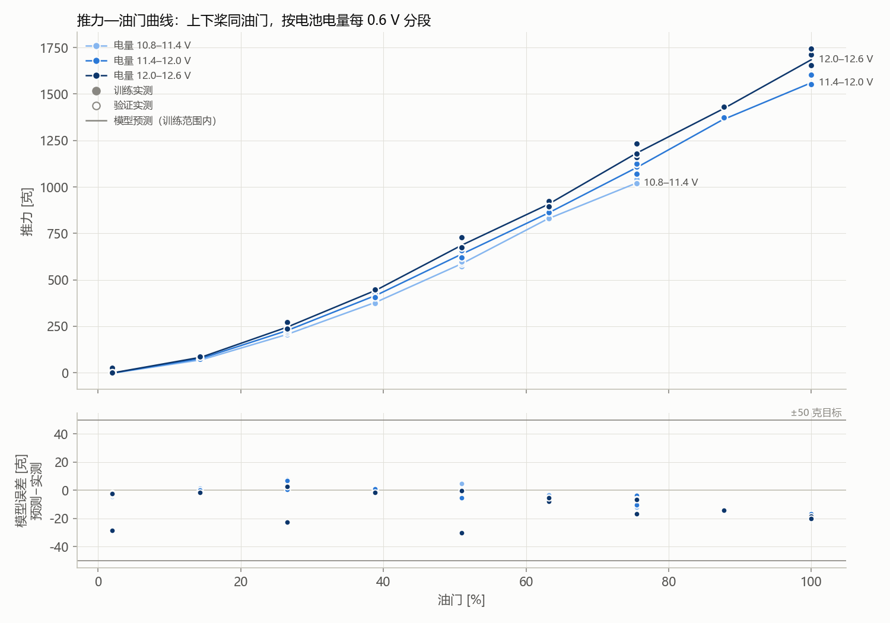

# 推力实验库整轮建模报告

## 首页四个问题

1. **用了几轮？** 训练 2 轮，选择验证 0 轮；run_id 无重叠。
2. **误差多少克？** 没有独立选择验证结果；当前只能看训练诊断。
3. **适用范围？** 仅 eRPM 候选；上路 eRPM 3995～73782，下路 eRPM 3857～74603，实际带载电压 9.49～12.43 V。支持域：训练 eRPM/V 三维联合支持域；域外拒绝，不外推。
4. **具体缺口与下一步？** 当前只有训练诊断；增加与训练 run_id 不重叠的完整验证轮。

## 候选比较

| 候选 | 可用性 | 不可用原因 | 选择验证平均误差 [克力] | 覆盖 |
|---|---|---|---:|---:|
| 仅 eRPM | 可用 | -- | -- | 0% |
| 连续实测电压 | 可用 | -- | -- | 0% |

- 选择：`{'selected_candidate': 'erpm_only', 'basis': 'training_only_default_simpler_candidate', 'minimum_validation_coverage': 1.0, 'validation_is_final_test': False, 'coefficients_refit_after_selection': False}`

## 推力—油门曲线（按电池电量分段）

只取上下桨油门相差不超过 0.6% 的稳态点：54 / 438 个，其中 54 个在模型训练范围内。电量段按“带载电压 + 负载压降估计”（k=0.0035，与自动补数同一口径）每 0.6 V 一段，所以同一块电池、同一时刻的高低油门点落在同一段；模型本身不分段，直接用每个点的实测电压。实心点为训练轮、空心点为验证轮；线为模型在这些实测工况上的预测，训练范围外不画、不外推。

| 电量段 | 油门 [%] | 点数 | 实测平均 [克] | 模型 [克] | 误差 [克] |
|---|---:|---:|---:|---:|---:|
| 10.8–11.4 V | 2 | 5 | 0.2 | -2.9 | -3.1 |
| 10.8–11.4 V | 14.5 | 2 | 69.9 | 69.4 | -0.5 |
| 10.8–11.4 V | 26.5 | 3 | 203.7 | 206.0 | 2.3 |
| 10.8–11.4 V | 39 | 2 | 380.9 | 380.0 | -0.9 |
| 10.8–11.4 V | 51 | 3 | 586.3 | 586.7 | 0.4 |
| 10.8–11.4 V | 63 | 1 | 830.2 | 827.0 | -3.1 |
| 10.8–11.4 V | 75.5 | 2 | 1030.5 | 1021.0 | -9.5 |
| 11.4–12.0 V | 2 | 1 | 0.0 | -2.4 | -2.4 |
| 11.4–12.0 V | 14.5 | 2 | 77.1 | 77.1 | -0.1 |
| 11.4–12.0 V | 26.5 | 3 | 221.5 | 226.6 | 5.0 |
| 11.4–12.0 V | 39 | 2 | 416.2 | 416.8 | 0.6 |
| 11.4–12.0 V | 51 | 3 | 640.9 | 638.4 | -2.5 |
| 11.4–12.0 V | 63 | 1 | 862.4 | 857.1 | -5.3 |
| 11.4–12.0 V | 75.5 | 4 | 1111.0 | 1104.0 | -7.0 |
| 11.4–12.0 V | 87.5 | 1 | 1374.2 | 1360.3 | -13.9 |
| 11.4–12.0 V | 100 | 2 | 1578.9 | 1560.9 | -18.1 |
| 12.0–12.6 V | 2 | 2 | 14.0 | -1.6 | -15.6 |
| 12.0–12.6 V | 14.5 | 1 | 85.2 | 83.8 | -1.4 |
| 12.0–12.6 V | 26.5 | 2 | 255.0 | 245.0 | -9.9 |
| 12.0–12.6 V | 39 | 1 | 446.2 | 444.6 | -1.6 |
| 12.0–12.6 V | 51 | 2 | 701.9 | 686.5 | -15.4 |
| 12.0–12.6 V | 63 | 2 | 910.5 | 904.0 | -6.5 |
| 12.0–12.6 V | 75.5 | 3 | 1191.7 | 1181.7 | -10.0 |
| 12.0–12.6 V | 87.5 | 1 | 1431.7 | 1417.4 | -14.3 |
| 12.0–12.6 V | 100 | 3 | 1704.4 | 1684.9 | -19.5 |

## 选择验证

验证集用于候选选择，因此不是未触碰的最终测试集；系数、缩放和支持域均未使用验证数据，选择后也未重训。

`{'erpm_only': {'status': 'unavailable', 'role': 'candidate_selection_validation_not_final_test', 'points': 0, 'input_points': 0, 'coverage_fraction': 0.0, 'rejected': {}, 'metrics': None, 'predictions': []}, 'continuous_loaded_voltage': {'status': 'unavailable', 'role': 'candidate_selection_validation_not_final_test', 'points': 0, 'input_points': 0, 'coverage_fraction': 0.0, 'rejected': {}, 'metrics': None, 'predictions': []}}`

## 数据与排除

`{'train_raw_samples': 12803, 'validation_raw_samples': 0, 'train_steady_points': 438, 'validation_steady_points': 0, 'train_mode_points': {'dual': 438}, 'validation_mode_points': {}, 'train_unsupported_nondual_points': 0, 'validation_unsupported_nondual_points': 0, 'train_excluded_by_reason': {}, 'validation_excluded_by_reason': {}, 'train_operating_points': [{'run_id': '2026-09-23/043415-3a7c2d7c::2d444c52f82c', 'segment_id': 'auto-02d27c', 'direction': 'steady', 'mode': 'dual', 'sample_count': 8, 'upper_erpm': 27136.375, 'lower_erpm': 4726.625, 'thrust_n': 1.5387003138075313, 'thrust_std_n': 0.004558590969757989, 'voltage_v': 12.250125, 'voltage_range_v': [12.207, 12.296], 'response_points': {'upper_esc_current_a': None, 'lower_esc_current_a': None, 'input_power_w': None}, 'esc_current_calibrated': False, 'board_current_a_diagnostic': 0.0, 'board_current_calibrated': False, 'voltage_layer_v': None, 'upper_command_pct': 26.547619047619047, 'lower_command_pct': 2.0238095238095237}, {'run_id': '2026-09-23/043415-3a7c2d7c::2d444c52f82c', 'segment_id': 'auto-5fd537', 'direction': 'steady', 'mode': 'dual', 'sample_count': 7, 'upper_erpm': 45376.0, 'lower_erpm': 26895.14285714286, 'thrust_n': 4.753616786610879, 'thrust_std_n': 0.004805176795170441, 'voltage_v': 11.995857142857144, 'voltage_range_v': [11.963, 12.031], 'response_points': {'upper_esc_current_a': None, 'lower_esc_current_a': None, 'input_power_w': None}, 'esc_current_calibrated': False, 'board_current_a_diagnostic': 2.9155714285714285, 'board_current_calibrated': False, 'voltage_layer_v': None, 'upper_command_pct': 50.95238095238095, 'lower_command_pct': 26.547619047619047}, {'run_id': '2026-09-23/043415-3a7c2d7c::2d444c52f82c', 'segment_id': 'auto-69a2f8', 'direction': 'steady', 'mode': 'dual', 'sample_count': 8, 'upper_erpm': 43715.125, 'lower_erpm': 59216.0, 'thrust_n': 10.17634839539749, 'thrust_std_n': 0.0050966596449969715, 'voltage_v': 11.401375, 'voltage_range_v': [11.34, 11.448], 'response_points': {'upper_esc_current_a': None, 'lower_esc_current_a': None, 'input_power_w': None}, 'esc_current_calibrated': False, 'board_current_a_diagnostic': 11.22425, 'board_current_calibrated': False, 'voltage_layer_v': None, 'upper_command_pct': 50.95238095238095, 'lower_command_pct': 75.47619047619048}, {'run_id': '2026-09-23/043415-3a7c2d7c::2d444c52f82c', 'segment_id': 'auto-6d730d', 'direction': 'steady', 'mode': 'dual', 'sample_count': 8, 'upper_erpm': 4885.875, 'lower_erpm': 45385.875, 'thrust_n': 4.392066175732218, 'thrust_std_n': 0.0, 'voltage_v': 12.118500000000001, 'voltage_range_v': [12.079, 12.174], 'response_points': {'upper_esc_current_a': None, 'lower_esc_current_a': None, 'input_power_w': None}, 'esc_current_calibrated': False, 'board_current_a_diagnostic': 1.917625, 'board_current_calibrated': False, 'voltage_layer_v': None, 'upper_command_pct': 2.0238095238095237, 'lower_command_pct': 50.95238095238095}, {'run_id': '2026-09-23/043415-3a7c2d7c::2d444c52f82c', 'segment_id': 'auto-6fc973', 'direction': 'steady', 'mode': 'dual', 'sample_count': 8, 'upper_erpm': 26419.625, 'lower_erpm': 59820.875, 'thrust_n': 8.43577060041841, 'thrust_std_n': 0.005096659644997891, 'voltage_v': 11.578625, 'voltage_range_v': [11.525, 11.625], 'response_points': {'upper_esc_current_a': None, 'lower_esc_current_a': None, 'input_power_w': None}, 'esc_current_calibrated': False, 'board_current_a_diagnostic': 7.271375, 'board_current_calibrated': False, 'voltage_layer_v': None, 'upper_command_pct': 26.547619047619047, 'lower_command_pct': 75.47619047619048}, {'run_id': '2026-09-23/043415-3a7c2d7c::2d444c52f82c', 'segment_id': 'auto-87ddaa', 'direction': 'steady', 'mode': 'dual', 'sample_count': 9, 'upper_erpm': 26817.222222222223, 'lower_erpm': 44392.88888888889, 'thrust_n': 5.2466261366806135, 'thrust_std_n': 0.004342419597431012, 'voltage_v': 11.916555555555554, 'voltage_range_v': [11.887, 11.935], 'response_points': {'upper_esc_current_a': None, 'lower_esc_current_a': None, 'input_power_w': None}, 'esc_current_calibrated': False, 'board_current_a_diagnostic': 3.5749999999999997, 'board_current_calibrated': False, 'voltage_layer_v': None, 'upper_command_pct': 26.547619047619047, 'lower_command_pct': 50.95238095238095}, {'run_id': '2026-09-23/043415-3a7c2d7c::2d444c52f82c', 'segment_id': 'auto-88be67', 'direction': 'steady', 'mode': 'dual', 'sample_count': 8, 'upper_erpm': 4715.25, 'lower_erpm': 26965.875, 'thrust_n': 1.6630272991631798, 'thrust_std_n': 0.00631108342177892, 'voltage_v': 12.355875, 'voltage_range_v': [12.308, 12.425], 'response_points': {'upper_esc_current_a': None, 'lower_esc_current_a': None, 'input_power_w': None}, 'esc_current_calibrated': False, 'board_current_a_diagnostic': 1.259375, 'board_current_calibrated': False, 'voltage_layer_v': None, 'upper_command_pct': 2.0238095238095237, 'lower_command_pct': 26.547619047619047}, {'run_id': '2026-09-23/043415-3a7c2d7c::2d444c52f82c', 'segment_id': 'auto-91857e', 'direction': 'steady', 'mode': 'dual', 'sample_count': 8, 'upper_erpm': 4568.625, 'lower_erpm': 4469.125, 'thrust_n': 0.2658874142259414, 'thrust_std_n': 0.0, 'voltage_v': 12.43075, 'voltage_range_v': [12.391, 12.466], 'response_points': {'upper_esc_current_a': None, 'lower_esc_current_a': None, 'input_power_w': None}, 'esc_current_calibrated': False, 'board_current_a_diagnostic': 0.6525, 'board_current_calibrated': False, 'voltage_layer_v': None, 'upper_command_pct': 2.0238095238095237, 'lower_command_pct': 2.0238095238095237}, {'run_id': '2026-09-23/043415-3a7c2d7c::2d444c52f82c', 'segment_id': 'auto-93654a', 'direction': 'steady', 'mode': 'dual', 'sample_count': 8, 'upper_erpm': 4690.125, 'lower_erpm': 26654.375, 'thrust_n': 1.6384080941422594, 'thrust_std_n': 0.0050966596449977765, 'voltage_v': 12.24475, 'voltage_range_v': [12.215, 12.29], 'response_points': {'upper_esc_current_a': None, 'lower_esc_current_a': None, 'input_power_w': None}, 'esc_current_calibrated': False, 'board_current_a_diagnostic': 0.062625, 'board_current_calibrated': False, 'voltage_layer_v': None, 'upper_command_pct': 2.0238095238095237, 'lower_command_pct': 26.547619047619047}, {'run_id': '2026-09-23/043415-3a7c2d7c::2d444c52f82c', 'segment_id': 'auto-99a32c', 'direction': 'steady', 'mode': 'dual', 'sample_count': 8, 'upper_erpm': 5193.375, 'lower_erpm': 74603.0, 'thrust_n': 11.722434470711297, 'thrust_std_n': 0.009021711434964918, 'voltage_v': 11.061375, 'voltage_range_v': [10.994, 11.134], 'response_points': {'upper_esc_current_a': None, 'lower_esc_current_a': None, 'input_power_w': None}, 'esc_current_calibrated': False, 'board_current_a_diagnostic': 18.25275, 'board_current_calibrated': False, 'voltage_layer_v': None, 'upper_command_pct': 2.0238095238095237, 'lower_command_pct': 100.0}, {'run_id': '2026-09-23/043415-3a7c2d7c::2d444c52f82c', 'segment_id': 'auto-a220b4', 'direction': 'steady', 'mode': 'dual', 'sample_count': 8, 'upper_erpm': 44776.0, 'lower_erpm': 44084.875, 'thrust_n': 7.139569456066945, 'thrust_std_n': 0.005263807447030226, 'voltage_v': 11.783249999999999, 'voltage_range_v': [11.732, 11.833], 'response_points': {'upper_esc_current_a': None, 'lower_esc_current_a': None, 'input_power_w': None}, 'esc_current_calibrated': False, 'board_current_a_diagnostic': 7.608625, 'board_current_calibrated': False, 'voltage_layer_v': None, 'upper_command_pct': 50.95238095238095, 'lower_command_pct': 50.95238095238095}, {'run_id': '2026-09-23/043415-3a7c2d7c::2d444c52f82c', 'segment_id': 'auto-c6d317', 'direction': 'steady', 'mode': 'dual', 'sample_count': 7, 'upper_erpm': 25646.714285714286, 'lower_erpm': 73684.14285714286, 'thrust_n': 12.12953061087866, 'thrust_std_n': 0.01579142234109068, 'voltage_v': 10.98857142857143, 'voltage_range_v': [10.958, 11.032], 'response_points': {'upper_esc_current_a': None, 'lower_esc_current_a': None, 'input_power_w': None}, 'esc_current_calibrated': False, 'board_current_a_diagnostic': 20.555285714285713, 'board_current_calibrated': False, 'voltage_layer_v': None, 'upper_command_pct': 26.547619047619047, 'lower_command_pct': 100.0}, {'run_id': '2026-09-23/043415-3a7c2d7c::2d444c52f82c', 'segment_id': 'auto-dbe779', 'direction': 'steady', 'mode': 'dual', 'sample_count': 7, 'upper_erpm': 45592.857142857145, 'lower_erpm': 4982.714285714285, 'thrust_n': 4.058651799163179, 'thrust_std_n': 0.0037220739406551543, 'voltage_v': 12.057142857142859, 'voltage_range_v': [12.012, 12.105], 'response_points': {'upper_esc_current_a': None, 'lower_esc_current_a': None, 'input_power_w': None}, 'esc_current_calibrated': False, 'board_current_a_diagnostic': 4.275142857142857, 'board_current_calibrated': False, 'voltage_layer_v': None, 'upper_command_pct': 50.95238095238095, 'lower_command_pct': 2.0238095238095237}, {'run_id': '2026-09-23/043415-3a7c2d7c::2d444c52f82c', 'segment_id': 'auto-f08961', 'direction': 'steady', 'mode': 'dual', 'sample_count': 8, 'upper_erpm': 4984.75, 'lower_erpm': 60867.625, 'thrust_n': 7.855988322175732, 'thrust_std_n': 0.006963362727085888, 'voltage_v': 11.700375, 'voltage_range_v': [11.639, 11.764], 'response_points': {'upper_esc_current_a': None, 'lower_esc_current_a': None, 'input_power_w': None}, 'esc_current_calibrated': False, 'board_current_a_diagnostic': 10.103625, 'board_current_calibrated': False, 'voltage_layer_v': None, 'upper_command_pct': 2.0238095238095237, 'lower_command_pct': 75.47619047619048}, {'run_id': '2026-09-23/043415-3a7c2d7c::2d444c52f82c', 'segment_id': 'auto-f1b556', 'direction': 'steady', 'mode': 'dual', 'sample_count': 8, 'upper_erpm': 27075.375, 'lower_erpm': 26654.5, 'thrust_n': 2.6687218242677826, 'thrust_std_n': 0.0, 'voltage_v': 12.1835, 'voltage_range_v': [12.129, 12.225], 'response_points': {'upper_esc_current_a': None, 'lower_esc_current_a': None, 'input_power_w': None}, 'esc_current_calibrated': False, 'board_current_a_diagnostic': 0.66625, 'board_current_calibrated': False, 'voltage_layer_v': None, 'upper_command_pct': 26.547619047619047, 'lower_command_pct': 26.547619047619047}, {'run_id': '2026-09-23/043627-65dee554::61f3b2ec2cbc', 'segment_id': 'auto-00474b', 'direction': 'steady', 'mode': 'dual', 'sample_count': 9, 'upper_erpm': 39301.444444444445, 'lower_erpm': 67499.44444444444, 'thrust_n': 11.580874041841005, 'thrust_std_n': 0.011010043195756136, 'voltage_v': 9.992111111111111, 'voltage_range_v': [9.951, 10.046], 'response_points': {'upper_esc_current_a': None, 'lower_esc_current_a': None, 'input_power_w': None}, 'esc_current_calibrated': False, 'board_current_a_diagnostic': 20.539, 'board_current_calibrated': False, 'voltage_layer_v': None, 'upper_command_pct': 50.95238095238095, 'lower_command_pct': 100.0}, {'run_id': '2026-09-23/043627-65dee554::61f3b2ec2cbc', 'segment_id': 'auto-005af8', 'direction': 'steady', 'mode': 'dual', 'sample_count': 8, 'upper_erpm': 24569.75, 'lower_erpm': 14584.0, 'thrust_n': 1.2703509790794978, 'thrust_std_n': 0.0, 'voltage_v': 10.840250000000001, 'voltage_range_v': [10.782, 10.88], 'response_points': {'upper_esc_current_a': None, 'lower_esc_current_a': None, 'input_power_w': None}, 'esc_current_calibrated': False, 'board_current_a_diagnostic': 0.809375, 'board_current_calibrated': False, 'voltage_layer_v': None, 'upper_command_pct': 26.547619047619047, 'lower_command_pct': 14.285714285714286}, {'run_id': '2026-09-23/043627-65dee554::61f3b2ec2cbc', 'segment_id': 'auto-02b21e', 'direction': 'steady', 'mode': 'dual', 'sample_count': 8, 'upper_erpm': 24359.875, 'lower_erpm': 40214.5, 'thrust_n': 4.1052524372384935, 'thrust_std_n': 0.003481681363543101, 'voltage_v': 10.696375, 'voltage_range_v': [10.627, 10.766], 'response_points': {'upper_esc_current_a': None, 'lower_esc_current_a': None, 'input_power_w': None}, 'esc_current_calibrated': False, 'board_current_a_diagnostic': 2.534625, 'board_current_calibrated': False, 'voltage_layer_v': None, 'upper_command_pct': 26.547619047619047, 'lower_command_pct': 50.95238095238095}, {'run_id': '2026-09-23/043627-65dee554::61f3b2ec2cbc', 'segment_id': 'auto-03bac9', 'direction': 'steady', 'mode': 'dual', 'sample_count': 8, 'upper_erpm': 52310.5, 'lower_erpm': 35767.375, 'thrust_n': 6.607794627615062, 'thrust_std_n': 0.0, 'voltage_v': 11.590375, 'voltage_range_v': [11.506, 11.705], 'response_points': {'upper_esc_current_a': None, 'lower_esc_current_a': None, 'input_power_w': None}, 'esc_current_calibrated': False, 'board_current_a_diagnostic': 9.713125, 'board_current_calibrated': False, 'voltage_layer_v': None, 'upper_command_pct': 63.214285714285715, 'lower_command_pct': 38.80952380952381}, {'run_id': '2026-09-23/043627-65dee554::61f3b2ec2cbc', 'segment_id': 'auto-049193', 'direction': 'steady', 'mode': 'dual', 'sample_count': 8, 'upper_erpm': 66759.25, 'lower_erpm': 26489.75, 'thrust_n': 8.558866625523013, 'thrust_std_n': 0.006311083421779237, 'voltage_v': 11.229625, 'voltage_range_v': [11.175, 11.309], 'response_points': {'upper_esc_current_a': None, 'lower_esc_current_a': None, 'input_power_w': None}, 'esc_current_calibrated': False, 'board_current_a_diagnostic': 15.43125, 'board_current_calibrated': False, 'voltage_layer_v': None, 'upper_command_pct': 87.73809523809524, 'lower_command_pct': 26.547619047619047}, {'run_id': '2026-09-23/043627-65dee554::61f3b2ec2cbc', 'segment_id': 'auto-04b4e8', 'direction': 'steady', 'mode': 'dual', 'sample_count': 6, 'upper_erpm': 25743.666666666668, 'lower_erpm': 73110.83333333333, 'thrust_n': 11.72530671129707, 'thrust_std_n': 0.00804059868989645, 'voltage_v': 10.917499999999999, 'voltage_range_v': [10.873, 10.971], 'response_points': {'upper_esc_current_a': None, 'lower_esc_current_a': None, 'input_power_w': None}, 'esc_current_calibrated': False, 'board_current_a_diagnostic': 19.587, 'board_current_calibrated': False, 'voltage_layer_v': None, 'upper_command_pct': 26.547619047619047, 'lower_command_pct': 100.0}, {'run_id': '2026-09-23/043627-65dee554::61f3b2ec2cbc', 'segment_id': 'auto-04bcf7', 'direction': 'steady', 'mode': 'dual', 'sample_count': 8, 'upper_erpm': 26666.25, 'lower_erpm': 4639.5, 'thrust_n': 1.2321912112970712, 'thrust_std_n': 0.003481681363542944, 'voltage_v': 12.013625, 'voltage_range_v': [11.975, 12.055], 'response_points': {'upper_esc_current_a': None, 'lower_esc_current_a': None, 'input_power_w': None}, 'esc_current_calibrated': False, 'board_current_a_diagnostic': 0.3245, 'board_current_calibrated': False, 'voltage_layer_v': None, 'upper_command_pct': 26.547619047619047, 'lower_command_pct': 2.0238095238095237}, {'run_id': '2026-09-23/043627-65dee554::61f3b2ec2cbc', 'segment_id': 'auto-051e1f', 'direction': 'steady', 'mode': 'dual', 'sample_count': 8, 'upper_erpm': 72970.0, 'lower_erpm': 5995.25, 'thrust_n': 10.006475880753138, 'thrust_std_n': 0.003481681363543101, 'voltage_v': 10.856125, 'voltage_range_v': [10.798, 10.904], 'response_points': {'upper_esc_current_a': None, 'lower_esc_current_a': None, 'input_power_w': None}, 'esc_current_calibrated': False, 'board_current_a_diagnostic': 17.451875, 'board_current_calibrated': False, 'voltage_layer_v': None, 'upper_command_pct': 100.0, 'lower_command_pct': 2.0238095238095237}, {'run_id': '2026-09-23/043627-65dee554::61f3b2ec2cbc', 'segment_id': 'auto-059965', 'direction': 'steady', 'mode': 'dual', 'sample_count': 9, 'upper_erpm': 55237.444444444445, 'lower_erpm': 40058.88888888889, 'thrust_n': 7.755596675034868, 'thrust_std_n': 0.0051901841365843545, 'voltage_v': 10.359666666666666, 'voltage_range_v': [10.322, 10.38], 'response_points': {'upper_esc_current_a': None, 'lower_esc_current_a': None, 'input_power_w': None}, 'esc_current_calibrated': False, 'board_current_a_diagnostic': 9.973888888888888, 'board_current_calibrated': False, 'voltage_layer_v': None, 'upper_command_pct': 75.47619047619048, 'lower_command_pct': 50.95238095238095}, {'run_id': '2026-09-23/043627-65dee554::61f3b2ec2cbc', 'segment_id': 'auto-067035', 'direction': 'steady', 'mode': 'dual', 'sample_count': 8, 'upper_erpm': 63880.75, 'lower_erpm': 15604.625, 'thrust_n': 7.325444453974895, 'thrust_std_n': 0.006311083421779013, 'voltage_v': 10.632375, 'voltage_range_v': [10.59, 10.69], 'response_points': {'upper_esc_current_a': None, 'lower_esc_current_a': None, 'input_power_w': None}, 'esc_current_calibrated': False, 'board_current_a_diagnostic': 13.09225, 'board_current_calibrated': False, 'voltage_layer_v': None, 'upper_command_pct': 87.73809523809524, 'lower_command_pct': 14.285714285714286}, {'run_id': '2026-09-23/043627-65dee554::61f3b2ec2cbc', 'segment_id': 'auto-088315', 'direction': 'steady', 'mode': 'dual', 'sample_count': 7, 'upper_erpm': 58561.0, 'lower_erpm': 26067.428571428572, 'thrust_n': 6.735814493723849, 'thrust_std_n': 0.005685561858425193, 'voltage_v': 11.151, 'voltage_range_v': [11.108, 11.183], 'response_points': {'upper_esc_current_a': None, 'lower_esc_current_a': None, 'input_power_w': None}, 'esc_current_calibrated': False, 'board_current_a_diagnostic': 11.716857142857142, 'board_current_calibrated': False, 'voltage_layer_v': None, 'upper_command_pct': 75.47619047619048, 'lower_command_pct': 26.547619047619047}, {'run_id': '2026-09-23/043627-65dee554::61f3b2ec2cbc', 'segment_id': 'auto-088de9', 'direction': 'steady', 'mode': 'dual', 'sample_count': 9, 'upper_erpm': 49432.22222222222, 'lower_erpm': 48931.22222222222, 'thrust_n': 8.456970471408646, 'thrust_std_n': 0.004342419597431404, 'voltage_v': 10.828666666666667, 'voltage_range_v': [10.744, 10.881], 'response_points': {'upper_esc_current_a': None, 'lower_esc_current_a': None, 'input_power_w': None}, 'esc_current_calibrated': False, 'board_current_a_diagnostic': 12.997, 'board_current_calibrated': False, 'voltage_layer_v': None, 'upper_command_pct': 63.214285714285715, 'lower_command_pct': 63.214285714285715}, {'run_id': '2026-09-23/043627-65dee554::61f3b2ec2cbc', 'segment_id': 'auto-08c702', 'direction': 'steady', 'mode': 'dual', 'sample_count': 7, 'upper_erpm': 35104.71428571428, 'lower_erpm': 34664.857142857145, 'thrust_n': 4.181044418410042, 'thrust_std_n': 0.005263807447029989, 'voltage_v': 11.524857142857144, 'voltage_range_v': [11.454, 11.574], 'response_points': {'upper_esc_current_a': None, 'lower_esc_current_a': None, 'input_power_w': None}, 'esc_current_calibrated': False, 'board_current_a_diagnostic': 3.2284285714285716, 'board_current_calibrated': False, 'voltage_layer_v': None, 'upper_command_pct': 38.80952380952381, 'lower_command_pct': 38.80952380952381}, {'run_id': '2026-09-23/043627-65dee554::61f3b2ec2cbc', 'segment_id': 'auto-090d20', 'direction': 'steady', 'mode': 'dual', 'sample_count': 8, 'upper_erpm': 4439.75, 'lower_erpm': 25326.625, 'thrust_n': 1.2531175355648534, 'thrust_std_n': 0.004558590969757886, 'voltage_v': 11.4545, 'voltage_range_v': [11.4, 11.509], 'response_points': {'upper_esc_current_a': None, 'lower_esc_current_a': None, 'input_power_w': None}, 'esc_current_calibrated': False, 'board_current_a_diagnostic': 0.507875, 'board_current_calibrated': False, 'voltage_layer_v': None, 'upper_command_pct': 2.0238095238095237, 'lower_command_pct': 26.547619047619047}, {'run_id': '2026-09-23/043627-65dee554::61f3b2ec2cbc', 'segment_id': 'auto-094f34', 'direction': 'steady', 'mode': 'dual', 'sample_count': 8, 'upper_erpm': 57389.125, 'lower_erpm': 56657.0, 'thrust_n': 11.387613282426777, 'thrust_std_n': 0.0050966596449969715, 'voltage_v': 10.824, 'voltage_range_v': [10.776, 10.886], 'response_points': {'upper_esc_current_a': None, 'lower_esc_current_a': None, 'input_power_w': None}, 'esc_current_calibrated': False, 'board_current_a_diagnostic': 15.313375, 'board_current_calibrated': False, 'voltage_layer_v': None, 'upper_command_pct': 75.47619047619048, 'lower_command_pct': 75.47619047619048}, {'run_id': '2026-09-23/043627-65dee554::61f3b2ec2cbc', 'segment_id': 'auto-095d78', 'direction': 'steady', 'mode': 'dual', 'sample_count': 9, 'upper_erpm': 70996.33333333333, 'lower_erpm': 55947.0, 'thrust_n': 13.923528172942817, 'thrust_std_n': 0.007698287148297086, 'voltage_v': 10.501777777777777, 'voltage_range_v': [10.44, 10.574], 'response_points': {'upper_esc_current_a': None, 'lower_esc_current_a': None, 'input_power_w': None}, 'esc_current_calibrated': False, 'board_current_a_diagnostic': 24.443333333333335, 'board_current_calibrated': False, 'voltage_layer_v': None, 'upper_command_pct': 100.0, 'lower_command_pct': 75.47619047619048}, {'run_id': '2026-09-23/043627-65dee554::61f3b2ec2cbc', 'segment_id': 'auto-0a4785', 'direction': 'steady', 'mode': 'dual', 'sample_count': 9, 'upper_erpm': 34350.555555555555, 'lower_erpm': 57890.666666666664, 'thrust_n': 8.47010071408647, 'thrust_std_n': 0.009138262157112002, 'voltage_v': 11.113, 'voltage_range_v': [11.027, 11.184], 'response_points': {'upper_esc_current_a': None, 'lower_esc_current_a': None, 'input_power_w': None}, 'esc_current_calibrated': False, 'board_current_a_diagnostic': 10.145111111111111, 'board_current_calibrated': False, 'voltage_layer_v': None, 'upper_command_pct': 38.80952380952381, 'lower_command_pct': 75.47619047619048}, {'run_id': '2026-09-23/043627-65dee554::61f3b2ec2cbc', 'segment_id': 'auto-0b0bba', 'direction': 'steady', 'mode': 'dual', 'sample_count': 6, 'upper_erpm': 16123.0, 'lower_erpm': 44204.0, 'thrust_n': 4.188547414225941, 'thrust_std_n': 0.005085321122287737, 'voltage_v': 11.816833333333333, 'voltage_range_v': [11.784, 11.829], 'response_points': {'upper_esc_current_a': None, 'lower_esc_current_a': None, 'input_power_w': None}, 'esc_current_calibrated': False, 'board_current_a_diagnostic': 3.677, 'board_current_calibrated': False, 'voltage_layer_v': None, 'upper_command_pct': 14.285714285714286, 'lower_command_pct': 50.95238095238094}, {'run_id': '2026-09-23/043627-65dee554::61f3b2ec2cbc', 'segment_id': 'auto-0b6452', 'direction': 'steady', 'mode': 'dual', 'sample_count': 7, 'upper_erpm': 58708.28571428572, 'lower_erpm': 16163.57142857143, 'thrust_n': 6.265939380753139, 'thrust_std_n': 0.004805176795170008, 'voltage_v': 11.186285714285715, 'voltage_range_v': [11.143, 11.245], 'response_points': {'upper_esc_current_a': None, 'lower_esc_current_a': None, 'input_power_w': None}, 'esc_current_calibrated': False, 'board_current_a_diagnostic': 6.388142857142857, 'board_current_calibrated': False, 'voltage_layer_v': None, 'upper_command_pct': 75.47619047619048, 'lower_command_pct': 14.285714285714286}, {'run_id': '2026-09-23/043627-65dee554::61f3b2ec2cbc', 'segment_id': 'auto-0b7a79', 'direction': 'steady', 'mode': 'dual', 'sample_count': 7, 'upper_erpm': 43532.0, 'lower_erpm': 15957.142857142857, 'thrust_n': 3.5325042175732215, 'thrust_std_n': 0.004805176795170224, 'voltage_v': 11.487142857142857, 'voltage_range_v': [11.435, 11.524], 'response_points': {'upper_esc_current_a': None, 'lower_esc_current_a': None, 'input_power_w': None}, 'esc_current_calibrated': False, 'board_current_a_diagnostic': 3.918428571428571, 'board_current_calibrated': False, 'voltage_layer_v': None, 'upper_command_pct': 50.95238095238095, 'lower_command_pct': 14.285714285714286}, {'run_id': '2026-09-23/043627-65dee554::61f3b2ec2cbc', 'segment_id': 'auto-0c2493', 'direction': 'steady', 'mode': 'dual', 'sample_count': 7, 'upper_erpm': 24857.428571428572, 'lower_erpm': 41143.57142857143, 'thrust_n': 4.269673556485356, 'thrust_std_n': 0.007748114769761161, 'voltage_v': 10.905285714285714, 'voltage_range_v': [10.882, 10.93], 'response_points': {'upper_esc_current_a': None, 'lower_esc_current_a': None, 'input_power_w': None}, 'esc_current_calibrated': False, 'board_current_a_diagnostic': 3.576, 'board_current_calibrated': False, 'voltage_layer_v': None, 'upper_command_pct': 26.547619047619047, 'lower_command_pct': 50.95238095238095}, {'run_id': '2026-09-23/043627-65dee554::61f3b2ec2cbc', 'segment_id': 'auto-0ccc17', 'direction': 'steady', 'mode': 'dual', 'sample_count': 9, 'upper_erpm': 67907.22222222222, 'lower_erpm': 53107.666666666664, 'thrust_n': 12.612692278940028, 'thrust_std_n': 0.009570226677755304, 'voltage_v': 9.867111111111111, 'voltage_range_v': [9.798, 9.938], 'response_points': {'upper_esc_current_a': None, 'lower_esc_current_a': None, 'input_power_w': None}, 'esc_current_calibrated': False, 'board_current_a_diagnostic': 23.251, 'board_current_calibrated': False, 'voltage_layer_v': None, 'upper_command_pct': 100.0, 'lower_command_pct': 75.47619047619048}, {'run_id': '2026-09-23/043627-65dee554::61f3b2ec2cbc', 'segment_id': 'auto-0cd3c0', 'direction': 'steady', 'mode': 'dual', 'sample_count': 7, 'upper_erpm': 34790.857142857145, 'lower_erpm': 42962.142857142855, 'thrust_n': 5.455615832635983, 'thrust_std_n': 9.593423386663633e-16, 'voltage_v': 11.436285714285715, 'voltage_range_v': [11.397, 11.473], 'response_points': {'upper_esc_current_a': None, 'lower_esc_current_a': None, 'input_power_w': None}, 'esc_current_calibrated': False, 'board_current_a_diagnostic': 6.086285714285714, 'board_current_calibrated': False, 'voltage_layer_v': None, 'upper_command_pct': 38.80952380952381, 'lower_command_pct': 50.95238095238095}, {'run_id': '2026-09-23/043627-65dee554::61f3b2ec2cbc', 'segment_id': 'auto-0d474d', 'direction': 'steady', 'mode': 'dual', 'sample_count': 7, 'upper_erpm': 4503.857142857143, 'lower_erpm': 54348.0, 'thrust_n': 6.167462560669456, 'thrust_std_n': 0.004805176795170008, 'voltage_v': 10.324857142857143, 'voltage_range_v': [10.275, 10.362], 'response_points': {'upper_esc_current_a': None, 'lower_esc_current_a': None, 'input_power_w': None}, 'esc_current_calibrated': False, 'board_current_a_diagnostic': 5.757714285714286, 'board_current_calibrated': False, 'voltage_layer_v': None, 'upper_command_pct': 2.0238095238095237, 'lower_command_pct': 75.47619047619048}, {'run_id': '2026-09-23/043627-65dee554::61f3b2ec2cbc', 'segment_id': 'auto-0d5cd7', 'direction': 'steady', 'mode': 'dual', 'sample_count': 8, 'upper_erpm': 32266.375, 'lower_erpm': 68747.75, 'thrust_n': 11.124187788702928, 'thrust_std_n': 0.009021711434964502, 'voltage_v': 10.17425, 'voltage_range_v': [10.097, 10.257], 'response_points': {'upper_esc_current_a': None, 'lower_esc_current_a': None, 'input_power_w': None}, 'esc_current_calibrated': False, 'board_current_a_diagnostic': 18.894875, 'board_current_calibrated': False, 'voltage_layer_v': None, 'upper_command_pct': 38.80952380952381, 'lower_command_pct': 100.0}, {'run_id': '2026-09-23/043627-65dee554::61f3b2ec2cbc', 'segment_id': 'auto-0d7583', 'direction': 'steady', 'mode': 'dual', 'sample_count': 7, 'upper_erpm': 40603.42857142857, 'lower_erpm': 54916.42857142857, 'thrust_n': 8.539347112970711, 'thrust_std_n': 0.0037220739406554895, 'voltage_v': 10.477571428571428, 'voltage_range_v': [10.4, 10.553], 'response_points': {'upper_esc_current_a': None, 'lower_esc_current_a': None, 'input_power_w': None}, 'esc_current_calibrated': False, 'board_current_a_diagnostic': 11.713285714285714, 'board_current_calibrated': False, 'voltage_layer_v': None, 'upper_command_pct': 50.95238095238095, 'lower_command_pct': 75.47619047619048}, {'run_id': '2026-09-23/043627-65dee554::61f3b2ec2cbc', 'segment_id': 'auto-0dc314', 'direction': 'steady', 'mode': 'dual', 'sample_count': 8, 'upper_erpm': 5055.25, 'lower_erpm': 69889.25, 'thrust_n': 10.223124884937238, 'thrust_std_n': 0.006311083421778543, 'voltage_v': 10.365375, 'voltage_range_v': [10.306, 10.419], 'response_points': {'upper_esc_current_a': None, 'lower_esc_current_a': None, 'input_power_w': None}, 'esc_current_calibrated': False, 'board_current_a_diagnostic': 16.025875, 'board_current_calibrated': False, 'voltage_layer_v': None, 'upper_command_pct': 2.0238095238095237, 'lower_command_pct': 100.0}, {'run_id': '2026-09-23/043627-65dee554::61f3b2ec2cbc', 'segment_id': 'auto-0f04a1', 'direction': 'steady', 'mode': 'dual', 'sample_count': 6, 'upper_erpm': 5028.666666666667, 'lower_erpm': 59543.5, 'thrust_n': 7.2675893221757315, 'thrust_std_n': 0.0, 'voltage_v': 11.447833333333334, 'voltage_range_v': [11.375, 11.507], 'response_points': {'upper_esc_current_a': None, 'lower_esc_current_a': None, 'input_power_w': None}, 'esc_current_calibrated': False, 'board_current_a_diagnostic': 8.717, 'board_current_calibrated': False, 'voltage_layer_v': None, 'upper_command_pct': 2.0238095238095237, 'lower_command_pct': 75.47619047619048}, {'run_id': '2026-09-23/043627-65dee554::61f3b2ec2cbc', 'segment_id': 'auto-0f11a0', 'direction': 'steady', 'mode': 'dual', 'sample_count': 8, 'upper_erpm': 63041.75, 'lower_erpm': 40774.125, 'thrust_n': 9.251897246861924, 'thrust_std_n': 0.007444147881310139, 'voltage_v': 10.461375, 'voltage_range_v': [10.381, 10.526], 'response_points': {'upper_esc_current_a': None, 'lower_esc_current_a': None, 'input_power_w': None}, 'esc_current_calibrated': False, 'board_current_a_diagnostic': 14.94, 'board_current_calibrated': False, 'voltage_layer_v': None, 'upper_command_pct': 87.73809523809524, 'lower_command_pct': 50.95238095238095}, {'run_id': '2026-09-23/043627-65dee554::61f3b2ec2cbc', 'segment_id': 'auto-0fe5a2', 'direction': 'steady', 'mode': 'dual', 'sample_count': 9, 'upper_erpm': 59406.444444444445, 'lower_erpm': 43604.22222222222, 'thrust_n': 9.147402398884239, 'thrust_std_n': 0.0032825606694562026, 'voltage_v': 11.36488888888889, 'voltage_range_v': [11.317, 11.42], 'response_points': {'upper_esc_current_a': None, 'lower_esc_current_a': None, 'input_power_w': None}, 'esc_current_calibrated': False, 'board_current_a_diagnostic': 11.558, 'board_current_calibrated': False, 'voltage_layer_v': None, 'upper_command_pct': 75.47619047619048, 'lower_command_pct': 50.95238095238095}, {'run_id': '2026-09-23/043627-65dee554::61f3b2ec2cbc', 'segment_id': 'auto-10c4fa', 'direction': 'steady', 'mode': 'dual', 'sample_count': 8, 'upper_erpm': 56496.5, 'lower_erpm': 24691.25, 'thrust_n': 6.18434430125523, 'thrust_std_n': 0.0, 'voltage_v': 10.586875, 'voltage_range_v': [10.524, 10.653], 'response_points': {'upper_esc_current_a': None, 'lower_esc_current_a': None, 'input_power_w': None}, 'esc_current_calibrated': False, 'board_current_a_diagnostic': 4.934375, 'board_current_calibrated': False, 'voltage_layer_v': None, 'upper_command_pct': 75.47619047619048, 'lower_command_pct': 26.547619047619047}, {'run_id': '2026-09-23/043627-65dee554::61f3b2ec2cbc', 'segment_id': 'auto-11010c', 'direction': 'steady', 'mode': 'dual', 'sample_count': 8, 'upper_erpm': 15388.25, 'lower_erpm': 64325.625, 'thrust_n': 8.606874075313808, 'thrust_std_n': 0.0, 'voltage_v': 10.795625, 'voltage_range_v': [10.754, 10.838], 'response_points': {'upper_esc_current_a': None, 'lower_esc_current_a': None, 'input_power_w': None}, 'esc_current_calibrated': False, 'board_current_a_diagnostic': 13.630375, 'board_current_calibrated': False, 'voltage_layer_v': None, 'upper_command_pct': 14.285714285714286, 'lower_command_pct': 87.73809523809524}, {'run_id': '2026-09-23/043627-65dee554::61f3b2ec2cbc', 'segment_id': 'auto-116705', 'direction': 'steady', 'mode': 'dual', 'sample_count': 7, 'upper_erpm': 43988.0, 'lower_erpm': 43460.42857142857, 'thrust_n': 6.626083179916319, 'thrust_std_n': 0.0037220739406554895, 'voltage_v': 11.544571428571428, 'voltage_range_v': [11.503, 11.59], 'response_points': {'upper_esc_current_a': None, 'lower_esc_current_a': None, 'input_power_w': None}, 'esc_current_calibrated': False, 'board_current_a_diagnostic': 8.534285714285714, 'board_current_calibrated': False, 'voltage_layer_v': None, 'upper_command_pct': 50.95238095238095, 'lower_command_pct': 50.95238095238095}, {'run_id': '2026-09-23/043627-65dee554::61f3b2ec2cbc', 'segment_id': 'auto-11827b', 'direction': 'steady', 'mode': 'dual', 'sample_count': 8, 'upper_erpm': 15290.25, 'lower_erpm': 49261.25, 'thrust_n': 5.187266497907949, 'thrust_std_n': 0.004558590969758092, 'voltage_v': 10.9115, 'voltage_range_v': [10.877, 10.964], 'response_points': {'upper_esc_current_a': None, 'lower_esc_current_a': None, 'input_power_w': None}, 'esc_current_calibrated': False, 'board_current_a_diagnostic': 6.811625, 'board_current_calibrated': False, 'voltage_layer_v': None, 'upper_command_pct': 14.285714285714286, 'lower_command_pct': 63.214285714285715}, {'run_id': '2026-09-23/043627-65dee554::61f3b2ec2cbc', 'segment_id': 'auto-11b219', 'direction': 'steady', 'mode': 'dual', 'sample_count': 9, 'upper_erpm': 56532.444444444445, 'lower_erpm': 71258.33333333333, 'thrust_n': 15.17308960111576, 'thrust_std_n': 0.011835440808545738, 'voltage_v': 10.604111111111111, 'voltage_range_v': [10.567, 10.683], 'response_points': {'upper_esc_current_a': None, 'lower_esc_current_a': None, 'input_power_w': None}, 'esc_current_calibrated': False, 'board_current_a_diagnostic': 26.14488888888889, 'board_current_calibrated': False, 'voltage_layer_v': None, 'upper_command_pct': 75.47619047619048, 'lower_command_pct': 100.0}, {'run_id': '2026-09-23/043627-65dee554::61f3b2ec2cbc', 'segment_id': 'auto-126f79', 'direction': 'steady', 'mode': 'dual', 'sample_count': 7, 'upper_erpm': 32497.0, 'lower_erpm': 40045.42857142857, 'thrust_n': 4.774718962343096, 'thrust_std_n': 0.0037220739406554895, 'voltage_v': 10.574285714285717, 'voltage_range_v': [10.518, 10.612], 'response_points': {'upper_esc_current_a': None, 'lower_esc_current_a': None, 'input_power_w': None}, 'esc_current_calibrated': False, 'board_current_a_diagnostic': 3.834, 'board_current_calibrated': False, 'voltage_layer_v': None, 'upper_command_pct': 38.80952380952381, 'lower_command_pct': 50.95238095238095}, {'run_id': '2026-09-23/043627-65dee554::61f3b2ec2cbc', 'segment_id': 'auto-13535c', 'direction': 'steady', 'mode': 'dual', 'sample_count': 7, 'upper_erpm': 24740.571428571428, 'lower_erpm': 56029.71428571428, 'thrust_n': 7.1494171380753135, 'thrust_std_n': 0.00568556185842545, 'voltage_v': 10.725142857142858, 'voltage_range_v': [10.682, 10.776], 'response_points': {'upper_esc_current_a': None, 'lower_esc_current_a': None, 'input_power_w': None}, 'esc_current_calibrated': False, 'board_current_a_diagnostic': 7.745285714285714, 'board_current_calibrated': False, 'voltage_layer_v': None, 'upper_command_pct': 26.547619047619047, 'lower_command_pct': 75.47619047619048}, {'run_id': '2026-09-23/043627-65dee554::61f3b2ec2cbc', 'segment_id': 'auto-136929', 'direction': 'steady', 'mode': 'dual', 'sample_count': 7, 'upper_erpm': 41832.42857142857, 'lower_erpm': 15177.142857142857, 'thrust_n': 3.2244124518828454, 'thrust_std_n': 0.0052638074470304635, 'voltage_v': 10.951714285714287, 'voltage_range_v': [10.908, 10.987], 'response_points': {'upper_esc_current_a': None, 'lower_esc_current_a': None, 'input_power_w': None}, 'esc_current_calibrated': False, 'board_current_a_diagnostic': 5.132571428571429, 'board_current_calibrated': False, 'voltage_layer_v': None, 'upper_command_pct': 50.95238095238095, 'lower_command_pct': 14.285714285714286}, {'run_id': '2026-09-23/043627-65dee554::61f3b2ec2cbc', 'segment_id': 'auto-144097', 'direction': 'steady', 'mode': 'dual', 'sample_count': 7, 'upper_erpm': 60188.857142857145, 'lower_erpm': 26608.714285714286, 'thrust_n': 7.129721774058576, 'thrust_std_n': 0.005685561858425193, 'voltage_v': 11.44242857142857, 'voltage_range_v': [11.385, 11.5], 'response_points': {'upper_esc_current_a': None, 'lower_esc_current_a': None, 'input_power_w': None}, 'esc_current_calibrated': False, 'board_current_a_diagnostic': 8.256, 'board_current_calibrated': False, 'voltage_layer_v': None, 'upper_command_pct': 75.47619047619048, 'lower_command_pct': 26.547619047619047}, {'run_id': '2026-09-23/043627-65dee554::61f3b2ec2cbc', 'segment_id': 'auto-14f7ad', 'direction': 'steady', 'mode': 'dual', 'sample_count': 6, 'upper_erpm': 51340.166666666664, 'lower_erpm': 26223.333333333332, 'thrust_n': 5.442485589958159, 'thrust_std_n': 0.005085321122287279, 'voltage_v': 11.372, 'voltage_range_v': [11.342, 11.406], 'response_points': {'upper_esc_current_a': None, 'lower_esc_current_a': None, 'input_power_w': None}, 'esc_current_calibrated': False, 'board_current_a_diagnostic': 6.783166666666666, 'board_current_calibrated': False, 'voltage_layer_v': None, 'upper_command_pct': 63.214285714285715, 'lower_command_pct': 26.547619047619047}, {'run_id': '2026-09-23/043627-65dee554::61f3b2ec2cbc', 'segment_id': 'auto-15a07a', 'direction': 'steady', 'mode': 'dual', 'sample_count': 7, 'upper_erpm': 4331.714285714285, 'lower_erpm': 40353.28571428572, 'thrust_n': 3.31444840167364, 'thrust_std_n': 0.005263807447030226, 'voltage_v': 10.627857142857142, 'voltage_range_v': [10.579, 10.673], 'response_points': {'upper_esc_current_a': None, 'lower_esc_current_a': None, 'input_power_w': None}, 'esc_current_calibrated': False, 'board_current_a_diagnostic': 3.547857142857143, 'board_current_calibrated': False, 'voltage_layer_v': None, 'upper_command_pct': 2.0238095238095237, 'lower_command_pct': 50.95238095238095}, {'run_id': '2026-09-23/043627-65dee554::61f3b2ec2cbc', 'segment_id': 'auto-18095a', 'direction': 'steady', 'mode': 'dual', 'sample_count': 9, 'upper_erpm': 35211.11111111111, 'lower_erpm': 4629.111111111111, 'thrust_n': 2.2321412552301254, 'thrust_std_n': 0.004923841004184082, 'voltage_v': 11.581555555555557, 'voltage_range_v': [11.537, 11.639], 'response_points': {'upper_esc_current_a': None, 'lower_esc_current_a': None, 'input_power_w': None}, 'esc_current_calibrated': False, 'board_current_a_diagnostic': 0.47866666666666663, 'board_current_calibrated': False, 'voltage_layer_v': None, 'upper_command_pct': 38.80952380952381, 'lower_command_pct': 2.0238095238095237}, {'run_id': '2026-09-23/043627-65dee554::61f3b2ec2cbc', 'segment_id': 'auto-1864f8', 'direction': 'steady', 'mode': 'dual', 'sample_count': 7, 'upper_erpm': 51094.857142857145, 'lower_erpm': 16054.857142857143, 'thrust_n': 4.780346209205021, 'thrust_std_n': 0.009610353590340232, 'voltage_v': 11.358571428571429, 'voltage_range_v': [11.332, 11.392], 'response_points': {'upper_esc_current_a': None, 'lower_esc_current_a': None, 'input_power_w': None}, 'esc_current_calibrated': False, 'board_current_a_diagnostic': 3.519142857142857, 'board_current_calibrated': False, 'voltage_layer_v': None, 'upper_command_pct': 63.214285714285715, 'lower_command_pct': 14.285714285714286}, {'run_id': '2026-09-23/043627-65dee554::61f3b2ec2cbc', 'segment_id': 'auto-186712', 'direction': 'steady', 'mode': 'dual', 'sample_count': 5, 'upper_erpm': 64794.8, 'lower_erpm': 42181.8, 'thrust_n': 9.914646246025104, 'thrust_std_n': 0.008239161890420817, 'voltage_v': 10.8376, 'voltage_range_v': [10.8, 10.866], 'response_points': {'upper_esc_current_a': None, 'lower_esc_current_a': None, 'input_power_w': None}, 'esc_current_calibrated': False, 'board_current_a_diagnostic': 11.965399999999999, 'board_current_calibrated': False, 'voltage_layer_v': None, 'upper_command_pct': 87.73809523809524, 'lower_command_pct': 50.95238095238095}, {'run_id': '2026-09-23/043627-65dee554::61f3b2ec2cbc', 'segment_id': 'auto-18abc5', 'direction': 'steady', 'mode': 'dual', 'sample_count': 8, 'upper_erpm': 58838.0, 'lower_erpm': 58223.75, 'thrust_n': 12.104032148535564, 'thrust_std_n': 0.01108840748145876, 'voltage_v': 11.094375, 'voltage_range_v': [11.034, 11.193], 'response_points': {'upper_esc_current_a': None, 'lower_esc_current_a': None, 'input_power_w': None}, 'esc_current_calibrated': False, 'board_current_a_diagnostic': 13.70775, 'board_current_calibrated': False, 'voltage_layer_v': None, 'upper_command_pct': 75.47619047619048, 'lower_command_pct': 75.47619047619048}, {'run_id': '2026-09-23/043627-65dee554::61f3b2ec2cbc', 'segment_id': 'auto-18fbf4', 'direction': 'steady', 'mode': 'dual', 'sample_count': 6, 'upper_erpm': 42980.833333333336, 'lower_erpm': 4618.5, 'thrust_n': 3.348211882845188, 'thrust_std_n': 0.0, 'voltage_v': 11.2475, 'voltage_range_v': [11.219, 11.297], 'response_points': {'upper_esc_current_a': None, 'lower_esc_current_a': None, 'input_power_w': None}, 'esc_current_calibrated': False, 'board_current_a_diagnostic': 2.431, 'board_current_calibrated': False, 'voltage_layer_v': None, 'upper_command_pct': 50.95238095238094, 'lower_command_pct': 2.0238095238095237}, {'run_id': '2026-09-23/043627-65dee554::61f3b2ec2cbc', 'segment_id': 'auto-190fa4', 'direction': 'steady', 'mode': 'dual', 'sample_count': 6, 'upper_erpm': 24389.5, 'lower_erpm': 23898.0, 'thrust_n': 1.9432759163179913, 'thrust_std_n': 0.005085321122287393, 'voltage_v': 10.774666666666667, 'voltage_range_v': [10.729, 10.81], 'response_points': {'upper_esc_current_a': None, 'lower_esc_current_a': None, 'input_power_w': None}, 'esc_current_calibrated': False, 'board_current_a_diagnostic': 0.9298333333333334, 'board_current_calibrated': False, 'voltage_layer_v': None, 'upper_command_pct': 26.547619047619047, 'lower_command_pct': 26.547619047619047}, {'run_id': '2026-09-23/043627-65dee554::61f3b2ec2cbc', 'segment_id': 'auto-19d7a6', 'direction': 'steady', 'mode': 'dual', 'sample_count': 8, 'upper_erpm': 14527.5, 'lower_erpm': 68142.75, 'thrust_n': 9.766438631799163, 'thrust_std_n': 0.004558590969758914, 'voltage_v': 10.02825, 'voltage_range_v': [9.995, 10.071], 'response_points': {'upper_esc_current_a': None, 'lower_esc_current_a': None, 'input_power_w': None}, 'esc_current_calibrated': False, 'board_current_a_diagnostic': 15.625875, 'board_current_calibrated': False, 'voltage_layer_v': None, 'upper_command_pct': 14.285714285714286, 'lower_command_pct': 100.0}, {'run_id': '2026-09-23/043627-65dee554::61f3b2ec2cbc', 'segment_id': 'auto-1a4201', 'direction': 'steady', 'mode': 'dual', 'sample_count': 9, 'upper_erpm': 14858.222222222223, 'lower_erpm': 55192.22222222222, 'thrust_n': 6.466644518828452, 'thrust_std_n': 0.00492384100418386, 'voltage_v': 10.484666666666666, 'voltage_range_v': [10.402, 10.532], 'response_points': {'upper_esc_current_a': None, 'lower_esc_current_a': None, 'input_power_w': None}, 'esc_current_calibrated': False, 'board_current_a_diagnostic': 7.1065555555555555, 'board_current_calibrated': False, 'voltage_layer_v': None, 'upper_command_pct': 14.285714285714286, 'lower_command_pct': 75.47619047619048}, {'run_id': '2026-09-23/043627-65dee554::61f3b2ec2cbc', 'segment_id': 'auto-1afabd', 'direction': 'steady', 'mode': 'dual', 'sample_count': 6, 'upper_erpm': 54282.0, 'lower_erpm': 53667.0, 'thrust_n': 10.20712240167364, 'thrust_std_n': 0.005393797575120292, 'voltage_v': 10.136000000000001, 'voltage_range_v': [10.097, 10.173], 'response_points': {'upper_esc_current_a': None, 'lower_esc_current_a': None, 'input_power_w': None}, 'esc_current_calibrated': False, 'board_current_a_diagnostic': 15.850999999999999, 'board_current_calibrated': False, 'voltage_layer_v': None, 'upper_command_pct': 75.47619047619048, 'lower_command_pct': 75.47619047619048}, {'run_id': '2026-09-23/043627-65dee554::61f3b2ec2cbc', 'segment_id': 'auto-1b0473', 'direction': 'steady', 'mode': 'dual', 'sample_count': 6, 'upper_erpm': 41958.333333333336, 'lower_erpm': 72609.66666666667, 'thrust_n': 13.422390577405857, 'thrust_std_n': 0.02157519030048425, 'voltage_v': 10.813833333333333, 'voltage_range_v': [10.758, 10.885], 'response_points': {'upper_esc_current_a': None, 'lower_esc_current_a': None, 'input_power_w': None}, 'esc_current_calibrated': False, 'board_current_a_diagnostic': 25.020333333333337, 'board_current_calibrated': False, 'voltage_layer_v': None, 'upper_command_pct': 50.95238095238094, 'lower_command_pct': 100.0}, {'run_id': '2026-09-23/043627-65dee554::61f3b2ec2cbc', 'segment_id': 'auto-1cc2b8', 'direction': 'steady', 'mode': 'dual', 'sample_count': 10, 'upper_erpm': 61068.125, 'lower_erpm': 46457.125, 'thrust_n': 9.933849225941422, 'thrust_std_n': 0.004756882335331366, 'voltage_v': 10.046875, 'voltage_range_v': [9.999, 10.119], 'response_points': {'upper_esc_current_a': None, 'lower_esc_current_a': None, 'input_power_w': None}, 'esc_current_calibrated': False, 'board_current_a_diagnostic': 17.83725, 'board_current_calibrated': False, 'voltage_layer_v': None, 'upper_command_pct': 87.73809523809524, 'lower_command_pct': 63.214285714285715}, {'run_id': '2026-09-23/043627-65dee554::61f3b2ec2cbc', 'segment_id': 'auto-1cc9ec', 'direction': 'steady', 'mode': 'dual', 'sample_count': 8, 'upper_erpm': 60913.375, 'lower_erpm': 26941.625, 'thrust_n': 7.380837665271966, 'thrust_std_n': 0.009117181939515774, 'voltage_v': 11.633875, 'voltage_range_v': [11.59, 11.69], 'response_points': {'upper_esc_current_a': None, 'lower_esc_current_a': None, 'input_power_w': None}, 'esc_current_calibrated': False, 'board_current_a_diagnostic': 7.729125, 'board_current_calibrated': False, 'voltage_layer_v': None, 'upper_command_pct': 75.47619047619048, 'lower_command_pct': 26.547619047619047}, {'run_id': '2026-09-23/043627-65dee554::61f3b2ec2cbc', 'segment_id': 'auto-1ce80c', 'direction': 'steady', 'mode': 'dual', 'sample_count': 8, 'upper_erpm': 43041.25, 'lower_erpm': 25640.5, 'thrust_n': 3.9956969748953974, 'thrust_std_n': 0.006963362727085686, 'voltage_v': 11.3335, 'voltage_range_v': [11.292, 11.401], 'response_points': {'upper_esc_current_a': None, 'lower_esc_current_a': None, 'input_power_w': None}, 'esc_current_calibrated': False, 'board_current_a_diagnostic': 3.03525, 'board_current_calibrated': False, 'voltage_layer_v': None, 'upper_command_pct': 50.95238095238095, 'lower_command_pct': 26.547619047619047}, {'run_id': '2026-09-23/043627-65dee554::61f3b2ec2cbc', 'segment_id': 'auto-1d16e5', 'direction': 'steady', 'mode': 'dual', 'sample_count': 9, 'upper_erpm': 4291.666666666667, 'lower_erpm': 15206.0, 'thrust_n': 0.4015665885634589, 'thrust_std_n': 0.004342419597431257, 'voltage_v': 11.462555555555555, 'voltage_range_v': [11.423, 11.505], 'response_points': {'upper_esc_current_a': None, 'lower_esc_current_a': None, 'input_power_w': None}, 'esc_current_calibrated': False, 'board_current_a_diagnostic': 1.3551111111111112, 'board_current_calibrated': False, 'voltage_layer_v': None, 'upper_command_pct': 2.0238095238095237, 'lower_command_pct': 14.285714285714286}, {'run_id': '2026-09-23/043627-65dee554::61f3b2ec2cbc', 'segment_id': 'auto-1d38a0', 'direction': 'steady', 'mode': 'dual', 'sample_count': 8, 'upper_erpm': 32976.0, 'lower_erpm': 24066.875, 'thrust_n': 2.7339627175732217, 'thrust_std_n': 0.007326909879093543, 'voltage_v': 10.76675, 'voltage_range_v': [10.717, 10.815], 'response_points': {'upper_esc_current_a': None, 'lower_esc_current_a': None, 'input_power_w': None}, 'esc_current_calibrated': False, 'board_current_a_diagnostic': 1.108875, 'board_current_calibrated': False, 'voltage_layer_v': None, 'upper_command_pct': 38.80952380952381, 'lower_command_pct': 26.547619047619047}, {'run_id': '2026-09-23/043627-65dee554::61f3b2ec2cbc', 'segment_id': 'auto-1d5002', 'direction': 'steady', 'mode': 'dual', 'sample_count': 7, 'upper_erpm': 70374.85714285714, 'lower_erpm': 5611.142857142857, 'thrust_n': 9.117546728033473, 'thrust_std_n': 0.006795546193330031, 'voltage_v': 10.358857142857143, 'voltage_range_v': [10.315, 10.414], 'response_points': {'upper_esc_current_a': None, 'lower_esc_current_a': None, 'input_power_w': None}, 'esc_current_calibrated': False, 'board_current_a_diagnostic': 15.604, 'board_current_calibrated': False, 'voltage_layer_v': None, 'upper_command_pct': 100.0, 'lower_command_pct': 2.0238095238095237}, {'run_id': '2026-09-23/043627-65dee554::61f3b2ec2cbc', 'segment_id': 'auto-1eab65', 'direction': 'steady', 'mode': 'dual', 'sample_count': 9, 'upper_erpm': 40190.0, 'lower_erpm': 47104.0, 'thrust_n': 6.9097902092050205, 'thrust_std_n': 0.004923841004184304, 'voltage_v': 10.398777777777777, 'voltage_range_v': [10.345, 10.441], 'response_points': {'upper_esc_current_a': None, 'lower_esc_current_a': None, 'input_power_w': None}, 'esc_current_calibrated': False, 'board_current_a_diagnostic': 7.6292222222222215, 'board_current_calibrated': False, 'voltage_layer_v': None, 'upper_command_pct': 50.95238095238095, 'lower_command_pct': 63.214285714285715}, {'run_id': '2026-09-23/043627-65dee554::61f3b2ec2cbc', 'segment_id': 'auto-1ed3d8', 'direction': 'steady', 'mode': 'dual', 'sample_count': 8, 'upper_erpm': 4461.625, 'lower_erpm': 4322.625, 'thrust_n': 0.008616721757322175, 'thrust_std_n': 0.003481681363542957, 'voltage_v': 12.132, 'voltage_range_v': [12.1, 12.156], 'response_points': {'upper_esc_current_a': None, 'lower_esc_current_a': None, 'input_power_w': None}, 'esc_current_calibrated': False, 'board_current_a_diagnostic': 0.6567500000000001, 'board_current_calibrated': False, 'voltage_layer_v': None, 'upper_command_pct': 2.0238095238095237, 'lower_command_pct': 2.0238095238095237}, {'run_id': '2026-09-23/043627-65dee554::61f3b2ec2cbc', 'segment_id': 'auto-1f2d16', 'direction': 'steady', 'mode': 'dual', 'sample_count': 8, 'upper_erpm': 35429.125, 'lower_erpm': 51546.0, 'thrust_n': 7.1863459456066945, 'thrust_std_n': 0.004558590969757682, 'voltage_v': 11.587250000000001, 'voltage_range_v': [11.553, 11.625], 'response_points': {'upper_esc_current_a': None, 'lower_esc_current_a': None, 'input_power_w': None}, 'esc_current_calibrated': False, 'board_current_a_diagnostic': 6.917, 'board_current_calibrated': False, 'voltage_layer_v': None, 'upper_command_pct': 38.80952380952381, 'lower_command_pct': 63.214285714285715}, {'run_id': '2026-09-23/043627-65dee554::61f3b2ec2cbc', 'segment_id': 'auto-1fcbcf', 'direction': 'steady', 'mode': 'dual', 'sample_count': 7, 'upper_erpm': 4835.571428571428, 'lower_erpm': 44062.28571428572, 'thrust_n': 3.9911248368200836, 'thrust_std_n': 0.0074441478813104325, 'voltage_v': 11.807285714285713, 'voltage_range_v': [11.756, 11.837], 'response_points': {'upper_esc_current_a': None, 'lower_esc_current_a': None, 'input_power_w': None}, 'esc_current_calibrated': False, 'board_current_a_diagnostic': 2.149714285714286, 'board_current_calibrated': False, 'voltage_layer_v': None, 'upper_command_pct': 2.0238095238095237, 'lower_command_pct': 50.95238095238095}, {'run_id': '2026-09-23/043627-65dee554::61f3b2ec2cbc', 'segment_id': 'auto-1ffda7', 'direction': 'steady', 'mode': 'dual', 'sample_count': 8, 'upper_erpm': 43955.75, 'lower_erpm': 26315.125, 'thrust_n': 4.250505746861925, 'thrust_std_n': 0.005096659644997891, 'voltage_v': 11.585375, 'voltage_range_v': [11.542, 11.627], 'response_points': {'upper_esc_current_a': None, 'lower_esc_current_a': None, 'input_power_w': None}, 'esc_current_calibrated': False, 'board_current_a_diagnostic': 3.42075, 'board_current_calibrated': False, 'voltage_layer_v': None, 'upper_command_pct': 50.95238095238095, 'lower_command_pct': 26.547619047619047}, {'run_id': '2026-09-23/043627-65dee554::61f3b2ec2cbc', 'segment_id': 'auto-200e16', 'direction': 'steady', 'mode': 'dual', 'sample_count': 7, 'upper_erpm': 57565.857142857145, 'lower_erpm': 4868.142857142857, 'thrust_n': 6.1491740083682, 'thrust_std_n': 0.0052638074470304635, 'voltage_v': 10.928285714285716, 'voltage_range_v': [10.89, 10.969], 'response_points': {'upper_esc_current_a': None, 'lower_esc_current_a': None, 'input_power_w': None}, 'esc_current_calibrated': False, 'board_current_a_diagnostic': 5.680571428571429, 'board_current_calibrated': False, 'voltage_layer_v': None, 'upper_command_pct': 75.47619047619048, 'lower_command_pct': 2.0238095238095237}, {'run_id': '2026-09-23/043627-65dee554::61f3b2ec2cbc', 'segment_id': 'auto-2065e2', 'direction': 'steady', 'mode': 'dual', 'sample_count': 7, 'upper_erpm': 4252.571428571428, 'lower_erpm': 24590.0, 'thrust_n': 1.1901627112970712, 'thrust_std_n': 0.003722073940655321, 'voltage_v': 11.108999999999998, 'voltage_range_v': [11.043, 11.161], 'response_points': {'upper_esc_current_a': None, 'lower_esc_current_a': None, 'input_power_w': None}, 'esc_current_calibrated': False, 'board_current_a_diagnostic': 0.21357142857142855, 'board_current_calibrated': False, 'voltage_layer_v': None, 'upper_command_pct': 2.0238095238095237, 'lower_command_pct': 26.547619047619047}, {'run_id': '2026-09-23/043627-65dee554::61f3b2ec2cbc', 'segment_id': 'auto-20ae57', 'direction': 'steady', 'mode': 'dual', 'sample_count': 7, 'upper_erpm': 44795.28571428572, 'lower_erpm': 4904.857142857143, 'thrust_n': 3.712576117154812, 'thrust_std_n': 4.796711693331816e-16, 'voltage_v': 11.869285714285715, 'voltage_range_v': [11.803, 11.919], 'response_points': {'upper_esc_current_a': None, 'lower_esc_current_a': None, 'input_power_w': None}, 'esc_current_calibrated': False, 'board_current_a_diagnostic': 4.4192857142857145, 'board_current_calibrated': False, 'voltage_layer_v': None, 'upper_command_pct': 50.95238095238095, 'lower_command_pct': 2.0238095238095237}, {'run_id': '2026-09-23/043627-65dee554::61f3b2ec2cbc', 'segment_id': 'auto-20c4b1', 'direction': 'steady', 'mode': 'dual', 'sample_count': 7, 'upper_erpm': 16128.42857142857, 'lower_erpm': 4524.0, 'thrust_n': 0.42345032635983265, 'thrust_std_n': 1.199177923332954e-16, 'voltage_v': 12.129571428571428, 'voltage_range_v': [12.089, 12.168], 'response_points': {'upper_esc_current_a': None, 'lower_esc_current_a': None, 'input_power_w': None}, 'esc_current_calibrated': False, 'board_current_a_diagnostic': 0.012857142857142857, 'board_current_calibrated': False, 'voltage_layer_v': None, 'upper_command_pct': 14.285714285714286, 'lower_command_pct': 2.0238095238095237}, {'run_id': '2026-09-23/043627-65dee554::61f3b2ec2cbc', 'segment_id': 'auto-211c8c', 'direction': 'steady', 'mode': 'dual', 'sample_count': 8, 'upper_erpm': 58436.625, 'lower_erpm': 50483.75, 'thrust_n': 10.262515612970711, 'thrust_std_n': 0.011088407481459943, 'voltage_v': 11.109375, 'voltage_range_v': [11.077, 11.187], 'response_points': {'upper_esc_current_a': None, 'lower_esc_current_a': None, 'input_power_w': None}, 'esc_current_calibrated': False, 'board_current_a_diagnostic': 12.062375, 'board_current_calibrated': False, 'voltage_layer_v': None, 'upper_command_pct': 75.47619047619048, 'lower_command_pct': 63.214285714285715}, {'run_id': '2026-09-23/043627-65dee554::61f3b2ec2cbc', 'segment_id': 'auto-215737', 'direction': 'steady', 'mode': 'dual', 'sample_count': 8, 'upper_erpm': 25445.0, 'lower_erpm': 57306.375, 'thrust_n': 7.532245776150628, 'thrust_std_n': 0.009759360206257105, 'voltage_v': 11.036, 'voltage_range_v': [10.975, 11.085], 'response_points': {'upper_esc_current_a': None, 'lower_esc_current_a': None, 'input_power_w': None}, 'esc_current_calibrated': False, 'board_current_a_diagnostic': 9.520125, 'board_current_calibrated': False, 'voltage_layer_v': None, 'upper_command_pct': 26.547619047619047, 'lower_command_pct': 75.47619047619048}, {'run_id': '2026-09-23/043627-65dee554::61f3b2ec2cbc', 'segment_id': 'auto-21786d', 'direction': 'steady', 'mode': 'dual', 'sample_count': 8, 'upper_erpm': 50399.25, 'lower_erpm': 25542.625, 'thrust_n': 5.163878253138075, 'thrust_std_n': 0.007326909879093639, 'voltage_v': 11.081624999999999, 'voltage_range_v': [11.026, 11.142], 'response_points': {'upper_esc_current_a': None, 'lower_esc_current_a': None, 'input_power_w': None}, 'esc_current_calibrated': False, 'board_current_a_diagnostic': 7.268375, 'board_current_calibrated': False, 'voltage_layer_v': None, 'upper_command_pct': 63.214285714285715, 'lower_command_pct': 26.547619047619047}, {'run_id': '2026-09-23/043627-65dee554::61f3b2ec2cbc', 'segment_id': 'auto-21f32a', 'direction': 'steady', 'mode': 'dual', 'sample_count': 9, 'upper_erpm': 48059.0, 'lower_erpm': 54900.555555555555, 'thrust_n': 9.532556184100418, 'thrust_std_n': 0.0, 'voltage_v': 10.41211111111111, 'voltage_range_v': [10.365, 10.462], 'response_points': {'upper_esc_current_a': None, 'lower_esc_current_a': None, 'input_power_w': None}, 'esc_current_calibrated': False, 'board_current_a_diagnostic': 12.46411111111111, 'board_current_calibrated': False, 'voltage_layer_v': None, 'upper_command_pct': 63.214285714285715, 'lower_command_pct': 75.47619047619048}, {'run_id': '2026-09-23/043627-65dee554::61f3b2ec2cbc', 'segment_id': 'auto-21f892', 'direction': 'steady', 'mode': 'dual', 'sample_count': 7, 'upper_erpm': 56329.71428571428, 'lower_erpm': 71065.57142857143, 'thrust_n': 15.111971447698744, 'thrust_std_n': 0.014888295762621453, 'voltage_v': 10.507428571428571, 'voltage_range_v': [10.432, 10.57], 'response_points': {'upper_esc_current_a': None, 'lower_esc_current_a': None, 'input_power_w': None}, 'esc_current_calibrated': False, 'board_current_a_diagnostic': 26.023714285714284, 'board_current_calibrated': False, 'voltage_layer_v': None, 'upper_command_pct': 75.47619047619048, 'lower_command_pct': 100.0}, {'run_id': '2026-09-23/043627-65dee554::61f3b2ec2cbc', 'segment_id': 'auto-228aab', 'direction': 'steady', 'mode': 'dual', 'sample_count': 9, 'upper_erpm': 69767.11111111111, 'lower_erpm': 24581.0, 'thrust_n': 9.081751185495117, 'thrust_std_n': 0.004342419597431404, 'voltage_v': 10.203333333333333, 'voltage_range_v': [10.126, 10.287], 'response_points': {'upper_esc_current_a': None, 'lower_esc_current_a': None, 'input_power_w': None}, 'esc_current_calibrated': False, 'board_current_a_diagnostic': 17.140888888888888, 'board_current_calibrated': False, 'voltage_layer_v': None, 'upper_command_pct': 100.0, 'lower_command_pct': 26.547619047619047}, {'run_id': '2026-09-23/043627-65dee554::61f3b2ec2cbc', 'segment_id': 'auto-22bb7c', 'direction': 'steady', 'mode': 'dual', 'sample_count': 8, 'upper_erpm': 47695.25, 'lower_erpm': 39906.875, 'thrust_n': 6.602870786610879, 'thrust_std_n': 0.005263807447029989, 'voltage_v': 10.41075, 'voltage_range_v': [10.35, 10.457], 'response_points': {'upper_esc_current_a': None, 'lower_esc_current_a': None, 'input_power_w': None}, 'esc_current_calibrated': False, 'board_current_a_diagnostic': 5.41625, 'board_current_calibrated': False, 'voltage_layer_v': None, 'upper_command_pct': 63.214285714285715, 'lower_command_pct': 50.95238095238095}, {'run_id': '2026-09-23/043627-65dee554::61f3b2ec2cbc', 'segment_id': 'auto-22beba', 'direction': 'steady', 'mode': 'dual', 'sample_count': 9, 'upper_erpm': 14976.666666666666, 'lower_erpm': 69605.11111111111, 'thrust_n': 10.226270672245468, 'thrust_std_n': 0.005190184136583419, 'voltage_v': 10.304444444444444, 'voltage_range_v': [10.238, 10.4], 'response_points': {'upper_esc_current_a': None, 'lower_esc_current_a': None, 'input_power_w': None}, 'esc_current_calibrated': False, 'board_current_a_diagnostic': 18.314, 'board_current_calibrated': False, 'voltage_layer_v': None, 'upper_command_pct': 14.285714285714286, 'lower_command_pct': 100.0}, {'run_id': '2026-09-23/043627-65dee554::61f3b2ec2cbc', 'segment_id': 'auto-237141', 'direction': 'steady', 'mode': 'dual', 'sample_count': 9, 'upper_erpm': 60389.0, 'lower_erpm': 26743.0, 'thrust_n': 7.174583436541143, 'thrust_std_n': 0.0051901841365843545, 'voltage_v': 11.530555555555557, 'voltage_range_v': [11.461, 11.579], 'response_points': {'upper_esc_current_a': None, 'lower_esc_current_a': None, 'input_power_w': None}, 'esc_current_calibrated': False, 'board_current_a_diagnostic': 8.049777777777777, 'board_current_calibrated': False, 'voltage_layer_v': None, 'upper_command_pct': 75.47619047619048, 'lower_command_pct': 26.547619047619047}, {'run_id': '2026-09-23/043627-65dee554::61f3b2ec2cbc', 'segment_id': 'auto-238abf', 'direction': 'steady', 'mode': 'dual', 'sample_count': 9, 'upper_erpm': 26532.666666666668, 'lower_erpm': 35340.333333333336, 'thrust_n': 3.4674782538354254, 'thrust_std_n': 0.0032825606694560547, 'voltage_v': 11.85511111111111, 'voltage_range_v': [11.822, 11.909], 'response_points': {'upper_esc_current_a': None, 'lower_esc_current_a': None, 'input_power_w': None}, 'esc_current_calibrated': False, 'board_current_a_diagnostic': 3.0266666666666664, 'board_current_calibrated': False, 'voltage_layer_v': None, 'upper_command_pct': 26.547619047619047, 'lower_command_pct': 38.80952380952381}, {'run_id': '2026-09-23/043627-65dee554::61f3b2ec2cbc', 'segment_id': 'auto-2411ce', 'direction': 'steady', 'mode': 'dual', 'sample_count': 6, 'upper_erpm': 23364.0, 'lower_erpm': 67114.0, 'thrust_n': 9.982266995815898, 'thrust_std_n': 0.005085321122287737, 'voltage_v': 9.850833333333332, 'voltage_range_v': [9.802, 9.905], 'response_points': {'upper_esc_current_a': None, 'lower_esc_current_a': None, 'input_power_w': None}, 'esc_current_calibrated': False, 'board_current_a_diagnostic': 15.8155, 'board_current_calibrated': False, 'voltage_layer_v': None, 'upper_command_pct': 26.547619047619047, 'lower_command_pct': 100.0}, {'run_id': '2026-09-23/043627-65dee554::61f3b2ec2cbc', 'segment_id': 'auto-241fd6', 'direction': 'steady', 'mode': 'dual', 'sample_count': 9, 'upper_erpm': 68947.55555555556, 'lower_erpm': 68877.22222222222, 'thrust_n': 16.79248619804742, 'thrust_std_n': 0.027316348859148396, 'voltage_v': 10.059777777777777, 'voltage_range_v': [9.966, 10.134], 'response_points': {'upper_esc_current_a': None, 'lower_esc_current_a': None, 'input_power_w': None}, 'esc_current_calibrated': False, 'board_current_a_diagnostic': 34.56366666666666, 'board_current_calibrated': False, 'voltage_layer_v': None, 'upper_command_pct': 100.0, 'lower_command_pct': 100.0}, {'run_id': '2026-09-23/043627-65dee554::61f3b2ec2cbc', 'segment_id': 'auto-24333e', 'direction': 'steady', 'mode': 'dual', 'sample_count': 7, 'upper_erpm': 25659.428571428572, 'lower_erpm': 34013.28571428572, 'thrust_n': 3.2201920167364015, 'thrust_std_n': 0.0, 'voltage_v': 11.36, 'voltage_range_v': [11.328, 11.42], 'response_points': {'upper_esc_current_a': None, 'lower_esc_current_a': None, 'input_power_w': None}, 'esc_current_calibrated': False, 'board_current_a_diagnostic': 0.4138571428571428, 'board_current_calibrated': False, 'voltage_layer_v': None, 'upper_command_pct': 26.547619047619047, 'lower_command_pct': 38.80952380952381}, {'run_id': '2026-09-23/043627-65dee554::61f3b2ec2cbc', 'segment_id': 'auto-24ae1a', 'direction': 'steady', 'mode': 'dual', 'sample_count': 9, 'upper_erpm': 67014.22222222222, 'lower_erpm': 16435.0, 'thrust_n': 8.222814476987448, 'thrust_std_n': 0.0, 'voltage_v': 11.26911111111111, 'voltage_range_v': [11.165, 11.33], 'response_points': {'upper_esc_current_a': None, 'lower_esc_current_a': None, 'input_power_w': None}, 'esc_current_calibrated': False, 'board_current_a_diagnostic': 13.333111111111112, 'board_current_calibrated': False, 'voltage_layer_v': None, 'upper_command_pct': 87.73809523809524, 'lower_command_pct': 14.285714285714286}, {'run_id': '2026-09-23/043627-65dee554::61f3b2ec2cbc', 'segment_id': 'auto-25157f', 'direction': 'steady', 'mode': 'dual', 'sample_count': 6, 'upper_erpm': 61983.0, 'lower_erpm': 24245.0, 'thrust_n': 7.384120225941422, 'thrust_std_n': 0.004020299344947863, 'voltage_v': 10.257833333333332, 'voltage_range_v': [10.193, 10.329], 'response_points': {'upper_esc_current_a': None, 'lower_esc_current_a': None, 'input_power_w': None}, 'esc_current_calibrated': False, 'board_current_a_diagnostic': 11.658666666666667, 'board_current_calibrated': False, 'voltage_layer_v': None, 'upper_command_pct': 87.73809523809524, 'lower_command_pct': 26.547619047619047}, {'run_id': '2026-09-23/043627-65dee554::61f3b2ec2cbc', 'segment_id': 'auto-25d4d4', 'direction': 'steady', 'mode': 'dual', 'sample_count': 8, 'upper_erpm': 58252.25, 'lower_erpm': 4986.75, 'thrust_n': 6.231120790794979, 'thrust_std_n': 0.008729037135238944, 'voltage_v': 11.09625, 'voltage_range_v': [11.045, 11.131], 'response_points': {'upper_esc_current_a': None, 'lower_esc_current_a': None, 'input_power_w': None}, 'esc_current_calibrated': False, 'board_current_a_diagnostic': 7.473875, 'board_current_calibrated': False, 'voltage_layer_v': None, 'upper_command_pct': 75.47619047619048, 'lower_command_pct': 2.0238095238095237}, {'run_id': '2026-09-23/043627-65dee554::61f3b2ec2cbc', 'segment_id': 'auto-26ce33', 'direction': 'steady', 'mode': 'dual', 'sample_count': 6, 'upper_erpm': 72521.66666666667, 'lower_erpm': 25891.666666666668, 'thrust_n': 9.94780010878661, 'thrust_std_n': 0.013089146355805154, 'voltage_v': 10.780999999999999, 'voltage_range_v': [10.74, 10.828], 'response_points': {'upper_esc_current_a': None, 'lower_esc_current_a': None, 'input_power_w': None}, 'esc_current_calibrated': False, 'board_current_a_diagnostic': 18.787333333333333, 'board_current_calibrated': False, 'voltage_layer_v': None, 'upper_command_pct': 100.0, 'lower_command_pct': 26.547619047619047}, {'run_id': '2026-09-23/043627-65dee554::61f3b2ec2cbc', 'segment_id': 'auto-26ed53', 'direction': 'steady', 'mode': 'dual', 'sample_count': 7, 'upper_erpm': 48565.857142857145, 'lower_erpm': 48076.28571428572, 'thrust_n': 8.14121939748954, 'thrust_std_n': 0.004805176795170441, 'voltage_v': 10.584571428571428, 'voltage_range_v': [10.533, 10.657], 'response_points': {'upper_esc_current_a': None, 'lower_esc_current_a': None, 'input_power_w': None}, 'esc_current_calibrated': False, 'board_current_a_diagnostic': 7.997571428571428, 'board_current_calibrated': False, 'voltage_layer_v': None, 'upper_command_pct': 63.214285714285715, 'lower_command_pct': 63.214285714285715}, {'run_id': '2026-09-23/043627-65dee554::61f3b2ec2cbc', 'segment_id': 'auto-27161f', 'direction': 'steady', 'mode': 'dual', 'sample_count': 9, 'upper_erpm': 71258.44444444444, 'lower_erpm': 41666.11111111111, 'thrust_n': 11.148670220362622, 'thrust_std_n': 0.011488962343096074, 'voltage_v': 10.51011111111111, 'voltage_range_v': [10.439, 10.573], 'response_points': {'upper_esc_current_a': None, 'lower_esc_current_a': None, 'input_power_w': None}, 'esc_current_calibrated': False, 'board_current_a_diagnostic': 21.169666666666664, 'board_current_calibrated': False, 'voltage_layer_v': None, 'upper_command_pct': 100.0, 'lower_command_pct': 50.95238095238095}, {'run_id': '2026-09-23/043627-65dee554::61f3b2ec2cbc', 'segment_id': 'auto-279fa3', 'direction': 'steady', 'mode': 'dual', 'sample_count': 9, 'upper_erpm': 52920.0, 'lower_erpm': 66616.77777777778, 'thrust_n': 13.271392786610878, 'thrust_std_n': 0.004923841004184304, 'voltage_v': 9.82, 'voltage_range_v': [9.777, 9.851], 'response_points': {'upper_esc_current_a': None, 'lower_esc_current_a': None, 'input_power_w': None}, 'esc_current_calibrated': False, 'board_current_a_diagnostic': 24.345333333333333, 'board_current_calibrated': False, 'voltage_layer_v': None, 'upper_command_pct': 75.47619047619048, 'lower_command_pct': 100.0}, {'run_id': '2026-09-23/043627-65dee554::61f3b2ec2cbc', 'segment_id': 'auto-2888d1', 'direction': 'steady', 'mode': 'dual', 'sample_count': 9, 'upper_erpm': 63246.444444444445, 'lower_erpm': 24806.777777777777, 'thrust_n': 7.484238326359833, 'thrust_std_n': 9.42055475210265e-16, 'voltage_v': 10.53, 'voltage_range_v': [10.463, 10.584], 'response_points': {'upper_esc_current_a': None, 'lower_esc_current_a': None, 'input_power_w': None}, 'esc_current_calibrated': False, 'board_current_a_diagnostic': 12.181333333333335, 'board_current_calibrated': False, 'voltage_layer_v': None, 'upper_command_pct': 87.73809523809524, 'lower_command_pct': 26.547619047619047}, {'run_id': '2026-09-23/043627-65dee554::61f3b2ec2cbc', 'segment_id': 'auto-290a25', 'direction': 'steady', 'mode': 'dual', 'sample_count': 7, 'upper_erpm': 25497.571428571428, 'lower_erpm': 64995.142857142855, 'thrust_n': 9.356704719665272, 'thrust_std_n': 0.006795546193330521, 'voltage_v': 10.99042857142857, 'voltage_range_v': [10.945, 11.064], 'response_points': {'upper_esc_current_a': None, 'lower_esc_current_a': None, 'input_power_w': None}, 'esc_current_calibrated': False, 'board_current_a_diagnostic': 11.452857142857143, 'board_current_calibrated': False, 'voltage_layer_v': None, 'upper_command_pct': 26.547619047619047, 'lower_command_pct': 87.73809523809526}, {'run_id': '2026-09-23/043627-65dee554::61f3b2ec2cbc', 'segment_id': 'auto-292290', 'direction': 'steady', 'mode': 'dual', 'sample_count': 7, 'upper_erpm': 24999.85714285714, 'lower_erpm': 71258.57142857143, 'thrust_n': 11.088489941422594, 'thrust_std_n': 0.00804059868989645, 'voltage_v': 10.591571428571429, 'voltage_range_v': [10.538, 10.624], 'response_points': {'upper_esc_current_a': None, 'lower_esc_current_a': None, 'input_power_w': None}, 'esc_current_calibrated': False, 'board_current_a_diagnostic': 16.308285714285713, 'board_current_calibrated': False, 'voltage_layer_v': None, 'upper_command_pct': 26.547619047619047, 'lower_command_pct': 100.0}, {'run_id': '2026-09-23/043627-65dee554::61f3b2ec2cbc', 'segment_id': 'auto-295a40', 'direction': 'steady', 'mode': 'dual', 'sample_count': 8, 'upper_erpm': 41208.25, 'lower_erpm': 14873.125, 'thrust_n': 3.0835554288702927, 'thrust_std_n': 0.003481681363542944, 'voltage_v': 10.727625, 'voltage_range_v': [10.691, 10.782], 'response_points': {'upper_esc_current_a': None, 'lower_esc_current_a': None, 'input_power_w': None}, 'esc_current_calibrated': False, 'board_current_a_diagnostic': 2.0100000000000002, 'board_current_calibrated': False, 'voltage_layer_v': None, 'upper_command_pct': 50.95238095238095, 'lower_command_pct': 14.285714285714286}, {'run_id': '2026-09-23/043627-65dee554::61f3b2ec2cbc', 'segment_id': 'auto-2a308d', 'direction': 'steady', 'mode': 'dual', 'sample_count': 10, 'upper_erpm': 4725.375, 'lower_erpm': 35608.125, 'thrust_n': 2.503773150627615, 'thrust_std_n': 0.0047568823353311505, 'voltage_v': 11.89375, 'voltage_range_v': [11.852, 11.954], 'response_points': {'upper_esc_current_a': None, 'lower_esc_current_a': None, 'input_power_w': None}, 'esc_current_calibrated': False, 'board_current_a_diagnostic': 1.099625, 'board_current_calibrated': False, 'voltage_layer_v': None, 'upper_command_pct': 2.0238095238095237, 'lower_command_pct': 38.80952380952381}, {'run_id': '2026-09-23/043627-65dee554::61f3b2ec2cbc', 'segment_id': 'auto-2b3880', 'direction': 'steady', 'mode': 'dual', 'sample_count': 8, 'upper_erpm': 5283.75, 'lower_erpm': 73147.875, 'thrust_n': 10.855838453974894, 'thrust_std_n': 0.009021711434964191, 'voltage_v': 10.885, 'voltage_range_v': [10.839, 10.921], 'response_points': {'upper_esc_current_a': None, 'lower_esc_current_a': None, 'input_power_w': None}, 'esc_current_calibrated': False, 'board_current_a_diagnostic': 18.529625, 'board_current_calibrated': False, 'voltage_layer_v': None, 'upper_command_pct': 2.0238095238095237, 'lower_command_pct': 100.0}, {'run_id': '2026-09-23/043627-65dee554::61f3b2ec2cbc', 'segment_id': 'auto-2b88d5', 'direction': 'steady', 'mode': 'dual', 'sample_count': 9, 'upper_erpm': 59920.22222222222, 'lower_erpm': 35535.22222222222, 'thrust_n': 7.9799049874477, 'thrust_std_n': 0.004923841004184304, 'voltage_v': 11.396888888888888, 'voltage_range_v': [11.325, 11.451], 'response_points': {'upper_esc_current_a': None, 'lower_esc_current_a': None, 'input_power_w': None}, 'esc_current_calibrated': False, 'board_current_a_diagnostic': 9.166555555555554, 'board_current_calibrated': False, 'voltage_layer_v': None, 'upper_command_pct': 75.47619047619048, 'lower_command_pct': 38.80952380952381}, {'run_id': '2026-09-23/043627-65dee554::61f3b2ec2cbc', 'segment_id': 'auto-2c7ae8', 'direction': 'steady', 'mode': 'dual', 'sample_count': 9, 'upper_erpm': 70129.55555555556, 'lower_erpm': 24734.0, 'thrust_n': 9.08831630683403, 'thrust_std_n': 0.0032825606694562026, 'voltage_v': 10.326666666666666, 'voltage_range_v': [10.287, 10.374], 'response_points': {'upper_esc_current_a': None, 'lower_esc_current_a': None, 'input_power_w': None}, 'esc_current_calibrated': False, 'board_current_a_diagnostic': 15.942444444444444, 'board_current_calibrated': False, 'voltage_layer_v': None, 'upper_command_pct': 100.0, 'lower_command_pct': 26.547619047619047}, {'run_id': '2026-09-23/043627-65dee554::61f3b2ec2cbc', 'segment_id': 'auto-2c9618', 'direction': 'steady', 'mode': 'dual', 'sample_count': 7, 'upper_erpm': 42648.0, 'lower_erpm': 33870.57142857143, 'thrust_n': 4.953384050209205, 'thrust_std_n': 0.0, 'voltage_v': 11.159428571428572, 'voltage_range_v': [11.094, 11.199], 'response_points': {'upper_esc_current_a': None, 'lower_esc_current_a': None, 'input_power_w': None}, 'esc_current_calibrated': False, 'board_current_a_diagnostic': 2.7771428571428567, 'board_current_calibrated': False, 'voltage_layer_v': None, 'upper_command_pct': 50.95238095238095, 'lower_command_pct': 38.80952380952381}, {'run_id': '2026-09-23/043627-65dee554::61f3b2ec2cbc', 'segment_id': 'auto-2cbca6', 'direction': 'steady', 'mode': 'dual', 'sample_count': 10, 'upper_erpm': 65952.125, 'lower_erpm': 5395.25, 'thrust_n': 8.142802060669455, 'thrust_std_n': 0.005589999390976369, 'voltage_v': 11.096375, 'voltage_range_v': [11.042, 11.188], 'response_points': {'upper_esc_current_a': None, 'lower_esc_current_a': None, 'input_power_w': None}, 'esc_current_calibrated': False, 'board_current_a_diagnostic': 13.31075, 'board_current_calibrated': False, 'voltage_layer_v': None, 'upper_command_pct': 87.73809523809524, 'lower_command_pct': 2.0238095238095237}, {'run_id': '2026-09-23/043627-65dee554::61f3b2ec2cbc', 'segment_id': 'auto-2cc24c', 'direction': 'steady', 'mode': 'dual', 'sample_count': 9, 'upper_erpm': 33365.88888888889, 'lower_erpm': 48352.333333333336, 'thrust_n': 6.386768875871687, 'thrust_std_n': 0.005190184136583886, 'voltage_v': 10.782888888888888, 'voltage_range_v': [10.714, 10.841], 'response_points': {'upper_esc_current_a': None, 'lower_esc_current_a': None, 'input_power_w': None}, 'esc_current_calibrated': False, 'board_current_a_diagnostic': 6.094111111111111, 'board_current_calibrated': False, 'voltage_layer_v': None, 'upper_command_pct': 38.80952380952381, 'lower_command_pct': 63.214285714285715}, {'run_id': '2026-09-23/043627-65dee554::61f3b2ec2cbc', 'segment_id': 'auto-2e4032', 'direction': 'steady', 'mode': 'dual', 'sample_count': 8, 'upper_erpm': 41379.25, 'lower_erpm': 48095.625, 'thrust_n': 7.203579389121339, 'thrust_std_n': 0.0052638074470304635, 'voltage_v': 10.710374999999999, 'voltage_range_v': [10.642, 10.777], 'response_points': {'upper_esc_current_a': None, 'lower_esc_current_a': None, 'input_power_w': None}, 'esc_current_calibrated': False, 'board_current_a_diagnostic': 8.655, 'board_current_calibrated': False, 'voltage_layer_v': None, 'upper_command_pct': 50.95238095238095, 'lower_command_pct': 63.214285714285715}, {'run_id': '2026-09-23/043627-65dee554::61f3b2ec2cbc', 'segment_id': 'auto-2e60e4', 'direction': 'steady', 'mode': 'dual', 'sample_count': 7, 'upper_erpm': 4491.428571428572, 'lower_erpm': 41534.71428571428, 'thrust_n': 3.5325042175732215, 'thrust_std_n': 0.004805176795170224, 'voltage_v': 11.024571428571429, 'voltage_range_v': [10.982, 11.067], 'response_points': {'upper_esc_current_a': None, 'lower_esc_current_a': None, 'input_power_w': None}, 'esc_current_calibrated': False, 'board_current_a_diagnostic': 3.162, 'board_current_calibrated': False, 'voltage_layer_v': None, 'upper_command_pct': 2.0238095238095237, 'lower_command_pct': 50.95238095238095}, {'run_id': '2026-09-23/043627-65dee554::61f3b2ec2cbc', 'segment_id': 'auto-2f9576', 'direction': 'steady', 'mode': 'dual', 'sample_count': 6, 'upper_erpm': 4705.333333333333, 'lower_erpm': 50505.333333333336, 'thrust_n': 5.137207447698745, 'thrust_std_n': 0.00804059868989645, 'voltage_v': 11.225833333333334, 'voltage_range_v': [11.163, 11.297], 'response_points': {'upper_esc_current_a': None, 'lower_esc_current_a': None, 'input_power_w': None}, 'esc_current_calibrated': False, 'board_current_a_diagnostic': 6.856333333333333, 'board_current_calibrated': False, 'voltage_layer_v': None, 'upper_command_pct': 2.0238095238095237, 'lower_command_pct': 63.214285714285715}, {'run_id': '2026-09-23/043627-65dee554::61f3b2ec2cbc', 'segment_id': 'auto-2fb5a9', 'direction': 'steady', 'mode': 'dual', 'sample_count': 8, 'upper_erpm': 42090.5, 'lower_erpm': 49039.75, 'thrust_n': 7.478083525104602, 'thrust_std_n': 0.005096659644997431, 'voltage_v': 10.95075, 'voltage_range_v': [10.889, 11.017], 'response_points': {'upper_esc_current_a': None, 'lower_esc_current_a': None, 'input_power_w': None}, 'esc_current_calibrated': False, 'board_current_a_diagnostic': 9.072625, 'board_current_calibrated': False, 'voltage_layer_v': None, 'upper_command_pct': 50.95238095238095, 'lower_command_pct': 63.214285714285715}, {'run_id': '2026-09-23/043627-65dee554::61f3b2ec2cbc', 'segment_id': 'auto-311eb3', 'direction': 'steady', 'mode': 'dual', 'sample_count': 7, 'upper_erpm': 60206.42857142857, 'lower_erpm': 5183.142857142857, 'thrust_n': 6.786459715481172, 'thrust_std_n': 0.0037220739406554886, 'voltage_v': 11.478, 'voltage_range_v': [11.427, 11.526], 'response_points': {'upper_esc_current_a': None, 'lower_esc_current_a': None, 'input_power_w': None}, 'esc_current_calibrated': False, 'board_current_a_diagnostic': 8.039857142857143, 'board_current_calibrated': False, 'voltage_layer_v': None, 'upper_command_pct': 75.47619047619048, 'lower_command_pct': 2.0238095238095237}, {'run_id': '2026-09-23/043627-65dee554::61f3b2ec2cbc', 'segment_id': 'auto-317705', 'direction': 'steady', 'mode': 'dual', 'sample_count': 7, 'upper_erpm': 42962.42857142857, 'lower_erpm': 15634.285714285714, 'thrust_n': 3.390416234309623, 'thrust_std_n': 0.004805176795170441, 'voltage_v': 11.242428571428572, 'voltage_range_v': [11.18, 11.342], 'response_points': {'upper_esc_current_a': None, 'lower_esc_current_a': None, 'input_power_w': None}, 'esc_current_calibrated': False, 'board_current_a_diagnostic': 1.0264285714285715, 'board_current_calibrated': False, 'voltage_layer_v': None, 'upper_command_pct': 50.95238095238095, 'lower_command_pct': 14.285714285714286}, {'run_id': '2026-09-23/043627-65dee554::61f3b2ec2cbc', 'segment_id': 'auto-31770b', 'direction': 'steady', 'mode': 'dual', 'sample_count': 10, 'upper_erpm': 58195.5, 'lower_erpm': 42417.0, 'thrust_n': 8.705350895397489, 'thrust_std_n': 0.0, 'voltage_v': 11.034, 'voltage_range_v': [10.943, 11.098], 'response_points': {'upper_esc_current_a': None, 'lower_esc_current_a': None, 'input_power_w': None}, 'esc_current_calibrated': False, 'board_current_a_diagnostic': 13.984875, 'board_current_calibrated': False, 'voltage_layer_v': None, 'upper_command_pct': 75.47619047619048, 'lower_command_pct': 50.95238095238095}, {'run_id': '2026-09-23/043627-65dee554::61f3b2ec2cbc', 'segment_id': 'auto-32a05b', 'direction': 'steady', 'mode': 'dual', 'sample_count': 7, 'upper_erpm': 49066.0, 'lower_erpm': 55851.42857142857, 'thrust_n': 9.896920418410042, 'thrust_std_n': 0.0, 'voltage_v': 10.692428571428573, 'voltage_range_v': [10.648, 10.72], 'response_points': {'upper_esc_current_a': None, 'lower_esc_current_a': None, 'input_power_w': None}, 'esc_current_calibrated': False, 'board_current_a_diagnostic': 14.872285714285713, 'board_current_calibrated': False, 'voltage_layer_v': None, 'upper_command_pct': 63.214285714285715, 'lower_command_pct': 75.47619047619048}, {'run_id': '2026-09-23/043627-65dee554::61f3b2ec2cbc', 'segment_id': 'auto-33d1e1', 'direction': 'steady', 'mode': 'dual', 'sample_count': 8, 'upper_erpm': 40227.5, 'lower_erpm': 61428.125, 'thrust_n': 10.093874058577406, 'thrust_std_n': 0.0, 'voltage_v': 10.296, 'voltage_range_v': [10.244, 10.348], 'response_points': {'upper_esc_current_a': None, 'lower_esc_current_a': None, 'input_power_w': None}, 'esc_current_calibrated': False, 'board_current_a_diagnostic': 16.284375, 'board_current_calibrated': False, 'voltage_layer_v': None, 'upper_command_pct': 50.95238095238095, 'lower_command_pct': 87.73809523809524}, {'run_id': '2026-09-23/043627-65dee554::61f3b2ec2cbc', 'segment_id': 'auto-33edbd', 'direction': 'steady', 'mode': 'dual', 'sample_count': 9, 'upper_erpm': 4582.888888888889, 'lower_erpm': 25961.11111111111, 'thrust_n': 1.3721103598326359, 'thrust_std_n': 0.004923841004184082, 'voltage_v': 11.872, 'voltage_range_v': [11.818, 11.944], 'response_points': {'upper_esc_current_a': None, 'lower_esc_current_a': None, 'input_power_w': None}, 'esc_current_calibrated': False, 'board_current_a_diagnostic': 0.07844444444444444, 'board_current_calibrated': False, 'voltage_layer_v': None, 'upper_command_pct': 2.0238095238095237, 'lower_command_pct': 26.547619047619047}, {'run_id': '2026-09-23/043627-65dee554::61f3b2ec2cbc', 'segment_id': 'auto-33ee71', 'direction': 'steady', 'mode': 'dual', 'sample_count': 9, 'upper_erpm': 40687.333333333336, 'lower_erpm': 70020.55555555556, 'thrust_n': 12.438716563458856, 'thrust_std_n': 0.009138262157112055, 'voltage_v': 10.435555555555556, 'voltage_range_v': [10.396, 10.497], 'response_points': {'upper_esc_current_a': None, 'lower_esc_current_a': None, 'input_power_w': None}, 'esc_current_calibrated': False, 'board_current_a_diagnostic': 14.918555555555555, 'board_current_calibrated': False, 'voltage_layer_v': None, 'upper_command_pct': 50.95238095238095, 'lower_command_pct': 100.0}, {'run_id': '2026-09-23/043627-65dee554::61f3b2ec2cbc', 'segment_id': 'auto-34658e', 'direction': 'steady', 'mode': 'dual', 'sample_count': 9, 'upper_erpm': 67331.11111111111, 'lower_erpm': 52672.666666666664, 'thrust_n': 12.424492133891214, 'thrust_std_n': 0.008528342787638346, 'voltage_v': 9.748555555555555, 'voltage_range_v': [9.706, 9.848], 'response_points': {'upper_esc_current_a': None, 'lower_esc_current_a': None, 'input_power_w': None}, 'esc_current_calibrated': False, 'board_current_a_diagnostic': 21.879, 'board_current_calibrated': False, 'voltage_layer_v': None, 'upper_command_pct': 100.0, 'lower_command_pct': 75.47619047619048}, {'run_id': '2026-09-23/043627-65dee554::61f3b2ec2cbc', 'segment_id': 'auto-347f65', 'direction': 'steady', 'mode': 'dual', 'sample_count': 9, 'upper_erpm': 49963.0, 'lower_erpm': 41628.11111111111, 'thrust_n': 7.176771810320781, 'thrust_std_n': 0.004342419597431404, 'voltage_v': 10.971555555555556, 'voltage_range_v': [10.875, 11.024], 'response_points': {'upper_esc_current_a': None, 'lower_esc_current_a': None, 'input_power_w': None}, 'esc_current_calibrated': False, 'board_current_a_diagnostic': 7.036555555555555, 'board_current_calibrated': False, 'voltage_layer_v': None, 'upper_command_pct': 63.214285714285715, 'lower_command_pct': 50.95238095238095}, {'run_id': '2026-09-23/043627-65dee554::61f3b2ec2cbc', 'segment_id': 'auto-361ea1', 'direction': 'steady', 'mode': 'dual', 'sample_count': 5, 'upper_erpm': 51546.0, 'lower_erpm': 4874.8, 'thrust_n': 4.904145640167363, 'thrust_std_n': 0.0, 'voltage_v': 11.3872, 'voltage_range_v': [11.354, 11.45], 'response_points': {'upper_esc_current_a': None, 'lower_esc_current_a': None, 'input_power_w': None}, 'esc_current_calibrated': False, 'board_current_a_diagnostic': 7.7102, 'board_current_calibrated': False, 'voltage_layer_v': None, 'upper_command_pct': 63.21428571428571, 'lower_command_pct': 2.0238095238095237}, {'run_id': '2026-09-23/043627-65dee554::61f3b2ec2cbc', 'segment_id': 'auto-376af9', 'direction': 'steady', 'mode': 'dual', 'sample_count': 7, 'upper_erpm': 42804.857142857145, 'lower_erpm': 42287.0, 'thrust_n': 6.322211849372384, 'thrust_std_n': 9.593423386663633e-16, 'voltage_v': 11.18757142857143, 'voltage_range_v': [11.146, 11.239], 'response_points': {'upper_esc_current_a': None, 'lower_esc_current_a': None, 'input_power_w': None}, 'esc_current_calibrated': False, 'board_current_a_diagnostic': 7.097714285714285, 'board_current_calibrated': False, 'voltage_layer_v': None, 'upper_command_pct': 50.95238095238095, 'lower_command_pct': 50.95238095238095}, {'run_id': '2026-09-23/043627-65dee554::61f3b2ec2cbc', 'segment_id': 'auto-376d14', 'direction': 'steady', 'mode': 'dual', 'sample_count': 7, 'upper_erpm': 4618.142857142857, 'lower_erpm': 55555.28571428572, 'thrust_n': 6.398179682008368, 'thrust_std_n': 0.007444147881310978, 'voltage_v': 10.545428571428571, 'voltage_range_v': [10.465, 10.577], 'response_points': {'upper_esc_current_a': None, 'lower_esc_current_a': None, 'input_power_w': None}, 'esc_current_calibrated': False, 'board_current_a_diagnostic': 6.9115714285714285, 'board_current_calibrated': False, 'voltage_layer_v': None, 'upper_command_pct': 2.0238095238095237, 'lower_command_pct': 75.47619047619048}, {'run_id': '2026-09-23/043627-65dee554::61f3b2ec2cbc', 'segment_id': 'auto-38f553', 'direction': 'steady', 'mode': 'dual', 'sample_count': 7, 'upper_erpm': 72764.85714285714, 'lower_erpm': 26054.0, 'thrust_n': 10.017906225941422, 'thrust_std_n': 0.004805176795169574, 'voltage_v': 10.841857142857142, 'voltage_range_v': [10.8, 10.885], 'response_points': {'upper_esc_current_a': None, 'lower_esc_current_a': None, 'input_power_w': None}, 'esc_current_calibrated': False, 'board_current_a_diagnostic': 19.147285714285715, 'board_current_calibrated': False, 'voltage_layer_v': None, 'upper_command_pct': 100.0, 'lower_command_pct': 26.547619047619047}, {'run_id': '2026-09-23/043627-65dee554::61f3b2ec2cbc', 'segment_id': 'auto-3900f3', 'direction': 'steady', 'mode': 'dual', 'sample_count': 7, 'upper_erpm': 67135.42857142857, 'lower_erpm': 5512.285714285715, 'thrust_n': 8.467599715481171, 'thrust_std_n': 0.008860308217644833, 'voltage_v': 11.263714285714286, 'voltage_range_v': [11.184, 11.306], 'response_points': {'upper_esc_current_a': None, 'lower_esc_current_a': None, 'input_power_w': None}, 'esc_current_calibrated': False, 'board_current_a_diagnostic': 14.519285714285713, 'board_current_calibrated': False, 'voltage_layer_v': None, 'upper_command_pct': 87.73809523809526, 'lower_command_pct': 2.0238095238095237}, {'run_id': '2026-09-23/043627-65dee554::61f3b2ec2cbc', 'segment_id': 'auto-391579', 'direction': 'steady', 'mode': 'dual', 'sample_count': 7, 'upper_erpm': 26608.571428571428, 'lower_erpm': 26184.14285714286, 'thrust_n': 2.3324938242677824, 'thrust_std_n': 0.003722073940655488, 'voltage_v': 11.949428571428571, 'voltage_range_v': [11.905, 11.991], 'response_points': {'upper_esc_current_a': None, 'lower_esc_current_a': None, 'input_power_w': None}, 'esc_current_calibrated': False, 'board_current_a_diagnostic': 0.5497142857142857, 'board_current_calibrated': False, 'voltage_layer_v': None, 'upper_command_pct': 26.547619047619047, 'lower_command_pct': 26.547619047619047}, {'run_id': '2026-09-23/043627-65dee554::61f3b2ec2cbc', 'segment_id': 'auto-392ee3', 'direction': 'steady', 'mode': 'dual', 'sample_count': 6, 'upper_erpm': 62959.0, 'lower_erpm': 33160.833333333336, 'thrust_n': 8.242509841004184, 'thrust_std_n': 0.0, 'voltage_v': 10.468666666666666, 'voltage_range_v': [10.37, 10.533], 'response_points': {'upper_esc_current_a': None, 'lower_esc_current_a': None, 'input_power_w': None}, 'esc_current_calibrated': False, 'board_current_a_diagnostic': 14.238333333333335, 'board_current_calibrated': False, 'voltage_layer_v': None, 'upper_command_pct': 87.73809523809524, 'lower_command_pct': 38.80952380952381}, {'run_id': '2026-09-23/043627-65dee554::61f3b2ec2cbc', 'segment_id': 'auto-3970cb', 'direction': 'steady', 'mode': 'dual', 'sample_count': 9, 'upper_erpm': 44378.88888888889, 'lower_erpm': 35573.0, 'thrust_n': 5.427166973500697, 'thrust_std_n': 0.0032825606694562026, 'voltage_v': 11.741333333333333, 'voltage_range_v': [11.639, 11.801], 'response_points': {'upper_esc_current_a': None, 'lower_esc_current_a': None, 'input_power_w': None}, 'esc_current_calibrated': False, 'board_current_a_diagnostic': 5.578777777777778, 'board_current_calibrated': False, 'voltage_layer_v': None, 'upper_command_pct': 50.95238095238095, 'lower_command_pct': 38.80952380952381}, {'run_id': '2026-09-23/043627-65dee554::61f3b2ec2cbc', 'segment_id': 'auto-3a20b7', 'direction': 'steady', 'mode': 'dual', 'sample_count': 8, 'upper_erpm': 25739.875, 'lower_erpm': 42402.125, 'thrust_n': 4.5496290878661085, 'thrust_std_n': 0.0, 'voltage_v': 11.290875, 'voltage_range_v': [11.245, 11.351], 'response_points': {'upper_esc_current_a': None, 'lower_esc_current_a': None, 'input_power_w': None}, 'esc_current_calibrated': False, 'board_current_a_diagnostic': 5.583, 'board_current_calibrated': False, 'voltage_layer_v': None, 'upper_command_pct': 26.547619047619047, 'lower_command_pct': 50.95238095238095}, {'run_id': '2026-09-23/043627-65dee554::61f3b2ec2cbc', 'segment_id': 'auto-3b98e5', 'direction': 'steady', 'mode': 'dual', 'sample_count': 8, 'upper_erpm': 25444.875, 'lower_erpm': 25072.75, 'thrust_n': 2.1467946778242677, 'thrust_std_n': 0.0074441478813106424, 'voltage_v': 11.321375, 'voltage_range_v': [11.27, 11.384], 'response_points': {'upper_esc_current_a': None, 'lower_esc_current_a': None, 'input_power_w': None}, 'esc_current_calibrated': False, 'board_current_a_diagnostic': 0.8445, 'board_current_calibrated': False, 'voltage_layer_v': None, 'upper_command_pct': 26.547619047619047, 'lower_command_pct': 26.547619047619047}, {'run_id': '2026-09-23/043627-65dee554::61f3b2ec2cbc', 'segment_id': 'auto-3ccd58', 'direction': 'steady', 'mode': 'dual', 'sample_count': 9, 'upper_erpm': 40479.77777777778, 'lower_erpm': 39881.555555555555, 'thrust_n': 5.596765941422594, 'thrust_std_n': 0.004923841004184304, 'voltage_v': 10.523222222222223, 'voltage_range_v': [10.465, 10.572], 'response_points': {'upper_esc_current_a': None, 'lower_esc_current_a': None, 'input_power_w': None}, 'esc_current_calibrated': False, 'board_current_a_diagnostic': 6.633222222222222, 'board_current_calibrated': False, 'voltage_layer_v': None, 'upper_command_pct': 50.95238095238095, 'lower_command_pct': 50.95238095238095}, {'run_id': '2026-09-23/043627-65dee554::61f3b2ec2cbc', 'segment_id': 'auto-3d4be4', 'direction': 'steady', 'mode': 'dual', 'sample_count': 9, 'upper_erpm': 42939.0, 'lower_erpm': 50223.11111111111, 'thrust_n': 7.775292039051603, 'thrust_std_n': 0.0051901841365843545, 'voltage_v': 11.19211111111111, 'voltage_range_v': [11.12, 11.234], 'response_points': {'upper_esc_current_a': None, 'lower_esc_current_a': None, 'input_power_w': None}, 'esc_current_calibrated': False, 'board_current_a_diagnostic': 9.600666666666667, 'board_current_calibrated': False, 'voltage_layer_v': None, 'upper_command_pct': 50.95238095238095, 'lower_command_pct': 63.214285714285715}, {'run_id': '2026-09-23/043627-65dee554::61f3b2ec2cbc', 'segment_id': 'auto-3f052b', 'direction': 'steady', 'mode': 'dual', 'sample_count': 8, 'upper_erpm': 33632.0, 'lower_erpm': 33002.875, 'thrust_n': 3.8073600564853556, 'thrust_std_n': 0.005096659644998122, 'voltage_v': 10.99225, 'voltage_range_v': [10.941, 11.043], 'response_points': {'upper_esc_current_a': None, 'lower_esc_current_a': None, 'input_power_w': None}, 'esc_current_calibrated': False, 'board_current_a_diagnostic': 1.777375, 'board_current_calibrated': False, 'voltage_layer_v': None, 'upper_command_pct': 38.80952380952381, 'lower_command_pct': 38.80952380952381}, {'run_id': '2026-09-23/043627-65dee554::61f3b2ec2cbc', 'segment_id': 'auto-3f75a5', 'direction': 'steady', 'mode': 'dual', 'sample_count': 7, 'upper_erpm': 55118.57142857143, 'lower_erpm': 54516.857142857145, 'thrust_n': 10.496222209205019, 'thrust_std_n': 0.006795546193330277, 'voltage_v': 10.318714285714284, 'voltage_range_v': [10.244, 10.379], 'response_points': {'upper_esc_current_a': None, 'lower_esc_current_a': None, 'input_power_w': None}, 'esc_current_calibrated': False, 'board_current_a_diagnostic': 18.237285714285715, 'board_current_calibrated': False, 'voltage_layer_v': None, 'upper_command_pct': 75.47619047619048, 'lower_command_pct': 75.47619047619048}, {'run_id': '2026-09-23/043627-65dee554::61f3b2ec2cbc', 'segment_id': 'auto-4089f9', 'direction': 'steady', 'mode': 'dual', 'sample_count': 8, 'upper_erpm': 15843.25, 'lower_erpm': 58636.125, 'thrust_n': 7.16911250209205, 'thrust_std_n': 0.0, 'voltage_v': 11.242375000000001, 'voltage_range_v': [11.208, 11.287], 'response_points': {'upper_esc_current_a': None, 'lower_esc_current_a': None, 'input_power_w': None}, 'esc_current_calibrated': False, 'board_current_a_diagnostic': 8.553, 'board_current_calibrated': False, 'voltage_layer_v': None, 'upper_command_pct': 14.285714285714286, 'lower_command_pct': 75.47619047619048}, {'run_id': '2026-09-23/043627-65dee554::61f3b2ec2cbc', 'segment_id': 'auto-410c2a', 'direction': 'steady', 'mode': 'dual', 'sample_count': 7, 'upper_erpm': 15173.0, 'lower_erpm': 24647.85714285714, 'thrust_n': 1.478559112970711, 'thrust_std_n': 0.003722073940655405, 'voltage_v': 11.188285714285714, 'voltage_range_v': [11.111, 11.255], 'response_points': {'upper_esc_current_a': None, 'lower_esc_current_a': None, 'input_power_w': None}, 'esc_current_calibrated': False, 'board_current_a_diagnostic': 0.35457142857142854, 'board_current_calibrated': False, 'voltage_layer_v': None, 'upper_command_pct': 14.285714285714286, 'lower_command_pct': 26.547619047619047}, {'run_id': '2026-09-23/043627-65dee554::61f3b2ec2cbc', 'segment_id': 'auto-445f84', 'direction': 'steady', 'mode': 'dual', 'sample_count': 9, 'upper_erpm': 16256.555555555555, 'lower_erpm': 52467.555555555555, 'thrust_n': 5.836392870292887, 'thrust_std_n': 0.00492384100418386, 'voltage_v': 11.778666666666666, 'voltage_range_v': [11.681, 11.826], 'response_points': {'upper_esc_current_a': None, 'lower_esc_current_a': None, 'input_power_w': None}, 'esc_current_calibrated': False, 'board_current_a_diagnostic': 5.117222222222222, 'board_current_calibrated': False, 'voltage_layer_v': None, 'upper_command_pct': 14.285714285714286, 'lower_command_pct': 63.214285714285715}, {'run_id': '2026-09-23/043627-65dee554::61f3b2ec2cbc', 'segment_id': 'auto-44a8f8', 'direction': 'steady', 'mode': 'dual', 'sample_count': 7, 'upper_erpm': 53956.57142857143, 'lower_erpm': 67851.28571428571, 'thrust_n': 13.73610958995816, 'thrust_std_n': 0.00886030821764361, 'voltage_v': 9.996285714285715, 'voltage_range_v': [9.954, 10.031], 'response_points': {'upper_esc_current_a': None, 'lower_esc_current_a': None, 'input_power_w': None}, 'esc_current_calibrated': False, 'board_current_a_diagnostic': 24.95042857142857, 'board_current_calibrated': False, 'voltage_layer_v': None, 'upper_command_pct': 75.47619047619048, 'lower_command_pct': 100.0}, {'run_id': '2026-09-23/043627-65dee554::61f3b2ec2cbc', 'segment_id': 'auto-45483d', 'direction': 'steady', 'mode': 'dual', 'sample_count': 10, 'upper_erpm': 72793.0, 'lower_erpm': 34954.75, 'thrust_n': 10.758592594142257, 'thrust_std_n': 0.006885557349561608, 'voltage_v': 10.829, 'voltage_range_v': [10.788, 10.885], 'response_points': {'upper_esc_current_a': None, 'lower_esc_current_a': None, 'input_power_w': None}, 'esc_current_calibrated': False, 'board_current_a_diagnostic': 20.3235, 'board_current_calibrated': False, 'voltage_layer_v': None, 'upper_command_pct': 100.0, 'lower_command_pct': 38.80952380952381}, {'run_id': '2026-09-23/043627-65dee554::61f3b2ec2cbc', 'segment_id': 'auto-457188', 'direction': 'steady', 'mode': 'dual', 'sample_count': 8, 'upper_erpm': 44792.75, 'lower_erpm': 16415.625, 'thrust_n': 3.775355089958159, 'thrust_std_n': 0.005096659644997661, 'voltage_v': 11.866375, 'voltage_range_v': [11.778, 11.925], 'response_points': {'upper_esc_current_a': None, 'lower_esc_current_a': None, 'input_power_w': None}, 'esc_current_calibrated': False, 'board_current_a_diagnostic': 4.41775, 'board_current_calibrated': False, 'voltage_layer_v': None, 'upper_command_pct': 50.95238095238095, 'lower_command_pct': 14.285714285714286}, {'run_id': '2026-09-23/043627-65dee554::61f3b2ec2cbc', 'segment_id': 'auto-4690db', 'direction': 'steady', 'mode': 'dual', 'sample_count': 8, 'upper_erpm': 56153.375, 'lower_erpm': 33176.0, 'thrust_n': 6.927844292887029, 'thrust_std_n': 0.0052638074470304635, 'voltage_v': 10.61725, 'voltage_range_v': [10.579, 10.657], 'response_points': {'upper_esc_current_a': None, 'lower_esc_current_a': None, 'input_power_w': None}, 'esc_current_calibrated': False, 'board_current_a_diagnostic': 9.43575, 'board_current_calibrated': False, 'voltage_layer_v': None, 'upper_command_pct': 75.47619047619048, 'lower_command_pct': 38.80952380952381}, {'run_id': '2026-09-23/043627-65dee554::61f3b2ec2cbc', 'segment_id': 'auto-46c11f', 'direction': 'steady', 'mode': 'dual', 'sample_count': 9, 'upper_erpm': 4080.6666666666665, 'lower_erpm': 3963.5555555555557, 'thrust_n': -0.006565121338912134, 'thrust_std_n': 0.0049238410041841, 'voltage_v': 11.110333333333333, 'voltage_range_v': [11.072, 11.175], 'response_points': {'upper_esc_current_a': None, 'lower_esc_current_a': None, 'input_power_w': None}, 'esc_current_calibrated': False, 'board_current_a_diagnostic': 0.6681111111111111, 'board_current_calibrated': False, 'voltage_layer_v': None, 'upper_command_pct': 2.0238095238095237, 'lower_command_pct': 2.0238095238095237}, {'run_id': '2026-09-23/043627-65dee554::61f3b2ec2cbc', 'segment_id': 'auto-46c4dc', 'direction': 'steady', 'mode': 'dual', 'sample_count': 8, 'upper_erpm': 58450.75, 'lower_erpm': 34762.375, 'thrust_n': 7.535938656903765, 'thrust_std_n': 0.004558590969758093, 'voltage_v': 11.09975, 'voltage_range_v': [11.073, 11.144], 'response_points': {'upper_esc_current_a': None, 'lower_esc_current_a': None, 'input_power_w': None}, 'esc_current_calibrated': False, 'board_current_a_diagnostic': 6.30325, 'board_current_calibrated': False, 'voltage_layer_v': None, 'upper_command_pct': 75.47619047619048, 'lower_command_pct': 38.80952380952381}, {'run_id': '2026-09-23/043627-65dee554::61f3b2ec2cbc', 'segment_id': 'auto-473342', 'direction': 'steady', 'mode': 'dual', 'sample_count': 7, 'upper_erpm': 25900.14285714286, 'lower_erpm': 50822.857142857145, 'thrust_n': 6.08727429288703, 'thrust_std_n': 0.0037220739406554886, 'voltage_v': 11.373000000000001, 'voltage_range_v': [11.3, 11.461], 'response_points': {'upper_esc_current_a': None, 'lower_esc_current_a': None, 'input_power_w': None}, 'esc_current_calibrated': False, 'board_current_a_diagnostic': 5.142285714285714, 'board_current_calibrated': False, 'voltage_layer_v': None, 'upper_command_pct': 26.547619047619047, 'lower_command_pct': 63.214285714285715}, {'run_id': '2026-09-23/043627-65dee554::61f3b2ec2cbc', 'segment_id': 'auto-479013', 'direction': 'steady', 'mode': 'dual', 'sample_count': 6, 'upper_erpm': 4183.5, 'lower_erpm': 4053.6666666666665, 'thrust_n': -0.0049238410041841, 'thrust_std_n': 0.005393797575121042, 'voltage_v': 11.341833333333334, 'voltage_range_v': [11.309, 11.377], 'response_points': {'upper_esc_current_a': None, 'lower_esc_current_a': None, 'input_power_w': None}, 'esc_current_calibrated': False, 'board_current_a_diagnostic': 0.23333333333333336, 'board_current_calibrated': False, 'voltage_layer_v': None, 'upper_command_pct': 2.0238095238095237, 'lower_command_pct': 2.0238095238095237}, {'run_id': '2026-09-23/043627-65dee554::61f3b2ec2cbc', 'segment_id': 'auto-484eae', 'direction': 'steady', 'mode': 'dual', 'sample_count': 6, 'upper_erpm': 5115.5, 'lower_erpm': 65549.66666666667, 'thrust_n': 8.805468995815898, 'thrust_std_n': 0.0040202993449475, 'voltage_v': 11.0635, 'voltage_range_v': [11.039, 11.086], 'response_points': {'upper_esc_current_a': None, 'lower_esc_current_a': None, 'input_power_w': None}, 'esc_current_calibrated': False, 'board_current_a_diagnostic': 8.665166666666666, 'board_current_calibrated': False, 'voltage_layer_v': None, 'upper_command_pct': 2.0238095238095237, 'lower_command_pct': 87.73809523809524}, {'run_id': '2026-09-23/043627-65dee554::61f3b2ec2cbc', 'segment_id': 'auto-48ac56', 'direction': 'steady', 'mode': 'dual', 'sample_count': 6, 'upper_erpm': 32894.333333333336, 'lower_erpm': 32327.333333333332, 'thrust_n': 3.6633377071129707, 'thrust_std_n': 0.0, 'voltage_v': 10.710666666666667, 'voltage_range_v': [10.685, 10.752], 'response_points': {'upper_esc_current_a': None, 'lower_esc_current_a': None, 'input_power_w': None}, 'esc_current_calibrated': False, 'board_current_a_diagnostic': 1.8636666666666664, 'board_current_calibrated': False, 'voltage_layer_v': None, 'upper_command_pct': 38.80952380952381, 'lower_command_pct': 38.80952380952381}, {'run_id': '2026-09-23/043627-65dee554::61f3b2ec2cbc', 'segment_id': 'auto-4949dc', 'direction': 'steady', 'mode': 'dual', 'sample_count': 8, 'upper_erpm': 33717.125, 'lower_erpm': 24681.125, 'thrust_n': 2.843518179916318, 'thrust_std_n': 0.004558590969757887, 'voltage_v': 11.033875, 'voltage_range_v': [10.993, 11.057], 'response_points': {'upper_esc_current_a': None, 'lower_esc_current_a': None, 'input_power_w': None}, 'esc_current_calibrated': False, 'board_current_a_diagnostic': 0.8775, 'board_current_calibrated': False, 'voltage_layer_v': None, 'upper_command_pct': 38.80952380952381, 'lower_command_pct': 26.547619047619047}, {'run_id': '2026-09-23/043627-65dee554::61f3b2ec2cbc', 'segment_id': 'auto-49fb35', 'direction': 'steady', 'mode': 'dual', 'sample_count': 6, 'upper_erpm': 55935.333333333336, 'lower_erpm': 40631.666666666664, 'thrust_n': 7.9257427364016735, 'thrust_std_n': 0.004020299344948225, 'voltage_v': 10.5535, 'voltage_range_v': [10.519, 10.605], 'response_points': {'upper_esc_current_a': None, 'lower_esc_current_a': None, 'input_power_w': None}, 'esc_current_calibrated': False, 'board_current_a_diagnostic': 9.9665, 'board_current_calibrated': False, 'voltage_layer_v': None, 'upper_command_pct': 75.47619047619048, 'lower_command_pct': 50.95238095238094}, {'run_id': '2026-09-23/043627-65dee554::61f3b2ec2cbc', 'segment_id': 'auto-4ae7ef', 'direction': 'steady', 'mode': 'dual', 'sample_count': 8, 'upper_erpm': 70879.5, 'lower_erpm': 25283.875, 'thrust_n': 9.491934495815899, 'thrust_std_n': 0.003481681363543101, 'voltage_v': 10.506125, 'voltage_range_v': [10.471, 10.557], 'response_points': {'upper_esc_current_a': None, 'lower_esc_current_a': None, 'input_power_w': None}, 'esc_current_calibrated': False, 'board_current_a_diagnostic': 17.11475, 'board_current_calibrated': False, 'voltage_layer_v': None, 'upper_command_pct': 100.0, 'lower_command_pct': 26.547619047619047}, {'run_id': '2026-09-23/043627-65dee554::61f3b2ec2cbc', 'segment_id': 'auto-4b3dc1', 'direction': 'steady', 'mode': 'dual', 'sample_count': 10, 'upper_erpm': 5023.25, 'lower_erpm': 60120.0, 'thrust_n': 7.422690313807532, 'thrust_std_n': 0.004756882335331366, 'voltage_v': 11.558375, 'voltage_range_v': [11.493, 11.622], 'response_points': {'upper_esc_current_a': None, 'lower_esc_current_a': None, 'input_power_w': None}, 'esc_current_calibrated': False, 'board_current_a_diagnostic': 8.656, 'board_current_calibrated': False, 'voltage_layer_v': None, 'upper_command_pct': 2.0238095238095237, 'lower_command_pct': 75.47619047619048}, {'run_id': '2026-09-23/043627-65dee554::61f3b2ec2cbc', 'segment_id': 'auto-4b7853', 'direction': 'steady', 'mode': 'dual', 'sample_count': 8, 'upper_erpm': 4778.0, 'lower_erpm': 56364.125, 'thrust_n': 6.617642309623431, 'thrust_std_n': 0.0, 'voltage_v': 10.79125, 'voltage_range_v': [10.729, 10.87], 'response_points': {'upper_esc_current_a': None, 'lower_esc_current_a': None, 'input_power_w': None}, 'esc_current_calibrated': False, 'board_current_a_diagnostic': 8.182125, 'board_current_calibrated': False, 'voltage_layer_v': None, 'upper_command_pct': 2.0238095238095237, 'lower_command_pct': 75.47619047619048}, {'run_id': '2026-09-23/043627-65dee554::61f3b2ec2cbc', 'segment_id': 'auto-4bfb1a', 'direction': 'steady', 'mode': 'dual', 'sample_count': 7, 'upper_erpm': 32507.14285714286, 'lower_erpm': 47212.142857142855, 'thrust_n': 6.0774266108786605, 'thrust_std_n': 0.003722073940655489, 'voltage_v': 10.471714285714286, 'voltage_range_v': [10.422, 10.515], 'response_points': {'upper_esc_current_a': None, 'lower_esc_current_a': None, 'input_power_w': None}, 'esc_current_calibrated': False, 'board_current_a_diagnostic': 5.885285714285714, 'board_current_calibrated': False, 'voltage_layer_v': None, 'upper_command_pct': 38.80952380952381, 'lower_command_pct': 63.214285714285715}, {'run_id': '2026-09-23/043627-65dee554::61f3b2ec2cbc', 'segment_id': 'auto-4c101a', 'direction': 'steady', 'mode': 'dual', 'sample_count': 7, 'upper_erpm': 16183.0, 'lower_erpm': 60120.0, 'thrust_n': 7.592562828451883, 'thrust_std_n': 0.0056855618584249375, 'voltage_v': 11.607428571428573, 'voltage_range_v': [11.553, 11.646], 'response_points': {'upper_esc_current_a': None, 'lower_esc_current_a': None, 'input_power_w': None}, 'esc_current_calibrated': False, 'board_current_a_diagnostic': 12.047857142857143, 'board_current_calibrated': False, 'voltage_layer_v': None, 'upper_command_pct': 14.285714285714286, 'lower_command_pct': 75.47619047619048}, {'run_id': '2026-09-23/043627-65dee554::61f3b2ec2cbc', 'segment_id': 'auto-4cb443', 'direction': 'steady', 'mode': 'dual', 'sample_count': 9, 'upper_erpm': 70940.22222222222, 'lower_erpm': 55578.22222222222, 'thrust_n': 13.810826923291492, 'thrust_std_n': 0.00519018413658529, 'voltage_v': 10.429666666666668, 'voltage_range_v': [10.369, 10.499], 'response_points': {'upper_esc_current_a': None, 'lower_esc_current_a': None, 'input_power_w': None}, 'esc_current_calibrated': False, 'board_current_a_diagnostic': 26.822222222222223, 'board_current_calibrated': False, 'voltage_layer_v': None, 'upper_command_pct': 100.0, 'lower_command_pct': 75.47619047619048}, {'run_id': '2026-09-23/043627-65dee554::61f3b2ec2cbc', 'segment_id': 'auto-4fbedd', 'direction': 'steady', 'mode': 'dual', 'sample_count': 8, 'upper_erpm': 60698.25, 'lower_erpm': 5190.25, 'thrust_n': 6.88106780334728, 'thrust_std_n': 0.004558590969758093, 'voltage_v': 11.58475, 'voltage_range_v': [11.548, 11.626], 'response_points': {'upper_esc_current_a': None, 'lower_esc_current_a': None, 'input_power_w': None}, 'esc_current_calibrated': False, 'board_current_a_diagnostic': 10.691875, 'board_current_calibrated': False, 'voltage_layer_v': None, 'upper_command_pct': 75.47619047619048, 'lower_command_pct': 2.0238095238095237}, {'run_id': '2026-09-23/043627-65dee554::61f3b2ec2cbc', 'segment_id': 'auto-4ff00c', 'direction': 'steady', 'mode': 'dual', 'sample_count': 9, 'upper_erpm': 42735.333333333336, 'lower_erpm': 57569.22222222222, 'thrust_n': 9.357486281729429, 'thrust_std_n': 0.004342419597431404, 'voltage_v': 11.088222222222221, 'voltage_range_v': [11.011, 11.136], 'response_points': {'upper_esc_current_a': None, 'lower_esc_current_a': None, 'input_power_w': None}, 'esc_current_calibrated': False, 'board_current_a_diagnostic': 12.656777777777778, 'board_current_calibrated': False, 'voltage_layer_v': None, 'upper_command_pct': 50.95238095238095, 'lower_command_pct': 75.47619047619048}, {'run_id': '2026-09-23/043627-65dee554::61f3b2ec2cbc', 'segment_id': 'auto-509bc3', 'direction': 'steady', 'mode': 'dual', 'sample_count': 9, 'upper_erpm': 71333.55555555556, 'lower_erpm': 48859.77777777778, 'thrust_n': 12.471542170153416, 'thrust_std_n': 0.005190184136583419, 'voltage_v': 10.524777777777778, 'voltage_range_v': [10.469, 10.623], 'response_points': {'upper_esc_current_a': None, 'lower_esc_current_a': None, 'input_power_w': None}, 'esc_current_calibrated': False, 'board_current_a_diagnostic': 20.003555555555558, 'board_current_calibrated': False, 'voltage_layer_v': None, 'upper_command_pct': 100.0, 'lower_command_pct': 63.214285714285715}, {'run_id': '2026-09-23/043627-65dee554::61f3b2ec2cbc', 'segment_id': 'auto-50ca43', 'direction': 'steady', 'mode': 'dual', 'sample_count': 8, 'upper_erpm': 34148.75, 'lower_erpm': 72223.75, 'thrust_n': 12.195123207112971, 'thrust_std_n': 0.014830024322731757, 'voltage_v': 10.81125, 'voltage_range_v': [10.739, 10.857], 'response_points': {'upper_esc_current_a': None, 'lower_esc_current_a': None, 'input_power_w': None}, 'esc_current_calibrated': False, 'board_current_a_diagnostic': 19.373125, 'board_current_calibrated': False, 'voltage_layer_v': None, 'upper_command_pct': 38.80952380952381, 'lower_command_pct': 100.0}, {'run_id': '2026-09-23/043627-65dee554::61f3b2ec2cbc', 'segment_id': 'auto-510fce', 'direction': 'steady', 'mode': 'dual', 'sample_count': 9, 'upper_erpm': 69142.11111111111, 'lower_erpm': 24210.444444444445, 'thrust_n': 8.899021974895398, 'thrust_std_n': 0.004923841004184304, 'voltage_v': 10.097444444444443, 'voltage_range_v': [10.036, 10.155], 'response_points': {'upper_esc_current_a': None, 'lower_esc_current_a': None, 'input_power_w': None}, 'esc_current_calibrated': False, 'board_current_a_diagnostic': 16.233555555555554, 'board_current_calibrated': False, 'voltage_layer_v': None, 'upper_command_pct': 100.0, 'lower_command_pct': 26.547619047619047}, {'run_id': '2026-09-23/043627-65dee554::61f3b2ec2cbc', 'segment_id': 'auto-53a1fd', 'direction': 'steady', 'mode': 'dual', 'sample_count': 6, 'upper_erpm': 25936.333333333332, 'lower_erpm': 58555.0, 'thrust_n': 7.791157748953975, 'thrust_std_n': 0.0040202993449475, 'voltage_v': 11.320333333333332, 'voltage_range_v': [11.291, 11.366], 'response_points': {'upper_esc_current_a': None, 'lower_esc_current_a': None, 'input_power_w': None}, 'esc_current_calibrated': False, 'board_current_a_diagnostic': 9.990666666666668, 'board_current_calibrated': False, 'voltage_layer_v': None, 'upper_command_pct': 26.547619047619047, 'lower_command_pct': 75.47619047619048}, {'run_id': '2026-09-23/043627-65dee554::61f3b2ec2cbc', 'segment_id': 'auto-54e5f1', 'direction': 'steady', 'mode': 'dual', 'sample_count': 8, 'upper_erpm': 49019.5, 'lower_erpm': 40788.125, 'thrust_n': 6.88722260460251, 'thrust_std_n': 0.005096659644997891, 'voltage_v': 10.70775, 'voltage_range_v': [10.617, 10.784], 'response_points': {'upper_esc_current_a': None, 'lower_esc_current_a': None, 'input_power_w': None}, 'esc_current_calibrated': False, 'board_current_a_diagnostic': 8.034625, 'board_current_calibrated': False, 'voltage_layer_v': None, 'upper_command_pct': 63.214285714285715, 'lower_command_pct': 50.95238095238095}, {'run_id': '2026-09-23/043627-65dee554::61f3b2ec2cbc', 'segment_id': 'auto-554f5c', 'direction': 'steady', 'mode': 'dual', 'sample_count': 7, 'upper_erpm': 41469.0, 'lower_erpm': 24474.85714285714, 'thrust_n': 3.7280510460251044, 'thrust_std_n': 0.005263807447030226, 'voltage_v': 10.798285714285713, 'voltage_range_v': [10.763, 10.834], 'response_points': {'upper_esc_current_a': None, 'lower_esc_current_a': None, 'input_power_w': None}, 'esc_current_calibrated': False, 'board_current_a_diagnostic': 1.733285714285714, 'board_current_calibrated': False, 'voltage_layer_v': None, 'upper_command_pct': 50.95238095238095, 'lower_command_pct': 26.547619047619047}, {'run_id': '2026-09-23/043627-65dee554::61f3b2ec2cbc', 'segment_id': 'auto-55573a', 'direction': 'steady', 'mode': 'dual', 'sample_count': 6, 'upper_erpm': 24603.5, 'lower_erpm': 4155.333333333333, 'thrust_n': 1.0110286861924687, 'thrust_std_n': 0.005085321122287507, 'voltage_v': 10.884, 'voltage_range_v': [10.855, 10.92], 'response_points': {'upper_esc_current_a': None, 'lower_esc_current_a': None, 'input_power_w': None}, 'esc_current_calibrated': False, 'board_current_a_diagnostic': 0.27499999999999997, 'board_current_calibrated': False, 'voltage_layer_v': None, 'upper_command_pct': 26.547619047619047, 'lower_command_pct': 2.0238095238095237}, {'run_id': '2026-09-23/043627-65dee554::61f3b2ec2cbc', 'segment_id': 'auto-567793', 'direction': 'steady', 'mode': 'dual', 'sample_count': 7, 'upper_erpm': 16088.857142857143, 'lower_erpm': 35365.57142857143, 'thrust_n': 2.8037757489539743, 'thrust_std_n': 0.004805176795170224, 'voltage_v': 11.876714285714286, 'voltage_range_v': [11.827, 11.925], 'response_points': {'upper_esc_current_a': None, 'lower_esc_current_a': None, 'input_power_w': None}, 'esc_current_calibrated': False, 'board_current_a_diagnostic': 2.5411428571428574, 'board_current_calibrated': False, 'voltage_layer_v': None, 'upper_command_pct': 14.285714285714286, 'lower_command_pct': 38.80952380952381}, {'run_id': '2026-09-23/043627-65dee554::61f3b2ec2cbc', 'segment_id': 'auto-57e908', 'direction': 'steady', 'mode': 'dual', 'sample_count': 7, 'upper_erpm': 34057.57142857143, 'lower_erpm': 64655.28571428572, 'thrust_n': 10.122010292887028, 'thrust_std_n': 0.003722073940654818, 'voltage_v': 10.880714285714287, 'voltage_range_v': [10.863, 10.941], 'response_points': {'upper_esc_current_a': None, 'lower_esc_current_a': None, 'input_power_w': None}, 'esc_current_calibrated': False, 'board_current_a_diagnostic': 17.604714285714287, 'board_current_calibrated': False, 'voltage_layer_v': None, 'upper_command_pct': 38.80952380952381, 'lower_command_pct': 87.73809523809526}, {'run_id': '2026-09-23/043627-65dee554::61f3b2ec2cbc', 'segment_id': 'auto-5ade40', 'direction': 'steady', 'mode': 'dual', 'sample_count': 8, 'upper_erpm': 72683.0, 'lower_erpm': 42598.125, 'thrust_n': 11.733513112970712, 'thrust_std_n': 0.0052638074470304635, 'voltage_v': 10.73325, 'voltage_range_v': [10.554, 10.811], 'response_points': {'upper_esc_current_a': None, 'lower_esc_current_a': None, 'input_power_w': None}, 'esc_current_calibrated': False, 'board_current_a_diagnostic': 22.354499999999998, 'board_current_calibrated': False, 'voltage_layer_v': None, 'upper_command_pct': 100.0, 'lower_command_pct': 50.95238095238095}, {'run_id': '2026-09-23/043627-65dee554::61f3b2ec2cbc', 'segment_id': 'auto-5bb8fe', 'direction': 'steady', 'mode': 'dual', 'sample_count': 9, 'upper_erpm': 15844.555555555555, 'lower_erpm': 43436.444444444445, 'thrust_n': 4.071469417015341, 'thrust_std_n': 0.0051901841365843545, 'voltage_v': 11.547888888888888, 'voltage_range_v': [11.483, 11.613], 'response_points': {'upper_esc_current_a': None, 'lower_esc_current_a': None, 'input_power_w': None}, 'esc_current_calibrated': False, 'board_current_a_diagnostic': 1.4966666666666666, 'board_current_calibrated': False, 'voltage_layer_v': None, 'upper_command_pct': 14.285714285714286, 'lower_command_pct': 50.95238095238095}, {'run_id': '2026-09-23/043627-65dee554::61f3b2ec2cbc', 'segment_id': 'auto-5bfb17', 'direction': 'steady', 'mode': 'dual', 'sample_count': 7, 'upper_erpm': 15690.285714285714, 'lower_erpm': 72538.42857142857, 'thrust_n': 10.95202920502092, 'thrust_std_n': 0.006795546193329786, 'voltage_v': 10.843, 'voltage_range_v': [10.794, 10.881], 'response_points': {'upper_esc_current_a': None, 'lower_esc_current_a': None, 'input_power_w': None}, 'esc_current_calibrated': False, 'board_current_a_diagnostic': 19.729000000000003, 'board_current_calibrated': False, 'voltage_layer_v': None, 'upper_command_pct': 14.285714285714286, 'lower_command_pct': 100.0}, {'run_id': '2026-09-23/043627-65dee554::61f3b2ec2cbc', 'segment_id': 'auto-5d2fce', 'direction': 'steady', 'mode': 'dual', 'sample_count': 8, 'upper_erpm': 4714.125, 'lower_erpm': 35938.75, 'thrust_n': 2.5936332489539744, 'thrust_std_n': 0.005096659644997891, 'voltage_v': 12.032, 'voltage_range_v': [11.982, 12.095], 'response_points': {'upper_esc_current_a': None, 'lower_esc_current_a': None, 'input_power_w': None}, 'esc_current_calibrated': False, 'board_current_a_diagnostic': 0.6075, 'board_current_calibrated': False, 'voltage_layer_v': None, 'upper_command_pct': 2.0238095238095237, 'lower_command_pct': 38.80952380952381}, {'run_id': '2026-09-23/043627-65dee554::61f3b2ec2cbc', 'segment_id': 'auto-5d5340', 'direction': 'steady', 'mode': 'dual', 'sample_count': 8, 'upper_erpm': 15313.5, 'lower_erpm': 4239.375, 'thrust_n': 0.3865215188284518, 'thrust_std_n': 0.004558590969757913, 'voltage_v': 11.471625, 'voltage_range_v': [11.425, 11.509], 'response_points': {'upper_esc_current_a': None, 'lower_esc_current_a': None, 'input_power_w': None}, 'esc_current_calibrated': False, 'board_current_a_diagnostic': 0.503875, 'board_current_calibrated': False, 'voltage_layer_v': None, 'upper_command_pct': 14.285714285714286, 'lower_command_pct': 2.0238095238095237}, {'run_id': '2026-09-23/043627-65dee554::61f3b2ec2cbc', 'segment_id': 'auto-5e472f', 'direction': 'steady', 'mode': 'dual', 'sample_count': 10, 'upper_erpm': 71322.0, 'lower_erpm': 5670.75, 'thrust_n': 9.34298830543933, 'thrust_std_n': 0.004756882335330507, 'voltage_v': 10.47625, 'voltage_range_v': [10.446, 10.518], 'response_points': {'upper_esc_current_a': None, 'lower_esc_current_a': None, 'input_power_w': None}, 'esc_current_calibrated': False, 'board_current_a_diagnostic': 18.241125, 'board_current_calibrated': False, 'voltage_layer_v': None, 'upper_command_pct': 100.0, 'lower_command_pct': 2.0238095238095237}, {'run_id': '2026-09-23/043627-65dee554::61f3b2ec2cbc', 'segment_id': 'auto-5e9c0d', 'direction': 'steady', 'mode': 'dual', 'sample_count': 5, 'upper_erpm': 55845.2, 'lower_erpm': 40170.8, 'thrust_n': 7.866328388284518, 'thrust_std_n': 0.004404017278302375, 'voltage_v': 10.469, 'voltage_range_v': [10.417, 10.499], 'response_points': {'upper_esc_current_a': None, 'lower_esc_current_a': None, 'input_power_w': None}, 'esc_current_calibrated': False, 'board_current_a_diagnostic': 11.0434, 'board_current_calibrated': False, 'voltage_layer_v': None, 'upper_command_pct': 75.47619047619048, 'lower_command_pct': 50.95238095238095}, {'run_id': '2026-09-23/043627-65dee554::61f3b2ec2cbc', 'segment_id': 'auto-5eda5d', 'direction': 'steady', 'mode': 'dual', 'sample_count': 7, 'upper_erpm': 71065.71428571429, 'lower_erpm': 5779.285714285715, 'thrust_n': 9.50019951464435, 'thrust_std_n': 0.009367014002594903, 'voltage_v': 10.548857142857143, 'voltage_range_v': [10.499, 10.604], 'response_points': {'upper_esc_current_a': None, 'lower_esc_current_a': None, 'input_power_w': None}, 'esc_current_calibrated': False, 'board_current_a_diagnostic': 19.772, 'board_current_calibrated': False, 'voltage_layer_v': None, 'upper_command_pct': 100.0, 'lower_command_pct': 2.0238095238095237}, {'run_id': '2026-09-23/043627-65dee554::61f3b2ec2cbc', 'segment_id': 'auto-5f79ab', 'direction': 'steady', 'mode': 'dual', 'sample_count': 7, 'upper_erpm': 15509.0, 'lower_erpm': 34057.28571428572, 'thrust_n': 2.6011948619246863, 'thrust_std_n': 0.003722073940655321, 'voltage_v': 11.386714285714286, 'voltage_range_v': [11.341, 11.427], 'response_points': {'upper_esc_current_a': None, 'lower_esc_current_a': None, 'input_power_w': None}, 'esc_current_calibrated': False, 'board_current_a_diagnostic': 1.178857142857143, 'board_current_calibrated': False, 'voltage_layer_v': None, 'upper_command_pct': 14.285714285714286, 'lower_command_pct': 38.80952380952381}, {'run_id': '2026-09-23/043627-65dee554::61f3b2ec2cbc', 'segment_id': 'auto-5f885f', 'direction': 'steady', 'mode': 'dual', 'sample_count': 8, 'upper_erpm': 23781.25, 'lower_erpm': 68259.0, 'thrust_n': 10.23789640794979, 'thrust_std_n': 0.00509665964499881, 'voltage_v': 10.053125, 'voltage_range_v': [10.014, 10.139], 'response_points': {'upper_esc_current_a': None, 'lower_esc_current_a': None, 'input_power_w': None}, 'esc_current_calibrated': False, 'board_current_a_diagnostic': 15.920874999999999, 'board_current_calibrated': False, 'voltage_layer_v': None, 'upper_command_pct': 26.547619047619047, 'lower_command_pct': 100.0}, {'run_id': '2026-09-23/043627-65dee554::61f3b2ec2cbc', 'segment_id': 'auto-5f89d3', 'direction': 'steady', 'mode': 'dual', 'sample_count': 7, 'upper_erpm': 24005.0, 'lower_erpm': 39622.57142857143, 'thrust_n': 4.008006577405857, 'thrust_std_n': 0.0, 'voltage_v': 10.479857142857142, 'voltage_range_v': [10.415, 10.531], 'response_points': {'upper_esc_current_a': None, 'lower_esc_current_a': None, 'input_power_w': None}, 'esc_current_calibrated': False, 'board_current_a_diagnostic': 3.442857142857143, 'board_current_calibrated': False, 'voltage_layer_v': None, 'upper_command_pct': 26.547619047619047, 'lower_command_pct': 50.95238095238095}, {'run_id': '2026-09-23/043627-65dee554::61f3b2ec2cbc', 'segment_id': 'auto-610bb5', 'direction': 'steady', 'mode': 'dual', 'sample_count': 8, 'upper_erpm': 65988.5, 'lower_erpm': 65341.25, 'thrust_n': 15.240518868200837, 'thrust_std_n': 0.01740840681771443, 'voltage_v': 9.491375, 'voltage_range_v': [9.435, 9.551], 'response_points': {'upper_esc_current_a': None, 'lower_esc_current_a': None, 'input_power_w': None}, 'esc_current_calibrated': False, 'board_current_a_diagnostic': 32.083999999999996, 'board_current_calibrated': False, 'voltage_layer_v': None, 'upper_command_pct': 100.0, 'lower_command_pct': 100.0}, {'run_id': '2026-09-23/043627-65dee554::61f3b2ec2cbc', 'segment_id': 'auto-619a35', 'direction': 'steady', 'mode': 'dual', 'sample_count': 9, 'upper_erpm': 73130.55555555556, 'lower_erpm': 42559.22222222222, 'thrust_n': 11.811747475592746, 'thrust_std_n': 0.005190184136583419, 'voltage_v': 10.817444444444444, 'voltage_range_v': [10.758, 10.89], 'response_points': {'upper_esc_current_a': None, 'lower_esc_current_a': None, 'input_power_w': None}, 'esc_current_calibrated': False, 'board_current_a_diagnostic': 20.97822222222222, 'board_current_calibrated': False, 'voltage_layer_v': None, 'upper_command_pct': 100.0, 'lower_command_pct': 50.95238095238095}, {'run_id': '2026-09-23/043627-65dee554::61f3b2ec2cbc', 'segment_id': 'auto-61bf9d', 'direction': 'steady', 'mode': 'dual', 'sample_count': 8, 'upper_erpm': 4952.0, 'lower_erpm': 52585.125, 'thrust_n': 5.677188677824268, 'thrust_std_n': 0.0052638074470304635, 'voltage_v': 11.7985, 'voltage_range_v': [11.764, 11.837], 'response_points': {'upper_esc_current_a': None, 'lower_esc_current_a': None, 'input_power_w': None}, 'esc_current_calibrated': False, 'board_current_a_diagnostic': 3.43025, 'board_current_calibrated': False, 'voltage_layer_v': None, 'upper_command_pct': 2.0238095238095237, 'lower_command_pct': 63.214285714285715}, {'run_id': '2026-09-23/043627-65dee554::61f3b2ec2cbc', 'segment_id': 'auto-628ef3', 'direction': 'steady', 'mode': 'dual', 'sample_count': 7, 'upper_erpm': 34584.857142857145, 'lower_erpm': 4566.571428571428, 'thrust_n': 2.1974398995815903, 'thrust_std_n': 0.0037220739406553212, 'voltage_v': 11.421714285714286, 'voltage_range_v': [11.361, 11.45], 'response_points': {'upper_esc_current_a': None, 'lower_esc_current_a': None, 'input_power_w': None}, 'esc_current_calibrated': False, 'board_current_a_diagnostic': 1.496, 'board_current_calibrated': False, 'voltage_layer_v': None, 'upper_command_pct': 38.80952380952381, 'lower_command_pct': 2.0238095238095237}, {'run_id': '2026-09-23/043627-65dee554::61f3b2ec2cbc', 'segment_id': 'auto-62c339', 'direction': 'steady', 'mode': 'dual', 'sample_count': 9, 'upper_erpm': 70275.33333333333, 'lower_erpm': 55282.444444444445, 'thrust_n': 13.576670928870293, 'thrust_std_n': 0.008528342787638005, 'voltage_v': 10.306111111111111, 'voltage_range_v': [10.24, 10.38], 'response_points': {'upper_esc_current_a': None, 'lower_esc_current_a': None, 'input_power_w': None}, 'esc_current_calibrated': False, 'board_current_a_diagnostic': 23.705111111111112, 'board_current_calibrated': False, 'voltage_layer_v': None, 'upper_command_pct': 100.0, 'lower_command_pct': 75.47619047619048}, {'run_id': '2026-09-23/043627-65dee554::61f3b2ec2cbc', 'segment_id': 'auto-6380cd', 'direction': 'steady', 'mode': 'dual', 'sample_count': 8, 'upper_erpm': 44329.125, 'lower_erpm': 26478.0, 'thrust_n': 4.305898958158996, 'thrust_std_n': 0.006963362727085798, 'voltage_v': 11.733875, 'voltage_range_v': [11.705, 11.787], 'response_points': {'upper_esc_current_a': None, 'lower_esc_current_a': None, 'input_power_w': None}, 'esc_current_calibrated': False, 'board_current_a_diagnostic': 3.0815, 'board_current_calibrated': False, 'voltage_layer_v': None, 'upper_command_pct': 50.95238095238095, 'lower_command_pct': 26.547619047619047}, {'run_id': '2026-09-23/043627-65dee554::61f3b2ec2cbc', 'segment_id': 'auto-639d3c', 'direction': 'steady', 'mode': 'dual', 'sample_count': 8, 'upper_erpm': 72050.125, 'lower_erpm': 56311.125, 'thrust_n': 14.254519707112971, 'thrust_std_n': 0.0074441478813106424, 'voltage_v': 10.56, 'voltage_range_v': [10.497, 10.624], 'response_points': {'upper_esc_current_a': None, 'lower_esc_current_a': None, 'input_power_w': None}, 'esc_current_calibrated': False, 'board_current_a_diagnostic': 22.6285, 'board_current_calibrated': False, 'voltage_layer_v': None, 'upper_command_pct': 100.0, 'lower_command_pct': 75.47619047619048}, {'run_id': '2026-09-23/043627-65dee554::61f3b2ec2cbc', 'segment_id': 'auto-63bc92', 'direction': 'steady', 'mode': 'dual', 'sample_count': 9, 'upper_erpm': 57446.666666666664, 'lower_erpm': 41717.666666666664, 'thrust_n': 8.419768117154812, 'thrust_std_n': 0.0, 'voltage_v': 10.854666666666667, 'voltage_range_v': [10.805, 10.91], 'response_points': {'upper_esc_current_a': None, 'lower_esc_current_a': None, 'input_power_w': None}, 'esc_current_calibrated': False, 'board_current_a_diagnostic': 8.676222222222222, 'board_current_calibrated': False, 'voltage_layer_v': None, 'upper_command_pct': 75.47619047619048, 'lower_command_pct': 50.95238095238095}, {'run_id': '2026-09-23/043627-65dee554::61f3b2ec2cbc', 'segment_id': 'auto-645725', 'direction': 'steady', 'mode': 'dual', 'sample_count': 6, 'upper_erpm': 34103.333333333336, 'lower_erpm': 42035.833333333336, 'thrust_n': 5.255379631799163, 'thrust_std_n': 0.005085321122287737, 'voltage_v': 11.1715, 'voltage_range_v': [11.127, 11.204], 'response_points': {'upper_esc_current_a': None, 'lower_esc_current_a': None, 'input_power_w': None}, 'esc_current_calibrated': False, 'board_current_a_diagnostic': 3.619666666666667, 'board_current_calibrated': False, 'voltage_layer_v': None, 'upper_command_pct': 38.80952380952381, 'lower_command_pct': 50.95238095238094}, {'run_id': '2026-09-23/043627-65dee554::61f3b2ec2cbc', 'segment_id': 'auto-64c518', 'direction': 'steady', 'mode': 'dual', 'sample_count': 8, 'upper_erpm': 26583.625, 'lower_erpm': 15999.5, 'thrust_n': 1.5140811087866108, 'thrust_std_n': 0.00455859096975799, 'voltage_v': 11.939125, 'voltage_range_v': [11.91, 11.982], 'response_points': {'upper_esc_current_a': None, 'lower_esc_current_a': None, 'input_power_w': None}, 'esc_current_calibrated': False, 'board_current_a_diagnostic': 1.0795, 'board_current_calibrated': False, 'voltage_layer_v': None, 'upper_command_pct': 26.547619047619047, 'lower_command_pct': 14.285714285714286}, {'run_id': '2026-09-23/043627-65dee554::61f3b2ec2cbc', 'segment_id': 'auto-650660', 'direction': 'steady', 'mode': 'dual', 'sample_count': 7, 'upper_erpm': 69743.85714285714, 'lower_erpm': 69467.0, 'thrust_n': 17.109644083682007, 'thrust_std_n': 0.021164608341218236, 'voltage_v': 10.173428571428571, 'voltage_range_v': [10.129, 10.214], 'response_points': {'upper_esc_current_a': None, 'lower_esc_current_a': None, 'input_power_w': None}, 'esc_current_calibrated': False, 'board_current_a_diagnostic': 37.41428571428571, 'board_current_calibrated': False, 'voltage_layer_v': None, 'upper_command_pct': 100.0, 'lower_command_pct': 100.0}, {'run_id': '2026-09-23/043627-65dee554::61f3b2ec2cbc', 'segment_id': 'auto-655851', 'direction': 'steady', 'mode': 'dual', 'sample_count': 8, 'upper_erpm': 15559.75, 'lower_erpm': 50314.5, 'thrust_n': 5.3054386820083685, 'thrust_std_n': 0.004558590969758093, 'voltage_v': 11.209125, 'voltage_range_v': [11.138, 11.257], 'response_points': {'upper_esc_current_a': None, 'lower_esc_current_a': None, 'input_power_w': None}, 'esc_current_calibrated': False, 'board_current_a_diagnostic': 5.180625, 'board_current_calibrated': False, 'voltage_layer_v': None, 'upper_command_pct': 14.285714285714286, 'lower_command_pct': 63.214285714285715}, {'run_id': '2026-09-23/043627-65dee554::61f3b2ec2cbc', 'segment_id': 'auto-65defa', 'direction': 'steady', 'mode': 'dual', 'sample_count': 9, 'upper_erpm': 54369.444444444445, 'lower_erpm': 46728.555555555555, 'thrust_n': 8.799450967921896, 'thrust_std_n': 0.0051901841365843545, 'voltage_v': 10.185, 'voltage_range_v': [10.121, 10.263], 'response_points': {'upper_esc_current_a': None, 'lower_esc_current_a': None, 'input_power_w': None}, 'esc_current_calibrated': False, 'board_current_a_diagnostic': 12.627777777777778, 'board_current_calibrated': False, 'voltage_layer_v': None, 'upper_command_pct': 75.47619047619048, 'lower_command_pct': 63.214285714285715}, {'run_id': '2026-09-23/043627-65dee554::61f3b2ec2cbc', 'segment_id': 'auto-66350d', 'direction': 'steady', 'mode': 'dual', 'sample_count': 7, 'upper_erpm': 50996.142857142855, 'lower_erpm': 50700.42857142857, 'thrust_n': 9.069715129707113, 'thrust_std_n': 0.0, 'voltage_v': 11.277285714285714, 'voltage_range_v': [11.226, 11.36], 'response_points': {'upper_esc_current_a': None, 'lower_esc_current_a': None, 'input_power_w': None}, 'esc_current_calibrated': False, 'board_current_a_diagnostic': 14.553571428571429, 'board_current_calibrated': False, 'voltage_layer_v': None, 'upper_command_pct': 63.214285714285715, 'lower_command_pct': 63.214285714285715}, {'run_id': '2026-09-23/043627-65dee554::61f3b2ec2cbc', 'segment_id': 'auto-66bf29', 'direction': 'steady', 'mode': 'dual', 'sample_count': 10, 'upper_erpm': 64170.625, 'lower_erpm': 5094.75, 'thrust_n': 7.5974866694560665, 'thrust_std_n': 0.0068855573495613534, 'voltage_v': 10.69175, 'voltage_range_v': [10.606, 10.742], 'response_points': {'upper_esc_current_a': None, 'lower_esc_current_a': None, 'input_power_w': None}, 'esc_current_calibrated': False, 'board_current_a_diagnostic': 13.240375, 'board_current_calibrated': False, 'voltage_layer_v': None, 'upper_command_pct': 87.73809523809524, 'lower_command_pct': 2.0238095238095237}, {'run_id': '2026-09-23/043627-65dee554::61f3b2ec2cbc', 'segment_id': 'auto-675a51', 'direction': 'steady', 'mode': 'dual', 'sample_count': 7, 'upper_erpm': 4425.142857142857, 'lower_erpm': 40713.42857142857, 'thrust_n': 3.4072979748953975, 'thrust_std_n': 4.796711693331816e-16, 'voltage_v': 10.784428571428572, 'voltage_range_v': [10.706, 10.838], 'response_points': {'upper_esc_current_a': None, 'lower_esc_current_a': None, 'input_power_w': None}, 'esc_current_calibrated': False, 'board_current_a_diagnostic': 1.5174285714285713, 'board_current_calibrated': False, 'voltage_layer_v': None, 'upper_command_pct': 2.0238095238095237, 'lower_command_pct': 50.95238095238095}, {'run_id': '2026-09-23/043627-65dee554::61f3b2ec2cbc', 'segment_id': 'auto-681c58', 'direction': 'steady', 'mode': 'dual', 'sample_count': 9, 'upper_erpm': 26021.444444444445, 'lower_erpm': 43130.555555555555, 'thrust_n': 4.64810590794979, 'thrust_std_n': 0.0, 'voltage_v': 11.523555555555555, 'voltage_range_v': [11.456, 11.587], 'response_points': {'upper_esc_current_a': None, 'lower_esc_current_a': None, 'input_power_w': None}, 'esc_current_calibrated': False, 'board_current_a_diagnostic': 3.947666666666666, 'board_current_calibrated': False, 'voltage_layer_v': None, 'upper_command_pct': 26.547619047619047, 'lower_command_pct': 50.95238095238095}, {'run_id': '2026-09-23/043627-65dee554::61f3b2ec2cbc', 'segment_id': 'auto-696156', 'direction': 'steady', 'mode': 'dual', 'sample_count': 9, 'upper_erpm': 4200.333333333333, 'lower_erpm': 24149.777777777777, 'thrust_n': 1.171874158995816, 'thrust_std_n': 0.0, 'voltage_v': 10.938777777777778, 'voltage_range_v': [10.893, 10.982], 'response_points': {'upper_esc_current_a': None, 'lower_esc_current_a': None, 'input_power_w': None}, 'esc_current_calibrated': False, 'board_current_a_diagnostic': 0.21433333333333335, 'board_current_calibrated': False, 'voltage_layer_v': None, 'upper_command_pct': 2.0238095238095237, 'lower_command_pct': 26.547619047619047}, {'run_id': '2026-09-23/043627-65dee554::61f3b2ec2cbc', 'segment_id': 'auto-698600', 'direction': 'steady', 'mode': 'dual', 'sample_count': 7, 'upper_erpm': 4846.857142857143, 'lower_erpm': 44624.0, 'thrust_n': 4.024888317991632, 'thrust_std_n': 0.007444147881310727, 'voltage_v': 11.935142857142855, 'voltage_range_v': [11.87, 11.99], 'response_points': {'upper_esc_current_a': None, 'lower_esc_current_a': None, 'input_power_w': None}, 'esc_current_calibrated': False, 'board_current_a_diagnostic': 1.691, 'board_current_calibrated': False, 'voltage_layer_v': None, 'upper_command_pct': 2.0238095238095237, 'lower_command_pct': 50.95238095238095}, {'run_id': '2026-09-23/043627-65dee554::61f3b2ec2cbc', 'segment_id': 'auto-6a8e58', 'direction': 'steady', 'mode': 'dual', 'sample_count': 8, 'upper_erpm': 66279.875, 'lower_erpm': 35335.5, 'thrust_n': 9.306059497907949, 'thrust_std_n': 0.007444147881310979, 'voltage_v': 11.175125, 'voltage_range_v': [11.124, 11.218], 'response_points': {'upper_esc_current_a': None, 'lower_esc_current_a': None, 'input_power_w': None}, 'esc_current_calibrated': False, 'board_current_a_diagnostic': 13.867750000000001, 'board_current_calibrated': False, 'voltage_layer_v': None, 'upper_command_pct': 87.73809523809524, 'lower_command_pct': 38.80952380952381}, {'run_id': '2026-09-23/043627-65dee554::61f3b2ec2cbc', 'segment_id': 'auto-6b83ca', 'direction': 'steady', 'mode': 'dual', 'sample_count': 6, 'upper_erpm': 26817.0, 'lower_erpm': 16105.666666666666, 'thrust_n': 1.536238393305439, 'thrust_std_n': 0.0, 'voltage_v': 12.065833333333332, 'voltage_range_v': [12.036, 12.093], 'response_points': {'upper_esc_current_a': None, 'lower_esc_current_a': None, 'input_power_w': None}, 'esc_current_calibrated': False, 'board_current_a_diagnostic': 0.7903333333333333, 'board_current_calibrated': False, 'voltage_layer_v': None, 'upper_command_pct': 26.547619047619047, 'lower_command_pct': 14.285714285714286}, {'run_id': '2026-09-23/043627-65dee554::61f3b2ec2cbc', 'segment_id': 'auto-6bf4a8', 'direction': 'steady', 'mode': 'dual', 'sample_count': 9, 'upper_erpm': 55762.11111111111, 'lower_erpm': 70093.33333333333, 'thrust_n': 14.67304619246862, 'thrust_std_n': 0.012060898034844674, 'voltage_v': 10.414666666666667, 'voltage_range_v': [10.35, 10.497], 'response_points': {'upper_esc_current_a': None, 'lower_esc_current_a': None, 'input_power_w': None}, 'esc_current_calibrated': False, 'board_current_a_diagnostic': 25.577666666666666, 'board_current_calibrated': False, 'voltage_layer_v': None, 'upper_command_pct': 75.47619047619048, 'lower_command_pct': 100.0}, {'run_id': '2026-09-23/043627-65dee554::61f3b2ec2cbc', 'segment_id': 'auto-6c598a', 'direction': 'steady', 'mode': 'dual', 'sample_count': 8, 'upper_erpm': 49221.125, 'lower_erpm': 24762.375, 'thrust_n': 4.870909713389121, 'thrust_std_n': 0.005096659644997431, 'voltage_v': 10.801625, 'voltage_range_v': [10.7, 10.876], 'response_points': {'upper_esc_current_a': None, 'lower_esc_current_a': None, 'input_power_w': None}, 'esc_current_calibrated': False, 'board_current_a_diagnostic': 7.761625, 'board_current_calibrated': False, 'voltage_layer_v': None, 'upper_command_pct': 63.214285714285715, 'lower_command_pct': 26.547619047619047}, {'run_id': '2026-09-23/043627-65dee554::61f3b2ec2cbc', 'segment_id': 'auto-6ccd59', 'direction': 'steady', 'mode': 'dual', 'sample_count': 6, 'upper_erpm': 14715.0, 'lower_erpm': 61580.333333333336, 'thrust_n': 7.994676510460251, 'thrust_std_n': 0.0040202993449475, 'voltage_v': 10.266666666666667, 'voltage_range_v': [10.184, 10.314], 'response_points': {'upper_esc_current_a': None, 'lower_esc_current_a': None, 'input_power_w': None}, 'esc_current_calibrated': False, 'board_current_a_diagnostic': 10.836, 'board_current_calibrated': False, 'voltage_layer_v': None, 'upper_command_pct': 14.285714285714286, 'lower_command_pct': 87.73809523809524}, {'run_id': '2026-09-23/043627-65dee554::61f3b2ec2cbc', 'segment_id': 'auto-6d633a', 'direction': 'steady', 'mode': 'dual', 'sample_count': 7, 'upper_erpm': 68470.71428571429, 'lower_erpm': 53735.71428571428, 'thrust_n': 12.852631832635982, 'thrust_std_n': 0.006795546193330767, 'voltage_v': 10.031857142857143, 'voltage_range_v': [9.925, 10.097], 'response_points': {'upper_esc_current_a': None, 'lower_esc_current_a': None, 'input_power_w': None}, 'esc_current_calibrated': False, 'board_current_a_diagnostic': 25.832, 'board_current_calibrated': False, 'voltage_layer_v': None, 'upper_command_pct': 100.0, 'lower_command_pct': 75.47619047619048}, {'run_id': '2026-09-23/043627-65dee554::61f3b2ec2cbc', 'segment_id': 'auto-6d7ae8', 'direction': 'steady', 'mode': 'dual', 'sample_count': 7, 'upper_erpm': 56910.57142857143, 'lower_erpm': 41224.28571428572, 'thrust_n': 8.242509841004184, 'thrust_std_n': 0.0, 'voltage_v': 10.720571428571429, 'voltage_range_v': [10.665, 10.804], 'response_points': {'upper_esc_current_a': None, 'lower_esc_current_a': None, 'input_power_w': None}, 'esc_current_calibrated': False, 'board_current_a_diagnostic': 11.867, 'board_current_calibrated': False, 'voltage_layer_v': None, 'upper_command_pct': 75.47619047619048, 'lower_command_pct': 50.95238095238095}, {'run_id': '2026-09-23/043627-65dee554::61f3b2ec2cbc', 'segment_id': 'auto-6e38e8', 'direction': 'steady', 'mode': 'dual', 'sample_count': 7, 'upper_erpm': 57692.28571428572, 'lower_erpm': 49574.28571428572, 'thrust_n': 9.92927708786611, 'thrust_std_n': 0.00480517679517044, 'voltage_v': 10.915857142857144, 'voltage_range_v': [10.84, 10.956], 'response_points': {'upper_esc_current_a': None, 'lower_esc_current_a': None, 'input_power_w': None}, 'esc_current_calibrated': False, 'board_current_a_diagnostic': 14.772428571428572, 'board_current_calibrated': False, 'voltage_layer_v': None, 'upper_command_pct': 75.47619047619048, 'lower_command_pct': 63.214285714285715}, {'run_id': '2026-09-23/043627-65dee554::61f3b2ec2cbc', 'segment_id': 'auto-6ee725', 'direction': 'steady', 'mode': 'dual', 'sample_count': 7, 'upper_erpm': 4598.571428571428, 'lower_erpm': 15952.285714285714, 'thrust_n': 0.48253641841004186, 'thrust_std_n': 0.0, 'voltage_v': 12.133285714285716, 'voltage_range_v': [12.101, 12.175], 'response_points': {'upper_esc_current_a': None, 'lower_esc_current_a': None, 'input_power_w': None}, 'esc_current_calibrated': False, 'board_current_a_diagnostic': 1.3695714285714284, 'board_current_calibrated': False, 'voltage_layer_v': None, 'upper_command_pct': 2.0238095238095237, 'lower_command_pct': 14.285714285714286}, {'run_id': '2026-09-23/043627-65dee554::61f3b2ec2cbc', 'segment_id': 'auto-707d16', 'direction': 'steady', 'mode': 'dual', 'sample_count': 8, 'upper_erpm': 73755.25, 'lower_erpm': 5933.375, 'thrust_n': 10.150498230125523, 'thrust_std_n': 0.006963362727085394, 'voltage_v': 10.96875, 'voltage_range_v': [10.905, 11.012], 'response_points': {'upper_esc_current_a': None, 'lower_esc_current_a': None, 'input_power_w': None}, 'esc_current_calibrated': False, 'board_current_a_diagnostic': 19.555125, 'board_current_calibrated': False, 'voltage_layer_v': None, 'upper_command_pct': 100.0, 'lower_command_pct': 2.0238095238095237}, {'run_id': '2026-09-23/043627-65dee554::61f3b2ec2cbc', 'segment_id': 'auto-70890b', 'direction': 'steady', 'mode': 'dual', 'sample_count': 8, 'upper_erpm': 14884.5, 'lower_erpm': 48095.375, 'thrust_n': 4.963231732217573, 'thrust_std_n': 0.0, 'voltage_v': 10.599125, 'voltage_range_v': [10.545, 10.66], 'response_points': {'upper_esc_current_a': None, 'lower_esc_current_a': None, 'input_power_w': None}, 'esc_current_calibrated': False, 'board_current_a_diagnostic': 1.611, 'board_current_calibrated': False, 'voltage_layer_v': None, 'upper_command_pct': 14.285714285714286, 'lower_command_pct': 63.214285714285715}, {'run_id': '2026-09-23/043627-65dee554::61f3b2ec2cbc', 'segment_id': 'auto-70e411', 'direction': 'steady', 'mode': 'dual', 'sample_count': 8, 'upper_erpm': 59055.375, 'lower_erpm': 5084.375, 'thrust_n': 6.530244131799163, 'thrust_std_n': 0.003481681363542787, 'voltage_v': 11.3275, 'voltage_range_v': [11.288, 11.367], 'response_points': {'upper_esc_current_a': None, 'lower_esc_current_a': None, 'input_power_w': None}, 'esc_current_calibrated': False, 'board_current_a_diagnostic': 9.229875, 'board_current_calibrated': False, 'voltage_layer_v': None, 'upper_command_pct': 75.47619047619048, 'lower_command_pct': 2.0238095238095237}, {'run_id': '2026-09-23/043627-65dee554::61f3b2ec2cbc', 'segment_id': 'auto-70f26d', 'direction': 'steady', 'mode': 'dual', 'sample_count': 8, 'upper_erpm': 5268.75, 'lower_erpm': 72441.5, 'thrust_n': 10.726587627615062, 'thrust_std_n': 0.012622166843558621, 'voltage_v': 10.812375, 'voltage_range_v': [10.72, 10.872], 'response_points': {'upper_esc_current_a': None, 'lower_esc_current_a': None, 'input_power_w': None}, 'esc_current_calibrated': False, 'board_current_a_diagnostic': 16.892625, 'board_current_calibrated': False, 'voltage_layer_v': None, 'upper_command_pct': 2.0238095238095237, 'lower_command_pct': 100.0}, {'run_id': '2026-09-23/043627-65dee554::61f3b2ec2cbc', 'segment_id': 'auto-70fb38', 'direction': 'steady', 'mode': 'dual', 'sample_count': 7, 'upper_erpm': 42526.71428571428, 'lower_erpm': 4558.571428571428, 'thrust_n': 3.2328533221757323, 'thrust_std_n': 0.004805176795170225, 'voltage_v': 11.099142857142857, 'voltage_range_v': [11.054, 11.16], 'response_points': {'upper_esc_current_a': None, 'lower_esc_current_a': None, 'input_power_w': None}, 'esc_current_calibrated': False, 'board_current_a_diagnostic': 4.528428571428572, 'board_current_calibrated': False, 'voltage_layer_v': None, 'upper_command_pct': 50.95238095238095, 'lower_command_pct': 2.0238095238095237}, {'run_id': '2026-09-23/043627-65dee554::61f3b2ec2cbc', 'segment_id': 'auto-724ae8', 'direction': 'steady', 'mode': 'dual', 'sample_count': 8, 'upper_erpm': 4472.0, 'lower_erpm': 47885.625, 'thrust_n': 4.758892330543933, 'thrust_std_n': 0.006963362727085798, 'voltage_v': 10.581875, 'voltage_range_v': [10.517, 10.637], 'response_points': {'upper_esc_current_a': None, 'lower_esc_current_a': None, 'input_power_w': None}, 'esc_current_calibrated': False, 'board_current_a_diagnostic': 5.45875, 'board_current_calibrated': False, 'voltage_layer_v': None, 'upper_command_pct': 2.0238095238095237, 'lower_command_pct': 63.214285714285715}, {'run_id': '2026-09-23/043627-65dee554::61f3b2ec2cbc', 'segment_id': 'auto-730cc2', 'direction': 'steady', 'mode': 'dual', 'sample_count': 9, 'upper_erpm': 33962.333333333336, 'lower_erpm': 49540.666666666664, 'thrust_n': 6.632960926080893, 'thrust_std_n': 0.005190184136583886, 'voltage_v': 11.011222222222223, 'voltage_range_v': [10.968, 11.055], 'response_points': {'upper_esc_current_a': None, 'lower_esc_current_a': None, 'input_power_w': None}, 'esc_current_calibrated': False, 'board_current_a_diagnostic': 8.838333333333333, 'board_current_calibrated': False, 'voltage_layer_v': None, 'upper_command_pct': 38.80952380952381, 'lower_command_pct': 63.214285714285715}, {'run_id': '2026-09-23/043627-65dee554::61f3b2ec2cbc', 'segment_id': 'auto-73bb9d', 'direction': 'steady', 'mode': 'dual', 'sample_count': 9, 'upper_erpm': 4061.1111111111113, 'lower_erpm': 14404.222222222223, 'thrust_n': 0.3906247196652719, 'thrust_std_n': 0.00492384100418411, 'voltage_v': 10.862, 'voltage_range_v': [10.824, 10.899], 'response_points': {'upper_esc_current_a': None, 'lower_esc_current_a': None, 'input_power_w': None}, 'esc_current_calibrated': False, 'board_current_a_diagnostic': 0.3378888888888889, 'board_current_calibrated': False, 'voltage_layer_v': None, 'upper_command_pct': 2.0238095238095237, 'lower_command_pct': 14.285714285714286}, {'run_id': '2026-09-23/043627-65dee554::61f3b2ec2cbc', 'segment_id': 'auto-748ddb', 'direction': 'steady', 'mode': 'dual', 'sample_count': 9, 'upper_erpm': 55900.77777777778, 'lower_erpm': 24411.666666666668, 'thrust_n': 6.02568720223152, 'thrust_std_n': 0.003282560669455907, 'voltage_v': 10.502333333333333, 'voltage_range_v': [10.432, 10.563], 'response_points': {'upper_esc_current_a': None, 'lower_esc_current_a': None, 'input_power_w': None}, 'esc_current_calibrated': False, 'board_current_a_diagnostic': 6.610333333333333, 'board_current_calibrated': False, 'voltage_layer_v': None, 'upper_command_pct': 75.47619047619048, 'lower_command_pct': 26.547619047619047}, {'run_id': '2026-09-23/043627-65dee554::61f3b2ec2cbc', 'segment_id': 'auto-74d079', 'direction': 'steady', 'mode': 'dual', 'sample_count': 8, 'upper_erpm': 25041.75, 'lower_erpm': 32966.625, 'thrust_n': 3.042933740585774, 'thrust_std_n': 0.0, 'voltage_v': 11.035, 'voltage_range_v': [10.962, 11.096], 'response_points': {'upper_esc_current_a': None, 'lower_esc_current_a': None, 'input_power_w': None}, 'esc_current_calibrated': False, 'board_current_a_diagnostic': 1.64125, 'board_current_calibrated': False, 'voltage_layer_v': None, 'upper_command_pct': 26.547619047619047, 'lower_command_pct': 38.80952380952381}, {'run_id': '2026-09-23/043627-65dee554::61f3b2ec2cbc', 'segment_id': 'auto-756511', 'direction': 'steady', 'mode': 'dual', 'sample_count': 8, 'upper_erpm': 57609.25, 'lower_erpm': 57278.875, 'thrust_n': 11.567333479079497, 'thrust_std_n': 0.007326909879093404, 'voltage_v': 10.9365, 'voltage_range_v': [10.897, 10.988], 'response_points': {'upper_esc_current_a': None, 'lower_esc_current_a': None, 'input_power_w': None}, 'esc_current_calibrated': False, 'board_current_a_diagnostic': 18.22025, 'board_current_calibrated': False, 'voltage_layer_v': None, 'upper_command_pct': 75.47619047619048, 'lower_command_pct': 75.47619047619048}, {'run_id': '2026-09-23/043627-65dee554::61f3b2ec2cbc', 'segment_id': 'auto-757a58', 'direction': 'steady', 'mode': 'dual', 'sample_count': 7, 'upper_erpm': 69261.14285714286, 'lower_erpm': 54263.0, 'thrust_n': 13.145248669456066, 'thrust_std_n': 0.011964793730090965, 'voltage_v': 10.127571428571429, 'voltage_range_v': [10.053, 10.197], 'response_points': {'upper_esc_current_a': None, 'lower_esc_current_a': None, 'input_power_w': None}, 'esc_current_calibrated': False, 'board_current_a_diagnostic': 25.507857142857144, 'board_current_calibrated': False, 'voltage_layer_v': None, 'upper_command_pct': 100.0, 'lower_command_pct': 75.47619047619048}, {'run_id': '2026-09-23/043627-65dee554::61f3b2ec2cbc', 'segment_id': 'auto-7647ad', 'direction': 'steady', 'mode': 'dual', 'sample_count': 7, 'upper_erpm': 16044.57142857143, 'lower_erpm': 26197.0, 'thrust_n': 1.6614446359832635, 'thrust_std_n': 0.004805176795170116, 'voltage_v': 11.954857142857142, 'voltage_range_v': [11.9, 11.988], 'response_points': {'upper_esc_current_a': None, 'lower_esc_current_a': None, 'input_power_w': None}, 'esc_current_calibrated': False, 'board_current_a_diagnostic': 0.5347142857142858, 'board_current_calibrated': False, 'voltage_layer_v': None, 'upper_command_pct': 14.285714285714286, 'lower_command_pct': 26.547619047619047}, {'run_id': '2026-09-23/043627-65dee554::61f3b2ec2cbc', 'segment_id': 'auto-7772f8', 'direction': 'steady', 'mode': 'dual', 'sample_count': 7, 'upper_erpm': 58939.28571428572, 'lower_erpm': 42997.57142857143, 'thrust_n': 8.89949091213389, 'thrust_std_n': 0.00480517679517044, 'voltage_v': 11.222142857142858, 'voltage_range_v': [11.128, 11.321], 'response_points': {'upper_esc_current_a': None, 'lower_esc_current_a': None, 'input_power_w': None}, 'esc_current_calibrated': False, 'board_current_a_diagnostic': 15.331714285714286, 'board_current_calibrated': False, 'voltage_layer_v': None, 'upper_command_pct': 75.47619047619048, 'lower_command_pct': 50.95238095238095}, {'run_id': '2026-09-23/043627-65dee554::61f3b2ec2cbc', 'segment_id': 'auto-77a1a9', 'direction': 'steady', 'mode': 'dual', 'sample_count': 7, 'upper_erpm': 15741.857142857143, 'lower_erpm': 15555.285714285714, 'thrust_n': 0.7779668786610878, 'thrust_std_n': 1.199177923332954e-16, 'voltage_v': 11.722714285714286, 'voltage_range_v': [11.69, 11.768], 'response_points': {'upper_esc_current_a': None, 'lower_esc_current_a': None, 'input_power_w': None}, 'esc_current_calibrated': False, 'board_current_a_diagnostic': 1.0265714285714285, 'board_current_calibrated': False, 'voltage_layer_v': None, 'upper_command_pct': 14.285714285714286, 'lower_command_pct': 14.285714285714286}, {'run_id': '2026-09-23/043627-65dee554::61f3b2ec2cbc', 'segment_id': 'auto-78ccb4', 'direction': 'steady', 'mode': 'dual', 'sample_count': 7, 'upper_erpm': 4705.714285714285, 'lower_erpm': 43281.28571428572, 'thrust_n': 3.801205255230125, 'thrust_std_n': 4.796711693331816e-16, 'voltage_v': 11.507571428571428, 'voltage_range_v': [11.49, 11.57], 'response_points': {'upper_esc_current_a': None, 'lower_esc_current_a': None, 'input_power_w': None}, 'esc_current_calibrated': False, 'board_current_a_diagnostic': 5.023714285714285, 'board_current_calibrated': False, 'voltage_layer_v': None, 'upper_command_pct': 2.0238095238095237, 'lower_command_pct': 50.95238095238095}, {'run_id': '2026-09-23/043627-65dee554::61f3b2ec2cbc', 'segment_id': 'auto-79e289', 'direction': 'steady', 'mode': 'dual', 'sample_count': 8, 'upper_erpm': 33094.125, 'lower_erpm': 14745.25, 'thrust_n': 2.0889395460251046, 'thrust_std_n': 0.003481681363542944, 'voltage_v': 10.816375, 'voltage_range_v': [10.736, 10.855], 'response_points': {'upper_esc_current_a': None, 'lower_esc_current_a': None, 'input_power_w': None}, 'esc_current_calibrated': False, 'board_current_a_diagnostic': 1.535875, 'board_current_calibrated': False, 'voltage_layer_v': None, 'upper_command_pct': 38.80952380952381, 'lower_command_pct': 14.285714285714286}, {'run_id': '2026-09-23/043627-65dee554::61f3b2ec2cbc', 'segment_id': 'auto-7a73bf', 'direction': 'steady', 'mode': 'dual', 'sample_count': 8, 'upper_erpm': 24895.75, 'lower_erpm': 48703.75, 'thrust_n': 5.67965059832636, 'thrust_std_n': 0.004558590969758092, 'voltage_v': 10.8335, 'voltage_range_v': [10.798, 10.882], 'response_points': {'upper_esc_current_a': None, 'lower_esc_current_a': None, 'input_power_w': None}, 'esc_current_calibrated': False, 'board_current_a_diagnostic': 6.0735, 'board_current_calibrated': False, 'voltage_layer_v': None, 'upper_command_pct': 26.547619047619047, 'lower_command_pct': 63.214285714285715}, {'run_id': '2026-09-23/043627-65dee554::61f3b2ec2cbc', 'segment_id': 'auto-7ae32d', 'direction': 'steady', 'mode': 'dual', 'sample_count': 9, 'upper_erpm': 25490.666666666668, 'lower_erpm': 4335.555555555556, 'thrust_n': 1.0712089651324963, 'thrust_std_n': 0.004342419597431209, 'voltage_v': 11.286666666666667, 'voltage_range_v': [11.253, 11.35], 'response_points': {'upper_esc_current_a': None, 'lower_esc_current_a': None, 'input_power_w': None}, 'esc_current_calibrated': False, 'board_current_a_diagnostic': 0.47633333333333333, 'board_current_calibrated': False, 'voltage_layer_v': None, 'upper_command_pct': 26.547619047619047, 'lower_command_pct': 2.0238095238095237}, {'run_id': '2026-09-23/043627-65dee554::61f3b2ec2cbc', 'segment_id': 'auto-7b8845', 'direction': 'steady', 'mode': 'dual', 'sample_count': 8, 'upper_erpm': 56899.125, 'lower_erpm': 56126.75, 'thrust_n': 11.190659642259414, 'thrust_std_n': 0.00509665964499881, 'voltage_v': 10.720625, 'voltage_range_v': [10.653, 10.769], 'response_points': {'upper_esc_current_a': None, 'lower_esc_current_a': None, 'input_power_w': None}, 'esc_current_calibrated': False, 'board_current_a_diagnostic': 15.0595, 'board_current_calibrated': False, 'voltage_layer_v': None, 'upper_command_pct': 75.47619047619048, 'lower_command_pct': 75.47619047619048}, {'run_id': '2026-09-23/043627-65dee554::61f3b2ec2cbc', 'segment_id': 'auto-7c598f', 'direction': 'steady', 'mode': 'dual', 'sample_count': 8, 'upper_erpm': 55970.375, 'lower_erpm': 55376.125, 'thrust_n': 10.859531334728032, 'thrust_std_n': 0.008729037135239159, 'voltage_v': 10.502, 'voltage_range_v': [10.462, 10.56], 'response_points': {'upper_esc_current_a': None, 'lower_esc_current_a': None, 'input_power_w': None}, 'esc_current_calibrated': False, 'board_current_a_diagnostic': 16.63825, 'board_current_calibrated': False, 'voltage_layer_v': None, 'upper_command_pct': 75.47619047619048, 'lower_command_pct': 75.47619047619048}, {'run_id': '2026-09-23/043627-65dee554::61f3b2ec2cbc', 'segment_id': 'auto-7ceda5', 'direction': 'steady', 'mode': 'dual', 'sample_count': 7, 'upper_erpm': 4256.428571428572, 'lower_erpm': 32417.0, 'thrust_n': 2.1270993138075314, 'thrust_std_n': 4.796711693331816e-16, 'voltage_v': 10.787714285714285, 'voltage_range_v': [10.746, 10.824], 'response_points': {'upper_esc_current_a': None, 'lower_esc_current_a': None, 'input_power_w': None}, 'esc_current_calibrated': False, 'board_current_a_diagnostic': 1.2984285714285715, 'board_current_calibrated': False, 'voltage_layer_v': None, 'upper_command_pct': 2.0238095238095237, 'lower_command_pct': 38.80952380952381}, {'run_id': '2026-09-23/043627-65dee554::61f3b2ec2cbc', 'segment_id': 'auto-7cf7e6', 'direction': 'steady', 'mode': 'dual', 'sample_count': 8, 'upper_erpm': 25380.0, 'lower_erpm': 49771.125, 'thrust_n': 5.892606721757322, 'thrust_std_n': 0.005096659644997891, 'voltage_v': 11.11925, 'voltage_range_v': [11.045, 11.15], 'response_points': {'upper_esc_current_a': None, 'lower_esc_current_a': None, 'input_power_w': None}, 'esc_current_calibrated': False, 'board_current_a_diagnostic': 6.705625, 'board_current_calibrated': False, 'voltage_layer_v': None, 'upper_command_pct': 26.547619047619047, 'lower_command_pct': 63.214285714285715}, {'run_id': '2026-09-23/043627-65dee554::61f3b2ec2cbc', 'segment_id': 'auto-7e2178', 'direction': 'steady', 'mode': 'dual', 'sample_count': 9, 'upper_erpm': 25036.88888888889, 'lower_erpm': 63739.22222222222, 'thrust_n': 9.019382532775452, 'thrust_std_n': 0.0032825606694562026, 'voltage_v': 10.727555555555556, 'voltage_range_v': [10.697, 10.766], 'response_points': {'upper_esc_current_a': None, 'lower_esc_current_a': None, 'input_power_w': None}, 'esc_current_calibrated': False, 'board_current_a_diagnostic': 11.079777777777778, 'board_current_calibrated': False, 'voltage_layer_v': None, 'upper_command_pct': 26.547619047619047, 'lower_command_pct': 87.73809523809524}, {'run_id': '2026-09-23/043627-65dee554::61f3b2ec2cbc', 'segment_id': 'auto-7e8765', 'direction': 'steady', 'mode': 'dual', 'sample_count': 7, 'upper_erpm': 15283.42857142857, 'lower_erpm': 41666.57142857143, 'thrust_n': 3.7913575732217573, 'thrust_std_n': 4.796711693331816e-16, 'voltage_v': 11.046999999999999, 'voltage_range_v': [10.995, 11.125], 'response_points': {'upper_esc_current_a': None, 'lower_esc_current_a': None, 'input_power_w': None}, 'esc_current_calibrated': False, 'board_current_a_diagnostic': 3.1101428571428573, 'board_current_calibrated': False, 'voltage_layer_v': None, 'upper_command_pct': 14.285714285714286, 'lower_command_pct': 50.95238095238095}, {'run_id': '2026-09-23/043627-65dee554::61f3b2ec2cbc', 'segment_id': 'auto-7ec379', 'direction': 'steady', 'mode': 'dual', 'sample_count': 9, 'upper_erpm': 66930.88888888889, 'lower_erpm': 66583.88888888889, 'thrust_n': 15.727842354253836, 'thrust_std_n': 0.01591280323806965, 'voltage_v': 9.699222222222222, 'voltage_range_v': [9.625, 9.748], 'response_points': {'upper_esc_current_a': None, 'lower_esc_current_a': None, 'input_power_w': None}, 'esc_current_calibrated': False, 'board_current_a_diagnostic': 33.77077777777778, 'board_current_calibrated': False, 'voltage_layer_v': None, 'upper_command_pct': 100.0, 'lower_command_pct': 100.0}, {'run_id': '2026-09-23/043627-65dee554::61f3b2ec2cbc', 'segment_id': 'auto-80eda7', 'direction': 'steady', 'mode': 'dual', 'sample_count': 8, 'upper_erpm': 51836.25, 'lower_erpm': 43367.875, 'thrust_n': 7.810442792887029, 'thrust_std_n': 0.012274381830230833, 'voltage_v': 11.476625, 'voltage_range_v': [11.372, 11.579], 'response_points': {'upper_esc_current_a': None, 'lower_esc_current_a': None, 'input_power_w': None}, 'esc_current_calibrated': False, 'board_current_a_diagnostic': 7.783875, 'board_current_calibrated': False, 'voltage_layer_v': None, 'upper_command_pct': 63.214285714285715, 'lower_command_pct': 50.95238095238095}, {'run_id': '2026-09-23/043627-65dee554::61f3b2ec2cbc', 'segment_id': 'auto-811aac', 'direction': 'steady', 'mode': 'dual', 'sample_count': 8, 'upper_erpm': 43588.375, 'lower_erpm': 34732.125, 'thrust_n': 5.215578583682008, 'thrust_std_n': 0.005096659644997891, 'voltage_v': 11.44375, 'voltage_range_v': [11.401, 11.49], 'response_points': {'upper_esc_current_a': None, 'lower_esc_current_a': None, 'input_power_w': None}, 'esc_current_calibrated': False, 'board_current_a_diagnostic': 4.193125, 'board_current_calibrated': False, 'voltage_layer_v': None, 'upper_command_pct': 50.95238095238095, 'lower_command_pct': 38.80952380952381}, {'run_id': '2026-09-23/043627-65dee554::61f3b2ec2cbc', 'segment_id': 'auto-81940c', 'direction': 'steady', 'mode': 'dual', 'sample_count': 7, 'upper_erpm': 50383.857142857145, 'lower_erpm': 49880.71428571428, 'thrust_n': 8.788352786610877, 'thrust_std_n': 0.005263807447029514, 'voltage_v': 11.12442857142857, 'voltage_range_v': [11.077, 11.163], 'response_points': {'upper_esc_current_a': None, 'lower_esc_current_a': None, 'input_power_w': None}, 'esc_current_calibrated': False, 'board_current_a_diagnostic': 14.230285714285714, 'board_current_calibrated': False, 'voltage_layer_v': None, 'upper_command_pct': 63.214285714285715, 'lower_command_pct': 63.214285714285715}, {'run_id': '2026-09-23/043627-65dee554::61f3b2ec2cbc', 'segment_id': 'auto-821c9c', 'direction': 'steady', 'mode': 'dual', 'sample_count': 7, 'upper_erpm': 54687.142857142855, 'lower_erpm': 39444.28571428572, 'thrust_n': 7.5897492050209205, 'thrust_std_n': 0.004805176795170441, 'voltage_v': 10.217, 'voltage_range_v': [10.162, 10.286], 'response_points': {'upper_esc_current_a': None, 'lower_esc_current_a': None, 'input_power_w': None}, 'esc_current_calibrated': False, 'board_current_a_diagnostic': 9.083714285714285, 'board_current_calibrated': False, 'voltage_layer_v': None, 'upper_command_pct': 75.47619047619048, 'lower_command_pct': 50.95238095238095}, {'run_id': '2026-09-23/043627-65dee554::61f3b2ec2cbc', 'segment_id': 'auto-854384', 'direction': 'steady', 'mode': 'dual', 'sample_count': 9, 'upper_erpm': 68947.55555555556, 'lower_erpm': 5408.222222222223, 'thrust_n': 8.831182387726638, 'thrust_std_n': 0.004342419597431404, 'voltage_v': 10.097888888888889, 'voltage_range_v': [10.031, 10.153], 'response_points': {'upper_esc_current_a': None, 'lower_esc_current_a': None, 'input_power_w': None}, 'esc_current_calibrated': False, 'board_current_a_diagnostic': 16.359666666666666, 'board_current_calibrated': False, 'voltage_layer_v': None, 'upper_command_pct': 100.0, 'lower_command_pct': 2.0238095238095237}, {'run_id': '2026-09-23/043627-65dee554::61f3b2ec2cbc', 'segment_id': 'auto-85d153', 'direction': 'steady', 'mode': 'dual', 'sample_count': 8, 'upper_erpm': 41364.875, 'lower_erpm': 71132.0, 'thrust_n': 12.841377338912134, 'thrust_std_n': 0.005263807447029989, 'voltage_v': 10.626, 'voltage_range_v': [10.543, 10.684], 'response_points': {'upper_esc_current_a': None, 'lower_esc_current_a': None, 'input_power_w': None}, 'esc_current_calibrated': False, 'board_current_a_diagnostic': 18.621375, 'board_current_calibrated': False, 'voltage_layer_v': None, 'upper_command_pct': 50.95238095238095, 'lower_command_pct': 100.0}, {'run_id': '2026-09-23/043627-65dee554::61f3b2ec2cbc', 'segment_id': 'auto-8680ba', 'direction': 'steady', 'mode': 'dual', 'sample_count': 7, 'upper_erpm': 58495.57142857143, 'lower_erpm': 42475.0, 'thrust_n': 8.720825824267783, 'thrust_std_n': 0.007748114769761456, 'voltage_v': 11.097428571428571, 'voltage_range_v': [11.01, 11.157], 'response_points': {'upper_esc_current_a': None, 'lower_esc_current_a': None, 'input_power_w': None}, 'esc_current_calibrated': False, 'board_current_a_diagnostic': 15.353857142857143, 'board_current_calibrated': False, 'voltage_layer_v': None, 'upper_command_pct': 75.47619047619048, 'lower_command_pct': 50.95238095238095}, {'run_id': '2026-09-23/043627-65dee554::61f3b2ec2cbc', 'segment_id': 'auto-8898d2', 'direction': 'steady', 'mode': 'dual', 'sample_count': 8, 'upper_erpm': 36133.375, 'lower_erpm': 26524.625, 'thrust_n': 3.2989734728033473, 'thrust_std_n': 0.0, 'voltage_v': 11.929, 'voltage_range_v': [11.863, 11.974], 'response_points': {'upper_esc_current_a': None, 'lower_esc_current_a': None, 'input_power_w': None}, 'esc_current_calibrated': False, 'board_current_a_diagnostic': 1.9468750000000001, 'board_current_calibrated': False, 'voltage_layer_v': None, 'upper_command_pct': 38.80952380952381, 'lower_command_pct': 26.547619047619047}, {'run_id': '2026-09-23/043627-65dee554::61f3b2ec2cbc', 'segment_id': 'auto-8a3c7d', 'direction': 'steady', 'mode': 'dual', 'sample_count': 8, 'upper_erpm': 70942.375, 'lower_erpm': 25031.125, 'thrust_n': 9.371300391213389, 'thrust_std_n': 0.013864413170900175, 'voltage_v': 10.420125, 'voltage_range_v': [10.363, 10.455], 'response_points': {'upper_esc_current_a': None, 'lower_esc_current_a': None, 'input_power_w': None}, 'esc_current_calibrated': False, 'board_current_a_diagnostic': 18.237875, 'board_current_calibrated': False, 'voltage_layer_v': None, 'upper_command_pct': 100.0, 'lower_command_pct': 26.547619047619047}, {'run_id': '2026-09-23/043627-65dee554::61f3b2ec2cbc', 'segment_id': 'auto-8a9554', 'direction': 'steady', 'mode': 'dual', 'sample_count': 9, 'upper_erpm': 48666.333333333336, 'lower_erpm': 15016.666666666666, 'thrust_n': 4.255292814504881, 'thrust_std_n': 0.003282560669455907, 'voltage_v': 10.650666666666666, 'voltage_range_v': [10.584, 10.688], 'response_points': {'upper_esc_current_a': None, 'lower_esc_current_a': None, 'input_power_w': None}, 'esc_current_calibrated': False, 'board_current_a_diagnostic': 5.1561111111111115, 'board_current_calibrated': False, 'voltage_layer_v': None, 'upper_command_pct': 63.214285714285715, 'lower_command_pct': 14.285714285714286}, {'run_id': '2026-09-23/043627-65dee554::61f3b2ec2cbc', 'segment_id': 'auto-8be40b', 'direction': 'steady', 'mode': 'dual', 'sample_count': 8, 'upper_erpm': 16033.75, 'lower_erpm': 59201.625, 'thrust_n': 7.434999916317991, 'thrust_std_n': 0.0, 'voltage_v': 11.425625, 'voltage_range_v': [11.393, 11.452], 'response_points': {'upper_esc_current_a': None, 'lower_esc_current_a': None, 'input_power_w': None}, 'esc_current_calibrated': False, 'board_current_a_diagnostic': 8.578125, 'board_current_calibrated': False, 'voltage_layer_v': None, 'upper_command_pct': 14.285714285714286, 'lower_command_pct': 75.47619047619048}, {'run_id': '2026-09-23/043627-65dee554::61f3b2ec2cbc', 'segment_id': 'auto-8c1022', 'direction': 'steady', 'mode': 'dual', 'sample_count': 8, 'upper_erpm': 5026.375, 'lower_erpm': 70837.625, 'thrust_n': 10.295751539748954, 'thrust_std_n': 0.007444147881311315, 'voltage_v': 10.481625, 'voltage_range_v': [10.413, 10.538], 'response_points': {'upper_esc_current_a': None, 'lower_esc_current_a': None, 'input_power_w': None}, 'esc_current_calibrated': False, 'board_current_a_diagnostic': 17.297375, 'board_current_calibrated': False, 'voltage_layer_v': None, 'upper_command_pct': 2.0238095238095237, 'lower_command_pct': 100.0}, {'run_id': '2026-09-23/043627-65dee554::61f3b2ec2cbc', 'segment_id': 'auto-8c4154', 'direction': 'steady', 'mode': 'dual', 'sample_count': 7, 'upper_erpm': 49622.142857142855, 'lower_erpm': 15422.714285714286, 'thrust_n': 4.392066175732218, 'thrust_std_n': 0.0, 'voltage_v': 10.891571428571428, 'voltage_range_v': [10.86, 10.917], 'response_points': {'upper_esc_current_a': None, 'lower_esc_current_a': None, 'input_power_w': None}, 'esc_current_calibrated': False, 'board_current_a_diagnostic': 3.314285714285714, 'board_current_calibrated': False, 'voltage_layer_v': None, 'upper_command_pct': 63.214285714285715, 'lower_command_pct': 14.285714285714286}, {'run_id': '2026-09-23/043627-65dee554::61f3b2ec2cbc', 'segment_id': 'auto-8c4d6a', 'direction': 'steady', 'mode': 'dual', 'sample_count': 7, 'upper_erpm': 68920.0, 'lower_erpm': 24204.14285714286, 'thrust_n': 8.985306426778243, 'thrust_std_n': 0.009610353590340882, 'voltage_v': 10.072999999999999, 'voltage_range_v': [10.001, 10.113], 'response_points': {'upper_esc_current_a': None, 'lower_esc_current_a': None, 'input_power_w': None}, 'esc_current_calibrated': False, 'board_current_a_diagnostic': 15.835857142857142, 'board_current_calibrated': False, 'voltage_layer_v': None, 'upper_command_pct': 100.0, 'lower_command_pct': 26.547619047619047}, {'run_id': '2026-09-23/043627-65dee554::61f3b2ec2cbc', 'segment_id': 'auto-8c5d66', 'direction': 'steady', 'mode': 'dual', 'sample_count': 7, 'upper_erpm': 15889.42857142857, 'lower_erpm': 73374.85714285714, 'thrust_n': 11.195407631799162, 'thrust_std_n': 0.010527614894061045, 'voltage_v': 10.967, 'voltage_range_v': [10.91, 11.012], 'response_points': {'upper_esc_current_a': None, 'lower_esc_current_a': None, 'input_power_w': None}, 'esc_current_calibrated': False, 'board_current_a_diagnostic': 19.416571428571427, 'board_current_calibrated': False, 'voltage_layer_v': None, 'upper_command_pct': 14.285714285714286, 'lower_command_pct': 100.0}, {'run_id': '2026-09-23/043627-65dee554::61f3b2ec2cbc', 'segment_id': 'auto-8c6a20', 'direction': 'steady', 'mode': 'dual', 'sample_count': 8, 'upper_erpm': 26489.625, 'lower_erpm': 43891.5, 'thrust_n': 4.845059548117154, 'thrust_std_n': 0.0, 'voltage_v': 11.79275, 'voltage_range_v': [11.712, 11.852], 'response_points': {'upper_esc_current_a': None, 'lower_esc_current_a': None, 'input_power_w': None}, 'esc_current_calibrated': False, 'board_current_a_diagnostic': 4.23925, 'board_current_calibrated': False, 'voltage_layer_v': None, 'upper_command_pct': 26.547619047619047, 'lower_command_pct': 50.95238095238095}, {'run_id': '2026-09-23/043627-65dee554::61f3b2ec2cbc', 'segment_id': 'auto-8ca0a9', 'direction': 'steady', 'mode': 'dual', 'sample_count': 5, 'upper_erpm': 73782.4, 'lower_erpm': 26077.4, 'thrust_n': 10.178564123849373, 'thrust_std_n': 0.014934749216416961, 'voltage_v': 10.9174, 'voltage_range_v': [10.851, 10.999], 'response_points': {'upper_esc_current_a': None, 'lower_esc_current_a': None, 'input_power_w': None}, 'esc_current_calibrated': False, 'board_current_a_diagnostic': 16.628, 'board_current_calibrated': False, 'voltage_layer_v': None, 'upper_command_pct': 100.0, 'lower_command_pct': 26.547619047619047}, {'run_id': '2026-09-23/043627-65dee554::61f3b2ec2cbc', 'segment_id': 'auto-8cfe23', 'direction': 'steady', 'mode': 'dual', 'sample_count': 7, 'upper_erpm': 15532.42857142857, 'lower_erpm': 57660.42857142857, 'thrust_n': 6.913072769874477, 'thrust_std_n': 9.593423386663633e-16, 'voltage_v': 11.049000000000001, 'voltage_range_v': [11.001, 11.071], 'response_points': {'upper_esc_current_a': None, 'lower_esc_current_a': None, 'input_power_w': None}, 'esc_current_calibrated': False, 'board_current_a_diagnostic': 7.270857142857143, 'board_current_calibrated': False, 'voltage_layer_v': None, 'upper_command_pct': 14.285714285714286, 'lower_command_pct': 75.47619047619048}, {'run_id': '2026-09-23/043627-65dee554::61f3b2ec2cbc', 'segment_id': 'auto-8d1a53', 'direction': 'steady', 'mode': 'dual', 'sample_count': 9, 'upper_erpm': 4832.333333333333, 'lower_erpm': 51389.11111111111, 'thrust_n': 5.330878527196653, 'thrust_std_n': 0.004923841004184304, 'voltage_v': 11.414666666666667, 'voltage_range_v': [11.387, 11.443], 'response_points': {'upper_esc_current_a': None, 'lower_esc_current_a': None, 'input_power_w': None}, 'esc_current_calibrated': False, 'board_current_a_diagnostic': 6.258444444444445, 'board_current_calibrated': False, 'voltage_layer_v': None, 'upper_command_pct': 2.0238095238095237, 'lower_command_pct': 63.214285714285715}, {'run_id': '2026-09-23/043627-65dee554::61f3b2ec2cbc', 'segment_id': 'auto-8f3f28', 'direction': 'steady', 'mode': 'dual', 'sample_count': 7, 'upper_erpm': 35116.42857142857, 'lower_erpm': 58659.57142857143, 'thrust_n': 8.764436987447699, 'thrust_std_n': 1.9186846773327266e-15, 'voltage_v': 11.361714285714285, 'voltage_range_v': [11.296, 11.396], 'response_points': {'upper_esc_current_a': None, 'lower_esc_current_a': None, 'input_power_w': None}, 'esc_current_calibrated': False, 'board_current_a_diagnostic': 11.646857142857144, 'board_current_calibrated': False, 'voltage_layer_v': None, 'upper_command_pct': 38.80952380952381, 'lower_command_pct': 75.47619047619048}, {'run_id': '2026-09-23/043627-65dee554::61f3b2ec2cbc', 'segment_id': 'auto-90dd00', 'direction': 'steady', 'mode': 'dual', 'sample_count': 7, 'upper_erpm': 41159.857142857145, 'lower_erpm': 62799.0, 'thrust_n': 10.510290326359833, 'thrust_std_n': 0.009367014002594815, 'voltage_v': 10.558142857142856, 'voltage_range_v': [10.462, 10.641], 'response_points': {'upper_esc_current_a': None, 'lower_esc_current_a': None, 'input_power_w': None}, 'esc_current_calibrated': False, 'board_current_a_diagnostic': 15.689857142857141, 'board_current_calibrated': False, 'voltage_layer_v': None, 'upper_command_pct': 50.95238095238095, 'lower_command_pct': 87.73809523809526}, {'run_id': '2026-09-23/043627-65dee554::61f3b2ec2cbc', 'segment_id': 'auto-91256b', 'direction': 'steady', 'mode': 'dual', 'sample_count': 8, 'upper_erpm': 72639.0, 'lower_erpm': 42719.875, 'thrust_n': 11.758132317991631, 'thrust_std_n': 0.009117181939516184, 'voltage_v': 10.806375, 'voltage_range_v': [10.773, 10.833], 'response_points': {'upper_esc_current_a': None, 'lower_esc_current_a': None, 'input_power_w': None}, 'esc_current_calibrated': False, 'board_current_a_diagnostic': 22.54075, 'board_current_calibrated': False, 'voltage_layer_v': None, 'upper_command_pct': 100.0, 'lower_command_pct': 50.95238095238095}, {'run_id': '2026-09-23/043627-65dee554::61f3b2ec2cbc', 'segment_id': 'auto-914299', 'direction': 'steady', 'mode': 'dual', 'sample_count': 8, 'upper_erpm': 61287.0, 'lower_erpm': 5229.875, 'thrust_n': 7.127259853556485, 'thrust_std_n': 0.008729037135238944, 'voltage_v': 11.70875, 'voltage_range_v': [11.665, 11.811], 'response_points': {'upper_esc_current_a': None, 'lower_esc_current_a': None, 'input_power_w': None}, 'esc_current_calibrated': False, 'board_current_a_diagnostic': 6.02375, 'board_current_calibrated': False, 'voltage_layer_v': None, 'upper_command_pct': 75.47619047619048, 'lower_command_pct': 2.0238095238095237}, {'run_id': '2026-09-23/043627-65dee554::61f3b2ec2cbc', 'segment_id': 'auto-927f2f', 'direction': 'steady', 'mode': 'dual', 'sample_count': 6, 'upper_erpm': 4968.833333333333, 'lower_erpm': 58555.833333333336, 'thrust_n': 7.100178728033472, 'thrust_std_n': 0.0, 'voltage_v': 11.267166666666666, 'voltage_range_v': [11.182, 11.35], 'response_points': {'upper_esc_current_a': None, 'lower_esc_current_a': None, 'input_power_w': None}, 'esc_current_calibrated': False, 'board_current_a_diagnostic': 10.895166666666666, 'board_current_calibrated': False, 'voltage_layer_v': None, 'upper_command_pct': 2.0238095238095237, 'lower_command_pct': 75.47619047619048}, {'run_id': '2026-09-23/043627-65dee554::61f3b2ec2cbc', 'segment_id': 'auto-9429d6', 'direction': 'steady', 'mode': 'dual', 'sample_count': 8, 'upper_erpm': 4778.25, 'lower_erpm': 43572.75, 'thrust_n': 3.891065353556485, 'thrust_std_n': 0.003481681363542787, 'voltage_v': 11.64775, 'voltage_range_v': [11.596, 11.692], 'response_points': {'upper_esc_current_a': None, 'lower_esc_current_a': None, 'input_power_w': None}, 'esc_current_calibrated': False, 'board_current_a_diagnostic': 3.292375, 'board_current_calibrated': False, 'voltage_layer_v': None, 'upper_command_pct': 2.0238095238095237, 'lower_command_pct': 50.95238095238095}, {'run_id': '2026-09-23/043627-65dee554::61f3b2ec2cbc', 'segment_id': 'auto-94c5d6', 'direction': 'steady', 'mode': 'dual', 'sample_count': 8, 'upper_erpm': 34522.25, 'lower_erpm': 25542.625, 'thrust_n': 3.036778939330544, 'thrust_std_n': 0.005096659644997661, 'voltage_v': 11.366875, 'voltage_range_v': [11.321, 11.434], 'response_points': {'upper_esc_current_a': None, 'lower_esc_current_a': None, 'input_power_w': None}, 'esc_current_calibrated': False, 'board_current_a_diagnostic': 1.454, 'board_current_calibrated': False, 'voltage_layer_v': None, 'upper_command_pct': 38.80952380952381, 'lower_command_pct': 26.547619047619047}, {'run_id': '2026-09-23/043627-65dee554::61f3b2ec2cbc', 'segment_id': 'auto-94d181', 'direction': 'steady', 'mode': 'dual', 'sample_count': 7, 'upper_erpm': 14767.714285714286, 'lower_erpm': 32357.14285714286, 'thrust_n': 2.384545857740586, 'thrust_std_n': 0.006795546193330215, 'voltage_v': 10.787857142857144, 'voltage_range_v': [10.743, 10.831], 'response_points': {'upper_esc_current_a': None, 'lower_esc_current_a': None, 'input_power_w': None}, 'esc_current_calibrated': False, 'board_current_a_diagnostic': 0.913142857142857, 'board_current_calibrated': False, 'voltage_layer_v': None, 'upper_command_pct': 14.285714285714286, 'lower_command_pct': 38.80952380952381}, {'run_id': '2026-09-23/043627-65dee554::61f3b2ec2cbc', 'segment_id': 'auto-94eaa5', 'direction': 'steady', 'mode': 'dual', 'sample_count': 8, 'upper_erpm': 33802.5, 'lower_erpm': 56710.625, 'thrust_n': 8.183423748953974, 'thrust_std_n': 0.0, 'voltage_v': 10.88275, 'voltage_range_v': [10.801, 10.937], 'response_points': {'upper_esc_current_a': None, 'lower_esc_current_a': None, 'input_power_w': None}, 'esc_current_calibrated': False, 'board_current_a_diagnostic': 12.06425, 'board_current_calibrated': False, 'voltage_layer_v': None, 'upper_command_pct': 38.80952380952381, 'lower_command_pct': 75.47619047619048}, {'run_id': '2026-09-23/043627-65dee554::61f3b2ec2cbc', 'segment_id': 'auto-953c94', 'direction': 'steady', 'mode': 'dual', 'sample_count': 7, 'upper_erpm': 56910.57142857143, 'lower_erpm': 4781.714285714285, 'thrust_n': 5.898761523012553, 'thrust_std_n': 0.0056855618584249375, 'voltage_v': 10.760142857142856, 'voltage_range_v': [10.729, 10.799], 'response_points': {'upper_esc_current_a': None, 'lower_esc_current_a': None, 'input_power_w': None}, 'esc_current_calibrated': False, 'board_current_a_diagnostic': 7.565857142857142, 'board_current_calibrated': False, 'voltage_layer_v': None, 'upper_command_pct': 75.47619047619048, 'lower_command_pct': 2.0238095238095237}, {'run_id': '2026-09-23/043627-65dee554::61f3b2ec2cbc', 'segment_id': 'auto-9725b5', 'direction': 'steady', 'mode': 'dual', 'sample_count': 10, 'upper_erpm': 25252.0, 'lower_erpm': 71942.0, 'thrust_n': 11.366686958158997, 'thrust_std_n': 0.004756882335330507, 'voltage_v': 10.770375, 'voltage_range_v': [10.731, 10.813], 'response_points': {'upper_esc_current_a': None, 'lower_esc_current_a': None, 'input_power_w': None}, 'esc_current_calibrated': False, 'board_current_a_diagnostic': 20.815125000000002, 'board_current_calibrated': False, 'voltage_layer_v': None, 'upper_command_pct': 26.547619047619047, 'lower_command_pct': 100.0}, {'run_id': '2026-09-23/043627-65dee554::61f3b2ec2cbc', 'segment_id': 'auto-9765c0', 'direction': 'steady', 'mode': 'dual', 'sample_count': 9, 'upper_erpm': 63980.88888888889, 'lower_erpm': 33996.11111111111, 'thrust_n': 8.559824039051604, 'thrust_std_n': 0.004342419597431404, 'voltage_v': 10.692222222222222, 'voltage_range_v': [10.619, 10.734], 'response_points': {'upper_esc_current_a': None, 'lower_esc_current_a': None, 'input_power_w': None}, 'esc_current_calibrated': False, 'board_current_a_diagnostic': 14.061, 'board_current_calibrated': False, 'voltage_layer_v': None, 'upper_command_pct': 87.73809523809524, 'lower_command_pct': 38.80952380952381}, {'run_id': '2026-09-23/043627-65dee554::61f3b2ec2cbc', 'segment_id': 'auto-983df6', 'direction': 'steady', 'mode': 'dual', 'sample_count': 7, 'upper_erpm': 47966.71428571428, 'lower_erpm': 32447.0, 'thrust_n': 5.556906276150627, 'thrust_std_n': 0.004805176795170008, 'voltage_v': 10.493857142857141, 'voltage_range_v': [10.42, 10.54], 'response_points': {'upper_esc_current_a': None, 'lower_esc_current_a': None, 'input_power_w': None}, 'esc_current_calibrated': False, 'board_current_a_diagnostic': 7.760571428571429, 'board_current_calibrated': False, 'voltage_layer_v': None, 'upper_command_pct': 63.214285714285715, 'lower_command_pct': 38.80952380952381}, {'run_id': '2026-09-23/043627-65dee554::61f3b2ec2cbc', 'segment_id': 'auto-9860e2', 'direction': 'steady', 'mode': 'dual', 'sample_count': 6, 'upper_erpm': 41246.0, 'lower_erpm': 40413.166666666664, 'thrust_n': 5.777306778242678, 'thrust_std_n': 0.005085321122287737, 'voltage_v': 10.664333333333333, 'voltage_range_v': [10.608, 10.715], 'response_points': {'upper_esc_current_a': None, 'lower_esc_current_a': None, 'input_power_w': None}, 'esc_current_calibrated': False, 'board_current_a_diagnostic': 5.245, 'board_current_calibrated': False, 'voltage_layer_v': None, 'upper_command_pct': 50.95238095238094, 'lower_command_pct': 50.95238095238094}, {'run_id': '2026-09-23/043627-65dee554::61f3b2ec2cbc', 'segment_id': 'auto-988b0d', 'direction': 'steady', 'mode': 'dual', 'sample_count': 7, 'upper_erpm': 49319.0, 'lower_erpm': 33227.57142857143, 'thrust_n': 5.770741656903765, 'thrust_std_n': 0.0, 'voltage_v': 10.801285714285713, 'voltage_range_v': [10.766, 10.826], 'response_points': {'upper_esc_current_a': None, 'lower_esc_current_a': None, 'input_power_w': None}, 'esc_current_calibrated': False, 'board_current_a_diagnostic': 3.333428571428571, 'board_current_calibrated': False, 'voltage_layer_v': None, 'upper_command_pct': 63.214285714285715, 'lower_command_pct': 38.80952380952381}, {'run_id': '2026-09-23/043627-65dee554::61f3b2ec2cbc', 'segment_id': 'auto-98da73', 'direction': 'steady', 'mode': 'dual', 'sample_count': 9, 'upper_erpm': 50847.77777777778, 'lower_erpm': 42721.444444444445, 'thrust_n': 7.535665110181311, 'thrust_std_n': 0.004342419597431404, 'voltage_v': 11.243111111111112, 'voltage_range_v': [11.188, 11.287], 'response_points': {'upper_esc_current_a': None, 'lower_esc_current_a': None, 'input_power_w': None}, 'esc_current_calibrated': False, 'board_current_a_diagnostic': 8.425888888888888, 'board_current_calibrated': False, 'voltage_layer_v': None, 'upper_command_pct': 63.214285714285715, 'lower_command_pct': 50.95238095238095}, {'run_id': '2026-09-23/043627-65dee554::61f3b2ec2cbc', 'segment_id': 'auto-9a821d', 'direction': 'steady', 'mode': 'dual', 'sample_count': 7, 'upper_erpm': 41649.857142857145, 'lower_erpm': 56210.28571428572, 'thrust_n': 8.981085991631799, 'thrust_std_n': 0.0, 'voltage_v': 10.819285714285714, 'voltage_range_v': [10.781, 10.88], 'response_points': {'upper_esc_current_a': None, 'lower_esc_current_a': None, 'input_power_w': None}, 'esc_current_calibrated': False, 'board_current_a_diagnostic': 11.477714285714285, 'board_current_calibrated': False, 'voltage_layer_v': None, 'upper_command_pct': 50.95238095238095, 'lower_command_pct': 75.47619047619048}, {'run_id': '2026-09-23/043627-65dee554::61f3b2ec2cbc', 'segment_id': 'auto-9af1fe', 'direction': 'steady', 'mode': 'dual', 'sample_count': 7, 'upper_erpm': 15081.857142857143, 'lower_erpm': 4124.142857142857, 'thrust_n': 0.3362279999999999, 'thrust_std_n': 0.0037220739406553425, 'voltage_v': 11.171428571428573, 'voltage_range_v': [11.129, 11.207], 'response_points': {'upper_esc_current_a': None, 'lower_esc_current_a': None, 'input_power_w': None}, 'esc_current_calibrated': False, 'board_current_a_diagnostic': 1.3217142857142858, 'board_current_calibrated': False, 'voltage_layer_v': None, 'upper_command_pct': 14.285714285714286, 'lower_command_pct': 2.0238095238095237}, {'run_id': '2026-09-23/043627-65dee554::61f3b2ec2cbc', 'segment_id': 'auto-9bcaea', 'direction': 'steady', 'mode': 'dual', 'sample_count': 8, 'upper_erpm': 14701.5, 'lower_erpm': 14436.625, 'thrust_n': 0.6807210188284518, 'thrust_std_n': 0.003481681363542944, 'voltage_v': 10.846625, 'voltage_range_v': [10.807, 10.917], 'response_points': {'upper_esc_current_a': None, 'lower_esc_current_a': None, 'input_power_w': None}, 'esc_current_calibrated': False, 'board_current_a_diagnostic': 0.910875, 'board_current_calibrated': False, 'voltage_layer_v': None, 'upper_command_pct': 14.285714285714286, 'lower_command_pct': 14.285714285714286}, {'run_id': '2026-09-23/043627-65dee554::61f3b2ec2cbc', 'segment_id': 'auto-9c51a2', 'direction': 'steady', 'mode': 'dual', 'sample_count': 9, 'upper_erpm': 34298.22222222222, 'lower_erpm': 33859.77777777778, 'thrust_n': 3.9828402789400283, 'thrust_std_n': 0.00519018413658412, 'voltage_v': 11.265777777777778, 'voltage_range_v': [11.213, 11.299], 'response_points': {'upper_esc_current_a': None, 'lower_esc_current_a': None, 'input_power_w': None}, 'esc_current_calibrated': False, 'board_current_a_diagnostic': 3.3284444444444445, 'board_current_calibrated': False, 'voltage_layer_v': None, 'upper_command_pct': 38.80952380952381, 'lower_command_pct': 38.80952380952381}, {'run_id': '2026-09-23/043627-65dee554::61f3b2ec2cbc', 'segment_id': 'auto-9c9232', 'direction': 'steady', 'mode': 'dual', 'sample_count': 9, 'upper_erpm': 52672.555555555555, 'lower_erpm': 16447.0, 'thrust_n': 5.110946962343096, 'thrust_std_n': 0.0, 'voltage_v': 11.728777777777777, 'voltage_range_v': [11.68, 11.789], 'response_points': {'upper_esc_current_a': None, 'lower_esc_current_a': None, 'input_power_w': None}, 'esc_current_calibrated': False, 'board_current_a_diagnostic': 6.164555555555555, 'board_current_calibrated': False, 'voltage_layer_v': None, 'upper_command_pct': 63.214285714285715, 'lower_command_pct': 14.285714285714286}, {'run_id': '2026-09-23/043627-65dee554::61f3b2ec2cbc', 'segment_id': 'auto-9d5cb1', 'direction': 'steady', 'mode': 'dual', 'sample_count': 7, 'upper_erpm': 56633.71428571428, 'lower_erpm': 48726.0, 'thrust_n': 9.515674443514644, 'thrust_std_n': 0.004805176795169574, 'voltage_v': 10.686571428571428, 'voltage_range_v': [10.664, 10.74], 'response_points': {'upper_esc_current_a': None, 'lower_esc_current_a': None, 'input_power_w': None}, 'esc_current_calibrated': False, 'board_current_a_diagnostic': 16.456142857142858, 'board_current_calibrated': False, 'voltage_layer_v': None, 'upper_command_pct': 75.47619047619048, 'lower_command_pct': 63.214285714285715}, {'run_id': '2026-09-23/043627-65dee554::61f3b2ec2cbc', 'segment_id': 'auto-9dbe6d', 'direction': 'steady', 'mode': 'dual', 'sample_count': 7, 'upper_erpm': 15355.0, 'lower_erpm': 25119.285714285714, 'thrust_n': 1.509508970711297, 'thrust_std_n': 0.004805176795170333, 'voltage_v': 11.390571428571429, 'voltage_range_v': [11.357, 11.417], 'response_points': {'upper_esc_current_a': None, 'lower_esc_current_a': None, 'input_power_w': None}, 'esc_current_calibrated': False, 'board_current_a_diagnostic': 0.023, 'board_current_calibrated': False, 'voltage_layer_v': None, 'upper_command_pct': 14.285714285714286, 'lower_command_pct': 26.547619047619047}, {'run_id': '2026-09-23/043627-65dee554::61f3b2ec2cbc', 'segment_id': 'auto-9eb9d6', 'direction': 'steady', 'mode': 'dual', 'sample_count': 8, 'upper_erpm': 43119.125, 'lower_erpm': 58167.5, 'thrust_n': 9.56333019037657, 'thrust_std_n': 0.003481681363542473, 'voltage_v': 11.236375, 'voltage_range_v': [11.145, 11.286], 'response_points': {'upper_esc_current_a': None, 'lower_esc_current_a': None, 'input_power_w': None}, 'esc_current_calibrated': False, 'board_current_a_diagnostic': 10.892, 'board_current_calibrated': False, 'voltage_layer_v': None, 'upper_command_pct': 50.95238095238095, 'lower_command_pct': 75.47619047619048}, {'run_id': '2026-09-23/043627-65dee554::61f3b2ec2cbc', 'segment_id': 'auto-9fc03a', 'direction': 'steady', 'mode': 'dual', 'sample_count': 8, 'upper_erpm': 69605.125, 'lower_erpm': 40431.25, 'thrust_n': 10.636727529288704, 'thrust_std_n': 0.003481681363542473, 'voltage_v': 10.18175, 'voltage_range_v': [10.136, 10.223], 'response_points': {'upper_esc_current_a': None, 'lower_esc_current_a': None, 'input_power_w': None}, 'esc_current_calibrated': False, 'board_current_a_diagnostic': 18.769625, 'board_current_calibrated': False, 'voltage_layer_v': None, 'upper_command_pct': 100.0, 'lower_command_pct': 50.95238095238095}, {'run_id': '2026-09-23/043627-65dee554::61f3b2ec2cbc', 'segment_id': 'auto-a06ecb', 'direction': 'steady', 'mode': 'dual', 'sample_count': 8, 'upper_erpm': 63357.375, 'lower_erpm': 48309.25, 'thrust_n': 10.698275541841003, 'thrust_std_n': 0.00509665964499881, 'voltage_v': 10.555625000000001, 'voltage_range_v': [10.489, 10.637], 'response_points': {'upper_esc_current_a': None, 'lower_esc_current_a': None, 'input_power_w': None}, 'esc_current_calibrated': False, 'board_current_a_diagnostic': 17.80475, 'board_current_calibrated': False, 'voltage_layer_v': None, 'upper_command_pct': 87.73809523809524, 'lower_command_pct': 63.214285714285715}, {'run_id': '2026-09-23/043627-65dee554::61f3b2ec2cbc', 'segment_id': 'auto-a16f09', 'direction': 'steady', 'mode': 'dual', 'sample_count': 9, 'upper_erpm': 35780.555555555555, 'lower_erpm': 35395.666666666664, 'thrust_n': 4.375653372384937, 'thrust_std_n': 0.004923841004184304, 'voltage_v': 11.815333333333333, 'voltage_range_v': [11.77, 11.846], 'response_points': {'upper_esc_current_a': None, 'lower_esc_current_a': None, 'input_power_w': None}, 'esc_current_calibrated': False, 'board_current_a_diagnostic': 3.185, 'board_current_calibrated': False, 'voltage_layer_v': None, 'upper_command_pct': 38.80952380952381, 'lower_command_pct': 38.80952380952381}, {'run_id': '2026-09-23/043627-65dee554::61f3b2ec2cbc', 'segment_id': 'auto-a1a00d', 'direction': 'steady', 'mode': 'dual', 'sample_count': 9, 'upper_erpm': 14731.0, 'lower_erpm': 23910.333333333332, 'thrust_n': 1.427913891213389, 'thrust_std_n': 0.0, 'voltage_v': 10.837, 'voltage_range_v': [10.798, 10.873], 'response_points': {'upper_esc_current_a': None, 'lower_esc_current_a': None, 'input_power_w': None}, 'esc_current_calibrated': False, 'board_current_a_diagnostic': 0.44422222222222224, 'board_current_calibrated': False, 'voltage_layer_v': None, 'upper_command_pct': 14.285714285714286, 'lower_command_pct': 26.547619047619047}, {'run_id': '2026-09-23/043627-65dee554::61f3b2ec2cbc', 'segment_id': 'auto-a1a7ae', 'direction': 'steady', 'mode': 'dual', 'sample_count': 8, 'upper_erpm': 50083.625, 'lower_erpm': 64795.0, 'thrust_n': 12.30960251046025, 'thrust_std_n': 0.0, 'voltage_v': 10.942625, 'voltage_range_v': [10.894, 11.046], 'response_points': {'upper_esc_current_a': None, 'lower_esc_current_a': None, 'input_power_w': None}, 'esc_current_calibrated': False, 'board_current_a_diagnostic': 19.26075, 'board_current_calibrated': False, 'voltage_layer_v': None, 'upper_command_pct': 63.214285714285715, 'lower_command_pct': 87.73809523809524}, {'run_id': '2026-09-23/043627-65dee554::61f3b2ec2cbc', 'segment_id': 'auto-a245ac', 'direction': 'steady', 'mode': 'dual', 'sample_count': 7, 'upper_erpm': 16168.285714285714, 'lower_erpm': 15976.42857142857, 'thrust_n': 0.835646158995816, 'thrust_std_n': 0.003722073940655321, 'voltage_v': 12.114, 'voltage_range_v': [12.086, 12.155], 'response_points': {'upper_esc_current_a': None, 'lower_esc_current_a': None, 'input_power_w': None}, 'esc_current_calibrated': False, 'board_current_a_diagnostic': 1.03, 'board_current_calibrated': False, 'voltage_layer_v': None, 'upper_command_pct': 14.285714285714286, 'lower_command_pct': 14.285714285714286}, {'run_id': '2026-09-23/043627-65dee554::61f3b2ec2cbc', 'segment_id': 'auto-a3c128', 'direction': 'steady', 'mode': 'dual', 'sample_count': 9, 'upper_erpm': 59042.444444444445, 'lower_erpm': 26325.555555555555, 'thrust_n': 6.857269238493724, 'thrust_std_n': 0.00852834278763792, 'voltage_v': 11.296777777777777, 'voltage_range_v': [11.265, 11.338], 'response_points': {'upper_esc_current_a': None, 'lower_esc_current_a': None, 'input_power_w': None}, 'esc_current_calibrated': False, 'board_current_a_diagnostic': 7.777777777777778, 'board_current_calibrated': False, 'voltage_layer_v': None, 'upper_command_pct': 75.47619047619048, 'lower_command_pct': 26.547619047619047}, {'run_id': '2026-09-23/043627-65dee554::61f3b2ec2cbc', 'segment_id': 'auto-a43216', 'direction': 'steady', 'mode': 'dual', 'sample_count': 7, 'upper_erpm': 4505.285714285715, 'lower_erpm': 25735.14285714286, 'thrust_n': 1.2970804016736401, 'thrust_std_n': 0.004805176795170224, 'voltage_v': 11.703285714285714, 'voltage_range_v': [11.653, 11.772], 'response_points': {'upper_esc_current_a': None, 'lower_esc_current_a': None, 'input_power_w': None}, 'esc_current_calibrated': False, 'board_current_a_diagnostic': 0.05914285714285714, 'board_current_calibrated': False, 'voltage_layer_v': None, 'upper_command_pct': 2.0238095238095237, 'lower_command_pct': 26.547619047619047}, {'run_id': '2026-09-23/043627-65dee554::61f3b2ec2cbc', 'segment_id': 'auto-a576b3', 'direction': 'steady', 'mode': 'dual', 'sample_count': 8, 'upper_erpm': 40079.5, 'lower_erpm': 54126.75, 'thrust_n': 8.321291297071129, 'thrust_std_n': 0.0, 'voltage_v': 10.31325, 'voltage_range_v': [10.28, 10.379], 'response_points': {'upper_esc_current_a': None, 'lower_esc_current_a': None, 'input_power_w': None}, 'esc_current_calibrated': False, 'board_current_a_diagnostic': 13.797625, 'board_current_calibrated': False, 'voltage_layer_v': None, 'upper_command_pct': 50.95238095238095, 'lower_command_pct': 75.47619047619048}, {'run_id': '2026-09-23/043627-65dee554::61f3b2ec2cbc', 'segment_id': 'auto-a6e983', 'direction': 'steady', 'mode': 'dual', 'sample_count': 8, 'upper_erpm': 15097.75, 'lower_erpm': 14840.125, 'thrust_n': 0.689337740585774, 'thrust_std_n': 0.0, 'voltage_v': 11.179875, 'voltage_range_v': [11.145, 11.23], 'response_points': {'upper_esc_current_a': None, 'lower_esc_current_a': None, 'input_power_w': None}, 'esc_current_calibrated': False, 'board_current_a_diagnostic': 0.13375, 'board_current_calibrated': False, 'voltage_layer_v': None, 'upper_command_pct': 14.285714285714286, 'lower_command_pct': 14.285714285714286}, {'run_id': '2026-09-23/043627-65dee554::61f3b2ec2cbc', 'segment_id': 'auto-a76cd0', 'direction': 'steady', 'mode': 'dual', 'sample_count': 6, 'upper_erpm': 55113.666666666664, 'lower_erpm': 32561.0, 'thrust_n': 6.725966811715481, 'thrust_std_n': 0.0, 'voltage_v': 10.387833333333333, 'voltage_range_v': [10.327, 10.443], 'response_points': {'upper_esc_current_a': None, 'lower_esc_current_a': None, 'input_power_w': None}, 'esc_current_calibrated': False, 'board_current_a_diagnostic': 9.060833333333333, 'board_current_calibrated': False, 'voltage_layer_v': None, 'upper_command_pct': 75.47619047619048, 'lower_command_pct': 38.80952380952381}, {'run_id': '2026-09-23/043627-65dee554::61f3b2ec2cbc', 'segment_id': 'auto-a89203', 'direction': 'steady', 'mode': 'dual', 'sample_count': 8, 'upper_erpm': 25629.625, 'lower_erpm': 15459.625, 'thrust_n': 1.4168352489539748, 'thrust_std_n': 0.003481681363542944, 'voltage_v': 11.44525, 'voltage_range_v': [11.387, 11.47], 'response_points': {'upper_esc_current_a': None, 'lower_esc_current_a': None, 'input_power_w': None}, 'esc_current_calibrated': False, 'board_current_a_diagnostic': 0.834125, 'board_current_calibrated': False, 'voltage_layer_v': None, 'upper_command_pct': 26.547619047619047, 'lower_command_pct': 14.285714285714286}, {'run_id': '2026-09-23/043627-65dee554::61f3b2ec2cbc', 'segment_id': 'auto-aa3bd3', 'direction': 'steady', 'mode': 'dual', 'sample_count': 8, 'upper_erpm': 56469.875, 'lower_erpm': 4734.125, 'thrust_n': 5.888913841004184, 'thrust_std_n': 0.0, 'voltage_v': 10.643125, 'voltage_range_v': [10.567, 10.74], 'response_points': {'upper_esc_current_a': None, 'lower_esc_current_a': None, 'input_power_w': None}, 'esc_current_calibrated': False, 'board_current_a_diagnostic': 6.26325, 'board_current_calibrated': False, 'voltage_layer_v': None, 'upper_command_pct': 75.47619047619048, 'lower_command_pct': 2.0238095238095237}, {'run_id': '2026-09-23/043627-65dee554::61f3b2ec2cbc', 'segment_id': 'auto-aa5d26', 'direction': 'steady', 'mode': 'dual', 'sample_count': 7, 'upper_erpm': 40824.142857142855, 'lower_erpm': 32397.0, 'thrust_n': 4.521492853556485, 'thrust_std_n': 0.00372207394065549, 'voltage_v': 10.606714285714286, 'voltage_range_v': [10.568, 10.681], 'response_points': {'upper_esc_current_a': None, 'lower_esc_current_a': None, 'input_power_w': None}, 'esc_current_calibrated': False, 'board_current_a_diagnostic': 3.8728571428571428, 'board_current_calibrated': False, 'voltage_layer_v': None, 'upper_command_pct': 50.95238095238095, 'lower_command_pct': 38.80952380952381}, {'run_id': '2026-09-23/043627-65dee554::61f3b2ec2cbc', 'segment_id': 'auto-ab5302', 'direction': 'steady', 'mode': 'dual', 'sample_count': 7, 'upper_erpm': 65115.857142857145, 'lower_erpm': 50000.0, 'thrust_n': 11.431752000000001, 'thrust_std_n': 0.023735822429428566, 'voltage_v': 10.886857142857142, 'voltage_range_v': [10.839, 10.958], 'response_points': {'upper_esc_current_a': None, 'lower_esc_current_a': None, 'input_power_w': None}, 'esc_current_calibrated': False, 'board_current_a_diagnostic': 22.27414285714286, 'board_current_calibrated': False, 'voltage_layer_v': None, 'upper_command_pct': 87.73809523809526, 'lower_command_pct': 63.214285714285715}, {'run_id': '2026-09-23/043627-65dee554::61f3b2ec2cbc', 'segment_id': 'auto-ab9a9b', 'direction': 'steady', 'mode': 'dual', 'sample_count': 7, 'upper_erpm': 4559.0, 'lower_erpm': 55060.57142857143, 'thrust_n': 6.302516485355648, 'thrust_std_n': 9.593423386663633e-16, 'voltage_v': 10.450428571428573, 'voltage_range_v': [10.403, 10.529], 'response_points': {'upper_esc_current_a': None, 'lower_esc_current_a': None, 'input_power_w': None}, 'esc_current_calibrated': False, 'board_current_a_diagnostic': 9.285142857142857, 'board_current_calibrated': False, 'voltage_layer_v': None, 'upper_command_pct': 2.0238095238095237, 'lower_command_pct': 75.47619047619048}, {'run_id': '2026-09-23/043627-65dee554::61f3b2ec2cbc', 'segment_id': 'auto-aba597', 'direction': 'steady', 'mode': 'dual', 'sample_count': 8, 'upper_erpm': 4218.125, 'lower_erpm': 14832.625, 'thrust_n': 0.3865215188284518, 'thrust_std_n': 0.004558590969757913, 'voltage_v': 11.18875, 'voltage_range_v': [11.155, 11.239], 'response_points': {'upper_esc_current_a': None, 'lower_esc_current_a': None, 'input_power_w': None}, 'esc_current_calibrated': False, 'board_current_a_diagnostic': 0.092625, 'board_current_calibrated': False, 'voltage_layer_v': None, 'upper_command_pct': 2.0238095238095237, 'lower_command_pct': 14.285714285714286}, {'run_id': '2026-09-23/043627-65dee554::61f3b2ec2cbc', 'segment_id': 'auto-aba9aa', 'direction': 'steady', 'mode': 'dual', 'sample_count': 9, 'upper_erpm': 4743.555555555556, 'lower_erpm': 61826.77777777778, 'thrust_n': 7.947079380753138, 'thrust_std_n': 0.0, 'voltage_v': 10.286, 'voltage_range_v': [10.23, 10.334], 'response_points': {'upper_esc_current_a': None, 'lower_esc_current_a': None, 'input_power_w': None}, 'esc_current_calibrated': False, 'board_current_a_diagnostic': 10.985111111111111, 'board_current_calibrated': False, 'voltage_layer_v': None, 'upper_command_pct': 2.0238095238095237, 'lower_command_pct': 87.73809523809524}, {'run_id': '2026-09-23/043627-65dee554::61f3b2ec2cbc', 'segment_id': 'auto-ac72e2', 'direction': 'steady', 'mode': 'dual', 'sample_count': 8, 'upper_erpm': 32240.375, 'lower_erpm': 54372.0, 'thrust_n': 7.503933690376568, 'thrust_std_n': 0.0, 'voltage_v': 10.335375, 'voltage_range_v': [10.296, 10.407], 'response_points': {'upper_esc_current_a': None, 'lower_esc_current_a': None, 'input_power_w': None}, 'esc_current_calibrated': False, 'board_current_a_diagnostic': 5.512875, 'board_current_calibrated': False, 'voltage_layer_v': None, 'upper_command_pct': 38.80952380952381, 'lower_command_pct': 75.47619047619048}, {'run_id': '2026-09-23/043627-65dee554::61f3b2ec2cbc', 'segment_id': 'auto-ac9c4b', 'direction': 'steady', 'mode': 'dual', 'sample_count': 7, 'upper_erpm': 4453.857142857143, 'lower_erpm': 25646.714285714286, 'thrust_n': 1.285825907949791, 'thrust_std_n': 0.005263807447030226, 'voltage_v': 11.586285714285713, 'voltage_range_v': [11.538, 11.622], 'response_points': {'upper_esc_current_a': None, 'lower_esc_current_a': None, 'input_power_w': None}, 'esc_current_calibrated': False, 'board_current_a_diagnostic': 0.4387142857142857, 'board_current_calibrated': False, 'voltage_layer_v': None, 'upper_command_pct': 2.0238095238095237, 'lower_command_pct': 26.547619047619047}, {'run_id': '2026-09-23/043627-65dee554::61f3b2ec2cbc', 'segment_id': 'auto-add7d6', 'direction': 'steady', 'mode': 'dual', 'sample_count': 9, 'upper_erpm': 65934.0, 'lower_erpm': 42979.444444444445, 'thrust_n': 10.309428875871687, 'thrust_std_n': 0.0032825606694556106, 'voltage_v': 11.063777777777778, 'voltage_range_v': [11.025, 11.099], 'response_points': {'upper_esc_current_a': None, 'lower_esc_current_a': None, 'input_power_w': None}, 'esc_current_calibrated': False, 'board_current_a_diagnostic': 18.878777777777778, 'board_current_calibrated': False, 'voltage_layer_v': None, 'upper_command_pct': 87.73809523809524, 'lower_command_pct': 50.95238095238095}, {'run_id': '2026-09-23/043627-65dee554::61f3b2ec2cbc', 'segment_id': 'auto-ae793e', 'direction': 'steady', 'mode': 'dual', 'sample_count': 7, 'upper_erpm': 36256.57142857143, 'lower_erpm': 4781.0, 'thrust_n': 2.4169025271966524, 'thrust_std_n': 0.005263807447030226, 'voltage_v': 11.967857142857143, 'voltage_range_v': [11.921, 12.03], 'response_points': {'upper_esc_current_a': None, 'lower_esc_current_a': None, 'input_power_w': None}, 'esc_current_calibrated': False, 'board_current_a_diagnostic': 1.3925714285714286, 'board_current_calibrated': False, 'voltage_layer_v': None, 'upper_command_pct': 38.80952380952381, 'lower_command_pct': 2.0238095238095237}, {'run_id': '2026-09-23/043627-65dee554::61f3b2ec2cbc', 'segment_id': 'auto-aefcca', 'direction': 'steady', 'mode': 'dual', 'sample_count': 9, 'upper_erpm': 41770.0, 'lower_erpm': 40995.444444444445, 'thrust_n': 5.874689411436541, 'thrust_std_n': 0.005190184136583886, 'voltage_v': 10.846222222222222, 'voltage_range_v': [10.804, 10.926], 'response_points': {'upper_esc_current_a': None, 'lower_esc_current_a': None, 'input_power_w': None}, 'esc_current_calibrated': False, 'board_current_a_diagnostic': 6.172888888888888, 'board_current_calibrated': False, 'voltage_layer_v': None, 'upper_command_pct': 50.95238095238095, 'lower_command_pct': 50.95238095238095}, {'run_id': '2026-09-23/043627-65dee554::61f3b2ec2cbc', 'segment_id': 'auto-af5a57', 'direction': 'steady', 'mode': 'dual', 'sample_count': 8, 'upper_erpm': 44053.0, 'lower_erpm': 4817.0, 'thrust_n': 3.61409929707113, 'thrust_std_n': 0.0, 'voltage_v': 11.6775, 'voltage_range_v': [11.64, 11.727], 'response_points': {'upper_esc_current_a': None, 'lower_esc_current_a': None, 'input_power_w': None}, 'esc_current_calibrated': False, 'board_current_a_diagnostic': 3.3057499999999997, 'board_current_calibrated': False, 'voltage_layer_v': None, 'upper_command_pct': 50.95238095238095, 'lower_command_pct': 2.0238095238095237}, {'run_id': '2026-09-23/043627-65dee554::61f3b2ec2cbc', 'segment_id': 'auto-b0cf0a', 'direction': 'steady', 'mode': 'dual', 'sample_count': 7, 'upper_erpm': 25747.85714285714, 'lower_erpm': 25435.571428571428, 'thrust_n': 2.1369469958158995, 'thrust_std_n': 0.0, 'voltage_v': 11.490571428571428, 'voltage_range_v': [11.461, 11.526], 'response_points': {'upper_esc_current_a': None, 'lower_esc_current_a': None, 'input_power_w': None}, 'esc_current_calibrated': False, 'board_current_a_diagnostic': 0.6024285714285715, 'board_current_calibrated': False, 'voltage_layer_v': None, 'upper_command_pct': 26.547619047619047, 'lower_command_pct': 26.547619047619047}, {'run_id': '2026-09-23/043627-65dee554::61f3b2ec2cbc', 'segment_id': 'auto-b10bf5', 'direction': 'steady', 'mode': 'dual', 'sample_count': 9, 'upper_erpm': 35294.0, 'lower_erpm': 15957.222222222223, 'thrust_n': 2.424718147838215, 'thrust_std_n': 0.004342419597431404, 'voltage_v': 11.621111111111112, 'voltage_range_v': [11.574, 11.654], 'response_points': {'upper_esc_current_a': None, 'lower_esc_current_a': None, 'input_power_w': None}, 'esc_current_calibrated': False, 'board_current_a_diagnostic': 3.1451111111111114, 'board_current_calibrated': False, 'voltage_layer_v': None, 'upper_command_pct': 38.80952380952381, 'lower_command_pct': 14.285714285714286}, {'run_id': '2026-09-23/043627-65dee554::61f3b2ec2cbc', 'segment_id': 'auto-b1928d', 'direction': 'steady', 'mode': 'dual', 'sample_count': 7, 'upper_erpm': 69559.0, 'lower_erpm': 54715.57142857143, 'thrust_n': 13.26764128870293, 'thrust_std_n': 0.01095748899021994, 'voltage_v': 10.201714285714287, 'voltage_range_v': [10.123, 10.278], 'response_points': {'upper_esc_current_a': None, 'lower_esc_current_a': None, 'input_power_w': None}, 'esc_current_calibrated': False, 'board_current_a_diagnostic': 26.136142857142858, 'board_current_calibrated': False, 'voltage_layer_v': None, 'upper_command_pct': 100.0, 'lower_command_pct': 75.47619047619048}, {'run_id': '2026-09-23/043627-65dee554::61f3b2ec2cbc', 'segment_id': 'auto-b367af', 'direction': 'steady', 'mode': 'dual', 'sample_count': 7, 'upper_erpm': 4579.857142857143, 'lower_erpm': 42219.28571428572, 'thrust_n': 3.573301757322176, 'thrust_std_n': 0.003722073940655321, 'voltage_v': 11.221428571428572, 'voltage_range_v': [11.176, 11.257], 'response_points': {'upper_esc_current_a': None, 'lower_esc_current_a': None, 'input_power_w': None}, 'esc_current_calibrated': False, 'board_current_a_diagnostic': 3.436857142857143, 'board_current_calibrated': False, 'voltage_layer_v': None, 'upper_command_pct': 2.0238095238095237, 'lower_command_pct': 50.95238095238095}, {'run_id': '2026-09-23/043627-65dee554::61f3b2ec2cbc', 'segment_id': 'auto-b472ff', 'direction': 'steady', 'mode': 'dual', 'sample_count': 7, 'upper_erpm': 24717.571428571428, 'lower_erpm': 70422.14285714286, 'thrust_n': 10.788839046025103, 'thrust_std_n': 0.005263807447029514, 'voltage_v': 10.477, 'voltage_range_v': [10.437, 10.513], 'response_points': {'upper_esc_current_a': None, 'lower_esc_current_a': None, 'input_power_w': None}, 'esc_current_calibrated': False, 'board_current_a_diagnostic': 18.285857142857143, 'board_current_calibrated': False, 'voltage_layer_v': None, 'upper_command_pct': 26.547619047619047, 'lower_command_pct': 100.0}, {'run_id': '2026-09-23/043627-65dee554::61f3b2ec2cbc', 'segment_id': 'auto-b4baf3', 'direction': 'steady', 'mode': 'dual', 'sample_count': 7, 'upper_erpm': 50384.142857142855, 'lower_erpm': 15784.285714285714, 'thrust_n': 4.63544460251046, 'thrust_std_n': 0.004805176795170441, 'voltage_v': 11.138142857142856, 'voltage_range_v': [11.059, 11.203], 'response_points': {'upper_esc_current_a': None, 'lower_esc_current_a': None, 'input_power_w': None}, 'esc_current_calibrated': False, 'board_current_a_diagnostic': 4.892714285714286, 'board_current_calibrated': False, 'voltage_layer_v': None, 'upper_command_pct': 63.214285714285715, 'lower_command_pct': 14.285714285714286}, {'run_id': '2026-09-23/043627-65dee554::61f3b2ec2cbc', 'segment_id': 'auto-b56392', 'direction': 'steady', 'mode': 'dual', 'sample_count': 6, 'upper_erpm': 57915.166666666664, 'lower_erpm': 25640.833333333332, 'thrust_n': 6.586457983263599, 'thrust_std_n': 0.0040202993449478626, 'voltage_v': 11.015333333333333, 'voltage_range_v': [10.949, 11.076], 'response_points': {'upper_esc_current_a': None, 'lower_esc_current_a': None, 'input_power_w': None}, 'esc_current_calibrated': False, 'board_current_a_diagnostic': 11.341666666666667, 'board_current_calibrated': False, 'voltage_layer_v': None, 'upper_command_pct': 75.47619047619048, 'lower_command_pct': 26.547619047619047}, {'run_id': '2026-09-23/043627-65dee554::61f3b2ec2cbc', 'segment_id': 'auto-b5a7d7', 'direction': 'steady', 'mode': 'dual', 'sample_count': 8, 'upper_erpm': 24154.125, 'lower_erpm': 47412.625, 'thrust_n': 5.406377422594142, 'thrust_std_n': 0.0, 'voltage_v': 10.520875, 'voltage_range_v': [10.459, 10.569], 'response_points': {'upper_esc_current_a': None, 'lower_esc_current_a': None, 'input_power_w': None}, 'esc_current_calibrated': False, 'board_current_a_diagnostic': 4.63675, 'board_current_calibrated': False, 'voltage_layer_v': None, 'upper_command_pct': 26.547619047619047, 'lower_command_pct': 63.214285714285715}, {'run_id': '2026-09-23/043627-65dee554::61f3b2ec2cbc', 'segment_id': 'auto-b71d38', 'direction': 'steady', 'mode': 'dual', 'sample_count': 7, 'upper_erpm': 14709.57142857143, 'lower_erpm': 4031.714285714286, 'thrust_n': 0.34185524686192464, 'thrust_std_n': 0.004805176795170252, 'voltage_v': 10.858285714285714, 'voltage_range_v': [10.824, 10.906], 'response_points': {'upper_esc_current_a': None, 'lower_esc_current_a': None, 'input_power_w': None}, 'esc_current_calibrated': False, 'board_current_a_diagnostic': 0.204, 'board_current_calibrated': False, 'voltage_layer_v': None, 'upper_command_pct': 14.285714285714286, 'lower_command_pct': 2.0238095238095237}, {'run_id': '2026-09-23/043627-65dee554::61f3b2ec2cbc', 'segment_id': 'auto-b77ace', 'direction': 'steady', 'mode': 'dual', 'sample_count': 8, 'upper_erpm': 48504.75, 'lower_erpm': 4480.25, 'thrust_n': 4.29851319665272, 'thrust_std_n': 0.0052638074470304635, 'voltage_v': 10.631625, 'voltage_range_v': [10.551, 10.685], 'response_points': {'upper_esc_current_a': None, 'lower_esc_current_a': None, 'input_power_w': None}, 'esc_current_calibrated': False, 'board_current_a_diagnostic': 4.112, 'board_current_calibrated': False, 'voltage_layer_v': None, 'upper_command_pct': 63.214285714285715, 'lower_command_pct': 2.0238095238095237}, {'run_id': '2026-09-23/043627-65dee554::61f3b2ec2cbc', 'segment_id': 'auto-b7c8d2', 'direction': 'steady', 'mode': 'dual', 'sample_count': 8, 'upper_erpm': 35960.25, 'lower_erpm': 16193.625, 'thrust_n': 2.511158912133891, 'thrust_std_n': 0.0, 'voltage_v': 11.8485, 'voltage_range_v': [11.807, 11.892], 'response_points': {'upper_esc_current_a': None, 'lower_esc_current_a': None, 'input_power_w': None}, 'esc_current_calibrated': False, 'board_current_a_diagnostic': 1.614125, 'board_current_calibrated': False, 'voltage_layer_v': None, 'upper_command_pct': 38.80952380952381, 'lower_command_pct': 14.285714285714286}, {'run_id': '2026-09-23/043627-65dee554::61f3b2ec2cbc', 'segment_id': 'auto-b931ad', 'direction': 'steady', 'mode': 'dual', 'sample_count': 8, 'upper_erpm': 71748.75, 'lower_erpm': 25564.375, 'thrust_n': 9.628571083682008, 'thrust_std_n': 0.004558590969758092, 'voltage_v': 10.612, 'voltage_range_v': [10.537, 10.666], 'response_points': {'upper_esc_current_a': None, 'lower_esc_current_a': None, 'input_power_w': None}, 'esc_current_calibrated': False, 'board_current_a_diagnostic': 19.141750000000002, 'board_current_calibrated': False, 'voltage_layer_v': None, 'upper_command_pct': 100.0, 'lower_command_pct': 26.547619047619047}, {'run_id': '2026-09-23/043627-65dee554::61f3b2ec2cbc', 'segment_id': 'auto-b9d6d2', 'direction': 'steady', 'mode': 'dual', 'sample_count': 9, 'upper_erpm': 23801.222222222223, 'lower_erpm': 61071.88888888889, 'thrust_n': 8.343175034867505, 'thrust_std_n': 0.004342419597431404, 'voltage_v': 10.196111111111112, 'voltage_range_v': [10.117, 10.244], 'response_points': {'upper_esc_current_a': None, 'lower_esc_current_a': None, 'input_power_w': None}, 'esc_current_calibrated': False, 'board_current_a_diagnostic': 14.219000000000001, 'board_current_calibrated': False, 'voltage_layer_v': None, 'upper_command_pct': 26.547619047619047, 'lower_command_pct': 87.73809523809524}, {'run_id': '2026-09-23/043627-65dee554::61f3b2ec2cbc', 'segment_id': 'auto-ba7620', 'direction': 'steady', 'mode': 'dual', 'sample_count': 8, 'upper_erpm': 25125.0, 'lower_erpm': 14977.5, 'thrust_n': 1.3195893891213388, 'thrust_std_n': 0.0, 'voltage_v': 11.12875, 'voltage_range_v': [11.083, 11.16], 'response_points': {'upper_esc_current_a': None, 'lower_esc_current_a': None, 'input_power_w': None}, 'esc_current_calibrated': False, 'board_current_a_diagnostic': 1.124375, 'board_current_calibrated': False, 'voltage_layer_v': None, 'upper_command_pct': 26.547619047619047, 'lower_command_pct': 14.285714285714286}, {'run_id': '2026-09-23/043627-65dee554::61f3b2ec2cbc', 'segment_id': 'auto-ba7ab4', 'direction': 'steady', 'mode': 'dual', 'sample_count': 8, 'upper_erpm': 43604.25, 'lower_erpm': 4739.125, 'thrust_n': 3.4565363849372384, 'thrust_std_n': 0.0, 'voltage_v': 11.47475, 'voltage_range_v': [11.424, 11.528], 'response_points': {'upper_esc_current_a': None, 'lower_esc_current_a': None, 'input_power_w': None}, 'esc_current_calibrated': False, 'board_current_a_diagnostic': 4.183, 'board_current_calibrated': False, 'voltage_layer_v': None, 'upper_command_pct': 50.95238095238095, 'lower_command_pct': 2.0238095238095237}, {'run_id': '2026-09-23/043627-65dee554::61f3b2ec2cbc', 'segment_id': 'auto-ba7d2a', 'direction': 'steady', 'mode': 'dual', 'sample_count': 9, 'upper_erpm': 33080.0, 'lower_erpm': 4290.666666666667, 'thrust_n': 1.942181729428173, 'thrust_std_n': 0.004342419597431111, 'voltage_v': 10.796, 'voltage_range_v': [10.759, 10.836], 'response_points': {'upper_esc_current_a': None, 'lower_esc_current_a': None, 'input_power_w': None}, 'esc_current_calibrated': False, 'board_current_a_diagnostic': 1.5842222222222224, 'board_current_calibrated': False, 'voltage_layer_v': None, 'upper_command_pct': 38.80952380952381, 'lower_command_pct': 2.0238095238095237}, {'run_id': '2026-09-23/043627-65dee554::61f3b2ec2cbc', 'segment_id': 'auto-bac36c', 'direction': 'steady', 'mode': 'dual', 'sample_count': 7, 'upper_erpm': 24271.428571428572, 'lower_erpm': 54945.28571428572, 'thrust_n': 6.932768133891213, 'thrust_std_n': 9.593423386663633e-16, 'voltage_v': 10.487142857142857, 'voltage_range_v': [10.438, 10.54], 'response_points': {'upper_esc_current_a': None, 'lower_esc_current_a': None, 'input_power_w': None}, 'esc_current_calibrated': False, 'board_current_a_diagnostic': 9.398, 'board_current_calibrated': False, 'voltage_layer_v': None, 'upper_command_pct': 26.547619047619047, 'lower_command_pct': 75.47619047619048}, {'run_id': '2026-09-23/043627-65dee554::61f3b2ec2cbc', 'segment_id': 'auto-bacdc5', 'direction': 'steady', 'mode': 'dual', 'sample_count': 8, 'upper_erpm': 34652.0, 'lower_erpm': 65537.75, 'thrust_n': 10.383149717573222, 'thrust_std_n': 0.010445044090629303, 'voltage_v': 11.10675, 'voltage_range_v': [11.074, 11.177], 'response_points': {'upper_esc_current_a': None, 'lower_esc_current_a': None, 'input_power_w': None}, 'esc_current_calibrated': False, 'board_current_a_diagnostic': 12.690875, 'board_current_calibrated': False, 'voltage_layer_v': None, 'upper_command_pct': 38.80952380952381, 'lower_command_pct': 87.73809523809524}, {'run_id': '2026-09-23/043627-65dee554::61f3b2ec2cbc', 'segment_id': 'auto-bb1d73', 'direction': 'steady', 'mode': 'dual', 'sample_count': 7, 'upper_erpm': 56696.0, 'lower_erpm': 63752.0, 'thrust_n': 13.112892, 'thrust_std_n': 0.013759932306131107, 'voltage_v': 10.716142857142858, 'voltage_range_v': [10.687, 10.746], 'response_points': {'upper_esc_current_a': None, 'lower_esc_current_a': None, 'input_power_w': None}, 'esc_current_calibrated': False, 'board_current_a_diagnostic': 20.858714285714285, 'board_current_calibrated': False, 'voltage_layer_v': None, 'upper_command_pct': 75.47619047619048, 'lower_command_pct': 87.73809523809526}, {'run_id': '2026-09-23/043627-65dee554::61f3b2ec2cbc', 'segment_id': 'auto-bb1d74', 'direction': 'steady', 'mode': 'dual', 'sample_count': 7, 'upper_erpm': 62333.0, 'lower_erpm': 54687.142857142855, 'thrust_n': 11.827066092050208, 'thrust_std_n': 0.005685561858425963, 'voltage_v': 10.293999999999999, 'voltage_range_v': [10.208, 10.357], 'response_points': {'upper_esc_current_a': None, 'lower_esc_current_a': None, 'input_power_w': None}, 'esc_current_calibrated': False, 'board_current_a_diagnostic': 22.91542857142857, 'board_current_calibrated': False, 'voltage_layer_v': None, 'upper_command_pct': 87.73809523809526, 'lower_command_pct': 75.47619047619048}, {'run_id': '2026-09-23/043627-65dee554::61f3b2ec2cbc', 'segment_id': 'auto-bb98e9', 'direction': 'steady', 'mode': 'dual', 'sample_count': 8, 'upper_erpm': 62095.625, 'lower_erpm': 61585.625, 'thrust_n': 13.476552828451883, 'thrust_std_n': 0.007444147881310979, 'voltage_v': 10.2425, 'voltage_range_v': [10.201, 10.317], 'response_points': {'upper_esc_current_a': None, 'lower_esc_current_a': None, 'input_power_w': None}, 'esc_current_calibrated': False, 'board_current_a_diagnostic': 23.147, 'board_current_calibrated': False, 'voltage_layer_v': None, 'upper_command_pct': 87.73809523809524, 'lower_command_pct': 87.73809523809524}, {'run_id': '2026-09-23/043627-65dee554::61f3b2ec2cbc', 'segment_id': 'auto-bbc6ea', 'direction': 'steady', 'mode': 'dual', 'sample_count': 7, 'upper_erpm': 56060.142857142855, 'lower_erpm': 70801.71428571429, 'thrust_n': 14.871406644351465, 'thrust_std_n': 0.011964793730091034, 'voltage_v': 10.484142857142858, 'voltage_range_v': [10.397, 10.525], 'response_points': {'upper_esc_current_a': None, 'lower_esc_current_a': None, 'input_power_w': None}, 'esc_current_calibrated': False, 'board_current_a_diagnostic': 27.01457142857143, 'board_current_calibrated': False, 'voltage_layer_v': None, 'upper_command_pct': 75.47619047619048, 'lower_command_pct': 100.0}, {'run_id': '2026-09-23/043627-65dee554::61f3b2ec2cbc', 'segment_id': 'auto-bc4434', 'direction': 'steady', 'mode': 'dual', 'sample_count': 7, 'upper_erpm': 70516.85714285714, 'lower_erpm': 41224.28571428572, 'thrust_n': 10.943588334728034, 'thrust_std_n': 0.007444147881310474, 'voltage_v': 10.414714285714284, 'voltage_range_v': [10.371, 10.434], 'response_points': {'upper_esc_current_a': None, 'lower_esc_current_a': None, 'input_power_w': None}, 'esc_current_calibrated': False, 'board_current_a_diagnostic': 15.644142857142857, 'board_current_calibrated': False, 'voltage_layer_v': None, 'upper_command_pct': 100.0, 'lower_command_pct': 50.95238095238095}, {'run_id': '2026-09-23/043627-65dee554::61f3b2ec2cbc', 'segment_id': 'auto-bc59db', 'direction': 'steady', 'mode': 'dual', 'sample_count': 9, 'upper_erpm': 73269.44444444444, 'lower_erpm': 42599.666666666664, 'thrust_n': 11.829254465829846, 'thrust_std_n': 0.004342419597431404, 'voltage_v': 10.80311111111111, 'voltage_range_v': [10.738, 10.886], 'response_points': {'upper_esc_current_a': None, 'lower_esc_current_a': None, 'input_power_w': None}, 'esc_current_calibrated': False, 'board_current_a_diagnostic': 20.879444444444445, 'board_current_calibrated': False, 'voltage_layer_v': None, 'upper_command_pct': 100.0, 'lower_command_pct': 50.95238095238095}, {'run_id': '2026-09-23/043627-65dee554::61f3b2ec2cbc', 'segment_id': 'auto-bc8ad8', 'direction': 'steady', 'mode': 'dual', 'sample_count': 8, 'upper_erpm': 62257.0, 'lower_erpm': 15093.875, 'thrust_n': 7.025090152719665, 'thrust_std_n': 0.007326909879093639, 'voltage_v': 10.309, 'voltage_range_v': [10.248, 10.372], 'response_points': {'upper_esc_current_a': None, 'lower_esc_current_a': None, 'input_power_w': None}, 'esc_current_calibrated': False, 'board_current_a_diagnostic': 10.7315, 'board_current_calibrated': False, 'voltage_layer_v': None, 'upper_command_pct': 87.73809523809524, 'lower_command_pct': 14.285714285714286}, {'run_id': '2026-09-23/043627-65dee554::61f3b2ec2cbc', 'segment_id': 'auto-bcbb76', 'direction': 'steady', 'mode': 'dual', 'sample_count': 8, 'upper_erpm': 14755.875, 'lower_erpm': 40472.25, 'thrust_n': 3.584556251046025, 'thrust_std_n': 0.0, 'voltage_v': 10.69575, 'voltage_range_v': [10.635, 10.754], 'response_points': {'upper_esc_current_a': None, 'lower_esc_current_a': None, 'input_power_w': None}, 'esc_current_calibrated': False, 'board_current_a_diagnostic': 3.633, 'board_current_calibrated': False, 'voltage_layer_v': None, 'upper_command_pct': 14.285714285714286, 'lower_command_pct': 50.95238095238095}, {'run_id': '2026-09-23/043627-65dee554::61f3b2ec2cbc', 'segment_id': 'auto-bd97e8', 'direction': 'steady', 'mode': 'dual', 'sample_count': 7, 'upper_erpm': 15841.42857142857, 'lower_erpm': 65954.71428571429, 'thrust_n': 8.98249280334728, 'thrust_std_n': 0.0037220739406554895, 'voltage_v': 11.093571428571428, 'voltage_range_v': [11.054, 11.156], 'response_points': {'upper_esc_current_a': None, 'lower_esc_current_a': None, 'input_power_w': None}, 'esc_current_calibrated': False, 'board_current_a_diagnostic': 14.571142857142858, 'board_current_calibrated': False, 'voltage_layer_v': None, 'upper_command_pct': 14.285714285714286, 'lower_command_pct': 87.73809523809526}, {'run_id': '2026-09-23/043627-65dee554::61f3b2ec2cbc', 'segment_id': 'auto-befa25', 'direction': 'steady', 'mode': 'dual', 'sample_count': 6, 'upper_erpm': 43186.0, 'lower_erpm': 4663.833333333333, 'thrust_n': 3.44668870292887, 'thrust_std_n': 0.008808034556605344, 'voltage_v': 11.359833333333333, 'voltage_range_v': [11.29, 11.416], 'response_points': {'upper_esc_current_a': None, 'lower_esc_current_a': None, 'input_power_w': None}, 'esc_current_calibrated': False, 'board_current_a_diagnostic': 0.9238333333333334, 'board_current_calibrated': False, 'voltage_layer_v': None, 'upper_command_pct': 50.95238095238094, 'lower_command_pct': 2.0238095238095237}, {'run_id': '2026-09-23/043627-65dee554::61f3b2ec2cbc', 'segment_id': 'auto-bf1bd3', 'direction': 'steady', 'mode': 'dual', 'sample_count': 9, 'upper_erpm': 68027.0, 'lower_erpm': 67533.55555555556, 'thrust_n': 16.24211019246862, 'thrust_std_n': 0.019069954208577714, 'voltage_v': 9.869, 'voltage_range_v': [9.8, 9.944], 'response_points': {'upper_esc_current_a': None, 'lower_esc_current_a': None, 'input_power_w': None}, 'esc_current_calibrated': False, 'board_current_a_diagnostic': 33.41433333333333, 'board_current_calibrated': False, 'voltage_layer_v': None, 'upper_command_pct': 100.0, 'lower_command_pct': 100.0}, {'run_id': '2026-09-23/043627-65dee554::61f3b2ec2cbc', 'segment_id': 'auto-bf5a61', 'direction': 'steady', 'mode': 'dual', 'sample_count': 7, 'upper_erpm': 3995.1428571428573, 'lower_erpm': 3856.714285714286, 'thrust_n': 0.014068117154811714, 'thrust_std_n': 0.005263807447030246, 'voltage_v': 10.852571428571428, 'voltage_range_v': [10.823, 10.891], 'response_points': {'upper_esc_current_a': None, 'lower_esc_current_a': None, 'input_power_w': None}, 'esc_current_calibrated': False, 'board_current_a_diagnostic': 0.01457142857142857, 'board_current_calibrated': False, 'voltage_layer_v': None, 'upper_command_pct': 2.0238095238095237, 'lower_command_pct': 2.0238095238095237}, {'run_id': '2026-09-23/043627-65dee554::61f3b2ec2cbc', 'segment_id': 'auto-bfe6e1', 'direction': 'steady', 'mode': 'dual', 'sample_count': 7, 'upper_erpm': 52790.28571428572, 'lower_erpm': 5044.0, 'thrust_n': 5.213644217573221, 'thrust_std_n': 0.0052638074470304635, 'voltage_v': 11.721285714285715, 'voltage_range_v': [11.681, 11.799], 'response_points': {'upper_esc_current_a': None, 'lower_esc_current_a': None, 'input_power_w': None}, 'esc_current_calibrated': False, 'board_current_a_diagnostic': 6.820714285714287, 'board_current_calibrated': False, 'voltage_layer_v': None, 'upper_command_pct': 63.214285714285715, 'lower_command_pct': 2.0238095238095237}, {'run_id': '2026-09-23/043627-65dee554::61f3b2ec2cbc', 'segment_id': 'auto-c00e10', 'direction': 'steady', 'mode': 'dual', 'sample_count': 9, 'upper_erpm': 65359.333333333336, 'lower_erpm': 34946.666666666664, 'thrust_n': 8.948260384937239, 'thrust_std_n': 0.004923841004184304, 'voltage_v': 11.014444444444443, 'voltage_range_v': [10.967, 11.105], 'response_points': {'upper_esc_current_a': None, 'lower_esc_current_a': None, 'input_power_w': None}, 'esc_current_calibrated': False, 'board_current_a_diagnostic': 12.418444444444445, 'board_current_calibrated': False, 'voltage_layer_v': None, 'upper_command_pct': 87.73809523809524, 'lower_command_pct': 38.80952380952381}, {'run_id': '2026-09-23/043627-65dee554::61f3b2ec2cbc', 'segment_id': 'auto-c06fec', 'direction': 'steady', 'mode': 'dual', 'sample_count': 7, 'upper_erpm': 32750.85714285714, 'lower_erpm': 62129.857142857145, 'thrust_n': 9.441113422594142, 'thrust_std_n': 0.009367014002594903, 'voltage_v': 10.424142857142858, 'voltage_range_v': [10.358, 10.497], 'response_points': {'upper_esc_current_a': None, 'lower_esc_current_a': None, 'input_power_w': None}, 'esc_current_calibrated': False, 'board_current_a_diagnostic': 16.08957142857143, 'board_current_calibrated': False, 'voltage_layer_v': None, 'upper_command_pct': 38.80952380952381, 'lower_command_pct': 87.73809523809526}, {'run_id': '2026-09-23/043627-65dee554::61f3b2ec2cbc', 'segment_id': 'auto-c2a782', 'direction': 'steady', 'mode': 'dual', 'sample_count': 8, 'upper_erpm': 25125.0, 'lower_erpm': 41365.0, 'thrust_n': 4.345289686192468, 'thrust_std_n': 0.004558590969757682, 'voltage_v': 11.025375, 'voltage_range_v': [10.958, 11.071], 'response_points': {'upper_esc_current_a': None, 'lower_esc_current_a': None, 'input_power_w': None}, 'esc_current_calibrated': False, 'board_current_a_diagnostic': 3.84625, 'board_current_calibrated': False, 'voltage_layer_v': None, 'upper_command_pct': 26.547619047619047, 'lower_command_pct': 50.95238095238095}, {'run_id': '2026-09-23/043627-65dee554::61f3b2ec2cbc', 'segment_id': 'auto-c35e32', 'direction': 'steady', 'mode': 'dual', 'sample_count': 6, 'upper_erpm': 57471.166666666664, 'lower_erpm': 25237.833333333332, 'thrust_n': 6.397710744769874, 'thrust_std_n': 0.00804059868989645, 'voltage_v': 10.852333333333334, 'voltage_range_v': [10.805, 10.9], 'response_points': {'upper_esc_current_a': None, 'lower_esc_current_a': None, 'input_power_w': None}, 'esc_current_calibrated': False, 'board_current_a_diagnostic': 8.654666666666666, 'board_current_calibrated': False, 'voltage_layer_v': None, 'upper_command_pct': 75.47619047619048, 'lower_command_pct': 26.547619047619047}, {'run_id': '2026-09-23/043627-65dee554::61f3b2ec2cbc', 'segment_id': 'auto-c44676', 'direction': 'steady', 'mode': 'dual', 'sample_count': 7, 'upper_erpm': 4647.428571428572, 'lower_erpm': 49180.857142857145, 'thrust_n': 5.036385941422593, 'thrust_std_n': 0.0052638074470304635, 'voltage_v': 10.92357142857143, 'voltage_range_v': [10.87, 10.987], 'response_points': {'upper_esc_current_a': None, 'lower_esc_current_a': None, 'input_power_w': None}, 'esc_current_calibrated': False, 'board_current_a_diagnostic': 7.4317142857142855, 'board_current_calibrated': False, 'voltage_layer_v': None, 'upper_command_pct': 2.0238095238095237, 'lower_command_pct': 63.214285714285715}, {'run_id': '2026-09-23/043627-65dee554::61f3b2ec2cbc', 'segment_id': 'auto-c4d84c', 'direction': 'steady', 'mode': 'dual', 'sample_count': 8, 'upper_erpm': 25358.875, 'lower_erpm': 56818.625, 'thrust_n': 7.428845115062762, 'thrust_std_n': 0.0050966596449969715, 'voltage_v': 10.889875, 'voltage_range_v': [10.854, 10.951], 'response_points': {'upper_esc_current_a': None, 'lower_esc_current_a': None, 'input_power_w': None}, 'esc_current_calibrated': False, 'board_current_a_diagnostic': 5.878625, 'board_current_calibrated': False, 'voltage_layer_v': None, 'upper_command_pct': 26.547619047619047, 'lower_command_pct': 75.47619047619048}, {'run_id': '2026-09-23/043627-65dee554::61f3b2ec2cbc', 'segment_id': 'auto-c5d020', 'direction': 'steady', 'mode': 'dual', 'sample_count': 9, 'upper_erpm': 26223.222222222223, 'lower_erpm': 4549.555555555556, 'thrust_n': 1.1915695230125523, 'thrust_std_n': 0.0, 'voltage_v': 11.794666666666666, 'voltage_range_v': [11.755, 11.869], 'response_points': {'upper_esc_current_a': None, 'lower_esc_current_a': None, 'input_power_w': None}, 'esc_current_calibrated': False, 'board_current_a_diagnostic': 0.2411111111111111, 'board_current_calibrated': False, 'voltage_layer_v': None, 'upper_command_pct': 26.547619047619047, 'lower_command_pct': 2.0238095238095237}, {'run_id': '2026-09-23/043627-65dee554::61f3b2ec2cbc', 'segment_id': 'auto-c5dec7', 'direction': 'steady', 'mode': 'dual', 'sample_count': 9, 'upper_erpm': 39624.0, 'lower_erpm': 53443.666666666664, 'thrust_n': 8.17029350627615, 'thrust_std_n': 0.004923841004184304, 'voltage_v': 10.152222222222223, 'voltage_range_v': [10.117, 10.191], 'response_points': {'upper_esc_current_a': None, 'lower_esc_current_a': None, 'input_power_w': None}, 'esc_current_calibrated': False, 'board_current_a_diagnostic': 10.048444444444446, 'board_current_calibrated': False, 'voltage_layer_v': None, 'upper_command_pct': 50.95238095238095, 'lower_command_pct': 75.47619047619048}, {'run_id': '2026-09-23/043627-65dee554::61f3b2ec2cbc', 'segment_id': 'auto-c618af', 'direction': 'steady', 'mode': 'dual', 'sample_count': 9, 'upper_erpm': 43688.77777777778, 'lower_erpm': 51116.88888888889, 'thrust_n': 8.130902778242678, 'thrust_std_n': 0.008528342787637321, 'voltage_v': 11.422111111111112, 'voltage_range_v': [11.385, 11.471], 'response_points': {'upper_esc_current_a': None, 'lower_esc_current_a': None, 'input_power_w': None}, 'esc_current_calibrated': False, 'board_current_a_diagnostic': 4.406666666666667, 'board_current_calibrated': False, 'voltage_layer_v': None, 'upper_command_pct': 50.95238095238095, 'lower_command_pct': 63.214285714285715}, {'run_id': '2026-09-23/043627-65dee554::61f3b2ec2cbc', 'segment_id': 'auto-c6190c', 'direction': 'steady', 'mode': 'dual', 'sample_count': 8, 'upper_erpm': 15282.25, 'lower_erpm': 70984.25, 'thrust_n': 10.468085974895397, 'thrust_std_n': 0.009117181939516184, 'voltage_v': 10.536, 'voltage_range_v': [10.508, 10.552], 'response_points': {'upper_esc_current_a': None, 'lower_esc_current_a': None, 'input_power_w': None}, 'esc_current_calibrated': False, 'board_current_a_diagnostic': 16.255625, 'board_current_calibrated': False, 'voltage_layer_v': None, 'upper_command_pct': 14.285714285714286, 'lower_command_pct': 100.0}, {'run_id': '2026-09-23/043627-65dee554::61f3b2ec2cbc', 'segment_id': 'auto-c63ba0', 'direction': 'steady', 'mode': 'dual', 'sample_count': 8, 'upper_erpm': 26188.875, 'lower_erpm': 25929.25, 'thrust_n': 2.2329618953974895, 'thrust_std_n': 0.004558590969757887, 'voltage_v': 11.711375, 'voltage_range_v': [11.644, 11.752], 'response_points': {'upper_esc_current_a': None, 'lower_esc_current_a': None, 'input_power_w': None}, 'esc_current_calibrated': False, 'board_current_a_diagnostic': 0.564875, 'board_current_calibrated': False, 'voltage_layer_v': None, 'upper_command_pct': 26.547619047619047, 'lower_command_pct': 26.547619047619047}, {'run_id': '2026-09-23/043627-65dee554::61f3b2ec2cbc', 'segment_id': 'auto-c6503f', 'direction': 'steady', 'mode': 'dual', 'sample_count': 8, 'upper_erpm': 54644.625, 'lower_erpm': 68787.25, 'thrust_n': 14.121576, 'thrust_std_n': 0.01289364234948644, 'voltage_v': 10.18275, 'voltage_range_v': [10.104, 10.246], 'response_points': {'upper_esc_current_a': None, 'lower_esc_current_a': None, 'input_power_w': None}, 'esc_current_calibrated': False, 'board_current_a_diagnostic': 27.540125, 'board_current_calibrated': False, 'voltage_layer_v': None, 'upper_command_pct': 75.47619047619048, 'lower_command_pct': 100.0}, {'run_id': '2026-09-23/043627-65dee554::61f3b2ec2cbc', 'segment_id': 'auto-c7038f', 'direction': 'steady', 'mode': 'dual', 'sample_count': 8, 'upper_erpm': 41957.75, 'lower_erpm': 24854.5, 'thrust_n': 3.7913575732217573, 'thrust_std_n': 0.0, 'voltage_v': 10.964125, 'voltage_range_v': [10.9, 11.017], 'response_points': {'upper_esc_current_a': None, 'lower_esc_current_a': None, 'input_power_w': None}, 'esc_current_calibrated': False, 'board_current_a_diagnostic': 4.864375, 'board_current_calibrated': False, 'voltage_layer_v': None, 'upper_command_pct': 50.95238095238095, 'lower_command_pct': 26.547619047619047}, {'run_id': '2026-09-23/043627-65dee554::61f3b2ec2cbc', 'segment_id': 'auto-c88475', 'direction': 'steady', 'mode': 'dual', 'sample_count': 7, 'upper_erpm': 70023.14285714286, 'lower_erpm': 40728.71428571428, 'thrust_n': 10.684734979079497, 'thrust_std_n': 0.005685561858424424, 'voltage_v': 10.267285714285714, 'voltage_range_v': [10.23, 10.32], 'response_points': {'upper_esc_current_a': None, 'lower_esc_current_a': None, 'input_power_w': None}, 'esc_current_calibrated': False, 'board_current_a_diagnostic': 17.091285714285714, 'board_current_calibrated': False, 'voltage_layer_v': None, 'upper_command_pct': 100.0, 'lower_command_pct': 50.95238095238095}, {'run_id': '2026-09-23/043627-65dee554::61f3b2ec2cbc', 'segment_id': 'auto-c8864b', 'direction': 'steady', 'mode': 'dual', 'sample_count': 9, 'upper_erpm': 64347.0, 'lower_erpm': 49198.88888888889, 'thrust_n': 11.107091118549512, 'thrust_std_n': 0.0032825606694556106, 'voltage_v': 10.710111111111111, 'voltage_range_v': [10.665, 10.772], 'response_points': {'upper_esc_current_a': None, 'lower_esc_current_a': None, 'input_power_w': None}, 'esc_current_calibrated': False, 'board_current_a_diagnostic': 20.979111111111113, 'board_current_calibrated': False, 'voltage_layer_v': None, 'upper_command_pct': 87.73809523809524, 'lower_command_pct': 63.214285714285715}, {'run_id': '2026-09-23/043627-65dee554::61f3b2ec2cbc', 'segment_id': 'auto-c8fc75', 'direction': 'steady', 'mode': 'dual', 'sample_count': 7, 'upper_erpm': 24327.428571428572, 'lower_erpm': 69284.0, 'thrust_n': 10.618614828451882, 'thrust_std_n': 0.004805176795169574, 'voltage_v': 10.300714285714287, 'voltage_range_v': [10.266, 10.321], 'response_points': {'upper_esc_current_a': None, 'lower_esc_current_a': None, 'input_power_w': None}, 'esc_current_calibrated': False, 'board_current_a_diagnostic': 18.522142857142857, 'board_current_calibrated': False, 'voltage_layer_v': None, 'upper_command_pct': 26.547619047619047, 'lower_command_pct': 100.0}, {'run_id': '2026-09-23/043627-65dee554::61f3b2ec2cbc', 'segment_id': 'auto-cccbdd', 'direction': 'steady', 'mode': 'dual', 'sample_count': 7, 'upper_erpm': 33407.42857142857, 'lower_erpm': 63290.71428571428, 'thrust_n': 9.79844359832636, 'thrust_std_n': 0.0, 'voltage_v': 10.659857142857144, 'voltage_range_v': [10.612, 10.689], 'response_points': {'upper_esc_current_a': None, 'lower_esc_current_a': None, 'input_power_w': None}, 'esc_current_calibrated': False, 'board_current_a_diagnostic': 12.544285714285715, 'board_current_calibrated': False, 'voltage_layer_v': None, 'upper_command_pct': 38.80952380952381, 'lower_command_pct': 87.73809523809526}, {'run_id': '2026-09-23/043627-65dee554::61f3b2ec2cbc', 'segment_id': 'auto-ce2b54', 'direction': 'steady', 'mode': 'dual', 'sample_count': 9, 'upper_erpm': 26335.666666666668, 'lower_erpm': 51565.88888888889, 'thrust_n': 6.3528490822873085, 'thrust_std_n': 0.0032825606694562026, 'voltage_v': 11.618444444444444, 'voltage_range_v': [11.561, 11.681], 'response_points': {'upper_esc_current_a': None, 'lower_esc_current_a': None, 'input_power_w': None}, 'esc_current_calibrated': False, 'board_current_a_diagnostic': 8.554, 'board_current_calibrated': False, 'voltage_layer_v': None, 'upper_command_pct': 26.547619047619047, 'lower_command_pct': 63.214285714285715}, {'run_id': '2026-09-23/043627-65dee554::61f3b2ec2cbc', 'segment_id': 'auto-ce6af2', 'direction': 'steady', 'mode': 'dual', 'sample_count': 7, 'upper_erpm': 4603.714285714285, 'lower_erpm': 34871.57142857143, 'thrust_n': 2.409868468619247, 'thrust_std_n': 0.004805176795170224, 'voltage_v': 11.665000000000001, 'voltage_range_v': [11.613, 11.703], 'response_points': {'upper_esc_current_a': None, 'lower_esc_current_a': None, 'input_power_w': None}, 'esc_current_calibrated': False, 'board_current_a_diagnostic': 0.8574285714285715, 'board_current_calibrated': False, 'voltage_layer_v': None, 'upper_command_pct': 2.0238095238095237, 'lower_command_pct': 38.80952380952381}, {'run_id': '2026-09-23/043627-65dee554::61f3b2ec2cbc', 'segment_id': 'auto-ce6d4d', 'direction': 'steady', 'mode': 'dual', 'sample_count': 7, 'upper_erpm': 39923.57142857143, 'lower_erpm': 68784.42857142857, 'thrust_n': 11.93820421757322, 'thrust_std_n': 0.010957488990218802, 'voltage_v': 10.174571428571427, 'voltage_range_v': [10.111, 10.215], 'response_points': {'upper_esc_current_a': None, 'lower_esc_current_a': None, 'input_power_w': None}, 'esc_current_calibrated': False, 'board_current_a_diagnostic': 20.292571428571428, 'board_current_calibrated': False, 'voltage_layer_v': None, 'upper_command_pct': 50.95238095238095, 'lower_command_pct': 100.0}, {'run_id': '2026-09-23/043627-65dee554::61f3b2ec2cbc', 'segment_id': 'auto-ce7792', 'direction': 'steady', 'mode': 'dual', 'sample_count': 6, 'upper_erpm': 15945.666666666666, 'lower_erpm': 66273.83333333333, 'thrust_n': 9.240408284518828, 'thrust_std_n': 0.005085321122287737, 'voltage_v': 11.243666666666668, 'voltage_range_v': [11.187, 11.269], 'response_points': {'upper_esc_current_a': None, 'lower_esc_current_a': None, 'input_power_w': None}, 'esc_current_calibrated': False, 'board_current_a_diagnostic': 17.1895, 'board_current_calibrated': False, 'voltage_layer_v': None, 'upper_command_pct': 14.285714285714286, 'lower_command_pct': 87.73809523809524}, {'run_id': '2026-09-23/043627-65dee554::61f3b2ec2cbc', 'segment_id': 'auto-ce7a2c', 'direction': 'steady', 'mode': 'dual', 'sample_count': 7, 'upper_erpm': 4240.571428571428, 'lower_erpm': 4133.571428571428, 'thrust_n': 0.0, 'thrust_std_n': 0.0, 'voltage_v': 11.445714285714287, 'voltage_range_v': [11.383, 11.489], 'response_points': {'upper_esc_current_a': None, 'lower_esc_current_a': None, 'input_power_w': None}, 'esc_current_calibrated': False, 'board_current_a_diagnostic': 0.6688571428571429, 'board_current_calibrated': False, 'voltage_layer_v': None, 'upper_command_pct': 2.0238095238095237, 'lower_command_pct': 2.0238095238095237}, {'run_id': '2026-09-23/043627-65dee554::61f3b2ec2cbc', 'segment_id': 'auto-ced6ff', 'direction': 'steady', 'mode': 'dual', 'sample_count': 8, 'upper_erpm': 33566.375, 'lower_erpm': 41095.125, 'thrust_n': 5.0420131882845185, 'thrust_std_n': 0.0, 'voltage_v': 10.907375, 'voltage_range_v': [10.836, 10.973], 'response_points': {'upper_esc_current_a': None, 'lower_esc_current_a': None, 'input_power_w': None}, 'esc_current_calibrated': False, 'board_current_a_diagnostic': 3.510125, 'board_current_calibrated': False, 'voltage_layer_v': None, 'upper_command_pct': 38.80952380952381, 'lower_command_pct': 50.95238095238095}, {'run_id': '2026-09-23/043627-65dee554::61f3b2ec2cbc', 'segment_id': 'auto-cf5901', 'direction': 'steady', 'mode': 'dual', 'sample_count': 7, 'upper_erpm': 25672.14285714286, 'lower_erpm': 57947.142857142855, 'thrust_n': 7.672751096234309, 'thrust_std_n': 0.006795546193330154, 'voltage_v': 11.177571428571428, 'voltage_range_v': [11.128, 11.223], 'response_points': {'upper_esc_current_a': None, 'lower_esc_current_a': None, 'input_power_w': None}, 'esc_current_calibrated': False, 'board_current_a_diagnostic': 11.117, 'board_current_calibrated': False, 'voltage_layer_v': None, 'upper_command_pct': 26.547619047619047, 'lower_command_pct': 75.47619047619048}, {'run_id': '2026-09-23/043627-65dee554::61f3b2ec2cbc', 'segment_id': 'auto-cf6c34', 'direction': 'steady', 'mode': 'dual', 'sample_count': 8, 'upper_erpm': 16198.0, 'lower_erpm': 26373.125, 'thrust_n': 1.7134966694560667, 'thrust_std_n': 0.0, 'voltage_v': 12.098625, 'voltage_range_v': [12.04, 12.126], 'response_points': {'upper_esc_current_a': None, 'lower_esc_current_a': None, 'input_power_w': None}, 'esc_current_calibrated': False, 'board_current_a_diagnostic': 1.545375, 'board_current_calibrated': False, 'voltage_layer_v': None, 'upper_command_pct': 14.285714285714286, 'lower_command_pct': 26.547619047619047}, {'run_id': '2026-09-23/043627-65dee554::61f3b2ec2cbc', 'segment_id': 'auto-cf8ef3', 'direction': 'steady', 'mode': 'dual', 'sample_count': 9, 'upper_erpm': 55693.11111111111, 'lower_erpm': 15103.666666666666, 'thrust_n': 5.555186839609483, 'thrust_std_n': 0.0032825606694559064, 'voltage_v': 10.478555555555555, 'voltage_range_v': [10.402, 10.571], 'response_points': {'upper_esc_current_a': None, 'lower_esc_current_a': None, 'input_power_w': None}, 'esc_current_calibrated': False, 'board_current_a_diagnostic': 5.257777777777778, 'board_current_calibrated': False, 'voltage_layer_v': None, 'upper_command_pct': 75.47619047619048, 'lower_command_pct': 14.285714285714286}, {'run_id': '2026-09-23/043627-65dee554::61f3b2ec2cbc', 'segment_id': 'auto-cff614', 'direction': 'steady', 'mode': 'dual', 'sample_count': 9, 'upper_erpm': 55739.11111111111, 'lower_erpm': 4617.111111111111, 'thrust_n': 5.6853950794979085, 'thrust_std_n': 0.00492384100418386, 'voltage_v': 10.507555555555555, 'voltage_range_v': [10.454, 10.55], 'response_points': {'upper_esc_current_a': None, 'lower_esc_current_a': None, 'input_power_w': None}, 'esc_current_calibrated': False, 'board_current_a_diagnostic': 6.921, 'board_current_calibrated': False, 'voltage_layer_v': None, 'upper_command_pct': 75.47619047619048, 'lower_command_pct': 2.0238095238095237}, {'run_id': '2026-09-23/043627-65dee554::61f3b2ec2cbc', 'segment_id': 'auto-d1a805', 'direction': 'steady', 'mode': 'dual', 'sample_count': 9, 'upper_erpm': 15185.222222222223, 'lower_erpm': 33259.555555555555, 'thrust_n': 2.4914635481171548, 'thrust_std_n': 0.0, 'voltage_v': 11.114888888888888, 'voltage_range_v': [11.075, 11.153], 'response_points': {'upper_esc_current_a': None, 'lower_esc_current_a': None, 'input_power_w': None}, 'esc_current_calibrated': False, 'board_current_a_diagnostic': 1.0866666666666667, 'board_current_calibrated': False, 'voltage_layer_v': None, 'upper_command_pct': 14.285714285714286, 'lower_command_pct': 38.80952380952381}, {'run_id': '2026-09-23/043627-65dee554::61f3b2ec2cbc', 'segment_id': 'auto-d1b282', 'direction': 'steady', 'mode': 'dual', 'sample_count': 8, 'upper_erpm': 5105.25, 'lower_erpm': 71899.125, 'thrust_n': 10.62564888702929, 'thrust_std_n': 0.009117181939516184, 'voltage_v': 10.680375, 'voltage_range_v': [10.64, 10.746], 'response_points': {'upper_esc_current_a': None, 'lower_esc_current_a': None, 'input_power_w': None}, 'esc_current_calibrated': False, 'board_current_a_diagnostic': 19.13825, 'board_current_calibrated': False, 'voltage_layer_v': None, 'upper_command_pct': 2.0238095238095237, 'lower_command_pct': 100.0}, {'run_id': '2026-09-23/043627-65dee554::61f3b2ec2cbc', 'segment_id': 'auto-d20d66', 'direction': 'steady', 'mode': 'dual', 'sample_count': 7, 'upper_erpm': 51219.857142857145, 'lower_erpm': 34733.42857142857, 'thrust_n': 6.296889238493724, 'thrust_std_n': 0.0052638074470304635, 'voltage_v': 11.332571428571429, 'voltage_range_v': [11.252, 11.391], 'response_points': {'upper_esc_current_a': None, 'lower_esc_current_a': None, 'input_power_w': None}, 'esc_current_calibrated': False, 'board_current_a_diagnostic': 6.047142857142857, 'board_current_calibrated': False, 'voltage_layer_v': None, 'upper_command_pct': 63.214285714285715, 'lower_command_pct': 38.80952380952381}, {'run_id': '2026-09-23/043627-65dee554::61f3b2ec2cbc', 'segment_id': 'auto-d2261c', 'direction': 'steady', 'mode': 'dual', 'sample_count': 9, 'upper_erpm': 16186.444444444445, 'lower_erpm': 35761.666666666664, 'thrust_n': 2.897406884239888, 'thrust_std_n': 0.004342419597431209, 'voltage_v': 12.023666666666667, 'voltage_range_v': [11.953, 12.07], 'response_points': {'upper_esc_current_a': None, 'lower_esc_current_a': None, 'input_power_w': None}, 'esc_current_calibrated': False, 'board_current_a_diagnostic': 1.0721111111111112, 'board_current_calibrated': False, 'voltage_layer_v': None, 'upper_command_pct': 14.285714285714286, 'lower_command_pct': 38.80952380952381}, {'run_id': '2026-09-23/043627-65dee554::61f3b2ec2cbc', 'segment_id': 'auto-d40a58', 'direction': 'steady', 'mode': 'dual', 'sample_count': 7, 'upper_erpm': 26067.14285714286, 'lower_erpm': 34539.142857142855, 'thrust_n': 3.3186688368200836, 'thrust_std_n': 0.0, 'voltage_v': 11.580428571428572, 'voltage_range_v': [11.529, 11.611], 'response_points': {'upper_esc_current_a': None, 'lower_esc_current_a': None, 'input_power_w': None}, 'esc_current_calibrated': False, 'board_current_a_diagnostic': 2.759714285714286, 'board_current_calibrated': False, 'voltage_layer_v': None, 'upper_command_pct': 26.547619047619047, 'lower_command_pct': 38.80952380952381}, {'run_id': '2026-09-23/043627-65dee554::61f3b2ec2cbc', 'segment_id': 'auto-d41b39', 'direction': 'steady', 'mode': 'dual', 'sample_count': 8, 'upper_erpm': 5328.625, 'lower_erpm': 73259.5, 'thrust_n': 11.10818530543933, 'thrust_std_n': 0.0, 'voltage_v': 10.964125, 'voltage_range_v': [10.917, 11.033], 'response_points': {'upper_esc_current_a': None, 'lower_esc_current_a': None, 'input_power_w': None}, 'esc_current_calibrated': False, 'board_current_a_diagnostic': 18.79075, 'board_current_calibrated': False, 'voltage_layer_v': None, 'upper_command_pct': 2.0238095238095237, 'lower_command_pct': 100.0}, {'run_id': '2026-09-23/043627-65dee554::61f3b2ec2cbc', 'segment_id': 'auto-d4a6bc', 'direction': 'steady', 'mode': 'dual', 'sample_count': 6, 'upper_erpm': 50477.0, 'lower_erpm': 4750.166666666667, 'thrust_n': 4.679290234309623, 'thrust_std_n': 0.004020299344948225, 'voltage_v': 11.139666666666665, 'voltage_range_v': [11.099, 11.171], 'response_points': {'upper_esc_current_a': None, 'lower_esc_current_a': None, 'input_power_w': None}, 'esc_current_calibrated': False, 'board_current_a_diagnostic': 4.353, 'board_current_calibrated': False, 'voltage_layer_v': None, 'upper_command_pct': 63.214285714285715, 'lower_command_pct': 2.0238095238095237}, {'run_id': '2026-09-23/043627-65dee554::61f3b2ec2cbc', 'segment_id': 'auto-d534da', 'direction': 'steady', 'mode': 'dual', 'sample_count': 7, 'upper_erpm': 60500.71428571428, 'lower_erpm': 5201.714285714285, 'thrust_n': 6.899004652719666, 'thrust_std_n': 0.005263807447029988, 'voltage_v': 11.57342857142857, 'voltage_range_v': [11.531, 11.612], 'response_points': {'upper_esc_current_a': None, 'lower_esc_current_a': None, 'input_power_w': None}, 'esc_current_calibrated': False, 'board_current_a_diagnostic': 11.916428571428572, 'board_current_calibrated': False, 'voltage_layer_v': None, 'upper_command_pct': 75.47619047619048, 'lower_command_pct': 2.0238095238095237}, {'run_id': '2026-09-23/043627-65dee554::61f3b2ec2cbc', 'segment_id': 'auto-d54aa3', 'direction': 'steady', 'mode': 'dual', 'sample_count': 6, 'upper_erpm': 43394.5, 'lower_erpm': 42775.666666666664, 'thrust_n': 6.440384033472803, 'thrust_std_n': 0.0, 'voltage_v': 11.360999999999999, 'voltage_range_v': [11.304, 11.389], 'response_points': {'upper_esc_current_a': None, 'lower_esc_current_a': None, 'input_power_w': None}, 'esc_current_calibrated': False, 'board_current_a_diagnostic': 6.237500000000001, 'board_current_calibrated': False, 'voltage_layer_v': None, 'upper_command_pct': 50.95238095238094, 'lower_command_pct': 50.95238095238094}, {'run_id': '2026-09-23/043627-65dee554::61f3b2ec2cbc', 'segment_id': 'auto-d5af34', 'direction': 'steady', 'mode': 'dual', 'sample_count': 9, 'upper_erpm': 59003.77777777778, 'lower_erpm': 5064.222222222223, 'thrust_n': 6.4764922008368195, 'thrust_std_n': 0.008528342787637491, 'voltage_v': 11.262666666666668, 'voltage_range_v': [11.229, 11.304], 'response_points': {'upper_esc_current_a': None, 'lower_esc_current_a': None, 'input_power_w': None}, 'esc_current_calibrated': False, 'board_current_a_diagnostic': 10.040666666666667, 'board_current_calibrated': False, 'voltage_layer_v': None, 'upper_command_pct': 75.47619047619048, 'lower_command_pct': 2.0238095238095237}, {'run_id': '2026-09-23/043627-65dee554::61f3b2ec2cbc', 'segment_id': 'auto-d5c463', 'direction': 'steady', 'mode': 'dual', 'sample_count': 8, 'upper_erpm': 63274.25, 'lower_erpm': 62942.5, 'thrust_n': 14.040332623430961, 'thrust_std_n': 0.008729037135239303, 'voltage_v': 10.514875, 'voltage_range_v': [10.442, 10.577], 'response_points': {'upper_esc_current_a': None, 'lower_esc_current_a': None, 'input_power_w': None}, 'esc_current_calibrated': False, 'board_current_a_diagnostic': 25.855125, 'board_current_calibrated': False, 'voltage_layer_v': None, 'upper_command_pct': 87.73809523809524, 'lower_command_pct': 87.73809523809524}, {'run_id': '2026-09-23/043627-65dee554::61f3b2ec2cbc', 'segment_id': 'auto-d68c92', 'direction': 'steady', 'mode': 'dual', 'sample_count': 8, 'upper_erpm': 65915.875, 'lower_erpm': 16246.5, 'thrust_n': 7.9421555397489545, 'thrust_std_n': 0.005263807447029989, 'voltage_v': 11.095, 'voltage_range_v': [11.038, 11.133], 'response_points': {'upper_esc_current_a': None, 'lower_esc_current_a': None, 'input_power_w': None}, 'esc_current_calibrated': False, 'board_current_a_diagnostic': 13.44275, 'board_current_calibrated': False, 'voltage_layer_v': None, 'upper_command_pct': 87.73809523809524, 'lower_command_pct': 14.285714285714286}, {'run_id': '2026-09-23/043627-65dee554::61f3b2ec2cbc', 'segment_id': 'auto-d6a7b7', 'direction': 'steady', 'mode': 'dual', 'sample_count': 7, 'upper_erpm': 53763.142857142855, 'lower_erpm': 52869.42857142857, 'thrust_n': 10.00383810878661, 'thrust_std_n': 0.0037220739406554895, 'voltage_v': 9.997142857142858, 'voltage_range_v': [9.92, 10.091], 'response_points': {'upper_esc_current_a': None, 'lower_esc_current_a': None, 'input_power_w': None}, 'esc_current_calibrated': False, 'board_current_a_diagnostic': 16.510857142857144, 'board_current_calibrated': False, 'voltage_layer_v': None, 'upper_command_pct': 75.47619047619048, 'lower_command_pct': 75.47619047619048}, {'run_id': '2026-09-23/043627-65dee554::61f3b2ec2cbc', 'segment_id': 'auto-d92f79', 'direction': 'steady', 'mode': 'dual', 'sample_count': 7, 'upper_erpm': 4789.571428571428, 'lower_erpm': 57220.57142857143, 'thrust_n': 6.61764230962343, 'thrust_std_n': 1.9186846773327266e-15, 'voltage_v': 10.904428571428571, 'voltage_range_v': [10.851, 10.994], 'response_points': {'upper_esc_current_a': None, 'lower_esc_current_a': None, 'input_power_w': None}, 'esc_current_calibrated': False, 'board_current_a_diagnostic': 8.788714285714287, 'board_current_calibrated': False, 'voltage_layer_v': None, 'upper_command_pct': 2.0238095238095237, 'lower_command_pct': 75.47619047619048}, {'run_id': '2026-09-23/043627-65dee554::61f3b2ec2cbc', 'segment_id': 'auto-d96bfa', 'direction': 'steady', 'mode': 'dual', 'sample_count': 6, 'upper_erpm': 41189.166666666664, 'lower_erpm': 4408.0, 'thrust_n': 3.0380098995815903, 'thrust_std_n': 0.008239161890420446, 'voltage_v': 10.734, 'voltage_range_v': [10.682, 10.764], 'response_points': {'upper_esc_current_a': None, 'lower_esc_current_a': None, 'input_power_w': None}, 'esc_current_calibrated': False, 'board_current_a_diagnostic': 2.4073333333333333, 'board_current_calibrated': False, 'voltage_layer_v': None, 'upper_command_pct': 50.95238095238094, 'lower_command_pct': 2.0238095238095237}, {'run_id': '2026-09-23/043627-65dee554::61f3b2ec2cbc', 'segment_id': 'auto-d97461', 'direction': 'steady', 'mode': 'dual', 'sample_count': 7, 'upper_erpm': 4062.285714285714, 'lower_erpm': 3883.0, 'thrust_n': 0.0014068117154811715, 'thrust_std_n': 0.003722073940655335, 'voltage_v': 10.968, 'voltage_range_v': [10.899, 11.001], 'response_points': {'upper_esc_current_a': None, 'lower_esc_current_a': None, 'input_power_w': None}, 'esc_current_calibrated': False, 'board_current_a_diagnostic': 1.0137142857142858, 'board_current_calibrated': False, 'voltage_layer_v': None, 'upper_command_pct': 2.0238095238095237, 'lower_command_pct': 2.0238095238095237}, {'run_id': '2026-09-23/043627-65dee554::61f3b2ec2cbc', 'segment_id': 'auto-d9c1c1', 'direction': 'steady', 'mode': 'dual', 'sample_count': 8, 'upper_erpm': 35221.375, 'lower_erpm': 25928.875, 'thrust_n': 3.153720163179916, 'thrust_std_n': 0.006963362727085776, 'voltage_v': 11.591625, 'voltage_range_v': [11.543, 11.631], 'response_points': {'upper_esc_current_a': None, 'lower_esc_current_a': None, 'input_power_w': None}, 'esc_current_calibrated': False, 'board_current_a_diagnostic': 1.69375, 'board_current_calibrated': False, 'voltage_layer_v': None, 'upper_command_pct': 38.80952380952381, 'lower_command_pct': 26.547619047619047}, {'run_id': '2026-09-23/043627-65dee554::61f3b2ec2cbc', 'segment_id': 'auto-da563e', 'direction': 'steady', 'mode': 'dual', 'sample_count': 7, 'upper_erpm': 35568.857142857145, 'lower_erpm': 43896.28571428572, 'thrust_n': 5.717282811715481, 'thrust_std_n': 0.0052638074470304635, 'voltage_v': 11.713, 'voltage_range_v': [11.644, 11.775], 'response_points': {'upper_esc_current_a': None, 'lower_esc_current_a': None, 'input_power_w': None}, 'esc_current_calibrated': False, 'board_current_a_diagnostic': 5.5798571428571435, 'board_current_calibrated': False, 'voltage_layer_v': None, 'upper_command_pct': 38.80952380952381, 'lower_command_pct': 50.95238095238095}, {'run_id': '2026-09-23/043627-65dee554::61f3b2ec2cbc', 'segment_id': 'auto-dc5e92', 'direction': 'steady', 'mode': 'dual', 'sample_count': 7, 'upper_erpm': 44548.0, 'lower_erpm': 4848.285714285715, 'thrust_n': 3.657710460251046, 'thrust_std_n': 0.005263807447030226, 'voltage_v': 11.760142857142856, 'voltage_range_v': [11.704, 11.836], 'response_points': {'upper_esc_current_a': None, 'lower_esc_current_a': None, 'input_power_w': None}, 'esc_current_calibrated': False, 'board_current_a_diagnostic': 3.520857142857143, 'board_current_calibrated': False, 'voltage_layer_v': None, 'upper_command_pct': 50.95238095238095, 'lower_command_pct': 2.0238095238095237}, {'run_id': '2026-09-23/043627-65dee554::61f3b2ec2cbc', 'segment_id': 'auto-dd4714', 'direction': 'steady', 'mode': 'dual', 'sample_count': 7, 'upper_erpm': 68493.0, 'lower_erpm': 39863.0, 'thrust_n': 10.285200451882845, 'thrust_std_n': 0.005263807447029514, 'voltage_v': 10.001000000000001, 'voltage_range_v': [9.946, 10.054], 'response_points': {'upper_esc_current_a': None, 'lower_esc_current_a': None, 'input_power_w': None}, 'esc_current_calibrated': False, 'board_current_a_diagnostic': 20.11657142857143, 'board_current_calibrated': False, 'voltage_layer_v': None, 'upper_command_pct': 100.0, 'lower_command_pct': 50.95238095238095}, {'run_id': '2026-09-23/043627-65dee554::61f3b2ec2cbc', 'segment_id': 'auto-dd6c3a', 'direction': 'steady', 'mode': 'dual', 'sample_count': 7, 'upper_erpm': 40967.142857142855, 'lower_erpm': 24170.714285714286, 'thrust_n': 3.647862778242678, 'thrust_std_n': 0.0052638074470304635, 'voltage_v': 10.647571428571428, 'voltage_range_v': [10.625, 10.707], 'response_points': {'upper_esc_current_a': None, 'lower_esc_current_a': None, 'input_power_w': None}, 'esc_current_calibrated': False, 'board_current_a_diagnostic': 2.574142857142857, 'board_current_calibrated': False, 'voltage_layer_v': None, 'upper_command_pct': 50.95238095238095, 'lower_command_pct': 26.547619047619047}, {'run_id': '2026-09-23/043627-65dee554::61f3b2ec2cbc', 'segment_id': 'auto-de345f', 'direction': 'steady', 'mode': 'dual', 'sample_count': 7, 'upper_erpm': 56788.142857142855, 'lower_erpm': 24976.0, 'thrust_n': 6.219514594142259, 'thrust_std_n': 0.005263807447029988, 'voltage_v': 10.745857142857144, 'voltage_range_v': [10.7, 10.783], 'response_points': {'upper_esc_current_a': None, 'lower_esc_current_a': None, 'input_power_w': None}, 'esc_current_calibrated': False, 'board_current_a_diagnostic': 7.077285714285714, 'board_current_calibrated': False, 'voltage_layer_v': None, 'upper_command_pct': 75.47619047619048, 'lower_command_pct': 26.547619047619047}, {'run_id': '2026-09-23/043627-65dee554::61f3b2ec2cbc', 'segment_id': 'auto-debe58', 'direction': 'steady', 'mode': 'dual', 'sample_count': 9, 'upper_erpm': 25951.444444444445, 'lower_erpm': 66225.0, 'thrust_n': 9.769994739191073, 'thrust_std_n': 0.00913826215711365, 'voltage_v': 11.214, 'voltage_range_v': [11.159, 11.277], 'response_points': {'upper_esc_current_a': None, 'lower_esc_current_a': None, 'input_power_w': None}, 'esc_current_calibrated': False, 'board_current_a_diagnostic': 11.637444444444444, 'board_current_calibrated': False, 'voltage_layer_v': None, 'upper_command_pct': 26.547619047619047, 'lower_command_pct': 87.73809523809524}, {'run_id': '2026-09-23/043627-65dee554::61f3b2ec2cbc', 'segment_id': 'auto-dec168', 'direction': 'steady', 'mode': 'dual', 'sample_count': 6, 'upper_erpm': 4914.5, 'lower_erpm': 68728.0, 'thrust_n': 9.908409380753136, 'thrust_std_n': 0.007413065708474577, 'voltage_v': 10.133000000000001, 'voltage_range_v': [10.113, 10.161], 'response_points': {'upper_esc_current_a': None, 'lower_esc_current_a': None, 'input_power_w': None}, 'esc_current_calibrated': False, 'board_current_a_diagnostic': 17.296, 'board_current_calibrated': False, 'voltage_layer_v': None, 'upper_command_pct': 2.0238095238095237, 'lower_command_pct': 100.0}, {'run_id': '2026-09-23/043627-65dee554::61f3b2ec2cbc', 'segment_id': 'auto-df1f7b', 'direction': 'steady', 'mode': 'dual', 'sample_count': 7, 'upper_erpm': 42804.71428571428, 'lower_erpm': 25411.0, 'thrust_n': 3.9798703430962346, 'thrust_std_n': 0.0037220739406553212, 'voltage_v': 11.177714285714286, 'voltage_range_v': [11.127, 11.228], 'response_points': {'upper_esc_current_a': None, 'lower_esc_current_a': None, 'input_power_w': None}, 'esc_current_calibrated': False, 'board_current_a_diagnostic': 2.6067142857142858, 'board_current_calibrated': False, 'voltage_layer_v': None, 'upper_command_pct': 50.95238095238095, 'lower_command_pct': 26.547619047619047}, {'run_id': '2026-09-23/043627-65dee554::61f3b2ec2cbc', 'segment_id': 'auto-df8ed3', 'direction': 'steady', 'mode': 'dual', 'sample_count': 7, 'upper_erpm': 15256.42857142857, 'lower_erpm': 56390.28571428572, 'thrust_n': 6.728780435146443, 'thrust_std_n': 0.004805176795170007, 'voltage_v': 10.793857142857144, 'voltage_range_v': [10.707, 10.858], 'response_points': {'upper_esc_current_a': None, 'lower_esc_current_a': None, 'input_power_w': None}, 'esc_current_calibrated': False, 'board_current_a_diagnostic': 9.375857142857143, 'board_current_calibrated': False, 'voltage_layer_v': None, 'upper_command_pct': 14.285714285714286, 'lower_command_pct': 75.47619047619048}, {'run_id': '2026-09-23/043627-65dee554::61f3b2ec2cbc', 'segment_id': 'auto-dfeaab', 'direction': 'steady', 'mode': 'dual', 'sample_count': 8, 'upper_erpm': 23847.125, 'lower_erpm': 53956.875, 'thrust_n': 6.7456621757322175, 'thrust_std_n': 0.0, 'voltage_v': 10.289875, 'voltage_range_v': [10.213, 10.362], 'response_points': {'upper_esc_current_a': None, 'lower_esc_current_a': None, 'input_power_w': None}, 'esc_current_calibrated': False, 'board_current_a_diagnostic': 7.90025, 'board_current_calibrated': False, 'voltage_layer_v': None, 'upper_command_pct': 26.547619047619047, 'lower_command_pct': 75.47619047619048}, {'run_id': '2026-09-23/043627-65dee554::61f3b2ec2cbc', 'segment_id': 'auto-e0717e', 'direction': 'steady', 'mode': 'dual', 'sample_count': 7, 'upper_erpm': 26080.0, 'lower_erpm': 4507.0, 'thrust_n': 1.1789082175732217, 'thrust_std_n': 0.004805176795170225, 'voltage_v': 11.652714285714286, 'voltage_range_v': [11.613, 11.691], 'response_points': {'upper_esc_current_a': None, 'lower_esc_current_a': None, 'input_power_w': None}, 'esc_current_calibrated': False, 'board_current_a_diagnostic': 0.6067142857142857, 'board_current_calibrated': False, 'voltage_layer_v': None, 'upper_command_pct': 26.547619047619047, 'lower_command_pct': 2.0238095238095237}, {'run_id': '2026-09-23/043627-65dee554::61f3b2ec2cbc', 'segment_id': 'auto-e0c450', 'direction': 'steady', 'mode': 'dual', 'sample_count': 7, 'upper_erpm': 56269.42857142857, 'lower_erpm': 55762.0, 'thrust_n': 11.033624284518828, 'thrust_std_n': 0.0052638074470304635, 'voltage_v': 10.602571428571428, 'voltage_range_v': [10.556, 10.639], 'response_points': {'upper_esc_current_a': None, 'lower_esc_current_a': None, 'input_power_w': None}, 'esc_current_calibrated': False, 'board_current_a_diagnostic': 18.945285714285713, 'board_current_calibrated': False, 'voltage_layer_v': None, 'upper_command_pct': 75.47619047619048, 'lower_command_pct': 75.47619047619048}, {'run_id': '2026-09-23/043627-65dee554::61f3b2ec2cbc', 'segment_id': 'auto-e0d9f4', 'direction': 'steady', 'mode': 'dual', 'sample_count': 7, 'upper_erpm': 15718.285714285714, 'lower_erpm': 4393.857142857143, 'thrust_n': 0.39250046861924687, 'thrust_std_n': 0.0037220739406553425, 'voltage_v': 11.690285714285713, 'voltage_range_v': [11.654, 11.742], 'response_points': {'upper_esc_current_a': None, 'lower_esc_current_a': None, 'input_power_w': None}, 'esc_current_calibrated': False, 'board_current_a_diagnostic': 0.3934285714285714, 'board_current_calibrated': False, 'voltage_layer_v': None, 'upper_command_pct': 14.285714285714286, 'lower_command_pct': 2.0238095238095237}, {'run_id': '2026-09-23/043627-65dee554::61f3b2ec2cbc', 'segment_id': 'auto-e1618d', 'direction': 'steady', 'mode': 'dual', 'sample_count': 8, 'upper_erpm': 52288.25, 'lower_erpm': 26642.625, 'thrust_n': 5.641490830543932, 'thrust_std_n': 0.003481681363542787, 'voltage_v': 11.632249999999999, 'voltage_range_v': [11.587, 11.674], 'response_points': {'upper_esc_current_a': None, 'lower_esc_current_a': None, 'input_power_w': None}, 'esc_current_calibrated': False, 'board_current_a_diagnostic': 6.091125, 'board_current_calibrated': False, 'voltage_layer_v': None, 'upper_command_pct': 63.214285714285715, 'lower_command_pct': 26.547619047619047}, {'run_id': '2026-09-23/043627-65dee554::61f3b2ec2cbc', 'segment_id': 'auto-e17c5b', 'direction': 'steady', 'mode': 'dual', 'sample_count': 8, 'upper_erpm': 48426.375, 'lower_erpm': 24222.25, 'thrust_n': 4.705961039748954, 'thrust_std_n': 0.003481681363543101, 'voltage_v': 10.56475, 'voltage_range_v': [10.492, 10.624], 'response_points': {'upper_esc_current_a': None, 'lower_esc_current_a': None, 'input_power_w': None}, 'esc_current_calibrated': False, 'board_current_a_diagnostic': 3.30625, 'board_current_calibrated': False, 'voltage_layer_v': None, 'upper_command_pct': 63.214285714285715, 'lower_command_pct': 26.547619047619047}, {'run_id': '2026-09-23/043627-65dee554::61f3b2ec2cbc', 'segment_id': 'auto-e18e6f', 'direction': 'steady', 'mode': 'dual', 'sample_count': 6, 'upper_erpm': 25728.5, 'lower_erpm': 4430.5, 'thrust_n': 1.1620264769874475, 'thrust_std_n': 0.0, 'voltage_v': 11.473999999999998, 'voltage_range_v': [11.447, 11.498], 'response_points': {'upper_esc_current_a': None, 'lower_esc_current_a': None, 'input_power_w': None}, 'esc_current_calibrated': False, 'board_current_a_diagnostic': 0.4123333333333334, 'board_current_calibrated': False, 'voltage_layer_v': None, 'upper_command_pct': 26.547619047619047, 'lower_command_pct': 2.0238095238095237}, {'run_id': '2026-09-23/043627-65dee554::61f3b2ec2cbc', 'segment_id': 'auto-e1bfd4', 'direction': 'steady', 'mode': 'dual', 'sample_count': 9, 'upper_erpm': 15767.0, 'lower_erpm': 25763.333333333332, 'thrust_n': 1.6128314755927478, 'thrust_std_n': 0.004342419597431306, 'voltage_v': 11.681555555555555, 'voltage_range_v': [11.634, 11.735], 'response_points': {'upper_esc_current_a': None, 'lower_esc_current_a': None, 'input_power_w': None}, 'esc_current_calibrated': False, 'board_current_a_diagnostic': 0.35744444444444445, 'board_current_calibrated': False, 'voltage_layer_v': None, 'upper_command_pct': 14.285714285714286, 'lower_command_pct': 26.547619047619047}, {'run_id': '2026-09-23/043627-65dee554::61f3b2ec2cbc', 'segment_id': 'auto-e22359', 'direction': 'steady', 'mode': 'dual', 'sample_count': 9, 'upper_erpm': 4185.666666666667, 'lower_erpm': 4056.6666666666665, 'thrust_n': 0.005470934449093444, 'thrust_std_n': 0.005190184136584139, 'voltage_v': 11.258888888888889, 'voltage_range_v': [11.198, 11.311], 'response_points': {'upper_esc_current_a': None, 'lower_esc_current_a': None, 'input_power_w': None}, 'esc_current_calibrated': False, 'board_current_a_diagnostic': 0.32099999999999995, 'board_current_calibrated': False, 'voltage_layer_v': None, 'upper_command_pct': 2.0238095238095237, 'lower_command_pct': 2.0238095238095237}, {'run_id': '2026-09-23/043627-65dee554::61f3b2ec2cbc', 'segment_id': 'auto-e2a624', 'direction': 'steady', 'mode': 'dual', 'sample_count': 7, 'upper_erpm': 41159.57142857143, 'lower_erpm': 55438.142857142855, 'thrust_n': 8.740521188284518, 'thrust_std_n': 0.005263807447029515, 'voltage_v': 10.622714285714284, 'voltage_range_v': [10.555, 10.66], 'response_points': {'upper_esc_current_a': None, 'lower_esc_current_a': None, 'input_power_w': None}, 'esc_current_calibrated': False, 'board_current_a_diagnostic': 11.17057142857143, 'board_current_calibrated': False, 'voltage_layer_v': None, 'upper_command_pct': 50.95238095238095, 'lower_command_pct': 75.47619047619048}, {'run_id': '2026-09-23/043627-65dee554::61f3b2ec2cbc', 'segment_id': 'auto-e443fc', 'direction': 'steady', 'mode': 'dual', 'sample_count': 7, 'upper_erpm': 34779.71428571428, 'lower_erpm': 50529.28571428572, 'thrust_n': 6.875088853556484, 'thrust_std_n': 0.0037220739406554886, 'voltage_v': 11.370000000000001, 'voltage_range_v': [11.341, 11.386], 'response_points': {'upper_esc_current_a': None, 'lower_esc_current_a': None, 'input_power_w': None}, 'esc_current_calibrated': False, 'board_current_a_diagnostic': 5.799571428571428, 'board_current_calibrated': False, 'voltage_layer_v': None, 'upper_command_pct': 38.80952380952381, 'lower_command_pct': 63.214285714285715}, {'run_id': '2026-09-23/043627-65dee554::61f3b2ec2cbc', 'segment_id': 'auto-e4f448', 'direction': 'steady', 'mode': 'dual', 'sample_count': 7, 'upper_erpm': 65522.42857142857, 'lower_erpm': 25964.0, 'thrust_n': 8.194678242677824, 'thrust_std_n': 0.0037220739406554895, 'voltage_v': 10.976571428571429, 'voltage_range_v': [10.925, 11.064], 'response_points': {'upper_esc_current_a': None, 'lower_esc_current_a': None, 'input_power_w': None}, 'esc_current_calibrated': False, 'board_current_a_diagnostic': 15.989999999999998, 'board_current_calibrated': False, 'voltage_layer_v': None, 'upper_command_pct': 87.73809523809526, 'lower_command_pct': 26.547619047619047}, {'run_id': '2026-09-23/043627-65dee554::61f3b2ec2cbc', 'segment_id': 'auto-e54c07', 'direction': 'steady', 'mode': 'dual', 'sample_count': 8, 'upper_erpm': 16272.75, 'lower_erpm': 44444.375, 'thrust_n': 4.315746640167363, 'thrust_std_n': 0.004558590969757682, 'voltage_v': 11.92475, 'voltage_range_v': [11.848, 11.978], 'response_points': {'upper_esc_current_a': None, 'lower_esc_current_a': None, 'input_power_w': None}, 'esc_current_calibrated': False, 'board_current_a_diagnostic': 3.30925, 'board_current_calibrated': False, 'voltage_layer_v': None, 'upper_command_pct': 14.285714285714286, 'lower_command_pct': 50.95238095238095}, {'run_id': '2026-09-23/043627-65dee554::61f3b2ec2cbc', 'segment_id': 'auto-e54e0f', 'direction': 'steady', 'mode': 'dual', 'sample_count': 6, 'upper_erpm': 15822.333333333334, 'lower_erpm': 34857.166666666664, 'thrust_n': 2.693341029288703, 'thrust_std_n': 0.005393797575121022, 'voltage_v': 11.638833333333332, 'voltage_range_v': [11.607, 11.671], 'response_points': {'upper_esc_current_a': None, 'lower_esc_current_a': None, 'input_power_w': None}, 'esc_current_calibrated': False, 'board_current_a_diagnostic': 2.278166666666667, 'board_current_calibrated': False, 'voltage_layer_v': None, 'upper_command_pct': 14.285714285714286, 'lower_command_pct': 38.80952380952381}, {'run_id': '2026-09-23/043627-65dee554::61f3b2ec2cbc', 'segment_id': 'auto-e74a52', 'direction': 'steady', 'mode': 'dual', 'sample_count': 7, 'upper_erpm': 26145.0, 'lower_erpm': 58774.142857142855, 'thrust_n': 7.951299815899581, 'thrust_std_n': 0.0052638074470304635, 'voltage_v': 11.416571428571428, 'voltage_range_v': [11.379, 11.454], 'response_points': {'upper_esc_current_a': None, 'lower_esc_current_a': None, 'input_power_w': None}, 'esc_current_calibrated': False, 'board_current_a_diagnostic': 6.781142857142858, 'board_current_calibrated': False, 'voltage_layer_v': None, 'upper_command_pct': 26.547619047619047, 'lower_command_pct': 75.47619047619048}, {'run_id': '2026-09-23/043627-65dee554::61f3b2ec2cbc', 'segment_id': 'auto-e80bba', 'direction': 'steady', 'mode': 'dual', 'sample_count': 7, 'upper_erpm': 41899.0, 'lower_erpm': 33039.28571428572, 'thrust_n': 4.724073740585774, 'thrust_std_n': 0.007444147881310727, 'voltage_v': 10.885571428571428, 'voltage_range_v': [10.835, 10.914], 'response_points': {'upper_esc_current_a': None, 'lower_esc_current_a': None, 'input_power_w': None}, 'esc_current_calibrated': False, 'board_current_a_diagnostic': 3.2844285714285713, 'board_current_calibrated': False, 'voltage_layer_v': None, 'upper_command_pct': 50.95238095238095, 'lower_command_pct': 38.80952380952381}, {'run_id': '2026-09-23/043627-65dee554::61f3b2ec2cbc', 'segment_id': 'auto-e890f8', 'direction': 'steady', 'mode': 'dual', 'sample_count': 7, 'upper_erpm': 71942.14285714286, 'lower_erpm': 5877.285714285715, 'thrust_n': 9.757646058577405, 'thrust_std_n': 0.0037220739406548186, 'voltage_v': 10.636571428571429, 'voltage_range_v': [10.596, 10.677], 'response_points': {'upper_esc_current_a': None, 'lower_esc_current_a': None, 'input_power_w': None}, 'esc_current_calibrated': False, 'board_current_a_diagnostic': 16.818142857142856, 'board_current_calibrated': False, 'voltage_layer_v': None, 'upper_command_pct': 100.0, 'lower_command_pct': 2.0238095238095237}, {'run_id': '2026-09-23/043627-65dee554::61f3b2ec2cbc', 'segment_id': 'auto-e8c9d4', 'direction': 'steady', 'mode': 'dual', 'sample_count': 8, 'upper_erpm': 25178.0, 'lower_erpm': 24600.125, 'thrust_n': 2.0483178577405856, 'thrust_std_n': 0.0, 'voltage_v': 11.11875, 'voltage_range_v': [11.071, 11.162], 'response_points': {'upper_esc_current_a': None, 'lower_esc_current_a': None, 'input_power_w': None}, 'esc_current_calibrated': False, 'board_current_a_diagnostic': 0.6773750000000001, 'board_current_calibrated': False, 'voltage_layer_v': None, 'upper_command_pct': 26.547619047619047, 'lower_command_pct': 26.547619047619047}, {'run_id': '2026-09-23/043627-65dee554::61f3b2ec2cbc', 'segment_id': 'auto-eb343c', 'direction': 'steady', 'mode': 'dual', 'sample_count': 8, 'upper_erpm': 24529.25, 'lower_erpm': 62516.25, 'thrust_n': 8.734893941422595, 'thrust_std_n': 0.0, 'voltage_v': 10.486625, 'voltage_range_v': [10.431, 10.543], 'response_points': {'upper_esc_current_a': None, 'lower_esc_current_a': None, 'input_power_w': None}, 'esc_current_calibrated': False, 'board_current_a_diagnostic': 13.893, 'board_current_calibrated': False, 'voltage_layer_v': None, 'upper_command_pct': 26.547619047619047, 'lower_command_pct': 87.73809523809524}, {'run_id': '2026-09-23/043627-65dee554::61f3b2ec2cbc', 'segment_id': 'auto-ecb8ec', 'direction': 'steady', 'mode': 'dual', 'sample_count': 7, 'upper_erpm': 54916.42857142857, 'lower_erpm': 61493.57142857143, 'thrust_n': 12.182989456066945, 'thrust_std_n': 0.006795546193330767, 'voltage_v': 10.241, 'voltage_range_v': [10.175, 10.328], 'response_points': {'upper_esc_current_a': None, 'lower_esc_current_a': None, 'input_power_w': None}, 'esc_current_calibrated': False, 'board_current_a_diagnostic': 21.177714285714284, 'board_current_calibrated': False, 'voltage_layer_v': None, 'upper_command_pct': 75.47619047619048, 'lower_command_pct': 87.73809523809526}, {'run_id': '2026-09-23/043627-65dee554::61f3b2ec2cbc', 'segment_id': 'auto-ed5402', 'direction': 'steady', 'mode': 'dual', 'sample_count': 7, 'upper_erpm': 5122.714285714285, 'lower_erpm': 66329.42857142857, 'thrust_n': 9.09222411715481, 'thrust_std_n': 0.004805176795170441, 'voltage_v': 11.256142857142859, 'voltage_range_v': [11.224, 11.329], 'response_points': {'upper_esc_current_a': None, 'lower_esc_current_a': None, 'input_power_w': None}, 'esc_current_calibrated': False, 'board_current_a_diagnostic': 12.674285714285714, 'board_current_calibrated': False, 'voltage_layer_v': None, 'upper_command_pct': 2.0238095238095237, 'lower_command_pct': 87.73809523809526}, {'run_id': '2026-09-23/043627-65dee554::61f3b2ec2cbc', 'segment_id': 'auto-ee4bc9', 'direction': 'steady', 'mode': 'dual', 'sample_count': 9, 'upper_erpm': 15603.222222222223, 'lower_erpm': 42626.77777777778, 'thrust_n': 3.902964635983263, 'thrust_std_n': 0.004923841004184082, 'voltage_v': 11.330333333333334, 'voltage_range_v': [11.289, 11.369], 'response_points': {'upper_esc_current_a': None, 'lower_esc_current_a': None, 'input_power_w': None}, 'esc_current_calibrated': False, 'board_current_a_diagnostic': 2.697888888888889, 'board_current_calibrated': False, 'voltage_layer_v': None, 'upper_command_pct': 14.285714285714286, 'lower_command_pct': 50.95238095238095}, {'run_id': '2026-09-23/043627-65dee554::61f3b2ec2cbc', 'segment_id': 'auto-eed419', 'direction': 'steady', 'mode': 'dual', 'sample_count': 6, 'upper_erpm': 60301.0, 'lower_erpm': 16556.0, 'thrust_n': 6.753868577405857, 'thrust_std_n': 0.0040202993449478626, 'voltage_v': 11.539, 'voltage_range_v': [11.511, 11.586], 'response_points': {'upper_esc_current_a': None, 'lower_esc_current_a': None, 'input_power_w': None}, 'esc_current_calibrated': False, 'board_current_a_diagnostic': 8.669333333333332, 'board_current_calibrated': False, 'voltage_layer_v': None, 'upper_command_pct': 75.47619047619048, 'lower_command_pct': 14.285714285714286}, {'run_id': '2026-09-23/043627-65dee554::61f3b2ec2cbc', 'segment_id': 'auto-ef62e5', 'direction': 'steady', 'mode': 'dual', 'sample_count': 9, 'upper_erpm': 4854.444444444444, 'lower_erpm': 63305.333333333336, 'thrust_n': 8.284088942817293, 'thrust_std_n': 0.004342419597431404, 'voltage_v': 10.569444444444445, 'voltage_range_v': [10.522, 10.613], 'response_points': {'upper_esc_current_a': None, 'lower_esc_current_a': None, 'input_power_w': None}, 'esc_current_calibrated': False, 'board_current_a_diagnostic': 12.297444444444444, 'board_current_calibrated': False, 'voltage_layer_v': None, 'upper_command_pct': 2.0238095238095237, 'lower_command_pct': 87.73809523809524}, {'run_id': '2026-09-23/043627-65dee554::61f3b2ec2cbc', 'segment_id': 'auto-efa136', 'direction': 'steady', 'mode': 'dual', 'sample_count': 9, 'upper_erpm': 15134.111111111111, 'lower_erpm': 62995.666666666664, 'thrust_n': 8.37052970711297, 'thrust_std_n': 0.0, 'voltage_v': 10.550666666666666, 'voltage_range_v': [10.503, 10.618], 'response_points': {'upper_esc_current_a': None, 'lower_esc_current_a': None, 'input_power_w': None}, 'esc_current_calibrated': False, 'board_current_a_diagnostic': 11.203, 'board_current_calibrated': False, 'voltage_layer_v': None, 'upper_command_pct': 14.285714285714286, 'lower_command_pct': 87.73809523809524}, {'run_id': '2026-09-23/043627-65dee554::61f3b2ec2cbc', 'segment_id': 'auto-efc698', 'direction': 'steady', 'mode': 'dual', 'sample_count': 7, 'upper_erpm': 64318.57142857143, 'lower_erpm': 56756.57142857143, 'thrust_n': 12.759782259414225, 'thrust_std_n': 0.007444147881311818, 'voltage_v': 10.772285714285715, 'voltage_range_v': [10.724, 10.811], 'response_points': {'upper_esc_current_a': None, 'lower_esc_current_a': None, 'input_power_w': None}, 'esc_current_calibrated': False, 'board_current_a_diagnostic': 22.159428571428574, 'board_current_calibrated': False, 'voltage_layer_v': None, 'upper_command_pct': 87.73809523809526, 'lower_command_pct': 75.47619047619048}, {'run_id': '2026-09-23/043627-65dee554::61f3b2ec2cbc', 'segment_id': 'auto-efe159', 'direction': 'steady', 'mode': 'dual', 'sample_count': 9, 'upper_erpm': 32999.11111111111, 'lower_erpm': 55418.333333333336, 'thrust_n': 7.809211832635983, 'thrust_std_n': 0.0, 'voltage_v': 10.618777777777778, 'voltage_range_v': [10.548, 10.719], 'response_points': {'upper_esc_current_a': None, 'lower_esc_current_a': None, 'input_power_w': None}, 'esc_current_calibrated': False, 'board_current_a_diagnostic': 11.55311111111111, 'board_current_calibrated': False, 'voltage_layer_v': None, 'upper_command_pct': 38.80952380952381, 'lower_command_pct': 75.47619047619048}, {'run_id': '2026-09-23/043627-65dee554::61f3b2ec2cbc', 'segment_id': 'auto-efe1dc', 'direction': 'steady', 'mode': 'dual', 'sample_count': 9, 'upper_erpm': 42266.444444444445, 'lower_erpm': 41615.11111111111, 'thrust_n': 6.091338415620641, 'thrust_std_n': 0.008684839194862081, 'voltage_v': 11.026333333333334, 'voltage_range_v': [10.983, 11.069], 'response_points': {'upper_esc_current_a': None, 'lower_esc_current_a': None, 'input_power_w': None}, 'esc_current_calibrated': False, 'board_current_a_diagnostic': 5.807888888888889, 'board_current_calibrated': False, 'voltage_layer_v': None, 'upper_command_pct': 50.95238095238095, 'lower_command_pct': 50.95238095238095}, {'run_id': '2026-09-23/043627-65dee554::61f3b2ec2cbc', 'segment_id': 'auto-effb0e', 'direction': 'steady', 'mode': 'dual', 'sample_count': 9, 'upper_erpm': 15960.777777777777, 'lower_erpm': 51369.444444444445, 'thrust_n': 5.527832167364017, 'thrust_std_n': 0.008528342787638175, 'voltage_v': 11.509222222222222, 'voltage_range_v': [11.452, 11.57], 'response_points': {'upper_esc_current_a': None, 'lower_esc_current_a': None, 'input_power_w': None}, 'esc_current_calibrated': False, 'board_current_a_diagnostic': 6.5761111111111115, 'board_current_calibrated': False, 'voltage_layer_v': None, 'upper_command_pct': 14.285714285714286, 'lower_command_pct': 63.214285714285715}, {'run_id': '2026-09-23/043627-65dee554::61f3b2ec2cbc', 'segment_id': 'auto-f05419', 'direction': 'steady', 'mode': 'dual', 'sample_count': 8, 'upper_erpm': 72947.875, 'lower_erpm': 16250.875, 'thrust_n': 9.856298730125522, 'thrust_std_n': 0.003481681363542473, 'voltage_v': 10.87025, 'voltage_range_v': [10.794, 10.928], 'response_points': {'upper_esc_current_a': None, 'lower_esc_current_a': None, 'input_power_w': None}, 'esc_current_calibrated': False, 'board_current_a_diagnostic': 17.705, 'board_current_calibrated': False, 'voltage_layer_v': None, 'upper_command_pct': 100.0, 'lower_command_pct': 14.285714285714286}, {'run_id': '2026-09-23/043627-65dee554::61f3b2ec2cbc', 'segment_id': 'auto-f07a49', 'direction': 'steady', 'mode': 'dual', 'sample_count': 7, 'upper_erpm': 24452.0, 'lower_erpm': 32277.571428571428, 'thrust_n': 2.9247615564853553, 'thrust_std_n': 4.796711693331816e-16, 'voltage_v': 10.776142857142856, 'voltage_range_v': [10.732, 10.809], 'response_points': {'upper_esc_current_a': None, 'lower_esc_current_a': None, 'input_power_w': None}, 'esc_current_calibrated': False, 'board_current_a_diagnostic': 1.0204285714285715, 'board_current_calibrated': False, 'voltage_layer_v': None, 'upper_command_pct': 26.547619047619047, 'lower_command_pct': 38.80952380952381}, {'run_id': '2026-09-23/043627-65dee554::61f3b2ec2cbc', 'segment_id': 'auto-f2d09d', 'direction': 'steady', 'mode': 'dual', 'sample_count': 8, 'upper_erpm': 42193.625, 'lower_erpm': 56818.25, 'thrust_n': 9.19404211506276, 'thrust_std_n': 0.005096659644997891, 'voltage_v': 10.9255, 'voltage_range_v': [10.849, 11.031], 'response_points': {'upper_esc_current_a': None, 'lower_esc_current_a': None, 'input_power_w': None}, 'esc_current_calibrated': False, 'board_current_a_diagnostic': 10.883625, 'board_current_calibrated': False, 'voltage_layer_v': None, 'upper_command_pct': 50.95238095238095, 'lower_command_pct': 75.47619047619048}, {'run_id': '2026-09-23/043627-65dee554::61f3b2ec2cbc', 'segment_id': 'auto-f30d49', 'direction': 'steady', 'mode': 'dual', 'sample_count': 7, 'upper_erpm': 60154.57142857143, 'lower_erpm': 43749.42857142857, 'thrust_n': 9.373586460251046, 'thrust_std_n': 0.0037220739406554895, 'voltage_v': 11.439714285714286, 'voltage_range_v': [11.37, 11.493], 'response_points': {'upper_esc_current_a': None, 'lower_esc_current_a': None, 'input_power_w': None}, 'esc_current_calibrated': False, 'board_current_a_diagnostic': 11.43757142857143, 'board_current_calibrated': False, 'voltage_layer_v': None, 'upper_command_pct': 75.47619047619048, 'lower_command_pct': 50.95238095238095}, {'run_id': '2026-09-23/043627-65dee554::61f3b2ec2cbc', 'segment_id': 'auto-f4b21b', 'direction': 'steady', 'mode': 'dual', 'sample_count': 7, 'upper_erpm': 4178.571428571428, 'lower_erpm': 23917.571428571428, 'thrust_n': 1.1423311129707112, 'thrust_std_n': 0.0, 'voltage_v': 10.809285714285712, 'voltage_range_v': [10.753, 10.847], 'response_points': {'upper_esc_current_a': None, 'lower_esc_current_a': None, 'input_power_w': None}, 'esc_current_calibrated': False, 'board_current_a_diagnostic': 0.7525714285714286, 'board_current_calibrated': False, 'voltage_layer_v': None, 'upper_command_pct': 2.0238095238095237, 'lower_command_pct': 26.547619047619047}, {'run_id': '2026-09-23/043627-65dee554::61f3b2ec2cbc', 'segment_id': 'auto-f4d350', 'direction': 'steady', 'mode': 'dual', 'sample_count': 8, 'upper_erpm': 4394.75, 'lower_erpm': 33370.0, 'thrust_n': 2.2304999748953973, 'thrust_std_n': 0.0074441478813106424, 'voltage_v': 11.135, 'voltage_range_v': [11.05, 11.174], 'response_points': {'upper_esc_current_a': None, 'lower_esc_current_a': None, 'input_power_w': None}, 'esc_current_calibrated': False, 'board_current_a_diagnostic': 1.170625, 'board_current_calibrated': False, 'voltage_layer_v': None, 'upper_command_pct': 2.0238095238095237, 'lower_command_pct': 38.80952380952381}, {'run_id': '2026-09-23/043627-65dee554::61f3b2ec2cbc', 'segment_id': 'auto-f50768', 'direction': 'steady', 'mode': 'dual', 'sample_count': 9, 'upper_erpm': 5001.333333333333, 'lower_erpm': 64531.444444444445, 'thrust_n': 8.565294973500698, 'thrust_std_n': 0.004342419597431404, 'voltage_v': 10.812222222222223, 'voltage_range_v': [10.757, 10.871], 'response_points': {'upper_esc_current_a': None, 'lower_esc_current_a': None, 'input_power_w': None}, 'esc_current_calibrated': False, 'board_current_a_diagnostic': 10.67, 'board_current_calibrated': False, 'voltage_layer_v': None, 'upper_command_pct': 2.0238095238095237, 'lower_command_pct': 87.73809523809524}, {'run_id': '2026-09-23/043627-65dee554::61f3b2ec2cbc', 'segment_id': 'auto-f7288c', 'direction': 'steady', 'mode': 'dual', 'sample_count': 8, 'upper_erpm': 26086.5, 'lower_erpm': 15657.5, 'thrust_n': 1.4476092552301254, 'thrust_std_n': 0.0, 'voltage_v': 11.648625000000001, 'voltage_range_v': [11.611, 11.689], 'response_points': {'upper_esc_current_a': None, 'lower_esc_current_a': None, 'input_power_w': None}, 'esc_current_calibrated': False, 'board_current_a_diagnostic': 0.235875, 'board_current_calibrated': False, 'voltage_layer_v': None, 'upper_command_pct': 26.547619047619047, 'lower_command_pct': 14.285714285714286}, {'run_id': '2026-09-23/043627-65dee554::61f3b2ec2cbc', 'segment_id': 'auto-f74164', 'direction': 'steady', 'mode': 'dual', 'sample_count': 8, 'upper_erpm': 55529.375, 'lower_erpm': 24320.5, 'thrust_n': 5.994776422594143, 'thrust_std_n': 0.004558590969758093, 'voltage_v': 10.44275, 'voltage_range_v': [10.402, 10.505], 'response_points': {'upper_esc_current_a': None, 'lower_esc_current_a': None, 'input_power_w': None}, 'esc_current_calibrated': False, 'board_current_a_diagnostic': 9.7635, 'board_current_calibrated': False, 'voltage_layer_v': None, 'upper_command_pct': 75.47619047619048, 'lower_command_pct': 26.547619047619047}, {'run_id': '2026-09-23/043627-65dee554::61f3b2ec2cbc', 'segment_id': 'auto-f78a30', 'direction': 'steady', 'mode': 'dual', 'sample_count': 8, 'upper_erpm': 34522.25, 'lower_erpm': 15633.25, 'thrust_n': 2.3388244769874476, 'thrust_std_n': 0.005263807447030226, 'voltage_v': 11.394125, 'voltage_range_v': [11.351, 11.434], 'response_points': {'upper_esc_current_a': None, 'lower_esc_current_a': None, 'input_power_w': None}, 'esc_current_calibrated': False, 'board_current_a_diagnostic': 1.406125, 'board_current_calibrated': False, 'voltage_layer_v': None, 'upper_command_pct': 38.80952380952381, 'lower_command_pct': 14.285714285714286}, {'run_id': '2026-09-23/043627-65dee554::61f3b2ec2cbc', 'segment_id': 'auto-f86ea2', 'direction': 'steady', 'mode': 'dual', 'sample_count': 7, 'upper_erpm': 38759.57142857143, 'lower_erpm': 66413.28571428571, 'thrust_n': 11.278409523012552, 'thrust_std_n': 0.004805176795169574, 'voltage_v': 9.789428571428571, 'voltage_range_v': [9.719, 9.832], 'response_points': {'upper_esc_current_a': None, 'lower_esc_current_a': None, 'input_power_w': None}, 'esc_current_calibrated': False, 'board_current_a_diagnostic': 16.45957142857143, 'board_current_calibrated': False, 'voltage_layer_v': None, 'upper_command_pct': 50.95238095238095, 'lower_command_pct': 100.0}, {'run_id': '2026-09-23/043627-65dee554::61f3b2ec2cbc', 'segment_id': 'auto-f8d3e7', 'direction': 'steady', 'mode': 'dual', 'sample_count': 8, 'upper_erpm': 15392.0, 'lower_erpm': 15216.375, 'thrust_n': 0.7348832698744769, 'thrust_std_n': 0.005096659644997604, 'voltage_v': 11.451375, 'voltage_range_v': [11.423, 11.488], 'response_points': {'upper_esc_current_a': None, 'lower_esc_current_a': None, 'input_power_w': None}, 'esc_current_calibrated': False, 'board_current_a_diagnostic': 0.33149999999999996, 'board_current_calibrated': False, 'voltage_layer_v': None, 'upper_command_pct': 14.285714285714286, 'lower_command_pct': 14.285714285714286}, {'run_id': '2026-09-23/043627-65dee554::61f3b2ec2cbc', 'segment_id': 'auto-f917f4', 'direction': 'steady', 'mode': 'dual', 'sample_count': 6, 'upper_erpm': 33796.166666666664, 'lower_erpm': 15131.0, 'thrust_n': 2.158283640167364, 'thrust_std_n': 0.004020299344948044, 'voltage_v': 11.0815, 'voltage_range_v': [11.028, 11.137], 'response_points': {'upper_esc_current_a': None, 'lower_esc_current_a': None, 'input_power_w': None}, 'esc_current_calibrated': False, 'board_current_a_diagnostic': 1.7868333333333333, 'board_current_calibrated': False, 'voltage_layer_v': None, 'upper_command_pct': 38.80952380952381, 'lower_command_pct': 14.285714285714286}, {'run_id': '2026-09-23/043627-65dee554::61f3b2ec2cbc', 'segment_id': 'auto-f98dad', 'direction': 'steady', 'mode': 'dual', 'sample_count': 7, 'upper_erpm': 50480.71428571428, 'lower_erpm': 57502.71428571428, 'thrust_n': 10.46949278661088, 'thrust_std_n': 0.0037220739406548177, 'voltage_v': 11.075428571428573, 'voltage_range_v': [11.035, 11.132], 'response_points': {'upper_esc_current_a': None, 'lower_esc_current_a': None, 'input_power_w': None}, 'esc_current_calibrated': False, 'board_current_a_diagnostic': 16.915857142857142, 'board_current_calibrated': False, 'voltage_layer_v': None, 'upper_command_pct': 63.214285714285715, 'lower_command_pct': 75.47619047619048}, {'run_id': '2026-09-23/043627-65dee554::61f3b2ec2cbc', 'segment_id': 'auto-f99cf6', 'direction': 'steady', 'mode': 'dual', 'sample_count': 8, 'upper_erpm': 71963.625, 'lower_erpm': 42432.0, 'thrust_n': 11.459008976987448, 'thrust_std_n': 0.007326909879094087, 'voltage_v': 10.69825, 'voltage_range_v': [10.635, 10.76], 'response_points': {'upper_esc_current_a': None, 'lower_esc_current_a': None, 'input_power_w': None}, 'esc_current_calibrated': False, 'board_current_a_diagnostic': 19.1655, 'board_current_calibrated': False, 'voltage_layer_v': None, 'upper_command_pct': 100.0, 'lower_command_pct': 50.95238095238095}, {'run_id': '2026-09-23/043627-65dee554::61f3b2ec2cbc', 'segment_id': 'auto-fa6bd6', 'direction': 'steady', 'mode': 'dual', 'sample_count': 9, 'upper_erpm': 63634.0, 'lower_erpm': 55970.333333333336, 'thrust_n': 12.374159536959553, 'thrust_std_n': 0.009983518521798442, 'voltage_v': 10.529444444444444, 'voltage_range_v': [10.472, 10.581], 'response_points': {'upper_esc_current_a': None, 'lower_esc_current_a': None, 'input_power_w': None}, 'esc_current_calibrated': False, 'board_current_a_diagnostic': 19.941444444444443, 'board_current_calibrated': False, 'voltage_layer_v': None, 'upper_command_pct': 87.73809523809524, 'lower_command_pct': 75.47619047619048}, {'run_id': '2026-09-23/043627-65dee554::61f3b2ec2cbc', 'segment_id': 'auto-fc0280', 'direction': 'steady', 'mode': 'dual', 'sample_count': 8, 'upper_erpm': 24742.125, 'lower_erpm': 24193.375, 'thrust_n': 2.0003104079497906, 'thrust_std_n': 0.0034816813635430224, 'voltage_v': 10.92775, 'voltage_range_v': [10.854, 10.992], 'response_points': {'upper_esc_current_a': None, 'lower_esc_current_a': None, 'input_power_w': None}, 'esc_current_calibrated': False, 'board_current_a_diagnostic': 0.81025, 'board_current_calibrated': False, 'voltage_layer_v': None, 'upper_command_pct': 26.547619047619047, 'lower_command_pct': 26.547619047619047}, {'run_id': '2026-09-23/043627-65dee554::61f3b2ec2cbc', 'segment_id': 'auto-fccf9c', 'direction': 'steady', 'mode': 'dual', 'sample_count': 8, 'upper_erpm': 33622.625, 'lower_erpm': 4383.375, 'thrust_n': 2.008927129707113, 'thrust_std_n': 0.0, 'voltage_v': 11.040625, 'voltage_range_v': [10.994, 11.088], 'response_points': {'upper_esc_current_a': None, 'lower_esc_current_a': None, 'input_power_w': None}, 'esc_current_calibrated': False, 'board_current_a_diagnostic': 0.914625, 'board_current_calibrated': False, 'voltage_layer_v': None, 'upper_command_pct': 38.80952380952381, 'lower_command_pct': 2.0238095238095237}, {'run_id': '2026-09-23/043627-65dee554::61f3b2ec2cbc', 'segment_id': 'auto-fcd3cf', 'direction': 'steady', 'mode': 'dual', 'sample_count': 9, 'upper_erpm': 50241.666666666664, 'lower_erpm': 34038.88888888889, 'thrust_n': 6.043194192468619, 'thrust_std_n': 0.004923841004184304, 'voltage_v': 11.020222222222223, 'voltage_range_v': [10.941, 11.081], 'response_points': {'upper_esc_current_a': None, 'lower_esc_current_a': None, 'input_power_w': None}, 'esc_current_calibrated': False, 'board_current_a_diagnostic': 5.512, 'board_current_calibrated': False, 'voltage_layer_v': None, 'upper_command_pct': 63.214285714285715, 'lower_command_pct': 38.80952380952381}, {'run_id': '2026-09-23/043627-65dee554::61f3b2ec2cbc', 'segment_id': 'auto-ff0fe0', 'direction': 'steady', 'mode': 'dual', 'sample_count': 7, 'upper_erpm': 25047.714285714286, 'lower_erpm': 4286.142857142857, 'thrust_n': 1.0537019748953975, 'thrust_std_n': 0.0, 'voltage_v': 11.126142857142856, 'voltage_range_v': [11.088, 11.165], 'response_points': {'upper_esc_current_a': None, 'lower_esc_current_a': None, 'input_power_w': None}, 'esc_current_calibrated': False, 'board_current_a_diagnostic': 0.33828571428571425, 'board_current_calibrated': False, 'voltage_layer_v': None, 'upper_command_pct': 26.547619047619047, 'lower_command_pct': 2.0238095238095237}, {'run_id': '2026-09-23/043627-65dee554::61f3b2ec2cbc', 'segment_id': 'auto-ff6519', 'direction': 'steady', 'mode': 'dual', 'sample_count': 9, 'upper_erpm': 42613.22222222222, 'lower_erpm': 65201.22222222222, 'thrust_n': 11.347812234309622, 'thrust_std_n': 0.008528342787637321, 'voltage_v': 11.073444444444444, 'voltage_range_v': [10.976, 11.159], 'response_points': {'upper_esc_current_a': None, 'lower_esc_current_a': None, 'input_power_w': None}, 'esc_current_calibrated': False, 'board_current_a_diagnostic': 17.407888888888888, 'board_current_calibrated': False, 'voltage_layer_v': None, 'upper_command_pct': 50.95238095238095, 'lower_command_pct': 87.73809523809524}, {'run_id': '2026-09-23/043627-65dee554::61f3b2ec2cbc', 'segment_id': 'auto-ffbf95', 'direction': 'steady', 'mode': 'dual', 'sample_count': 8, 'upper_erpm': 41870.25, 'lower_erpm': 4509.875, 'thrust_n': 3.200496652719665, 'thrust_std_n': 0.0, 'voltage_v': 10.950125, 'voltage_range_v': [10.89, 10.989], 'response_points': {'upper_esc_current_a': None, 'lower_esc_current_a': None, 'input_power_w': None}, 'esc_current_calibrated': False, 'board_current_a_diagnostic': 2.0835, 'board_current_calibrated': False, 'voltage_layer_v': None, 'upper_command_pct': 50.95238095238095, 'lower_command_pct': 2.0238095238095237}], 'validation_operating_points': []}`

## 使用边界

- 只处理 schema v2 原始 DShot eRPM，不接受机械 RPM 重标。
- 无效电流或缺失电流不影响推力候选；本报告不扩展电流模型。
- 域外验证点计为拒绝，不进入误差统计；覆盖率必须与误差一起看。
- 仅训练或局部可用时仍展示图，但不会宣称已验证。
- 不自动下发固件、不写 Flash、不替换控制推力表。
