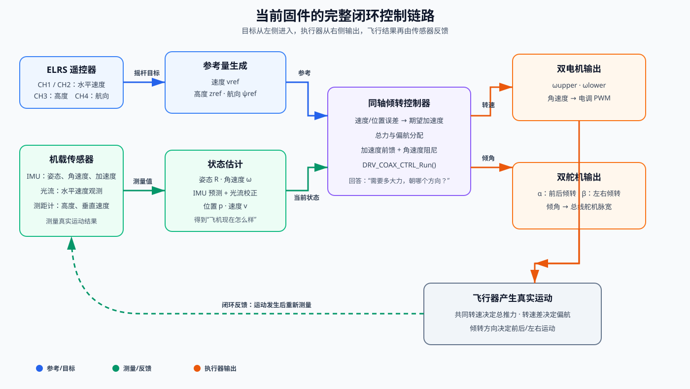
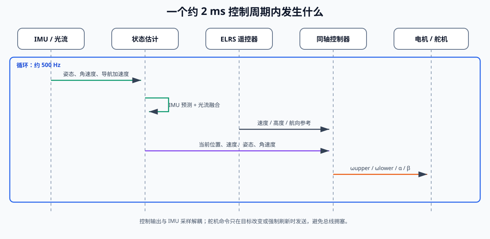
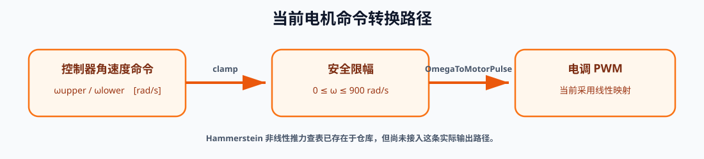
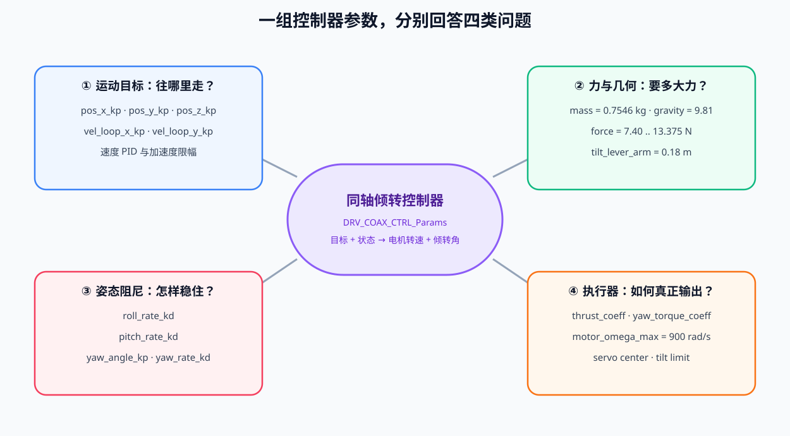
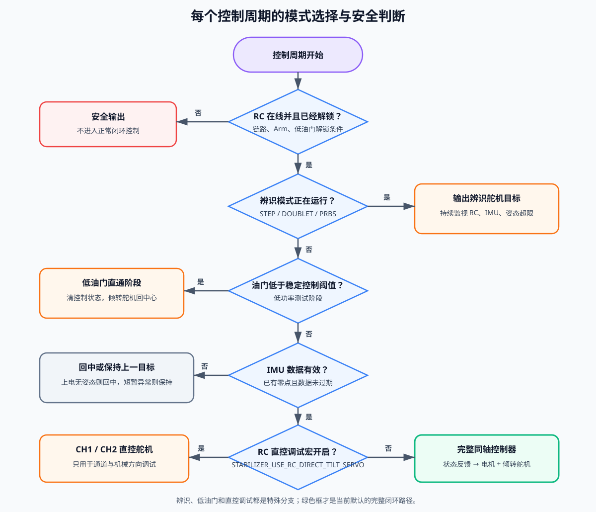

# 当前飞行控制器图解

> 本文描述 `drone-H743` 当前固件中的默认控制链路。内容以源码为准，重点回答三个问题：遥控器的动作如何变成参考量、控制器如何利用传感器计算、最后如何变成电机和舵机的输出。
>
> 文中图示均为仓库内的本地 SVG，使用 VS Code 自带的 Markdown 预览即可显示，不依赖 Mermaid 插件或网络资源。

建议阅读顺序：第一次阅读先看前半部分的图解和具体例子；需要推导、调参或写论文时，再进入后半部分“论文级数学模型与逐式解释”。后半部分严格区分理论关系、当前源码实现和仍需实验验证的假设。

## 先看结论

当前默认配置为：

```text
STABILIZER_USE_DIRECT_ANGLE_SERVO = 0
STABILIZER_USE_RC_DIRECT_TILT_SERVO = 0
STABILIZER_CONTROL_PERIOD_MS = 2 ms
```

因此正常工作时使用的是：

```text
RC 摇杆
  -> 速度/高度/航向参考
  -> IMU + 光流 + 测距计形成状态
  -> 位置/速度控制器得到期望加速度
  -> 同轴倾转旋翼控制器
  -> 两个电机转速 + 两个倾转角
  -> 电调 PWM + 总线舵机
```

它可以理解成一架“会先想清楚要产生多大的力，再决定电机转多快、喷口要朝哪里”的小型飞行器，而不是把摇杆直接翻译成某个舵机角度。

## 一张总流程图



图中蓝色链路是参考输入，绿色链路是传感器反馈，橙色链路是执行器输出。

## 控制循环的节拍

源码注释中把 IMU 采样和舵机控制分开：IMU 可以高频更新，控制输出按固定周期运行。当前 `2 ms` 对应约 `500 Hz` 的控制输出周期。



实际输出前还要经过 RC 链路、解锁状态、IMU 新鲜度、舵机校准和辨识模式等安全判断。安全条件不满足时，控制器不会继续按正常路径驱动。

## 第一步：遥控器不是直接控制姿态角

当前通道映射如下：

| 通道 | 含义 | 进入控制器后的量 | 范围或行为 |
|---|---|---|---|
| CH1 | Roll | `reference.vy_m_s` | 水平 Y 方向速度目标，最大约 `0.80 m/s` |
| CH2 | Pitch | `reference.vx_m_s` | 水平 X 方向速度目标，最大约 `0.80 m/s` |
| CH3 | Throttle/Z | `reference.z_m` | 高度参考范围约 `0..0.25 m` |
| CH4 | Yaw | `reference.yaw_rad` | 航向角参考，约 `+-30 deg` |
| CH5 | Arm | 解锁判断 | 还要同时满足油门低、RC 在线等条件 |

摇杆归一化采用中点为零的形式。以水平速度为例：

$$
v_{x,ref}=N(CH2)\,v_{xy,max},\qquad
v_{y,ref}=N(CH1)\,v_{xy,max}
$$

其中 $N(\cdot)$ 是把大约 `1000..2000 us` 映射到 `-1..+1`，$v_{xy,max}=0.8\,m/s$。

这带来一个很直观的效果：

```text
摇杆向前推  !=  立刻把机体 pitch 打到某个角度
摇杆向前推  ==  告诉系统“我希望向前运动”
系统再根据当前速度，自己计算需要多少水平加速度和倾转角
```

## 第二步：状态估计把传感器变成“当前状态”

### 姿态与角速度

IMU 经过传感器处理后提供：

```text
roll, pitch, yaw       姿态角
gyro_x, gyro_y, gyro_z 机体系角速度
acc_nav                导航坐标系加速度
```

进入 `DRV_COAX_CTRL_Run()` 前，角度和角速度从度/秒转换为弧度制：

$$
\theta_{rad}=\theta_{deg}\frac{\pi}{180},\qquad
\omega_{rad/s}=\omega_{deg/s}\frac{\pi}{180}
$$

### 水平速度：IMU 预测 + 光流校正

当前新增的导航估计器是一个二维速度 EKF，状态可以写成：

$$
x=\begin{bmatrix}v_x & v_y & b_{ax} & b_{ay}\end{bmatrix}^T
$$

IMU 预测阶段的核心关系是：

$$
v_{x,k+1}=v_{x,k}+(a_x-b_{ax})\Delta t
$$

$$
v_{y,k+1}=v_{y,k}+(a_y-b_{ay})\Delta t
$$

同时使用轻微速度泄漏和最大速度限制，避免纯积分误差无限增长。光流到来时，以光流速度作为观测：

$$
y=\begin{bmatrix}v_{x,flow} & v_{y,flow}\end{bmatrix}^T
$$

创新量为：

$$
\nu=y-\hat v
$$

系统用 NIS 门限 `9.21` 判断这次光流观测是否可信。可信则融合，不可信则拒绝。最近一次有效光流后的短时间内由 IMU 预测桥接；光流持续丢失后速度状态会快速衰减并退出速度闭环。这样光流偶尔跳变时，不会直接把速度控制器拉偏。

### 高度

测距计有效时：

```text
attitude.z_m  = -range_height_m
attitude.vz_m_s = -range_velocity_m_s
```

高度无效时，相关状态退化为零或保持安全参考，避免把一个过期测距值当成真实高度。

## 第三步：速度误差变成期望加速度

默认开启水平速度环 `coax.vel_loop_enable = 1`。速度误差为：

$$
e_{v_x}=v_{x,ref}-v_x,\qquad
e_{v_y}=v_{y,ref}-v_y
$$

代码使用带积分状态的 PID 形式生成期望水平加速度：

$$
a_{x,cmd}=K_{px}e_{v_x}+K_{ix}\int e_{v_x}dt+K_{dx}\frac{d e_{v_x}}{dt}
$$

$$
a_{y,cmd}=K_{py}e_{v_y}+K_{iy}\int e_{v_y}dt+K_{dy}\frac{d e_{v_y}}{dt}
$$

当前默认值为：

| 轴 | Kp | Ki | Kd | 输出上限 |
|---|---:|---:|---:|---:|
| X | 4.95 | 0 | 0 | `2.91 m/s^2` |
| Y | 4.81 | 0 | 0 | `2.91 m/s^2` |

这意味着现在本质上是“比例型速度环”，虽然接口和数据结构已经支持完整 PID。

如果速度环关闭，系统会把摇杆速度参考积分成一个短范围的位置参考：

$$
x_{ref,k+1}=sat(x_{ref,k}+v_{x,ref}\Delta t)
$$

然后交给位置 P 环。默认位置参数为：

```text
pos_x_kp = 2.2
pos_y_kp = 2.2
pos_z_kp = 3.8
```

## 第四步：位置/速度误差变成总力和姿态需求

`DRV_COAX_CTRL_Run()` 内部先构造一个 18 维状态：

```text
[x, y, z,
 vx, vy, vz,
 R11, R12, R13, R21, R22, R23, R31, R32, R33,
 gyro_x, gyro_y, gyro_z]
```

其中姿态角会被转换为 Z-Y-X 旋转矩阵。位置误差与速度阻尼的基本形式是：

$$
a_{pos,x}=K_{px}(x_{ref}-x),\qquad
a_{vel,x}=-K_{dx}v_x
$$

$$
a_{cmd,x}=sat(a_{pos,x}+a_{vel,x})
$$

Y、Z 轴同理，并分别受到水平和垂直加速度限幅。

对于倾转机构，当前源码明确实现的是“水平加速度前馈 + 角速度阻尼”：

$$
a_x=a_{x,ref}-K_{dx}(v_{x,ref}-v_x)
$$

$$
a_y=a_{y,ref}-K_{dy}(v_{y,ref}-v_y)
$$

$$
a_z=g-a_{z,ref}
$$

倾转前馈角为：

$$
\alpha_{ff}=atan2(a_x,a_z),\qquad
\beta_{ff}=atan2(a_y,a_z)
$$

角速度阻尼项按力矩尺度换算：

$$
S_{pitch}=m\,a_z\,l_{pitch},\qquad
S_{roll}=m\,a_z\,l_{roll}
$$

$$
\alpha= sat\left(\alpha_{ff}+\frac{K_{d,pitch}\,\omega_y}{S_{pitch}}\right)
$$

$$
\beta= sat\left(\beta_{ff}+\frac{K_{d,roll}\,\omega_x}{S_{roll}}\right)
$$

当前倾转限幅为 `+-0.314159 rad`，即 `+-18 deg`。Pitch（下方 servo2）
有效力臂为 `0.145 m`，Roll（上方 servo1）有效力臂为 `0.105 m`。

注意：`alpha` 对应 pitch/前后，`beta` 对应 roll/左右。输出时再乘以舵机方向符号，然后转换成脉宽。

## 第五步：同轴旋翼如何产生推力和偏航

生成的控制器代码返回上下电机角速度命令：

```text
omega_upper
omega_lower
```

当前包装层使用简化的平方关系解释这两个量：

$$
T=C_T(\omega_u^2+\omega_l^2)
$$

$$
\tau_z=C_Q(\omega_l^2-\omega_u^2)
$$

其中默认：

```text
C_T = 3.0e-5 N/(rad/s)^2
C_Q = 1.5e-6 N*m/(rad/s)^2
omega_max = 900 rad/s
```

因此：

```text
两台电机转速同时升高 -> 总推力增加 -> 上升
上下电机转速出现差值   -> 反扭矩变化   -> 偏航
两个倾转角改变         -> 推力方向变化 -> 前后/左右运动
```

这是共轴倾转旋翼的核心：

```text
        推力大小：主要由两台电机的“共同部分”决定
        偏航力矩：主要由两台电机的“差动部分”决定
        水平运动：主要由两个倾转角决定
```

## 第六步：从物理量到 PWM

### 电机



当前 `DRV_COAX_CTRL_OmegaToMotorPulse()` 使用线性角速度到 PWM 的映射。仓库里已经有电机 Hammerstein 查表模型，但从当前源码链路看，它还没有接入 `DRV_COAX_CTRL_Run()` 的最终电机输出路径，因此本文不把查表模型称为当前实际控制律的一部分。

### 舵机

舵机脉宽先按机械范围和倾转限幅裁剪，再发送给两个总线舵机：

```text
alpha -> servo 1 -> 前后倾转
beta  -> servo 2 -> 左右倾转
```

关键参数：

| 项目 | 舵机 1 alpha | 舵机 2 beta |
|---|---:|---:|
| 中心脉宽 | `1441 us` | `1877 us` |
| 物理脉宽范围 | `500..2500 us` | `500..2500 us` |
| 中心相关安全范围 | `500..2441 us` | `877..2500 us` |
| 总行程模型 | `180 deg` | `180 deg` |
| 控制倾角范围 | `+-90 deg` 机械安全范围 | `+-90 deg` 机械安全范围 |

所有入口现在统一按“各自中心脉宽 `+-1000 us`，再受 `500..2500 us` 物理边界”计算安全范围。当前控制器又先把倾转角限制到 `+-30 deg`，所以正常闭环下的理论脉宽范围更窄，约为：alpha `1108..1774 us`，beta `1544..2210 us`。

## 当前参数的物理意义



当前整机模型中，质量约 `0.7546 kg`，重量约 `7.40 N`，最大总推力约 `13.38 N`，估计悬停油门约 `56.1%`。这些参数决定控制器在“需要悬停”时至少要提供多大总力，以及倾转角改变时需要多大的姿态力矩。

## 所有工作模式的入口



### 低油门阶段

低于稳定控制阈值时，代码会清零水平速度/位置控制状态，并把两个倾转舵机送回中心。这样在刚解锁、低油门测试时，摇杆不会立刻让机体改变倾转姿态。

### 辨识阶段

`IDENT STEP`、`IDENT DOUBLET` 和 `IDENT PRBS` 会直接生成舵机激励，用于测量舵机到姿态/角速度的响应。它不是正常闭环控制路径，且会受到以下条件强制中止：

```text
RC 丢失、未解锁、IMU 无效、姿态角超过约 +-25 deg
```

### 直控调试阶段

若打开 `STABILIZER_USE_RC_DIRECT_TILT_SERVO`，CH1/CH2 会直接映射到两个倾转舵机，用于先验证通道和机械方向。此时不应把它误认为完整的自稳定控制器。

## 用一个具体例子理解闭环

假设飞行器当前水平向前速度为 `0.10 m/s`，遥控器希望前进 `0.50 m/s`：

```text
1. 速度误差：e_vx = 0.50 - 0.10 = 0.40 m/s
2. 速度环产生正的 ax_cmd
3. 控制器计算 alpha_ff = atan2(ax_cmd, az)
4. alpha 变为正的前后倾转角
5. 推力方向出现水平向前分量
6. 飞行器加速向前
7. 光流测得速度上升，速度误差逐渐减小
8. alpha 逐渐回到较小值，系统稳定在目标速度附近
```

这就是闭环的“追赶过程”：

```text
目标速度高于当前速度 -> 增加水平力
当前速度接近目标速度 -> 减小水平力
当前速度超过目标速度 -> 反向修正
```

## 代码对应关系

| 功能 | 主要文件 |
|---|---|
| 控制任务、RC 参考生成、模式切换、输出发送 | `Core/Src/freertos.c` |
| 同轴控制器接口和参数 | `Driver/Inc/drv_coax_ctrl.h` |
| 倾转前馈、角速度阻尼、输出转换 | `Driver/Src/drv_coax_ctrl.c` |
| 生成的核心控制算法 | `Driver/Generated/coax_ctrl/` |
| 光流/IMU 二维速度 EKF | `Driver/Src/drv_nav_ekf.c` |
| 导航估计结果发布 | `App/Src/app_nav_estimator.c` |
| 机体质量、推力、舵机几何模型 | `Driver/Inc/drv_airframe_model.h` |
| 舵机阶跃/双脉冲/PRBS 辨识 | `App/Src/app_ident.c` |

## 目前最值得注意的六个事实

1. 当前默认控制器的水平运动主要依赖倾转角，不是直接给 roll/pitch 角做大幅度 PID。
2. 速度环接口支持完整 PID，但默认 `Ki=0`、`Kd=0`，当前实际更接近比例速度控制。
3. 生成控制器计算的倾转角 `cmd[2]/cmd[3]` 没有直接送舵机，而是被包装层的加速度前馈和角速度阻尼结果覆盖。
4. 最终电机公共推力主要由 RC 油门决定；生成控制器主要提供上下电机差动，并通过测距有效时的 `+-80 us` 修正有限参与公共推力。
5. 生成代码后半段复用了旋转矩阵存储空间，其总力和航向计算需要结合仿真与实测进一步验证。
6. 电机 Hammerstein 推力模型已经存在，但当前控制链路仍使用 `omega -> PWM` 的线性映射；要使用辨识出的非线性推力和动态滞后，需要单独完成接入和验证。

## 调参时建议观察的信号

在 VOFA 或飞行日志中，优先同时观察：

```text
vel_ref_x/y       目标速度
vel_est_x/y       估计速度
vel_pid_out_x/y   速度环输出加速度
tilt_ff           倾转前馈角
tilt_rate_d       角速度阻尼角
tilt_out          最终倾转角
omega_upper/lower 两台电机转速命令
servo_alpha/beta  最终舵机脉宽
```

判断问题来源时可以按下面的顺序排查：

```text
速度目标是否正确
  -> 速度估计是否可信
  -> 速度环输出是否被限幅
  -> 倾转角是否被限幅
  -> 舵机是否到位
  -> 电机推力是否足够
  -> 机体方向符号是否正确
```

这条链路能把“飞不起来”从一个模糊现象拆成可测量的几个环节。

---

# 论文级数学模型与逐式解释

这一部分不再停留在“模块做什么”，而是按照论文中 Methods / Controller Design 章节的粒度，描述当前固件实际执行的数学关系。需要特别强调：这里描述的是 **as-implemented controller**，即代码当前真正运行的控制器，而不是一个理想化的未来方案。

## 1. 符号、坐标系与阅读约定

### 1.1 基本符号

| 符号 | 含义 | 单位 | 对应代码 |
|---|---|---:|---|
| $p=[x,y,z]^T$ | 位置状态 | m | `attitude.x_m/y_m/z_m` |
| $v=[v_x,v_y,v_z]^T$ | 速度状态 | m/s | `attitude.vx_m_s/...` |
| $a=[a_x,a_y,a_z]^T$ | 加速度或加速度命令 | m/s² | `reference.ax_m_s2/...` |
| $R_{EB}$ | 机体系到参考系的旋转矩阵 | 无量纲 | `x_rb[6..14]` |
| $\phi,\theta,\psi$ | roll、pitch、yaw | rad | `roll_rad/pitch_rad/yaw_rad` |
| $\omega_B=[p,q,r]^T$ | 机体系 roll/pitch/yaw 角速度 | rad/s | `gyro_x/y/z_rad_s` |
| $\alpha$ | 前后倾转角，对应 pitch 方向 | rad | `output.alpha_rad` |
| $\beta$ | 左右倾转角，对应 roll 方向 | rad | `output.beta_rad` |
| $\omega_u,\omega_l$ | 上、下电机角速度命令 | rad/s | `omega_upper/lower` |
| $T$ | 两台电机的总推力 | N | `total_force_n` |
| $\tau_z$ | 共轴反扭矩差形成的偏航力矩 | N·m | `yaw_torque_cmd` |
| $\Delta t$ | 当前离散采样间隔 | s | `dt_sec` |

角速度向量中的 $p,q,r$ 不要与位置向量 $p$ 混淆。飞控文献通常用 $p,q,r$ 表示绕机体 X、Y、Z 轴的角速度；本文在可能产生歧义时写成 $\omega_x,\omega_y,\omega_z$。

### 1.2 `sat`、`clamp` 与 `wrap`

文中反复出现饱和函数：

$$
\operatorname{sat}(x;l,u)=
\begin{cases}
l,&x<l\\
x,&l\le x\le u\\
u,&x>u
\end{cases}
$$

它在代码中对应 `stabilizer_clamp_f32()` 或 `coax_ctrl_clamp_f32()`。

饱和不是数学装饰，而是控制器与真实执行器之间的边界：如果期望加速度、倾转角或电机转速超过物理能力，控制器只能输出边界值。进入饱和后，系统不再是线性的，因此仅靠线性 PID 直觉不能完整预测响应。

偏航误差使用角度折返：

$$
\operatorname{wrap}_{\pi}(\delta)=((\delta+\pi)\bmod 2\pi)-\pi
$$

例如目标航向为 $-179^\circ$、当前航向为 $179^\circ$ 时，普通减法得到 $-358^\circ$，但折返后是 $+2^\circ$。控制器会选择最短旋转方向。

### 1.3 当前参考系并非严格的全球导航坐标系

`DRV_IMU_NAV` 构造的是一个“重力对齐的局部参考系”：Z 轴由低通后的重力方向确定，X 轴由机体 X 轴投影到水平面得到，Y 轴由叉乘得到。当前实现没有用 yaw 把水平轴固定到地理北向，因此它更接近 **随航向变化的水平局部坐标系**，而不是严格的 ENU/NED 世界坐标系。

这意味着本文中的 X/Y 速度应理解为控制器当前定义下的前后/左右水平速度，而不是绝对东向/北向速度。

## 2. 遥控器到参考命令

### 2.1 带死区的双向摇杆归一化

设遥控通道脉宽为 $u_{rc}$，中位为 $1500\,\mu s$，死区为 $20\,\mu s$。当前实现为：

$$
N(u_{rc})=
\begin{cases}
0,&|u_{rc}-1500|<20\\
\dfrac{\operatorname{sat}(u_{rc}-1500;-500,500)}{500},&\text{其他}
\end{cases}
$$

逐项解释：

- 减去 `1500 us`：把摇杆中点平移到零。
- `+-20 us` 死区：吸收摇杆回中抖动，避免静止时产生小速度命令。
- 限幅到 `+-500 us`：异常输入不会产生超过 `+-1` 的归一化值。
- 除以 `500`：把量纲从微秒转换为无量纲比例。

水平速度与偏航参考为：

$$
v_{x,ref}=0.8N(CH2)
$$

$$
v_{y,ref}=0.8N(CH1)
$$

$$
\psi_{ref}=0.523599N(CH4)
$$

因此水平速度目标范围是 `+-0.8 m/s`，航向目标范围是 `+-0.523599 rad`，即约 `+-30 deg`。

这里的关键架构含义是：CH1/CH2 给的是速度意图，不是 roll/pitch 角度。姿态和倾转角由后续控制器根据速度误差自动决定。

### 2.2 单向油门归一化与高度参考

CH3 使用单向归一化：

$$
H(u_{rc})=\frac{\operatorname{sat}(u_{rc}-1000;0,1000)}{1000}
$$

其输出范围为 $[0,1]$。高度参考在控制器内部使用 Z 向下为负的约定：

$$
z_{ref}=-0.25H(CH3)
$$

当 CH3 从最低推到最高时，$z_{ref}$ 从 $0$ 变为 $-0.25\,m$。与此同时，测距计高度也被写成：

$$
z=-h_{range},\qquad v_z=-\dot h_{range}
$$

因此“向上离开地面”对应更负的 Z。只要状态与参考使用同一符号，位置误差 $z_{ref}-z$ 就仍然是自洽的。

### 2.3 油门同时承担两种角色

CH3 在当前架构中并非纯高度指令，它同时用于：

1. 生成高度参考 $z_{ref}$；
2. 生成最终电机的基础 PWM；
3. 判断是否进入稳定混控区，阈值为约 `20%`；
4. 参与解锁安全判断，解锁时必须低于 `1100 us`。

这是一种“人工公共推力 + 控制器修正”的半闭环结构，而不是控制器完全接管总推力的全自主高度控制。

## 3. 姿态零点与角度单位

上电后的约 `1500 ms` 内，固件对姿态输出求平均：

$$
\bar\phi_0=\frac{1}{N}\sum_{k=1}^{N}\phi_k,\quad
\bar\theta_0=\frac{1}{N}\sum_{k=1}^{N}\theta_k,\quad
\bar\psi_0=\frac{1}{N}\sum_{k=1}^{N}\psi_k
$$

用于控制的相对姿态为：

$$
\phi_c=\phi-\bar\phi_0,\qquad
\theta_c=\theta-\bar\theta_0
$$

$$
\psi_c=\operatorname{wrap}_{\pi}(\psi-\bar\psi_0)
$$

其物理意义是把“上电时的实际安装姿态”定义为控制零姿态。这样可补偿台架不完全水平和传感器安装的小静差，但也意味着：如果上电采样期间机体在运动，零点会被污染。

进入控制器前统一转换为弧度：

$$
\theta_{rad}=\theta_{deg}\frac{\pi}{180}
$$

$$
\omega_{rad/s}=\omega_{deg/s}\frac{\pi}{180}
$$

弧度本质上是弧长与半径的比值，是无量纲量。控制器参数如 `yaw_angle_kp`、`tilt_limit_rad` 均按弧度体系设计，不能直接代入角度数值。

## 4. IMU 加速度预处理与速度积分

### 4.1 用加速度构造重力方向

加速度计测量的是比力。静止时，其读数方向与“向下重力轴”相反，因此代码首先构造：

$$
z_B=-\frac{a_B}{\|a_B\|}
$$

其中 $a_B$ 是以 g 为单位的机体系加速度计读数，$z_B$ 是参考系 Z 轴在机体系中的单位向量。

重力方向采用指数平滑：

$$
z_{B,k}=\operatorname{normalize}
\left(0.995z_{B,k-1}+0.005z_{B,meas,k}\right)
$$

`0.995` 很接近 1，表示重力方向只缓慢变化。优点是能过滤振动，缺点是持续水平加速度会被慢慢误认为重力方向变化。

### 4.2 构造水平参考基

先取机体 X 轴 $e_{xB}=[1,0,0]^T$，去掉它在重力轴上的分量：

$$
x_L'=e_{xB}-(e_{xB}^Tz_B)z_B
$$

$$
x_L=\frac{x_L'}{\|x_L'\|},\qquad y_L=z_B\times x_L
$$

这相当于把机头方向投影到水平面，得到“水平前方”X 轴，再通过右手系得到 Y 轴。

### 4.3 比力转换与去重力

加速度计读数先从 g 转为 $m/s^2$：

$$
f_B=g
\begin{bmatrix}
a_x^{(g)}&a_y^{(g)}&a_z^{(g)}
\end{bmatrix}^T
$$

然后投影到局部水平基：

$$
a_{L,x}=x_L^Tf_B
$$

$$
a_{L,y}=y_L^Tf_B
$$

$$
a_{L,z}=z_B^Tf_B+g
$$

静止时 $z_B^Tf_B\approx-g$，因此最后加上 $g$ 后得到接近零的线加速度。

需要注意：`DRV_IMU_NAV_Input` 中虽然包含 roll、pitch、yaw，但当前 `drv_imu_nav.c` 的加速度变换没有直接使用这三个角度，而是使用上述加速度重力参考构造基向量。这是当前实现与常规“用姿态旋转矩阵变换加速度”的区别。

### 4.4 零偏、低通和泄漏积分

上电零点完成后，记录局部坐标下的静态加速度偏置 $b_{a0}$：

$$
a_k^{corr}=a_k^{raw}-b_{a0}
$$

加速度低通为：

$$
\bar a_k=\alpha_a\bar a_{k-1}+(1-\alpha_a)a_k^{corr}
$$

当前 $\alpha_a=0.94$。数值越接近 1，输出越平滑，但相位滞后越大。

速度积分带泄漏：

$$
v_k=\left(v_{k-1}+\bar a_k\Delta t\right)(1-\lambda_v\Delta t)
$$

当前 `DRV_IMU_NAV` 的 $\lambda_v=0.25\,Hz$。泄漏项使没有外部观测时的速度逐渐回到零，抑制加速度零偏导致的无限漂移；代价是无法长期保持真实恒定速度。

## 5. 光流-IMU 二维速度 EKF

### 5.1 状态与过程模型

EKF 状态为：

$$
x_k=
\begin{bmatrix}
v_x&v_y&b_x&b_y
\end{bmatrix}^T
$$

其中 $b_x,b_y$ 是 EKF 在线估计的水平加速度偏置，与上一节上电捕获的固定偏置是两个不同层次。

未考虑泄漏时的离散过程模型为：

$$
v_{x,k+1}=v_{x,k}+(a_{x,k}-b_{x,k})\Delta t
$$

$$
v_{y,k+1}=v_{y,k}+(a_{y,k}-b_{y,k})\Delta t
$$

$$
b_{x,k+1}=b_{x,k},\qquad b_{y,k+1}=b_{y,k}
$$

对应状态转移矩阵：

$$
F=
\begin{bmatrix}
1&0&-\Delta t&0\\
0&1&0&-\Delta t\\
0&0&1&0\\
0&0&0&1
\end{bmatrix}
$$

负号来自 $a-b$：如果估计偏置增大，相同加速度测量对应的真实速度增量会减小。

代码另外施加预测泄漏：

$$
v_k\leftarrow v_k\operatorname{sat}(1-\lambda_{ekf}\Delta t;0,1)
$$

默认 $\lambda_{ekf}=1.5\,Hz$，并将速度限制在 `+-2.5 m/s`。

### 5.2 协方差预测

协方差预测为标准 EKF 形式：

$$
P_{k|k-1}=FP_{k-1|k-1}F^T+Q
$$

当前过程噪声近似写为对角阵：

$$
Q=\operatorname{diag}
\left((\sigma_a\Delta t)^2,(\sigma_a\Delta t)^2,
\sigma_b^2\Delta t,\sigma_b^2\Delta t\right)
$$

默认 $\sigma_a=1.5\,m/s^2$，$\sigma_b=0.08\,m/s^3$。$Q$ 越大，滤波器越不相信过程模型，后续越愿意接受光流观测修正。

### 5.3 光流观测模型

光流直接观测水平速度：

$$
z_k=
\begin{bmatrix}
v_{x,flow}&v_{y,flow}
\end{bmatrix}^T
$$

$$
H=
\begin{bmatrix}
1&0&0&0\\
0&1&0&0
\end{bmatrix}
$$

$$
R=\sigma_f^2I_2
$$

当前 $\sigma_f=0.25\,m/s$，并被限制在 `0.02..5.0 m/s`。

创新量为：

$$
\nu_k=z_k-H\hat x_{k|k-1}
$$

创新协方差为：

$$
S_k=HP_{k|k-1}H^T+R
$$

卡尔曼增益为：

$$
K_k=P_{k|k-1}H^TS_k^{-1}
$$

状态更新：

$$
\hat x_{k|k}=\hat x_{k|k-1}+K_k\nu_k
$$

协方差更新：

$$
P_{k|k}=(I-K_kH)P_{k|k-1}
$$

代码使用的是这一简化形式，随后强制协方差矩阵对称并限制对角线范围。它没有使用数值稳定性更强的 Joseph 形式。

### 5.4 NIS 异常值门限

归一化创新平方为：

$$
\operatorname{NIS}=\nu_k^TS_k^{-1}\nu_k
$$

NIS 同时考虑“误差有多大”和“滤波器原本有多不确定”。相同的速度差，在协方差很小时会得到更大的 NIS。

当前门限为 `9.21`。二维高斯观测下，它对应约 99% 的卡方门限：

$$
\operatorname{NIS}>9.21\quad\Rightarrow\quad\text{拒绝本次光流观测}
$$

### 5.5 光流丢失时的实际行为

只有在最近一次有效光流更新后的 `80 ms` 内，系统才继续用 IMU 加速度执行 EKF 预测。超过该时间后：

$$
v_k\leftarrow v_k\operatorname{sat}(1-8\Delta t;0,1)
$$

并把 EKF 加速度偏置状态清零。用于闭环速度控制的有效性要求更严格：最近光流更新时间不能超过 `150 ms`，且 $|v_x|,|v_y|\le1.5\,m/s$。

因此当前系统不是“光流丢失后长期依靠惯性导航”，而是“光流短时中断由 IMU 桥接，较长中断快速把速度估计衰减到零并退出速度闭环”。

## 6. 水平速度 PID 的实际离散实现

### 6.1 误差定义

X 轴：

$$
e_{x,k}=v_{x,ref,k}-v_{x,k}
$$

Y 轴调用时显式传入了负误差：

$$
e_{y,k}^{code}=-(v_{y,ref,k}-v_{y,k})
$$

这个负号是当前机械/坐标方向补偿的一部分。它不是 PID 理论要求，而是工程符号映射；改变光流轴向或舵机安装方向后必须重新验证。

### 6.2 P、I、D 三项

比例项：

$$
P_k=K_pe_k
$$

积分项：

$$
I_k=\operatorname{sat}
\left(I_{k-1}+K_ie_k\Delta t;-I_{max},I_{max}\right)
$$

微分项采用“对测量微分”而不是“对误差微分”：

$$
D_k=-K_d\frac{v_k-v_{k-1}}{\Delta t}
$$

这样目标速度阶跃时不会因为 $v_{ref}$ 突变产生很大的 derivative kick。负号表示当测量速度正在快速上升时，D 项施加反向抑制。

最终输出：

$$
a_{cmd,k}=\operatorname{sat}
\left(P_k+I_k+D_k;-a_{max},a_{max}\right)
$$

当前默认参数：

| 轴 | $K_p$ | $K_i$ | $K_d$ | $I_{max}$ | $a_{max}$ |
|---|---:|---:|---:|---:|---:|
| X | 4.95 | 0 | 0 | 0 | 2.91 m/s² |
| Y | 4.81 | 0 | 0 | 0 | 2.91 m/s² |

所以默认情况下：

$$
a_{x,cmd}\approx\operatorname{sat}(4.95e_x;-2.91,2.91)
$$

$$
a_{y,cmd}\approx\operatorname{sat}(4.81e_y^{code};-2.91,2.91)
$$

当 $|e_x|>2.91/4.95\approx0.588\,m/s$ 时，X 轴比例输出已经进入饱和；Y 轴阈值约为 $0.605\,m/s$。

当前积分器只有“积分状态限幅”，没有基于最终输出饱和的回算型 anti-windup。默认 $K_i=0$，所以暂时不存在积分饱和问题；未来启用积分项时需要重新评估。

## 7. 控制参考在任务层与驱动层之间的传递

速度环有效时，任务层将 PID 输出写入：

$$
reference.ax=a_{x,cmd},\qquad reference.ay=a_{y,cmd}
$$

同时设置：

$$
reference.vx=attitude.vx,qquad reference.vy=attitude.vy
$$

$$
reference.x=attitude.x,qquad reference.y=attitude.y
$$

这会把驱动层内部的水平位置误差和速度参考误差主动置零，避免“任务层速度 PID”和“生成控制器位置环”重复控制同一个自由度。水平控制权主要交给任务层速度 PID 的 $a_{cmd}$。

速度环无效时，摇杆速度意图被积分成虚拟位置：

$$
x_{ref,k}=\operatorname{sat}
\left(x_{ref,k-1}+v_{x,ref}\Delta t;-0.35,0.35\right)
$$

$$
y_{ref,k}=\operatorname{sat}
\left(y_{ref,k-1}+v_{y,ref}\Delta t;-0.35,0.35\right)
$$

这不是完整的位置估计，而是在当前位置附近构造一个最大 `+-0.35 m` 的虚拟位置误差。

## 8. `DRV_COAX_CTRL_Run()` 的状态组织

控制器接收的 18 维状态为：

$$
x_{rb}=
\begin{bmatrix}
x&y&z&v_x&v_y&v_z&\operatorname{vec}(R_{EB})^T&
\omega_x&\omega_y&\omega_z
\end{bmatrix}^T
$$

参考向量为：

$$
r=
\begin{bmatrix}
x_{ref}&y_{ref}&z_{ref}&\psi_{ref}
\end{bmatrix}^T
$$

ZYX 欧拉角对应的旋转矩阵为：

$$
R_{EB}=R_z(\psi)R_y(\theta)R_x(\phi)
$$

展开后：

$$
R_{EB}=
\begin{bmatrix}
c_\psi c_\theta & c_\psi s_\theta s_\phi-s_\psi c_\phi & c_\psi s_\theta c_\phi+s_\psi s_\phi\\
s_\psi c_\theta & s_\psi s_\theta s_\phi+c_\psi c_\phi & s_\psi s_\theta c_\phi-c_\psi s_\phi\\
-s_\theta & c_\theta s_\phi & c_\theta c_\phi
\end{bmatrix}
$$

其中 $c_\theta=\cos\theta$、$s_\theta=\sin\theta$，其他角同理。代码按列主序写入 `x_rb[6..14]`，与生成代码的矩阵索引方式一致。

### 8.1 参考预补偿

包装层在位置参考进入生成代码前做：

$$
x_{ref}'=x_{ref}+\frac{K_{dx}v_{x,ref}+a_{x,ref}}{K_{px}}
$$

Y、Z 轴同理。代入位置 P-D 结构：

$$
K_p(x_{ref}'-x)-K_dv
$$

可以看出 $a_{ref}$ 被等效为前馈加速度，$v_{ref}$ 被等效为速度前馈。速度环开启时，任务层又令 $v_{ref}=v$、$x_{ref}=x$，因此最终水平驱动力主要来自 $a_{ref}=a_{cmd}$。

## 9. 生成控制器中的力与偏航分配

### 9.1 理论位置-速度加速度命令

生成代码的结构可概括为：

$$
a_E^{cmd}=K_p(p_{ref}-p)-K_d\tilde v
$$

并分别进行水平、垂直限幅：

$$
a_x,a_y\in[-a_{xy,max},a_{xy,max}],\qquad
a_z\in[-a_{z,max},a_{z,max}]
$$

代码中的 $\tilde v$ 不是直接使用原始速度，而是使用一个旋转矩阵正交性修正项：

$$
C_R=k_RR_{EB}(I-R_{EB}^TR_{EB})
$$

$$
\tilde v=C_Rv
$$

若 $R_{EB}$ 完全正交，则 $R_{EB}^TR_{EB}=I$，理论上 $C_R=0$。这个项通常用于把数值积分后的旋转矩阵拉回 $SO(3)$ 流形附近，而不是常规的速度坐标变换。

### 9.2 当前生成代码的实现注意点

生成文件随后复用了存储 `R_EB` 的数组保存 $C_R$，并在后续力变换和航向提取中继续读取这个数组。也就是说，后续计算实际使用的是修正矩阵 $C_R$，而不是最初输入的完整旋转矩阵。

这是当前生成代码必须通过仿真和日志进一步验证的实现细节。对于近似正交的输入旋转矩阵，$C_R$ 会接近零，从而使生成控制器的总力计算趋向最低推力边界。文档在此只陈述源码行为，不把它当作已经验证正确的理论设计。

### 9.3 期望力

生成代码构造的惯性系期望力可写成：

$$
F_E^{des}=m
\begin{bmatrix}
a_x^{cmd}\\
a_y^{cmd}\\
a_z^{cmd}-g
\end{bmatrix}
$$

再转换到机体系并取模：

$$
F_B^{des}=R^TF_E^{des}
$$

$$
T_{des}=\|F_B^{des}\|_2
$$

推力方向单位向量为：

$$
n_T=-\frac{F_B^{des}}{\max(T_{des},\epsilon)}
$$

其中 $\epsilon=10^{-6}$ 防止除零。当力向量过小时，代码回退到 $[0,0,1]^T$。

总力最终限制为：

$$
T=\operatorname{sat}
\left(T_{des};T_{min},T_{max}\right)
$$

当前 $T_{min}=mg\approx7.40\,N$，$T_{max}\approx13.38\,N$。因此生成控制器不会命令低于悬停重量的总力。

## 10. 倾转角：生成结果与实际采用结果

### 10.1 生成控制器原本计算的倾转角

生成代码原本包含：

$$
\alpha_{gen}=\operatorname{sat}
\left(\operatorname{atan2}(n_{T,x},n_{T,z})+
\frac{-K_{p\theta}\theta-K_{d\theta}\omega_y}{Tl};
-\alpha_{max},\alpha_{max}\right)
$$

$$
\beta_{gen}=\operatorname{sat}
\left(\arcsin(-n_{T,y})+
\frac{-K_{p\phi}\phi-K_{d\phi}\omega_x}{Tl};
-\beta_{max},\beta_{max}\right)
$$

其中 $Tl$ 是推力与倾转力臂的乘积，量纲为 N·m。姿态误差力矩除以 $Tl$ 后得到近似所需倾转角。

### 10.2 当前包装层覆盖了生成倾转角

`DRV_COAX_CTRL_Run()` 调用生成控制器后，只保留：

```text
cmd[0] -> omega_upper
cmd[1] -> omega_lower
```

随后调用 `coax_ctrl_compute_pure_damping_tilt()` 重新计算 $\alpha,\beta$。因此当前舵机实际执行的不是 $\alpha_{gen},\beta_{gen}$，而是下面的手写控制律。

### 10.3 当前实际倾转控制律

首先形成水平加速度需求：

$$
a_x^*=a_{x,ref}-K_{dx}(v_{x,ref}-v_x)
$$

$$
a_y^*=a_{y,ref}-K_{dy}(v_{y,ref}-v_y)
$$

并限幅到 `+-accel_xy_limit_m_s2`。

垂直方向使用：

$$
a_z^*=g-a_{z,ref}
$$

前馈倾转角：

$$
\alpha_{ff}=\operatorname{atan2}(a_x^*,a_z^*)
$$

$$
\beta_{ff}=\operatorname{atan2}(a_y^*,a_z^*)
$$

`atan2(水平加速度, 垂直加速度)` 给出所需推力方向与竖直方向之间的夹角。例如 $a_x^*=1\,m/s^2$、$a_z^*=9.81\,m/s^2$ 时：

$$
\alpha_{ff}=\arctan(1/9.81)\approx0.1016\,rad\approx5.82^\circ
$$

随后计算推力-力臂尺度：

$$
S_{pitch}=ma_z^*l_{pitch},\qquad
S_{roll}=ma_z^*l_{roll}
$$

量纲检查：$kg\cdot m/s^2\cdot m=N\cdot m$，它代表单位倾转角附近可用于产生姿态力矩的尺度。

角速度阻尼修正：

$$
\alpha_d=\frac{K_{d,pitch}\omega_y}{S_{pitch}}
$$

$$
\beta_d=\frac{K_{d,roll}\omega_x}{S_{roll}}
$$

最终输出：

$$
\alpha=\operatorname{sat}(\alpha_{ff}+\alpha_d;-\theta_{tilt,max},\theta_{tilt,max})
$$

$$
\beta=\operatorname{sat}(\beta_{ff}+\beta_d;-\theta_{tilt,max},\theta_{tilt,max})
$$

默认 $K_{d,pitch}=K_{d,roll}=-0.5$。因此正角速度会产生负方向倾转修正，构成阻尼。默认角度 P 增益为零，所以当前 roll/pitch 姿态角本身没有直接进入实际舵机控制律。

速度环开启时，任务层令 $v_{ref}=v$，并把速度 PID 输出写入 $a_{ref}$；又因为默认 `vel_x_kd=vel_y_kd=0`，实际可近似为：

$$
\alpha\approx\operatorname{atan2}(a_{x,PID},g)+\alpha_d
$$

$$
\beta\approx\operatorname{atan2}(a_{y,PID},g)+\beta_d
$$

## 11. 偏航控制与双电机平方分配

偏航误差：

$$
e_\psi=\operatorname{wrap}_{\pi}(\psi_{ref}-\psi)
$$

目标偏航角速度：

$$
r_{cmd}=\operatorname{sat}
\left(K_{p\psi}e_\psi;-r_{max},r_{max}\right)
$$

偏航角加速度/力矩需求在生成代码中写成：

$$
\tau_z^*=J_z(r_{cmd}-K_{d\psi}\omega_z)
$$

考虑倾转后垂直反扭矩投影，代码除以 $\cos\alpha\cos\beta$。定义：

$$
\Sigma=\frac{T}{C_T}=\omega_u^2+\omega_l^2
$$

$$
\Delta=\frac{\tau_z^*}
{C_Q\cos\alpha\cos\beta}
=\omega_l^2-\omega_u^2
$$

联立求解：

$$
\omega_u^2=\frac{\Sigma-\Delta}{2}
$$

$$
\omega_l^2=\frac{\Sigma+\Delta}{2}
$$

再进行非负与最大转速平方限幅：

$$
\omega_i=\sqrt{\operatorname{sat}
(\omega_i^2;0,\omega_{max}^2)}
$$

这组公式清楚地区分了共模和差模：

- $\Sigma$ 控制两台电机平方转速之和，主要决定总推力；
- $\Delta$ 控制平方转速之差，主要决定偏航力矩。

当前默认参数中 `yaw_inertia=0.52`，而机体模型估计的 $I_{zz}=0.00035\,kg\cdot m^2$，两者相差很大。因此 `yaw_inertia` 更像当前控制分配中的调节尺度或遗留参数，不能直接当作已经验证的真实转动惯量。

## 12. 电机角速度到 PWM

控制器角速度命令先线性映射到电调脉宽：

$$
u_i^{ctrl}=1100+
\frac{\operatorname{sat}(\omega_i;0,900)}{900}(1940-1100)
$$

单位为 $\mu s$。这意味着控制器假设“角速度与 PWM 成线性关系”。实际电机推力更接近 PWM 的非线性函数，并带一阶滞后；仓库中的 Hammerstein 模型尚未接入这条路径。

## 13. 最终电机 PWM 混控：当前架构的关键

### 13.1 控制器平均量与差动量

先定义控制器输出 PWM 的平均值：

$$
\bar u^{ctrl}=\frac{u_u^{ctrl}+u_l^{ctrl}}{2}
$$

每台电机的差动分量为：

$$
\delta u_u=u_u^{ctrl}-\bar u^{ctrl}
$$

$$
\delta u_l=u_l^{ctrl}-\bar u^{ctrl}
$$

显然：

$$
\delta u_u+\delta u_l=0
$$

所以该差动分量只重新分配上下电机，不改变两台电机的平均 PWM，主要保留偏航控制作用。

### 13.2 悬停参考与高度公共修正

根据平方推力模型，两台电机等转速悬停时：

$$
2C_T\omega_h^2=mg
$$

$$
\omega_h=\sqrt{\frac{mg}{2C_T}}
$$

代入当前参数：

$$
\omega_h\approx
\sqrt{\frac{0.7546\times9.81}{2\times3.0\times10^{-5}}}
\approx351.3\,rad/s
$$

悬停角速度再通过线性映射得到 $u_h$。控制器公共修正为：

$$
\Delta u_h=\operatorname{sat}
(\bar u^{ctrl}-u_h;-80,80)
$$

只有测距计有效时才应用该修正；测距无效时 $\Delta u_h=0$。

### 13.3 最终输出公式

令遥控油门映射得到的基础 PWM 为 $u_{rc}$，最终上下电机输出为：

$$
u_u=\operatorname{sat}
(u_{rc}+\delta u_u+\Delta u_h;1100,1940)
$$

$$
u_l=\operatorname{sat}
(u_{rc}+\delta u_l+\Delta u_h;1100,1940)
$$

展开后就是源码中的：

$$
u_i=u_{rc}+u_i^{ctrl}-\bar u^{ctrl}+\Delta u_h
$$

这说明当前电机控制权的分配为：

| 分量 | 来源 | 主要作用 |
|---|---|---|
| $u_{rc}$ | 人工 CH3 油门 | 决定主要公共推力 |
| $u_i^{ctrl}-\bar u^{ctrl}$ | 生成控制器 | 保留上下电机差动，主要控制偏航 |
| $\Delta u_h$ | 控制器平均推力相对悬停值 | 仅在测距有效时提供 `+-80 us` 公共修正 |

因此当前不是“控制器绝对转速直接驱动电机”，而是“人工公共油门为主、控制器差动和有限高度修正为辅”。理解这一点对于分析高度环性能至关重要。

## 14. 倾转角到舵机脉宽

舵机模型总行程为 `180 deg`，物理脉宽跨度为 `2000 us`。因此：

$$
k_s=\frac{2500-500}{180\pi/180}
\approx636.62\,\mu s/rad
$$

`SERVO_LIMIT_DEG = 90°` 对应的中心相对脉宽跨度为：

$$
\Delta u_{90}=k_s\frac{\pi}{2}
=636.62\times\frac{\pi}{2}
\approx1000\,\mu s
$$

因此每个舵机不能再共享固定上下限，而应根据各自标定中心 $u_{i,0}$ 计算：

$$
u_{i,min}=\max(500,u_{i,0}-1000)
$$

$$
u_{i,max}=\min(2500,u_{i,0}+1000)
$$

代入当前中心：

$$
u_{\alpha,min}=\max(500,1441-1000)=500\,\mu s
$$

$$
u_{\alpha,max}=\min(2500,1441+1000)=2441\,\mu s
$$

$$
u_{\beta,min}=\max(500,1877-1000)=877\,\mu s
$$

$$
u_{\beta,max}=\min(2500,1877+1000)=2500\,\mu s
$$

这就是当前中心相关安全范围：

| 轴 | 标定中心 | `-90°` 安全端点 | `+90°` 安全端点 |
|---|---:|---:|---:|
| alpha | `1441 us` | `500 us`，受到物理下限裁剪 | `2441 us` |
| beta | `1877 us` | `877 us` | `2500 us`，受到物理上限裁剪 |

脉宽关系：

$$
u_\alpha=\operatorname{sat}
(u_{\alpha,0}+s_\alpha k_s\alpha;u_{\alpha,min},u_{\alpha,max})
$$

$$
u_\beta=\operatorname{sat}
(u_{\beta,0}+s_\beta k_s\beta;u_{\beta,min},u_{\beta,max})
$$

当前：

```text
u_alpha,0 = 1441 us
u_beta,0  = 1877 us
s_alpha = +1
s_beta  = +1
```

控制器倾转角先被限制到 `+-30 deg`。因为：

$$
\Delta u_{30}=k_s\frac{\pi}{6}\approx333.33\,\mu s
$$

所以正常闭环控制的理论脉宽范围是：

$$
u_\alpha\in[1441-333,1441+333]
\approx[1108,1774],\mu s
$$

$$
u_\beta\in[1877-333,1877+333]
\approx[1544,2210],\mu s
$$

这两个闭环范围都位于各自的 `+-90°` 安全范围内。手动命令和辨识模块也按 alpha/beta 各自的中心相关安全范围检查，不再使用两轴共用的固定上下限。

以 $\alpha=10^\circ=0.17453\,rad$ 为例：

$$
\Delta u_\alpha\approx636.62\times0.17453\approx111.1\,\mu s
$$

所以舵机 1 目标约为：

$$
u_\alpha\approx1441+111=1552\,\mu s
$$

## 15. 多速率、离散化与真实执行带宽

控制计算门限为：

$$
T_c=2\,ms,\qquad f_c=\frac{1}{T_c}=500\,Hz
$$

但实际系统是多速率的：

| 环节 | 典型速率/行为 |
|---|---|
| IMU 数据 | 约 1 kHz，按时间戳计算 $\Delta t$ |
| 控制计算 | 最快约 500 Hz |
| 光流 | 由传感器实际输出速率决定，新样本才融合 |
| 测距计 | 异步更新，高度过期时退出修正 |
| 舵机总线 | 目标变化至少 `3 us` 或每 `500 ms` 强制刷新才发送 |
| VOFA | 约 40 Hz，仅用于观测，不代表控制频率 |

所以“代码每 2 ms 算一次”不等于“机械舵机能以 500 Hz 响应”。闭环带宽最终受舵机动态、电机滞后、光流延迟和通信刷新策略共同限制。

## 16. 饱和链与安全链

一个水平速度命令可能依次经历：

```text
RC 归一化限幅
  -> 速度目标 +-0.8 m/s
  -> 速度 PID 输出 +-2.91 m/s²
  -> 倾转加速度限幅
  -> 倾转角 +-30 deg
  -> 舵机机械脉宽范围
```

电机路径则经历：

```text
总力 min/max
  -> 电机平方转速非负限幅
  -> omega <= 900 rad/s
  -> PWM 1100..1940 us
  -> 最终 RC 混控再次限幅
```

每个饱和点都可能成为闭环性能瓶颈。调参时如果只看最终舵机或电机输出，无法判断上游哪个环节先进入了饱和。

## 17. 当前控制器的结构性总结

用控制理论语言概括，当前系统是：

```text
二维光流速度 EKF
  + 水平速度 P 控制器（PID 框架，默认 I/D 为零）
  + 水平加速度到倾转角的动态逆/前馈映射
  + roll/pitch 角速度阻尼
  + 生成代码中的总力与偏航平方转速分配
  + 人工公共油门和控制器差动混控
  + 有限幅度的测距高度公共推力修正
```

它不是经典四旋翼常见的“位置环 → 速度环 → 姿态角环 → 角速度环 → 电机混控”完整串级 PID。当前 roll/pitch 实际舵机路径没有独立姿态角闭环，主要依靠：

$$
\text{速度误差}\rightarrow\text{水平加速度}\rightarrow\text{倾转前馈角}
$$

以及：

$$
\text{机体角速度}\rightarrow\text{倾转阻尼修正}
$$

## 18. 尚需实验验证的理论-实现接口

论文级描述必须同时陈述模型边界。当前最需要通过实验或仿真确认的是：

1. X/Y 光流速度、RC 通道和 $\alpha/\beta$ 舵机方向的完整符号闭环。
2. 生成代码复用旋转矩阵数组后，总力和航向计算是否符合原始 Simulink 设计意图。
3. `yaw_inertia=0.52` 与机体估计 $I_{zz}=0.00035$ 的量纲和来源。
4. 线性 `omega -> PWM` 与真实 Hammerstein 电机模型之间的误差。
5. 舵机实际带宽是否足以支持 `500 Hz` 控制计算产生的高频命令。
6. 光流丢失 `80/150 ms` 门限与 `8 Hz` 速度衰减是否会造成控制模式突变。
7. CH3 同时作为人工油门和高度参考时，操作者输入与高度闭环修正之间的耦合。

这些项目不代表控制器一定错误，而是区分“代码中存在的公式”和“已经由实物证据验证的模型”所必需的科研严谨性。
